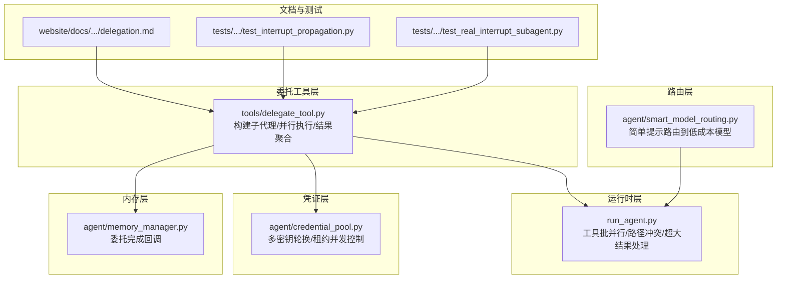
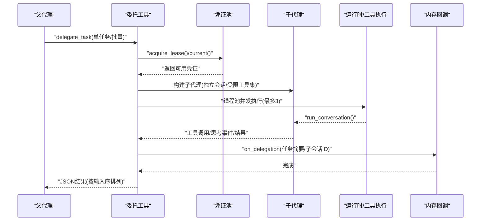
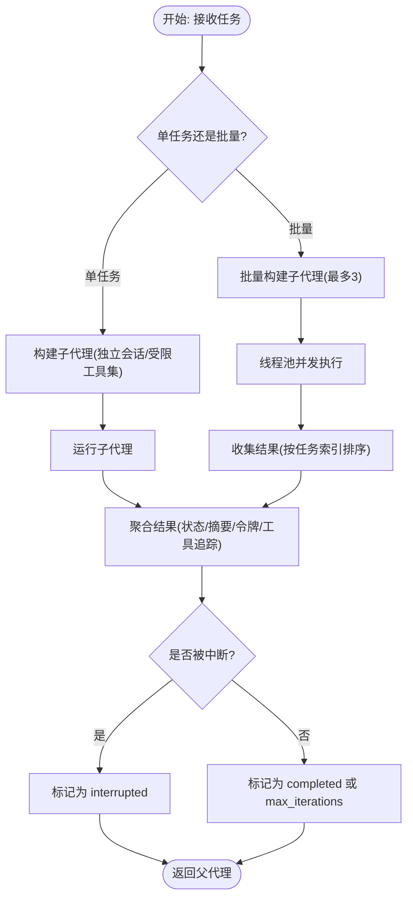
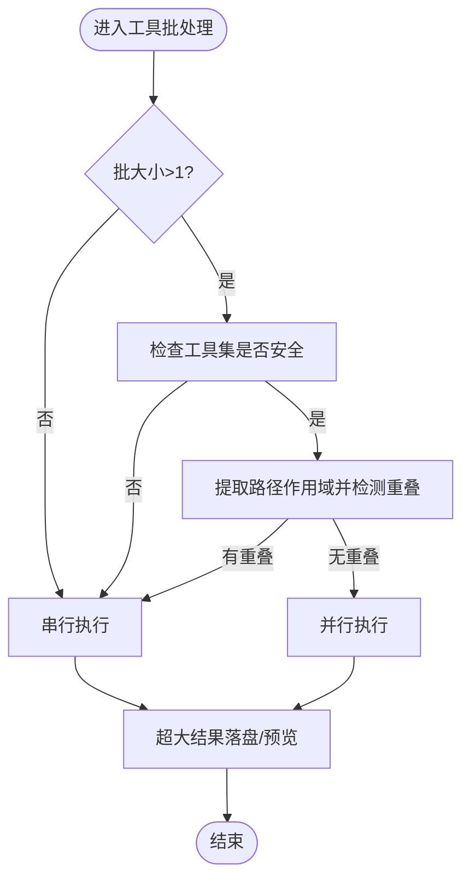
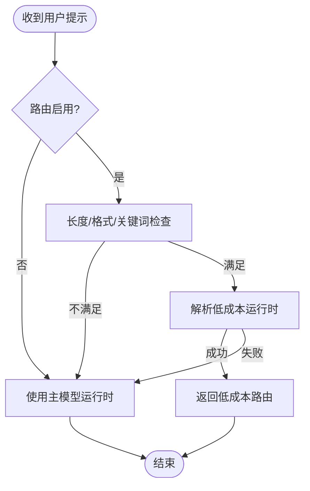
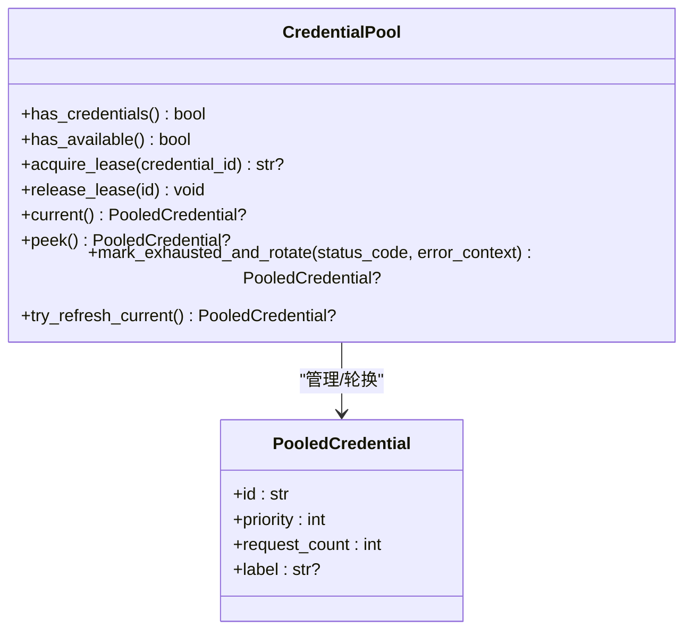
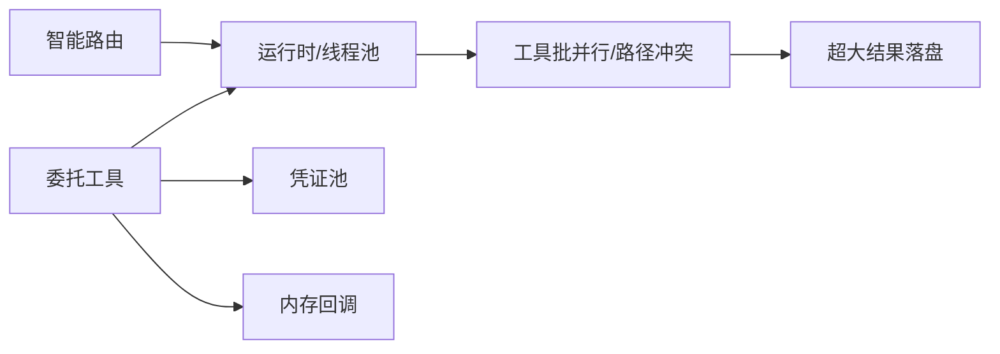

# 委托与并行化

<cite>
**本文引用的文件**
- [tools/delegate_tool.py](file://tools/delegate_tool.py)
- [agent/smart_model_routing.py](file://agent/smart_model_routing.py)
- [run_agent.py](file://run_agent.py)
- [agent/credential_pool.py](file://agent/credential_pool.py)
- [agent/memory_manager.py](file://agent/memory_manager.py)
- [website/docs/user-guide/features/delegation.md](file://website/docs/user-guide/features/delegation.md)
- [gateway/run.py](file://gateway/run.py)
- [tests/tools/test_llm_content_none_guard.py](file://tests/tools/test_llm_content_none_guard.py)
- [tests/run_agent/test_agent_loop.py](file://tests/run_agent/test_agent_loop.py)
- [tests/run_agent/test_interrupt_propagation.py](file://tests/run_agent/test_interrupt_propagation.py)
- [tests/cli/test_cli_interrupt_subagent.py](file://tests/cli/test_cli_interrupt_subagent.py)
- [tests/run_agent/test_real_interrupt_subagent.py](file://tests/run_agent/test_real_interrupt_subagent.py)
</cite>

## 目录
1. [简介](#简介)
2. [项目结构](#项目结构)
3. [核心组件](#核心组件)
4. [架构总览](#架构总览)
5. [详细组件分析](#详细组件分析)
6. [依赖分析](#依赖分析)
7. [性能考量](#性能考量)
8. [故障排查指南](#故障排查指南)
9. [结论](#结论)
10. [附录](#附录)

## 简介
本文件系统性阐述 Hermes Agent 的委托与并行化能力，覆盖以下关键主题：
- 子代理机制：任务分解、子任务分配、结果聚合与上下文隔离
- 并行执行策略：线程池并发、工具级并行、资源调度与冲突避免
- 智能模型路由：基于任务类型的低成本/高性能模型选择
- 配置与运行时：委托配置项、超时管理、错误处理与中断传播
- 监控与统计：进度展示、令牌用量、工具调用追踪与内存回调
- 安全与最佳实践：工具集限制、凭证轮换、沙箱与环境隔离

## 项目结构
委托与并行化相关代码主要分布在如下模块：
- 工具层：委托工具负责构建子代理、并行执行与结果聚合
- 运行时层：AIAgent 循环负责工具批处理并行化、路径冲突检测与超大结果处理
- 路由层：智能模型路由在单轮对话中按提示特征选择更合适的模型
- 凭证层：凭证池支持多密钥轮换与并发租约控制
- 内存层：委托完成后向内存提供方上报子任务摘要
- 文档与测试：官方用户文档与大量端到端测试验证行为

图表来源
- [tools/delegate_tool.py:1-979](file://tools/delegate_tool.py#L1-L979)
- [run_agent.py:262-304](file://run_agent.py#L262-L304)
- [agent/smart_model_routing.py:62-107](file://agent/smart_model_routing.py#L62-L107)
- [agent/credential_pool.py:352-780](file://agent/credential_pool.py#L352-L780)
- [agent/memory_manager.py:330-337](file://agent/memory_manager.py#L330-L337)
- [website/docs/user-guide/features/delegation.md:1-223](file://website/docs/user-guide/features/delegation.md#L1-L223)
- [tests/run_agent/test_interrupt_propagation.py:138-161](file://tests/run_agent/test_interrupt_propagation.py#L138-L161)
- [tests/run_agent/test_real_interrupt_subagent.py:154-186](file://tests/run_agent/test_real_interrupt_subagent.py#L154-L186)

章节来源
- [website/docs/user-guide/features/delegation.md:1-223](file://website/docs/user-guide/features/delegation.md#L1-L223)

## 核心组件
- 委托工具（delegate_task）
  - 支持单任务与批量任务（最多 3 个并发）；每个子代理拥有独立会话、受限工具集与专用系统提示
  - 提供进度回调、思考事件转发、工具调用追踪与令牌用量统计
  - 结果按输入顺序排序，支持中断传播与内存回调
- 工具批并行化（run_agent）
  - 批量工具调用的安全并行判定：排除危险工具、路径冲突检测、仅允许安全工具
  - 超大工具结果落盘与预览、预算警告清理、代理字符清洗
- 智能模型路由（smart_model_routing）
  - 基于提示长度、关键词集合与格式特征判断是否走低成本模型
  - 单轮解析有效运行时凭据，失败回退主模型
- 凭证池（credential_pool）
  - 多密钥轮换、租约并发上限、冷却与刷新、错误码驱动的自动旋转
- 内存回调（memory_manager）
  - 委托完成后通知各内存提供方记录任务摘要与子会话 ID

章节来源
- [tools/delegate_tool.py:510-691](file://tools/delegate_tool.py#L510-L691)
- [run_agent.py:262-304](file://run_agent.py#L262-L304)
- [agent/smart_model_routing.py:62-107](file://agent/smart_model_routing.py#L62-L107)
- [agent/credential_pool.py:352-780](file://agent/credential_pool.py#L352-L780)
- [agent/memory_manager.py:330-337](file://agent/memory_manager.py#L330-L337)

## 架构总览
委托与并行化在“工具层-运行时层-路由层-凭证层-内存层”之间形成清晰分层，数据流从委托入口进入，经由子代理执行与并行化策略，最终汇总到父代理上下文。

图表来源
- [tools/delegate_tool.py:510-691](file://tools/delegate_tool.py#L510-L691)
- [agent/credential_pool.py:766-780](file://agent/credential_pool.py#L766-L780)
- [agent/memory_manager.py:330-337](file://agent/memory_manager.py#L330-L337)

## 详细组件分析

### 子代理机制与任务分解
- 任务分解
  - 单任务：直接运行，避免线程池开销
  - 批量任务：最多 3 个并发，使用线程池执行，结果按任务索引排序
- 子任务分配
  - 每个子代理拥有独立会话 ID、终端会话、文件缓存与受限工具集
  - 系统提示聚焦目标与上下文，要求子代理提供“做了什么/发现了什么/修改了哪些文件/遇到的问题”
  - 工具集自动继承父代理启用状态，但移除被禁止的工具集
- 结果聚合
  - 汇总字段：状态、摘要、API 调用次数、耗时、退出原因、令牌用量、工具追踪
  - 对工具调用与结果进行配对，支持并行场景下的 id 匹配
  - 中断传播：父代理中断会触发所有活跃子代理中断

图表来源
- [tools/delegate_tool.py:510-691](file://tools/delegate_tool.py#L510-L691)
- [tools/delegate_tool.py:338-497](file://tools/delegate_tool.py#L338-L497)

章节来源
- [tools/delegate_tool.py:48-106](file://tools/delegate_tool.py#L48-L106)
- [tools/delegate_tool.py:196-336](file://tools/delegate_tool.py#L196-L336)
- [tools/delegate_tool.py:338-497](file://tools/delegate_tool.py#L338-L497)
- [tools/delegate_tool.py:510-691](file://tools/delegate_tool.py#L510-L691)
- [website/docs/user-guide/features/delegation.md:120-130](file://website/docs/user-guide/features/delegation.md#L120-L130)

### 并行执行策略与冲突避免
- 线程池并发
  - 最大并发数：3；批量任务数组超过 3 会被截断
  - 单任务不使用线程池，降低开销
- 工具批并行判定
  - 不安全工具拒绝并行（如涉及破坏性命令或跨进程共享状态）
  - 路径作用域工具进行路径重叠检测，避免同一子树写入冲突
  - 仅允许已知安全工具参与并行
- 超大结果处理
  - 超过阈值的工具结果写入临时文件，保留前缀预览，避免上下文爆炸
- 预算压力与历史净化
  - 自动清理预算警告消息，防止泄漏到历史中

图表来源
- [run_agent.py:262-304](file://run_agent.py#L262-L304)
- [run_agent.py:306-332](file://run_agent.py#L306-L332)
- [run_agent.py:422-449](file://run_agent.py#L422-L449)
- [run_agent.py:378-406](file://run_agent.py#L378-L406)

章节来源
- [run_agent.py:262-304](file://run_agent.py#L262-L304)
- [run_agent.py:306-332](file://run_agent.py#L306-L332)
- [run_agent.py:422-449](file://run_agent.py#L422-L449)
- [run_agent.py:378-406](file://run_agent.py#L378-L406)

### 智能模型路由
- 触发条件
  - 启用开关开启且配置了低成本模型
  - 提示满足长度、换行、代码块、URL、复杂关键词等保守规则
- 解析流程
  - 若满足简单提示条件，解析低成本提供商运行时凭据
  - 解析失败则回退到主模型运行时配置
- 标签与签名
  - 返回带标签的路由信息与签名，便于调试与一致性校验

图表来源
- [agent/smart_model_routing.py:62-107](file://agent/smart_model_routing.py#L62-L107)
- [agent/smart_model_routing.py:110-194](file://agent/smart_model_routing.py#L110-L194)

章节来源
- [agent/smart_model_routing.py:62-107](file://agent/smart_model_routing.py#L62-L107)
- [agent/smart_model_routing.py:110-194](file://agent/smart_model_routing.py#L110-L194)

### 凭证轮换与并发控制
- 租约机制
  - 子代理可从父代理凭证池获取租约，避免固定密钥被限流卡死
  - 每个凭证设置最大并发租约上限，超限时自动轮换
- 错误驱动旋转
  - 429/401 等错误触发冷却与旋转，必要时刷新当前条目
- 策略选择
  - 支持随机、最少使用、轮询等多种策略，按提供商标记优先级

图表来源
- [agent/credential_pool.py:352-780](file://agent/credential_pool.py#L352-L780)

章节来源
- [agent/credential_pool.py:352-780](file://agent/credential_pool.py#L352-L780)

### 内存回调与委托结果记录
- 委托完成后，父代理通过内存管理器向各内存提供方回调子任务摘要与子会话 ID
- 回调失败会被静默记录日志，不影响主流程

章节来源
- [agent/memory_manager.py:330-337](file://agent/memory_manager.py#L330-L337)
- [tools/delegate_tool.py:673-684](file://tools/delegate_tool.py#L673-L684)

### 超时管理与错误处理
- 委托工具
  - 支持 per-child 最大迭代次数配置，默认 50；批量模式下并发度限制为 3
  - 异常捕获并返回结构化错误信息，包含耗时与 API 调用计数
- 工具批处理
  - 超大结果落盘与预览，避免上下文膨胀
  - 预算警告清理，防止重复提示污染历史
- 测试验证
  - 多轮中断传播测试确保父中断能快速传递至子代理
  - MoA 工具对空内容的健壮性处理，避免 AttributeError

章节来源
- [tools/delegate_tool.py:510-691](file://tools/delegate_tool.py#L510-L691)
- [run_agent.py:422-449](file://run_agent.py#L422-L449)
- [run_agent.py:378-406](file://run_agent.py#L378-L406)
- [tests/run_agent/test_interrupt_propagation.py:138-161](file://tests/run_agent/test_interrupt_propagation.py#L138-L161)
- [tests/run_agent/test_real_interrupt_subagent.py:154-186](file://tests/run_agent/test_real_interrupt_subagent.py#L154-L186)
- [tests/tools/test_llm_content_none_guard.py:45-67](file://tests/tools/test_llm_content_none_guard.py#L45-L67)

### 任务监控、进度跟踪与性能统计
- 进度展示
  - CLI 模式：在委托进行时以树形视图显示每个子代理的工具调用与思考事件
  - 网关模式：批量汇总工具名称并通过父代理进度回调上报
- 性能统计
  - 记录每个子代理的摘要、状态、耗时、API 调用次数、令牌用量（输入/输出）
  - 工具调用追踪：按工具名与参数字节大小统计，结果按 tool_call_id 匹配
- 总耗时
  - 委托工具返回整体耗时，便于端到端性能评估

章节来源
- [tools/delegate_tool.py:116-193](file://tools/delegate_tool.py#L116-L193)
- [tools/delegate_tool.py:647-671](file://tools/delegate_tool.py#L647-L671)
- [tools/delegate_tool.py:450-467](file://tools/delegate_tool.py#L450-L467)

### 安全考虑与最佳实践
- 工具集限制
  - 子代理永远不能调用 delegation/clarify/memory/send_message/execute_code 等高风险工具
- 上下文隔离
  - 子代理从零上下文开始，必须显式提供任务目标与完整背景
- 凭证轮换
  - 子代理可继承父代理凭证池，实现多密钥轮换与冷却同步
- 环境隔离
  - 网关运行时为每个子代理创建独立会话与平台标识，避免跨任务污染
- 最佳实践
  - 将复杂任务拆分为多个子任务，利用并行提升吞吐
  - 使用受限工具集减少副作用与安全风险
  - 为简单提示启用智能路由，降低总体成本

章节来源
- [website/docs/user-guide/features/delegation.md:157-187](file://website/docs/user-guide/features/delegation.md#L157-L187)
- [tools/delegate_tool.py:28-38](file://tools/delegate_tool.py#L28-L38)
- [gateway/run.py:4548-4578](file://gateway/run.py#L4548-L4578)

## 依赖分析
委托与并行化涉及的关键依赖关系如下：
- 委托工具依赖运行时（线程池）、凭证池（租约/轮换）、内存管理器（回调）
- 智能模型路由在单轮对话中解析低成本运行时，失败回退主模型
- 工具批并行依赖工具白名单、路径作用域与冲突检测

图表来源
- [tools/delegate_tool.py:510-691](file://tools/delegate_tool.py#L510-L691)
- [agent/smart_model_routing.py:110-194](file://agent/smart_model_routing.py#L110-L194)
- [run_agent.py:262-304](file://run_agent.py#L262-L304)
- [run_agent.py:422-449](file://run_agent.py#L422-L449)

章节来源
- [tools/delegate_tool.py:510-691](file://tools/delegate_tool.py#L510-L691)
- [agent/smart_model_routing.py:110-194](file://agent/smart_model_routing.py#L110-L194)
- [run_agent.py:262-304](file://run_agent.py#L262-L304)
- [run_agent.py:422-449](file://run_agent.py#L422-L449)

## 性能考量
- 并发度与吞吐
  - 批量委托最大并发 3，适合中小规模并行；单任务直连避免线程池开销
- 工具批并行
  - 仅在安全前提下并行，避免路径冲突与破坏性操作
- 成本优化
  - 简单提示走低成本模型路由，显著降低 API 成本
- 资源控制
  - 凭证池限制每密钥并发租约，配合冷却与刷新避免限流雪崩
- 输出控制
  - 超大工具结果落盘与预览，避免上下文膨胀导致延迟与成本上升

## 故障排查指南
- 委托未生效或报错
  - 检查是否提供了 goal 或 tasks 数组，确认任务字段完整
  - 查看返回的错误信息与耗时，定位具体子任务失败点
- 中断不生效
  - 确认父代理中断是否正确触发，查看子代理是否被纳入活跃列表
  - 参考测试用例验证中断传播路径
- 路由未生效
  - 检查路由配置开关与低成本模型配置
  - 确认提示满足简单提示规则（长度、格式、关键词等）
- 工具批未并行
  - 检查是否存在不安全工具或路径重叠
  - 确认工具参数可解析且为字典类型

章节来源
- [tools/delegate_tool.py:510-691](file://tools/delegate_tool.py#L510-L691)
- [tests/run_agent/test_interrupt_propagation.py:138-161](file://tests/run_agent/test_interrupt_propagation.py#L138-L161)
- [tests/run_agent/test_real_interrupt_subagent.py:154-186](file://tests/run_agent/test_real_interrupt_subagent.py#L154-L186)
- [agent/smart_model_routing.py:62-107](file://agent/smart_model_routing.py#L62-L107)
- [run_agent.py:262-304](file://run_agent.py#L262-L304)

## 结论
Hermes Agent 的委托与并行化体系通过“子代理隔离 + 线程池并发 + 工具批并行 + 智能路由 + 凭证轮换 + 内存回调”的组合，实现了高效、可控、可观测的任务执行与成本优化。遵循工具集限制与上下文隔离的最佳实践，可在保证安全的前提下最大化吞吐与性价比。

## 附录
- 配置参考
  - 委托配置：最大迭代次数、默认工具集、子代理模型/提供商/自定义端点
  - 智能路由配置：启用开关、低成本模型、简单提示阈值
- 关键测试
  - 中断传播与实时中断测试
  - 工具批并行与路径冲突测试
  - MoA 工具空内容健壮性测试

章节来源
- [website/docs/user-guide/features/delegation.md:203-218](file://website/docs/user-guide/features/delegation.md#L203-L218)
- [agent/smart_model_routing.py:62-107](file://agent/smart_model_routing.py#L62-L107)
- [tests/run_agent/test_agent_loop.py:482-505](file://tests/run_agent/test_agent_loop.py#L482-L505)
- [tests/tools/test_llm_content_none_guard.py:45-67](file://tests/tools/test_llm_content_none_guard.py#L45-L67)