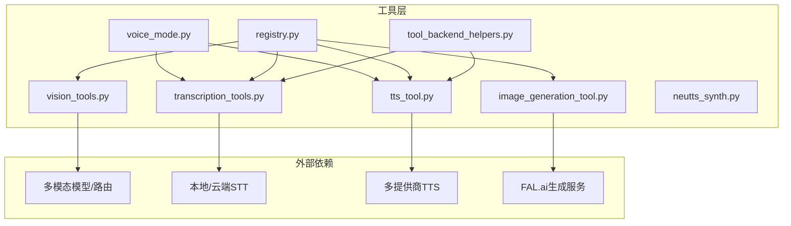
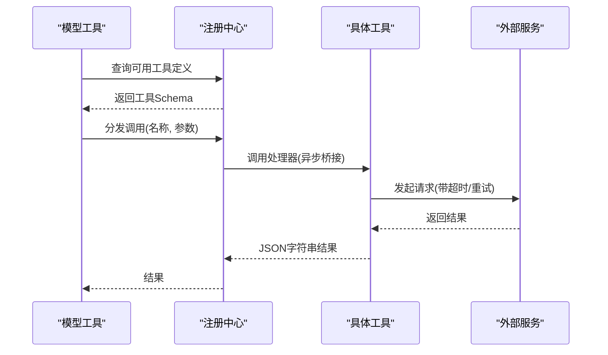
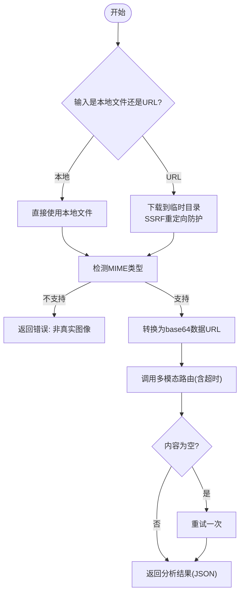
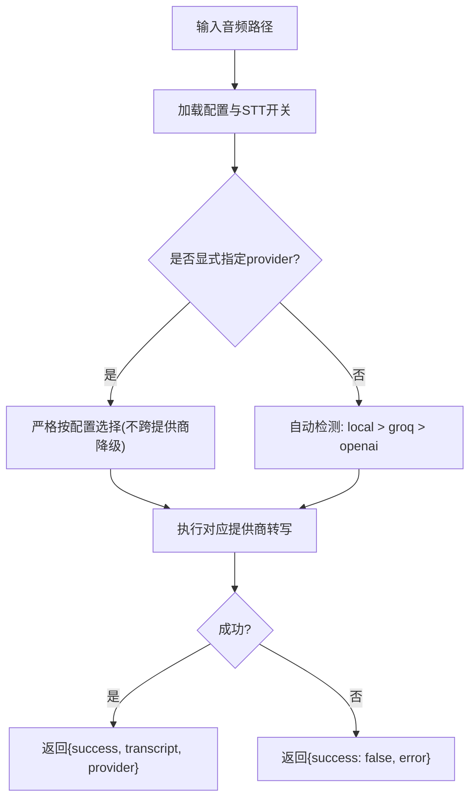
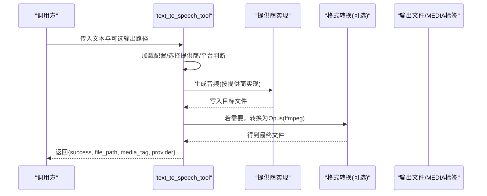
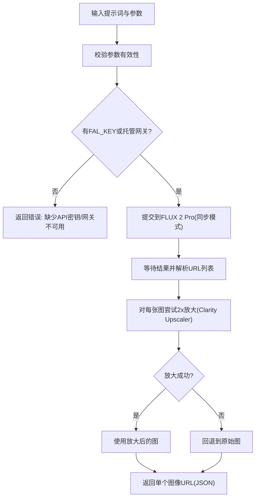
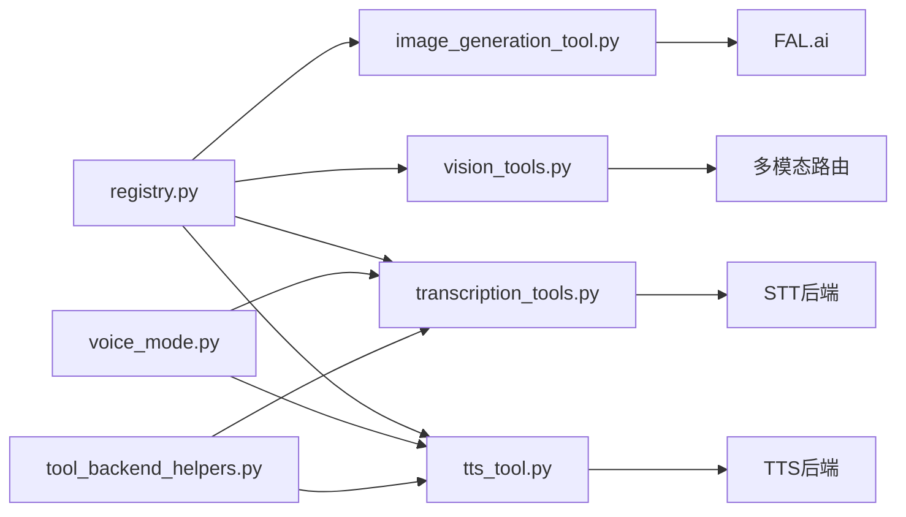

# 专用工具

<cite>
**本文引用的文件**
- [vision_tools.py](file://tools/vision_tools.py)
- [tts_tool.py](file://tools/tts_tool.py)
- [image_generation_tool.py](file://tools/image_generation_tool.py)
- [transcription_tools.py](file://tools/transcription_tools.py)
- [neutts_synth.py](file://tools/neutts_synth.py)
- [voice_mode.py](file://tools/voice_mode.py)
- [registry.py](file://tools/registry.py)
- [tool_backend_helpers.py](file://tools/tool_backend_helpers.py)
- [test_vision_tools.py](file://tests/tools/test_vision_tools.py)
- [test_transcription_tools.py](file://tests/tools/test_transcription_tools.py)
</cite>

## 目录
1. [简介](#简介)
2. [项目结构](#项目结构)
3. [核心组件](#核心组件)
4. [架构总览](#架构总览)
5. [详细组件分析](#详细组件分析)
6. [依赖分析](#依赖分析)
7. [性能考量](#性能考量)
8. [故障排查指南](#故障排查指南)
9. [结论](#结论)
10. [附录](#附录)

## 简介
本文件面向 Hermes Agent 的专用工具，聚焦三大能力域：视觉理解（图像分析）、语音合成与识别（TTS/STT）、以及图像生成。内容覆盖功能特性、架构设计、数据流与处理逻辑、配置与环境要求、错误处理策略、性能优化建议，并提供可操作的使用示例与最佳实践。

## 项目结构
专用工具主要位于 tools 目录下，采用“按能力域分模块”的组织方式：
- 视觉工具：tools/vision_tools.py
- 语音工具：tools/tts_tool.py、tools/transcription_tools.py、tools/voice_mode.py、tools/neutts_synth.py
- 图像生成工具：tools/image_generation_tool.py
- 工具注册与调度：tools/registry.py
- 后端辅助：tools/tool_backend_helpers.py
- 测试用例：tests/tools/test_vision_tools.py、tests/tools/test_transcription_tools.py

图表来源
- [vision_tools.py:264-495](file://tools/vision_tools.py#L264-L495)
- [tts_tool.py:447-621](file://tools/tts_tool.py#L447-L621)
- [transcription_tools.py:524-591](file://tools/transcription_tools.py#L524-L591)
- [image_generation_tool.py:352-535](file://tools/image_generation_tool.py#L352-L535)
- [voice_mode.py:587-610](file://tools/voice_mode.py#L587-L610)
- [registry.py:144-162](file://tools/registry.py#L144-L162)
- [tool_backend_helpers.py:84-90](file://tools/tool_backend_helpers.py#L84-L90)

章节来源
- [vision_tools.py:1-615](file://tools/vision_tools.py#L1-L615)
- [tts_tool.py:1-984](file://tools/tts_tool.py#L1-L984)
- [image_generation_tool.py:1-704](file://tools/image_generation_tool.py#L1-L704)
- [transcription_tools.py:1-634](file://tools/transcription_tools.py#L1-L634)
- [voice_mode.py:1-813](file://tools/voice_mode.py#L1-L813)
- [registry.py:1-321](file://tools/registry.py#L1-L321)
- [tool_backend_helpers.py:1-90](file://tools/tool_backend_helpers.py#L1-L90)

## 核心组件
- 视觉分析工具：支持从 URL 或本地路径加载图片，自动检测格式、下载与转换为 base64 数据 URL，调用集中式多模态路由进行分析，返回结构化结果。
- 语音识别（STT）：提供本地 faster-whisper、Groq Whisper、OpenAI Whisper 三种路径；自动选择可用后端，支持模型自动纠错与配置优先级。
- 语音合成（TTS）：支持 Edge TTS、ElevenLabs、OpenAI TTS、MiniMax、NeuTTS（本地）五种提供商；自动格式适配（MP3/Opus/WAV），平台感知输出（Telegram 语音气泡）。
- 图像生成：基于 FAL.ai FLUX 2 Pro 文生图，自动 2x 放大增强质量；支持同步模式与参数校验。
- 语音模式：命令行推话语音录制、静音检测、自动停止、STT 转写、TTS 播放与中断控制。
- 注册中心：统一管理工具 schema、处理器、可用性检查与异步桥接。

章节来源
- [vision_tools.py:264-495](file://tools/vision_tools.py#L264-L495)
- [transcription_tools.py:524-591](file://tools/transcription_tools.py#L524-L591)
- [tts_tool.py:447-621](file://tools/tts_tool.py#L447-L621)
- [image_generation_tool.py:352-535](file://tools/image_generation_tool.py#L352-L535)
- [voice_mode.py:587-610](file://tools/voice_mode.py#L587-L610)
- [registry.py:144-162](file://tools/registry.py#L144-L162)

## 架构总览
专用工具通过统一注册中心对外暴露 OpenAI 风格函数 schema，由上层模型工具查询并调用。各工具内部封装了安全校验、重试与降级策略、调试日志与会话记录。

图表来源
- [registry.py:111-162](file://tools/registry.py#L111-L162)
- [vision_tools.py:605-615](file://tools/vision_tools.py#L605-L615)
- [tts_tool.py:447-621](file://tools/tts_tool.py#L447-L621)
- [transcription_tools.py:524-591](file://tools/transcription_tools.py#L524-L591)
- [image_generation_tool.py:352-535](file://tools/image_generation_tool.py#L352-L535)

## 详细组件分析

### 视觉分析工具（图像理解）
- 功能要点
  - 支持 URL 与本地路径两种输入；URL 下载前进行网站策略与 SSRF 安全检查。
  - 自动 MIME 类型检测与 base64 数据 URL 转换。
  - 通过集中式多模态路由调用（默认 Gemini 3 Flash Preview），支持温度、最大 token、超时等参数。
  - 失败时进行一次重试；对空内容进行二次提取；提供结构化错误信息。
  - 临时文件清理与调试会话记录。
- 关键流程

图表来源
- [vision_tools.py:320-495](file://tools/vision_tools.py#L320-L495)

- 错误处理与安全
  - URL 格式与 SSRF 防护；重定向链路再次校验；最终 URL 再次策略检查。
  - 对“无权限/余额不足/模型不支持”等常见错误给出明确提示。
  - 临时文件删除失败仅记录警告，不影响主流程。
- 性能与并发
  - 下载阶段具备指数回退重试；HTTP 客户端启用跟随重定向与事件钩子。
  - 本地模型复用（首次加载后缓存），避免重复初始化。
- 使用示例
  - 通过注册中心的 vision_analyze 工具调用，传入 image_url 与 question 即可获得综合描述与问题回答。

章节来源
- [vision_tools.py:71-495](file://tools/vision_tools.py#L71-L495)
- [test_vision_tools.py:1-547](file://tests/tools/test_vision_tools.py#L1-L547)

### 语音识别（STT）
- 能力矩阵
  - 本地：faster-whisper（免费，首次下载模型）；或本地 whisper 命令模板。
  - 云端：Groq Whisper（免费额度）；OpenAI Whisper（付费）。
- 自动选择与降级
  - 显式配置优先：stt.provider 指定则严格遵循，不跨提供商降级。
  - 未显式配置时优先本地，其次 Groq，最后 OpenAI。
  - 模型自动纠错：向 Groq 提交 OpenAI 模型名时自动替换为 Groq 可用模型；反之亦然。
- 输入验证与限制
  - 支持格式：mp3、mp4、mpeg、mpga、m4a、wav、webm、ogg、aac。
  - 文件大小上限 25MB；扩展名大小写不敏感。
- 输出与异常
  - 统一返回 success、transcript、provider 字段；异常时返回 error。
  - 对权限、连接、超时、API 错误分别捕获并返回可读信息。
- 使用示例
  - 直接调用 transcribe_audio(file_path, model)，根据配置自动选择后端。

图表来源
- [transcription_tools.py:524-591](file://tools/transcription_tools.py#L524-L591)

章节来源
- [transcription_tools.py:1-634](file://tools/transcription_tools.py#L1-L634)
- [test_transcription_tools.py:1-800](file://tests/tools/test_transcription_tools.py#L1-L800)

### 语音合成（TTS）
- 提供商矩阵
  - Edge TTS（默认，免费，无需密钥）
  - ElevenLabs（高质量，需 ELEVENLABS_API_KEY）
  - OpenAI TTS（高质量，需 OPENAI_API_KEY 或托管网关）
  - MiniMax TTS（高质量，需 MINIMAX_API_KEY）
  - NeuTTS（本地，免费，需安装 neutts 与 espeak-ng）
- 平台感知输出
  - Telegram 语音气泡：优先 Opus（.ogg），Edge TTS 需 ffmpeg 转换；ElevenLabs/OpenAI 可原生输出 Opus。
  - 其他平台：MP3。
- 主要流程

图表来源
- [tts_tool.py:447-621](file://tools/tts_tool.py#L447-L621)

- 错误处理
  - 缺少依赖包、API 密钥缺失、ffmpeg 不可用等场景均有明确错误提示。
  - 生成失败返回 JSON 包含 error 字段。
- 使用示例
  - 直接调用 text_to_speech_tool(text)，自动选择提供商并输出至默认目录或自定义路径。

章节来源
- [tts_tool.py:1-984](file://tools/tts_tool.py#L1-L984)
- [neutts_synth.py:1-105](file://tools/neutts_synth.py#L1-L105)

### 图像生成工具（文生图）
- 能力概述
  - 使用 FAL.ai FLUX 2 Pro 进行文生图，随后自动使用 Clarity Upscaler 2x 放大以提升质量。
  - 支持参数校验（尺寸、步数、引导强度、数量、输出格式、加速模式）。
  - 支持托管队列模式（无直接密钥时自动走 managed gateway）。
- 主要流程

图表来源
- [image_generation_tool.py:352-535](file://tools/image_generation_tool.py#L352-L535)

- 错误处理
  - API 响应无效、无图像、放大失败等情况均返回结构化错误信息。
- 使用示例
  - 调用 image_generate_tool(prompt, aspect_ratio, ...)，返回单个图像 URL。

章节来源
- [image_generation_tool.py:1-704](file://tools/image_generation_tool.py#L1-L704)

### 语音模式（CLI 推话语音）
- 能力概述
  - 录音：基于 sounddevice 的 InputStream，支持静音检测、自动停止、峰值 RMS 判定。
  - 转写：调用 STT 工具，过滤 Whisper 在静音下的幻觉输出。
  - 播放：优先 sounddevice 播放 WAV；否则使用系统播放器（afplay/ffplay/aplay）。
  - 中断：可中断当前播放。
- 环境检测
  - SSH/Docker/WSL 等环境下的设备可用性与注意事项。
- 使用示例
  - 在 CLI 中触发语音模式，完成录音后自动转写并播放 TTS 回复。

章节来源
- [voice_mode.py:1-813](file://tools/voice_mode.py#L1-L813)

### 工具注册与调度
- 注册中心负责：
  - 统一收集工具 schema、处理器、可用性检查函数。
  - 按工具名分发调用，异步工具自动桥接。
  - 提供工具集可用性检查与 UI 展示所需元数据。
- 与工具的关系
  - 各工具在模块级调用 registry.register 完成注册。
  - 上层模型工具通过 registry.get_definitions 与 dispatch 获取与调用。

章节来源
- [registry.py:1-321](file://tools/registry.py#L1-L321)
- [vision_tools.py:605-615](file://tools/vision_tools.py#L605-L615)
- [tts_tool.py:694-703](file://tools/tts_tool.py#L694-L703)
- [transcription_tools.py:524-591](file://tools/transcription_tools.py#L524-L591)
- [image_generation_tool.py:694-703](file://tools/image_generation_tool.py#L694-L703)

## 依赖分析
- 工具间耦合
  - 视觉工具依赖集中式多模态路由与网站策略检查。
  - STT/TTS 工具依赖配置加载与托管网关解析。
  - 图像生成工具依赖 fal-client 与托管队列。
  - 语音模式同时依赖 STT 与 TTS。
- 外部依赖
  - STT：faster-whisper、openai SDK、ffmpeg（本地命令路径时）。
  - TTS：edge-tts、elevenlabs、openai、requests（MiniMax）、ffmpeg（Opus 转换）。
  - 图像生成：fal-client、httpx（托管队列）。
  - 语音模式：sounddevice、numpy、系统播放器。
- 可能的循环依赖
  - 注册中心无工具导入，工具导入注册中心，避免循环。

图表来源
- [registry.py:1-321](file://tools/registry.py#L1-L321)
- [vision_tools.py:1-615](file://tools/vision_tools.py#L1-L615)
- [tts_tool.py:1-984](file://tools/tts_tool.py#L1-L984)
- [transcription_tools.py:1-634](file://tools/transcription_tools.py#L1-L634)
- [image_generation_tool.py:1-704](file://tools/image_generation_tool.py#L1-L704)
- [voice_mode.py:1-813](file://tools/voice_mode.py#L1-L813)
- [tool_backend_helpers.py:1-90](file://tools/tool_backend_helpers.py#L1-L90)

## 性能考量
- 计算资源需求
  - 视觉分析：网络带宽与多模态 API 调用；本地模型首次加载约 150MB（faster-whisper base）。
  - STT：本地模型占用内存与 CPU；云端 API 受网络与并发影响。
  - TTS：Edge TTS 无需额外资源；ElevenLabs/OpenAI 需网络；NeuTTS 需本地模型与参考音频。
  - 图像生成：GPU/CPU 与网络，FLUX 2 Pro 与 Clarity Upscaler 均为高负载。
- 延迟优化
  - 视觉分析：下载阶段指数回退；多模态路由超时可配置；必要时重试一次。
  - STT：本地 faster-whisper 首次加载后复用；云端模型自动纠错减少失败重试。
  - TTS：Edge TTS 与 ElevenLabs/OpenAI 可原生 Opus 输出，减少 ffmpeg 转换开销。
  - 图像生成：同步模式避免事件循环生命周期问题；托管队列模式需关注排队时间。
- 并发处理
  - STT/TTS：工具内部未见全局锁，但外部并发调用需注意音频设备竞争（sounddevice）。
  - 视觉分析：下载与 LLM 调用为异步，注意磁盘与网络资源竞争。
  - 图像生成：同步 API 避免事件循环问题，适合线程池模式。

[本节为通用指导，不直接分析具体文件]

## 故障排查指南
- 视觉工具
  - 现象：下载失败/权限错误/模型不支持。
  - 排查：检查 URL 是否受网站策略限制；确认多模态路由可用；查看调试会话日志。
  - 参考
    - [vision_tools.py:443-484](file://tools/vision_tools.py#L443-L484)
    - [test_vision_tools.py:254-427](file://tests/tools/test_vision_tools.py#L254-L427)
- STT
  - 现象：无法选择提供商、模型不兼容、文件过大/格式不支持。
  - 排查：确认 stt.enabled 与 stt.provider 配置；检查 API 密钥；确认文件格式与大小。
  - 参考
    - [transcription_tools.py:524-591](file://tools/transcription_tools.py#L524-L591)
    - [test_transcription_tools.py:699-800](file://tests/tools/test_transcription_tools.py#L699-L800)
- TTS
  - 现象：ffmpeg 缺失导致 Telegram 语音气泡失败；提供商密钥缺失。
  - 排查：安装 ffmpeg；确认 PROVIDER_API_KEY；检查平台环境变量。
  - 参考
    - [tts_tool.py:124-162](file://tools/tts_tool.py#L124-L162)
    - [tts_tool.py:504-621](file://tools/tts_tool.py#L504-L621)
- 图像生成
  - 现象：FAL_KEY 未设置或托管网关不可用；放大失败。
  - 排查：设置 FAL_KEY 或配置 managed gateway；检查 fal-client 可用性。
  - 参考
    - [image_generation_tool.py:418-424](file://tools/image_generation_tool.py#L418-L424)
    - [image_generation_tool.py:516-535](file://tools/image_generation_tool.py#L516-L535)
- 语音模式
  - 现象：无音频设备、静音检测误判、播放中断。
  - 排查：安装 sounddevice/numpy；检查 PULSE_SERVER（WSL）；确认麦克风权限。
  - 参考
    - [voice_mode.py:51-114](file://tools/voice_mode.py#L51-L114)
    - [voice_mode.py:616-717](file://tools/voice_mode.py#L616-L717)

章节来源
- [vision_tools.py:443-484](file://tools/vision_tools.py#L443-L484)
- [transcription_tools.py:524-591](file://tools/transcription_tools.py#L524-L591)
- [tts_tool.py:124-162](file://tools/tts_tool.py#L124-L162)
- [image_generation_tool.py:418-424](file://tools/image_generation_tool.py#L418-L424)
- [voice_mode.py:51-114](file://tools/voice_mode.py#L51-L114)

## 结论
Hermes Agent 的专用工具围绕“安全、可用、易用”设计：通过严格的输入校验与错误提示、灵活的后端选择与降级策略、统一的注册与调度机制，为视觉理解、语音识别与合成、图像生成提供了稳定可靠的基础设施。结合本文的性能与故障排查建议，可在不同部署环境下取得更优体验。

[本节为总结性内容，不直接分析具体文件]

## 附录
- 配置项速览（示例）
  - 视觉分析：auxiliary.vision.download_timeout、auxiliary.vision.timeout、AUXILIARY_VISION_MODEL。
  - STT：stt.enabled、stt.provider、stt.local.model/language、GROQ_API_KEY、VOICE_TOOLS_OPENAI_KEY。
  - TTS：tts.provider、provider-specific 配置、HERMES_SESSION_PLATFORM。
  - 图像生成：FAL_KEY、fal-client 可用性。
- 最佳实践
  - 优先使用本地 faster-whisper 降低网络依赖；云端作为兜底。
  - Telegram 场景优先使用 ElevenLabs/OpenAI 的原生 Opus 输出，避免 ffmpeg。
  - 视觉分析与图像生成建议设置合理的超时与重试策略，避免阻塞。
  - 语音模式在容器/SSH 环境下谨慎启用，确保设备可用性。

[本节为通用指导，不直接分析具体文件]