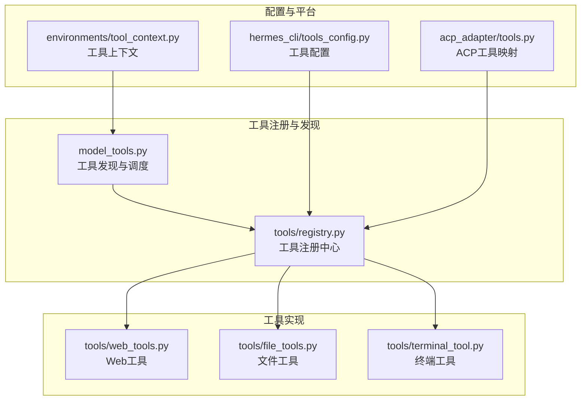
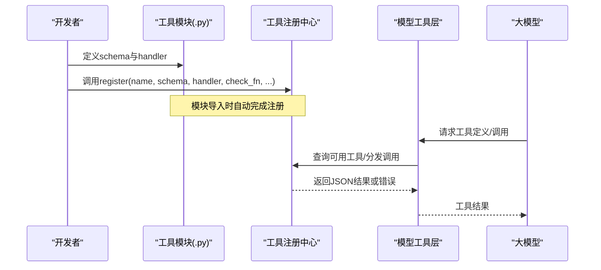
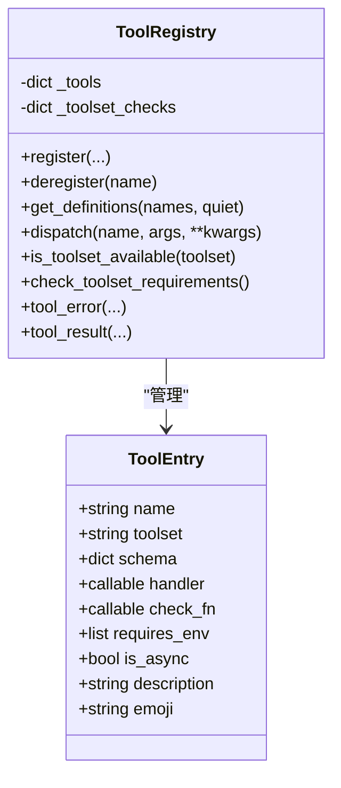
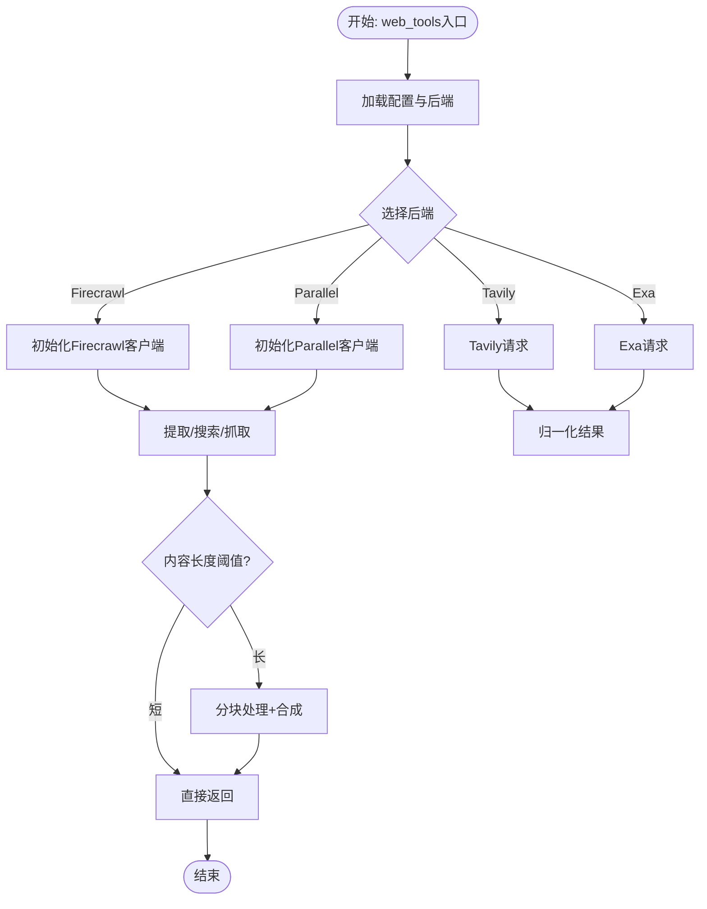
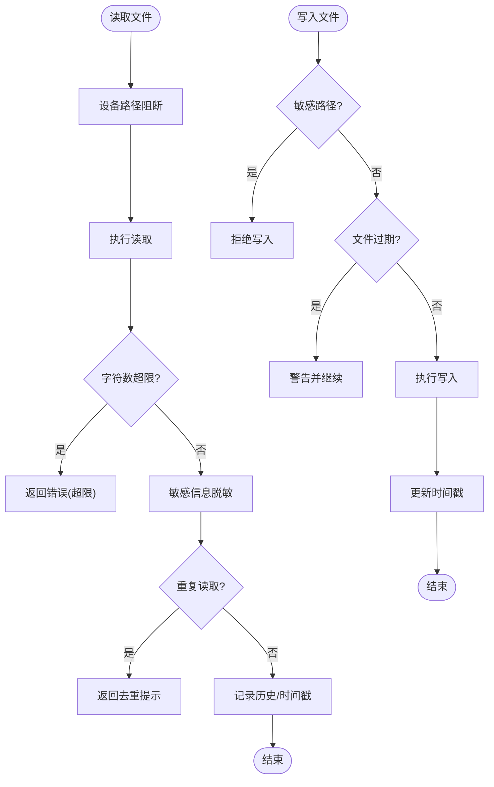
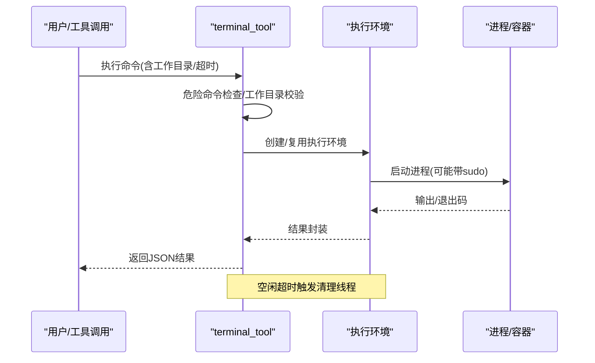
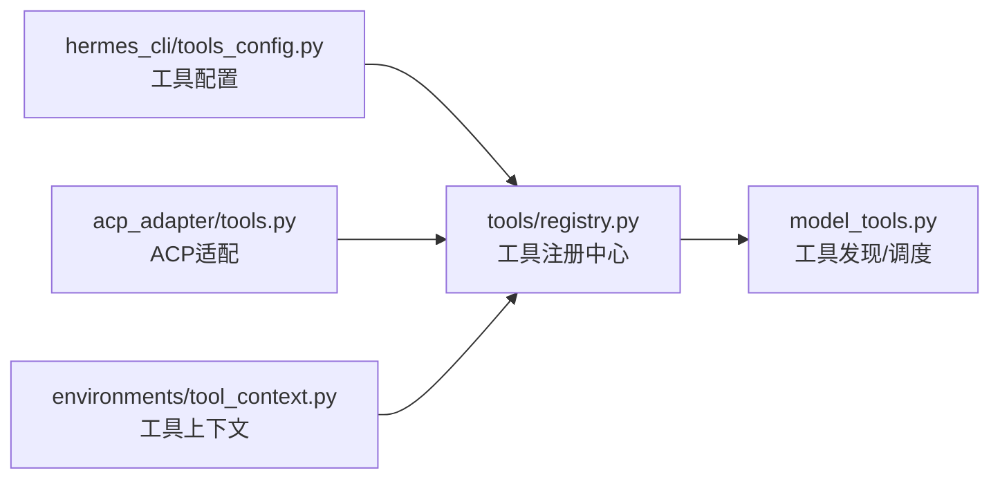
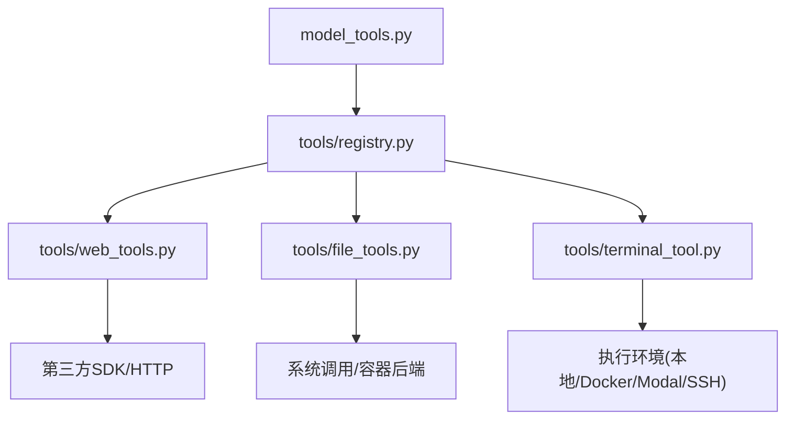

# 工具开发指南

<cite>
**本文档引用的文件**
- [tools/registry.py](file://tools/registry.py)
- [tools/web_tools.py](file://tools/web_tools.py)
- [tools/file_tools.py](file://tools/file_tools.py)
- [tools/terminal_tool.py](file://tools/terminal_tool.py)
- [hermes_cli/tools_config.py](file://hermes_cli/tools_config.py)
- [acp_adapter/tools.py](file://acp_adapter/tools.py)
- [environments/tool_context.py](file://environments/tool_context.py)
- [model_tools.py](file://model_tools.py)
</cite>

## 目录
1. [简介](#简介)
2. [项目结构](#项目结构)
3. [核心组件](#核心组件)
4. [架构总览](#架构总览)
5. [详细组件分析](#详细组件分析)
6. [依赖关系分析](#依赖关系分析)
7. [性能考量](#性能考量)
8. [故障排除指南](#故障排除指南)
9. [结论](#结论)
10. [附录](#附录)

## 简介
本指南面向Hermes Agent的工具开发者，系统阐述工具开发的标准流程与最佳实践，涵盖工具架构设计、参数定义、错误处理、注册机制（schema定义、handler编写、check_fn实现）、安全性与性能优化、可维护性设计、测试方法（单元测试、集成测试、模拟环境搭建）、发布与版本管理，以及与现有工具生态的兼容性考虑。文档以仓库中的实际代码为依据，提供可操作的开发路径与参考。

## 项目结构
Hermes Agent的工具体系由以下关键层次构成：
- 工具注册中心：集中管理所有工具的schema、处理器、可用性检查与分发
- 工具实现模块：各功能域的工具（文件、终端、网络、浏览器、视觉等）
- 配置与发现：统一配置界面与工具集解析
- 运行时编排：模型工具层负责工具发现、调度与异步桥接
- 平台适配：如ACP适配器对工具调用事件的封装

**图表来源**
- [tools/registry.py:1-321](file://tools/registry.py#L1-L321)
- [model_tools.py:1-200](file://model_tools.py#L1-L200)
- [tools/web_tools.py:1-800](file://tools/web_tools.py#L1-L800)
- [tools/file_tools.py:1-800](file://tools/file_tools.py#L1-L800)
- [tools/terminal_tool.py:1-800](file://tools/terminal_tool.py#L1-L800)
- [hermes_cli/tools_config.py:1-800](file://hermes_cli/tools_config.py#L1-L800)
- [acp_adapter/tools.py:1-215](file://acp_adapter/tools.py#L1-L215)
- [environments/tool_context.py:1-475](file://environments/tool_context.py#L1-L475)

**章节来源**
- [tools/registry.py:1-321](file://tools/registry.py#L1-L321)
- [model_tools.py:1-200](file://model_tools.py#L1-L200)

## 核心组件
- 工具注册中心（ToolRegistry）：提供工具注册、schema检索、分发与可用性检查；统一错误返回格式
- 工具实现模块：按功能域划分，每个模块定义schema、处理器与check_fn，并在模块级完成注册
- 模型工具层（model_tools）：触发工具发现、构建工具定义、执行工具调用、异步桥接
- 配置与平台：hermes_cli.tools_config统一管理工具集启用、提供商选择与后置安装步骤；ACP适配器将工具映射到AC schema

**章节来源**
- [tools/registry.py:45-276](file://tools/registry.py#L45-L276)
- [model_tools.py:128-185](file://model_tools.py#L128-L185)
- [hermes_cli/tools_config.py:64-353](file://hermes_cli/tools_config.py#L64-L353)
- [acp_adapter/tools.py:20-55](file://acp_adapter/tools.py#L20-L55)

## 架构总览
工具从模块级注册到运行时调度的关键流程如下：

**图表来源**
- [tools/registry.py:56-162](file://tools/registry.py#L56-L162)
- [model_tools.py:132-170](file://model_tools.py#L132-L170)

## 详细组件分析

### 工具注册中心（ToolRegistry）
- 注册接口：支持名称、工具集、schema、处理器、可用性检查函数、环境变量需求、是否异步、描述与表情符号
- 可用性检查：按工具集维度缓存check_fn，支持批量查询工具集可用性
- 分发机制：统一捕获异常并返回标准化错误；异步处理器通过持久事件循环桥接
- 辅助工具：tool_error与tool_result简化错误与结果序列化

**图表来源**
- [tools/registry.py:24-89](file://tools/registry.py#L24-L89)
- [tools/registry.py:45-276](file://tools/registry.py#L45-L276)

**章节来源**
- [tools/registry.py:45-276](file://tools/registry.py#L45-L276)

### Web工具（web_tools）
- 后端选择：支持Exa、Firecrawl、Parallel、Tavily，优先级与可用性检测
- Firecrawl客户端：支持直连与托管网关（Nous订阅用户），自动选择后端
- 内容提取与摘要：基于辅助模型进行智能摘要，支持超大文本分块与合成
- 安全与合规：URL安全检查、网站策略校验、调试会话记录

**图表来源**
- [tools/web_tools.py:75-240](file://tools/web_tools.py#L75-L240)
- [tools/web_tools.py:477-800](file://tools/web_tools.py#L477-L800)

**章节来源**
- [tools/web_tools.py:75-240](file://tools/web_tools.py#L75-L240)
- [tools/web_tools.py:477-800](file://tools/web_tools.py#L477-L800)

### 文件工具（file_tools）
- 读取保护：设备路径阻断、字符数上限、重复读取检测与去重缓存
- 写入安全：敏感路径检查、权限异常识别、写后时间戳更新与过期提示
- 搜索能力：基于ripgrep的全文/文件名搜索，支持分页与上下文
- 注册与Schema：提供标准schema与handler绑定

**图表来源**
- [tools/file_tools.py:279-436](file://tools/file_tools.py#L279-L436)
- [tools/file_tools.py:559-638](file://tools/file_tools.py#L559-L638)

**章节来源**
- [tools/file_tools.py:279-436](file://tools/file_tools.py#L279-L436)
- [tools/file_tools.py:559-638](file://tools/file_tools.py#L559-L638)

### 终端工具（terminal_tool）
- 多后端支持：本地、Docker、Singularity、Modal、Daytona、SSH
- 环境生命周期：创建、复用、空闲清理、持久化选项
- 安全控制：危险命令检测、sudo密码缓存与交互式输入、工作目录白名单
- 异步桥接：与工具层一致的事件循环管理，避免“事件循环已关闭”问题

**图表来源**
- [tools/terminal_tool.py:430-800](file://tools/terminal_tool.py#L430-L800)

**章节来源**
- [tools/terminal_tool.py:430-800](file://tools/terminal_tool.py#L430-L800)

### 工具配置与平台适配
- hermes_cli.tools_config：统一工具集启用/禁用、提供商选择、环境变量要求、后置安装步骤
- acp_adapter.tools：将Hermes工具名映射到ACP ToolKind，构建工具调用事件与标题
- environments.tool_context：为奖励/验证函数提供不受限的工具访问，支持任务隔离与资源清理

**图表来源**
- [hermes_cli/tools_config.py:438-580](file://hermes_cli/tools_config.py#L438-L580)
- [acp_adapter/tools.py:20-96](file://acp_adapter/tools.py#L20-L96)
- [environments/tool_context.py:67-108](file://environments/tool_context.py#L67-L108)

**章节来源**
- [hermes_cli/tools_config.py:438-580](file://hermes_cli/tools_config.py#L438-L580)
- [acp_adapter/tools.py:20-96](file://acp_adapter/tools.py#L20-L96)
- [environments/tool_context.py:67-108](file://environments/tool_context.py#L67-L108)

## 依赖关系分析
- 模块导入链：model_tools.py在启动时导入各工具模块以触发注册；工具模块仅依赖注册中心与通用工具
- 循环依赖防护：注册中心不依赖具体工具模块，工具模块依赖注册中心，形成单向依赖
- 平台与外部库：Web工具依赖第三方SDK与HTTP客户端；文件/终端工具依赖系统调用与容器/云后端

**图表来源**
- [model_tools.py:132-185](file://model_tools.py#L132-L185)
- [tools/web_tools.py:43-64](file://tools/web_tools.py#L43-L64)
- [tools/file_tools.py:1-14](file://tools/file_tools.py#L1-L14)
- [tools/terminal_tool.py:33-47](file://tools/terminal_tool.py#L33-L47)

**章节来源**
- [model_tools.py:132-185](file://model_tools.py#L132-L185)

## 性能考量
- 事件循环管理：工具层提供持久事件循环，避免频繁创建/销毁导致的客户端GC问题
- 工具发现缓存：首次导入后缓存工具定义，减少重复开销
- 内容压缩与分块：Web工具对大文本采用分块摘要与合成，控制上下文长度
- 去重与限流：文件读取与搜索的连续重复检测，防止无效循环与令牌浪费

**章节来源**
- [model_tools.py:44-126](file://model_tools.py#L44-L126)
- [tools/web_tools.py:477-800](file://tools/web_tools.py#L477-L800)
- [tools/file_tools.py:316-433](file://tools/file_tools.py#L316-L433)

## 故障排除指南
- 工具不可用：检查工具集check_fn与环境变量；使用工具可用性检查接口定位缺失项
- 错误格式统一：工具应返回JSON字符串，使用tool_error/tool_result确保一致性
- Web工具配置：确认后端API密钥、托管网关配置与网络可达性
- 文件工具安全：避免写入敏感路径；关注过期文件警告；合理设置读取上限
- 终端工具：排查危险命令拦截、sudo密码、工作目录合法性与后端连接

**章节来源**
- [tools/registry.py:144-162](file://tools/registry.py#L144-L162)
- [tools/web_tools.py:160-172](file://tools/web_tools.py#L160-L172)
- [tools/file_tools.py:559-638](file://tools/file_tools.py#L559-L638)
- [tools/terminal_tool.py:145-177](file://tools/terminal_tool.py#L145-L177)

## 结论
Hermes Agent的工具体系通过注册中心实现解耦与扩展，配合统一的配置与平台适配，为多后端、多场景的工具开发提供了清晰的框架。开发者遵循本文档的架构设计、参数定义、错误处理与安全规范，即可快速构建高质量、可维护且可测试的工具，并与现有生态无缝兼容。

## 附录

### 工具开发标准流程
- 设计阶段：明确工具职责、输入输出、安全边界与性能目标
- 实现阶段：定义OpenAI格式schema、实现handler、编写check_fn、注册到注册中心
- 测试阶段：单元测试覆盖正常/异常路径；集成测试验证后端连通性与平台适配
- 发布阶段：更新工具配置、提供环境变量要求、编写README与示例

### 参数定义与Schema
- 必填字段：name、description、parameters（含类型与约束）
- 推荐字段：required参数列表、默认值、枚举值
- 与注册中心：schema将被收集用于工具定义生成与令牌估算

**章节来源**
- [tools/file_tools.py:727-788](file://tools/file_tools.py#L727-L788)

### 错误处理最佳实践
- 使用统一错误格式：tool_error(message, **extra)
- 区分预期失败与异常：对权限/配额等预期错误进行降级处理
- 记录必要日志：保留上下文信息但避免泄露敏感数据

**章节来源**
- [tools/registry.py:294-321](file://tools/registry.py#L294-L321)

### 安全性考虑
- 输入校验：路径/URL/工作目录白名单；危险命令检测
- 权限最小化：避免写入系统敏感路径；sudo使用缓存与交互式输入
- 数据脱敏：读取内容进行敏感信息脱敏

**章节来源**
- [tools/terminal_tool.py:157-177](file://tools/terminal_tool.py#L157-L177)
- [tools/file_tools.py:98-125](file://tools/file_tools.py#L98-L125)
- [tools/file_tools.py:374-378](file://tools/file_tools.py#L374-L378)

### 性能优化建议
- 事件循环复用：避免在工具中使用asyncio.run
- 缓存与去重：利用注册中心与读取去重机制
- 上下文控制：对大文件/网页内容进行分块与摘要

**章节来源**
- [model_tools.py:44-126](file://model_tools.py#L44-L126)
- [tools/file_tools.py:316-433](file://tools/file_tools.py#L316-L433)
- [tools/web_tools.py:477-800](file://tools/web_tools.py#L477-L800)

### 可维护性设计
- 模块化：按功能域拆分工具模块，避免单体膨胀
- 明确职责：注册中心只负责元数据与分发，业务逻辑集中在工具模块
- 文档与示例：为新工具提供README与最小可运行示例

**章节来源**
- [tools/registry.py:1-16](file://tools/registry.py#L1-L16)

### 测试方法
- 单元测试：针对handler与check_fn的边界条件与异常路径
- 集成测试：验证后端SDK连通性与平台适配（Docker/Modal/SSH）
- 模拟环境：使用工具上下文（ToolContext）在受控环境中执行工具组合

**章节来源**
- [environments/tool_context.py:67-108](file://environments/tool_context.py#L67-L108)

### 发布与版本管理
- 版本语义：遵循语义化版本，变更工具schema需谨慎
- 兼容性：通过check_fn与环境变量要求保证向后兼容
- 配置迁移：使用hermes_cli.tools_config进行工具集与提供商迁移

**章节来源**
- [hermes_cli/tools_config.py:583-623](file://hermes_cli/tools_config.py#L583-L623)

### 与现有工具生态的兼容性
- 工具集映射：通过工具集键值与平台映射，统一启用/禁用策略
- ACP适配：将工具名映射到ACP ToolKind，保持事件结构一致
- MCP动态发现：支持外部MCP服务器动态注册与注销

**章节来源**
- [acp_adapter/tools.py:20-55](file://acp_adapter/tools.py#L20-L55)
- [model_tools.py:172-185](file://model_tools.py#L172-L185)