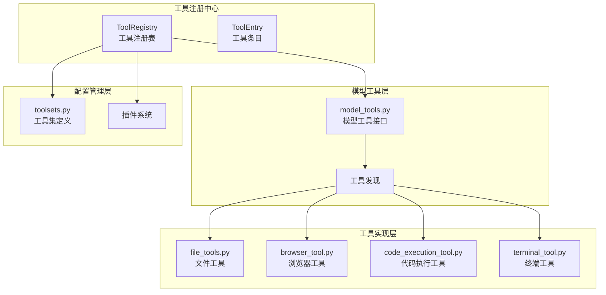
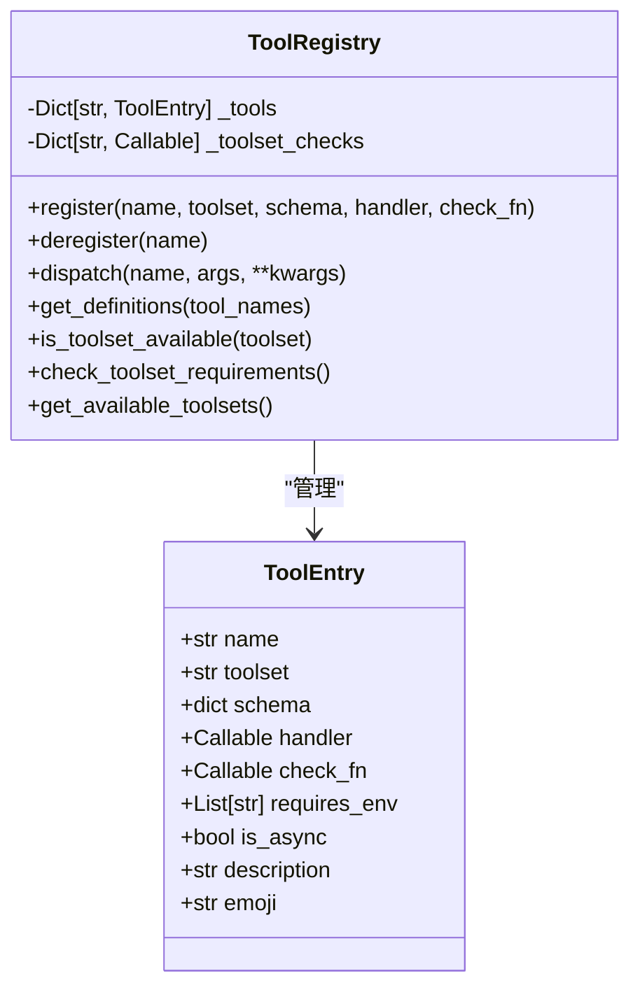
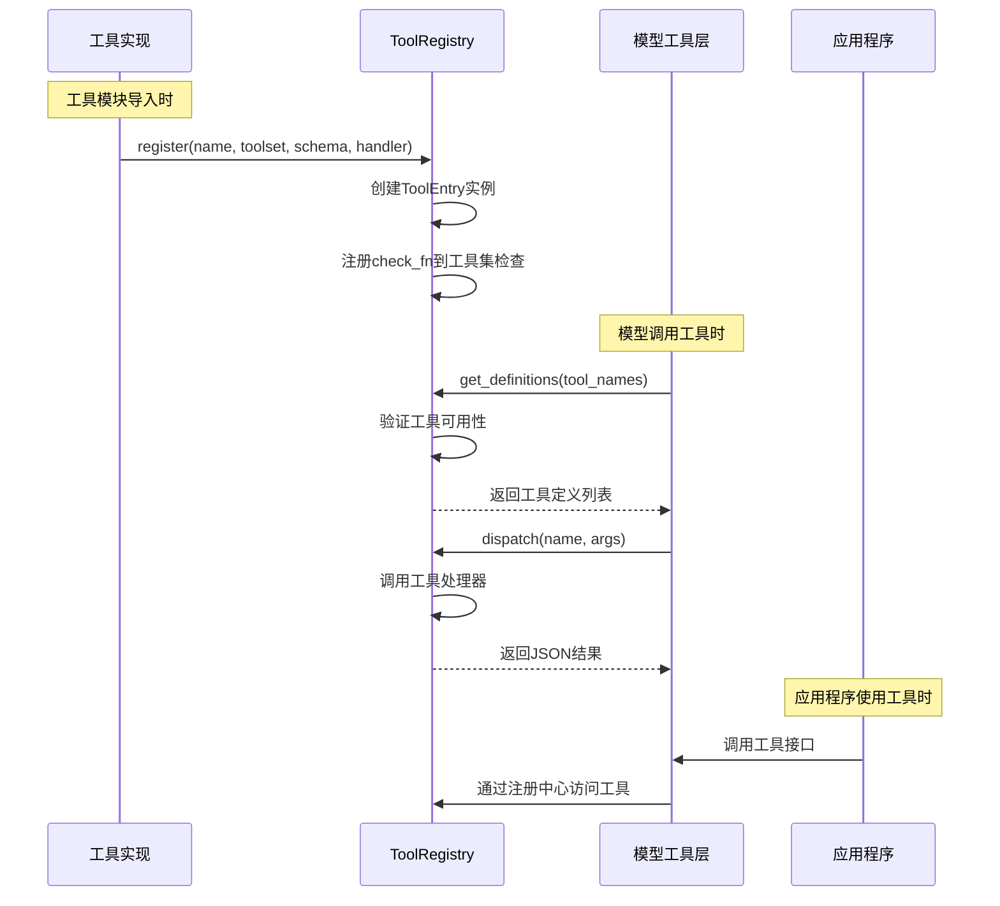
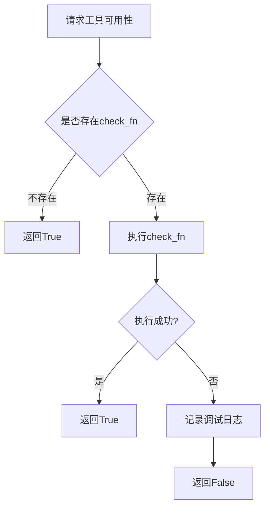
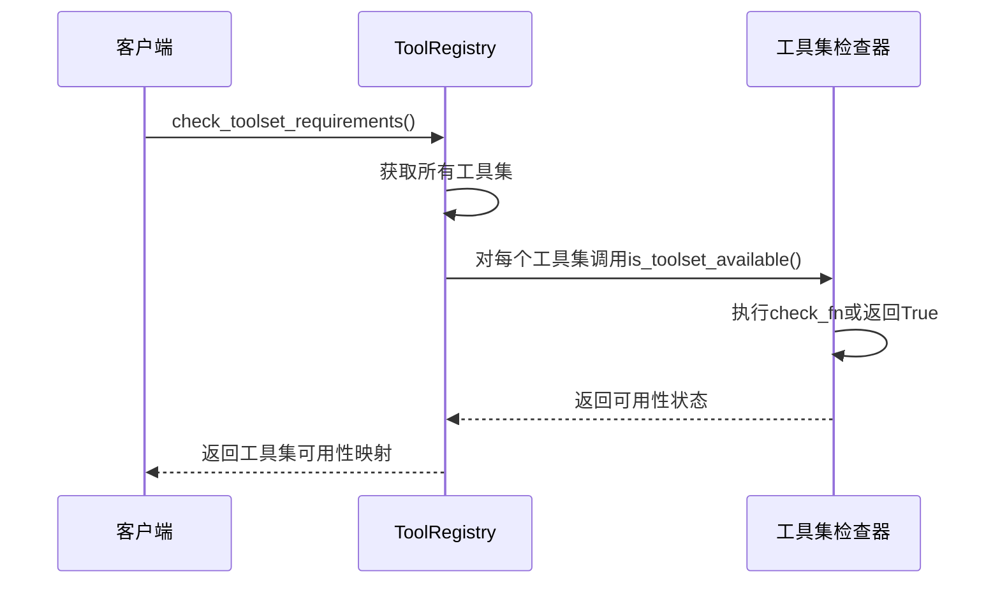
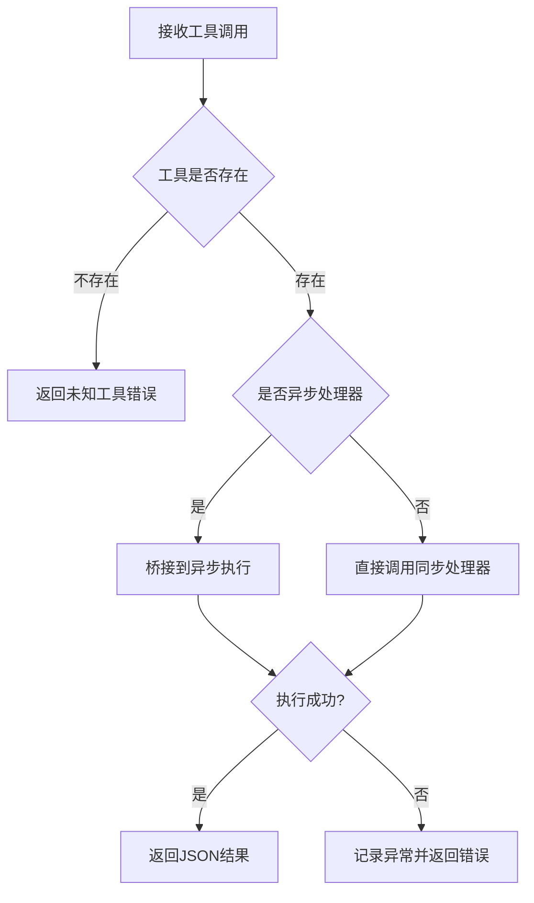
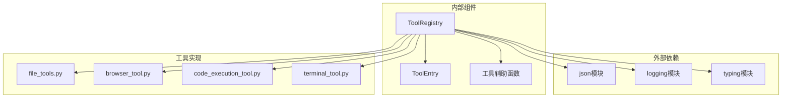

# 工具注册中心

<cite>
**本文档引用的文件**
- [tools/registry.py](file://tools/registry.py)
- [tests/tools/test_registry.py](file://tests/tools/test_registry.py)
- [tests/tools/test_mcp_dynamic_discovery.py](file://tests/tools/test_mcp_dynamic_discovery.py)
- [model_tools.py](file://model_tools.py)
- [toolsets.py](file://toolsets.py)
- [tools/file_tools.py](file://tools/file_tools.py)
- [tools/browser_tool.py](file://tools/browser_tool.py)
- [tools/code_execution_tool.py](file://tools/code_execution_tool.py)
- [tools/terminal_tool.py](file://tools/terminal_tool.py)
</cite>

## 目录
1. [简介](#简介)
2. [项目结构](#项目结构)
3. [核心组件](#核心组件)
4. [架构概览](#架构概览)
5. [详细组件分析](#详细组件分析)
6. [依赖分析](#依赖分析)
7. [性能考虑](#性能考虑)
8. [故障排除指南](#故障排除指南)
9. [结论](#结论)

## 简介

Hermes Agent的工具注册中心是整个智能体系统的核心基础设施，负责统一管理所有工具的注册、发现、验证和执行。该系统采用单例模式设计，通过ToolRegistry类提供集中式的工具生命周期管理，支持工具集检查、工具可用性验证、动态工具发现等功能。

工具注册中心的主要目标是：
- 提供统一的工具注册接口
- 管理工具元数据和依赖关系
- 实现工具可用性检查机制
- 支持工具集管理和权限控制
- 提供工具查询和分发服务

## 项目结构

工具注册中心位于Hermes Agent项目的tools目录下，与模型工具层和具体工具实现形成清晰的分层架构：



**图表来源**
- [tools/registry.py:45-275](file://tools/registry.py#L45-L275)
- [model_tools.py:128-185](file://model_tools.py#L128-L185)

**章节来源**
- [tools/registry.py:1-321](file://tools/registry.py#L1-L321)
- [model_tools.py:1-200](file://model_tools.py#L1-L200)

## 核心组件

### ToolRegistry类设计

ToolRegistry是工具注册中心的核心类，采用单例模式确保全局唯一性。该类提供了完整的工具生命周期管理功能：

#### 主要特性
- **工具注册管理**：支持工具的注册、注销和查询
- **工具集检查**：基于check_fn函数的工具可用性验证
- **元数据管理**：维护工具的描述信息、环境变量要求等
- **异步支持**：自动桥接同步和异步工具处理器
- **错误处理**：统一的异常捕获和错误格式化

#### 关键数据结构



**图表来源**
- [tools/registry.py:24-89](file://tools/registry.py#L24-L89)
- [tools/registry.py:45-275](file://tools/registry.py#L45-L275)

**章节来源**
- [tools/registry.py:45-275](file://tools/registry.py#L45-L275)

## 架构概览

工具注册中心采用分层架构设计，确保了良好的模块化和可扩展性：



**图表来源**
- [tools/registry.py:56-162](file://tools/registry.py#L56-L162)
- [model_tools.py:128-185](file://model_tools.py#L128-L185)

## 详细组件分析

### ToolEntry数据结构详解

ToolEntry是工具注册中心的核心数据结构，用于存储单个工具的完整元数据：

#### 字段说明

| 字段名 | 类型 | 描述 | 默认值 |
|--------|------|------|--------|
| name | str | 工具名称（唯一标识） | 必填 |
| toolset | str | 工具集名称 | 必填 |
| schema | dict | OpenAI格式的工具模式定义 | 必填 |
| handler | Callable | 工具处理器函数 | 必填 |
| check_fn | Callable | 可用性检查函数 | None |
| requires_env | List[str] | 环境变量依赖列表 | [] |
| is_async | bool | 是否为异步处理器 | False |
| description | str | 工具描述信息 | "" |
| emoji | str | 工具表情符号 | "" |

#### 字段作用机制

**name字段**：作为工具的唯一标识符，在注册中心内部使用字典索引进行快速查找。

**toolset字段**：将工具归类到特定的工具集，支持按工具集进行批量管理和检查。

**schema字段**：遵循OpenAI函数调用格式，包含工具名称、描述和参数定义。

**handler字段**：实际的工具执行逻辑，可以是同步或异步函数。

**check_fn字段**：可选的可用性检查函数，用于验证工具运行所需的条件。

**requires_env字段**：声明工具运行所需的环境变量，用于工具集可用性检查。

**is_async字段**：标记处理器是否为异步函数，影响调度和执行方式。

**description和emoji字段**：提供用户界面友好的工具信息展示。

**章节来源**
- [tools/registry.py:24-43](file://tools/registry.py#L24-L43)

### 工具注册机制

工具注册过程采用模块级导入触发的方式，确保所有工具在系统启动时自动注册：

#### 注册流程

```mermaid
flowchart TD
A[工具模块导入] --> B[调用registry.register()]
B --> C{检查名称冲突}
C --> |存在冲突| D[记录警告并覆盖]
C --> |无冲突| E[创建ToolEntry]
D --> E
E --> F{是否有check_fn}
F --> |有| G[注册到工具集检查]
F --> |无| H[跳过检查注册]
G --> I[完成注册]
H --> I
```

**图表来源**
- [tools/registry.py:68-89](file://tools/registry.py#L68-L89)

#### 冲突检测机制

当同一名称的工具被不同工具集注册时，系统会记录警告但允许覆盖，确保向后兼容性。

**章节来源**
- [tests/tools/test_registry.py:120-138](file://tests/tools/test_registry.py#L120-L138)

### 工具可用性检查系统

工具可用性检查是工具注册中心的核心功能之一，通过check_fn函数实现灵活的条件验证：

#### 检查机制



**图表来源**
- [tools/registry.py:194-208](file://tools/registry.py#L194-L208)

#### 异常处理策略

所有check_fn调用都在try-catch块中执行，任何异常都会被捕获并记录调试信息，然后返回False，确保系统的稳定性。

**章节来源**
- [tests/tools/test_registry.py:184-219](file://tests/tools/test_registry.py#L184-L219)

### 工具集管理功能

工具注册中心提供了完整的工具集管理能力，支持工具集级别的查询、检查和元数据管理：

#### 工具集检查流程



**图表来源**
- [tools/registry.py:209-213](file://tools/registry.py#L209-L213)

#### 工具集元数据管理

工具注册中心维护工具集的完整元数据，包括可用性状态、包含的工具列表、环境变量要求等信息。

**章节来源**
- [tools/registry.py:214-251](file://tools/registry.py#L214-L251)

### 工具分发和执行

工具分发系统负责将工具调用请求路由到相应的处理器，并处理异步执行和错误恢复：

#### 分发流程



**图表来源**
- [tools/registry.py:144-162](file://tools/registry.py#L144-L162)

#### 异步支持机制

系统通过_model_tools._run_async函数提供统一的异步执行桥接，支持多种事件循环场景。

**章节来源**
- [tools/registry.py:154-161](file://tools/registry.py#L154-L161)

## 依赖分析

工具注册中心的依赖关系相对简单，主要依赖于标准库和logging模块：



**图表来源**
- [tools/registry.py:17-21](file://tools/registry.py#L17-L21)

### 循环依赖防护

工具注册中心通过精心设计的导入顺序避免了循环依赖问题：
- registry.py不依赖任何工具模块
- 工具模块在导入时注册自身
- model_tools.py通过延迟导入避免循环引用

**章节来源**
- [tools/registry.py:7-15](file://tools/registry.py#L7-L15)

## 性能考虑

工具注册中心在设计时充分考虑了性能优化：

### 缓存策略
- **check_fn结果缓存**：在单次get_definitions调用中缓存check_fn的结果，避免重复计算
- **工具集检查缓存**：is_toolset_available方法对check_fn的执行结果进行缓存

### 内存优化
- 使用__slots__减少内存占用
- 按需加载工具模块，避免不必要的导入
- 及时清理不再使用的工具集检查函数

### 并发安全
- 使用线程锁保护共享状态
- 支持多线程环境下的工具调用
- 异步执行避免阻塞主线程

## 故障排除指南

### 常见问题诊断

**工具未显示在可用列表中**
1. 检查工具的check_fn是否返回True
2. 验证requires_env环境变量是否正确设置
3. 确认工具模块已正确导入

**工具调用失败**
1. 查看日志中的异常堆栈信息
2. 验证工具处理器的参数格式
3. 检查异步执行环境配置

**工具集检查异常**
1. 检查check_fn函数的实现
2. 验证外部依赖服务的可用性
3. 确认网络连接和认证信息

**章节来源**
- [tests/tools/test_registry.py:170-182](file://tests/tools/test_registry.py#L170-L182)
- [tests/tools/test_registry.py:240-259](file://tests/tools/test_registry.py#L240-L259)

### 调试技巧

使用quiet参数控制日志输出级别，便于在生产环境中减少噪声。

**章节来源**
- [tools/registry.py:111-138](file://tools/registry.py#L111-L138)

## 结论

Hermes Agent的工具注册中心是一个设计精良的基础设施组件，具有以下特点：

**架构优势**
- 清晰的分层设计，职责分离明确
- 单例模式确保全局一致性
- 模块化设计支持灵活扩展

**功能完整性**
- 全面的工具生命周期管理
- 灵活的工具集检查机制
- 完善的错误处理和恢复机制

**性能优化**
- 智能缓存策略
- 并发安全设计
- 轻量级实现

该系统为Hermes Agent提供了强大的工具管理能力，支持从简单的文件操作到复杂的浏览器自动化等各种工具类型，是整个智能体系统的重要基石。