# 工具系统

<cite>
**本文档引用的文件**
- [tools/registry.py](file://tools/registry.py)
- [tools/terminal_tool.py](file://tools/terminal_tool.py)
- [tools/file_tools.py](file://tools/file_tools.py)
- [tools/browser_tool.py](file://tools/browser_tool.py)
- [tools/web_tools.py](file://tools/web_tools.py)
- [tools/code_execution_tool.py](file://tools/code_execution_tool.py)
- [tools/mcp_tool.py](file://tools/mcp_tool.py)
- [tools/skills_tool.py](file://tools/skills_tool.py)
- [tools/send_message_tool.py](file://tools/send_message_tool.py)
- [tools/__init__.py](file://tools/__init__.py)
</cite>

## 目录
1. [简介](#简介)
2. [项目结构](#项目结构)
3. [核心组件](#核心组件)
4. [架构总览](#架构总览)
5. [详细组件分析](#详细组件分析)
6. [依赖分析](#依赖分析)
7. [性能考虑](#性能考虑)
8. [故障排除指南](#故障排除指南)
9. [结论](#结论)
10. [附录](#附录)

## 简介
本文件系统性梳理 Hermes Agent 的工具系统，覆盖 40+ 内置工具的分类与功能、工具注册机制、工具调用流程与参数校验、配置选项、安全限制与最佳实践，并提供工具开发指南、工具集管理、权限控制与性能监控建议，以及丰富的使用示例与故障排除方法。

## 项目结构
工具系统以模块化方式组织，每个工具独立实现并在启动时通过注册中心集中管理。核心结构如下：
- 注册中心：统一收集工具的 schema、处理器、可用性检查与工具集归属
- 工具模块：终端、文件、浏览器、网络搜索、代码执行、MCP、技能、消息发送等
- 环境后端：本地、Docker、Modal、SSH、Singularity、Daytona 等多后端支持
- 安全与合规：危险命令审批、路径白名单、敏感路径保护、SSRF 防护、凭据脱敏

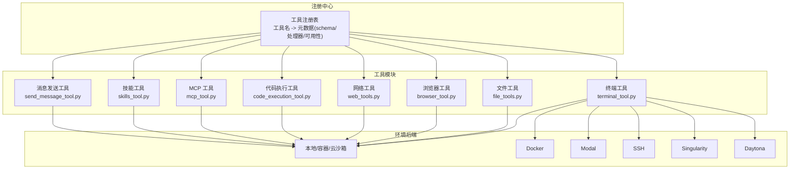

图表来源
- [tools/registry.py](file://tools/registry.py)
- [tools/terminal_tool.py](file://tools/terminal_tool.py)
- [tools/file_tools.py](file://tools/file_tools.py)
- [tools/browser_tool.py](file://tools/browser_tool.py)
- [tools/web_tools.py](file://tools/web_tools.py)
- [tools/code_execution_tool.py](file://tools/code_execution_tool.py)
- [tools/mcp_tool.py](file://tools/mcp_tool.py)
- [tools/skills_tool.py](file://tools/skills_tool.py)
- [tools/send_message_tool.py](file://tools/send_message_tool.py)

章节来源
- [tools/registry.py](file://tools/registry.py)
- [tools/terminal_tool.py](file://tools/terminal_tool.py)
- [tools/file_tools.py](file://tools/file_tools.py)
- [tools/browser_tool.py](file://tools/browser_tool.py)
- [tools/web_tools.py](file://tools/web_tools.py)
- [tools/code_execution_tool.py](file://tools/code_execution_tool.py)
- [tools/mcp_tool.py](file://tools/mcp_tool.py)
- [tools/skills_tool.py](file://tools/skills_tool.py)
- [tools/send_message_tool.py](file://tools/send_message_tool.py)

## 核心组件
- 工具注册表（ToolRegistry）：集中管理工具元数据、可用性检查、调度分发与工具集信息聚合
- 统一错误返回工具函数：tool_error/tool_result 规范化工具输出格式
- 环境抽象层：统一的终端环境接口，支持多后端生命周期管理与资源清理
- 危险命令与路径安全：内置审批与路径白名单，防止高危操作
- 浏览器会话与清理：自动超时清理、会话隔离与资源回收
- 网络工具链：多供应商后端选择、内容压缩与摘要、LLM 辅助处理
- 代码执行沙箱：本地 UDS 与远程文件 RPC 两种传输，限制工具调用次数与参数
- MCP 客户端：连接外部 MCP 服务器，动态发现工具并注册到注册表
- 技能目录：分级展示与按需加载，支持前置元数据与平台过滤
- 跨平台消息发送：统一 schema，平台特定适配与媒体附件处理

章节来源
- [tools/registry.py](file://tools/registry.py)
- [tools/terminal_tool.py](file://tools/terminal_tool.py)
- [tools/file_tools.py](file://tools/file_tools.py)
- [tools/browser_tool.py](file://tools/browser_tool.py)
- [tools/web_tools.py](file://tools/web_tools.py)
- [tools/code_execution_tool.py](file://tools/code_execution_tool.py)
- [tools/mcp_tool.py](file://tools/mcp_tool.py)
- [tools/skills_tool.py](file://tools/skills_tool.py)
- [tools/send_message_tool.py](file://tools/send_message_tool.py)

## 架构总览
工具系统采用“注册中心 + 多后端 + 统一调度”的架构。工具在导入时向注册中心注册，运行时由模型工具层根据可用性筛选并调用。环境抽象层屏蔽后端差异，安全模块贯穿各工具执行路径。

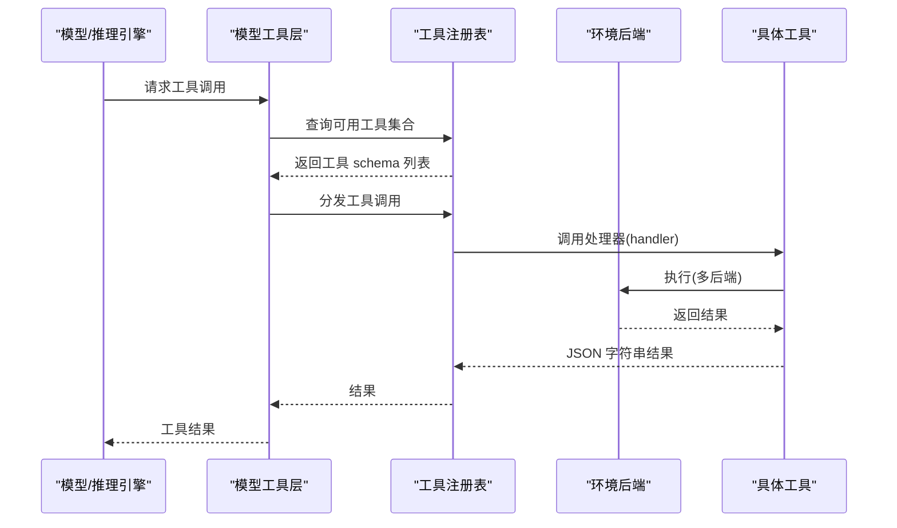

图表来源
- [tools/registry.py](file://tools/registry.py)
- [tools/terminal_tool.py](file://tools/terminal_tool.py)
- [tools/file_tools.py](file://tools/file_tools.py)
- [tools/browser_tool.py](file://tools/browser_tool.py)
- [tools/web_tools.py](file://tools/web_tools.py)
- [tools/code_execution_tool.py](file://tools/code_execution_tool.py)
- [tools/mcp_tool.py](file://tools/mcp_tool.py)
- [tools/skills_tool.py](file://tools/skills_tool.py)
- [tools/send_message_tool.py](file://tools/send_message_tool.py)

## 详细组件分析

### 工具注册与调度
- 注册入口：工具模块在导入时调用注册表的 register 方法，传入工具名、工具集、schema、处理器、可用性检查、描述与表情符号等
- 可用性检查：支持 per-tool 的 check_fn 与 per-toolset 的 check_fn；工具集可用性缓存避免重复检查
- 调度分发：dispatch 支持同步与异步处理器，异常捕获并统一返回 JSON 错误
- 工具集聚合：提供工具集元数据、要求变量与可用性状态，用于 UI 展示与策略控制

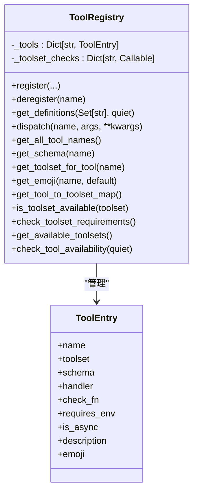

图表来源
- [tools/registry.py](file://tools/registry.py)

章节来源
- [tools/registry.py](file://tools/registry.py)

### 终端工具（terminal_tool）
- 功能：在本地、Docker、Modal、SSH、Singularity、Daytona 等环境中执行命令，支持前台/后台、持久化、工作目录、PTY 模式、超时与生命周期管理
- 安全：危险命令审批、sudo 密码缓存与交互提示、路径白名单、磁盘用量告警
- 环境管理：全局环境缓存、活动时间跟踪、后台清理线程、任务级环境覆盖
- 参数与配置：通过环境变量控制后端类型、镜像、CPU/内存/磁盘、持久化、超时、工作目录等

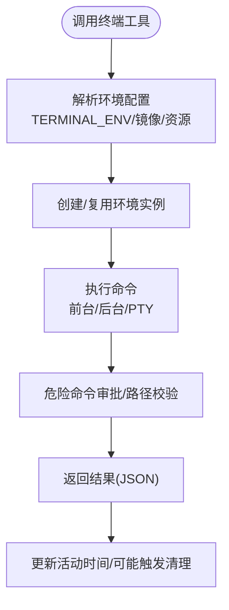

图表来源
- [tools/terminal_tool.py](file://tools/terminal_tool.py)

章节来源
- [tools/terminal_tool.py](file://tools/terminal_tool.py)

### 文件工具（file_tools）
- 功能：读取、写入、补丁编辑、搜索文件内容/文件名；支持分页读取、去重、大文件截断提示、敏感路径保护
- 安全：设备路径阻断、内部缓存文件访问阻断、敏感路径拒绝、写入异常预期判断、文件 staleness 检测
- 性能：读取去重缓存、连续读/搜循环检测与阻断、最大字符数限制、读取历史汇总
- 与终端集成：共享环境后端，按任务 ID 复用或创建新环境

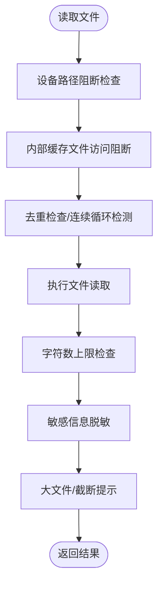

图表来源
- [tools/file_tools.py](file://tools/file_tools.py)

章节来源
- [tools/file_tools.py](file://tools/file_tools.py)

### 浏览器工具（browser_tool）
- 功能：导航、快照、点击、输入、滚动、后退、关闭、图片提取、视觉分析、控制台调试、CDP 连接
- 后端：本地 Chromium、Browserbase、Browser Use、可选 Camofox；会话隔离与自动清理
- 安全：私有地址访问开关、URL 安全检查、SSRF 防护、会话超时清理
- 配置：命令超时、会话超时、截图清理节流、CDP 端点解析

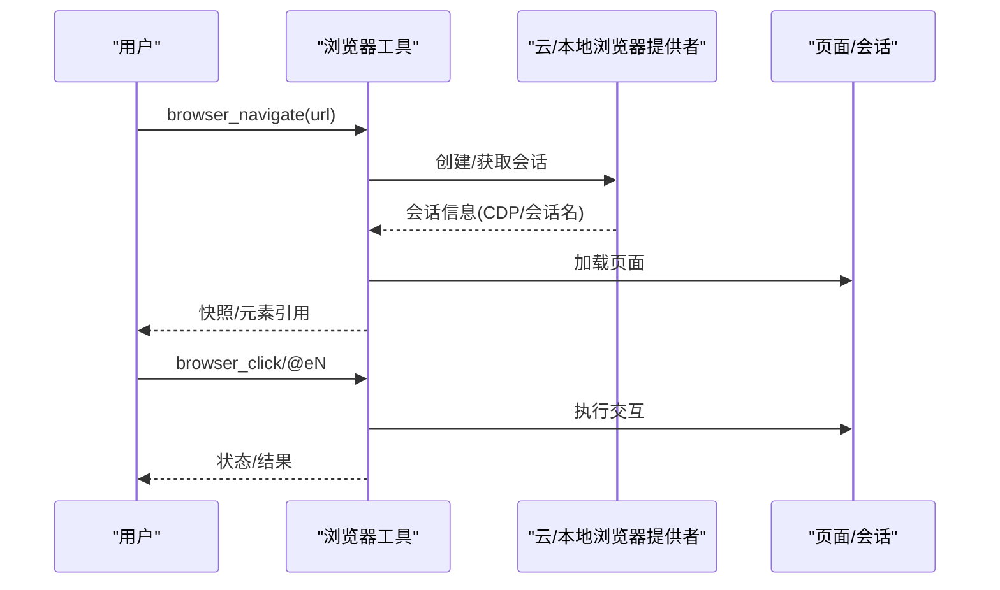

图表来源
- [tools/browser_tool.py](file://tools/browser_tool.py)

章节来源
- [tools/browser_tool.py](file://tools/browser_tool.py)

### 网络工具（web_tools）
- 功能：网页搜索、内容提取、站点爬取；支持多后端（Exa、Firecrawl、Parallel、Tavily），内容压缩与 LLM 摘要
- 安全：URL 安全检查、网站访问策略、调试模式日志
- 配置：后端选择、令牌/密钥、工具网关（Nous 订阅者）、辅助模型与超时

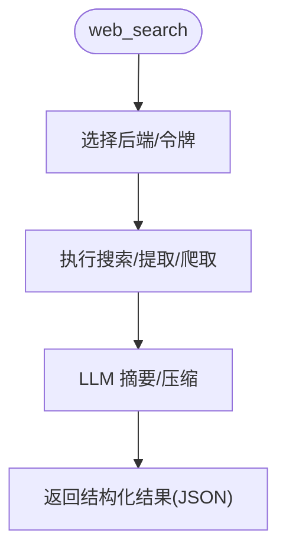

图表来源
- [tools/web_tools.py](file://tools/web_tools.py)

章节来源
- [tools/web_tools.py](file://tools/web_tools.py)

### 代码执行工具（code_execution_tool）
- 功能：允许 LLM 编写脚本调用 Hermes 工具，本地 UDS 或远程文件 RPC 两种传输；限制工具调用次数与参数
- 安全：仅允许白名单工具、禁止后台/通知等参数、远程执行 Python 可用性检查、响应大小限制
- 集成：与终端环境共享后端，按任务 ID 创建沙箱目录

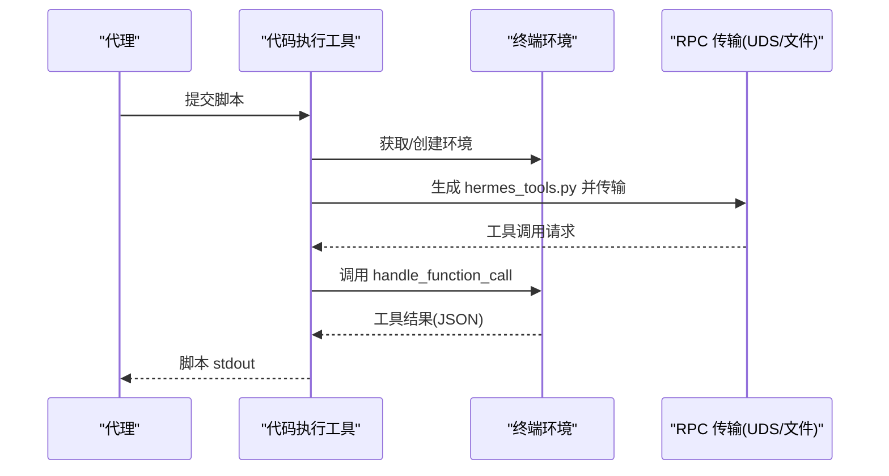

图表来源
- [tools/code_execution_tool.py](file://tools/code_execution_tool.py)

章节来源
- [tools/code_execution_tool.py](file://tools/code_execution_tool.py)

### MCP 工具（mcp_tool）
- 功能：连接外部 MCP 服务器，发现工具并动态注册到注册表；支持 stdio 与 HTTP/StreamableHTTP；采样回调与速率限制
- 安全：环境变量过滤、凭据模式脱敏、连接超时与指数回退、通知驱动的动态刷新
- 线程模型：后台事件循环线程，每个服务器一个长生命周期任务

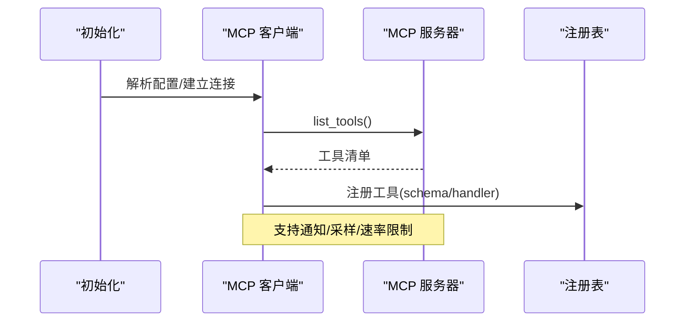

图表来源
- [tools/mcp_tool.py](file://tools/mcp_tool.py)

章节来源
- [tools/mcp_tool.py](file://tools/mcp_tool.py)

### 技能工具（skills_tool）
- 功能：列出技能元数据、查看技能全文与关联文件；支持平台过滤、前置条件与环境变量收集
- 数据模型：YAML Frontmatter 元数据、渐进披露（Tier 1/2/3）
- 集成：与外部技能目录协同，禁用技能过滤，类别描述加载

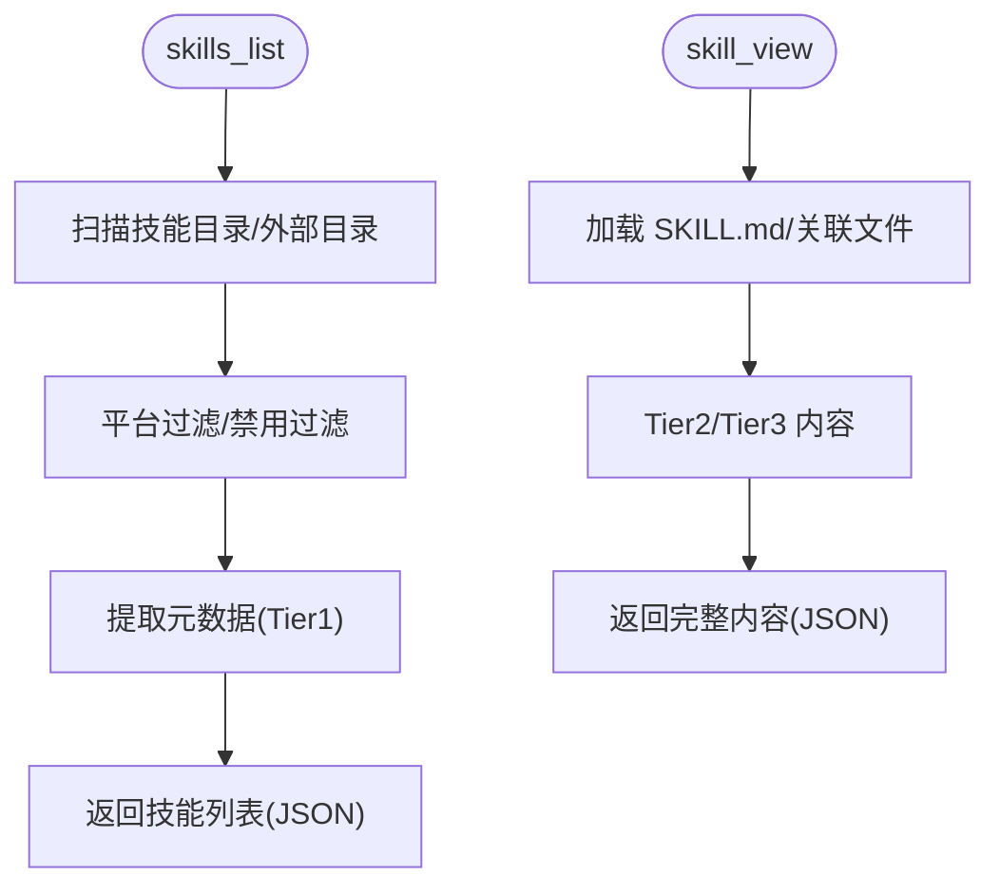

图表来源
- [tools/skills_tool.py](file://tools/skills_tool.py)

章节来源
- [tools/skills_tool.py](file://tools/skills_tool.py)

### 消息发送工具（send_message_tool）
- 功能：跨平台消息发送（Telegram、Discord、Slack、WhatsApp、Signal、Matrix、Mattermost、HomeAssistant、钉钉、飞书、微信、邮件、短信）
- 安全：错误文本脱敏、URL 与密钥模式替换、媒体附件处理（Telegram 支持）
- 适配：平台特定长度限制与智能分片、目标解析与 home channel 回退

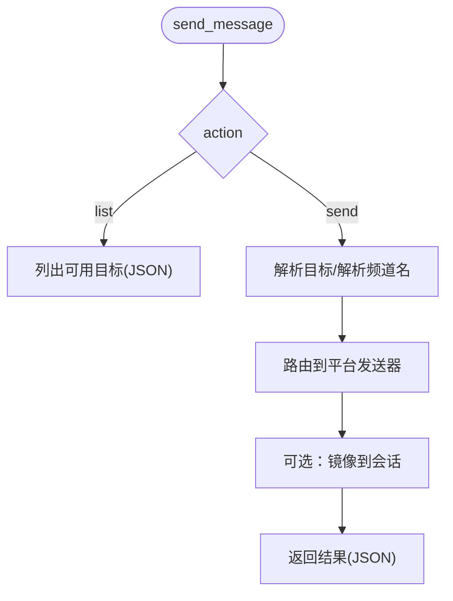

图表来源
- [tools/send_message_tool.py](file://tools/send_message_tool.py)

章节来源
- [tools/send_message_tool.py](file://tools/send_message_tool.py)

## 依赖分析
- 工具注册表是所有工具的中心枢纽，避免了循环导入问题，同时提供工具集可用性查询与工具 schema 聚合
- 终端工具与文件工具共享环境抽象层，减少后端切换成本
- 浏览器工具与网络工具分别依赖各自的安全与后端模块
- 代码执行工具依赖终端环境与 RPC 传输，确保远程执行一致性
- MCP 工具依赖外部 SDK，具备降级与通知能力
- 技能工具与消息工具分别依赖外部平台与目录服务

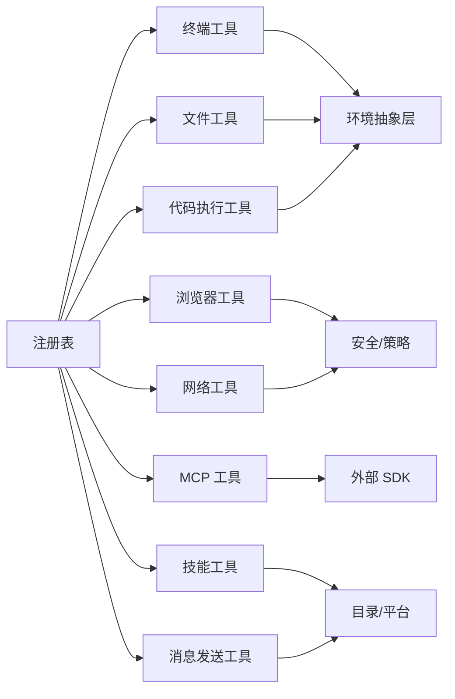

图表来源
- [tools/registry.py](file://tools/registry.py)
- [tools/terminal_tool.py](file://tools/terminal_tool.py)
- [tools/file_tools.py](file://tools/file_tools.py)
- [tools/browser_tool.py](file://tools/browser_tool.py)
- [tools/web_tools.py](file://tools/web_tools.py)
- [tools/code_execution_tool.py](file://tools/code_execution_tool.py)
- [tools/mcp_tool.py](file://tools/mcp_tool.py)
- [tools/skills_tool.py](file://tools/skills_tool.py)
- [tools/send_message_tool.py](file://tools/send_message_tool.py)

章节来源
- [tools/registry.py](file://tools/registry.py)
- [tools/terminal_tool.py](file://tools/terminal_tool.py)
- [tools/file_tools.py](file://tools/file_tools.py)
- [tools/browser_tool.py](file://tools/browser_tool.py)
- [tools/web_tools.py](file://tools/web_tools.py)
- [tools/code_execution_tool.py](file://tools/code_execution_tool.py)
- [tools/mcp_tool.py](file://tools/mcp_tool.py)
- [tools/skills_tool.py](file://tools/skills_tool.py)
- [tools/send_message_tool.py](file://tools/send_message_tool.py)

## 性能考虑
- 工具注册表对工具集可用性进行缓存，避免重复检查开销
- 文件工具的读取去重与连续循环检测减少重复 IO 与上下文占用
- 终端工具的后台清理线程定期回收闲置环境，降低资源泄漏风险
- 网络工具对大内容进行 LLM 摘要与分块处理，控制上下文长度
- 代码执行工具限制工具调用次数与输出大小，防止滥用
- 浏览器工具的会话超时清理与截图清理节流，避免资源堆积

## 故障排除指南
- 终端工具
  - 症状：命令长时间无响应
    - 排查：检查超时设置、是否后台任务、是否被中断
    - 处理：缩短超时、改为前台执行、确认环境可用性
  - 症状：sudo 失败
    - 排查：检查 SUDO_PASSWORD、交互模式、消息通道提示
    - 处理：设置密码或在非交互模式下规避
  - 症状：磁盘用量过高
    - 排查：查看阈值与清理提示
    - 处理：运行清理脚本或调整阈值

- 文件工具
  - 症状：读取过大文件报错
    - 排查：检查最大字符限制与分页参数
    - 处理：使用 offset/limit 或 search_files
  - 症状：写入失败
    - 排查：敏感路径保护、权限错误、预期异常
    - 处理：改用终端工具或修正路径

- 浏览器工具
  - 症状：无法连接/会话超时
    - 排查：CDP 端点、云提供商配置、私有地址访问
    - 处理：修正端点或启用允许私有地址
  - 症状：截图/媒体失败
    - 排查：平台支持情况、文件存在性
    - 处理：更换平台或检查文件路径

- 网络工具
  - 症状：后端未配置
    - 排查：检查 API Key/URL、工具网关
    - 处理：按提示配置或切换后端
  - 症状：内容过大/摘要失败
    - 排查：LLM 超时、内容长度
    - 处理：增加超时或使用更短指令

- 代码执行工具
  - 症状：远程执行失败
    - 排查：Python 可用性、工具调用次数限制
    - 处理：安装 Python、减少工具调用或优化脚本

- MCP 工具
  - 症状：连接失败/工具不可见
    - 排查：SDK 版本、传输协议、通知支持
    - 处理：升级 SDK、检查配置、启用通知

- 技能工具
  - 症状：技能缺失/平台不兼容
    - 排查：平台映射、禁用列表、外部目录
    - 处理：调整平台或启用技能

- 消息发送工具
  - 症状：发送失败/凭据错误
    - 排查：平台配置、令牌/账号、媒体附件
    - 处理：检查凭据、移除敏感信息或简化消息

章节来源
- [tools/terminal_tool.py](file://tools/terminal_tool.py)
- [tools/file_tools.py](file://tools/file_tools.py)
- [tools/browser_tool.py](file://tools/browser_tool.py)
- [tools/web_tools.py](file://tools/web_tools.py)
- [tools/code_execution_tool.py](file://tools/code_execution_tool.py)
- [tools/mcp_tool.py](file://tools/mcp_tool.py)
- [tools/skills_tool.py](file://tools/skills_tool.py)
- [tools/send_message_tool.py](file://tools/send_message_tool.py)

## 结论
Hermes Agent 的工具系统通过注册中心实现统一管理与调度，结合多后端环境抽象与完善的安全机制，提供了稳定、可扩展且易用的工具生态。开发者可通过标准接口快速扩展新工具，同时借助现有工具集与配置体系满足复杂任务场景。

## 附录

### 工具分类与数量概览
- 终端工具：terminal（多后端命令执行）
- 文件工具：read_file、write_file、patch、search_files
- 浏览器工具：browser_navigate、browser_snapshot、browser_click、browser_type、browser_scroll、browser_back、browser_press、browser_close、browser_get_images、browser_vision、browser_console
- 网络工具：web_search、web_extract、web_crawl
- 代码执行工具：execute_code（程序化工具调用）
- MCP 工具：mcp_connect/discover/register（外部工具接入）
- 技能工具：skills_list、skill_view、skills_categories
- 消息发送工具：send_message（多平台）

章节来源
- [tools/terminal_tool.py](file://tools/terminal_tool.py)
- [tools/file_tools.py](file://tools/file_tools.py)
- [tools/browser_tool.py](file://tools/browser_tool.py)
- [tools/web_tools.py](file://tools/web_tools.py)
- [tools/code_execution_tool.py](file://tools/code_execution_tool.py)
- [tools/mcp_tool.py](file://tools/mcp_tool.py)
- [tools/skills_tool.py](file://tools/skills_tool.py)
- [tools/send_message_tool.py](file://tools/send_message_tool.py)

### 工具开发指南
- 注册步骤
  - 在工具模块中定义处理器函数与 OpenAI 格式 schema
  - 调用注册表的 register 方法，传入工具名、工具集、schema、处理器、可选 check_fn、描述与表情
  - 如需 per-toolset check，提供 check_fn 并在注册表中自动登记
- 参数校验
  - 使用 schema 中的 required 字段与默认值约束
  - 对高危参数（如后台/通知）在工具内部进行限制或转换
- 安全与合规
  - 终端：危险命令审批、sudo 密码缓存、路径白名单
  - 文件：设备路径阻断、内部缓存文件阻断、敏感路径保护
  - 浏览器：私有地址访问开关、URL 安全检查
  - 网络：令牌/密钥脱敏、调试日志
  - 消息：错误文本脱敏、媒体附件处理
- 性能与可观测性
  - 使用注册表的工具集可用性查询，避免无效尝试
  - 文件工具的去重与连续循环检测
  - 终端与浏览器的后台清理线程
  - 网络工具的大内容摘要与分块处理
- 最佳实践
  - 明确工具职责边界，避免过度耦合
  - 提供清晰的 schema 描述与示例
  - 严格区分工具集与工具，便于权限与策略控制
  - 在工具内部统一使用 tool_error/tool_result 输出格式

章节来源
- [tools/registry.py](file://tools/registry.py)
- [tools/terminal_tool.py](file://tools/terminal_tool.py)
- [tools/file_tools.py](file://tools/file_tools.py)
- [tools/browser_tool.py](file://tools/browser_tool.py)
- [tools/web_tools.py](file://tools/web_tools.py)
- [tools/code_execution_tool.py](file://tools/code_execution_tool.py)
- [tools/mcp_tool.py](file://tools/mcp_tool.py)
- [tools/skills_tool.py](file://tools/skills_tool.py)
- [tools/send_message_tool.py](file://tools/send_message_tool.py)