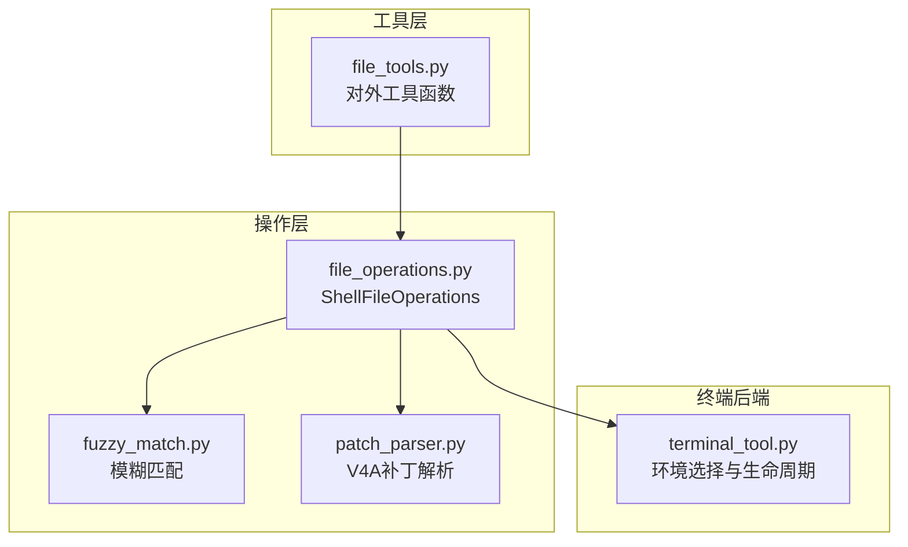
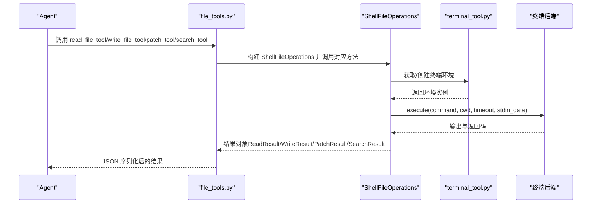
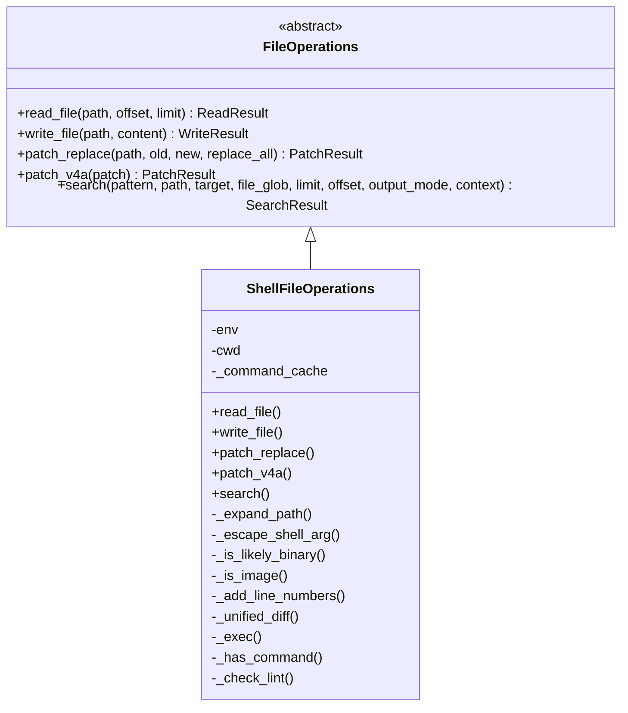
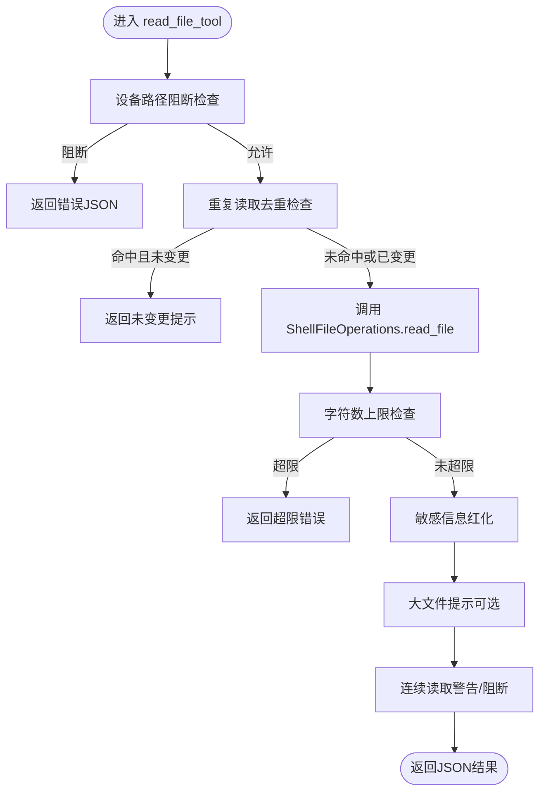
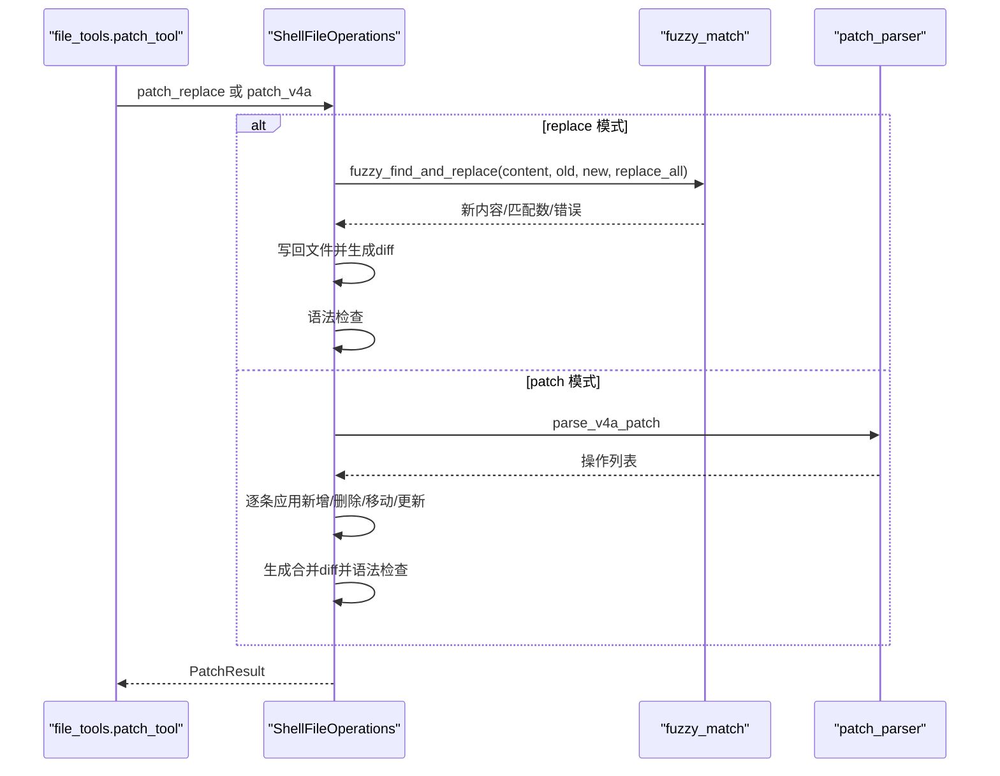
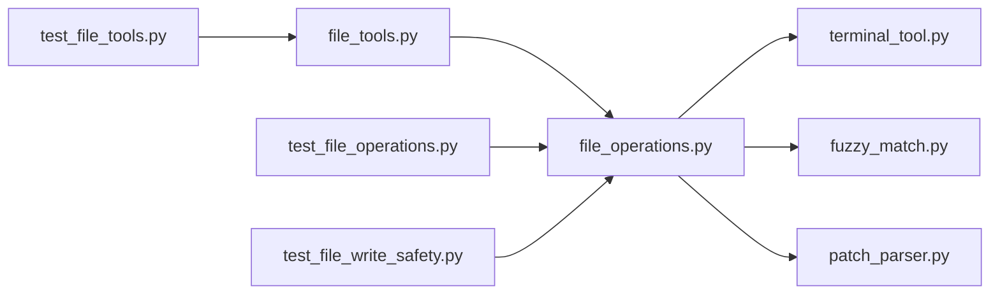

# 文件操作工具

<cite>
**本文档引用的文件**
- [tools/file_operations.py](file://tools/file_operations.py)
- [tools/file_tools.py](file://tools/file_tools.py)
- [tools/fuzzy_match.py](file://tools/fuzzy_match.py)
- [tools/patch_parser.py](file://tools/patch_parser.py)
- [tools/terminal_tool.py](file://tools/terminal_tool.py)
- [tests/tools/test_file_operations.py](file://tests/tools/test_file_operations.py)
- [tests/tools/test_file_tools.py](file://tests/tools/test_file_tools.py)
- [tests/tools/test_file_write_safety.py](file://tests/tools/test_file_write_safety.py)
</cite>

## 目录
1. [简介](#简介)
2. [项目结构](#项目结构)
3. [核心组件](#核心组件)
4. [架构总览](#架构总览)
5. [详细组件分析](#详细组件分析)
6. [依赖分析](#依赖分析)
7. [性能考虑](#性能考虑)
8. [故障排除指南](#故障排除指南)
9. [结论](#结论)
10. [附录](#附录)

## 简介
本文件操作工具为 Hermes Agent 提供统一的跨后端文件系统能力，覆盖文件读取、写入、补丁编辑、内容与文件名搜索等核心功能。其设计以“所有文件操作均可表达为 shell 命令”为核心理念，通过终端后端（本地、Docker、Singularity、SSH、Modal、Daytona）的 execute 接口实现一致的文件 API。工具内置多层次安全机制（路径遍历防护、敏感路径阻断、可选安全根沙箱）、读取字符数上限、重复读取去重、写入前一致性校验、自动语法检查等特性，确保在多环境、多用户场景下的安全性与稳定性。

## 项目结构
文件操作工具由以下模块组成：
- 工具层：对外暴露 read_file、write_file、patch、search_files 四个工具函数，负责参数解析、调用限制、提示与错误处理。
- 操作层：ShellFileOperations 实现具体文件操作，封装 shell 命令执行、路径展开、二进制检测、行号添加、差异生成等。
- 辅助模块：模糊匹配（fuzzy_match）、V4A 补丁解析（patch_parser），以及终端工具（terminal_tool）用于环境选择与清理。

**图表来源**
- [tools/file_tools.py:149-267](file://tools/file_tools.py#L149-L267)
- [tools/file_operations.py:321-348](file://tools/file_operations.py#L321-L348)
- [tools/fuzzy_match.py:50-101](file://tools/fuzzy_match.py#L50-L101)
- [tools/patch_parser.py:68-206](file://tools/patch_parser.py#L68-L206)
- [tools/terminal_tool.py:1-120](file://tools/terminal_tool.py#L1-L120)

**章节来源**
- [tools/file_tools.py:149-267](file://tools/file_tools.py#L149-L267)
- [tools/file_operations.py:321-348](file://tools/file_operations.py#L321-L348)
- [tools/fuzzy_match.py:50-101](file://tools/fuzzy_match.py#L50-L101)
- [tools/patch_parser.py:68-206](file://tools/patch_parser.py#L68-L206)
- [tools/terminal_tool.py:1-120](file://tools/terminal_tool.py#L1-L120)

## 核心组件
- ShellFileOperations：抽象出统一的文件操作接口，支持读取（含分页、行号、二进制检测）、写入（父目录自动创建、stdin 管道写入）、补丁（替换模式与 V4A 多文件补丁）、搜索（内容与文件名，基于 ripgrep）。
- file_tools：面向 LLM 的工具函数层，提供 read_file_tool、write_file_tool、patch_tool、search_tool，内置设备路径阻断、重复读取去重、最大读取字符数限制、敏感路径拒绝、写入前后一致性校验、结果提示与错误处理。
- fuzzy_match：提供八种策略的模糊匹配链，适配 LLM 生成代码中的换行、缩进、转义等差异，支持唯一性约束或全部替换。
- patch_parser：解析 V4A 格式补丁，支持更新、新增、删除、移动四种操作，并自动生成 diff。
- terminal_tool：统一的终端后端入口，支持本地、Docker、Modal、Singularity、SSH、Daytona 等环境，负责环境创建、缓存、清理与危险命令审批。

**章节来源**
- [tools/file_operations.py:247-277](file://tools/file_operations.py#L247-L277)
- [tools/file_tools.py:279-706](file://tools/file_tools.py#L279-L706)
- [tools/fuzzy_match.py:50-101](file://tools/fuzzy_match.py#L50-L101)
- [tools/patch_parser.py:68-206](file://tools/patch_parser.py#L68-L206)
- [tools/terminal_tool.py:1-120](file://tools/terminal_tool.py#L1-L120)

## 架构总览
文件操作工具采用“工具层-操作层-终端后端”的分层架构。工具层负责输入校验、安全检查、上下文提示；操作层负责与终端后端交互，执行 shell 命令；终端后端负责实际的执行环境与资源管理。

**图表来源**
- [tools/file_tools.py:149-267](file://tools/file_tools.py#L149-L267)
- [tools/file_operations.py:349-367](file://tools/file_operations.py#L349-L367)
- [tools/terminal_tool.py:1-120](file://tools/terminal_tool.py#L1-L120)

## 详细组件分析

### ShellFileOperations 组件
- 读取：支持分页读取（offset/limit）、行号添加、二进制检测（扩展名快速判断 + 内容采样分析）、大文件警告、相似文件建议。
- 写入：自动创建父目录、通过 stdin 管道写入避免 ARG_MAX 限制、统计字节数、错误处理。
- 补丁：替换模式（模糊匹配 + 唯一性校验 + 自动语法检查）、V4A 多文件补丁应用（新增/删除/移动/更新）。
- 搜索：内容搜索（正则）与文件搜索（glob），支持上下文行输出、计数模式、分页与截断提示。
- 安全：路径展开（~ 与 ~user）时进行白名单校验，防止 shell 注入；二进制与图像文件不内联显示；对敏感路径与可选安全根沙箱进行写入阻断。

**图表来源**
- [tools/file_operations.py:247-277](file://tools/file_operations.py#L247-L277)
- [tools/file_operations.py:321-766](file://tools/file_operations.py#L321-L766)

**章节来源**
- [tools/file_operations.py:469-556](file://tools/file_operations.py#L469-L556)
- [tools/file_operations.py:587-639](file://tools/file_operations.py#L587-L639)
- [tools/file_operations.py:645-704](file://tools/file_operations.py#L645-L704)
- [tools/file_operations.py:772-806](file://tools/file_operations.py#L772-L806)

### file_tools 工具层组件
- 读取工具：设备路径阻断（/dev/*、/proc/self/fd/*）、内部缓存文件阻断（防止提示注入）、重复读取去重、最大读取字符数限制、敏感路径拒绝、连续读取循环检测与阻断、结果红化处理。
- 写入工具：敏感路径拒绝、写入前后时间戳一致性校验、预期写入异常日志降噪。
- 补丁工具：替换模式与 V4A 模式双通道、多文件补丁路径校验、旧字符串未找到时的显式提示。
- 搜索工具：连续搜索循环检测与阻断、截断结果的下一页提示。
- 配置：file_read_max_chars 可配置读取字符上限；HERMES_WRITE_SAFE_ROOT 可启用写入安全根沙箱。

**图表来源**
- [tools/file_tools.py:279-436](file://tools/file_tools.py#L279-L436)

**章节来源**
- [tools/file_tools.py:279-436](file://tools/file_tools.py#L279-L436)
- [tools/file_tools.py:559-581](file://tools/file_tools.py#L559-L581)
- [tools/file_tools.py:583-637](file://tools/file_tools.py#L583-L637)
- [tools/file_tools.py:640-706](file://tools/file_tools.py#L640-L706)

### 模糊匹配与 V4A 补丁解析
- 模糊匹配：提供八种策略（精确、逐行去空白、空白归一化、忽略缩进、转义归一化、边界去空白、锚定块、上下文感知）的匹配链，支持唯一性约束或全部替换。
- V4A 解析：解析 Begin/End 标记、文件操作类型（Update/Add/Delete/Move）、hunk 上下文提示与增删行，应用到目标文件并生成 diff，自动运行语言特定语法检查。

**图表来源**
- [tools/file_tools.py:583-637](file://tools/file_tools.py#L583-L637)
- [tools/file_operations.py:645-704](file://tools/file_operations.py#L645-L704)
- [tools/fuzzy_match.py:50-101](file://tools/fuzzy_match.py#L50-L101)
- [tools/patch_parser.py:68-206](file://tools/patch_parser.py#L68-L206)

**章节来源**
- [tools/fuzzy_match.py:50-101](file://tools/fuzzy_match.py#L50-L101)
- [tools/patch_parser.py:68-206](file://tools/patch_parser.py#L68-L206)
- [tools/patch_parser.py:209-294](file://tools/patch_parser.py#L209-L294)

### 终端后端与环境管理
- 支持本地、Docker、Modal、Singularity、SSH、Daytona 等多种后端，按 TERMINAL_ENV 选择。
- 环境缓存与清理：按任务 ID 缓存 ShellFileOperations，后台线程定期清理空闲环境；容器磁盘使用告警阈值可配置。
- 危险命令审批：集中化的危险命令检测与审批回调，支持网关场景下的 sudo 密码提示增强。

**章节来源**
- [tools/terminal_tool.py:1-120](file://tools/terminal_tool.py#L1-L120)
- [tools/terminal_tool.py:82-108](file://tools/terminal_tool.py#L82-L108)

## 依赖分析
- file_tools 依赖 file_operations 的 ShellFileOperations；ShellFileOperations 依赖 terminal_tool 的环境执行接口。
- 补丁功能依赖 fuzzy_match（替换模式）与 patch_parser（V4A 模式）。
- 测试覆盖了写入拒绝列表、结果数据类、ShellFileOperations 辅助函数、路径存在性校验、写入拒绝路径等。

**图表来源**
- [tools/file_tools.py:10-11](file://tools/file_tools.py#L10-L11)
- [tools/file_operations.py:321-348](file://tools/file_operations.py#L321-L348)
- [tools/fuzzy_match.py:22-29](file://tools/fuzzy_match.py#L22-L29)
- [tools/patch_parser.py:21-29](file://tools/patch_parser.py#L21-L29)
- [tests/tools/test_file_operations.py:8-22](file://tests/tools/test_file_operations.py#L8-L22)
- [tests/tools/test_file_tools.py:11-17](file://tests/tools/test_file_tools.py#L11-L17)
- [tests/tools/test_file_write_safety.py:10-21](file://tests/tools/test_file_write_safety.py#L10-L21)

**章节来源**
- [tests/tools/test_file_operations.py:8-22](file://tests/tools/test_file_operations.py#L8-L22)
- [tests/tools/test_file_tools.py:11-17](file://tests/tools/test_file_tools.py#L11-L17)
- [tests/tools/test_file_write_safety.py:10-21](file://tests/tools/test_file_write_safety.py#L10-L21)

## 性能考虑
- 读取性能：分页读取（sed）、行号添加（内存拼接）、二进制检测（扩展名快速判断 + 内容采样）、最大字符数限制（避免模型上下文膨胀）。
- 写入性能：stdin 管道写入绕过 ARG_MAX 限制，适合大文件；自动创建父目录减少多次往返。
- 搜索性能：基于 ripgrep 的内容与文件搜索，支持上下文行输出与计数模式；路径存在性检查避免无效查询。
- 缓存与去重：重复读取去重、连续循环检测与阻断，降低无效 IO 与上下文占用。
- 环境管理：按任务缓存环境、后台清理线程、磁盘使用告警，避免资源泄漏。

[本节为通用指导，无需特定文件分析]

## 故障排除指南
- 写入被拒：检查是否命中敏感路径（如 ~/.ssh/*、/etc/*、/boot/*、/usr/lib/systemd/*、/var/run/docker.sock 等）或启用 HERMES_WRITE_SAFE_ROOT 沙箱导致的越界写入。
- 无法读取二进制/图像：工具会识别并提示改用视觉分析工具；若误判，可通过扩展名或内容采样逻辑调整。
- 搜索路径不存在：search() 在执行前会验证路径存在性，不存在时返回错误；请先使用 terminal 工具确认路径。
- 连续读取/搜索循环：当同一请求重复超过阈值时，工具会发出警告或直接阻断，建议调整 offset/limit 或停止循环。
- 写入前后不一致：工具记录读取时间戳并在写入后刷新，若检测到外部修改会给出警告提示。
- 权限错误：预期的权限错误（如 EACCES/EPERM/EROFS）不会产生错误日志，非预期异常会记录错误日志以便排查。

**章节来源**
- [tools/file_tools.py:98-116](file://tools/file_tools.py#L98-L116)
- [tools/file_tools.py:559-581](file://tools/file_tools.py#L559-L581)
- [tools/file_tools.py:528-557](file://tools/file_tools.py#L528-L557)
- [tools/file_tools.py:640-706](file://tools/file_tools.py#L640-L706)
- [tests/tools/test_file_operations.py:326-336](file://tests/tools/test_file_operations.py#L326-L336)

## 结论
Hermes Agent 的文件操作工具通过统一的 ShellFileOperations 抽象，实现了跨后端的一致文件 API，并在工具层提供了完善的输入校验、安全防护、性能优化与错误处理机制。结合模糊匹配与 V4A 补丁解析，工具能够稳健地处理 LLM 生成的代码变更；配合终端后端的环境管理与危险命令审批，满足多场景下的安全与可用性需求。

[本节为总结，无需特定文件分析]

## 附录

### 安全机制与最佳实践
- 路径遍历与注入防护
  - 路径展开（~ 与 ~user）时进行白名单校验，避免 shell 注入。
  - 所有参数均通过单引号转义与管道输入，避免命令行参数溢出。
- 敏感路径阻断
  - 写入前检查敏感路径（~/.ssh/*、/etc/*、/boot/*、/usr/lib/systemd/*、/var/run/docker.sock 等）。
  - 可通过 HERMES_WRITE_SAFE_ROOT 启用写入安全根沙箱，仅允许在指定子树内写入。
- 二进制与图像文件
  - 二进制与图像文件不内联显示，自动提示改用视觉分析工具。
- 读取字符数限制
  - 默认最大读取字符数约 10 万，可通过配置项 file_read_max_chars 调整。
- 连续循环检测
  - 对重复的读取/搜索请求进行警告与阻断，避免无效循环。
- 写入一致性校验
  - 记录读取时间戳，写入后刷新；若检测到外部修改给出警告。
- 最佳实践
  - 大文件读取使用 offset/limit 分段读取。
  - 使用 patch 替代直接写入，确保变更可追踪与可回滚。
  - 对于多文件批量变更，优先使用 V4A 补丁格式。
  - 在网关/消息场景中，合理配置 sudo 密码与危险命令审批流程。

**章节来源**
- [tools/file_operations.py:412-448](file://tools/file_operations.py#L412-L448)
- [tools/file_operations.py:98-116](file://tools/file_operations.py#L98-L116)
- [tools/file_tools.py:31-52](file://tools/file_tools.py#L31-L52)
- [tools/file_tools.py:98-116](file://tools/file_tools.py#L98-L116)
- [tools/file_tools.py:528-557](file://tools/file_tools.py#L528-L557)
- [tests/tools/test_file_write_safety.py:28-57](file://tests/tools/test_file_write_safety.py#L28-L57)

### 配置选项
- file_read_max_chars：控制单次读取的最大字符数，默认约 10 万，可按需调整。
- HERMES_WRITE_SAFE_ROOT：启用写入安全根沙箱，仅允许在指定子树内写入，越界写入将被拒绝。
- TERMINAL_ENV：选择终端后端（local、docker、modal、singularity、ssh、daytona）。
- TERMINAL_DISK_WARNING_GB：磁盘使用告警阈值（GB），默认 500GB。

**章节来源**
- [tools/file_tools.py:31-52](file://tools/file_tools.py#L31-L52)
- [tools/file_tools.py:98-116](file://tools/file_tools.py#L98-L116)
- [tools/terminal_tool.py:78-108](file://tools/terminal_tool.py#L78-L108)

### 使用示例（路径指引）
- 读取文件（分页与行号）
  - [tools/file_tools.py:279-436](file://tools/file_tools.py#L279-L436)
- 写入文件（覆盖写入）
  - [tools/file_tools.py:559-581](file://tools/file_tools.py#L559-L581)
- 补丁编辑（替换模式）
  - [tools/file_tools.py:583-637](file://tools/file_tools.py#L583-L637)
- 补丁编辑（V4A 模式）
  - [tools/file_tools.py:583-637](file://tools/file_tools.py#L583-L637)
- 搜索文件内容/文件名
  - [tools/file_tools.py:640-706](file://tools/file_tools.py#L640-L706)