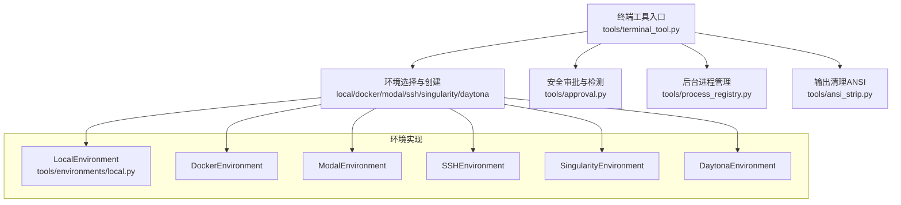
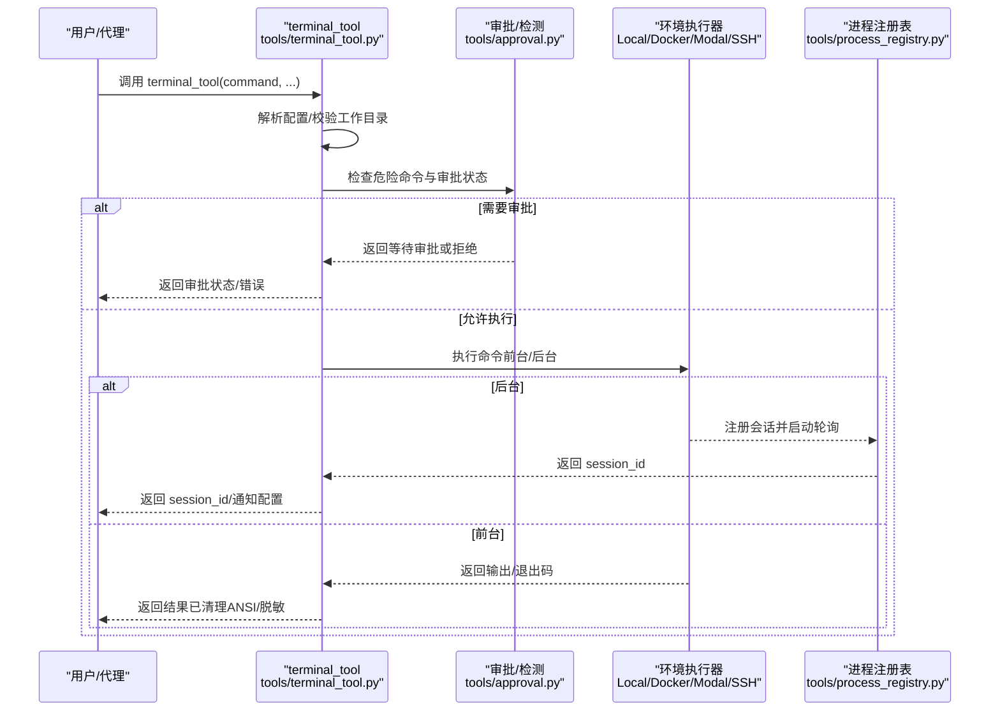
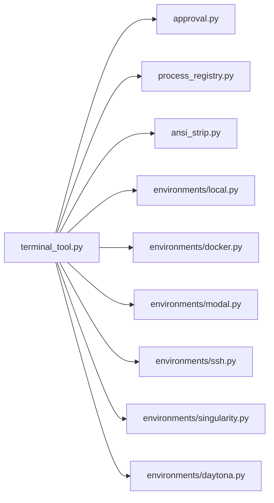

# 终端工具

<cite>
**本文引用的文件**
- [tools/terminal_tool.py](file://tools/terminal_tool.py)
- [tools/environments/local.py](file://tools/environments/local.py)
- [tools/approval.py](file://tools/approval.py)
- [tools/ansi_strip.py](file://tools/ansi_strip.py)
- [tools/process_registry.py](file://tools/process_registry.py)
- [tests/integration/test_modal_terminal.py](file://tests/integration/test_modal_terminal.py)
- [environments/terminal_test_env/terminal_test_env.py](file://environments/terminal_test_env/terminal_test_env.py)
</cite>

## 目录
1. [简介](#简介)
2. [项目结构](#项目结构)
3. [核心组件](#核心组件)
4. [架构总览](#架构总览)
5. [详细组件分析](#详细组件分析)
6. [依赖关系分析](#依赖关系分析)
7. [性能考量](#性能考量)
8. [故障排除指南](#故障排除指南)
9. [结论](#结论)
10. [附录：使用示例与最佳实践](#附录使用示例与最佳实践)

## 简介
本文件系统性介绍 Hermes Agent 的终端工具（terminal_tool），覆盖以下主题：
- 功能范围：本地与多后端（容器、云沙箱、SSH）命令执行、后台任务管理、会话隔离与生命周期管理
- 安全机制：危险命令检测与审批、命令白名单、资源限制、输出过滤、敏感信息脱敏
- 配置项：超时、工作目录、环境变量透传、持久化、容器资源配额等
- 使用场景：在代理对话中安全地执行终端命令，支持前台即时返回与后台长期任务
- 故障排除与最佳实践：常见问题定位、输出截断与 ANSI 清理、sudo 密码处理、磁盘用量告警

## 项目结构
终端工具位于 tools 子模块，围绕“工具入口 + 环境抽象 + 安全与进程管理”三层组织：
- 工具入口：tools/terminal_tool.py 提供统一 API 与配置解析、环境选择、清理线程、退出回收
- 环境抽象：tools/environments/*.py（local、docker、modal、ssh、singularity、daytona）封装不同执行后端
- 安全与进程：tools/approval.py（危险命令检测与审批）、tools/process_registry.py（后台任务管理）、tools/ansi_strip.py（ANSI 转义清理）

图示来源
- [tools/terminal_tool.py:583-713](file://tools/terminal_tool.py#L583-L713)
- [tools/environments/local.py:317-487](file://tools/environments/local.py#L317-L487)
- [tools/approval.py:645-800](file://tools/approval.py#L645-L800)
- [tools/process_registry.py:90-120](file://tools/process_registry.py#L90-L120)
- [tools/ansi_strip.py:1-45](file://tools/ansi_strip.py#L1-L45)

章节来源
- [tools/terminal_tool.py:1-1621](file://tools/terminal_tool.py#L1-L1621)
- [tools/environments/local.py:1-487](file://tools/environments/local.py#L1-L487)
- [tools/approval.py:1-878](file://tools/approval.py#L1-L878)
- [tools/ansi_strip.py:1-45](file://tools/ansi_strip.py#L1-L45)
- [tools/process_registry.py:1-906](file://tools/process_registry.py#L1-L906)

## 核心组件
- 终端工具入口 terminal_tool：统一参数校验、配置解析、环境选择、安全检查、执行与结果封装
- 环境抽象：LocalEnvironment 等类实现 execute 接口，屏蔽后端差异
- 审批与检测：approval 模块负责危险命令模式匹配、会话级审批状态、智能审批与网关同步
- 进程注册表：process_registry 管理后台任务生命周期、输出缓冲、轮询与通知
- 输出清理：ansi_strip 去除 ANSI 转义，避免模型复制格式控制符

章节来源
- [tools/terminal_tool.py:991-1388](file://tools/terminal_tool.py#L991-L1388)
- [tools/environments/local.py:317-487](file://tools/environments/local.py#L317-L487)
- [tools/approval.py:539-612](file://tools/approval.py#L539-L612)
- [tools/process_registry.py:90-120](file://tools/process_registry.py#L90-L120)
- [tools/ansi_strip.py:35-45](file://tools/ansi_strip.py#L35-L45)

## 架构总览
终端工具在调用链上的关键交互如下：

图示来源
- [tools/terminal_tool.py:1148-1388](file://tools/terminal_tool.py#L1148-L1388)
- [tools/approval.py:645-800](file://tools/approval.py#L645-L800)
- [tools/process_registry.py:132-314](file://tools/process_registry.py#L132-L314)

## 详细组件分析

### 终端工具入口（terminal_tool）
- 参数与行为
  - 前台执行：立即返回，支持超时与重试；自动截断输出、剥离 ANSI、脱敏敏感信息、解释非零退出码
  - 后台执行：通过进程注册表创建会话，支持轮询、写入 stdin、通知完成、最小化后端开销
  - 会话隔离：基于 task_id 复用/创建环境，配合 per-task 锁避免重复创建
  - 环境选择：根据 TERMINAL_ENV 选择 local/docker/modal/ssh/singularity/daytona
- 安全与合规
  - 危险命令检测与审批（approval 模块），支持智能审批与网关同步
  - 工作目录白名单校验，防止路径注入
  - sudo 密码透明处理（-S 输入），支持消息通道提示
- 生命周期与清理
  - 后台清理线程按生命周期阈值回收闲置环境
  - atexit 注册退出回收，清理所有活动环境
  - 提供手动清理接口（按 task_id 或全部）

章节来源
- [tools/terminal_tool.py:991-1388](file://tools/terminal_tool.py#L991-L1388)
- [tools/terminal_tool.py:1402-1504](file://tools/terminal_tool.py#L1402-L1504)
- [tools/terminal_tool.py:715-812](file://tools/terminal_tool.py#L715-L812)

### 环境抽象（以 LocalEnvironment 为例）
- 关键特性
  - 本地直接执行，支持交互式登录 shell、持久化 shell、stdin 管道、sudo -S
  - 输出隔离：使用围栏标记与噪声清洗，确保只提取真实命令输出
  - 环境变量过滤：阻断内部提供商密钥变量泄漏到子进程
  - PATH 补全：在最小 PATH 环境下补齐常用路径
- 与终端工具集成
  - 作为 execute() 实现，被 terminal_tool 统一调度
  - 支持前台/后台两种模式（后台通过进程注册表间接驱动）

章节来源
- [tools/environments/local.py:317-487](file://tools/environments/local.py#L317-L487)

### 审批与检测（approval）
- 检测规则
  - 危险命令模式集合（删除、权限修改、系统服务、远程管道执行、自终止等）
  - Tirith 安全扫描发现（可作为警告/阻断）
- 审批流程
  - 会话级状态（一次性/会话/永久）、网关队列、智能审批（辅助 LLM 风险评估）
  - CLI 与网关双通道，支持异步通知与超时
- 与终端工具协作
  - terminal_tool 在执行前调用统一检查函数，必要时阻塞等待用户决策

章节来源
- [tools/approval.py:68-106](file://tools/approval.py#L68-L106)
- [tools/approval.py:645-800](file://tools/approval.py#L645-L800)

### 进程注册表（process_registry）
- 能力
  - 后台任务生命周期管理：启动、轮询、等待、杀死、日志读取
  - 输出缓冲：滚动窗口（默认 200KB），支持预览与分页读取
  - 恢复与检查点：崩溃恢复、重启后探测 PID、继续监控
  - 会话隔离：按 task_id 与会话键管理
- 与终端工具协作
  - 后台命令由 terminal_tool 交由进程注册表创建会话，并可配置完成通知

章节来源
- [tools/process_registry.py:90-120](file://tools/process_registry.py#L90-L120)
- [tools/process_registry.py:132-314](file://tools/process_registry.py#L132-L314)
- [tools/process_registry.py:498-565](file://tools/process_registry.py#L498-L565)

### 输出清理与脱敏（ansi_strip + terminal_tool）
- ANSI 清理：去除 ECMA-48 全谱转义序列，避免格式控制符污染上下文
- 敏感信息脱敏：对输出进行敏感文本脱敏，降低泄露风险
- 截断策略：超过阈值时保留首尾，中间省略说明

章节来源
- [tools/ansi_strip.py:16-45](file://tools/ansi_strip.py#L16-L45)
- [tools/terminal_tool.py:1352-1372](file://tools/terminal_tool.py#L1352-L1372)

## 依赖关系分析

图示来源
- [tools/terminal_tool.py:398-406](file://tools/terminal_tool.py#L398-L406)
- [tools/approval.py:1-800](file://tools/approval.py#L1-L800)
- [tools/process_registry.py:1-906](file://tools/process_registry.py#L1-L906)
- [tools/ansi_strip.py:1-45](file://tools/ansi_strip.py#L1-L45)
- [tools/environments/local.py:1-487](file://tools/environments/local.py#L1-L487)

章节来源
- [tools/terminal_tool.py:398-406](file://tools/terminal_tool.py#L398-L406)

## 性能考量
- 前台执行
  - 采用超时与指数回退重试，避免长时间卡顿
  - 输出截断与滚动缓冲减少内存占用
- 后台执行
  - 非本地后端通过日志轮询，避免长连接与管道阻塞
  - 进程注册表限制最大并发与历史保留，防止资源膨胀
- 环境复用
  - per-task 锁与全局锁保护，避免重复创建沙箱
  - 清理线程周期回收闲置环境，降低资源占用

章节来源
- [tools/terminal_tool.py:1305-1344](file://tools/terminal_tool.py#L1305-L1344)
- [tools/terminal_tool.py:715-812](file://tools/terminal_tool.py#L715-L812)
- [tools/process_registry.py:56-60](file://tools/process_registry.py#L56-L60)
- [tools/process_registry.py:700-716](file://tools/process_registry.py#L700-L716)

## 故障排除指南
- 命令被拒绝
  - 检查是否命中危险命令模式或 Tirith 安全扫描；可通过审批回调或永久允许列表调整
  - 网关模式下注意审批队列与超时设置
- 超时与中断
  - 前台执行超时返回 124；后台等待可被用户中断事件打断
  - 可通过增加 timeout 或使用 notify_on_complete 自动通知
- sudo 失败
  - 在消息通道中提示添加 SUDO_PASSWORD；本地交互模式支持 45 秒密码提示
- 输出异常
  - ANSI 转义导致格式异常：工具已自动清理；如仍出现，检查上游命令是否强制输出着色
  - 输出过长被截断：关注截断提示，必要时分段读取或缩短命令
- 磁盘用量告警
  - 当 HerMES 目录总大小超过阈值（默认 500GB）触发告警，建议清理环境或调整阈值

章节来源
- [tools/terminal_tool.py:1318-1323](file://tools/terminal_tool.py#L1318-L1323)
- [tools/terminal_tool.py:180-203](file://tools/terminal_tool.py#L180-L203)
- [tools/terminal_tool.py:82-109](file://tools/terminal_tool.py#L82-L109)
- [tools/ansi_strip.py:35-45](file://tools/ansi_strip.py#L35-L45)

## 结论
终端工具在 Hermes Agent 中承担“安全、可控、可观测”的命令执行职责。通过多后端抽象、严格的审批与检测、后台任务管理与输出清理，既满足开发与运维场景的灵活性，又将风险控制在合理范围内。建议在生产环境中结合审批模式、资源限制与输出截断策略，形成稳定可靠的终端执行能力。

## 附录：使用示例与最佳实践

### 使用示例
- 前台执行简单命令
  - 示例：执行 echo 并获取即时结果
  - 参考：[tools/terminal_tool.py:1020-1022](file://tools/terminal_tool.py#L1020-L1022)
- 后台执行长期任务
  - 示例：启动服务器并在完成后通知
  - 参考：[tools/terminal_tool.py:1023-1024](file://tools/terminal_tool.py#L1023-L1024)
- 自定义超时与工作目录
  - 示例：长任务设置高超时，指定绝对工作目录
  - 参考：[tools/terminal_tool.py:1026-1027](file://tools/terminal_tool.py#L1026-L1027)
- 云沙箱与持久化
  - 示例：在 Modal 中安装依赖并验证
  - 参考：[tests/integration/test_modal_terminal.py:142-173](file://tests/integration/test_modal_terminal.py#L142-L173)
- 文件系统持久化与隔离
  - 示例：同一 task_id 内文件持久，不同 task_id 隔离
  - 参考：[tests/integration/test_modal_terminal.py:175-207](file://tests/integration/test_modal_terminal.py#L175-L207)
  - 参考：[tests/integration/test_modal_terminal.py:209-239](file://tests/integration/test_modal_terminal.py#L209-L239)

### 最佳实践
- 审批与安全
  - 对潜在危险命令启用审批；在网关模式下使用审批队列与超时
  - 智能审批用于降低误判，但需结合业务风险评估
- 资源与超时
  - 为长任务设置合理 timeout；后台任务使用 notify_on_complete 减少轮询
  - 控制容器 CPU/内存/磁盘配额，避免资源争用
- 输出与日志
  - 前台命令尽量短小明确；后台任务通过轮询与通知获取进度
  - 注意 ANSI 清理与输出截断，必要时拆分命令或分页读取
- 环境与清理
  - 使用 task_id 实现任务级隔离；定期清理闲置环境，避免磁盘压力
  - 退出时依赖 atexit 回收，同时可手动清理

章节来源
- [tools/terminal_tool.py:1019-1031](file://tools/terminal_tool.py#L1019-L1031)
- [tests/integration/test_modal_terminal.py:90-112](file://tests/integration/test_modal_terminal.py#L90-L112)
- [tests/integration/test_modal_terminal.py:114-140](file://tests/integration/test_modal_terminal.py#L114-L140)
- [tests/integration/test_modal_terminal.py:175-207](file://tests/integration/test_modal_terminal.py#L175-L207)
- [tests/integration/test_modal_terminal.py:209-239](file://tests/integration/test_modal_terminal.py#L209-L239)