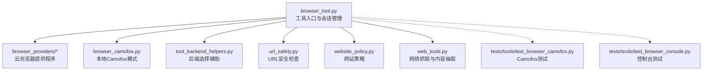
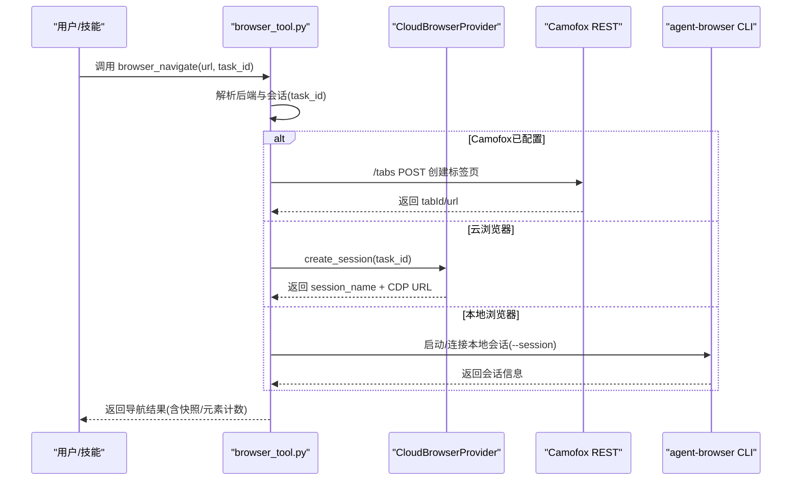
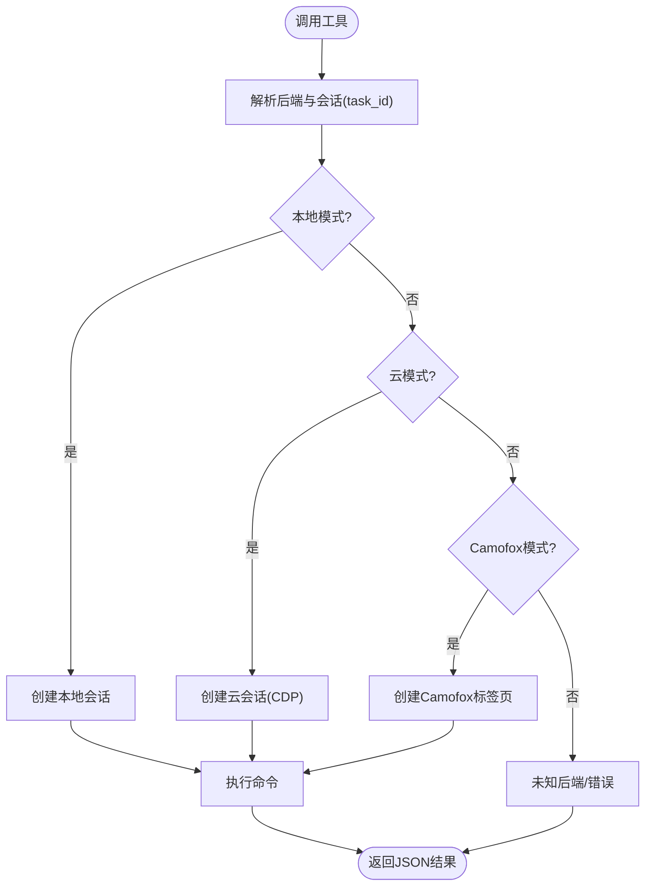
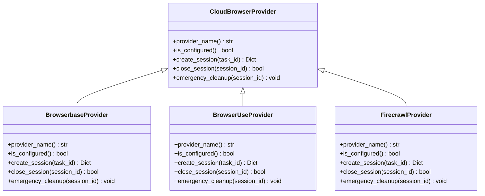
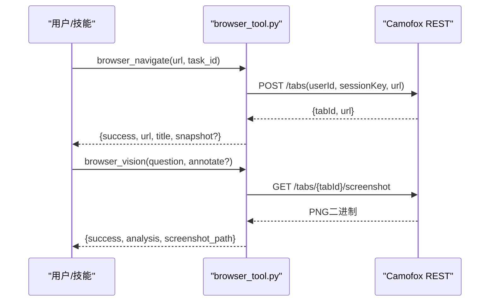
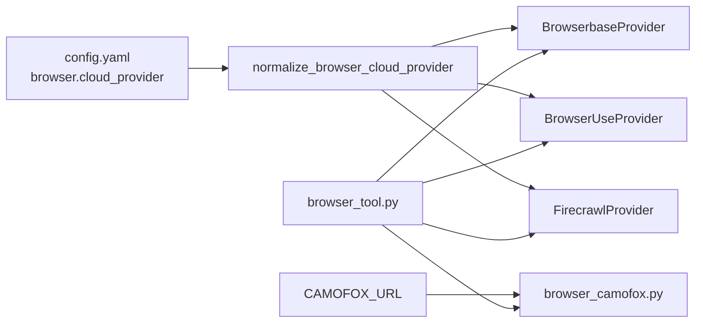

# 网页浏览器工具

<cite>
**本文档引用的文件**
- [browser_tool.py](file://tools/browser_tool.py)
- [browser_providers/base.py](file://tools/browser_providers/base.py)
- [browser_providers/browserbase.py](file://tools/browser_providers/browserbase.py)
- [browser_providers/browser_use.py](file://tools/browser_providers/browser_use.py)
- [browser_providers/firecrawl.py](file://tools/browser_providers/firecrawl.py)
- [browser_camofox.py](file://tools/browser_camofox.py)
- [browser_camofox_state.py](file://tools/browser_camofox_state.py)
- [web_tools.py](file://tools/web_tools.py)
- [url_safety.py](file://tools/url_safety.py)
- [website_policy.py](file://tools/website_policy.py)
- [tool_backend_helpers.py](file://tools/tool_backend_helpers.py)
- [test_browser_camofox.py](file://tests/tools/test_browser_camofox.py)
- [test_browser_console.py](file://tests/tools/test_browser_console.py)
</cite>

## 目录
1. [简介](#简介)
2. [项目结构](#项目结构)
3. [核心组件](#核心组件)
4. [架构总览](#架构总览)
5. [详细组件分析](#详细组件分析)
6. [依赖分析](#依赖分析)
7. [性能考虑](#性能考虑)
8. [故障排除指南](#故障排除指南)
9. [结论](#结论)
10. [附录](#附录)

## 简介
本文件面向Hermes Agent的网页浏览器工具，系统性阐述其架构与能力边界，覆盖以下主题：
- 网页抓取、内容提取、表单填写、自动化交互（点击、输入、滚动、键盘按键、后退）
- 浏览器提供程序（BrowserBase、Browser Use、Firecrawl）与本地Camofox模式的差异与配置
- 安全机制（XSS/CSRF防护、内容过滤、私有地址访问限制、网站策略）
- 性能优化（会话隔离、清理线程、超时控制、缓存策略）
- 高级功能（网页截图、视觉分析、控制台日志、图片提取）
- 故障排除与调试方法

## 项目结构
浏览器工具位于tools目录下，围绕统一的工具接口封装多种后端实现：
- 工具入口与通用逻辑：tools/browser_tool.py
- 提供程序抽象与实现：tools/browser_providers/*
- Camofox本地反检测模式：tools/browser_camofox.py 及状态管理 tools/browser_camofox_state.py
- 网络抓取与内容抽取（非浏览器自动化）：tools/web_tools.py
- 安全与策略：tools/url_safety.py、tools/website_policy.py
- 后端选择辅助：tools/tool_backend_helpers.py
- 单元测试：tests/tools 下的相关用例

图表来源
- [browser_tool.py:1-2175](file://tools/browser_tool.py#L1-L2175)
- [browser_providers/base.py:1-60](file://tools/browser_providers/base.py#L1-L60)
- [browser_providers/browserbase.py:1-218](file://tools/browser_providers/browserbase.py#L1-L218)
- [browser_providers/browser_use.py:1-216](file://tools/browser_providers/browser_use.py#L1-L216)
- [browser_providers/firecrawl.py:1-108](file://tools/browser_providers/firecrawl.py#L1-L108)
- [browser_camofox.py:1-590](file://tools/browser_camofox.py#L1-L590)
- [browser_camofox_state.py:1-48](file://tools/browser_camofox_state.py#L1-L48)
- [web_tools.py:1-2100](file://tools/web_tools.py#L1-L2100)
- [url_safety.py:1-97](file://tools/url_safety.py#L1-L97)
- [website_policy.py:1-283](file://tools/website_policy.py#L1-L283)
- [tool_backend_helpers.py:1-90](file://tools/tool_backend_helpers.py#L1-L90)
- [test_browser_camofox.py:1-296](file://tests/tools/test_browser_camofox.py#L1-L296)
- [test_browser_console.py:1-130](file://tests/tools/test_browser_console.py#L1-L130)

章节来源
- [browser_tool.py:1-2175](file://tools/browser_tool.py#L1-L2175)
- [browser_providers/base.py:1-60](file://tools/browser_providers/base.py#L1-L60)
- [browser_providers/browserbase.py:1-218](file://tools/browser_providers/browserbase.py#L1-L218)
- [browser_providers/browser_use.py:1-216](file://tools/browser_providers/browser_use.py#L1-L216)
- [browser_providers/firecrawl.py:1-108](file://tools/browser_providers/firecrawl.py#L1-L108)
- [browser_camofox.py:1-590](file://tools/browser_camofox.py#L1-L590)
- [browser_camofox_state.py:1-48](file://tools/browser_camofox_state.py#L1-L48)
- [web_tools.py:1-2100](file://tools/web_tools.py#L1-L2100)
- [url_safety.py:1-97](file://tools/url_safety.py#L1-L97)
- [website_policy.py:1-283](file://tools/website_policy.py#L1-L283)
- [tool_backend_helpers.py:1-90](file://tools/tool_backend_helpers.py#L1-L90)
- [test_browser_camofox.py:1-296](file://tests/tools/test_browser_camofox.py#L1-L296)
- [test_browser_console.py:1-130](file://tests/tools/test_browser_console.py#L1-L130)

## 核心组件
- 工具接口与会话管理：统一的工具注册表（BROWSER_TOOL_SCHEMAS），按任务ID隔离会话，后台清理线程自动回收闲置会话；支持本地与云浏览器后端切换。
- 云浏览器提供程序：BrowserBase、Browser Use、Firecrawl，均实现CloudBrowserProvider接口，负责会话创建、关闭与紧急清理。
- Camofox本地模式：通过REST API与自托管的Camoufox/Firefox环境交互，支持持久化身份、VNC可观察性与基础控制台能力。
- 网络抓取与内容抽取：独立于浏览器自动化，提供搜索、提取、爬取能力，支持多后端与LLM摘要。
- 安全与策略：URL安全检查（阻断私有/内部地址）、网站策略（域名黑名单/白名单）、敏感信息脱敏。

章节来源
- [browser_tool.py:500-656](file://tools/browser_tool.py#L500-L656)
- [browser_providers/base.py:7-60](file://tools/browser_providers/base.py#L7-L60)
- [browser_camofox.py:1-590](file://tools/browser_camofox.py#L1-L590)
- [web_tools.py:1-2100](file://tools/web_tools.py#L1-L2100)
- [url_safety.py:50-97](file://tools/url_safety.py#L50-L97)
- [website_policy.py:232-283](file://tools/website_policy.py#L232-L283)

## 架构总览
浏览器工具采用“统一接口 + 多后端适配”的架构，核心流程如下：
- 任务开始：根据配置与环境变量选择后端（本地/云/Camofox），创建或复用会话。
- 用户操作：调用browser_navigate、browser_snapshot、browser_click、browser_type等工具。
- 云后端：通过Chrome DevTools Protocol连接远程浏览器实例。
- 本地后端：通过agent-browser CLI或Camofox REST API执行命令。
- 清理回收：后台线程定期清理长时间未活动的会话，进程退出时进行紧急清理。

图表来源
- [browser_tool.py:690-744](file://tools/browser_tool.py#L690-L744)
- [browser_providers/browserbase.py:53-161](file://tools/browser_providers/browserbase.py#L53-L161)
- [browser_providers/browser_use.py:120-171](file://tools/browser_providers/browser_use.py#L120-L171)
- [browser_camofox.py:147-166](file://tools/browser_camofox.py#L147-L166)

章节来源
- [browser_tool.py:690-744](file://tools/browser_tool.py#L690-L744)
- [browser_providers/browserbase.py:53-161](file://tools/browser_providers/browserbase.py#L53-L161)
- [browser_providers/browser_use.py:120-171](file://tools/browser_providers/browser_use.py#L120-L171)
- [browser_camofox.py:147-166](file://tools/browser_camofox.py#L147-L166)

## 详细组件分析

### 组件A：浏览器工具接口与会话管理
- 工具注册表：定义browser_navigate、browser_snapshot、browser_click、browser_type、browser_scroll、browser_back、browser_press、browser_close、browser_get_images、browser_vision、browser_console等工具的参数与行为。
- 会话隔离：每个task_id对应一个会话，支持本地与云两种模式；云模式下记录bb_session_id与cdp_url。
- 后台清理：启动清理线程，按BROWSER_SESSION_INACTIVITY_TIMEOUT周期扫描并关闭闲置会话；进程退出时触发紧急清理。
- 路径与临时目录：针对macOS socket路径长度限制，使用专用临时目录避免失败。

图表来源
- [browser_tool.py:690-744](file://tools/browser_tool.py#L690-L744)
- [browser_tool.py:346-494](file://tools/browser_tool.py#L346-L494)

章节来源
- [browser_tool.py:500-656](file://tools/browser_tool.py#L500-L656)
- [browser_tool.py:690-744](file://tools/browser_tool.py#L690-L744)
- [browser_tool.py:346-494](file://tools/browser_tool.py#L346-L494)

### 组件B：云浏览器提供程序（BrowserBase/Browser Use/Firecrawl）
- 抽象接口：CloudBrowserProvider定义provider_name、is_configured、create_session、close_session、emergency_cleanup。
- BrowserBase：基于API创建会话，支持代理、高级隐身、keepAlive与自定义超时；对402回退处理。
- Browser Use：支持直接API Key或通过Nous托管网关；短会话超时以节省配额。
- Firecrawl：创建浏览器会话并返回CDP URL，支持TTL配置。

图表来源
- [browser_providers/base.py:7-60](file://tools/browser_providers/base.py#L7-L60)
- [browser_providers/browserbase.py:15-161](file://tools/browser_providers/browserbase.py#L15-L161)
- [browser_providers/browser_use.py:63-171](file://tools/browser_providers/browser_use.py#L63-L171)
- [browser_providers/firecrawl.py:17-73](file://tools/browser_providers/firecrawl.py#L17-L73)

章节来源
- [browser_providers/base.py:7-60](file://tools/browser_providers/base.py#L7-L60)
- [browser_providers/browserbase.py:15-161](file://tools/browser_providers/browserbase.py#L15-L161)
- [browser_providers/browser_use.py:63-171](file://tools/browser_providers/browser_use.py#L63-L171)
- [browser_providers/firecrawl.py:17-73](file://tools/browser_providers/firecrawl.py#L17-L73)

### 组件C：Camofox本地反检测模式
- 模式启用：当设置CAMOFOX_URL时，所有浏览器工具路由到Camofox REST API。
- 会话管理：按task_id维护用户ID与标签页ID；支持持久化身份（受控启用）。
- 基础能力：导航、快照、点击、输入、滚动、后退、键盘按键、图片提取；控制台能力有限。
- 可视化：支持截图并通过视觉LLM分析；可选标注交互元素以便后续操作。

图表来源
- [browser_tool.py:1149-1150](file://tools/browser_tool.py#L1149-L1150)
- [browser_camofox.py:215-273](file://tools/browser_camofox.py#L215-L273)
- [browser_camofox.py:468-555](file://tools/browser_camofox.py#L468-L555)

章节来源
- [browser_camofox.py:1-590](file://tools/browser_camofox.py#L1-L590)
- [browser_camofox_state.py:1-48](file://tools/browser_camofox_state.py#L1-L48)
- [test_browser_camofox.py:1-296](file://tests/tools/test_browser_camofox.py#L1-L296)

### 组件D：网页抓取与内容抽取（非浏览器自动化）
- 后端兼容：Exa、Firecrawl、Parallel、Tavily；支持直接API或Nous托管网关。
- 内容处理：使用辅助LLM对大文本进行智能摘要与关键片段提取，支持分块并行与合成。
- 调试：支持WEB_TOOLS_DEBUG开关，输出详细日志与压缩指标。

章节来源
- [web_tools.py:1-2100](file://tools/web_tools.py#L1-L2100)

### 组件E：安全与策略
- URL安全检查：阻断私有/内部IP、CGNAT、回环、链路本地等；DNS失败时默认阻断；对特定内部主机名强制阻断。
- 网站策略：从配置加载域名规则列表，支持通配符与共享文件；带缓存TTL，避免频繁解析配置。
- Camofox模式下的SSRF豁免：本地后端（含Camofox）不执行私有地址限制，因为终端用户已具备本地网络访问权限。

章节来源
- [url_safety.py:50-97](file://tools/url_safety.py#L50-L97)
- [website_policy.py:232-283](file://tools/website_policy.py#L232-L283)
- [browser_tool.py:296-327](file://tools/browser_tool.py#L296-L327)

## 依赖分析
- 后端选择：通过tool_backend_helpers.normalize_browser_cloud_provider与_config读取配置，决定使用BrowserBase、Browser Use或Firecrawl。
- 会话生命周期：统一由browser_tool.py管理，云提供程序负责实际API调用与资源释放。
- Camofox集成：当CAMOFOX_URL存在时，browser_tool.py将所有调用委托给browser_camofox.py。

图表来源
- [tool_backend_helpers.py:21-25](file://tools/tool_backend_helpers.py#L21-L25)
- [browser_tool.py:244-285](file://tools/browser_tool.py#L244-L285)
- [browser_camofox.py:51-58](file://tools/browser_camofox.py#L51-L58)

章节来源
- [tool_backend_helpers.py:1-90](file://tools/tool_backend_helpers.py#L1-L90)
- [browser_tool.py:244-285](file://tools/browser_tool.py#L244-L285)
- [browser_camofox.py:51-58](file://tools/browser_camofox.py#L51-L58)

## 性能考虑
- 会话隔离与清理：按task_id隔离，后台线程定期清理闲置会话，减少资源泄漏。
- 超时与重试：命令超时与会话超时可配置；云提供程序在402场景自动回退次要特性。
- 内容截断与摘要：页面快照超过阈值时自动截断或通过LLM摘要，降低上下文开销。
- 截图清理：定期清理旧截图，防止磁盘膨胀。
- 并发控制：云提供程序侧的配额与限流需结合业务并发策略使用。

章节来源
- [browser_tool.py:358-494](file://tools/browser_tool.py#L358-L494)
- [browser_providers/browserbase.py:105-134](file://tools/browser_providers/browserbase.py#L105-L134)
- [browser_tool.py:1262-1295](file://tools/browser_tool.py#L1262-L1295)
- [browser_tool.py:1754-1795](file://tools/browser_tool.py#L1754-L1795)

## 故障排除指南
- 无法找到agent-browser：检查PATH或使用npx；确保已安装agent-browser。
- macOS socket路径过长：使用专用临时目录；确认/tmp可用且有足够空间。
- Camofox不可达：确认CAMOFOX_URL正确；检查服务健康状态；必要时查看VNC链接。
- 云会话创建失败：检查API Key与项目ID；留意402回退提示；确认网络可达。
- 私有地址被阻断：在本地模式或明确允许的情况下使用allow_private_urls；检查URL安全策略。
- 控制台日志为空：Camofox模式不支持控制台捕获，建议使用快照或视觉分析替代。

章节来源
- [browser_tool.py:747-800](file://tools/browser_tool.py#L747-L800)
- [browser_camofox.py:61-84](file://tools/browser_camofox.py#L61-L84)
- [browser_providers/browserbase.py:135-139](file://tools/browser_providers/browserbase.py#L135-L139)
- [url_safety.py:50-97](file://tools/url_safety.py#L50-L97)
- [test_browser_console.py:1-130](file://tests/tools/test_browser_console.py#L1-L130)

## 结论
Hermes Agent的网页浏览器工具通过统一接口与多后端适配，实现了从本地到云端的灵活部署；结合安全检查与策略控制，既满足自动化需求又保障运行安全。Camofox模式进一步增强了反检测能力与可观测性。对于大规模任务，建议合理配置会话超时、清理策略与并发度，并优先使用快照与摘要以降低开销。

## 附录
- 使用建议
  - 优先使用browser_navigate + browser_snapshot组合，减少重复请求。
  - 对需要视觉理解的任务，使用browser_vision并结合标注功能。
  - 在高并发场景中，合理设置BROWSER_SESSION_INACTIVITY_TIMEOUT与命令超时。
  - 本地开发可启用Camofox以提升稳定性与可观察性。
- 常见问题
  - 截图失败：检查磁盘空间、socket路径长度与Chromium安装状态。
  - 云会话配额不足：缩短会话超时或切换到更合适的提供程序。
  - 网址被阻断：确认是否为私有地址或命中网站策略规则。