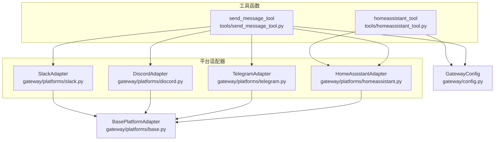
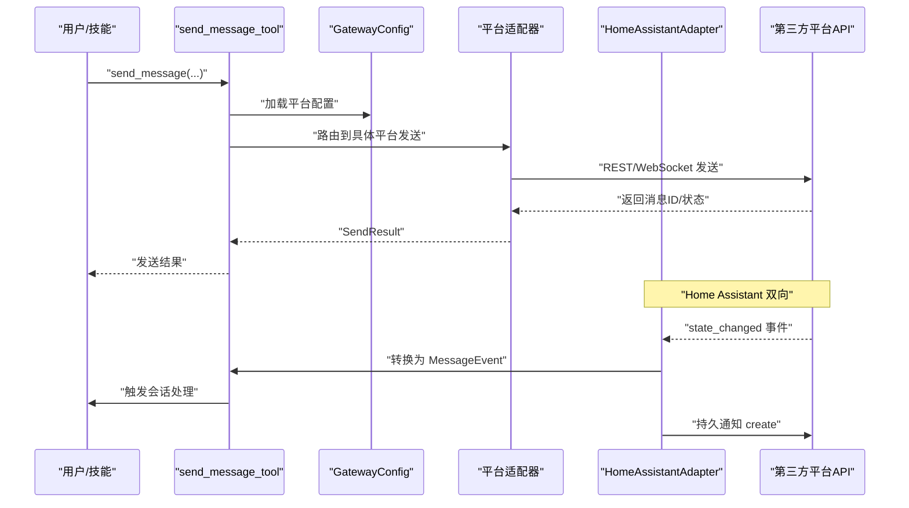
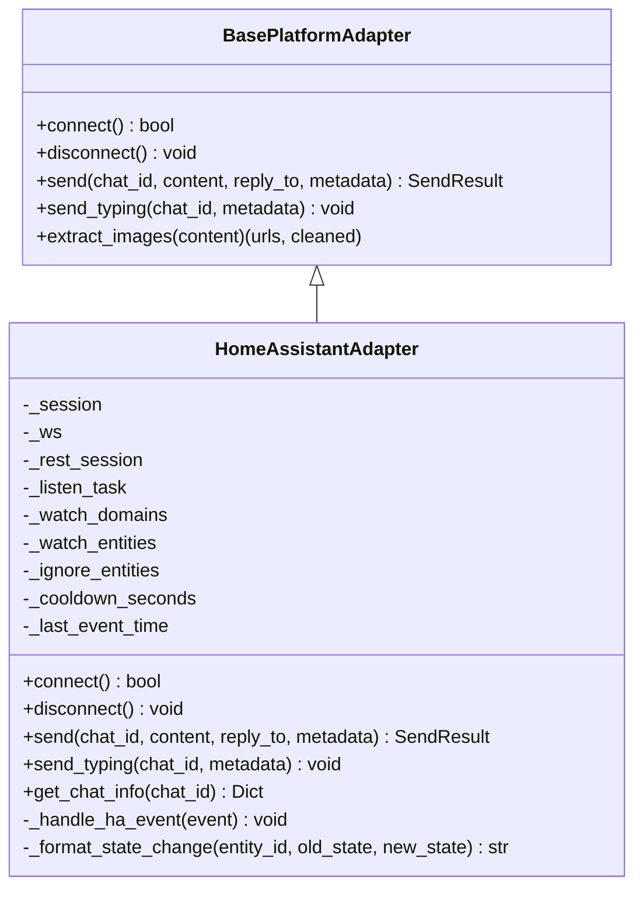
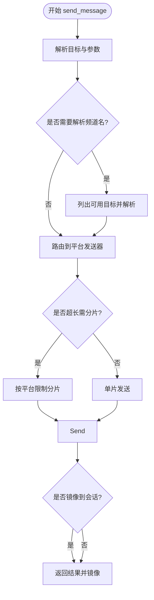
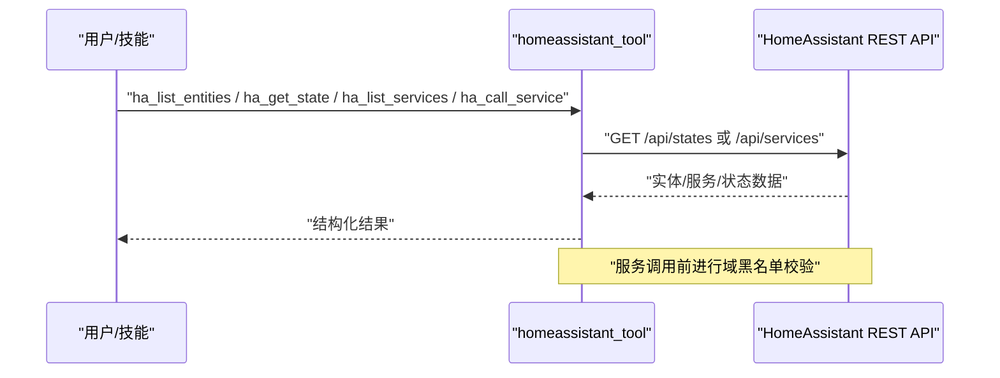
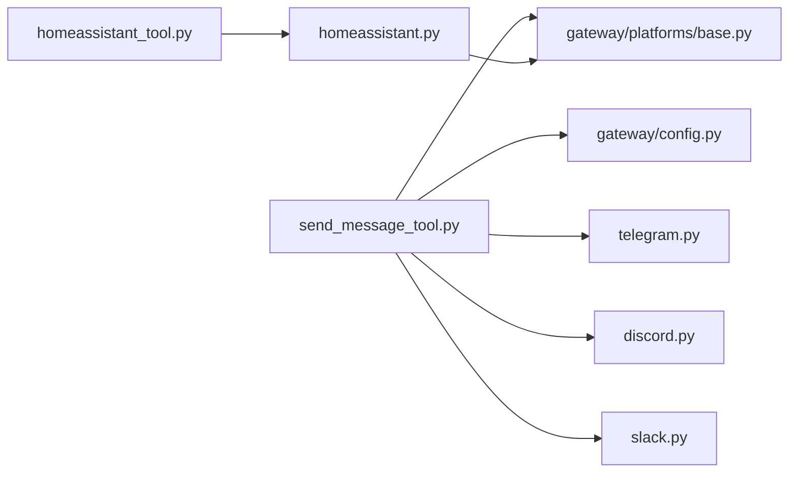

# 通信工具

<cite>
**本文引用的文件**
- [gateway/platforms/homeassistant.py](file://gateway/platforms/homeassistant.py)
- [tools/send_message_tool.py](file://tools/send_message_tool.py)
- [tools/homeassistant_tool.py](file://tools/homeassistant_tool.py)
- [gateway/platforms/base.py](file://gateway/platforms/base.py)
- [gateway/config.py](file://gateway/config.py)
- [hermes_logging.py](file://hermes_logging.py)
- [tools/url_safety.py](file://tools/url_safety.py)
- [gateway/platforms/telegram.py](file://gateway/platforms/telegram.py)
- [gateway/platforms/discord.py](file://gateway/platforms/discord.py)
- [gateway/platforms/slack.py](file://gateway/platforms/slack.py)
</cite>

## 目录
1. [简介](#简介)
2. [项目结构](#项目结构)
3. [核心组件](#核心组件)
4. [架构总览](#架构总览)
5. [详细组件分析](#详细组件分析)
6. [依赖分析](#依赖分析)
7. [性能考虑](#性能考虑)
8. [故障排除指南](#故障排除指南)
9. [结论](#结论)
10. [附录](#附录)

## 简介
本文件系统性地梳理并说明 Hermes Agent 的“通信工具”，覆盖以下关键主题：
- 多渠道消息发送：即时消息（Telegram、Discord、Slack 等）、邮件、短信、电话（Signal、WhatsApp 桥接）、企业微信/飞书、Matrix、钉钉等。
- 智能家居集成：通过 Home Assistant 平台适配器与智能设备控制、状态监控、事件订阅；以及通过专用工具进行实体查询、服务调用与场景/脚本控制。
- 安全机制：认证授权（令牌、环境变量）、消息加密（传输层 TLS/WS）、访问控制（URL 安全检查、服务域白名单）、敏感信息脱敏与日志保护。
- 配置选项：API 密钥管理、连接参数、重试策略、线程模式、媒体缓存、会话复位策略等。
- 第三方服务集成最佳实践：速率限制、错误处理、日志记录、幂等与去重、网络异常恢复。

## 项目结构
通信工具由“平台适配器”和“工具函数”两部分组成：
- 平台适配器：负责与各消息平台（如 Telegram、Discord、Slack）建立连接、接收与发送消息、处理媒体与命令。
- 工具函数：提供跨平台统一的消息发送入口（send_message_tool），以及 Home Assistant 的实体查询与服务调用工具。

图表来源
- [gateway/platforms/homeassistant.py:51-450](file://gateway/platforms/homeassistant.py#L51-L450)
- [tools/send_message_tool.py:80-410](file://tools/send_message_tool.py#L80-L410)
- [tools/homeassistant_tool.py:31-491](file://tools/homeassistant_tool.py#L31-L491)
- [gateway/platforms/base.py:470-800](file://gateway/platforms/base.py#L470-L800)
- [gateway/config.py:48-401](file://gateway/config.py#L48-L401)

章节来源
- [gateway/platforms/homeassistant.py:1-450](file://gateway/platforms/homeassistant.py#L1-L450)
- [tools/send_message_tool.py:1-953](file://tools/send_message_tool.py#L1-L953)
- [tools/homeassistant_tool.py:1-491](file://tools/homeassistant_tool.py#L1-L491)
- [gateway/platforms/base.py:1-1697](file://gateway/platforms/base.py#L1-L1697)
- [gateway/config.py:1-958](file://gateway/config.py#L1-L958)

## 核心组件
- Home Assistant 平台适配器：订阅 HA 状态变更事件并通过持久通知通道发送消息；支持过滤与冷却时间，避免事件风暴。
- 跨平台消息发送工具：统一入口，解析目标平台与频道，按平台限制分片发送，支持媒体附件（当前仅 Telegram 支持原生媒体）。
- Home Assistant 控制工具：实体列表、状态查询、服务清单、服务调用（带安全域黑名单）。
- 基类适配器：定义统一接口、消息模型、发送结果、媒体缓存、重试策略判定、致命错误处理。
- 网关配置：集中管理平台启用状态、令牌/API Key、主页频道、会话复位策略、流式传输等。

章节来源
- [gateway/platforms/homeassistant.py:51-450](file://gateway/platforms/homeassistant.py#L51-L450)
- [tools/send_message_tool.py:80-410](file://tools/send_message_tool.py#L80-L410)
- [tools/homeassistant_tool.py:31-491](file://tools/homeassistant_tool.py#L31-L491)
- [gateway/platforms/base.py:470-800](file://gateway/platforms/base.py#L470-L800)
- [gateway/config.py:48-401](file://gateway/config.py#L48-L401)

## 架构总览
下图展示从用户触发到平台收发消息的整体流程，以及 Home Assistant 的双向交互（事件监听与通知发送）。

图表来源
- [tools/send_message_tool.py:302-410](file://tools/send_message_tool.py#L302-L410)
- [gateway/config.py:415-662](file://gateway/config.py#L415-L662)
- [gateway/platforms/homeassistant.py:217-318](file://gateway/platforms/homeassistant.py#L217-L318)

## 详细组件分析

### 组件一：Home Assistant 平台适配器
- 功能要点
  - 连接与认证：通过长链接 WebSocket 订阅 state_changed 事件，使用 Bearer Token 认证。
  - 事件过滤：支持按域名、实体或 watch_all 开关过滤；支持实体冷却时间，避免事件风暴。
  - 事件格式化：将状态变更转换为可读文本，针对不同域（HVAC、传感器、二进制传感器、照明/开关/风扇、报警面板）做领域特定描述。
  - 出站消息：通过 REST API 发送持久通知，避免与事件监听的同一连接产生竞态。
  - 自动重连：指数退避重连策略，断线后自动恢复。
- 关键数据结构
  - 事件源构建：用于标识事件来源（聊天ID、名称、类型、用户ID/名称）。
  - SendResult：封装发送成功/失败、消息ID、错误信息与是否可重试。
- 错误处理
  - 认证失败、订阅失败、JSON 解析错误、连接中断均记录警告并尝试重连。
  - 发送失败返回错误码与响应体摘要，便于定位问题。

图表来源
- [gateway/platforms/base.py:470-800](file://gateway/platforms/base.py#L470-L800)
- [gateway/platforms/homeassistant.py:51-450](file://gateway/platforms/homeassistant.py#L51-L450)

章节来源
- [gateway/platforms/homeassistant.py:51-450](file://gateway/platforms/homeassistant.py#L51-L450)
- [gateway/platforms/base.py:367-800](file://gateway/platforms/base.py#L367-L800)

### 组件二：跨平台消息发送工具（send_message_tool）
- 功能要点
  - 目标解析：支持平台名、频道名/ID、Telegram 话题（chat_id:thread_id）等格式；不明确时先列出可用目标再解析。
  - 平台路由：根据目标平台路由到对应发送器（Telegram、Discord、Slack、WhatsApp、Signal、Email、SMS、Mattermost、Matrix、HomeAssistant、DingTalk、Feishu、WeCom）。
  - 分片发送：依据平台最大长度限制对长消息进行智能分片，保留代码块边界与分段提示。
  - 媒体处理：当前仅 Telegram 支持原生媒体发送；其他平台若仅含媒体则忽略媒体，给出兼容性提示。
  - 重复发送规避：当 Cron 自动投递目标与手动发送目标一致时，跳过冗余发送并提示。
  - 结果镜像：在目标会话中镜像发送内容，便于本地查看。
- 错误处理
  - 参数缺失、平台未配置、解析失败、发送异常均以标准化错误结构返回，并对敏感信息进行脱敏。

图表来源
- [tools/send_message_tool.py:99-410](file://tools/send_message_tool.py#L99-L410)

章节来源
- [tools/send_message_tool.py:80-953](file://tools/send_message_tool.py#L80-L953)

### 组件三：Home Assistant 控制工具（homeassistant_tool）
- 功能要点
  - 实体查询：按域或区域过滤实体，返回实体简要列表。
  - 状态查询：获取单个实体的详细状态与属性。
  - 服务清单：列出指定域的服务及其字段说明，辅助发现可用动作。
  - 服务调用：调用 HA 服务（如 turn_on、turn_off、set_temperature 等），支持实体ID与附加数据。
  - 安全控制：内置服务域黑名单（如 shell_command、command_line、python_script、hassio、rest_command），防止任意命令执行与 SSRF。
- 认证与配置
  - 使用 HASS_TOKEN 环境变量作为 Bearer Token。
  - HASS_URL 默认值为 http://homeassistant.local:8123。

图表来源
- [tools/homeassistant_tool.py:96-191](file://tools/homeassistant_tool.py#L96-L191)

章节来源
- [tools/homeassistant_tool.py:31-491](file://tools/homeassistant_tool.py#L31-L491)

### 组件四：平台适配器基类与通用能力
- 接口与模型
  - MessageEvent：统一的消息载体，包含文本、类型、来源、原始消息、媒体路径、回复上下文、时间戳等。
  - SendResult：统一的发送结果，包含成功标志、消息ID、错误信息与是否可重试。
- 媒体缓存
  - 图片、音频、文档缓存目录与清理策略，支持从 URL 下载并缓存，带 SSRF 安全检查与重试。
- 重试策略判定
  - 对连接类错误（如连接被拒、网络错误、EOF）标记可重试；对非幂等的超时（读写超时）不自动重试。
- 会话与打字指示
  - 支持按会话跟踪活动任务，提供打字指示与停止打字指示的抽象方法。

章节来源
- [gateway/platforms/base.py:367-800](file://gateway/platforms/base.py#L367-L800)

### 组件五：平台适配器（Telegram/Discord/Slack）
- Telegram
  - 支持论坛话题（Thread）、媒体批处理、MarkdownV2 转义与回退纯文本、图片/语音/视频原生发送。
  - 提供网络错误自动重连与冲突检测。
- Discord
  - 支持语音接收（DAVE 加密解密、Opus 解码、静音检测）、线程归档分钟数校验、URL 安全检查。
- Slack
  - 使用 Socket Mode，支持多工作区、去重缓存、提及线程自动响应、审批按钮状态管理。

章节来源
- [gateway/platforms/telegram.py:111-200](file://gateway/platforms/telegram.py#L111-L200)
- [gateway/platforms/discord.py:1-200](file://gateway/platforms/discord.py#L1-L200)
- [gateway/platforms/slack.py:53-200](file://gateway/platforms/slack.py#L53-L200)

## 依赖分析
- 组件耦合
  - send_message_tool 依赖网关配置与平台适配器基类，按平台路由调用具体发送器。
  - homeassistant_tool 依赖 aiohttp 与环境变量，直接调用 HA REST API。
  - 平台适配器（Telegram/Discord/Slack）依赖各自生态库（如 python-telegram-bot、discord.py、slack-bolt）。
- 外部依赖
  - aiohttp、httpx：用于 HTTP/WS 请求。
  - python-telegram-bot、discord.py、slack-bolt：平台客户端库。
  - ssl：用于 SMTP/HTTPS/TLS。
- 循环依赖
  - 未见循环导入；工具与适配器通过配置与工厂方式解耦。

图表来源
- [tools/send_message_tool.py:145-410](file://tools/send_message_tool.py#L145-L410)
- [tools/homeassistant_tool.py:101-191](file://tools/homeassistant_tool.py#L101-L191)
- [gateway/platforms/homeassistant.py:51-450](file://gateway/platforms/homeassistant.py#L51-L450)
- [gateway/platforms/base.py:470-800](file://gateway/platforms/base.py#L470-L800)
- [gateway/config.py:415-662](file://gateway/config.py#L415-L662)

章节来源
- [tools/send_message_tool.py:145-410](file://tools/send_message_tool.py#L145-L410)
- [tools/homeassistant_tool.py:101-191](file://tools/homeassistant_tool.py#L101-L191)
- [gateway/platforms/homeassistant.py:51-450](file://gateway/platforms/homeassistant.py#L51-L450)
- [gateway/platforms/base.py:470-800](file://gateway/platforms/base.py#L470-L800)
- [gateway/config.py:415-662](file://gateway/config.py#L415-L662)

## 性能考虑
- 事件风暴防护：Home Assistant 适配器支持实体级冷却时间，降低高频状态变更带来的处理压力。
- 消息分片：跨平台发送工具按平台最大长度限制进行智能分片，减少单次请求体积与失败概率。
- 媒体缓存与重试：图片/音频/文档缓存支持重试与过期清理，避免频繁下载与磁盘膨胀。
- 连接与重连：平台适配器采用指数退避重连策略，降低瞬时网络波动影响。
- 会话隔离与去重：Slack 的去重缓存与 seen 时间窗，避免 Socket Mode 重连导致的重复事件处理。

## 故障排除指南
- 认证失败
  - 检查平台令牌/API Key 是否正确设置；Telegram/Discord/Slack 需要双令牌时务必齐全。
  - Home Assistant 需确保 HASS_TOKEN 设置且有效。
- 连接失败/断线
  - 查看平台日志中的网络错误与重连记录；必要时调整网络环境或代理。
  - Telegram 的 polling 冲突与 Discord 的网络错误有专门的自动重连逻辑。
- 发送失败
  - 检查目标平台是否启用、主页频道是否配置；跨平台发送工具会在缺少必要参数时返回错误。
  - 对于超长消息，确认已按平台限制进行分片；对于仅含媒体的发送，当前仅 Telegram 支持原生媒体。
- SSRF 与安全
  - 若出现 URL 安全拦截，请检查目标地址是否为私有/内部网络；工具会对主机名与 IP 进行严格检查。
- 日志与脱敏
  - 使用集中日志系统，敏感信息会被脱敏；可通过增加日志级别定位问题。

章节来源
- [hermes_logging.py:50-142](file://hermes_logging.py#L50-L142)
- [tools/url_safety.py:50-97](file://tools/url_safety.py#L50-L97)
- [gateway/platforms/telegram.py:167-200](file://gateway/platforms/telegram.py#L167-L200)
- [gateway/platforms/discord.py:1-200](file://gateway/platforms/discord.py#L1-L200)
- [tools/send_message_tool.py:165-168](file://tools/send_message_tool.py#L165-L168)

## 结论
Hermes Agent 的通信工具通过统一的平台适配器与工具层，实现了对多渠道消息平台与 Home Assistant 的一体化接入。其设计强调：
- 易扩展：新增平台只需继承基类并实现必要方法；
- 安全优先：令牌管理、URL 安全检查、服务域黑名单、日志脱敏；
- 可靠性：自动重连、去重与幂等、媒体缓存与清理；
- 可观测性：集中日志、错误分类与可重试标记。

建议在生产环境中：
- 为每个平台配置独立的令牌与主页频道；
- 合理设置事件过滤与冷却时间，避免 HA 事件风暴；
- 对长消息进行分片发送，关注平台媒体支持差异；
- 启用并维护日志脱敏与轮转策略，定期清理媒体缓存。

## 附录

### 配置选项速查
- 平台启用与令牌
  - TELEGRAM_BOT_TOKEN、DISCORD_BOT_TOKEN、SLACK_BOT_TOKEN、SLACK_APP_TOKEN、MATTERMOST_TOKEN、MATRIX_ACCESS_TOKEN、SIGNAL_HTTP_URL、SIGNAL_ACCOUNT、TWILIO_ACCOUNT_SID、TWILIO_AUTH_TOKEN、TWILIO_PHONE_NUMBER、EMAIL_ADDRESS、EMAIL_PASSWORD、EMAIL_SMTP_HOST、EMAIL_SMTP_PORT、HASS_TOKEN、HASS_URL、WHATSAPP_ENABLED、FEISHU_APP_ID、WECOM_BOT_ID、DINGTALK_CORP_ID 等。
- 主页频道
  - TELEGRAM_HOME_CHANNEL、DISCORD_HOME_CHANNEL、SLACK_HOME_CHANNEL、SIGNAL_HOME_CHANNEL、MATTERMOST_HOME_CHANNEL、MATRIX_HOME_ROOM 等。
- 会话与行为
  - unauthorized_dm_behavior、group_sessions_per_user、thread_sessions_per_user、reset_triggers、quick_commands、streaming 等。
- 网络与媒体
  - TELEGRAM_FALLBACK_IPS、HERMES_TELEGRAM_MEDIA_BATCH_DELAY_SECONDS、HERMES_TELEGRAM_TEXT_BATCH_DELAY_SECONDS、MATTERMOST_URL、MATRIX_HOMESERVER、MATRIX_USER_ID、MATRIX_PASSWORD、MATRIX_ENCRYPTION、MATRIX_DEVICE_ID、EMAIL_SMTP_PORT 等。

章节来源
- [gateway/config.py:665-800](file://gateway/config.py#L665-L800)
- [tools/send_message_tool.py:580-724](file://tools/send_message_tool.py#L580-L724)
- [tools/homeassistant_tool.py:31-61](file://tools/homeassistant_tool.py#L31-L61)