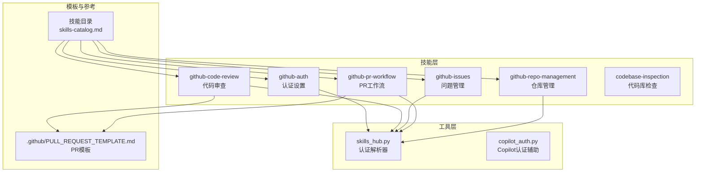
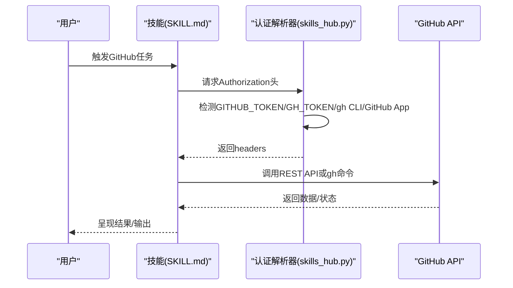
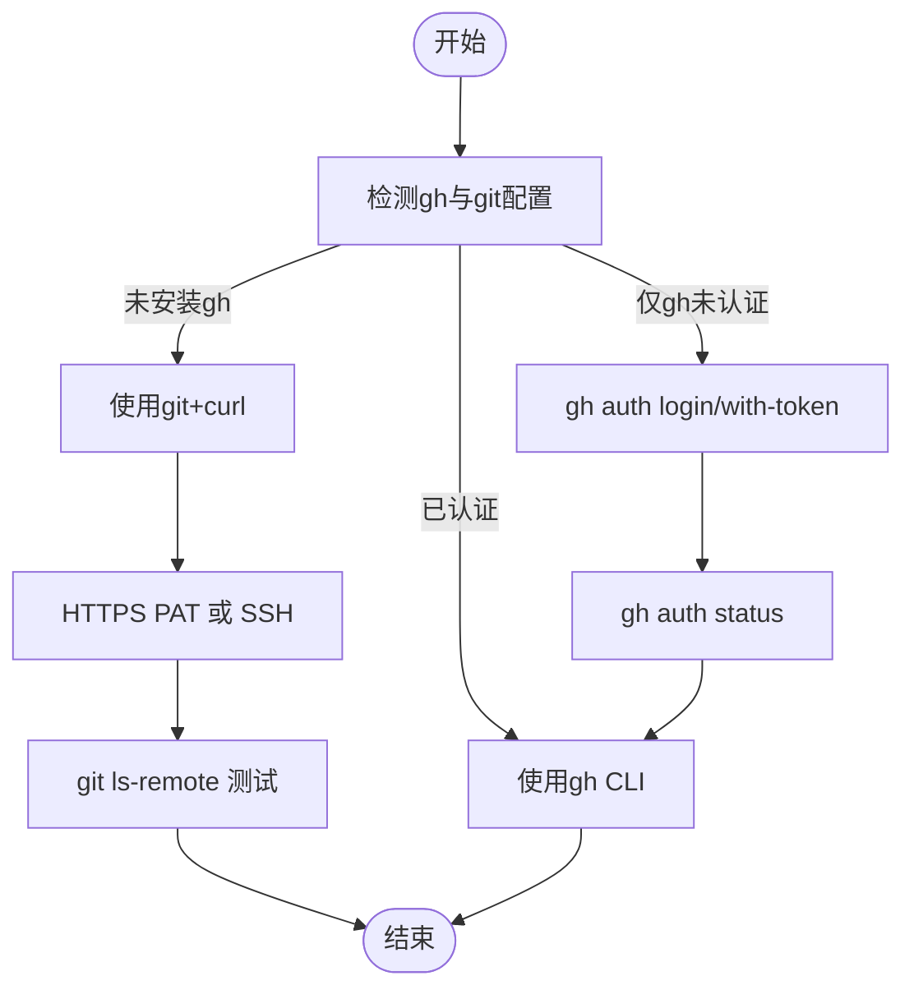
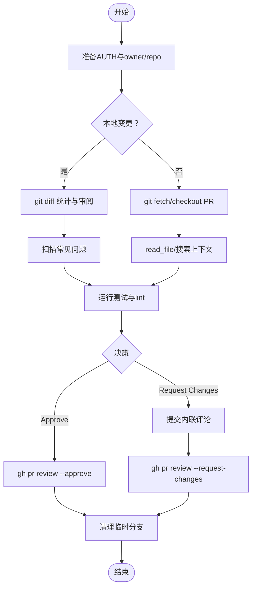
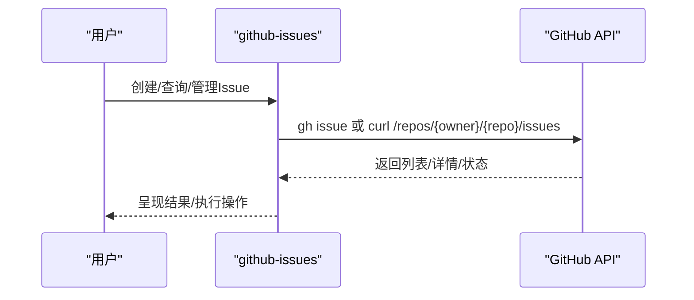
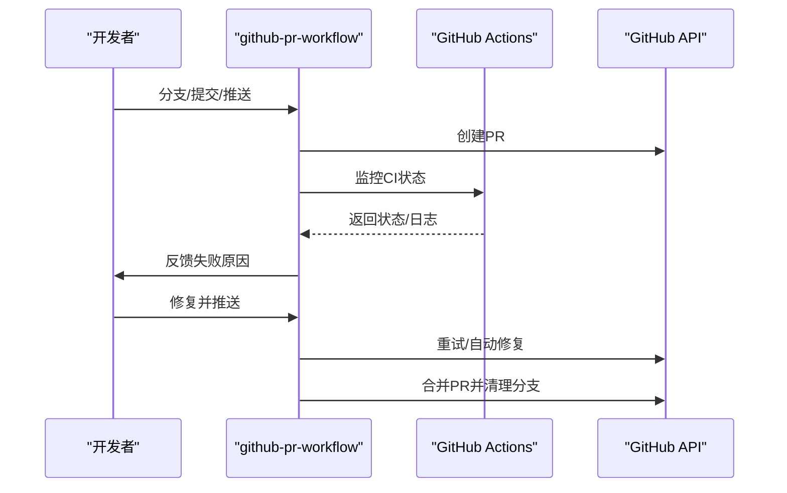
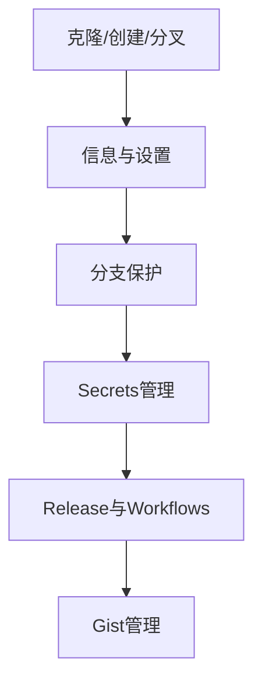
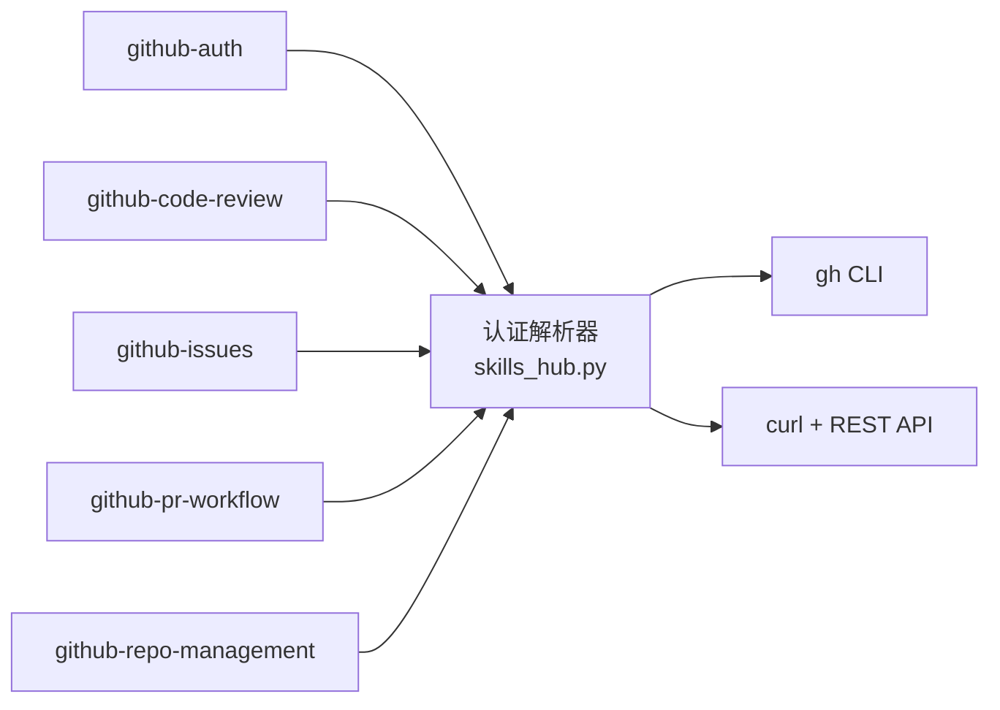

# GitHub相关技能

<cite>
**本文引用的文件**
- [.github/PULL_REQUEST_TEMPLATE.md](file://.github/PULL_REQUEST_TEMPLATE.md)
- [skills/github/DESCRIPTION.md](file://skills/github/DESCRIPTION.md)
- [skills/github/github-auth/SKILL.md](file://skills/github/github-auth/SKILL.md)
- [skills/github/github-code-review/SKILL.md](file://skills/github/github-code-review/SKILL.md)
- [skills/github/github-issues/SKILL.md](file://skills/github/github-issues/SKILL.md)
- [skills/github/github-pr-workflow/SKILL.md](file://skills/github/github-pr-workflow/SKILL.md)
- [skills/github/github-repo-management/SKILL.md](file://skills/github/github-repo-management/SKILL.md)
- [tools/skills_hub.py](file://tools/skills_hub.py)
- [hermes_cli/copilot_auth.py](file://hermes_cli/copilot_auth.py)
- [website/docs/reference/skills-catalog.md](file://website/docs/reference/skills-catalog.md)
- [CONTRIBUTING.md](file://CONTRIBUTING.md)
- [README.md](file://README.md)
</cite>

## 目录
1. [简介](#简介)
2. [项目结构](#项目结构)
3. [核心组件](#核心组件)
4. [架构总览](#架构总览)
5. [详细组件分析](#详细组件分析)
6. [依赖关系分析](#依赖关系分析)
7. [性能考量](#性能考量)
8. [故障排除指南](#故障排除指南)
9. [结论](#结论)
10. [附录](#附录)

## 简介
本文件系统性梳理与GitHub相关的技能体系，覆盖以下能力：代码库检查、GitHub认证、代码审查、问题管理、PR工作流与仓库管理。文档从“触发条件—执行步骤—使用场景”三个维度展开，配套GitHub API配置与认证方法（含个人访问令牌）、代码审查流程与最佳实践（审查模板与输出格式）、问题跟踪与PR管理的工作流（模板使用与CI集成），并提供可操作示例与故障排除建议。

## 项目结构
GitHub相关技能位于skills/github目录下，按功能拆分为多个独立技能，每个技能均提供两套实现路径：优先使用gh CLI，回退到git + curl + GitHub REST API。工具层提供统一的认证解析器，自动选择GITHUB_TOKEN/GH_TOKEN、gh CLI凭据或GitHub App凭据。

图示来源
- [skills/github/github-auth/SKILL.md:1-247](file://skills/github/github-auth/SKILL.md#L1-L247)
- [skills/github/github-code-review/SKILL.md:1-481](file://skills/github/github-code-review/SKILL.md#L1-L481)
- [skills/github/github-issues/SKILL.md:1-370](file://skills/github/github-issues/SKILL.md#L1-L370)
- [skills/github/github-pr-workflow/SKILL.md:1-367](file://skills/github/github-pr-workflow/SKILL.md#L1-L367)
- [skills/github/github-repo-management/SKILL.md:1-516](file://skills/github/github-repo-management/SKILL.md#L1-L516)
- [tools/skills_hub.py:140-247](file://tools/skills_hub.py#L140-L247)
- [hermes_cli/copilot_auth.py:1-79](file://hermes_cli/copilot_auth.py#L1-L79)
- [.github/PULL_REQUEST_TEMPLATE.md:1-76](file://.github/PULL_REQUEST_TEMPLATE.md#L1-L76)
- [website/docs/reference/skills-catalog.md:84-95](file://website/docs/reference/skills-catalog.md#L84-L95)

章节来源
- [skills/github/DESCRIPTION.md:1-4](file://skills/github/DESCRIPTION.md#L1-L4)
- [website/docs/reference/skills-catalog.md:84-95](file://website/docs/reference/skills-catalog.md#L84-L95)

## 核心组件
- 认证解析器（skills_hub.py）：自动检测并缓存GITHUB_TOKEN/GH_TOKEN、gh CLI凭据、GitHub App凭据，生成标准GitHub API请求头。
- Copilot认证辅助（hermes_cli/copilot_auth.py）：兼容GitHub Copilot的OAuth与Token类型，校验不支持的classic PAT，定义环境变量优先级。
- 技能目录（website/docs/reference/skills-catalog.md）：列出GitHub相关技能及其简述，便于发现与导航。
- PR模板（.github/PULL_REQUEST_TEMPLATE.md）：标准化PR描述、变更清单、测试步骤、检查清单与新技能评估项。

章节来源
- [tools/skills_hub.py:140-247](file://tools/skills_hub.py#L140-L247)
- [hermes_cli/copilot_auth.py:1-79](file://hermes_cli/copilot_auth.py#L1-L79)
- [website/docs/reference/skills-catalog.md:84-95](file://website/docs/reference/skills-catalog.md#L84-L95)
- [.github/PULL_REQUEST_TEMPLATE.md:1-76](file://.github/PULL_REQUEST_TEMPLATE.md#L1-L76)

## 架构总览
整体采用“技能优先、工具支撑、模板规范”的分层设计。技能通过统一的认证解析器访问GitHub API；当gh CLI可用时优先使用其命令简化交互；在无gh环境时回退至git与curl组合，直接调用REST API。

图示来源
- [tools/skills_hub.py:140-247](file://tools/skills_hub.py#L140-L247)
- [skills/github/github-auth/SKILL.md:1-247](file://skills/github/github-auth/SKILL.md#L1-L247)
- [skills/github/github-code-review/SKILL.md:1-481](file://skills/github/github-code-review/SKILL.md#L1-L481)
- [skills/github/github-issues/SKILL.md:1-370](file://skills/github/github-issues/SKILL.md#L1-L370)
- [skills/github/github-pr-workflow/SKILL.md:1-367](file://skills/github/github-pr-workflow/SKILL.md#L1-L367)
- [skills/github/github-repo-management/SKILL.md:1-516](file://skills/github/github-repo-management/SKILL.md#L1-L516)

## 详细组件分析

### GitHub认证（github-auth）
- 触发条件
  - 需要对仓库进行推送、创建PR、管理Issue或调用GitHub API。
  - 用户首次使用或环境缺少gh CLI。
- 执行步骤
  - 自动检测：先判断gh auth状态，再检测git credential helper，最后回退到curl方式。
  - HTTPS PAT：在git中配置credential helper，保存用户名与PAT；或在远程URL中嵌入token。
  - SSH密钥：生成ed25519密钥，添加公钥至GitHub账户，配置URL重写以使用SSH。
  - gh CLI登录：交互式浏览器登录或基于token的无头登录，并通过gh setup-git同步git凭证。
  - 验证：分别运行gh auth status与git ls-remote测试权限。
- 使用场景
  - 在CI服务器或无图形界面的环境中，快速完成一次性认证。
  - 多账户或多仓库场景下的凭证隔离与复用。
- 关键要点
  - PAT需具备repo、workflow、read:org等必要作用域。
  - SSH over HTTPS端口配置可解决防火墙限制。
  - 多账户建议使用SSH别名或按仓库URL内嵌token。

图示来源
- [skills/github/github-auth/SKILL.md:20-108](file://skills/github/github-auth/SKILL.md#L20-L108)
- [skills/github/github-auth/SKILL.md:158-184](file://skills/github/github-auth/SKILL.md#L158-L184)
- [skills/github/github-auth/SKILL.md:188-211](file://skills/github/github-auth/SKILL.md#L188-L211)

章节来源
- [skills/github/github-auth/SKILL.md:1-247](file://skills/github/github-auth/SKILL.md#L1-L247)

### 代码审查（github-code-review）
- 触发条件
  - 用户要求预推送审查或对现有PR进行审查。
- 执行步骤
  - 环境准备：自动判定AUTH=gh或AUTH=git，并提取owner/repo。
  - 本地审查：使用git diff统计变化范围，逐文件审阅，扫描常见问题（调试语句、大文件、敏感信息、合并冲突标记）。
  - PR审查：拉取PR到本地分支，结合read_file与搜索工具深入理解上下文；运行自动化测试与lint。
  - 提交审查：使用gh或curl提交正式审查（Approve/Request Changes/Comment），附带结构化摘要与内联评论。
  - 清理：切换回main并删除临时分支。
- 使用场景
  - 合规性与质量门禁：在推送前拦截高风险变更。
  - 团队协作：通过内联评论与总结提升沟通效率。
- 审查模板与输出格式
  - 结构化输出：Critical/Warnings/Suggestions/Looks Good四段式，明确文件与行号、问题与修复建议。
  - 决策策略：无Critical/Warnings即Approve；否则Request Changes并附内联评论。

图示来源
- [skills/github/github-code-review/SKILL.md:22-42](file://skills/github/github-code-review/SKILL.md#L22-L42)
- [skills/github/github-code-review/SKILL.md:317-327](file://skills/github/github-code-review/SKILL.md#L317-L327)
- [skills/github/github-code-review/SKILL.md:330-474](file://skills/github/github-code-review/SKILL.md#L330-L474)

章节来源
- [skills/github/github-code-review/SKILL.md:1-481](file://skills/github/github-code-review/SKILL.md#L1-L481)

### 问题管理（github-issues）
- 触发条件
  - 需要创建、查询、标注、指派、评论或关闭Issue。
- 执行步骤
  - 视图：列出/搜索/查看Issue，支持按状态、标签、负责人过滤。
  - 创建：使用gh或curl创建Issue，附带标题、正文、标签与负责人。
  - 管理：增删标签、指派、评论、关闭/重新打开。
  - 链接：将Issue与PR关联（Closes/Fixes/Resolves关键字）。
  - 三角测量：识别待处理Issue，分类标注优先级，必要时评论说明。
  - 批量：结合gh或curl脚本批量关闭/更新。
- 使用场景
  - 产品需求与缺陷跟踪：规范化问题生命周期管理。
  - 开发协同：通过标签与指派明确责任与优先级。
- 模板使用
  - Bug报告与功能请求模板，确保信息完整、可复现。

图示来源
- [skills/github/github-issues/SKILL.md:22-42](file://skills/github/github-issues/SKILL.md#L22-L42)
- [skills/github/github-issues/SKILL.md:106-140](file://skills/github/github-issues/SKILL.md#L106-L140)
- [skills/github/github-issues/SKILL.md:179-273](file://skills/github/github-issues/SKILL.md#L179-L273)

章节来源
- [skills/github/github-issues/SKILL.md:1-370](file://skills/github/github-issues/SKILL.md#L1-L370)

### PR工作流（github-pr-workflow）
- 触发条件
  - 需要从分支到合并的完整PR生命周期管理。
- 执行步骤
  - 分支：基于main创建特性/修复/重构分支，遵循命名约定。
  - 提交：使用文件工具修改后，提交符合Conventional Commits的消息。
  - 推送与创建：推送到远端并创建PR，支持草稿、评审者与标签。
  - 监控：使用gh checks或curl查询combined status与check-runs。
  - 自动修复：定位失败日志，使用read_file与patch修复，再次推送验证。
  - 合并：squash合并并删除分支，或启用Auto-Merge。
- 使用场景
  - 连续集成与交付：在合并前保证质量与合规。
  - 团队协作：通过评审与CI反馈提升代码一致性。
- CI集成
  - 通过gh run或curl触发/监控/重试工作流，结合PR模板中的测试计划与关闭关键字。

图示来源
- [skills/github/github-pr-workflow/SKILL.md:22-40](file://skills/github/github-pr-workflow/SKILL.md#L22-L40)
- [skills/github/github-pr-workflow/SKILL.md:151-210](file://skills/github/github-pr-workflow/SKILL.md#L151-L210)
- [skills/github/github-pr-workflow/SKILL.md:211-275](file://skills/github/github-pr-workflow/SKILL.md#L211-L275)
- [skills/github/github-pr-workflow/SKILL.md:276-312](file://skills/github/github-pr-workflow/SKILL.md#L276-L312)

章节来源
- [skills/github/github-pr-workflow/SKILL.md:1-367](file://skills/github/github-pr-workflow/SKILL.md#L1-L367)

### 仓库管理（github-repo-management）
- 触发条件
  - 需要克隆、创建、分叉、配置仓库，或管理分支保护、Secrets、Release与Workflows。
- 执行步骤
  - 克隆：支持HTTPS/SSH与浅克隆；gh repo clone提供便捷入口。
  - 创建：gh repo create或curl创建用户/组织仓库；支持从模板生成。
  - 分叉：gh repo fork或curl创建分叉并添加upstream。
  - 信息与设置：gh repo view/list/search或curl查询/编辑仓库信息、主题、默认分支等。
  - 分支保护：通过curl设置required_status_checks、PR审查要求与管理员强制策略。
  - Secrets：推荐使用gh secret set；若无gh则通过curl加密后PUT。
  - Release：gh release或curl创建/下载Release与资产。
  - Workflows：gh workflow/run或curl列出/触发/重试工作流。
- 使用场景
  - 新项目初始化与团队协作：统一仓库结构与安全策略。
  - 生产运维：密钥管理、发布与CI治理。

图示来源
- [skills/github/github-repo-management/SKILL.md:56-83](file://skills/github/github-repo-management/SKILL.md#L56-L83)
- [skills/github/github-repo-management/SKILL.md:84-139](file://skills/github/github-repo-management/SKILL.md#L84-L139)
- [skills/github/github-repo-management/SKILL.md:157-197](file://skills/github/github-repo-management/SKILL.md#L157-L197)
- [skills/github/github-repo-management/SKILL.md:198-241](file://skills/github/github-repo-management/SKILL.md#L198-L241)
- [skills/github/github-repo-management/SKILL.md:276-299](file://skills/github/github-repo-management/SKILL.md#L276-L299)
- [skills/github/github-repo-management/SKILL.md:301-357](file://skills/github/github-repo-management/SKILL.md#L301-L357)
- [skills/github/github-repo-management/SKILL.md:359-404](file://skills/github/github-repo-management/SKILL.md#L359-L404)
- [skills/github/github-repo-management/SKILL.md:406-466](file://skills/github/github-repo-management/SKILL.md#L406-L466)
- [skills/github/github-repo-management/SKILL.md:468-501](file://skills/github/github-repo-management/SKILL.md#L468-L501)

章节来源
- [skills/github/github-repo-management/SKILL.md:1-516](file://skills/github/github-repo-management/SKILL.md#L1-L516)

### 代码库检查（codebase-inspection）
- 触发条件
  - 需要统计代码行数、语言分布、注释比例等指标，用于规模评估与技术债识别。
- 执行步骤
  - 使用pygount等工具统计LOC、语言组成与代码/注释比。
  - 输出报告供进一步分析与优化。
- 使用场景
  - 项目健康度评估、技术栈盘点与迁移规划。

章节来源
- [skills/github/DESCRIPTION.md:1-4](file://skills/github/DESCRIPTION.md#L1-L4)

## 依赖关系分析
- 技能与工具
  - 所有GitHub技能均依赖认证解析器（skills_hub.py）以统一获取Authorization头。
  - 当gh CLI可用时，优先使用其命令简化交互；否则回退到git与curl组合。
- 外部依赖
  - gh CLI：增强体验与能力边界（如Secrets管理）。
  - curl + GitHub REST API：通用回退方案，覆盖所有核心功能。
- 内部耦合
  - 技能间存在弱耦合：github-code-review与github-pr-workflow共享PR审查与合并流程；github-issues与github-pr-workflow在Issue与PR关联上协同。

图示来源
- [tools/skills_hub.py:140-247](file://tools/skills_hub.py#L140-L247)
- [skills/github/github-auth/SKILL.md:1-247](file://skills/github/github-auth/SKILL.md#L1-L247)
- [skills/github/github-code-review/SKILL.md:1-481](file://skills/github/github-code-review/SKILL.md#L1-L481)
- [skills/github/github-issues/SKILL.md:1-370](file://skills/github/github-issues/SKILL.md#L1-L370)
- [skills/github/github-pr-workflow/SKILL.md:1-367](file://skills/github/github-pr-workflow/SKILL.md#L1-L367)
- [skills/github/github-repo-management/SKILL.md:1-516](file://skills/github/github-repo-management/SKILL.md#L1-L516)

章节来源
- [tools/skills_hub.py:140-247](file://tools/skills_hub.py#L140-L247)

## 性能考量
- 凭据缓存与复用：认证解析器支持缓存与过期控制，减少重复鉴权开销。
- 回退策略：在无gh环境时使用git+curl，避免额外安装成本。
- CI监控轮询：PR工作流提供简单轮询逻辑，建议结合实际CI耗时调整轮询间隔与最大尝试次数。
- 批量操作：问题与仓库管理提供批量脚本示例，降低重复劳动。

## 故障排除指南
- git push仍提示密码
  - 解决：使用PAT替代密码；或改用SSH密钥。
- 权限不足（Permission denied）
  - 检查：PAT是否具备repo作用域；组织仓库是否需要read:org。
- SSH连接被拒绝
  - 方案：通过SSH over HTTPS端口（Port 443）与Hostname ssh.github.com配置。
- 凭据未持久化
  - 检查：git config --global credential.helper是否为store或cache。
- 多账户冲突
  - 方案：SSH使用不同密钥与主机别名；或在仓库级别使用内嵌token的URL。
- gh命令不可用
  - 方案：使用git-only方法（HTTPS PAT或SSH）；或安装gh CLI。

章节来源
- [skills/github/github-auth/SKILL.md:236-247](file://skills/github/github-auth/SKILL.md#L236-L247)

## 结论
该GitHub技能体系以“统一认证—多路径实现—模板规范”为核心设计，既满足日常开发与运维需求，又兼顾离线与受限环境的可用性。通过标准化的审查模板、问题与PR模板以及CI集成建议，能够有效提升协作效率与代码质量。

## 附录
- GitHub API配置与认证方法
  - 环境变量：GITHUB_TOKEN/GH_TOKEN优先级与使用方式。
  - gh CLI：交互式登录与无头登录，配合gh auth setup-git。
  - curl：直接调用REST API，适用于无gh环境。
- PR模板使用
  - 描述清晰、问题定位准确、变更清单完整、测试步骤可执行、检查清单齐全。
- 代码审查最佳实践
  - 结构化输出、内联评论与总结并重、决策依据明确（Critical/Warnings/Suggestions）。
- 仓库管理要点
  - 分支保护策略、Secrets加密存储、Release与Workflows治理。

章节来源
- [CONTRIBUTING.md:584-637](file://CONTRIBUTING.md#L584-L637)
- [.github/PULL_REQUEST_TEMPLATE.md:1-76](file://.github/PULL_REQUEST_TEMPLATE.md#L1-L76)
- [hermes_cli/copilot_auth.py:1-79](file://hermes_cli/copilot_auth.py#L1-L79)
- [README.md:138-141](file://README.md#L138-L141)