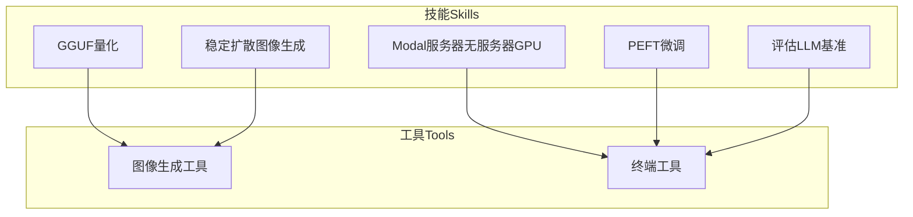
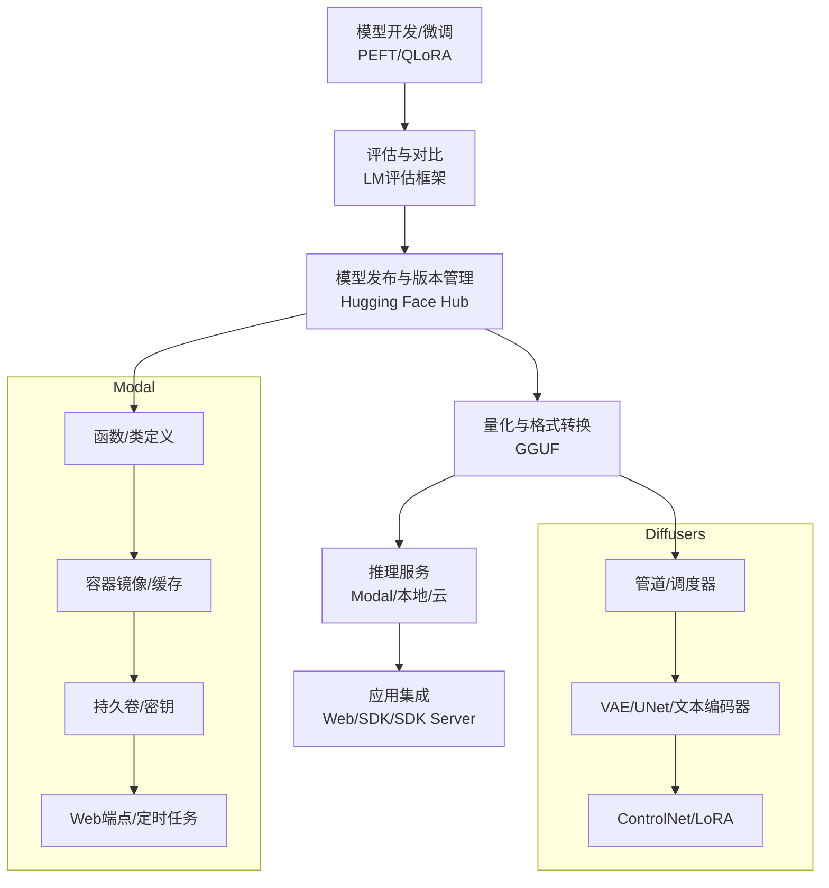
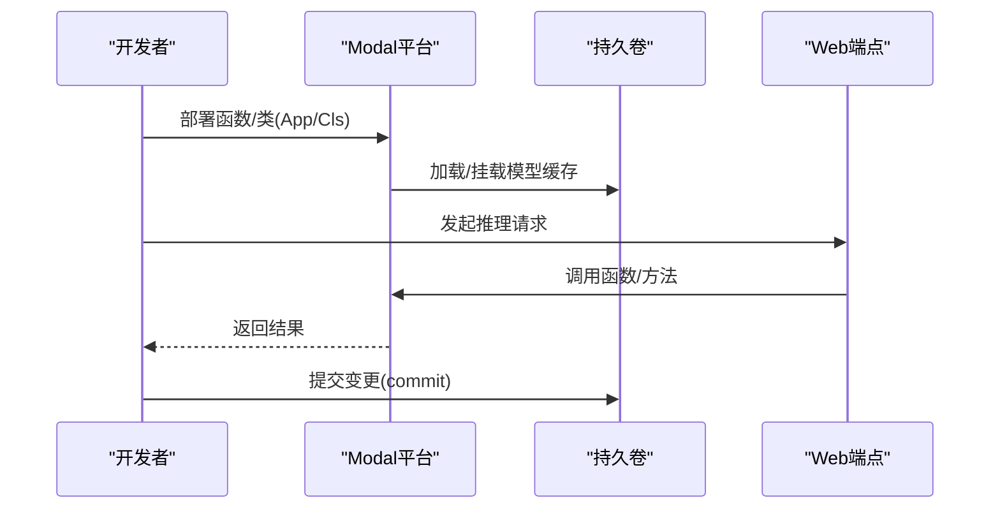
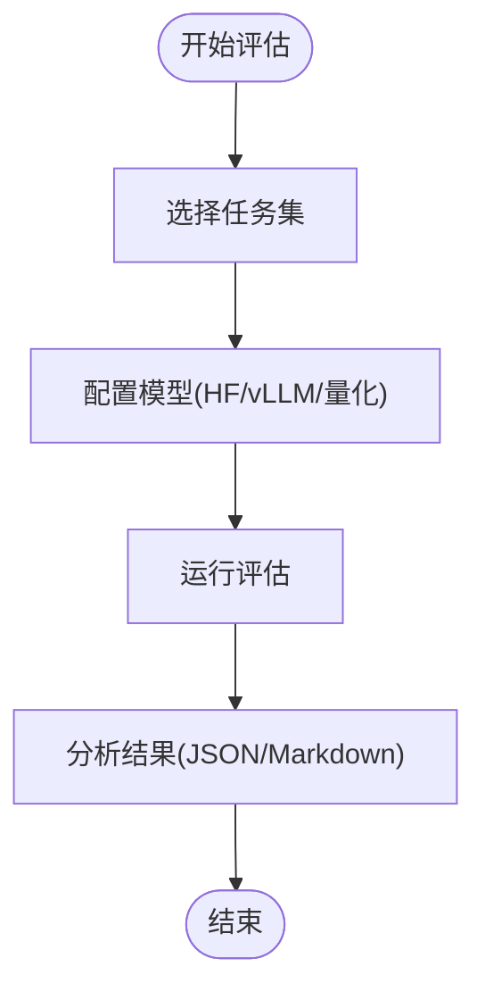
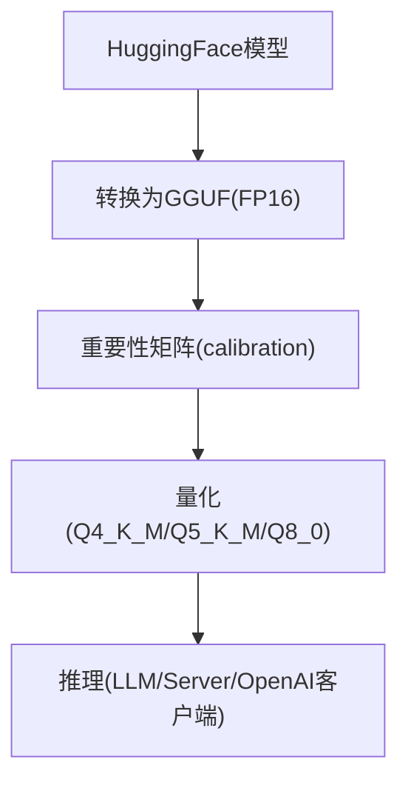
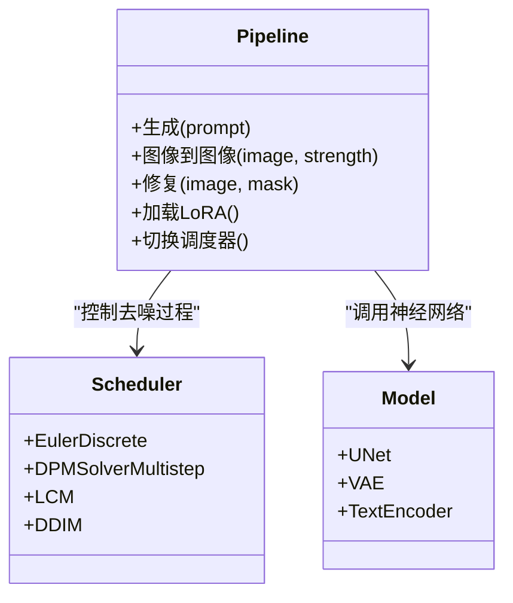
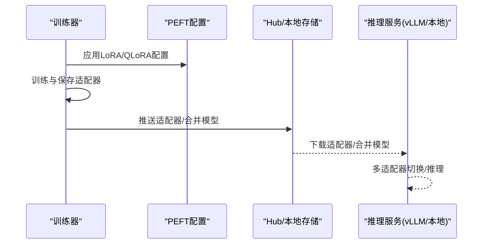
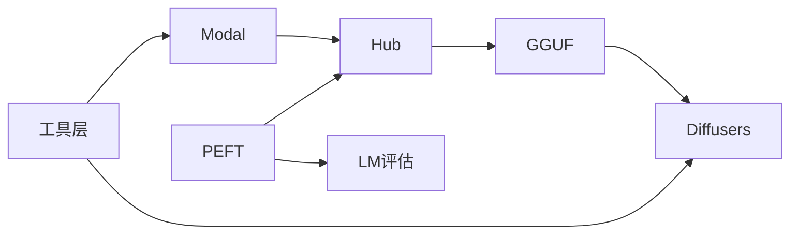

# MLOps相关技能

<cite>
**本文引用的文件**
- [README.md](file://README.md)
- [SKILL.md（Modal服务器无服务器GPU）](file://skills/mlops/cloud/modal/SMODAL服务器无服务器GPU.md)
- [SKILL.md（GGUF量化）](file://skills/mlops/inference/gguf/SKILL.md)
- [SKILL.md（稳定扩散图像生成）](file://skills/mlops/models/stable-diffusion/SKILL.md)
- [SKILL.md（PEFT微调）](file://skills/mlops/training/peft/SKILL.md)
- [SKILL.md（评估LLM基准）](file://skills/mlops/evaluation/lm-evaluation-harness/SKILL.md)
- [参考指南（基准指南）](file://skills/mlops/evaluation/lm-evaluation-harness/references/benchmark-guide.md)
- [参考指南（高级用法：GGUF）](file://skills/mlops/inference/gguf/references/advanced-usage.md)
- [参考指南（高级用法：PEFT）](file://skills/mlops/training/peft/references/advanced-usage.md)
- [工具：图像生成工具](file://tools/image_generation_tool.py)
- [工具：终端工具](file://tools/terminal_tool.py)
- [可选技能：Lambda Labs](file://optional-skills/mlops/lambda-labs/SKILL.md)
- [参考指南（Lambda Labs：高级用法）](file://optional-skills/mlops/lambda-labs/references/advanced-usage.md)
</cite>

## 目录
1. [简介](#简介)
2. [项目结构](#项目结构)
3. [核心组件](#核心组件)
4. [架构总览](#架构总览)
5. [详细组件分析](#详细组件分析)
6. [依赖关系分析](#依赖关系分析)
7. [性能考量](#性能考量)
8. [故障排查指南](#故障排查指南)
9. [结论](#结论)
10. [附录](#附录)

## 简介
本文件系统化梳理与MLOps相关的技能与实践，覆盖以下主题：
- Modal云平台的无服务器GPU部署与资源管理
- 语言模型评估（LM Evaluation Harness）与自定义任务
- Hugging Face Hub模型上传与版本管理
- GGUF量化与推理优化（llama.cpp）
- Stable Diffusion图像生成与提示词优化
- PEFT参数高效微调（LoRA/QLoRA等）
- MLOps最佳实践与性能优化建议

目标是帮助读者在本地或云端快速落地上述能力，并在生产环境中实现可扩展、可观测、可复现的模型全生命周期管理。

## 项目结构
围绕MLOps能力，本仓库以“技能”（skills）与“工具”（tools）为核心组织方式：
- 技能：封装完整的端到端工作流与最佳实践，如Modal部署、GGUF量化、Stable Diffusion、PEFT微调、LM评估等
- 工具：面向运行时环境与后端执行的通用能力，如图像生成工具、终端工具等

图示来源
- [SKILL.md（Modal服务器无服务器GPU）](file://skills/mlops/cloud/modal/SMODAL服务器无服务器GPU.md)
- [SKILL.md（GGUF量化）](file://skills/mlops/inference/gguf/SKILL.md)
- [SKILL.md（稳定扩散图像生成）](file://skills/mlops/models/stable-diffusion/SKILL.md)
- [SKILL.md（PEFT微调）](file://skills/mlops/training/peft/SKILL.md)
- [SKILL.md（评估LLM基准）](file://skills/mlops/evaluation/lm-evaluation-harness/SKILL.md)
- [工具：图像生成工具](file://tools/image_generation_tool.py)
- [工具：终端工具](file://tools/terminal_tool.py)

章节来源
- [README.md](file://README.md)

## 核心组件
- Modal无服务器GPU：提供Python原生定义的容器镜像、自动扩缩容、子秒级冷启动、持久卷与密钥管理、定时任务与Web端点部署
- LM评估框架：标准化的多任务评估套件，支持HF/vLLM后端，提供训练进度跟踪、对比实验与结果分析
- Hugging Face Hub：模型上传、版本化发布与合并（GGUF/16bit），便于跨平台部署
- GGUF量化：将大模型转换为统一格式并进行灵活量化，支持CPU/Apple Silicon/NVIDIA多硬件栈
- Stable Diffusion：文本到图像生成、图像到图像、修复/外绘、ControlNet与LoRA适配器
- PEFT微调：LoRA/QLoRA等参数高效微调，支持多适配器服务与与TRL/vLLM集成

章节来源
- [SKILL.md（Modal服务器无服务器GPU）](file://skills/mlops/cloud/modal/SMODAL服务器无服务器GPU.md)
- [SKILL.md（评估LLM基准）](file://skills/mlops/evaluation/lm-evaluation-harness/SKILL.md)
- [SKILL.md（GGUF量化）](file://skills/mlops/inference/gguf/SKILL.md)
- [SKILL.md（稳定扩散图像生成）](file://skills/mlops/models/stable-diffusion/SKILL.md)
- [SKILL.md（PEFT微调）](file://skills/mlops/training/peft/SKILL.md)

## 架构总览
下图展示从“模型开发/评估/部署”到“推理服务”的典型MLOps路径，涵盖Modal、Hub、GGUF、Diffusers与PEFT等关键环节。

图示来源
- [SKILL.md（Modal服务器无服务器GPU）](file://skills/mlops/cloud/modal/SMODAL服务器无服务器GPU.md)
- [SKILL.md（GGUF量化）](file://skills/mlops/inference/gguf/SKILL.md)
- [SKILL.md（稳定扩散图像生成）](file://skills/mlops/models/stable-diffusion/SKILL.md)
- [SKILL.md（评估LLM基准）](file://skills/mlops/evaluation/lm-evaluation-harness/SKILL.md)

## 详细组件分析

### Modal云平台：无服务器GPU部署与资源管理
- 关键概念：App/Function/Cls/Image/Volume/Secret，支持Python原生定义、自动扩缩容、子秒级冷启动、零停机更新
- GPU配置：单卡/多卡/回退策略/任意可用GPU；不同GPU规格与适用场景
- 容器镜像：基于Debian Slim/CUDA基础镜像，pip/apt安装依赖
- 持久化：Volume用于模型/数据缓存，commit持久化
- Web端点：FastAPI/ASGI/WSGI装饰器，动态批处理
- 调度：Cron/Period定时任务
- 性能优化：容器空闲超时、并发输入、模型加载生命周期钩子
- 常见问题：冷启动延迟、显存溢出、镜像构建失败、超时错误

图示来源
- [SKILL.md（Modal服务器无服务器GPU）](file://skills/mlops/cloud/modal/SMODAL服务器无服务器GPU.md)

章节来源
- [SKILL.md（Modal服务器无服务器GPU）](file://skills/mlops/cloud/modal/SMODAL服务器无服务器GPU.md)

### LM评估框架：基准测试与评估指标
- 支持任务：MMLU、GSM8K、HumanEval、TruthfulQA、HellaSwag、ARC、DROP等60+基准
- 推荐套件：通用release建议的任务组合
- 模型配置：HF/本地检查点/量化（4/8位）、设备选择、批大小
- 运行模式：标准HF、vLLM后端（更快）
- 结果解读：准确率、精确匹配、F1、BLEU/ROUGE、Pass@k
- 常见问题：速度慢、显存不足、结果差异、代码执行

图示来源
- [SKILL.md（评估LLM基准）](file://skills/mlops/evaluation/lm-evaluation-harness/SKILL.md)
- [参考指南（基准指南）](file://skills/mlops/evaluation/lm-evaluation-harness/references/benchmark-guide.md)

章节来源
- [SKILL.md（评估LLM基准）](file://skills/mlops/evaluation/lm-evaluation-harness/SKILL.md)
- [参考指南（基准指南）](file://skills/mlops/evaluation/lm-evaluation-harness/references/benchmark-guide.md)

### Hugging Face Hub：模型上传与版本管理
- 上传与发布：支持16bit合并权重与GGUF多精度量化版本
- 版本化：通过分支/标签管理迭代
- 集成：与PEFT/Unsloth/llama.cpp等生态无缝衔接
- 部署：可直接在本地/云上使用llama.cpp/Ollama/text-generation-webui等

章节来源
- [参考指南（高级用法：PEFT）](file://skills/mlops/training/peft/references/advanced-usage.md)
- [参考指南（高级用法：GGUF）](file://skills/mlops/inference/gguf/references/advanced-usage.md)

### GGUF量化与推理优化
- 格式优势：统一格式、跨硬件、灵活量化（2-8bit）、imatrix提升低比特质量
- 工作流：HF转GGUF（FP16）→量化（K-quant/Q2_K-Q8_0）→推理（CLI/Python/Server）
- 硬件优化：Apple Silicon Metal、NVIDIA CUDA、CPU线程数与批大小
- 生态集成：Ollama、LM Studio、text-generation-webui、OpenAI兼容服务

图示来源
- [SKILL.md（GGUF量化）](file://skills/mlops/inference/gguf/SKILL.md)
- [参考指南（高级用法：GGUF）](file://skills/mlops/inference/gguf/references/advanced-usage.md)

章节来源
- [SKILL.md（GGUF量化）](file://skills/mlops/inference/gguf/SKILL.md)
- [参考指南（高级用法：GGUF）](file://skills/mlops/inference/gguf/references/advanced-usage.md)

### Stable Diffusion：图像生成与提示词优化
- 核心组件：Pipeline/模型（UNet/VAE/文本编码器）/调度器
- 工作流：文本到图像、图像到图像、修复/外绘、ControlNet、LoRA适配器
- 参数优化：步数、引导强度、分辨率、负向提示词、随机种子
- 内存优化：CPU卸载、注意力切片、xFormers高效注意力、VAE切片/平铺
- 快速原型：LCM调度器+LoRA实现极短推理时间

图示来源
- [SKILL.md（稳定扩散图像生成）](file://skills/mlops/models/stable-diffusion/SKILL.md)

章节来源
- [SKILL.md（稳定扩散图像生成）](file://skills/mlops/models/stable-diffusion/SKILL.md)

### PEFT微调：参数高效与多适配器服务
- 方法对比：LoRA/QLoRA/AdaLoRA/IA3/PrefixTuning/PromptTuning/P-Tuning v2
- 训练配置：秩/Alpha/目标模块/梯度检查点/批大小与累积
- 加载与合并：直接加载适配器、合并到基座模型、多适配器运行时切换
- 集成：与TRL、Axolotl、vLLM（推理）对接

图示来源
- [SKILL.md（PEFT微调）](file://skills/mlops/training/peft/SKILL.md)
- [参考指南（高级用法：PEFT）](file://skills/mlops/training/peft/references/advanced-usage.md)

章节来源
- [SKILL.md（PEFT微调）](file://skills/mlops/training/peft/SKILL.md)
- [参考指南（高级用法：PEFT）](file://skills/mlops/training/peft/references/advanced-usage.md)

### 可选技能：Lambda Labs（集群与文件系统）
- GPU实例：多种GPU规格与实例类型，支持多卡与回退策略
- 文件系统：持久化存储、挂载、跨实例共享
- 高级用法：交互式会话、作业队列监控、Conda/Docker环境、监控与可视化

章节来源
- [可选技能：Lambda Labs](file://optional-skills/mlops/lambda-labs/SKILL.md)
- [参考指南（Lambda Labs：高级用法）](file://optional-skills/mlops/lambda-labs/references/advanced-usage.md)

## 依赖关系分析
- Modal与Hub：模型缓存与发布依赖；Web端点与定时任务依赖容器镜像与密钥
- GGUF与Diffusers：Stable Diffusion可作为推理后端之一，亦可与llama.cpp生态配合
- PEFT与评估：微调后的适配器/合并模型可用于LM评估框架
- 工具层：图像生成工具与终端工具分别服务于推理与环境管理

图示来源
- [SKILL.md（Modal服务器无服务器GPU）](file://skills/mlops/cloud/modal/SMODAL服务器无服务器GPU.md)
- [SKILL.md（GGUF量化）](file://skills/mlops/inference/gguf/SKILL.md)
- [SKILL.md（稳定扩散图像生成）](file://skills/mlops/models/stable-diffusion/SKILL.md)
- [SKILL.md（PEFT微调）](file://skills/mlops/training/peft/SKILL.md)
- [SKILL.md（评估LLM基准）](file://skills/mlops/evaluation/lm-evaluation-harness/SKILL.md)
- [工具：图像生成工具](file://tools/image_generation_tool.py)
- [工具：终端工具](file://tools/terminal_tool.py)

章节来源
- [工具：图像生成工具](file://tools/image_generation_tool.py)
- [工具：终端工具](file://tools/terminal_tool.py)

## 性能考量
- 显存与批大小：根据模型规模与GPU显存选择量化/分片/Offload策略
- 推理加速：调度器切换（如DPMSolver）、LCM、动态批处理、CPU线程与批大小
- 训练效率：梯度检查点、混合精度、目标模块选择、适配器秩与Alpha
- 存储与I/O：模型缓存卷、imatrix预计算、数据分片与流水线
- 平台选择：Modal适合按需弹性与零运维；Lambda Labs适合长周期/大规模训练

## 故障排查指南
- Modal
  - 冷启动延迟：延长容器空闲超时、使用生命周期钩子预热
  - 显存溢出：更大GPU/梯度检查点/量化/减少批大小
  - 镜像构建失败：固定依赖版本、确保CUDA兼容
  - 超时错误：增加超时、加入断点续训
- LM评估
  - 速度慢：使用vLLM后端、减少few-shot、评估子集
  - 显存不足：降低批大小、启用CPU offload、量化
  - 结果不一致：核对few-shot数量、任务名称、模型与分词器一致性
  - HumanEval执行：开启代码执行开关
- GGUF
  - 慢加载：启用mmap
  - 显存不足：减少GPU层数/改用更小量化
  - 低比特质量：使用imatrix
- Stable Diffusion
  - 显存不足：启用CPU卸载/注意力切片/xFormers/VAE切片
  - 黑屏/噪声：检查VAE配置、dtype一致性、安全检查器
  - 速度慢：更换更快调度器、减少步数
- PEFT
  - 显存不足：梯度检查点、减小批/增大累积、使用QLoRA
  - 适配器不生效：确认激活状态、训练模式、打印可训练参数
  - 质量下降：提高秩、扩大目标模块、增加数据与轮次、降低学习率

章节来源
- [SKILL.md（Modal服务器无服务器GPU）](file://skills/mlops/cloud/modal/SMODAL服务器无服务器GPU.md)
- [SKILL.md（评估LLM基准）](file://skills/mlops/evaluation/lm-evaluation-harness/SKILL.md)
- [SKILL.md（GGUF量化）](file://skills/mlops/inference/gguf/SKILL.md)
- [SKILL.md（稳定扩散图像生成）](file://skills/mlops/models/stable-diffusion/SKILL.md)
- [SKILL.md（PEFT微调）](file://skills/mlops/training/peft/SKILL.md)

## 结论
通过Modal无服务器GPU、LM评估框架、Hub版本化、GGUF量化、Stable Diffusion与PEFT微调的协同，可以构建从训练到部署、从评估到生产的完整MLOps闭环。建议优先采用参数高效微调与量化策略以降低成本与资源占用，并结合自动化评估与可观测性工具保障质量与稳定性。

## 附录
- 环境配置要点（来自工具层）
  - 容器CPU/内存/磁盘与持久化选项
  - Modal模式与Docker卷挂载
  - SSH/Docker/Singularity/Daytona等后端配置

章节来源
- [工具：终端工具](file://tools/terminal_tool.py)