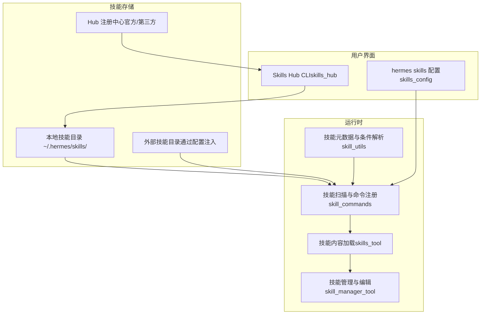
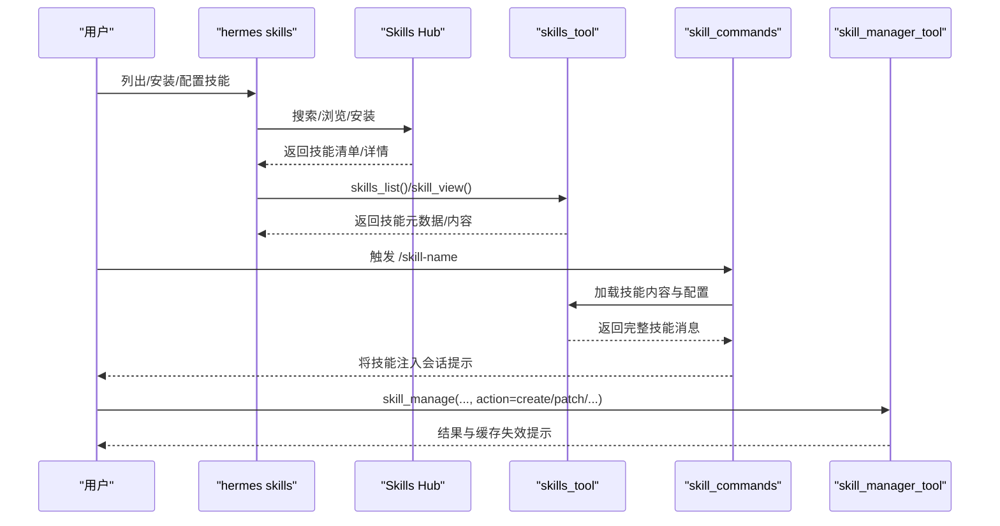
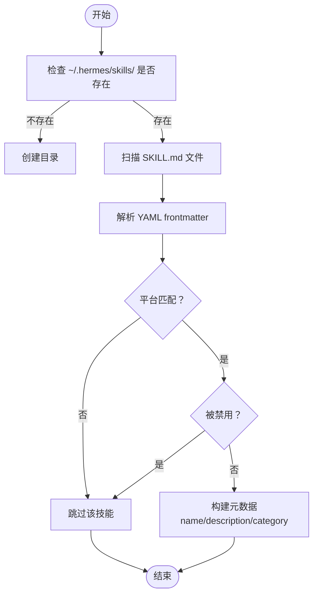
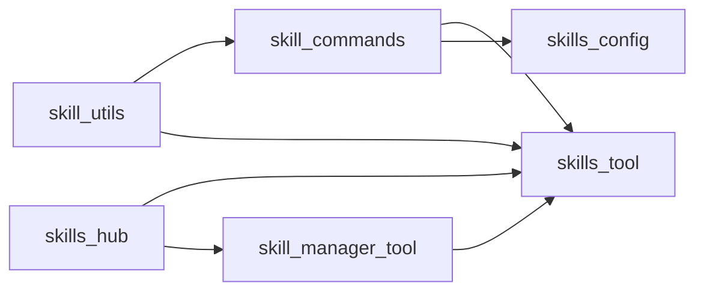

# 内置技能

<cite>
**本文引用的文件**
- [skills_tool.py](file://tools/skills_tool.py)
- [skill_manager_tool.py](file://tools/skill_manager_tool.py)
- [skill_commands.py](file://agent/skill_commands.py)
- [skill_utils.py](file://agent/skill_utils.py)
- [skills_config.py](file://hermes_cli/skills_config.py)
- [skills_hub.py](file://hermes_cli/skills_hub.py)
- [github-auth SKILL.md](file://skills/github/github-auth/SKILL.md)
- [github-code-review SKILL.md](file://skills/github/github-code-review/SKILL.md)
- [excalidraw SKILL.md](file://skills/creative/excalidraw/SKILL.md)
- [google-workspace SKILL.md](file://skills/productivity/google-workspace/SKILL.md)
- [README.md](file://README.md)
- [skills.md（用户指南）](file://website/docs/user-guide/features/skills.md)
</cite>

## 目录
1. [简介](#简介)
2. [项目结构](#项目结构)
3. [核心组件](#核心组件)
4. [架构总览](#架构总览)
5. [详细组件分析](#详细组件分析)
6. [依赖关系分析](#依赖关系分析)
7. [性能考量](#性能考量)
8. [故障排查指南](#故障排查指南)
9. [结论](#结论)
10. [附录](#附录)

## 简介
本文件系统化梳理 Hermes Agent 的内置技能体系，覆盖技能发现、加载、条件激活、配置注入、管理与安装等全链路能力，并以 GitHub、创意工具、生产力工具等分类为例，详解各技能的触发条件、执行步骤与使用场景，提供可操作的配置与定制建议，以及技能间的协作与组合使用方式。

## 项目结构
Hermes Agent 的技能系统由“本地技能目录”“Hub 技能注册中心”“平台条件与禁用策略”“命令与提示词集成”“管理与编辑工具”五部分构成，形成“发现—加载—执行—反馈—沉淀”的闭环。

图示来源
- [skills_tool.py](file://tools/skills_tool.py)
- [skill_commands.py](file://agent/skill_commands.py)
- [skill_utils.py](file://agent/skill_utils.py)
- [skills_config.py](file://hermes_cli/skills_config.py)
- [skills_hub.py](file://hermes_cli/skills_hub.py)

章节来源
- [skills_tool.py](file://tools/skills_tool.py)
- [skill_commands.py](file://agent/skill_commands.py)
- [skill_utils.py](file://agent/skill_utils.py)
- [skills_config.py](file://hermes_cli/skills_config.py)
- [skills_hub.py](file://hermes_cli/skills_hub.py)

## 核心组件
- 技能发现与列表：skills_list 仅返回最小元数据，避免大文本开销；支持按类别过滤与平台过滤。
- 技能视图与引用文件：skill_view 可加载完整内容、标签、关联文件与模板；支持按路径查看特定文件。
- 条件激活与平台限制：通过 frontmatter 的 platforms、requires_toolsets/fallback_for_toolsets 等字段控制显示与可用性。
- 命令式调用：/skill-name 指令将技能注入到会话提示中，自动注入配置变量与支持文件清单。
- 管理与编辑：skill_manage 提供 create/edit/patch/delete/write_file/remove_file 动作，内置安全扫描与原子写入。
- Hub 安装与同步：skills_hub 支持搜索、浏览、安装、卸载、更新、审计与发布流程。
- 用户配置：hermes skills 支持按平台或全局禁用技能，支持类别级开关。

章节来源
- [skills_tool.py](file://tools/skills_tool.py)
- [skill_manager_tool.py](file://tools/skill_manager_tool.py)
- [skill_commands.py](file://agent/skill_commands.py)
- [skill_utils.py](file://agent/skill_utils.py)
- [skills_config.py](file://hermes_cli/skills_config.py)
- [skills_hub.py](file://hermes_cli/skills_hub.py)
- [skills.md（用户指南）](file://website/docs/user-guide/features/skills.md)

## 架构总览
技能系统采用“渐进披露”设计：先列出简要信息，再按需加载全文与引用文件；同时通过平台与工具集条件实现“按需可见”。命令层将技能注入到系统提示中，管理层允许 Agent 自主沉淀经验为新技能。

图示来源
- [skills_tool.py](file://tools/skills_tool.py)
- [skill_commands.py](file://agent/skill_commands.py)
- [skill_manager_tool.py](file://tools/skill_manager_tool.py)
- [skills_hub.py](file://hermes_cli/skills_hub.py)
- [skills_config.py](file://hermes_cli/skills_config.py)

## 详细组件分析

### 组件一：技能发现与加载（skills_tool）
- 职责
  - 扫描本地与外部技能目录，构建技能清单（名称、描述、类别）。
  - 按需加载技能全文、标签、相关文件与模板。
  - 平台匹配与禁用过滤。
- 关键点
  - 渐进披露：skills_list 返回最小元数据；skill_view 加载全文与引用文件。
  - 平台过滤：platforms 字段决定是否在当前系统加载。
  - 外部目录：通过配置注入，优先本地后外部。
- 性能
  - 列表阶段仅解析前若干字符，避免大文本开销；全文仅在需要时加载。

图示来源
- [skills_tool.py](file://tools/skills_tool.py)

章节来源
- [skills_tool.py](file://tools/skills_tool.py)

### 组件二：条件激活与平台限制（skill_utils）
- 职责
  - 解析 frontmatter 中的 platforms、requires_toolsets/fallback_for_toolsets 等字段。
  - 读取配置中的禁用名单与外部目录列表。
- 关键点
  - platforms：macos/linux/windows 映射到 sys.platform 前缀。
  - 条件字段：requires/requires_tools 用于“仅在具备某工具/工具集时显示”，fallback_for/requires_for_tools 用于“缺失时才显示”。
  - 外部目录：支持 ~ 与环境变量展开，去重与排除本地目录。

章节来源
- [skill_utils.py](file://agent/skill_utils.py)

### 组件三：命令式调用与提示注入（skill_commands）
- 职责
  - 扫描本地与外部 SKILL.md，生成 /skill-name 命令映射。
  - 将技能内容注入到系统提示中，自动注入配置变量与支持文件清单。
  - 支持会话预加载多个技能。
- 关键点
  - 命令名归一化（空格/下划线转连字符，去除非法字符）。
  - 支持从绝对路径或相对路径加载技能。
  - 自动注入“技能配置块”“支持文件清单”“运行时备注”。

章节来源
- [skill_commands.py](file://agent/skill_commands.py)

### 组件四：技能管理与编辑（skill_manager_tool）
- 职责
  - 允许 Agent 或用户对技能进行创建、编辑、补丁、删除、写入/移除支持文件。
  - 写入采用原子落盘，防止中断导致半写。
  - 对 Agent 创建的技能执行安全扫描，必要时回滚。
- 关键点
  - 行为：create、edit、patch、delete、write_file、remove_file。
  - 参数校验：名称合法性、frontmatter 结构、内容大小限制、文件路径白名单。
  - 安全：扫描结果决定是否允许安装/更新，警告级别不阻断但记录日志。

章节来源
- [skill_manager_tool.py](file://tools/skill_manager_tool.py)

### 组件五：Skills Hub 与安装同步（skills_hub）
- 职责
  - 搜索、浏览、安装、卸载、更新、审计与发布技能。
  - 支持多源（官方、第三方、自定义 tap）。
- 关键点
  - 安装前隔离区（quarantine）+ 安全扫描 + 用户确认。
  - 更新：检测上游变更并增量更新。
  - 审计：重新扫描已安装技能的安全状态。

章节来源
- [skills_hub.py](file://hermes_cli/skills_hub.py)

### 组件六：用户配置与禁用策略（skills_config）
- 职责
  - 支持按平台或全局禁用技能。
  - 支持类别级开关。
- 关键点
  - 配置项：skills.disabled、skills.platform_disabled。
  - CLI 交互：选择平台、类别或逐项切换。

章节来源
- [skills_config.py](file://hermes_cli/skills_config.py)

## 依赖关系分析
- 组件耦合
  - skill_commands 依赖 skills_tool 的目录扫描与内容加载。
  - skill_utils 为 skill_commands 与 skills_tool 提供通用的 frontmatter/平台/条件解析。
  - skill_manager_tool 依赖安全扫描器与缓存清理。
  - skills_hub 依赖工具模块与锁文件管理。
- 外部依赖
  - 平台识别依赖 sys.platform。
  - YAML 解析依赖 PyYAML（CSafeLoader）。
  - 环境变量与 Herms HOME 依赖 hermes_constants。

图示来源
- [skill_utils.py](file://agent/skill_utils.py)
- [skill_commands.py](file://agent/skill_commands.py)
- [skills_tool.py](file://tools/skills_tool.py)
- [skill_manager_tool.py](file://tools/skill_manager_tool.py)
- [skills_hub.py](file://hermes_cli/skills_hub.py)
- [skills_config.py](file://hermes_cli/skills_config.py)

章节来源
- [skill_utils.py](file://agent/skill_utils.py)
- [skill_commands.py](file://agent/skill_commands.py)
- [skills_tool.py](file://tools/skills_tool.py)
- [skill_manager_tool.py](file://tools/skill_manager_tool.py)
- [skills_hub.py](file://hermes_cli/skills_hub.py)
- [skills_config.py](file://hermes_cli/skills_config.py)

## 性能考量
- 渐进披露：skills_list 仅返回名称与描述，避免大文本传输与解析。
- 惰性加载：skill_view 仅在需要时加载全文与引用文件。
- 目录扫描：排除 .git/.github/.hub，减少无关目录遍历。
- 缓存失效：新增/修改/删除技能后清理系统提示缓存，确保立即生效。

## 故障排查指南
- 技能未显示
  - 检查 platforms 是否与当前系统匹配。
  - 检查是否被禁用（全局或平台维度）。
  - 检查外部目录配置是否正确且存在。
- 技能加载失败
  - frontmatter 缺失或格式错误。
  - 内容过大或文件路径越界。
- 安全扫描阻断
  - 查看扫描报告，修正潜在风险后重试。
- Hub 安装失败
  - 检查网络与认证（如 GitHub Token）。
  - 查看锁文件与隔离区状态，必要时清理后重试。

章节来源
- [skills_tool.py](file://tools/skills_tool.py)
- [skill_manager_tool.py](file://tools/skill_manager_tool.py)
- [skills_hub.py](file://hermes_cli/skills_hub.py)
- [skills_config.py](file://hermes_cli/skills_config.py)

## 结论
Hermes Agent 的技能系统以“渐进披露 + 条件激活 + 平台适配 + 安全治理”为核心设计，既保证了运行时效率，又提供了强大的可扩展性与安全性。通过 Hub 与本地技能的协同，用户可以快速发现、安装、配置与沉淀技能，形成可持续演进的“程序化知识库”。

## 附录

### 分类与代表性技能概览
- GitHub 相关
  - 触发条件：需要与 GitHub 仓库/PR/Issue/CI 交互。
  - 执行步骤：先运行认证检测脚本，再根据可用工具选择 gh 或 curl 流程。
  - 使用场景：自动化 PR 审查、Issues 管理、仓库管理、代码审查。
  - 参考文件
    - [github-auth SKILL.md](file://skills/github/github-auth/SKILL.md)
    - [github-code-review SKILL.md](file://skills/github/github-code-review/SKILL.md)
- 创意工具
  - 触发条件：需要生成可视化草图或流程图。
  - 执行步骤：编写 Excalidraw JSON 元素，保存为 .excalidraw 文件，可选上传分享链接。
  - 使用场景：架构图、流程图、概念图绘制。
  - 参考文件
    - [excalidraw SKILL.md](file://skills/creative/excalidraw/SKILL.md)
- 生产力工具
  - 触发条件：需要与 Google Workspace 服务（Gmail/Calendar/Drive/Sheets/Docs）交互。
  - 执行步骤：OAuth2 设置（客户端密钥、授权码、令牌刷新），随后通过 API 包装脚本调用。
  - 使用场景：邮件检索/发送、日历事件管理、表格读写、文档读取。
  - 参考文件
    - [google-workspace SKILL.md](file://skills/productivity/google-workspace/SKILL.md)

### 技能配置与定制
- 平台限制
  - 在 frontmatter 中设置 platforms，限制仅在 macOS/Linux/Windows 上加载。
- 条件激活
  - 使用 requires_toolsets/fallback_for_toolsets 控制显示与可用性。
- 技能配置注入
  - frontmatter.metadata.hermes.config 声明配置项，运行时从 ~/.hermes/config.yaml 注入到提示中。
- 禁用与分类
  - 通过 hermes skills 配置全局或平台禁用名单，或按类别批量开关。

章节来源
- [skills.md（用户指南）](file://website/docs/user-guide/features/skills.md)
- [skills_config.py](file://hermes_cli/skills_config.py)
- [skill_utils.py](file://agent/skill_utils.py)
- [skill_commands.py](file://agent/skill_commands.py)

### 技能协作与组合使用
- GitHub 工作流
  - 认证前置：先运行 github-auth，再执行 github-code-review 或其他 GitHub 相关技能。
- 可视化与文档
  - 先用 excalidraw 生成草图，再用 google-workspace 将说明文档写入 Docs/Drive。
- 最佳实践
  - 先做“检测/准备”类技能（认证/环境），再做“执行”类技能（审查/创建/更新）。
  - 使用 /skill-name 预加载关键技能，确保会话全程遵循统一流程。

章节来源
- [github-auth SKILL.md](file://skills/github/github-auth/SKILL.md)
- [github-code-review SKILL.md](file://skills/github/github-code-review/SKILL.md)
- [excalidraw SKILL.md](file://skills/creative/excalidraw/SKILL.md)
- [google-workspace SKILL.md](file://skills/productivity/google-workspace/SKILL.md)