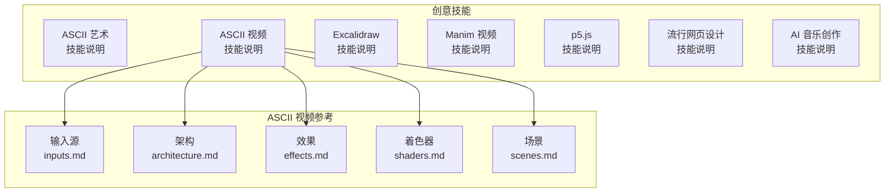
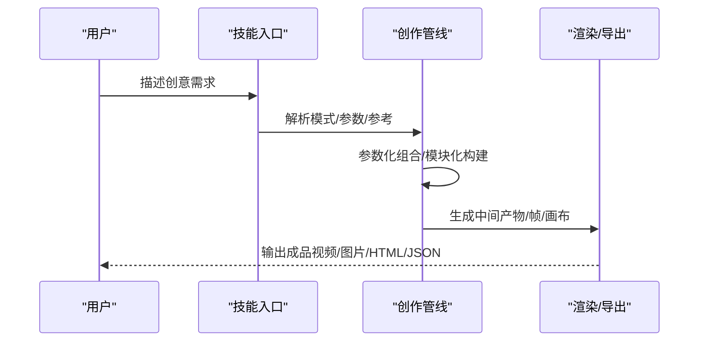
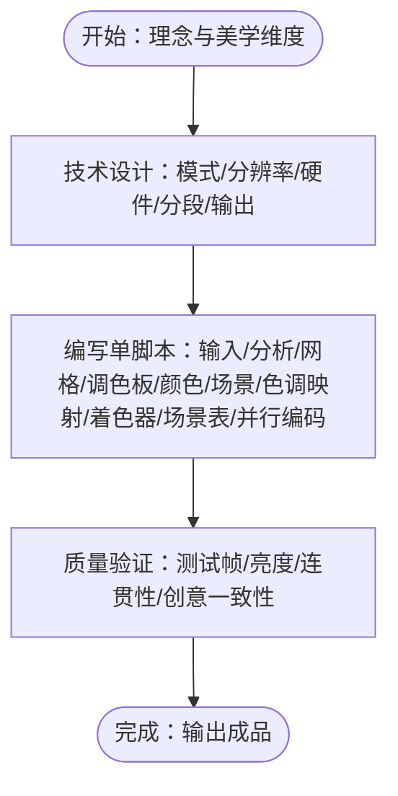
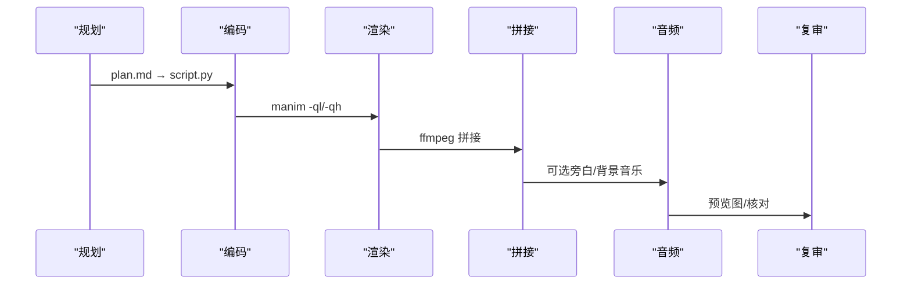
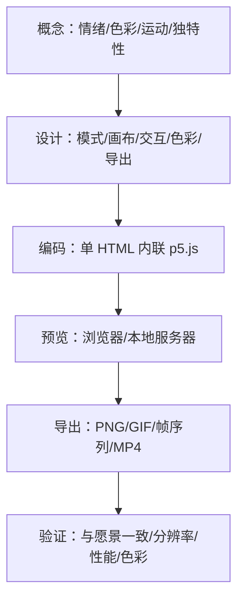
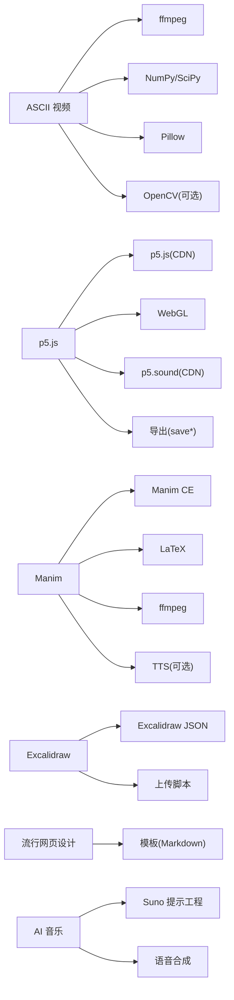

# 创意工具技能

<cite>
**本文档引用的文件**
- [技能描述：创意](file://skills/creative/DESCRIPTION.md)
- [ASCII 艺术技能](file://skills/creative/ascii-art/SKILL.md)
- [ASCII 视频技能](file://skills/creative/ascii-video/SKILL.md)
- [ASCII 视频输入源参考](file://skills/creative/ascii-video/references/inputs.md)
- [ASCII 视频架构参考](file://skills/creative/ascii-video/references/architecture.md)
- [ASCII 视频效果目录](file://skills/creative/ascii-video/references/effects.md)
- [ASCII 视频着色器参考](file://skills/creative/ascii-video/references/shaders.md)
- [ASCII 视频场景参考](file://skills/creative/ascii-video/references/scenes.md)
- [Excalidraw 技能](file://skills/creative/excalidraw/SKILL.md)
- [Manim 视频技能](file://skills/creative/manim-video/SKILL.md)
- [p5.js 技能](file://skills/creative/p5js/SKILL.md)
- [流行网页设计技能](file://skills/creative/popular-web-designs/SKILL.md)
- [AI 音乐创作技能](file://skills/creative/songwriting-and-ai-music/SKILL.md)
</cite>

## 目录
1. [简介](#简介)
2. [项目结构](#项目结构)
3. [核心组件](#核心组件)
4. [架构总览](#架构总览)
5. [详细组件分析](#详细组件分析)
6. [依赖关系分析](#依赖关系分析)
7. [性能考虑](#性能考虑)
8. [故障排除指南](#故障排除指南)
9. [结论](#结论)
10. [附录](#附录)

## 简介
本文件系统性梳理创意工具技能，覆盖以下领域：
- ASCII 艺术：文本横幅、消息艺术、装饰边框、彩色文本、图像转 ASCII、预设艺术搜索与实用工具
- ASCII 视频：视频到字符映射、音频反应式可视化、生成式动画、混合视频+音频反应、字幕叠加、实时终端渲染
- Excalidraw 图表：手绘风格图表 JSON 文件生成与分享
- Manim 动画：数学与技术动画管线，概念解释、算法可视化、数据故事、架构图、3D 可视化
- p5.js 图形编程：浏览器端创意编码、生成式艺术、数据可视化、交互体验、3D 场景、音频反应、导出策略
- 流行网页设计模板：54 套真实网站设计系统，直接生成 HTML/CSS
- AI 音乐创作：歌曲结构、韵律与格律、情感弧线、歌词写作、Suno 提示工程、语音合成与元标签

## 项目结构
创意技能位于 skills/creative 下，每个子技能以独立目录呈现，包含技能说明与参考文档。

**图表来源**
- [ASCII 视频技能](file://skills/creative/ascii-video/SKILL.md)
- [ASCII 视频输入源参考](file://skills/creative/ascii-video/references/inputs.md)
- [ASCII 视频架构参考](file://skills/creative/ascii-video/references/architecture.md)
- [ASCII 视频效果目录](file://skills/creative/ascii-video/references/effects.md)
- [ASCII 视频着色器参考](file://skills/creative/ascii-video/references/shaders.md)
- [ASCII 视频场景参考](file://skills/creative/ascii-video/references/scenes.md)

**章节来源**
- [技能描述：创意](file://skills/creative/DESCRIPTION.md)

## 核心组件
- ASCII 艺术：多工具链（本地 pyfiglet、远程 asciified API、cowsay、boxes、toilet）、图像转 ASCII（ascii-image-converter、jp2a）、预设艺术搜索、QR/天气 ASCII 工具、LLM 自定义艺术
- ASCII 视频：Python 单脚本管线，NumPy/SciPy/Pillow/ffmpeg/并发，六阶段流水线（输入→分析→场景函数→色调映射→着色器→编码），支持视频/音频/生成式/混合/字幕/TTS
- Excalidraw：标准 Excalidraw 元素 JSON，保存 .excalidraw 文件并通过脚本上传分享
- Manim：教育电影式动画管线，概念规划→代码→渲染→拼接→音频（可选）→复审
- p5.js：浏览器端创意编码，2D/3D 渲染、噪声与粒子系统、流场、着色器、像素处理、动态排版、WebGL、音频分析、鼠标/键盘交互、无头高分辨率导出
- 流行网页设计：54 套真实站点设计系统，包含配色、字体、组件、布局与响应式规则
- AI 音乐创作：歌曲结构、韵律与格律、情感弧线、歌词写作、Suno 提示工程、语音合成与元标签

**章节来源**
- [ASCII 艺术技能](file://skills/creative/ascii-art/SKILL.md)
- [ASCII 视频技能](file://skills/creative/ascii-video/SKILL.md)
- [Excalidraw 技能](file://skills/creative/excalidraw/SKILL.md)
- [Manim 视频技能](file://skills/creative/manim-video/SKILL.md)
- [p5.js 技能](file://skills/creative/p5js/SKILL.md)
- [流行网页设计技能](file://skills/creative/popular-web-designs/SKILL.md)
- [AI 音乐创作技能](file://skills/creative/songwriting-and-ai-music/SKILL.md)

## 架构总览
ASCII 视频与 p5.js 的创作流程均强调“先理念后实现”，通过参数化与模块化构建视觉语言；Manim 强调“叙事优先”的分镜设计；Excalidraw 专注于结构化 JSON 图表；流行网页设计提供即用的设计系统；AI 音乐创作强调风格与情感弧线。

[此图为概念流程示意，不直接对应具体源码文件]

## 详细组件分析

### ASCII 艺术
- 工具链
  - 文本横幅：pyfiglet（本地安装）、asciified API（远程无安装）
  - 消息艺术：cowsay（字符表情气泡）
  - 装饰边框：boxes（70+内置样式）
  - 彩色文本：toilet（ANSI 彩色与滤镜）
  - 图像转 ASCII：ascii-image-converter（推荐）、jp2a（轻量 JPEG）
  - 预设艺术：ascii.co.uk 主题分类、GitHub Octocat API
  - 实用工具：QR 码 ASCII、天气 ASCII
  - LLM 自定义：Unicode 字符集与约束
- 创作流程
  - 文本横幅优先选择 pyfiglet，否则 asciified API
  - 消息艺术用 cowsay，装饰加 boxes
  - 预设艺术从 ascii.co.uk 搜索主题
  - 图像转 ASCII 使用 ascii-image-converter 或 jp2a
  - QR/天气等实用工具通过 curl 获取
  - 无法满足时启用 LLM 自定义字符绘制
- 参数与输出
  - pyfiglet：字体、宽度、输出纯文本
  - asciified API：URL 编码文本、字体名大小写敏感
  - cowsay/toilet：字符列表、修饰符、滤镜
  - boxes：设计样式、对齐方式
  - ascii-image-converter：尺寸、颜色、负片、Braille、保存文本
  - jp2a：宽度、颜色
  - LLM：最大宽高、等宽字体、字符集限制

**章节来源**
- [ASCII 艺术技能](file://skills/creative/ascii-art/SKILL.md)

### ASCII 视频
- 创作标准
  - 视觉艺术标准：先理念再实现，首帧即精品，避免平庸
  - 统一视觉语言：色彩温度、字符调色板、运动词汇一致
  - 层次丰富：每帧值得细看，背景纹理、多网格组合、逐场景变化
- 模式
  - 视频→ASCII、音频反应、生成式、混合（视频+音频）、字幕/歌词、TTS 叙述
- 栈
  - Python 3.10+、NumPy、SciPy、Pillow、ffmpeg、并发、可选 OpenCV
- 管线
  - 输入→分析→场景函数→色调映射→着色器→编码
- 创意方向
  - 字符调色板、颜色策略、背景纹理、主效果、粒子、着色器氛围、网格密度、坐标空间、反馈、遮罩、转场
- 工作流
  - 步骤 1：理念与美学维度设定
  - 步骤 2：技术设计（模式、分辨率、硬件检测、分段、输出格式）
  - 步骤 3：单脚本实现（硬件检测、输入加载、特征分析、网格渲染、字符调色板、颜色系统、场景函数、色调映射、着色器管线、场景表/调度、并行编码、主流程）
  - 步骤 4：质量验证（测试帧、亮度检查、视觉连贯性、创意一致性）
- 关键实现要点
  - 亮度使用自适应色调映射而非线性增益
  - macOS Pillow 文本边界盒高度使用 getmetrics
  - ffmpeg 管道避免 stderr PIPE 导致死锁
  - 字符兼容性：在初始化阶段验证调色板字符渲染
  - 分段剪辑：按场景独立渲染以便并行与选择性重渲染
- 性能目标
  - 特征提取 1-5ms、效果函数 2-15ms、字符渲染 80-150ms（瓶颈）、着色器管线 5-25ms、总计约 100-200ms/帧

**图表来源**
- [ASCII 视频技能](file://skills/creative/ascii-video/SKILL.md)

**章节来源**
- [ASCII 视频技能](file://skills/creative/ascii-video/SKILL.md)
- [ASCII 视频输入源参考](file://skills/creative/ascii-video/references/inputs.md)
- [ASCII 视频架构参考](file://skills/creative/ascii-video/references/architecture.md)
- [ASCII 视频效果目录](file://skills/creative/ascii-video/references/effects.md)
- [ASCII 视频着色器参考](file://skills/creative/ascii-video/references/shaders.md)
- [ASCII 视频场景参考](file://skills/creative/ascii-video/references/scenes.md)

### Excalidraw 图表
- 工作流
  - 加载技能→编写元素 JSON→保存 .excalidraw 文件→可选上传生成分享链接
- 元素格式
  - 必填字段：type、id、x、y、width、height
  - 默认属性：strokeColor、backgroundColor、fillStyle、strokeWidth、roughness、opacity
  - 画布背景白色
- 元素类型
  - 矩形、椭圆、菱形、带标注容器绑定、箭头、独立文本、带绑定箭头
- 绑定与标注
  - 容器绑定：shape 的 boundElements + text 的 containerId
  - 文本定位：approximate 计算，originalText 保持一致
- 绘制顺序（z-order）
  - 背景区域→形状→其绑定文本→箭头→下一个形状
- 尺寸与字体
  - 最小字号：正文/标签/描述 16；标题/标题头 20；仅注释 14
  - 最小形状尺寸：120x60；元素间距至少 20-30px
- 颜色方案
  - 主要/输入：浅蓝；成功/输出：浅绿；警告/外部：浅橙；处理/特殊：浅紫；错误/关键：浅红；注释/决策：浅黄；存储/数据：浅青
- 提示
  - 统一颜色方案；注意文本对比度；避免在文本中使用表情符号；深色模式参考 dark-mode.md；示例参考 examples.md

**章节来源**
- [Excalidraw 技能](file://skills/creative/excalidraw/SKILL.md)

### Manim 视频
- 创作标准
  - 教育电影式：每帧教学，揭示结构
  - 几何优先于代数：先形后式
  - 首帧即精品：无需返工
  - 透明度分层引导注意力：主要 1.0，上下文 0.4，结构 0.15
  - 呼吸空间：每次动画后留白等待吸收
  - 视觉语言统一：色彩、字体、动画速度一致
- 模式
  - 概念解释、方程推导、算法可视化、数据故事、架构图、论文解释、3D 可视化
- 栈
  - Manim CE、LaTeX、ffmpeg、可选 TTS
- 管线
  - 规划→编码→渲染→拼接→音频（可选）→复审
- 项目结构
  - plan.md、script.py、concat.txt、final.mp4、media/
- 创意方向
  - 色彩方案：经典 3B1B、温暖学术、霓虹科技、单色
  - 动画速度：标题出现、关键公式展示、变换/变形、支撑标签、淡出清理、顿悟时刻
  - 字体比例：标题 48、段落标题 36、正文 30、标签 24、说明 20
  - 字体：统一使用等宽字体，避免 Pango 断字问题
- 工作流
  - 步骤 1：规划（叙事弧、场景清单、视觉元素、色彩、旁白脚本）
  - 步骤 2：编码（每个场景一个类，可独立渲染）
  - 步骤 3：渲染（草稿 -ql，生产 -qh）
  - 步骤 4：拼接（ffmpeg）
  - 步骤 5：音频（可选，旁白/背景音乐）
  - 步骤 6：复审（预览图、对照计划、调整）

**图表来源**
- [Manim 视频技能](file://skills/creative/manim-video/SKILL.md)

**章节来源**
- [Manim 视频技能](file://skills/creative/manim-video/SKILL.md)

### p5.js 图形编程
- 创作标准
  - 视觉艺术：画布为媒介，算法为画笔
  - 首帧即精品：首次加载即有冲击力
  - 超越参考词汇：在现有效果基础上组合、叠加与创新
  - 主动创造性：在用户未要求处增加细节
  - 层次丰富：每帧值得细看，背景纹理、构图层次、色彩意图
  - 视觉统一：色彩温度、笔触词汇、运动速度一致
- 模式
  - 生成式艺术、数据可视化、交互体验、动画/运动图形、3D 场景、图像处理、音频反应
- 栈
  - p5.js（CDN）、WebGL、p5.sound（CDN）、导出 saveCanvas/saveGif/saveFrames、CCapture.js（可选）、Puppeteer（可选）
- 管线
  - 概念→设计→编码→预览→导出→验证
- 创意方向
  - 色彩系统：HSB/HSL/RGB、渐变插值、色彩和谐
  - 噪声词汇：Perlin/simplex/分形/域扭曲/卷曲噪声
  - 粒子系统：物理/捕食/轨迹/吸引/流场跟随
  - 形状语言：几何/自定义/贝塞尔/SVG 路径
  - 运动风格：缓动/弹簧/噪声驱动/物理模拟/插值/阶梯
  - 字体：系统字体/OTF/WOFF2/文本轮廓
  - 着色器：GLSL 片段/顶点、滤镜、后处理、反馈循环
  - 构图：网格/径向/黄金比例/三分法/有机散布/平铺
  - 交互模型：鼠标/键盘/触摸/麦克风输入
  - 混合模式：BLEND/ADD/MULTIPLY/SCREEN/DIFFERENCE/EXCLUSION/OVERLAY
  - 分层：createGraphics 离屏缓冲、alpha 合成、遮罩
  - 贴图：Perlin 表面/点描/刻线/半色调/像素排序
- 工作流
  - 步骤 1：创意愿景（情绪/色彩世界/运动词汇/独特之处）
  - 步骤 2：技术设计（模式/画布/交互/色彩/导出）
  - 步骤 3：编码（单 HTML 内联 p5.js，全局/预加载/设置/循环/辅助/类/事件）
  - 步骤 4：预览（浏览器打开/本地资源需服务器）
  - 步骤 5：导出（PNG/GIF/帧序列/MP4；Puppeteer 头像批量）
  - 步骤 6：质量验证（与愿景对比/分辨率/性能/色彩）
- 关键实现要点
  - 禁用友好错误系统（FES）以提升性能
  - 种子随机性：randomSeed/noiseSeed 保证可重现
  - HSB 色彩模式更易控制
  - 多八度噪声（fbm）获得自然纹理
  - 离屏缓冲（createGraphics）进行分层合成
  - 向量化/像素缓冲优化大规模粒子
  - WebGL 注意坐标系与矩阵栈
  - 导出快捷键约定（s/PNG、g/GIF、r/重新播种、空格/暂停）
  - 头像导出使用 noLoop() 与 _p5Ready 信号
- 性能目标
  - 交互 60fps、动画导出 30fps、P2D 形状 5k-10k、像素缓冲 50k-100k、画布分辨率 3840x2160（导出）、HTML <100KB（不含 CDN 库）、首帧加载 <2s

**图表来源**
- [p5.js 技能](file://skills/creative/p5js/SKILL.md)

**章节来源**
- [p5.js 技能](file://skills/creative/p5js/SKILL.md)

### 流行网页设计模板
- 54 套真实网站设计系统，涵盖 AI/机器学习、开发者工具、基础设施、设计/生产力、金融科技、企业/消费等领域
- 使用方式
  - 选择模板→加载模板→应用设计令牌与组件规范→结合 generative-widgets 技能通过 cloudflared 隧道服务
- HTML 生成范式
  - 引入 Google Fonts 链接→应用模板配色为 CSS 自定义属性→应用模板排版与组件→应用布局与阴影
- 字体替代参考
  - 常见替代映射：Geist/IBM Plex/Rubik/Inter 等
- 设计目录
  - AI/ML、开发者工具、基础设施、设计/生产力、金融科技、企业/消费等类别与站点映射

**章节来源**
- [流行网页设计技能](file://skills/creative/popular-web-designs/SKILL.md)

### AI 音乐创作
- 歌曲结构（可混合/修改/自创）
  - ABABCB、AABA、ABAB、AAA 等常见骨架
  - 六大块：前奏、主歌、预副歌、副歌、桥段、尾奏
- 韵律、节拍与声音
  - 韵律类型：完全韵、家族韵、辅音韵、内韵、近韵
  - 节拍：重音比总数更重要；有意打破节拍可制造强调或惊喜
- 情感弧线与动态
  - 能量映射：前奏 2-3 → 主歌 5-6 → 预副歌 7 → 副歌 8-9 → 桥段可变 → 终副歌 9-10
  - 对比是关键：轻声之后的呐喊更强；稀疏之后的密集；慢之后的快
- 写词原则
  - 展示而非告知；钩子（副歌）应最易记；韵律与音乐相辅相成；避免陈词滥调与强制押韵
- 仿作与改编
  - 先映射原曲结构（音节数、韵律、重音）→ 匹配重音到相同节拍 → 总音节数可弹性 1-2 个非重音 → 长音节尽量匹配原曲元音 → 在关键位置做单音节替换以保持节奏
- Suno 提示工程
  - 风格/流派描述公式：风格 + 情绪 + 时代 + 乐器 + 声乐风格 + 制作 + 动态
  - 结构元标签：[Intro] [Verse] [Pre-Chorus] [Chorus] [Bridge] [Outro] 等
  - 声乐表现元标签：[Whispered] [Belted] [Powerful] 等
  - 动态元标签：[High Energy] [Emotional Climax] 等
  - 性别与氛围：[Female Vocals] [Melancholic] 等
  - 特效：[Vinyl Crackle] [Rain] 等
  - 自定义模式：分离风格与歌词字段，歌词字段上限约 3000 字符（约 40-60 行）
- 语音合成与元标签
  - 在歌词中放置元标签以强化性能方向
  - 控制节奏：句号产生停顿，逗号产生轻微停顿
  - 专有名词与数字需正确拼读与间隔
- 工作流
  1) 先确定钩子与情感核心
  2) 若为改编，先映射原曲结构（音节、韵律、重音）
  3) 自由创作原始素材
  4) 将素材填入结构
  5) 朗读/演唱校对，修正节拍
  6) 构建 Suno 风格描述，描绘动态旅程
  7) 在歌词中添加元标签指导表演
  8) 至少生成 3-5 个变体，如同录音试音
  9) 选取最佳，使用 Extend/Continue 扩展精彩片段
  10) 如意外出现佳句，保留并强化

**章节来源**
- [AI 音乐创作技能](file://skills/creative/songwriting-and-ai-music/SKILL.md)

## 依赖关系分析
- ASCII 视频
  - 输入：ffmpeg（CLI）、SciPy（FFT）、Pillow（字体光栅化/帧解码/I/O）、可选 OpenCV
  - 并行：concurrent.futures
  - TTS：ElevenLabs API（可选）
- p5.js
  - 核心：p5.js（CDN）、WebGL、p5.sound（CDN）
  - 导出：saveCanvas/saveGif/saveFrames、CCapture.js（可选）、Puppeteer（可选）
  - 可选扩展：p5.js-svg、p5.grain、p5.brush
- Manim
  - 核心：Manim CE、LaTeX、ffmpeg
  - TTS：ElevenLabs/Qwen3-TTS（可选）
- Excalidraw
  - 核心：标准 Excalidraw JSON、浏览器/上传脚本
- 流行网页设计
  - 核心：模板 Markdown（设计令牌/组件/布局/阴影）
- AI 音乐
  - 核心：Suno 提示工程、语音合成、歌词元标签

**图表来源**
- [ASCII 视频技能](file://skills/creative/ascii-video/SKILL.md)
- [p5.js 技能](file://skills/creative/p5js/SKILL.md)
- [Manim 视频技能](file://skills/creative/manim-video/SKILL.md)
- [Excalidraw 技能](file://skills/creative/excalidraw/SKILL.md)
- [流行网页设计技能](file://skills/creative/popular-web-designs/SKILL.md)
- [AI 音乐创作技能](file://skills/creative/songwriting-and-ai-music/SKILL.md)

**章节来源**
- [ASCII 视频技能](file://skills/creative/ascii-video/SKILL.md)
- [p5.js 技能](file://skills/creative/p5js/SKILL.md)
- [Manim 视频技能](file://skills/creative/manim-video/SKILL.md)
- [Excalidraw 技能](file://skills/creative/excalidraw/SKILL.md)
- [流行网页设计技能](file://skills/creative/popular-web-designs/SKILL.md)
- [AI 音乐创作技能](file://skills/creative/songwriting-and-ai-music/SKILL.md)

## 性能考虑
- ASCII 视频
  - 字符渲染为瓶颈，建议使用多密度网格与向量化操作
  - 避免线性增益，使用自适应色调映射
  - ffmpeg 管道避免 stderr PIPE，防止缓冲区阻塞
  - 初始化阶段验证字符渲染兼容性
- p5.js
  - 禁用 FES，使用 Math.* 替代 p5 包装以减少开销
  - 种子随机性确保可重现
  - HSB 色彩模式更易控制
  - 多八度噪声与离屏缓冲优化性能
  - WebGL 注意坐标系与矩阵栈，避免无声溢出
- Manim
  - 草稿质量 -ql，生产质量 -qh
  - 子标题与共享颜色常量提升一致性
- 流行网页设计
  - 使用 CDN 字体替代，遵循模板权重/大小/字距
- AI 音乐
  - 风格描述优先于简单流派罗列，强调动态旅程
  - 元标签数量控制在 5-8 以内，避免混淆

[本节为通用指导，不直接分析具体文件]

## 故障排除指南
- ASCII 视频
  - 亮度问题：使用自适应色调映射，不要用线性乘法
  - 字体高度：macOS 使用 getmetrics，不要用 textbbox
  - ffmpeg 死锁：避免 stderr PIPE，改为重定向到文件
  - 字符兼容：初始化阶段验证调色板字符渲染
  - 分段架构：按场景独立渲染，便于并行与选择性重渲染
- p5.js
  - FES 开销：禁用友好错误系统
  - 性能：Math.* 替代 p5 包装；避免 console.log/draw() 中 DOM 操作
  - 随机性：始终使用 seeded 随机；避免在生成内容中使用 Math.random
  - HSB：定义色彩模式，避免硬编码 RGB
  - 离屏缓冲：createGraphics 进行分层合成
  - WebGL：origin 在中心，Y 轴反向，push/pop 矩阵栈
  - 导出：noLoop() + _p5Ready 信号确保精确帧对应
- Manim
  - 原始字符串：LaTeX 使用原始字符串
  - 边缘文本：buff ≥ 0.5
  - 文本替换：先 FadeOut 再 Write
  - 动画对象：必须先 add 再 animate
- Excalidraw
  - 文本对比度：避免浅灰文字在白底上
  - 绑定：容器绑定需双向引用
- 流行网页设计
  - 字体替代：遵循模板权重/大小/字距
- AI 音乐
  - 风格描述：描述动态旅程，避免品牌名称
  - 元标签：避免矛盾，如 [Calm] + [Aggressive]

**章节来源**
- [ASCII 视频技能](file://skills/creative/ascii-video/SKILL.md)
- [ASCII 视频输入源参考](file://skills/creative/ascii-video/references/inputs.md)
- [ASCII 视频架构参考](file://skills/creative/ascii-video/references/architecture.md)
- [ASCII 视频效果目录](file://skills/creative/ascii-video/references/effects.md)
- [ASCII 视频着色器参考](file://skills/creative/ascii-video/references/shaders.md)
- [ASCII 视频场景参考](file://skills/creative/ascii-video/references/scenes.md)
- [p5.js 技能](file://skills/creative/p5js/SKILL.md)
- [Manim 视频技能](file://skills/creative/manim-video/SKILL.md)
- [Excalidraw 技能](file://skills/creative/excalidraw/SKILL.md)
- [流行网页设计技能](file://skills/creative/popular-web-designs/SKILL.md)
- [AI 音乐创作技能](file://skills/creative/songwriting-and-ai-music/SKILL.md)

## 结论
本指南系统梳理了创意工具技能的创作流程、参数配置与输出格式，强调“理念先行、模块化构建、参数化控制与质量验证”。不同技能在工具栈、工作流与性能考量上各有侧重：ASCII 视频追求字符渲染与音频反应的平衡；p5.js 注重浏览器端的交互与导出；Manim 强调叙事与教育表达；Excalidraw 专注结构化图表；流行网页设计提供即用的设计系统；AI 音乐创作则聚焦风格与情感弧线。通过参考文档中的架构、效果、着色器与场景示例，可快速搭建高质量的创意作品。

[本节为总结性内容，不直接分析具体文件]

## 附录
- ASCII 艺术
  - 字体选择与布局：短文本适合细节字体，长文本适合紧凑字体
  - 装饰边框：可与 pyfiglet/asciified 组合
  - 图像转 ASCII：推荐 ascii-image-converter，支持颜色、尺寸、Braille、负片、URL 直链、保存文本
- ASCII 视频
  - 分辨率预设：1920x1080（默认）、1080x1920（竖屏）、1080x1080（方形）、2560x1080（超宽）、3840x2160（4K）
  - 字符调色板：经典 ASCII、块元素、符号、脚本、点进度、项目特定
  - 颜色系统：HSV、OKLAB/OKLCH、离散 RGB、和谐生成、单色、温度
  - 着色器氛围：复古 CRT、现代清洁、故障艺术、电影感、梦幻、工业、迷幻
- p5.js
  - 参数设计哲学：参数应反映算法特性而非通用菜单
  - 好参数：数量（密度）、尺度（噪声频率/元素大小/间距）、速率（速度/增长/衰减）、阈值（行为切换）、比率（力的平衡）
- AI 音乐
  - 结构元标签：[Intro] [Verse] [Pre-Chorus] [Chorus] [Bridge] [Outro] 等
  - 声乐表现元标签：[Whispered] [Belted] [Powerful] 等
  - 动态元标签：[High Energy] [Emotional Climax] 等
  - 性别与氛围：[Female Vocals] [Melancholic] 等
  - 特效：[Vinyl Crackle] [Rain] 等

**章节来源**
- [ASCII 艺术技能](file://skills/creative/ascii-art/SKILL.md)
- [ASCII 视频技能](file://skills/creative/ascii-video/SKILL.md)
- [ASCII 视频架构参考](file://skills/creative/ascii-video/references/architecture.md)
- [ASCII 视频效果目录](file://skills/creative/ascii-video/references/effects.md)
- [ASCII 视频着色器参考](file://skills/creative/ascii-video/references/shaders.md)
- [ASCII 视频场景参考](file://skills/creative/ascii-video/references/scenes.md)
- [p5.js 技能](file://skills/creative/p5js/SKILL.md)
- [AI 音乐创作技能](file://skills/creative/songwriting-and-ai-music/SKILL.md)