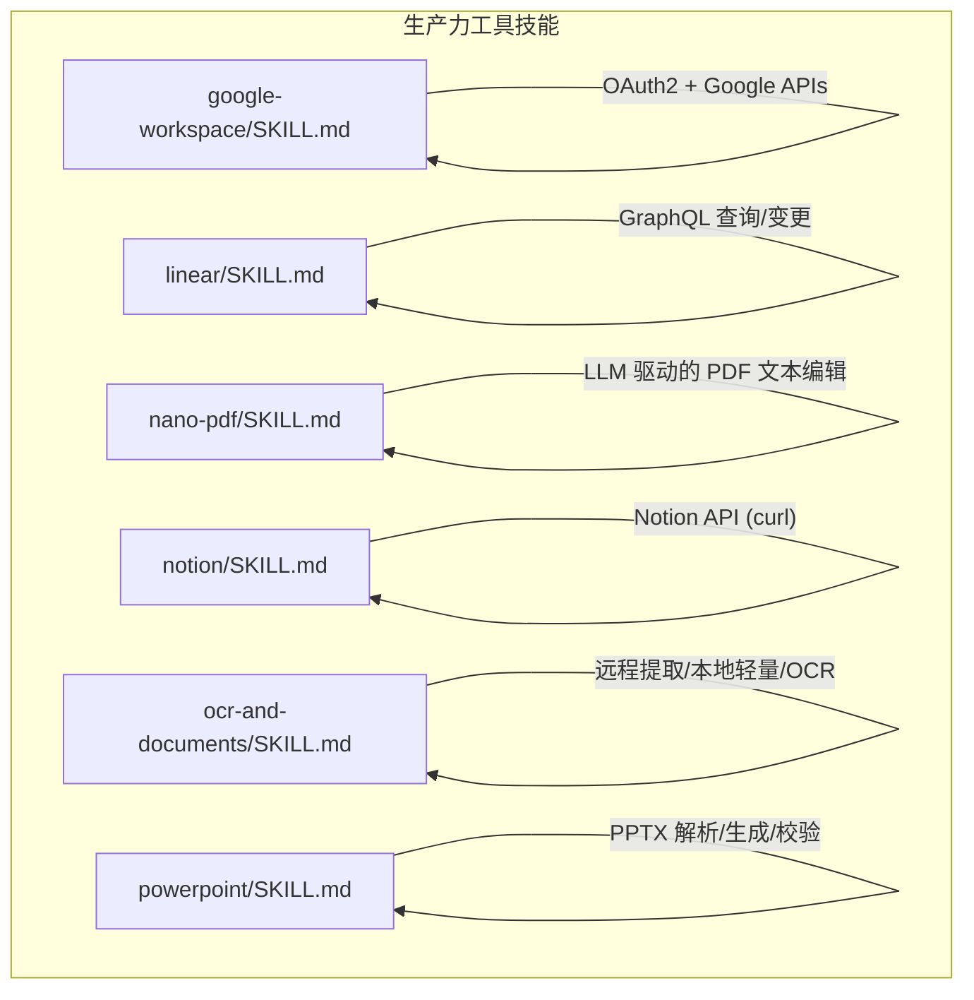
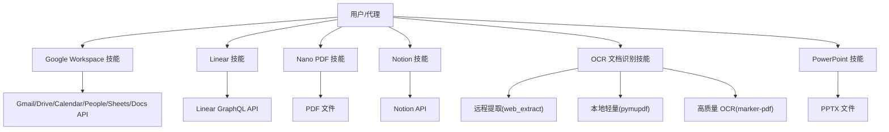
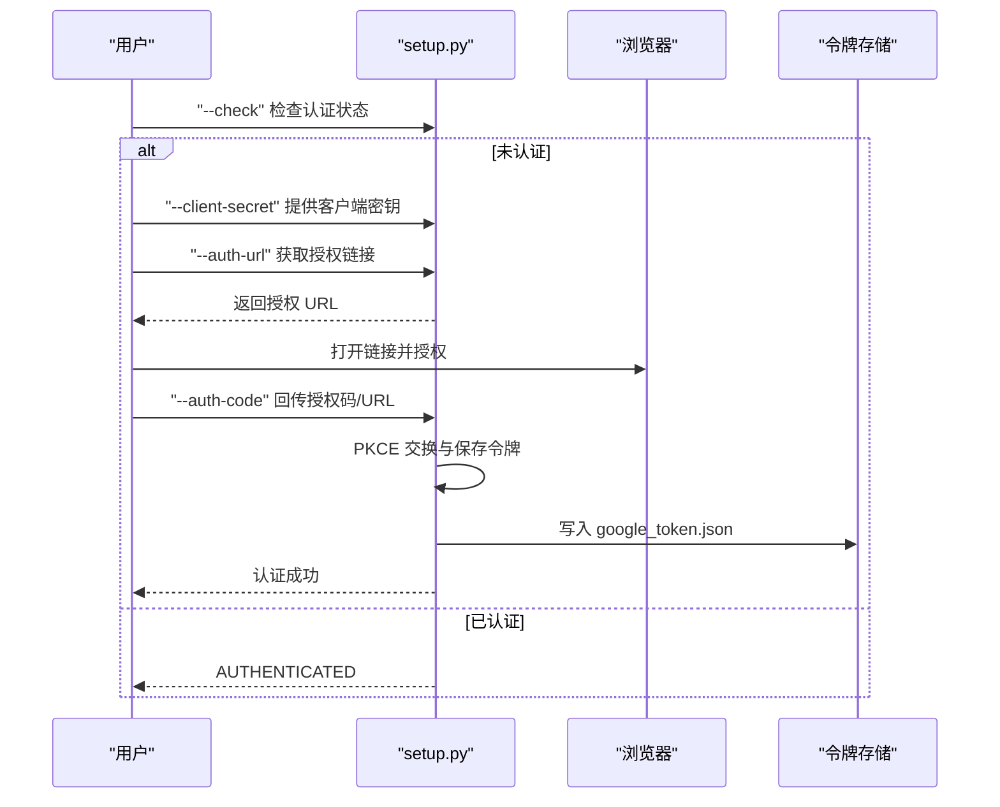
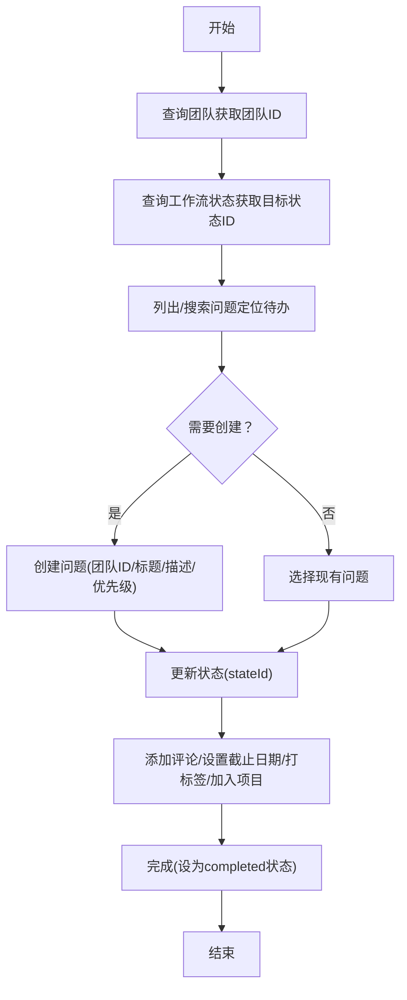
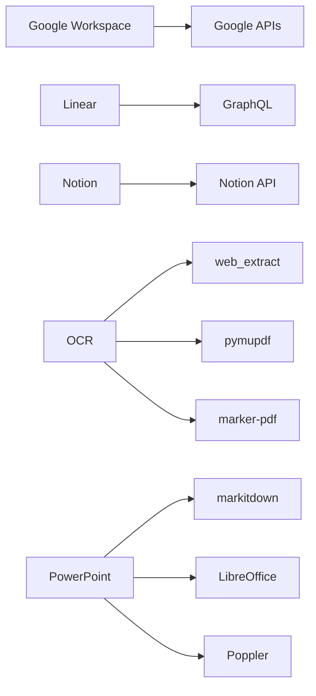

# 生产力工具技能

<cite>
**本文引用的文件**
- [google-workspace/SKILL.md](file://skills/productivity/google-workspace/SKILL.md)
- [linear/SKILL.md](file://skills/productivity/linear/SKILL.md)
- [nano-pdf/SKILL.md](file://skills/productivity/nano-pdf/SKILL.md)
- [notion/SKILL.md](file://skills/productivity/notion/SKILL.md)
- [ocr-and-documents/SKILL.md](file://skills/productivity/ocr-and-documents/SKILL.md)
- [powerpoint/SKILL.md](file://skills/productivity/powerpoint/SKILL.md)
</cite>

## 目录
1. [简介](#简介)
2. [项目结构](#项目结构)
3. [核心组件](#核心组件)
4. [架构总览](#架构总览)
5. [详细组件分析](#详细组件分析)
6. [依赖关系分析](#依赖关系分析)
7. [性能考虑](#性能考虑)
8. [故障排除指南](#故障排除指南)
9. [结论](#结论)
10. [附录](#附录)

## 简介
本文件系统性梳理并说明本仓库中与“生产力工具”相关的技能模块，覆盖以下能力：
- Google Workspace 集成：Gmail、Drive、Calendar、People、Sheets、Docs 的 OAuth 认证与 API 使用
- Linear 项目管理：基于 GraphQL 的问题、项目与团队管理，含看板状态与报告思路
- Nano PDF 文档编辑：基于自然语言指令对 PDF 页面进行文本修改
- Notion 笔记管理：通过 curl 调用 Notion API 创建/查询页面、数据库与块
- OCR 文档识别：远程提取、本地轻量提取（pymupdf）与高质量 OCR（marker-pdf）
- PowerPoint 幻灯片生成与编辑：从模板或从零创建、内容解析与可视化校验

文档以“可操作”的方式呈现各技能的集成配置、使用流程与最佳实践，并提供面向非技术用户的理解路径。

## 项目结构
生产力工具技能位于 skills/productivity 下，每个子技能以独立的 SKILL.md 文档描述其用途、前置条件、安装与使用步骤、示例与注意事项。

图表来源
- [google-workspace/SKILL.md:1-262](file://skills/productivity/google-workspace/SKILL.md#L1-L262)
- [linear/SKILL.md:1-298](file://skills/productivity/linear/SKILL.md#L1-L298)
- [nano-pdf/SKILL.md:1-52](file://skills/productivity/nano-pdf/SKILL.md#L1-L52)
- [notion/SKILL.md:1-172](file://skills/productivity/notion/SKILL.md#L1-L172)
- [ocr-and-documents/SKILL.md:1-172](file://skills/productivity/ocr-and-documents/SKILL.md#L1-L172)
- [powerpoint/SKILL.md:1-233](file://skills/productivity/powerpoint/SKILL.md#L1-L233)

章节来源
- [google-workspace/SKILL.md:1-262](file://skills/productivity/google-workspace/SKILL.md#L1-L262)
- [linear/SKILL.md:1-298](file://skills/productivity/linear/SKILL.md#L1-L298)
- [nano-pdf/SKILL.md:1-52](file://skills/productivity/nano-pdf/SKILL.md#L1-L52)
- [notion/SKILL.md:1-172](file://skills/productivity/notion/SKILL.md#L1-L172)
- [ocr-and-documents/SKILL.md:1-172](file://skills/productivity/ocr-and-documents/SKILL.md#L1-L172)
- [powerpoint/SKILL.md:1-233](file://skills/productivity/powerpoint/SKILL.md#L1-L233)

## 核心组件
- Google Workspace 技能：提供 OAuth2 设置脚本与统一 API 包装脚本，支持 Gmail 搜索/读取/发送/回复、日历事件增删改查、Drive 文件检索、联系人列表、Sheets 读写与追加、Docs 获取等；输出统一为 JSON，便于在自动化流程中消费。
- Linear 技能：通过 GraphQL API 进行问题、项目、团队与标签的查询与变更，支持分页与复杂过滤；强调状态类型与优先级语义，适合构建看板视图与报告。
- Nano PDF 技能：基于命令行工具对 PDF 页面进行自然语言驱动的文本编辑，适合快速修正标题、日期与简单内容错误。
- Notion 技能：通过 curl 直连 Notion API，实现搜索、创建页面、查询数据库、更新属性与添加块内容；强调版本头与数据源（data source）概念。
- OCR 文档识别技能：提供远程提取（web_extract）、本地轻量提取（pymupdf）与高质量 OCR（marker-pdf）三种路径，覆盖文本型 PDF、扫描件、表格、公式、代码块、表单、图片提取与 Markdown 输出。
- PowerPoint 技能：提供 PPTX 内容解析（markitdown）、缩略图生成、从模板编辑、从零创建（pptxgenjs）以及视觉校验（LibreOffice + Poppler 转图片）的完整工作流。

章节来源
- [google-workspace/SKILL.md:1-262](file://skills/productivity/google-workspace/SKILL.md#L1-L262)
- [linear/SKILL.md:1-298](file://skills/productivity/linear/SKILL.md#L1-L298)
- [nano-pdf/SKILL.md:1-52](file://skills/productivity/nano-pdf/SKILL.md#L1-L52)
- [notion/SKILL.md:1-172](file://skills/productivity/notion/SKILL.md#L1-L172)
- [ocr-and-documents/SKILL.md:1-172](file://skills/productivity/ocr-and-documents/SKILL.md#L1-L172)
- [powerpoint/SKILL.md:1-233](file://skills/productivity/powerpoint/SKILL.md#L1-L233)

## 架构总览
下图展示各技能在“生产力工具”体系中的角色与交互关系：它们均通过终端工具（如 curl、脚本、命令行工具）与外部服务对接，形成“低耦合、可替换”的能力组合。

图表来源
- [google-workspace/SKILL.md:1-262](file://skills/productivity/google-workspace/SKILL.md#L1-L262)
- [linear/SKILL.md:1-298](file://skills/productivity/linear/SKILL.md#L1-L298)
- [nano-pdf/SKILL.md:1-52](file://skills/productivity/nano-pdf/SKILL.md#L1-L52)
- [notion/SKILL.md:1-172](file://skills/productivity/notion/SKILL.md#L1-L172)
- [ocr-and-documents/SKILL.md:1-172](file://skills/productivity/ocr-and-documents/SKILL.md#L1-L172)
- [powerpoint/SKILL.md:1-233](file://skills/productivity/powerpoint/SKILL.md#L1-L233)

## 详细组件分析

### Google Workspace 集成
- OAuth 认证与权限
  - 通过一次性设置脚本完成客户端凭据创建、授权码交换与令牌持久化；支持自动刷新与撤销。
  - 建议按需启用所需 API（Gmail、Calendar、Drive、Sheets、Docs、People），避免过度授权。
- API 使用要点
  - 统一通过 API 包装脚本执行操作，返回 JSON，便于后续处理。
  - Gmail 支持搜索语法参考；日历时间必须包含时区信息；Sheets 支持读取、更新与追加。
- 安全与合规
  - 高级保护账户需组织管理员白名单 OAuth 客户端 ID。
  - 首次授权后拒绝更窄范围的重新授权覆盖已授权令牌，防止后续邮件操作失败。

图表来源
- [google-workspace/SKILL.md:32-137](file://skills/productivity/google-workspace/SKILL.md#L32-L137)

章节来源
- [google-workspace/SKILL.md:1-262](file://skills/productivity/google-workspace/SKILL.md#L1-L262)

### Linear 项目管理
- 认证与基础
  - 使用个人 API 密钥（无 Bearer 前缀），通过 POST 请求调用 GraphQL 端点。
- 工作流状态与优先级
  - 状态类型包括 triage/backlog/unstarted/started/completed/canceled；优先级值 0-4。
- 常用操作
  - 查询当前用户、团队、工作流状态、问题列表、项目、成员与标签。
  - 变更：创建问题、更新状态（需目标状态 UUID）、指派、设置优先级、添加评论、设置截止日期、打标签、加入项目。
- 分页与复杂度
  - 使用 Relay 风格游标分页；注意复杂度限制与请求配额，合理使用 first 与过滤器。

图表来源
- [linear/SKILL.md:274-283](file://skills/productivity/linear/SKILL.md#L274-L283)

章节来源
- [linear/SKILL.md:1-298](file://skills/productivity/linear/SKILL.md#L1-L298)

### Nano PDF 处理
- 前置条件
  - 安装 nano-pdf；根据帮助信息配置 LLM API 密钥。
- 使用方式
  - 通过命令行对指定页面进行自然语言编辑；注意页码可能因版本差异采用 0/1 基索引，必要时±1 重试。
- 注意事项
  - 编辑后务必验证输出 PDF；适用于文本类修改；复杂布局建议其他方案。

章节来源
- [nano-pdf/SKILL.md:1-52](file://skills/productivity/nano-pdf/SKILL.md#L1-L52)

### Notion 笔记管理
- 前置条件
  - 在 Notion 中创建集成并获取 API Key；在 Notion 中将目标页面/数据库分享给该集成。
- API 基础
  - 使用 Authorization: Bearer + Notion-Version: 2025-09-03 的请求模式。
- 常见操作
  - 搜索、获取页面、获取页面内容（块）、在数据库中创建页面、查询数据库、创建数据库、更新页面属性、向页面添加内容块。
- 版本差异
  - 数据库在该版本称为“数据源”，存在 database_id 与 data_source_id 两套 ID；创建页面使用前者，查询使用后者。

章节来源
- [notion/SKILL.md:1-172](file://skills/productivity/notion/SKILL.md#L1-L172)

### OCR 文档识别与处理
- 远程优先策略
  - 若文档可访问 URL，优先使用 web_extract；否则进入本地提取。
- 本地提取策略
  - 轻量方案：pymupdf，适合文本型 PDF，支持表格、Markdown 输出、拆分合并、搜索、元数据与图片抽取。
  - 高质量 OCR：marker-pdf，适合扫描件、多语言、表格/公式/代码/表单/页眉页脚去除、阅读顺序检测与更高精度的 Markdown 输出；首次安装会下载约 2.5GB 模型缓存。
- ArXiv 场景
  - 可直接抓取摘要或全文；也可结合搜索工具进行检索。
- 其他格式
  - DOCX 使用 python-docx（结构解析优于 OCR）；PPTX 使用 powerpoint 技能。

章节来源
- [ocr-and-documents/SKILL.md:1-172](file://skills/productivity/ocr-and-documents/SKILL.md#L1-L172)

### PowerPoint 演示制作
- 快速参考
  - 内容解析：markitdown；缩略图：thumbnail；从模板编辑与从零创建详见文档。
- 设计与排版
  - 强调主题色彩、主次色搭配、明暗对比、视觉动机与版式；避免纯文字幻灯片与常见设计误区。
- 质量保证
  - 建议采用“渲染为图片 + 视觉校验”的验证循环，使用子代理进行新鲜视角检查；修复后重复验证直至无新增问题。
- 依赖
  - markitdown[pptx]、Pillow、pptxgenjs、LibreOffice（soffice）、Poppler（pdftoppm）。

章节来源
- [powerpoint/SKILL.md:1-233](file://skills/productivity/powerpoint/SKILL.md#L1-L233)

## 依赖关系分析
- 技能内聚性
  - 各技能均以最小依赖实现目标功能：Google Workspace 依赖 Python 客户端库；Linear/Notion 依赖 curl；OCR 依赖第三方库；PowerPoint 依赖 Python 与外部工具链。
- 外部服务耦合
  - Google Workspace/Linear/Notion/OCR/PPTX 均为外部服务接口；通过统一的命令行/脚本封装降低耦合度。
- 性能与资源
  - OCR（marker）首次安装模型体积较大，需评估磁盘空间；pymupdf 更轻量但功能有限；PowerPoint 渲染依赖外部工具链。

图表来源
- [google-workspace/SKILL.md:1-262](file://skills/productivity/google-workspace/SKILL.md#L1-L262)
- [linear/SKILL.md:1-298](file://skills/productivity/linear/SKILL.md#L1-L298)
- [notion/SKILL.md:1-172](file://skills/productivity/notion/SKILL.md#L1-L172)
- [ocr-and-documents/SKILL.md:1-172](file://skills/productivity/ocr-and-documents/SKILL.md#L1-L172)
- [powerpoint/SKILL.md:1-233](file://skills/productivity/powerpoint/SKILL.md#L1-L233)

章节来源
- [google-workspace/SKILL.md:1-262](file://skills/productivity/google-workspace/SKILL.md#L1-L262)
- [linear/SKILL.md:1-298](file://skills/productivity/linear/SKILL.md#L1-L298)
- [notion/SKILL.md:1-172](file://skills/productivity/notion/SKILL.md#L1-L172)
- [ocr-and-documents/SKILL.md:1-172](file://skills/productivity/ocr-and-documents/SKILL.md#L1-L172)
- [powerpoint/SKILL.md:1-233](file://skills/productivity/powerpoint/SKILL.md#L1-L233)

## 性能考虑
- API 调用节流
  - Linear：每小时请求配额与复杂度限制，应使用 first 与过滤器控制成本。
  - Notion：平均约 3 次/秒的速率限制，批量操作时注意间隔。
- 本地处理优化
  - OCR（marker）首次运行会下载模型，建议提前准备网络与磁盘空间；pymupdf 无需模型，适合快速与稳定场景。
- 渲染与校验
  - PowerPoint 图片转存与子代理视觉校验可显著提升质量，但会增加计算与人工成本，建议在关键交付前执行。

## 故障排除指南
- Google Workspace
  - 未认证：重新执行 OAuth 设置流程；检查 API 是否启用、令牌是否被撤销。
  - 刷新失败：撤销后重新授权；确认客户端凭据与作用域匹配。
  - 权限不足：缺少 API scope 或 API 未启用。
- Linear
  - 状态变更失败：确认目标状态 UUID 正确；检查工作流状态类型映射。
  - 请求超限：减少并发与复杂度，使用分页与过滤。
- Notion
  - 无法访问页面/数据库：确认集成已分享对应对象；核对 ID 类型（database_id vs data_source_id）。
- OCR
  - marker 模型下载失败：检查磁盘空间与网络；可先使用 web_extract 或 pymupdf。
  - 输出质量不佳：尝试 LLM 增强或调整参数。
- PowerPoint
  - 渲染异常：检查 LibreOffice 与 Poppler 是否可用；确保 pdftoppm 参数正确。

章节来源
- [google-workspace/SKILL.md:246-262](file://skills/productivity/google-workspace/SKILL.md#L246-L262)
- [linear/SKILL.md:284-298](file://skills/productivity/linear/SKILL.md#L284-L298)
- [notion/SKILL.md:164-172](file://skills/productivity/notion/SKILL.md#L164-L172)
- [ocr-and-documents/SKILL.md:163-172](file://skills/productivity/ocr-and-documents/SKILL.md#L163-L172)
- [powerpoint/SKILL.md:141-233](file://skills/productivity/powerpoint/SKILL.md#L141-L233)

## 结论
本仓库的生产力工具技能以“最小依赖、可组合、可扩展”为核心设计原则，覆盖从办公协作（Google Workspace、Linear、Notion）、文档处理（PDF/OCR/DOCX/PPTX）到演示制作的完整链路。通过统一的命令行与脚本封装，既满足非技术用户的上手需求，也为高级用户提供灵活的定制空间。建议在实际部署中结合业务场景选择合适的提取与渲染路径，并建立完善的认证、权限与质量保障流程。

## 附录
- 最佳实践清单
  - OAuth/密钥管理：最小权限原则；定期轮换；严格存储。
  - API 调用：批量读取、分页与过滤；监控配额与复杂度。
  - 文档处理：优先远程提取；本地轻量方案优先；OCR 仅在必要时启用。
  - 幻灯片质量：设计先行；渲染为图片 + 子代理校验；修复闭环验证。
- 常用命令索引
  - Google Workspace：setup.py 与 google_api.py 的常用子命令与参数。
  - Linear：GraphQL 查询/变更示例与分页模式。
  - Notion：搜索、创建、查询、更新与块操作的 curl 模板。
  - OCR：web_extract、pymupdf 与 marker 的使用场景与参数。
  - PowerPoint：markitdown、thumbnail、soffice 与 pdftoppm 的组合用法。