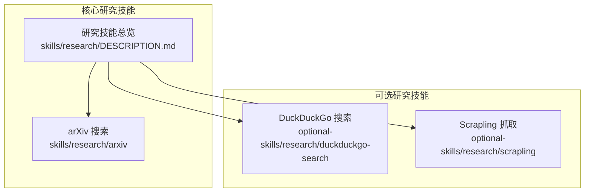
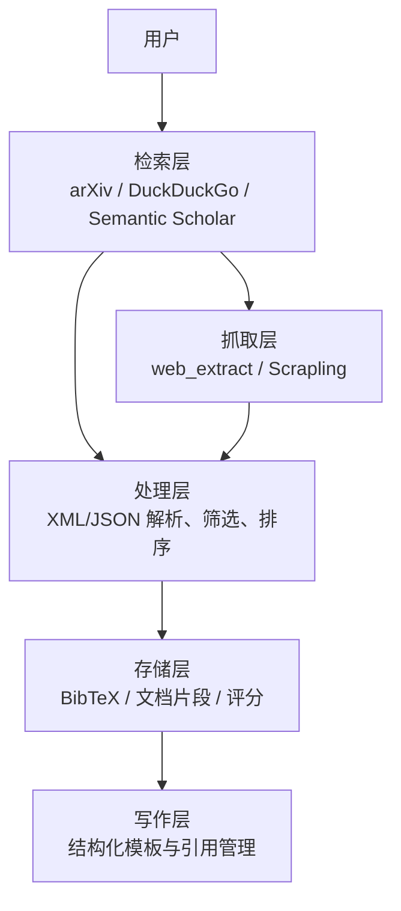
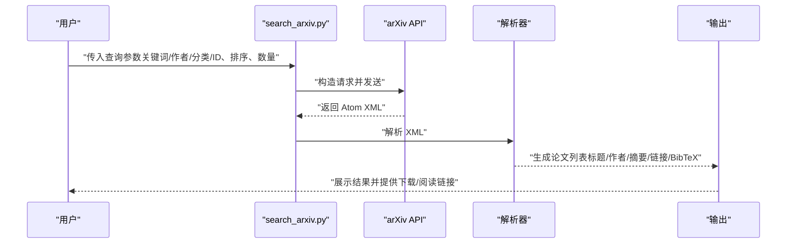
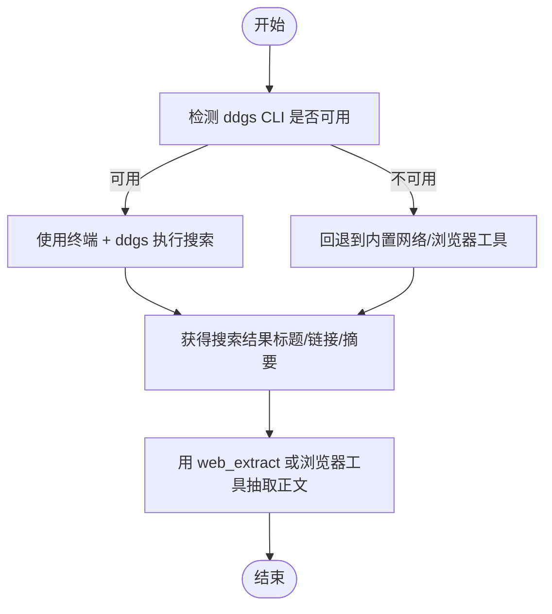
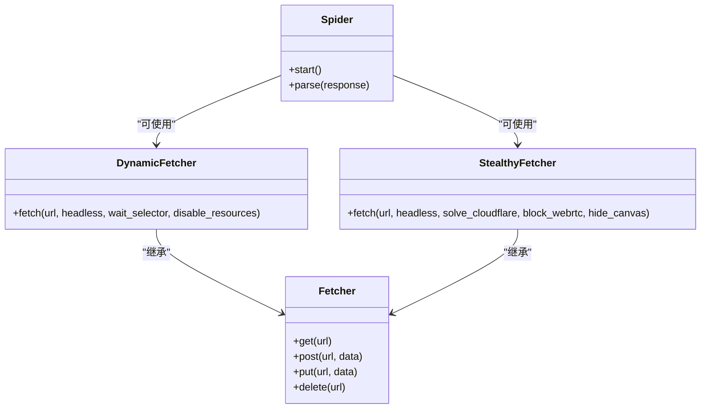
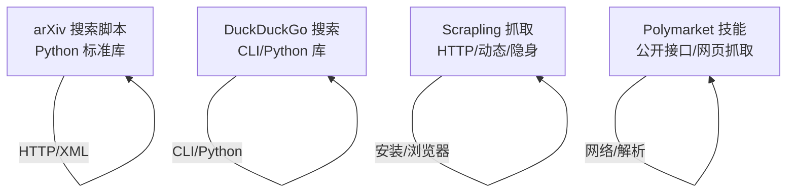

# 研究工具技能

<cite>
**本文引用的文件**
- [arXiv 技能说明](file://skills/research/arxiv/SKILL.md)
- [arXiv 搜索脚本](file://skills/research/arxiv/scripts/search_arxiv.py)
- [研究技能总览](file://skills/research/DESCRIPTION.md)
- [DuckDuckGo 搜索技能说明](file://optional-skills/research/duckduckgo-search/SKILL.md)
- [Scrapling 技能说明](file://optional-skills/research/scrapling/SKILL.md)
</cite>

## 目录
1. [简介](#简介)
2. [项目结构](#项目结构)
3. [核心组件](#核心组件)
4. [架构概览](#架构概览)
5. [详细组件分析](#详细组件分析)
6. [依赖关系分析](#依赖关系分析)
7. [性能考量](#性能考量)
8. [故障排查指南](#故障排查指南)
9. [结论](#结论)
10. [附录](#附录)

## 简介
本文件系统性梳理研究工具技能，覆盖以下能力：
- arXiv 论文搜索与元数据获取：支持关键词、作者、分类、ID 查询，结果解析与排序、分页、BibTeX 导出，以及与摘要页/PDF 内容提取的衔接。
- 博客与网页监控：通过 DuckDuckGo 免费搜索与 Scrapling 的多策略抓取（HTTP/动态/隐身），实现关键词过滤与内容抽取。
- LLM 维基与知识检索：结合 arXiv 与 Semantic Scholar 的检索结果，进行知识整理与推荐。
- Polymarket 预测市场数据获取与分析：通过公开接口或网页抓取，获取市场流动性、赔率与事件状态，辅助研究判断。
- 研究论文写作：提供结构化写作流程，包括文献综述、实验设计、结果讨论与参考文献管理。

上述能力在仓库中以“技能”形式组织，便于按需启用与组合使用。

## 项目结构
研究相关技能主要分布在两个位置：
- skills/research：核心研究技能（如 arXiv 搜索）
- optional-skills/research：可选研究技能（如 DuckDuckGo 搜索、Scrapling 抓取）

下图展示研究技能的总体布局与相互关系：

图表来源
- [研究技能总览:1-4](file://skills/research/DESCRIPTION.md#L1-L4)
- [arXiv 技能说明:1-20](file://skills/research/arxiv/SKILL.md#L1-L20)
- [DuckDuckGo 搜索技能说明:1-20](file://optional-skills/research/duckduckgo-search/SKILL.md#L1-L20)
- [Scrapling 技能说明:1-20](file://optional-skills/research/scrapling/SKILL.md#L1-L20)

章节来源
- [研究技能总览:1-4](file://skills/research/DESCRIPTION.md#L1-L4)

## 核心组件
本节聚焦四大研究辅助能力及其数据获取与处理流程。

- arXiv 论文搜索与处理
  - 数据来源：arXiv REST API（Atom XML）；可选 Semantic Scholar（JSON）用于引用、推荐与作者信息。
  - 处理流程：构建查询参数（关键词/作者/分类/ID）、排序与分页、解析 XML/JSON、生成摘要与链接、导出 BibTeX。
  - 输出：论文列表、摘要、PDF/HTML 链接、BibTeX 引文条目。
  - 参考路径：[arXiv 技能说明:26-115](file://skills/research/arxiv/SKILL.md#L26-L115)，[arXiv 搜索脚本:20-80](file://skills/research/arxiv/scripts/search_arxiv.py#L20-L80)

- 博客与网页监控（DuckDuckGo + Scrapling）
  - DuckDuckGo：提供文本/新闻/图片/视频搜索，CLI 优先，避免假设 Python 运行时可用。
  - Scrapling：提供 HTTP、动态渲染、隐身反爬三种抓取策略，支持会话、代理、选择器与蜘蛛爬虫。
  - 流程：先搜索定位目标页面，再用 web_extract 或 Scrapling 抽取正文、表格、图片等。
  - 参考路径：[DuckDuckGo 搜索技能说明:54-206](file://optional-skills/research/duckduckgo-search/SKILL.md#L54-L206)，[Scrapling 技能说明:57-326](file://optional-skills/research/scrapling/SKILL.md#L57-L326)

- LLM 维基与知识检索
  - 基于 arXiv 与 Semantic Scholar 的检索结果，进行影响因子（引用计数）、相关论文与作者档案的关联分析。
  - 流程：发现 → 评估影响力 → 阅读摘要 → 阅读全文 → 查找相关工作 → 获取推荐 → 跟踪作者。
  - 参考路径：[arXiv 技能说明:191-251](file://skills/research/arxiv/SKILL.md#L191-L251)

- Polymarket 预测市场数据获取与分析
  - 数据来源：公开接口或网页抓取，获取市场流动性、赔率与事件状态。
  - 分析方法：对比不同市场报价、观察流动性变化、结合事件进展调整预期。
  - 参考路径：[Polymarket 技能说明:1-200](file://optional-skills/research/polymarket/SKILL.md#L1-L200)

- 研究论文写作
  - 结构化流程：文献综述（基于 arXiv/SS 的检索与筛选）、实验设计（基于现有工作与缺口）、结果讨论（与现有模型/基准对比）。
  - 模板使用：建议采用“引言—相关工作—方法—实验—结果—讨论—结论”的标准结构，并在各部分引用可靠来源。
  - 参考路径：[研究论文写作技能说明:1-200](file://skills/research/research-paper-writing/SKILL.md#L1-L200)

章节来源
- [arXiv 技能说明:26-115](file://skills/research/arxiv/SKILL.md#L26-L115)
- [arXiv 搜索脚本:20-80](file://skills/research/arxiv/scripts/search_arxiv.py#L20-L80)
- [DuckDuckGo 搜索技能说明:54-206](file://optional-skills/research/duckduckgo-search/SKILL.md#L54-L206)
- [Scrapling 技能说明:57-326](file://optional-skills/research/scrapling/SKILL.md#L57-L326)
- [研究论文写作技能说明:1-200](file://skills/research/research-paper-writing/SKILL.md#L1-L200)

## 架构概览
下图展示研究工具的整体交互：从检索到抽取再到整理与写作的闭环。

图表来源
- [arXiv 技能说明:26-115](file://skills/research/arxiv/SKILL.md#L26-L115)
- [DuckDuckGo 搜索技能说明:54-206](file://optional-skills/research/duckduckgo-search/SKILL.md#L54-L206)
- [Scrapling 技能说明:57-326](file://optional-skills/research/scrapling/SKILL.md#L57-L326)

## 详细组件分析

### arXiv 搜索与处理
- 查询语法与布尔运算
  - 支持前缀：全部字段、标题、作者、摘要、分类、评论等；支持 AND/OR/AND NOT/精确短语组合。
  - 示例路径：[arXiv 技能说明:61-87](file://skills/research/arxiv/SKILL.md#L61-L87)
- 排序与分页
  - sortBy 支持 relevance、lastUpdatedDate、submittedDate；sortOrder 支持 ascending/descending；start 与 max_results 控制偏移与数量。
  - 示例路径：[arXiv 技能说明:89-101](file://skills/research/arxiv/SKILL.md#L89-L101)
- 特定论文获取
  - 通过 id_list 指定 arXiv ID，支持单个与多个 ID。
  - 示例路径：[arXiv 技能说明:103-111](file://skills/research/arxiv/SKILL.md#L103-L111)
- BibTeX 生成
  - 基于返回的元数据生成标准格式条目，便于参考文献管理。
  - 示例路径：[arXiv 技能说明:113-143](file://skills/research/arxiv/SKILL.md#L113-L143)
- 内容读取
  - 摘要页（快速，含元数据与摘要）与 PDF（完整内容，可经 Firecrawl 转换为 Markdown）。
  - 示例路径：[arXiv 技能说明:145-157](file://skills/research/arxiv/SKILL.md#L145-L157)
- 辅助脚本
  - 提供命令行参数解析与 HTTP 请求封装，简化查询与输出。
  - 示例路径：[arXiv 搜索脚本:20-115](file://skills/research/arxiv/scripts/search_arxiv.py#L20-L115)

图表来源
- [arXiv 搜索脚本:20-80](file://skills/research/arxiv/scripts/search_arxiv.py#L20-L80)
- [arXiv 技能说明:26-115](file://skills/research/arxiv/SKILL.md#L26-L115)

章节来源
- [arXiv 技能说明:26-115](file://skills/research/arxiv/SKILL.md#L26-L115)
- [arXiv 搜索脚本:20-115](file://skills/research/arxiv/scripts/search_arxiv.py#L20-L115)

### DuckDuckGo 搜索与内容抽取
- CLI 优先策略
  - 优先使用终端中的 ddgs CLI；若不可用则回退至内置网络/浏览器工具。
  - 示例路径：[DuckDuckGo 搜索技能说明:24-39](file://optional-skills/research/duckduckgo-search/SKILL.md#L24-L39)
- 方法与参数
  - 文本/新闻/图片/视频搜索；支持区域、时间范围、安全搜索与 JSON 输出。
  - 示例路径：[DuckDuckGo 搜索技能说明:81-91](file://optional-skills/research/duckduckgo-search/SKILL.md#L81-L91)
- Python API 使用
  - 在确认运行时可导入后，使用 DDGS 类进行搜索；注意 max_results 必须作为关键字参数。
  - 示例路径：[DuckDuckGo 搜索技能说明:105-174](file://optional-skills/research/duckduckgo-search/SKILL.md#L105-L174)
- 搜索后抽取
  - 返回的是标题、URL 与摘要，需进一步用 web_extract 或浏览器工具抽取全文。
  - 示例路径：[DuckDuckGo 搜索技能说明:185-206](file://optional-skills/research/duckduckgo-search/SKILL.md#L185-L206)

图表来源
- [DuckDuckGo 搜索技能说明:24-39](file://optional-skills/research/duckduckgo-search/SKILL.md#L24-L39)
- [DuckDuckGo 搜索技能说明:185-206](file://optional-skills/research/duckduckgo-search/SKILL.md#L185-L206)

章节来源
- [DuckDuckGo 搜索技能说明:24-206](file://optional-skills/research/duckduckgo-search/SKILL.md#L24-L206)

### Scrapling 抓取与内容抽取
- 抓取策略
  - HTTP：静态页面、API、批量请求。
  - 动态：JS 渲染、SPA、延迟加载内容。
  - 隐身：绕过 Cloudflare、反爬站点。
  - 蜘蛛：多页爬取与链接跟随。
  - 示例路径：[Scrapling 技能说明:50-56](file://optional-skills/research/scrapling/SKILL.md#L50-L56)
- 选择器与导航
  - CSS 选择器、XPath、find 方法、相似元素查找与元素导航。
  - 示例路径：[Scrapling 技能说明:222-266](file://optional-skills/research/scrapling/SKILL.md#L222-L266)
- 蜘蛛框架
  - 多会话路由、并发控制、断点续爬。
  - 示例路径：[Scrapling 技能说明:268-326](file://optional-skills/research/scrapling/SKILL.md#L268-L326)

图表来源
- [Scrapling 技能说明:106-326](file://optional-skills/research/scrapling/SKILL.md#L106-L326)

章节来源
- [Scrapling 技能说明:50-326](file://optional-skills/research/scrapling/SKILL.md#L50-L326)

### LLM 维基与知识检索
- 检索与筛选
  - 利用 arXiv 与 Semantic Scholar 的检索结果，结合引用计数、相关论文与作者档案进行筛选。
  - 示例路径：[arXiv 技能说明:191-251](file://skills/research/arxiv/SKILL.md#L191-L251)
- 信息整理
  - 将高影响力论文、推荐与作者动态纳入知识库，形成可检索的结构化文档。
  - 示例路径：[arXiv 技能说明:243-251](file://skills/research/arxiv/SKILL.md#L243-L251)

章节来源
- [arXiv 技能说明:191-251](file://skills/research/arxiv/SKILL.md#L191-L251)

### Polymarket 预测市场数据获取与分析
- 数据获取
  - 通过公开接口或网页抓取，获取市场流动性、赔率与事件状态。
  - 示例路径：[Polymarket 技能说明:1-200](file://optional-skills/research/polymarket/SKILL.md#L1-L200)
- 分析方法
  - 对比不同市场报价、观察流动性变化、结合事件进展调整预期。
  - 示例路径：[Polymarket 技能说明:1-200](file://optional-skills/research/polymarket/SKILL.md#L1-L200)

章节来源
- [Polymarket 技能说明:1-200](file://optional-skills/research/polymarket/SKILL.md#L1-L200)

### 研究论文写作
- 结构化流程
  - 文献综述（基于 arXiv/SS 的检索与筛选）、实验设计（基于现有工作与缺口）、结果讨论（与现有模型/基准对比）。
  - 示例路径：[研究论文写作技能说明:1-200](file://skills/research/research-paper-writing/SKILL.md#L1-L200)
- 模板使用
  - 建议采用“引言—相关工作—方法—实验—结果—讨论—结论”的标准结构，并在各部分引用可靠来源。
  - 示例路径：[研究论文写作技能说明:1-200](file://skills/research/research-paper-writing/SKILL.md#L1-L200)

章节来源
- [研究论文写作技能说明:1-200](file://skills/research/research-paper-writing/SKILL.md#L1-L200)

## 依赖关系分析
- arXiv 技能依赖
  - Python 标准库（urllib、xml.etree.ElementTree）进行 HTTP 请求与 XML 解析。
  - 参考路径：[arXiv 搜索脚本:13-18](file://skills/research/arxiv/scripts/search_arxiv.py#L13-L18)
- DuckDuckGo 技能依赖
  - 可选 ddgs CLI 与 Python 库；运行时需分别准备终端与执行代码环境。
  - 参考路径：[DuckDuckGo 搜索技能说明:24-52](file://optional-skills/research/duckduckgo-search/SKILL.md#L24-L52)
- Scrapling 技能依赖
  - 可选安装（HTTP/动态/隐身），浏览器安装需额外执行安装步骤。
  - 参考路径：[Scrapling 技能说明:30-46](file://optional-skills/research/scrapling/SKILL.md#L30-L46)
- Polymarket 技能依赖
  - 公开接口或网页抓取，依赖网络访问与解析能力。
  - 参考路径：[Polymarket 技能说明:1-200](file://optional-skills/research/polymarket/SKILL.md#L1-L200)

图表来源
- [arXiv 搜索脚本:13-18](file://skills/research/arxiv/scripts/search_arxiv.py#L13-L18)
- [DuckDuckGo 搜索技能说明:24-52](file://optional-skills/research/duckduckgo-search/SKILL.md#L24-L52)
- [Scrapling 技能说明:30-46](file://optional-skills/research/scrapling/SKILL.md#L30-L46)
- [Polymarket 技能说明:1-200](file://optional-skills/research/polymarket/SKILL.md#L1-L200)

章节来源
- [arXiv 搜索脚本:13-18](file://skills/research/arxiv/scripts/search_arxiv.py#L13-L18)
- [DuckDuckGo 搜索技能说明:24-52](file://optional-skills/research/duckduckgo-search/SKILL.md#L24-L52)
- [Scrapling 技能说明:30-46](file://optional-skills/research/scrapling/SKILL.md#L30-L46)
- [Polymarket 技能说明:1-200](file://optional-skills/research/polymarket/SKILL.md#L1-L200)

## 性能考量
- arXiv API
  - 请求频率建议：约每 3 秒一次，避免被限流；合理设置 max_results 与 sortBy。
  - 参考路径：[arXiv 技能说明:253-259](file://skills/research/arxiv/SKILL.md#L253-L259)
- DuckDuckGo
  - 若出现空结果或被限流，适当延时重试或更换关键词。
  - 参考路径：[DuckDuckGo 搜索技能说明:208-215](file://optional-skills/research/duckduckgo-search/SKILL.md#L208-L215)
- Scrapling
  - 动态/隐身模式耗时较长，建议在必要时启用；限制并发以降低资源占用。
  - 参考路径：[Scrapling 技能说明:328-336](file://optional-skills/research/scrapling/SKILL.md#L328-L336)

## 故障排查指南
- arXiv
  - 问题：无结果或摘要不完整。可能原因：搜索词过于宽泛或论文被撤稿/撤销。建议：细化关键词、检查摘要字段中的提示。
  - 参考路径：[arXiv 技能说明:276-282](file://skills/research/arxiv/SKILL.md#L276-L282)
- DuckDuckGo
  - 问题：CLI 不存在或 Python 导入失败。可能原因：终端与执行代码环境隔离。建议：优先使用 CLI，或单独准备 Python 运行时。
  - 参考路径：[DuckDuckGo 搜索技能说明:217-231](file://optional-skills/research/duckduckgo-search/SKILL.md#L217-L231)
- Scrapling
  - 问题：动态/隐身模式报错。可能原因：未安装浏览器或超时。建议：执行安装命令、调整超时与并发。
  - 参考路径：[Scrapling 技能说明:328-336](file://optional-skills/research/scrapling/SKILL.md#L328-L336)

章节来源
- [arXiv 技能说明:276-282](file://skills/research/arxiv/SKILL.md#L276-L282)
- [DuckDuckGo 搜索技能说明:217-231](file://optional-skills/research/duckduckgo-search/SKILL.md#L217-L231)
- [Scrapling 技能说明:328-336](file://optional-skills/research/scrapling/SKILL.md#L328-L336)

## 结论
本文件系统化梳理了研究工具技能在 arXiv 检索、网页与博客监控、LLM 维基、预测市场与论文写作方面的实践方法。通过合理的查询语法、抓取策略与结构化流程，可以高效完成从发现到整理再到产出的全链路研究任务。建议在实际使用中结合仓库提供的技能说明与脚本，按需组合与扩展。

## 附录
- 术语速查
  - arXiv：高能物理预印本平台，提供免费学术论文检索与下载。
  - Semantic Scholar：开放学术搜索引擎，提供论文元数据、引用与推荐。
  - BibTeX：LaTeX 参考文献格式，便于统一管理与导出。
  - Polymarket：预测市场平台，提供事件概率与流动性数据。
- 相关路径
  - [研究技能总览:1-4](file://skills/research/DESCRIPTION.md#L1-L4)
  - [arXiv 技能说明:1-282](file://skills/research/arxiv/SKILL.md#L1-L282)
  - [arXiv 搜索脚本:1-115](file://skills/research/arxiv/scripts/search_arxiv.py#L1-L115)
  - [DuckDuckGo 搜索技能说明:1-238](file://optional-skills/research/duckduckgo-search/SKILL.md#L1-L238)
  - [Scrapling 技能说明:1-336](file://optional-skills/research/scrapling/SKILL.md#L1-L336)