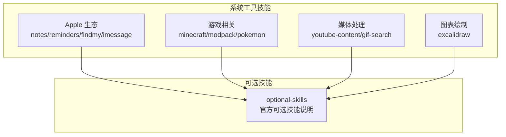
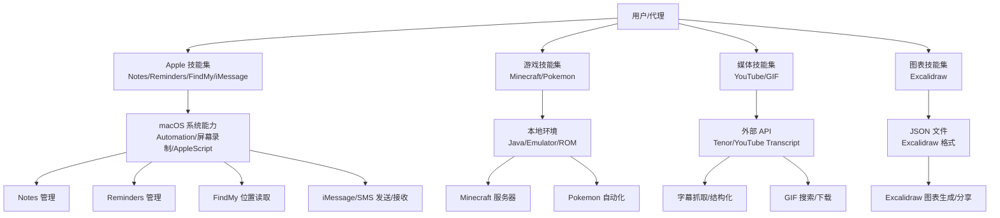
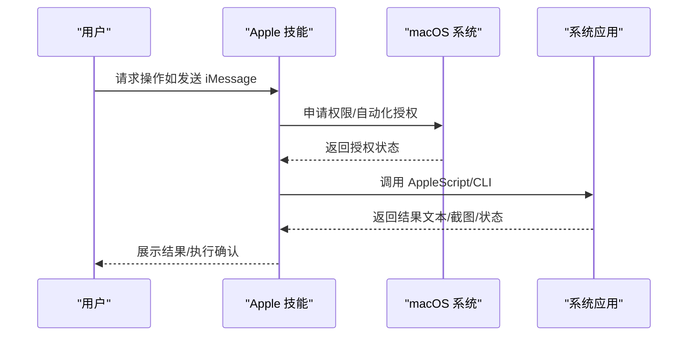
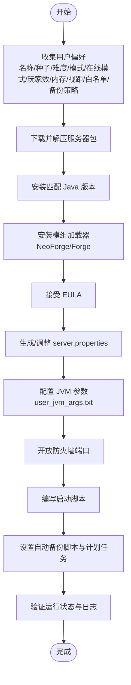
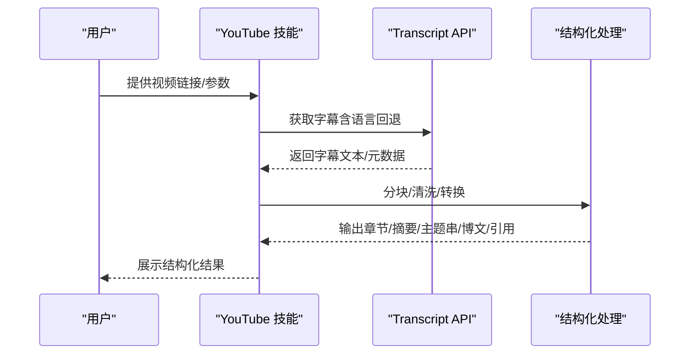
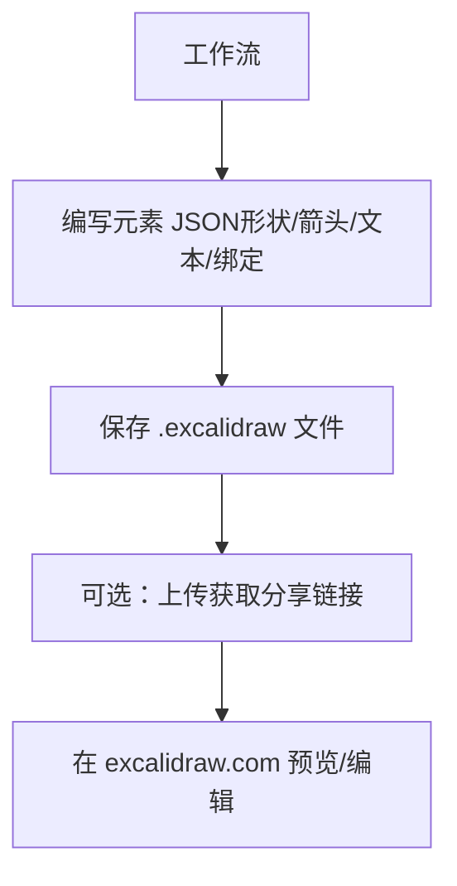
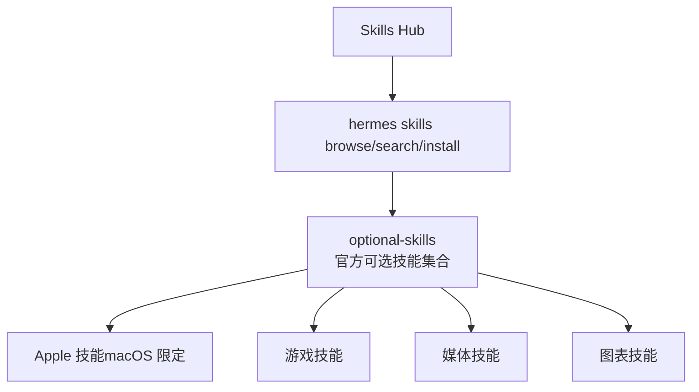
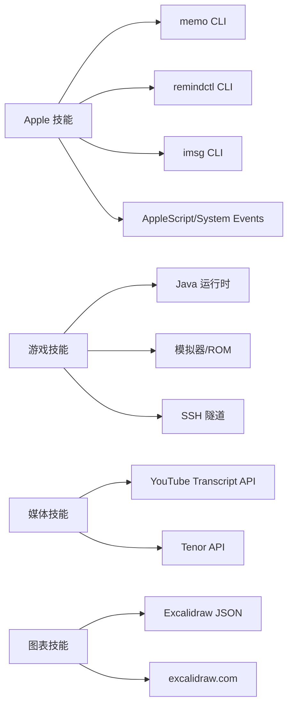

# 系统工具技能

<cite>
**本文引用的文件**
- [skills/apple/DESCRIPTION.md](file://skills/apple/DESCRIPTION.md)
- [skills/apple/apple-notes/SKILL.md](file://skills/apple/apple-notes/SKILL.md)
- [skills/apple/apple-reminders/SKILL.md](file://skills/apple/apple-reminders/SKILL.md)
- [skills/apple/findmy/SKILL.md](file://skills/apple/findmy/SKILL.md)
- [skills/apple/imessage/SKILL.md](file://skills/apple/imessage/SKILL.md)
- [skills/gaming/DESCRIPTION.md](file://skills/gaming/DESCRIPTION.md)
- [skills/gaming/minecraft-modpack-server/SKILL.md](file://skills/gaming/minecraft-modpack-server/SKILL.md)
- [skills/gaming/pokemon-player/SKILL.md](file://skills/gaming/pokemon-player/SKILL.md)
- [skills/media/DESCRIPTION.md](file://skills/media/DESCRIPTION.md)
- [skills/media/youtube-content/SKILL.md](file://skills/media/youtube-content/SKILL.md)
- [skills/media/gif-search/SKILL.md](file://skills/media/gif-search/SKILL.md)
- [skills/diagramming/DESCRIPTION.md](file://skills/diagramming/DESCRIPTION.md)
- [skills/creative/excalidraw/SKILL.md](file://skills/creative/excalidraw/SKILL.md)
- [optional-skills/DESCRIPTION.md](file://optional-skills/DESCRIPTION.md)
</cite>

## 目录
1. [简介](#简介)
2. [项目结构](#项目结构)
3. [核心组件](#核心组件)
4. [架构总览](#架构总览)
5. [详细组件分析](#详细组件分析)
6. [依赖关系分析](#依赖关系分析)
7. [性能考量](#性能考量)
8. [故障排查指南](#故障排查指南)
9. [结论](#结论)
10. [附录](#附录)

## 简介
本文件系统化梳理“系统工具技能”，覆盖以下能力域：
- Apple 生态集成：Notes、Reminders、Find My、iMessage 的自动化与系统集成
- 游戏相关：Minecraft 模组服搭建与运维、Pokemon 自动化游玩
- 媒体处理：YouTube 字幕抓取与结构化解析、GIF 搜索与下载
- 图表绘制：Excalidraw 手绘风格图表生成与分享
- 内部测试与问题报告：可复现步骤、日志采集与模板化反馈
- 安全配置与权限管理：系统权限、自动化授权与最小权限原则
- 跨平台兼容性：平台限定技能（如 Apple 仅 macOS）与替代方案

## 项目结构
系统工具技能以“技能”为单位组织在 skills 及 optional-skills 目录中，按功能域分层：
- Apple 生态：notes、reminders、findmy、imessage 四个子技能，均声明仅 macOS 平台可用
- Gaming：Minecraft 模组服与 Pokemon 自动化两个子技能
- Media：YouTube 内容与 GIF 搜索两个子技能
- Diagramming：Excalidraw 图表绘制
- Optional Skills：官方可选技能说明与安装方式

**图示来源**
- [skills/apple/DESCRIPTION.md:1-4](file://skills/apple/DESCRIPTION.md#L1-L4)
- [skills/gaming/DESCRIPTION.md:1-4](file://skills/gaming/DESCRIPTION.md#L1-L4)
- [skills/media/DESCRIPTION.md:1-4](file://skills/media/DESCRIPTION.md#L1-L4)
- [skills/diagramming/DESCRIPTION.md:1-4](file://skills/diagramming/DESCRIPTION.md#L1-L4)
- [optional-skills/DESCRIPTION.md:1-25](file://optional-skills/DESCRIPTION.md#L1-L25)

**章节来源**
- [skills/apple/DESCRIPTION.md:1-4](file://skills/apple/DESCRIPTION.md#L1-L4)
- [skills/gaming/DESCRIPTION.md:1-4](file://skills/gaming/DESCRIPTION.md#L1-L4)
- [skills/media/DESCRIPTION.md:1-4](file://skills/media/DESCRIPTION.md#L1-L4)
- [skills/diagramming/DESCRIPTION.md:1-4](file://skills/diagramming/DESCRIPTION.md#L1-L4)
- [optional-skills/DESCRIPTION.md:1-25](file://optional-skills/DESCRIPTION.md#L1-L25)

## 核心组件
- Apple Notes 技能：通过 memo CLI 管理 Apple Notes，支持列表、搜索、创建、编辑、移动、导出；需 macOS 与 Notes.app，并授予 Automation 权限
- Apple Reminders 技能：通过 remindctl 管理提醒事项与列表，支持查看、创建、完成、删除；需 macOS 与 Reminders.app，并授予相应权限
- Find My 技能：通过 AppleScript 打开 Find My 并用截图 + 视觉分析读取设备位置；可选使用 peekaboo 提升 UI 自动化稳定性
- iMessage 技能：通过 imsg CLI 发送/接收 iMessage/SMS，支持聊天列表、历史查询、附件发送、服务选择；需 macOS、Full Disk Access 与 Automation 授权
- Minecraft 模组服技能：从 CurseForge/Modrinth 服务器包搭建 NeoForge/Forge 服务器，涵盖 Java 版本、JVM 参数、防火墙、LAN、备份与启动脚本
- Pokemon 自动化技能：基于 headless 模拟器运行 Pokemon 游戏，通过 RAM 结构化状态与视觉分析进行决策与输入，提供保存/加载与仪表盘
- YouTube 内容技能：抓取字幕并转换为章节、摘要、主题串、博文、引用等多种结构化输出
- GIF 搜索技能：通过 Tenor API 使用 curl 搜索与下载 GIF，支持多种格式与元数据
- Excalidraw 图表技能：生成标准 Excalidraw JSON 文件，可上传分享或本地打开编辑

**章节来源**
- [skills/apple/apple-notes/SKILL.md:1-91](file://skills/apple/apple-notes/SKILL.md#L1-L91)
- [skills/apple/apple-reminders/SKILL.md:1-99](file://skills/apple/apple-reminders/SKILL.md#L1-L99)
- [skills/apple/findmy/SKILL.md:1-132](file://skills/apple/findmy/SKILL.md#L1-L132)
- [skills/apple/imessage/SKILL.md:1-103](file://skills/apple/imessage/SKILL.md#L1-L103)
- [skills/gaming/minecraft-modpack-server/SKILL.md:1-187](file://skills/gaming/minecraft-modpack-server/SKILL.md#L1-L187)
- [skills/gaming/pokemon-player/SKILL.md:1-216](file://skills/gaming/pokemon-player/SKILL.md#L1-L216)
- [skills/media/youtube-content/SKILL.md:1-73](file://skills/media/youtube-content/SKILL.md#L1-L73)
- [skills/media/gif-search/SKILL.md:1-87](file://skills/media/gif-search/SKILL.md#L1-L87)
- [skills/creative/excalidraw/SKILL.md:1-195](file://skills/creative/excalidraw/SKILL.md#L1-L195)

## 架构总览
系统工具技能围绕“平台能力 + 工具链 + 可视化/自动化”的模式组织，Apple 技能依赖 macOS Automation 与系统应用；游戏技能依赖本地环境与模拟器；媒体技能依赖第三方 API；图表技能依赖 JSON 文件与在线渲染。

**图示来源**
- [skills/apple/apple-notes/SKILL.md:18-24](file://skills/apple/apple-notes/SKILL.md#L18-L24)
- [skills/apple/apple-reminders/SKILL.md:17-24](file://skills/apple/apple-reminders/SKILL.md#L17-L24)
- [skills/apple/findmy/SKILL.md:15-25](file://skills/apple/findmy/SKILL.md#L15-L25)
- [skills/apple/imessage/SKILL.md:17-24](file://skills/apple/imessage/SKILL.md#L17-L24)
- [skills/gaming/minecraft-modpack-server/SKILL.md:32-56](file://skills/gaming/minecraft-modpack-server/SKILL.md#L32-L56)
- [skills/gaming/pokemon-player/SKILL.md:16-36](file://skills/gaming/pokemon-player/SKILL.md#L16-L36)
- [skills/media/youtube-content/SKILL.md:14-18](file://skills/media/youtube-content/SKILL.md#L14-L18)
- [skills/media/gif-search/SKILL.md:17-27](file://skills/media/gif-search/SKILL.md#L17-L27)
- [skills/creative/excalidraw/SKILL.md:15-24](file://skills/creative/excalidraw/SKILL.md#L15-L24)

## 详细组件分析

### Apple 生态集成
- Notes：通过 memo CLI 列表/搜索/创建/编辑/移动/导出；需 macOS 与 Notes.app，并授予 Automation 权限
- Reminders：通过 remindctl 列表/添加/完成/删除；需 macOS 与 Reminders.app，并授权
- Find My：通过 AppleScript 打开应用并截图，结合视觉分析读取设备位置；可选 peekaboo 提升稳定性
- iMessage：通过 imsg CLI 发送/接收消息与附件；需 macOS、Full Disk Access 与 Automation 授权

**图示来源**
- [skills/apple/imessage/SKILL.md:17-24](file://skills/apple/imessage/SKILL.md#L17-L24)
- [skills/apple/findmy/SKILL.md:15-25](file://skills/apple/findmy/SKILL.md#L15-L25)
- [skills/apple/apple-notes/SKILL.md:18-24](file://skills/apple/apple-notes/SKILL.md#L18-L24)
- [skills/apple/apple-reminders/SKILL.md:17-24](file://skills/apple/apple-reminders/SKILL.md#L17-L24)

**章节来源**
- [skills/apple/apple-notes/SKILL.md:1-91](file://skills/apple/apple-notes/SKILL.md#L1-L91)
- [skills/apple/apple-reminders/SKILL.md:1-99](file://skills/apple/apple-reminders/SKILL.md#L1-L99)
- [skills/apple/findmy/SKILL.md:1-132](file://skills/apple/findmy/SKILL.md#L1-L132)
- [skills/apple/imessage/SKILL.md:1-103](file://skills/apple/imessage/SKILL.md#L1-L103)

### 游戏相关技能
- Minecraft 模组服：从服务器包安装 NeoForge/Forge、配置 server.properties、JVM 参数、防火墙、备份与启动脚本
- Pokemon 自动化：启动游戏服务器、读取 RAM 结构化状态、视觉分析辅助导航、按钮输入、保存/加载与仪表盘

**图示来源**
- [skills/gaming/minecraft-modpack-server/SKILL.md:14-56](file://skills/gaming/minecraft-modpack-server/SKILL.md#L14-L56)
- [skills/gaming/minecraft-modpack-server/SKILL.md:64-136](file://skills/gaming/minecraft-modpack-server/SKILL.md#L64-L136)
- [skills/gaming/minecraft-modpack-server/SKILL.md:139-186](file://skills/gaming/minecraft-modpack-server/SKILL.md#L139-L186)

**章节来源**
- [skills/gaming/minecraft-modpack-server/SKILL.md:1-187](file://skills/gaming/minecraft-modpack-server/SKILL.md#L1-L187)
- [skills/gaming/pokemon-player/SKILL.md:1-216](file://skills/gaming/pokemon-player/SKILL.md#L1-L216)

### 媒体处理
- YouTube 内容：安装依赖后，通过脚本抓取字幕，支持纯文本、带时间戳、多语言回退、结构化输出（章节、摘要、主题串、博文、引用）
- GIF 搜索：通过 Tenor API 使用 curl 搜索与下载，支持多种格式与元数据，需设置 TENOR_API_KEY

**图示来源**
- [skills/media/youtube-content/SKILL.md:14-18](file://skills/media/youtube-content/SKILL.md#L14-L18)
- [skills/media/youtube-content/SKILL.md:59-65](file://skills/media/youtube-content/SKILL.md#L59-L65)

**章节来源**
- [skills/media/youtube-content/SKILL.md:1-73](file://skills/media/youtube-content/SKILL.md#L1-L73)
- [skills/media/gif-search/SKILL.md:1-87](file://skills/media/gif-search/SKILL.md#L1-L87)

### 图表绘制
- Excalidraw：生成标准 Excalidraw JSON 文件，可上传分享或本地打开编辑；提供元素类型参考、绑定标注、颜色与排版建议

**图示来源**
- [skills/creative/excalidraw/SKILL.md:19-52](file://skills/creative/excalidraw/SKILL.md#L19-L52)

**章节来源**
- [skills/creative/excalidraw/SKILL.md:1-195](file://skills/creative/excalidraw/SKILL.md#L1-L195)

### 概念性总览
- 可选技能：官方可选技能默认不激活，可通过命令行浏览、搜索与安装，便于按需启用重型或实验性功能
- 平台限定：Apple 技能明确仅 macOS 可用，需满足系统权限与自动化授权

**图示来源**
- [optional-skills/DESCRIPTION.md:8-13](file://optional-skills/DESCRIPTION.md#L8-L13)
- [skills/apple/DESCRIPTION.md:1-4](file://skills/apple/DESCRIPTION.md#L1-L4)

**章节来源**
- [optional-skills/DESCRIPTION.md:1-25](file://optional-skills/DESCRIPTION.md#L1-L25)
- [skills/apple/DESCRIPTION.md:1-4](file://skills/apple/DESCRIPTION.md#L1-L4)

## 依赖关系分析
- Apple 技能依赖 macOS 系统能力（Automation、屏幕录制、AppleScript），并通过第三方 CLI（memo、remindctl、imsg）与系统应用交互
- 游戏技能依赖本地环境（Java、模拟器）、ROM 文件与网络隧道（SSH 反向代理）
- 媒体技能依赖外部 API（Tenor、YouTube Transcript），需配置密钥与网络访问
- 图表技能依赖 JSON 文件与在线渲染服务

**图示来源**
- [skills/apple/apple-notes/SKILL.md:12-13](file://skills/apple/apple-notes/SKILL.md#L12-L13)
- [skills/apple/apple-reminders/SKILL.md:11-12](file://skills/apple/apple-reminders/SKILL.md#L11-L12)
- [skills/apple/imessage/SKILL.md:11-12](file://skills/apple/imessage/SKILL.md#L11-L12)
- [skills/gaming/minecraft-modpack-server/SKILL.md:43-47](file://skills/gaming/minecraft-modpack-server/SKILL.md#L43-L47)
- [skills/gaming/pokemon-player/SKILL.md:18-29](file://skills/gaming/pokemon-player/SKILL.md#L18-L29)
- [skills/media/youtube-content/SKILL.md:14-18](file://skills/media/youtube-content/SKILL.md#L14-L18)
- [skills/media/gif-search/SKILL.md:7-9](file://skills/media/gif-search/SKILL.md#L7-L9)
- [skills/creative/excalidraw/SKILL.md:1-12](file://skills/creative/excalidraw/SKILL.md#L1-L12)

**章节来源**
- [skills/apple/apple-notes/SKILL.md:12-13](file://skills/apple/apple-notes/SKILL.md#L12-L13)
- [skills/apple/apple-reminders/SKILL.md:11-12](file://skills/apple/apple-reminders/SKILL.md#L11-L12)
- [skills/apple/imessage/SKILL.md:11-12](file://skills/apple/imessage/SKILL.md#L11-L12)
- [skills/gaming/minecraft-modpack-server/SKILL.md:43-47](file://skills/gaming/minecraft-modpack-server/SKILL.md#L43-L47)
- [skills/gaming/pokemon-player/SKILL.md:18-29](file://skills/gaming/pokemon-player/SKILL.md#L18-L29)
- [skills/media/youtube-content/SKILL.md:14-18](file://skills/media/youtube-content/SKILL.md#L14-L18)
- [skills/media/gif-search/SKILL.md:7-9](file://skills/media/gif-search/SKILL.md#L7-L9)
- [skills/creative/excalidraw/SKILL.md:1-12](file://skills/creative/excalidraw/SKILL.md#L1-L12)

## 性能考量
- Apple 技能：UI 自动化可能受 macOS 版本影响，建议使用 peekaboo 提升稳定性；屏幕录制权限与截图解析会带来额外开销
- 游戏技能：Minecraft 启动慢属正常现象，注意 JVM 参数与视距/模拟距离平衡；Pokemon 自动化需频繁截图与视觉分析，建议控制动作序列长度并定期保存
- 媒体技能：YouTube 字幕抓取与结构化处理在长文本时需分块处理，避免超长输入导致性能下降
- 图表技能：Excalidraw JSON 复杂度与元素数量成正比，建议合并相似元素、减少绑定层级

[本节为通用指导，无需列出具体文件来源]

## 故障排查指南
- Apple Notes
  - 现象：无法编辑含图片/附件的笔记
  - 处理：该限制不可规避，改用纯文本或 Markdown 导出后处理
  - 现象：交互提示需要终端访问
  - 处理：确保 pty=true 或具备交互能力
- Apple Reminders
  - 现象：未授权导致无法读取/写入
  - 处理：执行授权检查与请求命令，确认状态
- Find My
  - 现象：无 CLI/API，必须使用 UI 自动化
  - 处理：使用 AppleScript 打开应用并截图，结合视觉分析；必要时安装 peekaboo
  - 现象：AirTag 仅在页面显示时更新位置
  - 处理：保持前台显示并周期性截图记录
- iMessage
  - 现象：发送前未确认收件人与内容
  - 处理：严格遵循“先查询聊天、再确认、后发送”的流程
  - 现象：附件路径不存在
  - 处理：发送前校验文件路径
- Minecraft 服务器
  - 现象：首次启动缓慢
  - 处理：等待初始世界生成完成，不要中断
  - 现象：在线模式与安全配置不一致被拒绝
  - 处理：统一 online-mode 与 enforce-secure-profile
- Pokemon 自动化
  - 现象：对话检测不稳定
  - 处理：结合视觉分析验证，必要时手动加速对话
  - 现象：地图传送后位置读取过期
  - 处理：传送后增加等待帧并重新截图确认
- YouTube 内容
  - 现象：字幕禁用/私有/不可用
  - 处理：提示用户检查视频页面字幕设置或验证链接有效性
- GIF 搜索
  - 现象：API 密钥缺失或配额不足
  - 处理：设置 TENOR_API_KEY 并检查限额

**章节来源**
- [skills/apple/apple-notes/SKILL.md:80-84](file://skills/apple/apple-notes/SKILL.md#L80-L84)
- [skills/apple/apple-reminders/SKILL.md:24-24](file://skills/apple/apple-reminders/SKILL.md#L24-L24)
- [skills/apple/findmy/SKILL.md:118-124](file://skills/apple/findmy/SKILL.md#L118-L124)
- [skills/apple/imessage/SKILL.md:83-88](file://skills/apple/imessage/SKILL.md#L83-L88)
- [skills/gaming/minecraft-modpack-server/SKILL.md:172-178](file://skills/gaming/minecraft-modpack-server/SKILL.md#L172-L178)
- [skills/gaming/pokemon-player/SKILL.md:104-111](file://skills/gaming/pokemon-player/SKILL.md#L104-L111)
- [skills/media/youtube-content/SKILL.md:67-72](file://skills/media/youtube-content/SKILL.md#L67-L72)
- [skills/media/gif-search/SKILL.md:82-87](file://skills/media/gif-search/SKILL.md#L82-L87)

## 结论
系统工具技能以“平台能力 + 工具链 + 可视化/自动化”为核心，覆盖 Apple 生态、游戏、媒体与图表绘制四大领域。Apple 技能强调 macOS 权限与自动化；游戏技能强调本地环境与性能调优；媒体技能强调外部 API 与结构化处理；图表技能强调轻量 JSON 与在线渲染。通过可选技能机制，用户可按需启用重型或实验性功能，兼顾易用性与可维护性。

[本节为总结性内容，无需列出具体文件来源]

## 附录
- 可选技能安装与使用
  - 浏览与搜索：hermes skills browse / hermes skills search <query>
  - 安装到本地并启用：hermes skills install <identifier>
- 平台限定说明
  - Apple 技能仅在 macOS 上可用，需满足系统权限与自动化授权
- 安全与权限
  - Apple：Automation、屏幕录制、Full Disk Access
  - 游戏：本地文件访问与网络隧道
  - 媒体：API 密钥管理与网络访问
  - 图表：本地文件读写与在线分享

**章节来源**
- [optional-skills/DESCRIPTION.md:8-13](file://optional-skills/DESCRIPTION.md#L8-L13)
- [skills/apple/DESCRIPTION.md:1-4](file://skills/apple/DESCRIPTION.md#L1-L4)
- [skills/apple/apple-notes/SKILL.md:20-24](file://skills/apple/apple-notes/SKILL.md#L20-L24)
- [skills/apple/apple-reminders/SKILL.md:19-24](file://skills/apple/apple-reminders/SKILL.md#L19-L24)
- [skills/apple/findmy/SKILL.md:19-25](file://skills/apple/findmy/SKILL.md#L19-L25)
- [skills/apple/imessage/SKILL.md:19-24](file://skills/apple/imessage/SKILL.md#L19-L24)