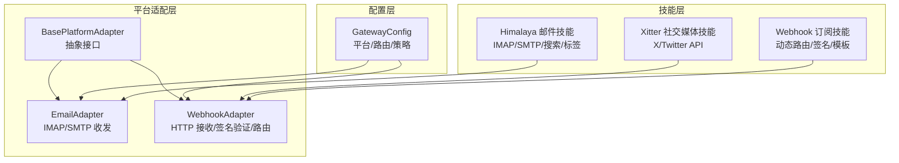
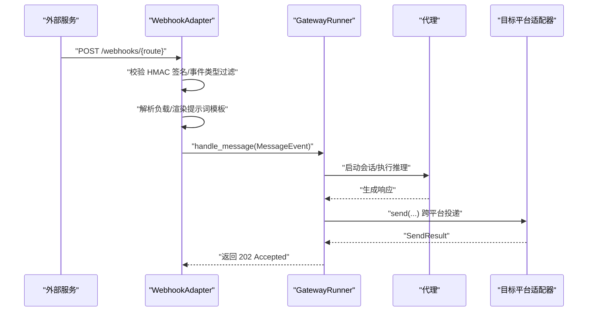
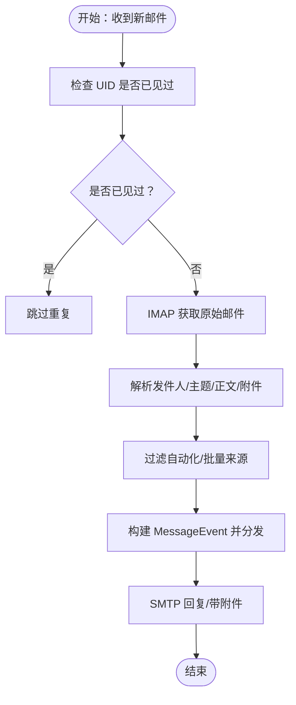
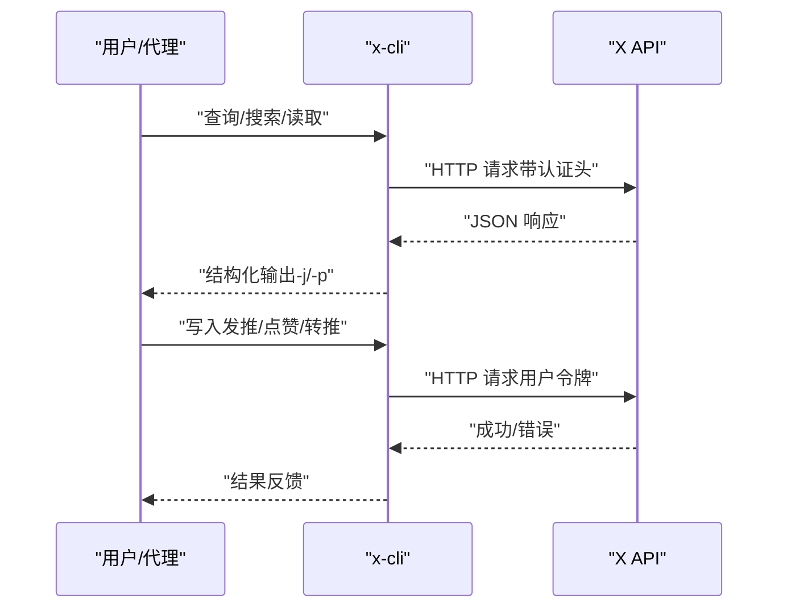
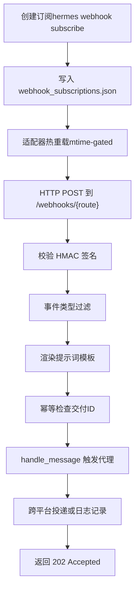
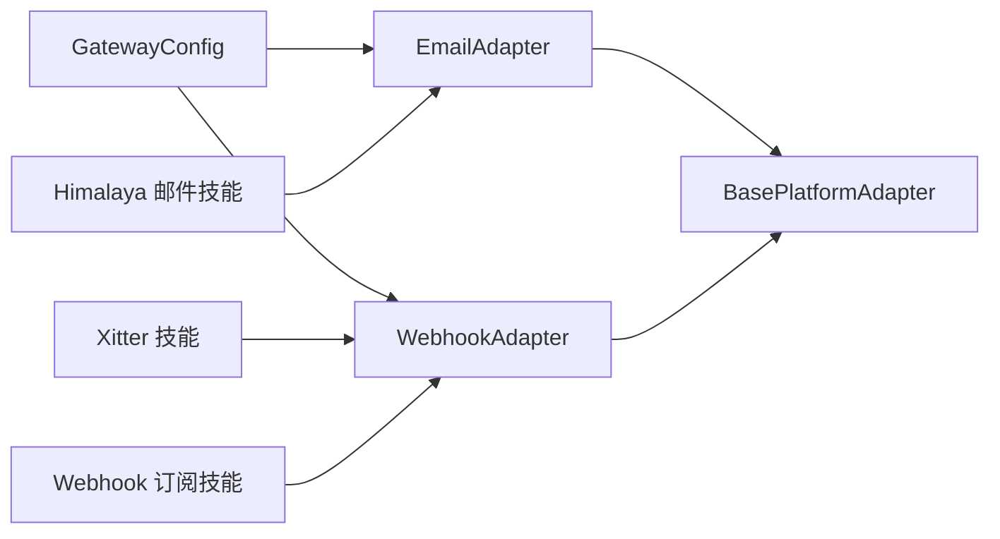

# 通信工具技能

<cite>
**本文引用的文件**
- [README.md](file://README.md)
- [email.py](file://gateway/platforms/email.py)
- [webhook.py](file://gateway/platforms/webhook.py)
- [base.py](file://gateway/platforms/base.py)
- [config.py](file://gateway/config.py)
- [SKILL.md（Himalaya 邮件）](file://skills/email/himalaya/SKILL.md)
- [SKILL.md（Xitter 社交媒体）](file://skills/social-media/xitter/SKILL.md)
- [SKILL.md（Webhook 订阅）](file://skills/devops/webhook-subscriptions/SKILL.md)
- [DESCRIPTION.md（通信技能总览）](file://optional-skills/communication/DESCRIPTION.md)
- [SKILL.md（1-3-1 决策规则）](file://optional-skills/communication/one-three-one-rule/SKILL.md)
</cite>

## 目录
1. [简介](#简介)
2. [项目结构](#项目结构)
3. [核心组件](#核心组件)
4. [架构总览](#架构总览)
5. [详细组件分析](#详细组件分析)
6. [依赖关系分析](#依赖关系分析)
7. [性能考量](#性能考量)
8. [故障排查指南](#故障排查指南)
9. [结论](#结论)
10. [附录](#附录)

## 简介
本文件系统化梳理 Hermes Agent 中与“通信”相关的技能与能力，覆盖邮件处理（含 IMAP/SMTP）、社交媒体（X/Twitter）集成、Webhook 订阅与事件驱动自动化等主题。文档面向不同技术背景的读者，既提供高层概览，也给出可操作的配置步骤、流程图与排障建议。

## 项目结构
围绕通信工具的关键模块与技能分布如下：
- 平台适配层：邮件、Webhook 等平台通过统一的适配器接口接入，遵循通用的消息事件模型与发送结果封装。
- 技能层：Himalaya 邮件 CLI、Xitter 社交媒体交互、Webhook 订阅管理等技能，提供终端命令式的能力入口。
- 配置层：GatewayConfig 统一加载与合并 YAML/环境变量/默认值，支持平台启用、路由与附加参数。

**图表来源**
- [email.py:217-622](file://gateway/platforms/email.py#L217-L622)
- [webhook.py:65-662](file://gateway/platforms/webhook.py#L65-L662)
- [base.py:470-800](file://gateway/platforms/base.py#L470-L800)
- [config.py:48-662](file://gateway/config.py#L48-L662)

**章节来源**
- [README.md:1-176](file://README.md#L1-L176)
- [config.py:48-662](file://gateway/config.py#L48-L662)

## 核心组件
- 邮件平台适配器（EmailAdapter）
  - 使用 IMAP 拉取未读邮件，解析正文与附件，过滤自动化/批量邮件；通过 SMTP 发送回复或带附件邮件；维护会话线程上下文。
- Webhook 平台适配器（WebhookAdapter）
  - 基于 aiohttp 提供 HTTP 服务，接收外部事件，校验 HMAC 签名，按路由模板渲染提示词，触发代理运行并将响应投递到目标平台。
- 平台基类（BasePlatformAdapter）
  - 定义统一的连接/断开、消息发送、媒体缓存、会话管理等接口，支撑多平台一致性行为。
- 配置管理（GatewayConfig）
  - 加载 config.yaml 与环境变量，合并平台配置与路由规则，提供平台可用性检测与运行状态写入。

**章节来源**
- [email.py:217-622](file://gateway/platforms/email.py#L217-L622)
- [webhook.py:65-662](file://gateway/platforms/webhook.py#L65-L662)
- [base.py:470-800](file://gateway/platforms/base.py#L470-L800)
- [config.py:48-662](file://gateway/config.py#L48-L662)

## 架构总览
下图展示从外部事件到代理执行再到平台投递的整体链路，重点体现签名验证、提示词渲染、幂等与去重、跨平台投递等关键环节。

**图表来源**
- [webhook.py:267-467](file://gateway/platforms/webhook.py#L267-L467)
- [base.py:598-632](file://gateway/platforms/base.py#L598-L632)

**章节来源**
- [webhook.py:267-467](file://gateway/platforms/webhook.py#L267-L467)

## 详细组件分析

### 邮件处理（IMAP/SMTP + Himalaya 集成）
- IMAP 接收
  - 连接测试、UID 去重、未读标记、自动跳过自动化/批量邮件、提取纯文本正文与 HTML 回退、附件缓存与类型识别。
- SMTP 发送
  - 支持纯文本正文与带附件邮件；自动维护回复主题与 In-Reply-To 引用链；支持图片/文档本地缓存路径。
- 与 Himalaya 的集成
  - 通过终端工具完成账户配置、列表/搜索/读取/回复/转发/移动/删除/标志位管理、多账户切换、输出格式控制与调试日志。

**图表来源**
- [email.py:316-460](file://gateway/platforms/email.py#L316-L460)

**章节来源**
- [email.py:217-622](file://gateway/platforms/email.py#L217-L622)
- [SKILL.md（Himalaya 邮件）:1-279](file://skills/email/himalaya/SKILL.md#L1-L279)

### 社交媒体管理（X/Twitter）
- Xitter 技能
  - 通过官方 x-cli 工具对接 X API，支持发推、回复/引用、搜索、时间线、用户信息、点赞/转推、书签与提及等。
  - 需要五项凭证（应用级与用户级），建议使用上游 .env 文件集中管理。
  - 输出模式支持 JSON/Markdown/详细模式，便于代理程序化解析与后续动作。
- 最佳实践
  - 先读取后写入，先验证凭据再执行写操作；注意付费计划与配额限制；关注回复限制与速率限制。

**图表来源**
- [SKILL.md（Xitter 社交媒体）:1-203](file://skills/social-media/xitter/SKILL.md#L1-L203)

**章节来源**
- [SKILL.md（Xitter 社交媒体）:1-203](file://skills/social-media/xitter/SKILL.md#L1-L203)

### Webhook 订阅与事件驱动
- 动态订阅
  - 通过 hermes webhook 子命令创建/列出/移除订阅，订阅持久化在 webhook_subscriptions.json，适配器热重载生效。
- 路由与签名
  - 每个路由可配置事件类型过滤、HMAC-SHA256 密钥（支持全局密钥），并按请求头或负载字段进行匹配。
- 提示词与模板
  - 支持点号访问嵌套字段，未指定模板时默认以缩略 JSON 形式注入提示词。
- 幂等与去重
  - 基于 X-GitHub-Delivery 或自定义 X-Request-ID 的交付 ID 去重，配合 TTL 清理。
- 跨平台投递
  - 支持直接投递到 GitHub PR 评论或其它平台（如 Telegram/Discord/Slack 等），必要时回退到日志记录。

**图表来源**
- [webhook.py:234-467](file://gateway/platforms/webhook.py#L234-L467)
- [SKILL.md（Webhook 订阅）:1-181](file://skills/devops/webhook-subscriptions/SKILL.md#L1-L181)

**章节来源**
- [webhook.py:65-662](file://gateway/platforms/webhook.py#L65-L662)
- [SKILL.md（Webhook 订阅）:1-181](file://skills/devops/webhook-subscriptions/SKILL.md#L1-L181)

### 通信决策框架（1-3-1 规则）
- 适用场景
  - 多方案权衡、技术选型、迁移策略、重构路径等需要清晰推荐与可执行计划的场合。
- 结构化输出
  - 问题陈述（1）、三个选项（3）、推荐与理由（1）、定义完成标准（Definition of Done）、实施计划（Implementation Plan）。
- 使用建议
  - 明确任务边界，避免简单问题与已决策任务；确保 DoD 与计划与所选方案一致。

**章节来源**
- [SKILL.md（1-3-1 决策规则）:1-104](file://optional-skills/communication/one-three-one-rule/SKILL.md#L1-L104)

## 依赖关系分析
- 平台适配器依赖
  - EmailAdapter 依赖 Python 标准库 IMAP/SMTP 解析与附件缓存；WebhookAdapter 依赖 aiohttp；均继承 BasePlatformAdapter。
- 配置与运行时
  - GatewayConfig 负责加载 YAML/环境变量，合并平台与路由配置；平台可用性检测与运行状态写入。
- 技能与平台
  - Himalaya 邮件技能通过终端命令与 EmailAdapter 协作；Xitter 与 WebhookAdapter 通过外部 CLI 与 HTTP 路由协作。

**图表来源**
- [config.py:218-401](file://gateway/config.py#L218-L401)
- [email.py:217-246](file://gateway/platforms/email.py#L217-L246)
- [webhook.py:65-98](file://gateway/platforms/webhook.py#L65-L98)
- [base.py:470-504](file://gateway/platforms/base.py#L470-L504)

**章节来源**
- [config.py:48-662](file://gateway/config.py#L48-L662)
- [email.py:217-246](file://gateway/platforms/email.py#L217-L246)
- [webhook.py:65-98](file://gateway/platforms/webhook.py#L65-L98)
- [base.py:470-504](file://gateway/platforms/base.py#L470-L504)

## 性能考量
- IMAP/SMTP
  - 合理设置轮询间隔与 UID 去重上限，避免内存膨胀；附件下载采用本地缓存减少平台 URL 过期影响。
- Webhook
  - 限流窗口与每分钟请求数控制；体长限制与签名前置校验；幂等 TTL 控制内存占用；跨平台投递异步化降低阻塞。
- 缓存与媒体
  - 图像/音频/文档缓存目录定期清理，避免磁盘占用；对不可信 URL 进行 SSRF 保护与重试退避。

[本节为通用指导，不直接分析具体文件]

## 故障排查指南
- Webhook
  - 确认网关运行与监听端口空闲；健康检查 /health 可达；核对路由签名密钥与事件类型过滤；若服务在内网，需公网可达或隧道；使用 hermes webhook test 验证路由。
- 邮件
  - 检查 IMAP/SMTP 凭据与加密配置；确认未被识别为自动化来源；查看附件下载与缓存目录权限；必要时开启调试日志。
- 社交媒体
  - 确认 x-cli 已安装且凭证完整；若只读成功而写入失败，检查用户权限与令牌有效期；留意速率限制与回复限制。

**章节来源**
- [webhook.py:112-161](file://gateway/platforms/webhook.py#L112-L161)
- [email.py:268-314](file://gateway/platforms/email.py#L268-L314)
- [SKILL.md（Webhook 订阅）:171-181](file://skills/devops/webhook-subscriptions/SKILL.md#L171-L181)
- [SKILL.md（Himalaya 邮件）:259-279](file://skills/email/himalaya/SKILL.md#L259-L279)
- [SKILL.md（Xitter 社交媒体）:189-196](file://skills/social-media/xitter/SKILL.md#L189-L196)

## 结论
Hermes 的通信工具体系以统一的平台适配器为核心，结合技能层的终端命令式能力与配置层的灵活路由，实现了邮件、社交媒体与 Webhook 的一体化接入。通过严格的签名验证、幂等与限流机制，保障了事件驱动自动化在生产环境中的稳定性与安全性。

[本节为总结性内容，不直接分析具体文件]

## 附录

### 配置与使用速查
- 邮件（EmailAdapter）
  - 环境变量：EMAIL_ADDRESS、EMAIL_PASSWORD、EMAIL_IMAP_HOST、EMAIL_SMTP_HOST、EMAIL_POLL_INTERVAL、EMAIL_ALLOWED_USERS
  - 关键能力：IMAP 轮询、SMTP 发送、附件缓存、线程上下文、自动跳过自动化来源
- Webhook（WebhookAdapter）
  - 配置：platforms.webhook.extra.routes（静态路由）与 webhook_subscriptions.json（动态订阅）
  - 关键能力：HMAC 校验、事件类型过滤、提示词模板渲染、幂等与限流、跨平台投递
- 技能
  - Himalaya 邮件：账户配置、列表/搜索/读取/回复/转发/移动/删除/标志位、多账户、输出格式、调试
  - Xitter：安装与凭证、只读验证、常见命令、输出模式、注意事项
  - Webhook 订阅：创建/列出/移除/测试、提示词模板、常见模式、安全与排障

**章节来源**
- [email.py:78-86](file://gateway/platforms/email.py#L78-L86)
- [webhook.py:65-107](file://gateway/platforms/webhook.py#L65-L107)
- [SKILL.md（Himalaya 邮件）:43-82](file://skills/email/himalaya/SKILL.md#L43-L82)
- [SKILL.md（Xitter 社交媒体）:34-125](file://skills/social-media/xitter/SKILL.md#L34-L125)
- [SKILL.md（Webhook 订阅）:14-94](file://skills/devops/webhook-subscriptions/SKILL.md#L14-L94)