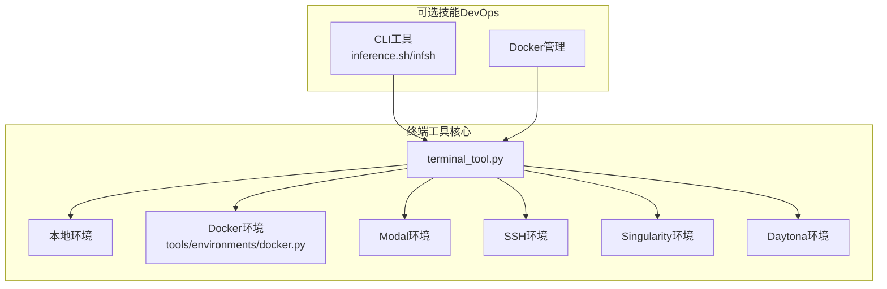
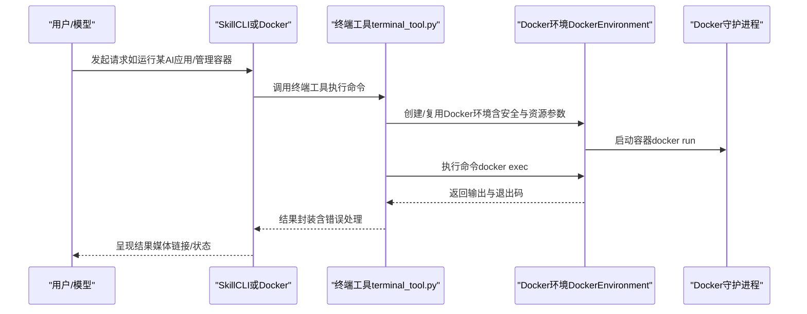
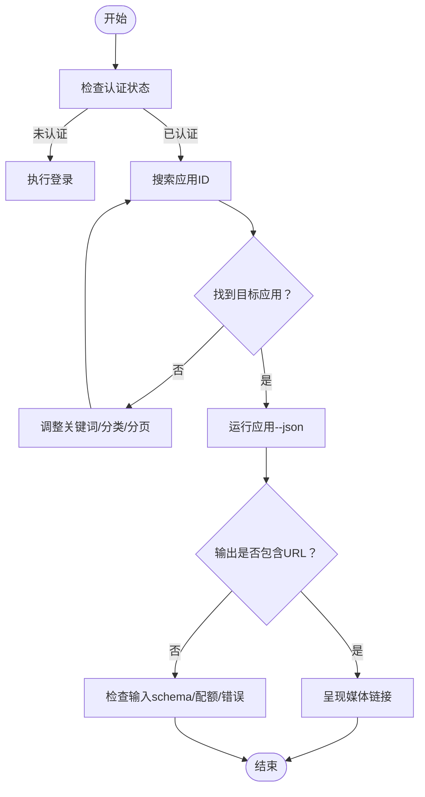
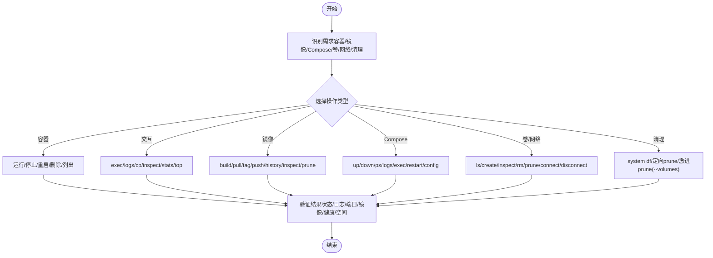
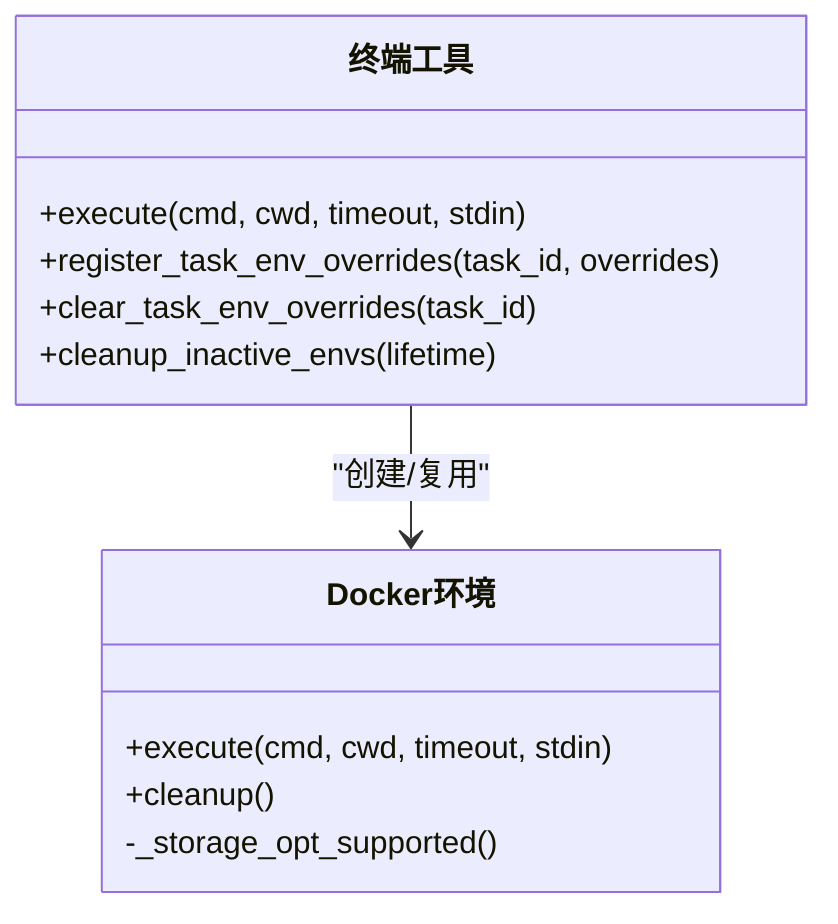
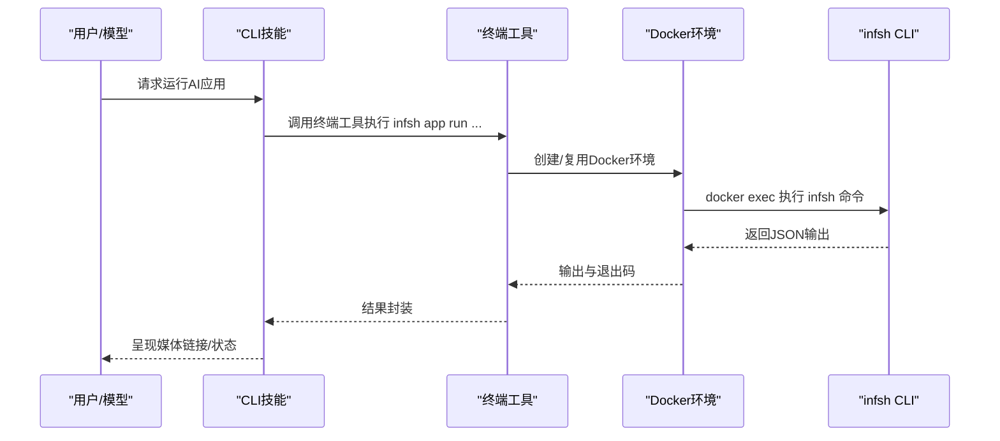
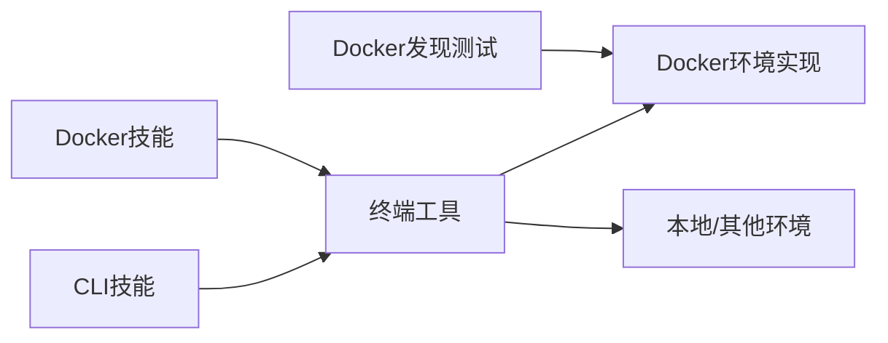

# DevOps工具

<cite>
**本文引用的文件**
- [optional-skills/devops/cli/SKILL.md](file://optional-skills/devops/cli/SKILL.md)
- [optional-skills/devops/cli/references/authentication.md](file://optional-skills/devops/cli/references/authentication.md)
- [optional-skills/devops/cli/references/app-discovery.md](file://optional-skills/devops/cli/references/app-discovery.md)
- [optional-skills/devops/cli/references/running-apps.md](file://optional-skills/devops/cli/references/running-apps.md)
- [optional-skills/devops/cli/references/cli-reference.md](file://optional-skills/devops/cli/references/cli-reference.md)
- [optional-skills/devops/docker-management/SKILL.md](file://optional-skills/devops/docker-management/SKILL.md)
- [tools/environments/docker.py](file://tools/environments/docker.py)
- [tools/terminal_tool.py](file://tools/terminal_tool.py)
- [hermes_cli/setup.py](file://hermes_cli/setup.py)
- [tests/tools/test_docker_find.py](file://tests/tools/test_docker_find.py)
</cite>

## 目录
1. [简介](#简介)
2. [项目结构](#项目结构)
3. [核心组件](#核心组件)
4. [架构总览](#架构总览)
5. [详细组件分析](#详细组件分析)
6. [依赖关系分析](#依赖关系分析)
7. [性能考量](#性能考量)
8. [故障排除指南](#故障排除指南)
9. [结论](#结论)
10. [附录](#附录)

## 简介
本文件面向Hermes Agent的DevOps可选技能，系统化介绍“DevOps工具”的能力边界与使用方法，覆盖以下主题：
- CLI工具（inference.sh/infsh）：应用发现、认证配置、运行管理与输出解析
- Docker管理：容器生命周期、镜像与卷管理、Compose编排、磁盘清理与优化建议
- 与核心系统的集成：终端工具（terminal tool）作为统一执行后端，支持本地与容器沙箱
- 自动化流程：通过终端工具在不同环境（本地/容器/云沙箱）中执行命令
- 监控与故障排除：Docker可用性检查、日志与资源诊断、常见问题排查

## 项目结构
DevOps相关技能位于 optional-skills/devops 下，分别提供 CLI 工具与 Docker 管理两类能力；核心执行后端由 tools/terminal_tool.py 提供，底层容器执行由 tools/environments/docker.py 实现。

图表来源
- [optional-skills/devops/cli/SKILL.md:1-156](file://optional-skills/devops/cli/SKILL.md#L1-L156)
- [optional-skills/devops/docker-management/SKILL.md:1-281](file://optional-skills/devops/docker-management/SKILL.md#L1-L281)
- [tools/terminal_tool.py:1-800](file://tools/terminal_tool.py#L1-L800)
- [tools/environments/docker.py:1-605](file://tools/environments/docker.py#L1-L605)

章节来源
- [optional-skills/devops/cli/SKILL.md:1-156](file://optional-skills/devops/cli/SKILL.md#L1-L156)
- [optional-skills/devops/docker-management/SKILL.md:1-281](file://optional-skills/devops/docker-management/SKILL.md#L1-L281)
- [tools/terminal_tool.py:1-800](file://tools/terminal_tool.py#L1-L800)
- [tools/environments/docker.py:1-605](file://tools/environments/docker.py#L1-L605)

## 核心组件
- CLI工具（inference.sh/infsh）
  - 通过终端工具调用 infsh 命令，实现应用发现、运行与结果解析
  - 关键参考：应用发现、运行、认证与CLI参考文档
- Docker管理
  - 使用标准Docker CLI进行容器、镜像、卷、网络与Compose操作
  - 通过终端工具选择Docker后端，实现隔离化的命令执行
- 终端工具（terminal tool）
  - 支持本地、Docker、Modal、SSH、Singularity、Daytona等多后端
  - 提供后台任务、自动清理、危险命令审批、sudo密码处理等能力
- Docker环境实现
  - 安全加固（能力降级、无新权限、PID限制）、资源限制（CPU/内存/磁盘）、持久化工作区
  - 可选挂载凭据文件、技能目录与缓存目录，支持按需转发环境变量

章节来源
- [optional-skills/devops/cli/SKILL.md:13-156](file://optional-skills/devops/cli/SKILL.md#L13-L156)
- [optional-skills/devops/docker-management/SKILL.md:14-281](file://optional-skills/devops/docker-management/SKILL.md#L14-L281)
- [tools/terminal_tool.py:1-800](file://tools/terminal_tool.py#L1-L800)
- [tools/environments/docker.py:1-605](file://tools/environments/docker.py#L1-L605)

## 架构总览
下图展示DevOps技能如何通过终端工具与Docker后端协作，完成命令执行与资源管理。

图表来源
- [tools/terminal_tool.py:583-713](file://tools/terminal_tool.py#L583-L713)
- [tools/environments/docker.py:221-473](file://tools/environments/docker.py#L221-L473)

## 详细组件分析

### CLI工具（inference.sh/infsh）
- 应用发现
  - 列表、分类筛选、搜索、分页、特色与最新排序、保存到文件、查看已部署应用、获取应用详情
- 认证与设置
  - 安装CLI、登录、检查认证状态、环境变量覆盖、更新CLI
- 运行与输出
  - 基本运行、内联JSON输入、版本固定、本地文件上传、生成样例输入、任务跟踪、后台运行与结果获取、输出解析
- 最佳实践
  - 永远先搜索再猜测应用ID；始终使用--json以获得结构化输出；注意超时与输入格式转义；长任务使用后台模式并定期查询任务状态

图表来源
- [optional-skills/devops/cli/SKILL.md:47-67](file://optional-skills/devops/cli/SKILL.md#L47-L67)
- [optional-skills/devops/cli/references/app-discovery.md:1-113](file://optional-skills/devops/cli/references/app-discovery.md#L1-L113)
- [optional-skills/devops/cli/references/running-apps.md:1-172](file://optional-skills/devops/cli/references/running-apps.md#L1-L172)
- [optional-skills/devops/cli/references/authentication.md:1-60](file://optional-skills/devops/cli/references/authentication.md#L1-L60)

章节来源
- [optional-skills/devops/cli/SKILL.md:19-156](file://optional-skills/devops/cli/SKILL.md#L19-L156)
- [optional-skills/devops/cli/references/app-discovery.md:1-113](file://optional-skills/devops/cli/references/app-discovery.md#L1-L113)
- [optional-skills/devops/cli/references/running-apps.md:1-172](file://optional-skills/devops/cli/references/running-apps.md#L1-L172)
- [optional-skills/devops/cli/references/authentication.md:1-60](file://optional-skills/devops/cli/references/authentication.md#L1-L60)
- [optional-skills/devops/cli/references/cli-reference.md:1-105](file://optional-skills/devops/cli/references/cli-reference.md#L1-L105)

### Docker管理
- 容器生命周期与交互
  - 运行、停止、重启、删除、列出；进入容器、查看日志、复制文件、检查与统计、进程查看
- 镜像管理
  - 构建、拉取/推送、标签、历史与检查、清理未使用镜像
- Compose编排
  - 启动/停止、日志、交互式进入服务、单次命令执行、重建与配置校验
- 卷与网络
  - 列出/创建/检查/删除/清理；连接/断开容器
- 磁盘使用与清理
  - 诊断空间占用；定向清理与激进清理（含数据风险提示）
- Dockerfile优化建议
  - 多阶段构建、层顺序、RUN合并、.dockerignore、固定基础镜像版本、非root运行、精简基础镜像

图表来源
- [optional-skills/devops/docker-management/SKILL.md:55-281](file://optional-skills/devops/docker-management/SKILL.md#L55-L281)

章节来源
- [optional-skills/devops/docker-management/SKILL.md:18-281](file://optional-skills/devops/docker-management/SKILL.md#L18-L281)

### 终端工具与Docker后端集成
- 终端工具能力
  - 多后端选择（local/docker/modal/ssh/singularity/daytona）
  - 后台任务、自动清理、危险命令审批、sudo密码处理、工作目录与路径校验
  - 环境配置（超时、生命周期、容器资源、持久化、卷挂载、环境变量转发）
- Docker后端实现
  - 安全加固（能力降级、无新权限、PID限制、tmpfs）
  - 资源限制（CPU/内存/磁盘，部分驱动支持）
  - 持久化工作区（绑定挂载）与临时工作区（tmpfs）
  - 凭据/技能/缓存目录挂载，只读访问
  - 执行命令（docker exec），中断与超时处理，清理容器

图表来源
- [tools/terminal_tool.py:583-713](file://tools/terminal_tool.py#L583-L713)
- [tools/environments/docker.py:221-605](file://tools/environments/docker.py#L221-L605)

章节来源
- [tools/terminal_tool.py:1-800](file://tools/terminal_tool.py#L1-L800)
- [tools/environments/docker.py:1-605](file://tools/environments/docker.py#L1-L605)

### CLI工具使用流程（序列图）

图表来源
- [optional-skills/devops/cli/SKILL.md:47-67](file://optional-skills/devops/cli/SKILL.md#L47-L67)
- [tools/terminal_tool.py:583-713](file://tools/terminal_tool.py#L583-L713)
- [tools/environments/docker.py:474-576](file://tools/environments/docker.py#L474-L576)

## 依赖关系分析
- 技能到终端工具
  - CLI技能与Docker技能均通过终端工具发起命令执行
- 终端工具到环境实现
  - Docker后端由 tools/environments/docker.py 提供，负责容器生命周期与安全/资源策略
- CLI工具到外部CLI
  - infsh CLI独立于Hermes，但通过终端工具在受控环境中执行
- CLI工具到测试
  - 测试覆盖Docker CLI发现逻辑，确保在不同平台与PATH配置下的可用性

图表来源
- [tools/terminal_tool.py:583-713](file://tools/terminal_tool.py#L583-L713)
- [tools/environments/docker.py:105-129](file://tools/environments/docker.py#L105-L129)
- [tests/tools/test_docker_find.py:1-48](file://tests/tools/test_docker_find.py#L1-L48)

章节来源
- [tools/terminal_tool.py:583-713](file://tools/terminal_tool.py#L583-L713)
- [tools/environments/docker.py:105-129](file://tools/environments/docker.py#L105-L129)
- [tests/tools/test_docker_find.py:1-48](file://tests/tools/test_docker_find.py#L1-L48)

## 性能考量
- Docker后端
  - 安全与资源：能力降级、PID限制、tmpfs、可选磁盘配额（特定驱动支持）
  - 挂载策略：持久化vs临时工作区，影响IO与启动时间
  - 环境变量与凭据：只读挂载减少容器内写入，提升安全性
- 终端工具
  - 超时与生命周期：合理设置超时与环境生命周期，避免资源泄漏
  - 清理线程：后台周期清理不活跃环境，降低资源占用
- CLI工具
  - 长任务后台运行与任务状态轮询，避免阻塞主线程

章节来源
- [tools/environments/docker.py:132-219](file://tools/environments/docker.py#L132-L219)
- [tools/terminal_tool.py:715-790](file://tools/terminal_tool.py#L715-L790)
- [optional-skills/devops/cli/references/running-apps.md:130-140](file://optional-skills/devops/cli/references/running-apps.md#L130-L140)

## 故障排除指南
- Docker不可用
  - 现象：找不到docker可执行文件或daemon无响应
  - 排查：确认PATH与已知安装路径；执行docker version；检查守护进程状态
  - 参考：Docker可用性检查与错误信息
- 权限问题
  - 现象：sudo失败、无法写入宿主机目录
  - 排查：在消息网关场景下添加SUDO_PASSWORD；核对UID/GID映射；使用非root用户或修复权限
- 端口冲突
  - 现象：端口被占用导致容器启动失败
  - 排查：使用docker ps或lsof定位占用进程，修改映射或释放端口
- 磁盘空间不足
  - 现象：镜像/容器/卷过多导致空间耗尽
  - 排查：docker system df诊断；执行定向清理；谨慎使用--volumes清理命名卷
- CLI认证失败
  - 现象：未认证或API密钥无效
  - 排查：执行infsh login；检查INFSH_API_KEY；必要时重新安装CLI

章节来源
- [tools/environments/docker.py:155-219](file://tools/environments/docker.py#L155-L219)
- [optional-skills/devops/docker-management/SKILL.md:246-258](file://optional-skills/devops/docker-management/SKILL.md#L246-L258)
- [optional-skills/devops/cli/references/authentication.md:47-54](file://optional-skills/devops/cli/references/authentication.md#L47-L54)

## 结论
DevOps工具通过CLI与Docker两大能力，结合终端工具的统一执行后端，实现了从应用即服务到基础设施即代码的无缝衔接。CLI工具聚焦于应用发现与运行，Docker管理聚焦于容器与编排治理，二者均在终端工具的统一调度下，具备良好的安全性、可观测性与可维护性。建议在生产环境中配合合理的资源限制、持久化策略与清理机制，确保长期稳定运行。

## 附录
- 环境初始化与Docker后端配置
  - 在CLI安装流程中可选择Docker后端，检测docker可执行文件并提示安装路径
- Docker CLI发现测试
  - 验证在PATH缺失或非标准路径下仍能正确发现docker可执行文件

章节来源
- [hermes_cli/setup.py:1382-1402](file://hermes_cli/setup.py#L1382-L1402)
- [tests/tools/test_docker_find.py:1-48](file://tests/tools/test_docker_find.py#L1-L48)