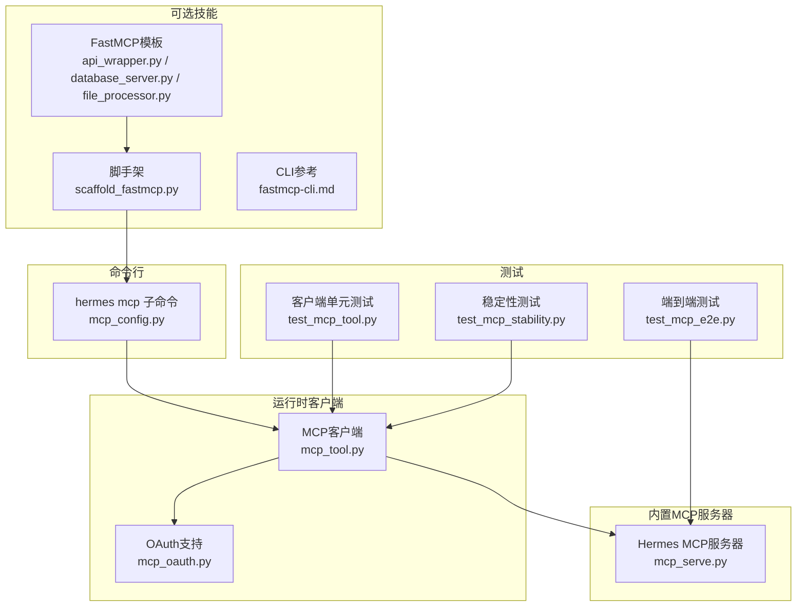
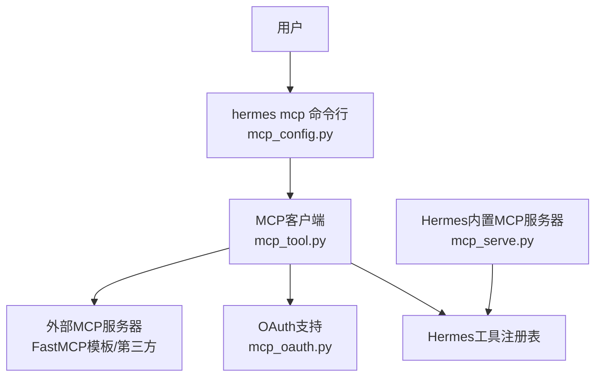
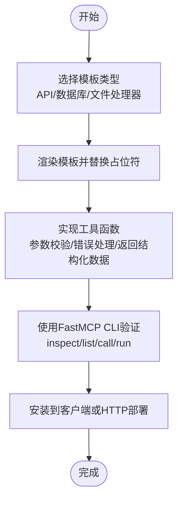
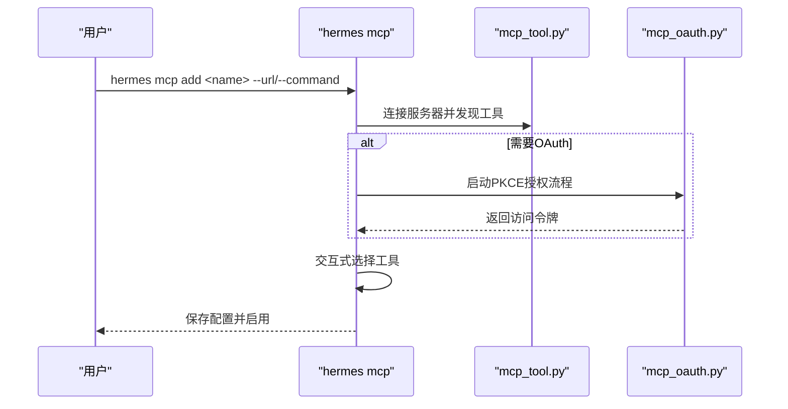
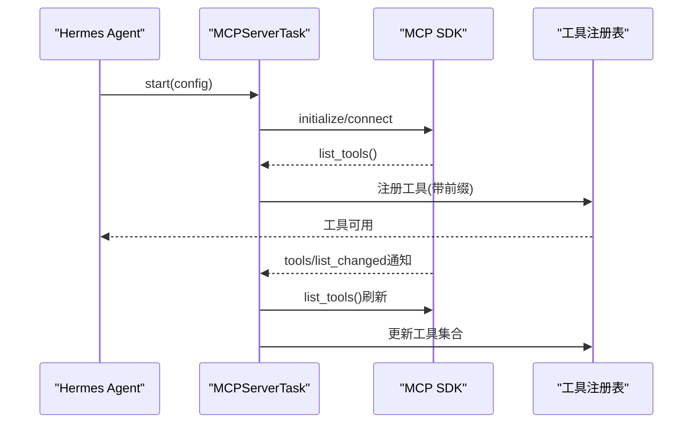
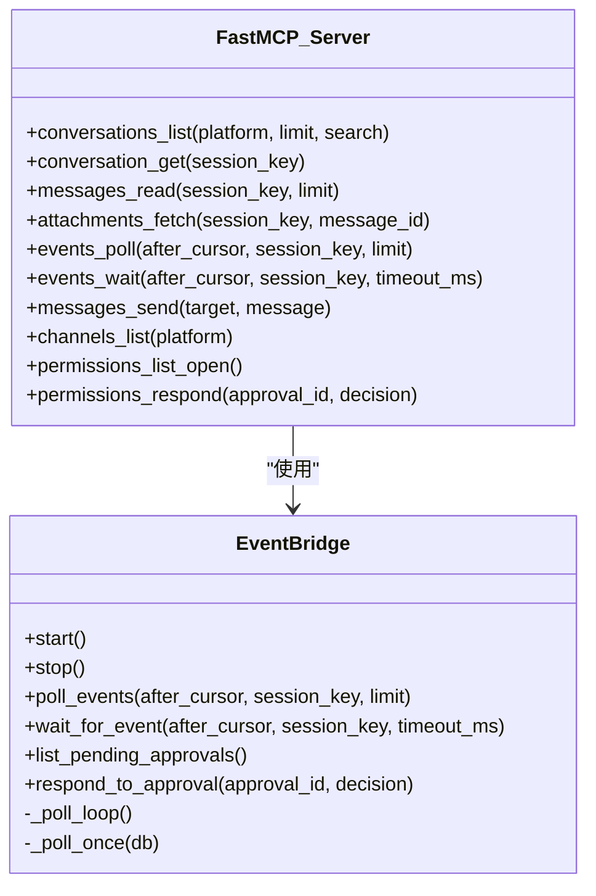
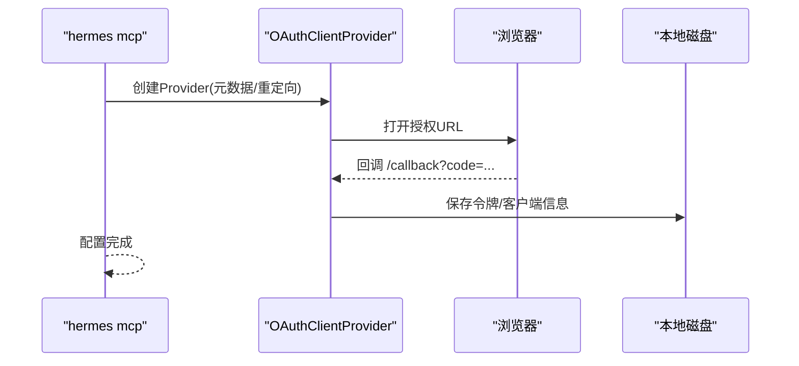
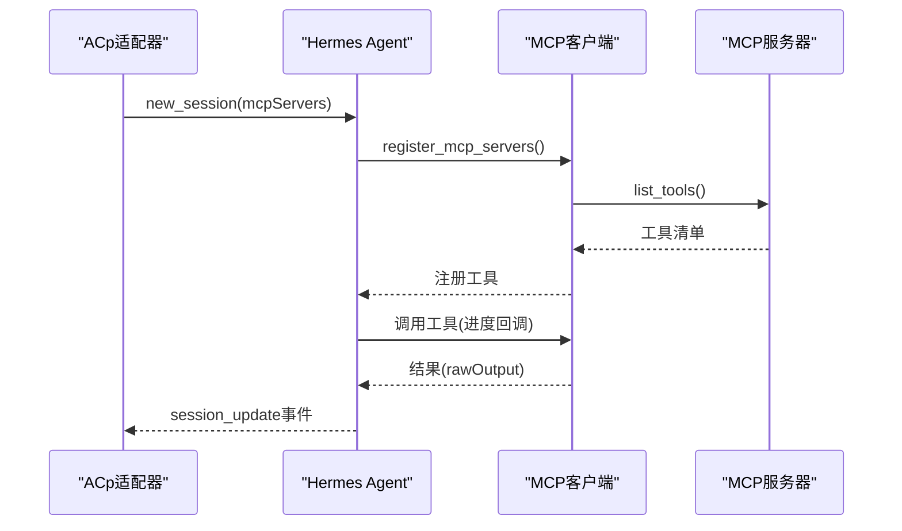
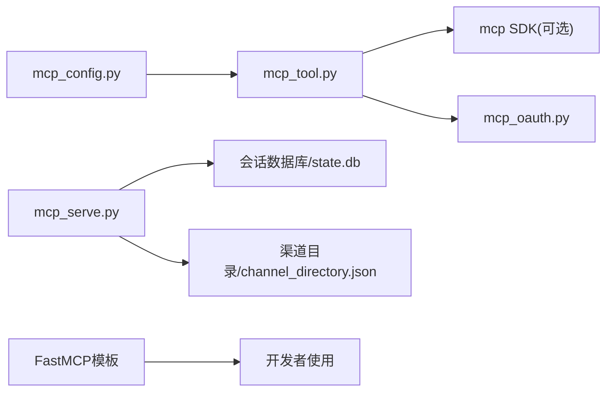

# MCP集成

<cite>
**本文档引用的文件**
- [SKILL.md](file://optional-skills/mcp/fastmcp/SKILL.md)
- [fastmcp-cli.md](file://optional-skills/mcp/fastmcp/references/fastmcp-cli.md)
- [scaffold_fastmcp.py](file://optional-skills/mcp/fastmcp/scripts/scaffold_fastmcp.py)
- [api_wrapper.py](file://optional-skills/mcp/fastmcp/templates/api_wrapper.py)
- [database_server.py](file://optional-skills/mcp/fastmcp/templates/database_server.py)
- [file_processor.py](file://optional-skills/mcp/fastmcp/templates/file_processor.py)
- [mcp_config.py](file://hermes_cli/mcp_config.py)
- [mcp_serve.py](file://mcp_serve.py)
- [mcp_tool.py](file://tools/mcp_tool.py)
- [mcp_oauth.py](file://tools/mcp_oauth.py)
- [test_mcp_tool.py](file://tests/tools/test_mcp_tool.py)
- [test_mcp_stability.py](file://tests/tools/test_mcp_stability.py)
- [test_mcp_e2e.py](file://tests/acp/test_mcp_e2e.py)
</cite>

## 目录
1. [简介](#简介)
2. [项目结构](#项目结构)
3. [核心组件](#核心组件)
4. [架构总览](#架构总览)
5. [详细组件分析](#详细组件分析)
6. [依赖关系分析](#依赖关系分析)
7. [性能考虑](#性能考虑)
8. [故障排除指南](#故障排除指南)
9. [结论](#结论)
10. [附录](#附录)

## 简介
本文件面向Hermes Agent的MCP（Model Context Protocol）集成可选技能，系统性阐述MCP概念、优势以及在Hermes中的实现方式。重点围绕FastMCP技能展开，涵盖模板化服务器构建（API封装、数据库只读查询、文件处理）、本地验证与部署流程、与Hermes核心系统的交互机制（命令行管理、运行时连接、动态发现与注册），并提供开发指南与故障排除方法。

## 项目结构
MCP相关能力分布在以下模块：
- 可选技能：FastMCP模板与脚手架，用于快速生成Python MCP服务器
- 命令行：hermes mcp子命令，支持添加/移除/列出/测试/配置MCP服务器
- 运行时客户端：MCP客户端支持，负责连接外部MCP服务器、动态发现工具、注册到Hermes工具集
- 内置MCP服务器：Hermes内置的Messaging Bridge MCP服务器，暴露会话、消息、事件等工具
- OAuth支持：为需要OAuth认证的MCP服务器提供浏览器授权流程
- 测试：覆盖客户端稳定性、端到端集成、工具注册与回调

**图表来源**
- [SKILL.md:1-300](file://optional-skills/mcp/fastmcp/SKILL.md#L1-L300)
- [mcp_config.py:1-646](file://hermes_cli/mcp_config.py#L1-L646)
- [mcp_tool.py:1-800](file://tools/mcp_tool.py#L1-L800)
- [mcp_serve.py:1-868](file://mcp_serve.py#L1-L868)
- [mcp_oauth.py:1-482](file://tools/mcp_oauth.py#L1-L482)
- [test_mcp_tool.py:1-800](file://tests/tools/test_mcp_tool.py#L1-L800)
- [test_mcp_stability.py:1-144](file://tests/tools/test_mcp_stability.py#L1-L144)
- [test_mcp_e2e.py:1-350](file://tests/acp/test_mcp_e2e.py#L1-L350)

**章节来源**
- [SKILL.md:1-300](file://optional-skills/mcp/fastmcp/SKILL.md#L1-L300)
- [mcp_config.py:1-646](file://hermes_cli/mcp_config.py#L1-L646)

## 核心组件
- FastMCP模板与脚手架
  - 提供API封装、数据库只读查询、文件处理三类模板，便于快速构建MCP服务器
  - 脚手架工具支持从模板复制并替换服务器名称占位符，简化初始化
- hermes mcp命令行
  - 支持添加/移除/列出/测试/配置MCP服务器，自动发现工具并进行选择性启用
  - 支持HTTP与stdio两种传输方式，以及OAuth认证配置
- MCP客户端
  - 动态连接外部MCP服务器，发现工具并注册到Hermes工具集
  - 支持环境变量过滤、错误信息脱敏、采样回调（server-initiated LLM请求）
- 内置MCP服务器（Hermes Messaging Bridge）
  - 暴露会话列表、对话详情、消息读取、附件获取、事件轮询/等待、消息发送、通道列表、权限管理等工具
- OAuth支持
  - 实现OAuth 2.1 PKCE流程，持久化令牌与客户端信息，支持浏览器授权与回调
- 测试体系
  - 单元测试覆盖配置加载、Schema转换、工具调用、服务器生命周期
  - 稳定性测试覆盖事件循环异常处理、stdio进程PID跟踪、配置热重载超时
  - 端到端测试覆盖ACP集成场景下的工具注册与回调事件

**章节来源**
- [scaffold_fastmcp.py:1-57](file://optional-skills/mcp/fastmcp/scripts/scaffold_fastmcp.py#L1-L57)
- [api_wrapper.py:1-55](file://optional-skills/mcp/fastmcp/templates/api_wrapper.py#L1-L55)
- [database_server.py:1-78](file://optional-skills/mcp/fastmcp/templates/database_server.py#L1-L78)
- [file_processor.py:1-56](file://optional-skills/mcp/fastmcp/templates/file_processor.py#L1-L56)
- [mcp_config.py:1-646](file://hermes_cli/mcp_config.py#L1-L646)
- [mcp_tool.py:1-800](file://tools/mcp_tool.py#L1-L800)
- [mcp_serve.py:1-868](file://mcp_serve.py#L1-L868)
- [mcp_oauth.py:1-482](file://tools/mcp_oauth.py#L1-L482)
- [test_mcp_tool.py:1-800](file://tests/tools/test_mcp_tool.py#L1-L800)
- [test_mcp_stability.py:1-144](file://tests/tools/test_mcp_stability.py#L1-L144)
- [test_mcp_e2e.py:1-350](file://tests/acp/test_mcp_e2e.py#L1-L350)

## 架构总览
下图展示MCP集成的整体架构：用户通过hermes mcp命令管理MCP服务器；运行时由MCP客户端连接服务器，动态发现工具并注册到Hermes工具集；内置的Hermes MCP服务器提供消息桥接能力；OAuth模块为需要认证的服务器提供授权支持。

**图表来源**
- [mcp_config.py:1-646](file://hermes_cli/mcp_config.py#L1-L646)
- [mcp_tool.py:1-800](file://tools/mcp_tool.py#L1-L800)
- [mcp_oauth.py:1-482](file://tools/mcp_oauth.py#L1-L482)
- [mcp_serve.py:1-868](file://mcp_serve.py#L1-L868)

## 详细组件分析

### FastMCP模板与脚手架
- 模板类型
  - API封装：封装REST API为MCP工具，支持鉴权头、统一请求逻辑、错误处理与负载规范化
  - 数据库只读查询：基于SQLite，提供表枚举、表结构描述、受限SELECT查询
  - 文件处理器：文本文件元数据与预览、搜索匹配，资源暴露
- 脚手架功能
  - 列出可用模板、渲染模板、替换服务器名称占位符、安全覆盖保护
- 使用建议
  - 优先从最小可行表面开始，逐步扩展工具
  - 工具命名应具体、参数显式且类型化，返回结构化JSON数据
  - 仅在确有需要时添加资源与提示词

**图表来源**
- [scaffold_fastmcp.py:1-57](file://optional-skills/mcp/fastmcp/scripts/scaffold_fastmcp.py#L1-L57)
- [api_wrapper.py:1-55](file://optional-skills/mcp/fastmcp/templates/api_wrapper.py#L1-L55)
- [database_server.py:1-78](file://optional-skills/mcp/fastmcp/templates/database_server.py#L1-L78)
- [file_processor.py:1-56](file://optional-skills/mcp/fastmcp/templates/file_processor.py#L1-L56)
- [fastmcp-cli.md:1-111](file://optional-skills/mcp/fastmcp/references/fastmcp-cli.md#L1-L111)

**章节来源**
- [SKILL.md:193-300](file://optional-skills/mcp/fastmcp/SKILL.md#L193-L300)
- [scaffold_fastmcp.py:1-57](file://optional-skills/mcp/fastmcp/scripts/scaffold_fastmcp.py#L1-L57)
- [api_wrapper.py:1-55](file://optional-skills/mcp/fastmcp/templates/api_wrapper.py#L1-L55)
- [database_server.py:1-78](file://optional-skills/mcp/fastmcp/templates/database_server.py#L1-L78)
- [file_processor.py:1-56](file://optional-skills/mcp/fastmcp/templates/file_processor.py#L1-L56)
- [fastmcp-cli.md:1-111](file://optional-skills/mcp/fastmcp/references/fastmcp-cli.md#L1-L111)

### hermes mcp命令行管理
- 主要功能
  - 添加服务器：支持HTTP URL与stdio命令两种方式，自动发现工具并进行选择性启用
  - 移除服务器：清理配置与OAuth令牌
  - 列出服务器：显示传输方式、工具数量、启用状态
  - 测试连接：连接服务器、列出工具、显示认证信息
  - 配置工具：交互式选择启用/禁用工具集合
- 认证支持
  - OAuth 2.1 PKCE：自动启动浏览器授权，持久化令牌
  - Bearer Token：通过环境变量注入Authorization头
- 错误处理
  - 解包异常组，暴露真实原因
  - 对未连接或无工具服务器给出明确提示

**图表来源**
- [mcp_config.py:173-338](file://hermes_cli/mcp_config.py#L173-L338)
- [mcp_tool.py:1-800](file://tools/mcp_tool.py#L1-L800)
- [mcp_oauth.py:1-482](file://tools/mcp_oauth.py#L1-L482)

**章节来源**
- [mcp_config.py:171-646](file://hermes_cli/mcp_config.py#L171-L646)

### MCP客户端与工具注册
- 连接与发现
  - 支持stdio与HTTP/StreamableHTTP传输
  - 自动重连（指数退避，最多5次）
  - 动态工具发现通知（tools/list_changed）
- 注册机制
  - 将外部工具注册为Hermes工具，工具名前缀mcp_<server>_
  - 自动创建自定义工具集，注入到所有hermes-*工具集中
- 安全与稳定性
  - stdio子进程环境变量过滤，仅传递安全变量
  - 错误信息中脱敏凭证模式
  - 事件循环异常处理、stdio孤儿进程PID跟踪、配置热重载超时

**图表来源**
- [mcp_tool.py:716-800](file://tools/mcp_tool.py#L716-L800)
- [test_mcp_tool.py:260-350](file://tests/tools/test_mcp_tool.py#L260-L350)

**章节来源**
- [mcp_tool.py:1-800](file://tools/mcp_tool.py#L1-L800)
- [test_mcp_tool.py:1-800](file://tests/tools/test_mcp_tool.py#L1-L800)
- [test_mcp_stability.py:1-144](file://tests/tools/test_mcp_stability.py#L1-L144)

### 内置MCP服务器（Hermes Messaging Bridge）
- 工具集概览
  - conversations_list/conversation_get/messages_read/attachments_fetch
  - events_poll/events_wait/messages_send/channels_list
  - permissions_list_open/permissions_respond（权限相关）
- 事件桥接
  - 后台线程轮询会话数据库，维护内存事件队列
  - 支持长轮询等待新事件，限制队列长度
- 数据源
  - 会话索引sessions.json与状态数据库state.db
  - 渠道目录channel_directory.json

**图表来源**
- [mcp_serve.py:185-800](file://mcp_serve.py#L185-L800)

**章节来源**
- [mcp_serve.py:1-868](file://mcp_serve.py#L1-L868)

### OAuth认证流程
- 流程概述
  - 初始化OAuthClientProvider，设置客户端元数据与重定向URI
  - 启动本地回调服务器，打开浏览器进行授权
  - 回调接收授权码后交换令牌，持久化存储
- 安全特性
  - 仅在交互环境尝试浏览器打开，非交互环境给出明确提示
  - 令牌与客户端信息以受保护权限写入磁盘
- 集成点
  - hermes mcp add时检测OAuth配置并自动建立认证

**图表来源**
- [mcp_oauth.py:377-482](file://tools/mcp_oauth.py#L377-L482)
- [mcp_config.py:207-231](file://hermes_cli/mcp_config.py#L207-L231)

**章节来源**
- [mcp_oauth.py:1-482](file://tools/mcp_oauth.py#L1-L482)
- [mcp_config.py:207-231](file://hermes_cli/mcp_config.py#L207-L231)

### 端到端集成与最佳实践
- 端到端流程
  - ACP层接收mcpServers配置，转换为Hermes配置并注册工具
  - Agent执行对话时触发工具进度回调与结果更新
  - ACP事件携带rawOutput，确保工具调用与结果正确配对
- 最佳实践
  - 服务器命名避免特殊字符，使用mcp_tool自动清洗
  - 工具参数显式且类型化，返回结构化数据
  - 严格控制工具面，优先只读操作，限制查询范围
  - 在部署前使用fastmcp inspect/list/call进行验证

**图表来源**
- [test_mcp_e2e.py:54-233](file://tests/acp/test_mcp_e2e.py#L54-L233)
- [mcp_tool.py:1-800](file://tools/mcp_tool.py#L1-L800)

**章节来源**
- [test_mcp_e2e.py:1-350](file://tests/acp/test_mcp_e2e.py#L1-L350)

## 依赖关系分析
- 组件耦合
  - mcp_config依赖tools.mcp_tool进行连接与发现
  - mcp_tool依赖mcp_sdk（可选）进行传输与认证
  - mcp_serve作为内置服务器，依赖会话数据库与渠道目录
  - mcp_oauth为mcp_tool提供OAuth能力
- 外部依赖
  - FastMCP模板依赖fastmcp包
  - MCP客户端依赖mcp Python SDK（可选）
  - HTTP模板依赖httpx
- 循环依赖
  - 未发现直接循环依赖；各模块职责清晰，通过配置与注册解耦

**图表来源**
- [mcp_config.py:1-646](file://hermes_cli/mcp_config.py#L1-L646)
- [mcp_tool.py:1-800](file://tools/mcp_tool.py#L1-L800)
- [mcp_oauth.py:1-482](file://tools/mcp_oauth.py#L1-L482)
- [mcp_serve.py:1-868](file://mcp_serve.py#L1-L868)
- [api_wrapper.py:1-55](file://optional-skills/mcp/fastmcp/templates/api_wrapper.py#L1-L55)

**章节来源**
- [mcp_config.py:1-646](file://hermes_cli/mcp_config.py#L1-L646)
- [mcp_tool.py:1-800](file://tools/mcp_tool.py#L1-L800)
- [mcp_oauth.py:1-482](file://tools/mcp_oauth.py#L1-L482)
- [mcp_serve.py:1-868](file://mcp_serve.py#L1-L868)
- [api_wrapper.py:1-55](file://optional-skills/mcp/fastmcp/templates/api_wrapper.py#L1-L55)

## 性能考虑
- 连接与发现
  - 默认连接超时与工具调用超时可配置，避免阻塞主线程
  - 自动重连采用指数退避，降低瞬时失败影响
- 事件轮询
  - 内置MCP服务器使用后台线程轮询数据库，基于文件mtime缓存减少昂贵工作
  - 事件队列上限与轮询间隔可调，平衡实时性与CPU占用
- 环境变量与安全
  - stdio子进程仅传递安全基础变量，减少不必要的环境污染
  - 错误信息脱敏，避免凭证泄露带来的间接性能损失（日志与网络传输）

[本节为通用指导，无需特定文件引用]

## 故障排除指南
- FastMCP命令缺失
  - 确认已安装fastmcp并在当前环境中可用
  - 使用inspect/list/call验证服务器可用性
- 连接失败
  - 检查URL/命令是否正确，必要时使用hermes mcp test查看认证信息
  - 对于OAuth服务器，确认浏览器授权已完成且令牌已持久化
- 工具不可见或调用失败
  - 使用fastmcp list/call进行最小化复现
  - 检查工具参数、返回值是否符合JSON序列化要求
- 配置热重载问题
  - 若hermes mcp配置变更导致卡顿，检查配置监听线程与超时设置
- 端到端问题
  - 使用端到端测试思路：新建会话→注册工具→触发工具调用→验证事件与rawOutput

**章节来源**
- [SKILL.md:263-300](file://optional-skills/mcp/fastmcp/SKILL.md#L263-L300)
- [mcp_config.py:440-501](file://hermes_cli/mcp_config.py#L440-L501)
- [test_mcp_stability.py:112-144](file://tests/tools/test_mcp_stability.py#L112-L144)
- [test_mcp_tool.py:232-257](file://tests/tools/test_mcp_tool.py#L232-L257)

## 结论
Hermes Agent的MCP集成提供了从模板化服务器构建、命令行管理、运行时连接与动态注册，到内置消息桥接与OAuth认证的完整能力链。通过FastMCP模板与hermes mcp命令行，开发者可以快速搭建并部署MCP服务器；通过MCP客户端与测试体系，确保工具注册、事件回调与稳定性。遵循“最小工具面、只读默认、结构化输出”的设计原则，可在保证安全性的同时最大化实用性。

[本节为总结性内容，无需特定文件引用]

## 附录
- 快速开始步骤
  - 安装FastMCP并验证版本
  - 使用脚手架生成服务器文件，实现工具函数
  - 使用fastmcp inspect/list/call进行本地验证
  - 通过hermes mcp add添加服务器并选择工具
  - 如需OAuth，按提示完成浏览器授权
- 推荐工作流
  - 先只读、再扩展；先单工具、再组合
  - 明确参数与返回格式，保持一致性
  - 在部署前进行Prefect Horizon/Generic HTTP部署检查

**章节来源**
- [fastmcp-cli.md:1-111](file://optional-skills/mcp/fastmcp/references/fastmcp-cli.md#L1-L111)
- [SKILL.md:193-300](file://optional-skills/mcp/fastmcp/SKILL.md#L193-L300)