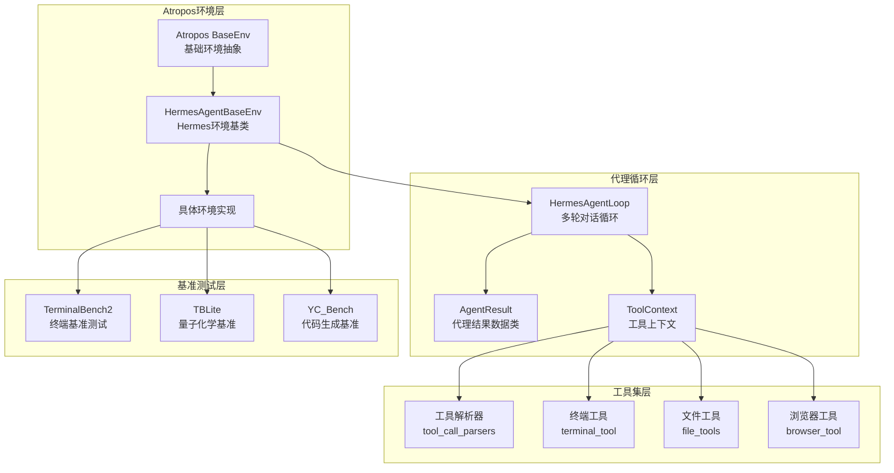
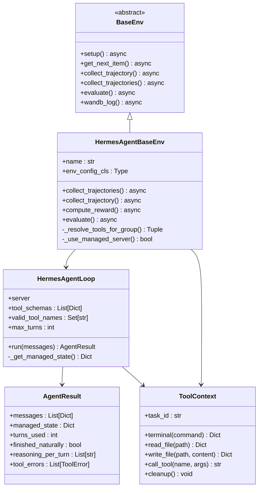
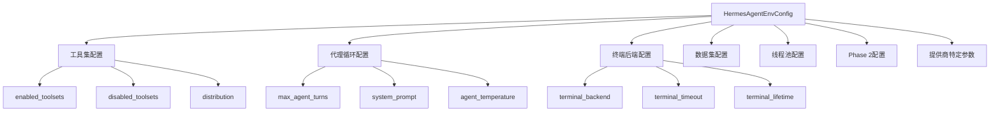
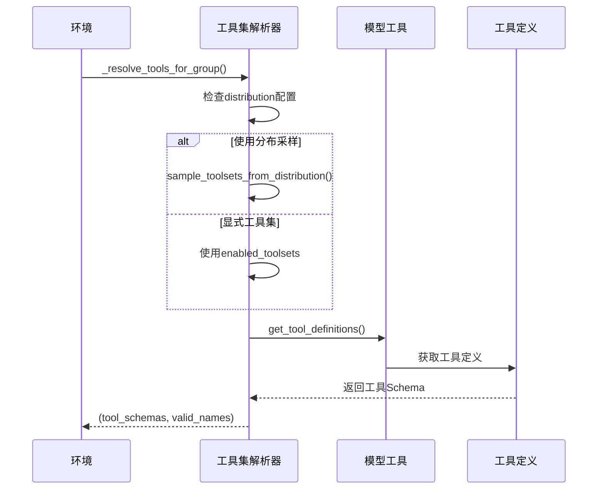
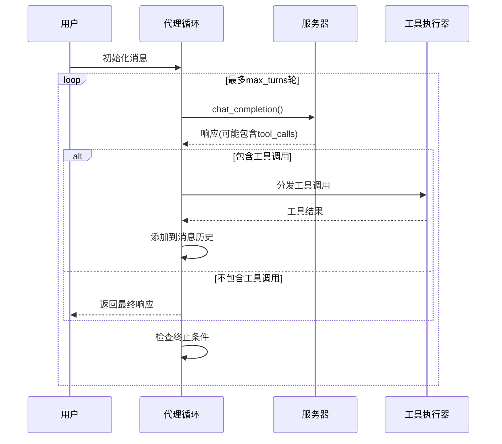
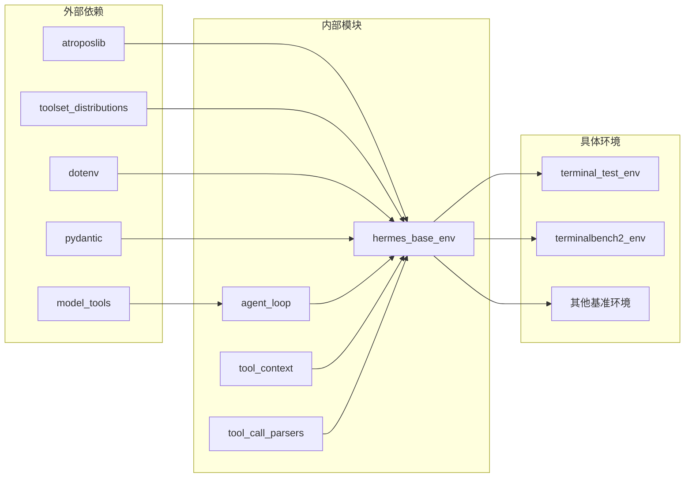
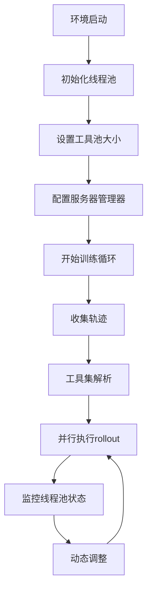

# Atropos强化学习环境

<cite>
**本文档引用的文件**
- [SKILL.md](file://optional-skills/mlops/hermes-atropos-environments/SKILL.md)
- [agentresult-fields.md](file://optional-skills/mlops/hermes-atropos-environments/references/agentresult-fields.md)
- [atropos-base-env.md](file://optional-skills/mlops/hermes-atropos-environments/references/atropos-base-env.md)
- [usage-patterns.md](file://optional-skills/mlops/hermes-atropos-environments/references/usage-patterns.md)
- [agent_loop.py](file://environments/agent_loop.py)
- [hermes_base_env.py](file://environments/hermes_base_env.py)
- [tool_context.py](file://environments/tool_context.py)
- [terminal_test_env.py](file://environments/terminal_test_env/terminal_test_env.py)
- [terminal_test_env/default.yaml](file://environments/terminal_test_env/default.yaml)
- [terminalbench2_env.py](file://environments/benchmarks/terminalbench_2/terminalbench2_env.py)
- [terminalbench_2/default.yaml](file://environments/benchmarks/terminalbench_2/default.yaml)
- [__init__.py](file://environments/__init__.py)
</cite>

## 目录
1. [引言](#引言)
2. [项目结构](#项目结构)
3. [核心组件](#核心组件)
4. [架构概览](#架构概览)
5. [详细组件分析](#详细组件分析)
6. [依赖关系分析](#依赖关系分析)
7. [性能考虑](#性能考虑)
8. [故障排除指南](#故障排除指南)
9. [结论](#结论)
10. [附录](#附录)

## 引言

Hermes Agent的Atropos强化学习环境是一个专为强化学习研究设计的框架，它将Hermes Agent的多轮对话和工具调用能力与Atropos训练框架无缝集成。该环境的核心价值在于其能够处理复杂的代理行为优化任务，通过模拟真实世界的工具使用场景来训练和评估智能体。

Atropos环境在强化学习研究中扮演着关键角色，它提供了：
- 多轮对话和工具调用的完整代理循环
- 真实环境中的奖励函数验证机制
- 支持多种推理模式（OpenAI服务器和VLLM托管服务器）
- 完整的实验设计和结果分析方法论

## 项目结构

Atropos强化学习环境的组织结构体现了清晰的分层架构：



**图表来源**
- [hermes_base_env.py:1-671](file://environments/hermes_base_env.py#L1-L671)
- [agent_loop.py:1-512](file://environments/agent_loop.py#L1-L512)
- [tool_context.py:1-475](file://environments/tool_context.py#L1-L475)

**章节来源**
- [__init__.py:1-37](file://environments/__init__.py#L1-L37)
- [SKILL.md:17-41](file://optional-skills/mlops/hermes-atropos-environments/SKILL.md#L17-L41)

## 核心组件

### AgentResult数据结构

AgentResult是Atropos环境中最重要的数据结构之一，它封装了整个代理对话过程的所有信息：

| 字段名 | 类型 | 描述 |
|--------|------|------|
| `messages` | `List[Dict[str, Any]]` | 完整的对话历史记录，采用OpenAI消息格式 |
| `managed_state` | `Optional[Dict]` | Phase 2模式下的托管服务器状态，否则为None |
| `turns_used` | `int` | 代理使用的轮次数量 |
| `finished_naturally` | `bool` | 模型是否自然停止（而非达到最大轮次） |
| `reasoning_per_turn` | `List[Optional[str]]` | 每轮提取的推理内容 |
| `tool_errors` | `List[ToolError]` | 代理过程中遇到的工具错误列表 |

**章节来源**
- [agentresult-fields.md:5-15](file://optional-skills/mlops/hermes-atropos-environments/references/agentresult-fields.md#L5-L15)
- [agent_loop.py:61-77](file://environments/agent_loop.py#L61-L77)

### ToolError错误追踪

ToolError类提供了详细的工具执行错误信息：

| 字段名 | 类型 | 描述 |
|--------|------|------|
| `turn` | `int` | 错误发生的轮次 |
| `tool_name` | `str` | 出错的工具名称 |
| `arguments` | `str` | 传递给工具的参数（截断） |
| `error` | `str` | 错误消息 |
| `tool_result` | `str` | 返回给模型的结果 |

**章节来源**
- [agentresult-fields.md:16-25](file://optional-skills/mlops/hermes-atropos-environments/references/agentresult-fields.md#L16-L25)
- [agent_loop.py:50-59](file://environments/agent_loop.py#L50-L59)

## 架构概览

Atropos强化学习环境采用分层架构设计，确保了高度的模块化和可扩展性：



**图表来源**
- [hermes_base_env.py:180-671](file://environments/hermes_base_env.py#L180-L671)
- [agent_loop.py:117-512](file://environments/agent_loop.py#L117-L512)
- [tool_context.py:67-475](file://environments/tool_context.py#L67-L475)

## 详细组件分析

### HermesAgentBaseEnv基类

HermesAgentBaseEnv是所有Hermes Agent Atropos环境的抽象基类，它提供了完整的环境集成框架：

#### 配置系统

环境配置通过Pydantic模型实现，支持丰富的配置选项：



**图表来源**
- [hermes_base_env.py:73-178](file://environments/hermes_base_env.py#L73-L178)

#### 工具集解析机制

环境实现了灵活的工具集解析系统，支持动态工具集选择：



**图表来源**
- [hermes_base_env.py:248-282](file://environments/hermes_base_env.py#L248-L282)

**章节来源**
- [hermes_base_env.py:180-671](file://environments/hermes_base_env.py#L180-L671)

### HermesAgentLoop代理循环

HermesAgentLoop实现了标准的OpenAI规范工具调用循环，支持多种服务器类型：

#### 代理循环工作流程



**图表来源**
- [agent_loop.py:167-500](file://environments/agent_loop.py#L167-L500)

#### 工具调用处理

代理循环支持多种工具调用格式，并提供错误处理机制：

**章节来源**
- [agent_loop.py:117-512](file://environments/agent_loop.py#L117-L512)

### ToolContext工具上下文

ToolContext为奖励函数提供了对所有Hermes Agent工具的无限制访问权限：

#### 文件操作功能

| 方法 | 功能描述 | 使用场景 |
|------|----------|----------|
| `read_file(path)` | 读取沙箱中的文件 | 内容验证、文件检查 |
| `write_file(path, content)` | 写入文本文件 | 生成测试文件、配置文件 |
| `upload_file(local_path, remote_path)` | 上传二进制文件 | 大文件传输、资源上传 |
| `download_file(remote_path, local_path)` | 下载文件 | 结果导出、日志收集 |

#### 终端操作功能

| 方法 | 功能描述 | 使用场景 |
|------|----------|----------|
| `terminal(command, timeout)` | 在沙箱终端执行命令 | 测试运行、编译执行 |
| `search(query, path)` | 在沙箱中搜索文件 | 资源定位、调试辅助 |

**章节来源**
- [tool_context.py:67-475](file://environments/tool_context.py#L67-L475)

## 依赖关系分析

Atropos强化学习环境的依赖关系体现了清晰的模块化设计：



**图表来源**
- [hermes_base_env.py:44-68](file://environments/hermes_base_env.py#L44-L68)
- [__init__.py:21-36](file://environments/__init__.py#L21-L36)

### 关键依赖关系

1. **atroposlib集成**：通过BaseEnv继承获得完整的RL训练框架支持
2. **model_tools依赖**：提供统一的工具调用接口
3. **toolset_distributions集成**：支持动态工具集选择
4. **dotenv配置管理**：环境变量加载和管理

**章节来源**
- [hermes_base_env.py:44-68](file://environments/hermes_base_env.py#L44-L68)
- [__init__.py:21-36](file://environments/__init__.py#L21-L36)

## 性能考虑

Atropos强化学习环境在设计时充分考虑了性能优化：

### 线程池管理

代理循环使用独立的线程池来处理工具调用，避免了异步事件循环死锁问题：

- **默认线程池大小**：128个工作者
- **可配置性**：通过`tool_pool_size`配置项调整
- **动态调整**：运行时可根据需要重新配置

### 并发控制

环境实现了多层次的并发控制机制：



**图表来源**
- [agent_loop.py:34-46](file://environments/agent_loop.py#L34-L46)
- [hermes_base_env.py:226-236](file://environments/hermes_base_env.py#L226-L236)

### 内存管理

环境实现了智能的内存管理策略：

- **沙箱清理**：自动清理终端虚拟机和浏览器会话
- **进程监控**：监控并清理后台进程
- **资源回收**：及时释放不再使用的资源

## 故障排除指南

### 常见问题诊断

#### AgentResult字段访问错误

**问题**：尝试访问不存在的字段
**解决方案**：使用正确的字段访问模式

```python
# 错误的做法
final_response = result.final_response  # AgentResult没有此字段

# 正确的做法
final_response = ""
for msg in reversed(result.messages):
    if msg.get("role") == "assistant" and msg.get("content"):
        final_response = msg["content"]
        break
```

#### 工具调用失败

**问题**：工具调用返回错误
**解决方案**：检查工具名称和参数格式

**章节来源**
- [agentresult-fields.md:52-60](file://optional-skills/mlops/hermes-atropos-environments/references/agentresult-fields.md#L52-L60)
- [SKILL.md:241-263](file://optional-skills/mlops/hermes-atropos-environments/SKILL.md#L241-L263)

### 性能优化建议

1. **调整线程池大小**：根据并发需求调整`tool_pool_size`
2. **优化工具集**：合理配置`enabled_toolsets`减少不必要的工具调用
3. **监控资源使用**：定期检查线程池队列长度和工具执行时间

## 结论

Atropos强化学习环境为Hermes Agent提供了一个强大而灵活的强化学习平台。通过精心设计的架构和丰富的功能特性，它能够支持从简单的文件操作到复杂的终端基准测试等各种应用场景。

该环境的主要优势包括：

1. **完整的代理循环**：支持多轮对话和工具调用
2. **灵活的配置系统**：支持动态工具集选择和服务器类型切换
3. **强大的奖励函数支持**：通过ToolContext提供全面的工具访问
4. **完善的基准测试**：包含多个真实世界的应用场景
5. **优秀的性能表现**：通过线程池管理和资源优化确保高效运行

随着强化学习技术的不断发展，Atropos环境将继续演进，为智能体行为优化和学习算法验证提供更加完善的支持。

## 附录

### 实验设计最佳实践

#### 基准测试配置

推荐的实验配置包括：

1. **训练阶段**：使用`process`模式生成训练数据
2. **验证阶段**：使用`evaluate`模式进行模型评估
3. **完整训练**：使用`serve`模式进行端到端训练

#### 结果分析方法

- **奖励分布分析**：检查奖励值的多样性和分布情况
- **工具使用统计**：分析不同工具的使用频率和效果
- **收敛性评估**：监控训练过程中的性能指标变化

### 应用实例

#### TerminalTestEnv简单测试环境

TerminalTestEnv展示了如何创建最小化的测试环境：

```python
class TerminalTestEnv(HermesAgentBaseEnv):
    async def compute_reward(self, item, result, ctx):
        verify_result = ctx.terminal(f"cat {item['verify_path']}")
        if verify_result["exit_code"] == 0:
            return 1.0
        return 0.0
```

#### TerminalBench2复杂基准测试

TerminalBench2展示了生产级环境的复杂性：

- 支持89个不同的终端任务
- 使用Modal云沙箱确保隔离性
- 实现了复杂的并发控制机制
- 提供详细的性能统计和报告

**章节来源**
- [terminal_test_env.py:91-200](file://environments/terminal_test_env/terminal_test_env.py#L91-L200)
- [terminalbench2_env.py:1-200](file://environments/benchmarks/terminalbench_2/terminalbench2_env.py#L1-L200)