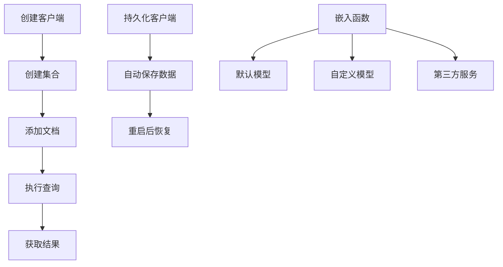
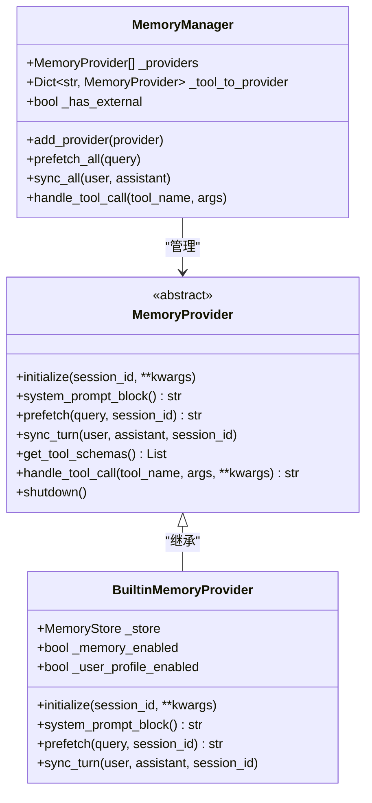
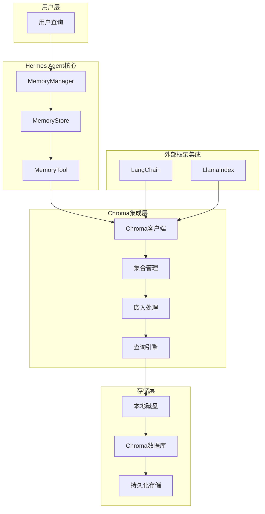
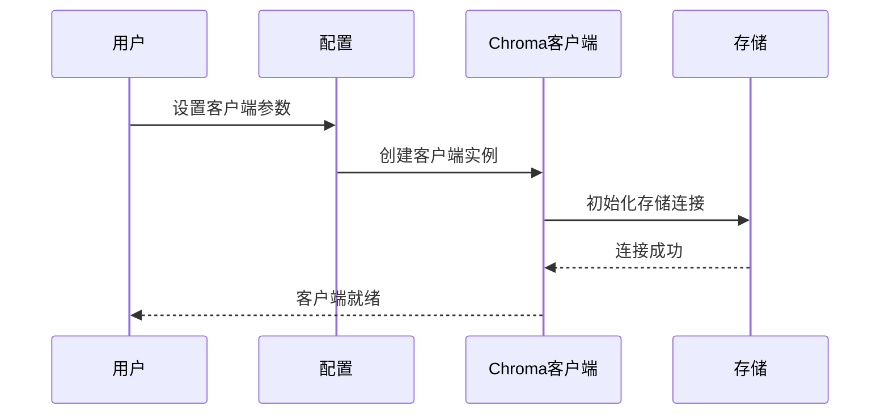
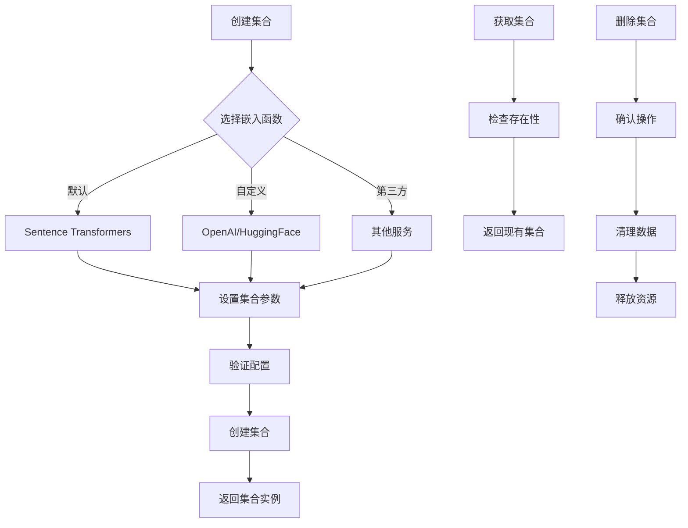
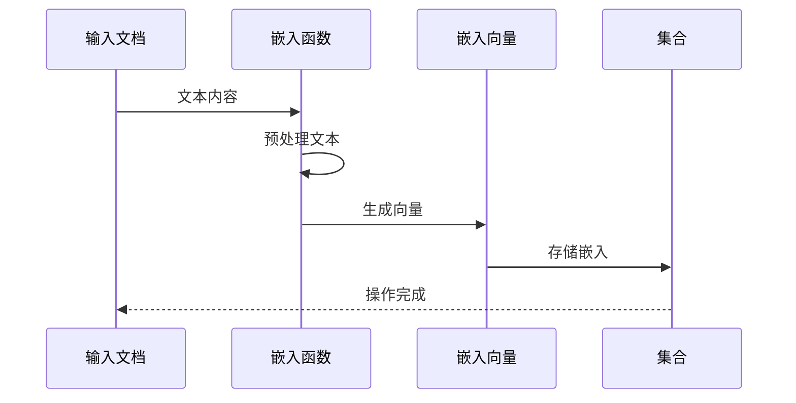
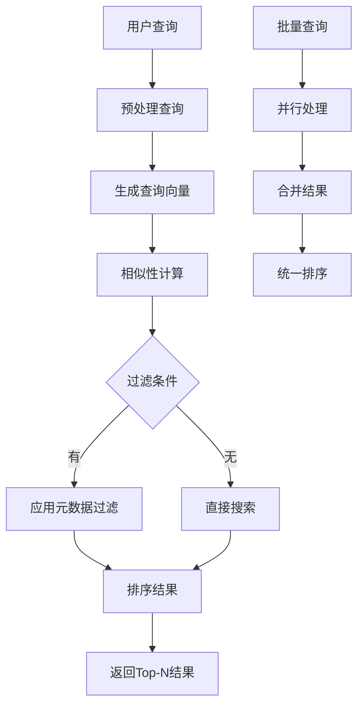
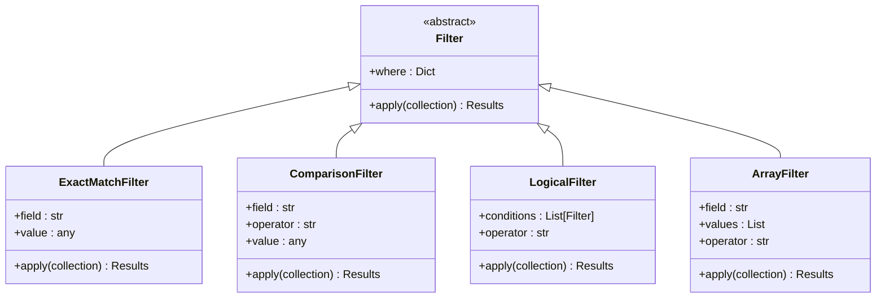
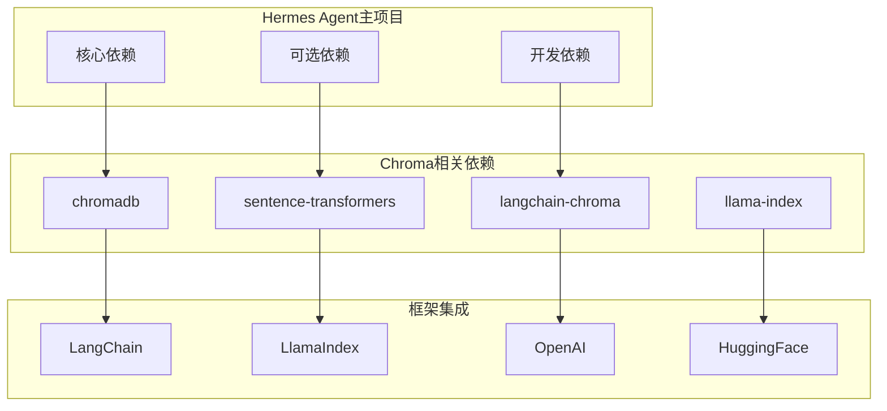
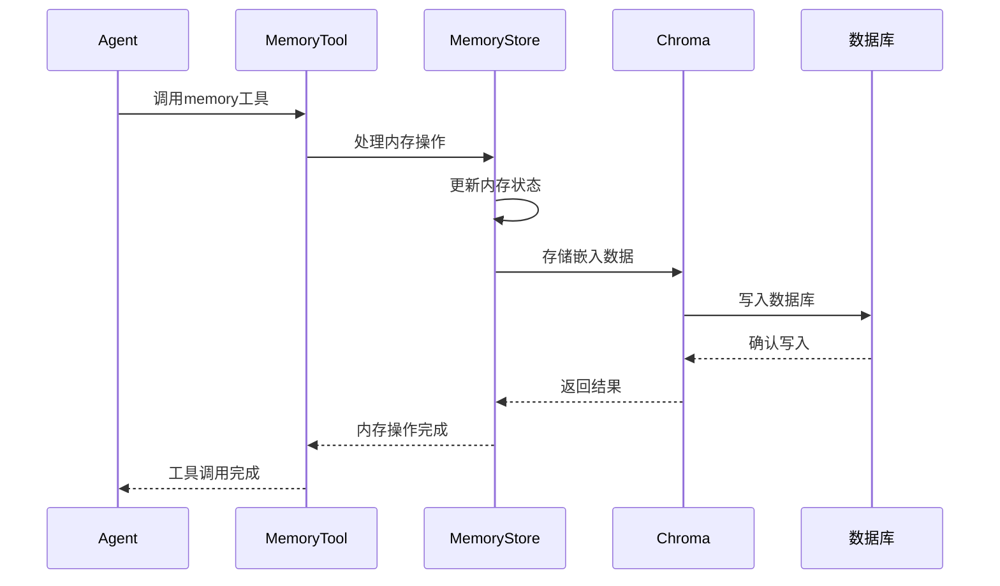

# Chroma向量数据库

<cite>
**本文档引用的文件**
- [SKILL.md](file://optional-skills/mlops/chroma/SKILL.md)
- [integration.md](file://optional-skills/mlops/chroma/references/integration.md)
- [memory_manager.py](file://agent/memory_manager.py)
- [builtin_memory_provider.py](file://agent/builtin_memory_provider.py)
- [memory_tool.py](file://tools/memory_tool.py)
- [pyproject.toml](file://pyproject.toml)
- [requirements.txt](file://requirements.txt)
</cite>

## 目录
1. [简介](#简介)
2. [项目结构](#项目结构)
3. [核心组件](#核心组件)
4. [架构概览](#架构概览)
5. [详细组件分析](#详细组件分析)
6. [依赖关系分析](#依赖关系分析)
7. [性能考虑](#性能考虑)
8. [故障排除指南](#故障排除指南)
9. [结论](#结论)

## 简介

Chroma是Hermes Agent项目中的一个可选MLOps技能，提供开源嵌入数据库功能。作为AI原生数据库，Chroma专为构建LLM应用程序而设计，支持语义搜索、RAG（检索增强生成）应用和文档检索。

Chroma的主要特性包括：
- 存储嵌入和元数据
- 执行向量和全文搜索
- 基于元数据的过滤
- 简单的4功能API
- 从笔记本到生产集群的扩展能力
- 本地开发和开源项目的最佳选择

## 项目结构

在Hermes Agent项目中，Chroma相关文件位于以下位置：

```mermaid
graph TB
subgraph "Hermes Agent项目结构"
A[optional-skills/mlops/chroma/] --> B[SKILL.md]
A --> C[references/]
C --> D[integration.md]
E[agent/] --> F[memory_manager.py]
E --> G[builtin_memory_provider.py]
H[tools/] --> I[memory_tool.py]
J[根目录] --> K[pyproject.toml]
J --> L[requirements.txt]
end
end
```

**图表来源**
- [SKILL.md:1-410](file://optional-skills/mlops/chroma/SKILL.md#L1-L410)
- [integration.md:1-39](file://optional-skills/mlops/chroma/references/integration.md#L1-L39)

**章节来源**
- [SKILL.md:1-410](file://optional-skills/mlops/chroma/SKILL.md#L1-L410)
- [integration.md:1-39](file://optional-skills/mlops/chroma/references/integration.md#L1-L39)

## 核心组件

### Chroma技能模块

Chroma技能通过SKILL.md文件提供了完整的功能描述和使用指南：

#### 主要功能特性
- **嵌入存储**：支持多种嵌入函数（默认Sentence Transformers、OpenAI、HuggingFace）
- **元数据过滤**：支持精确匹配、比较运算符、逻辑运算符和包含操作
- **持久化存储**：支持本地磁盘持久化和服务器模式
- **框架集成**：与LangChain和LlamaIndex无缝集成

#### 核心操作流程



**图表来源**
- [SKILL.md:52-202](file://optional-skills/mlops/chroma/SKILL.md#L52-L202)

**章节来源**
- [SKILL.md:18-40](file://optional-skills/mlops/chroma/SKILL.md#L18-L40)
- [SKILL.md:79-202](file://optional-skills/mlops/chroma/SKILL.md#L79-L202)

### 内存管理系统集成

Hermes Agent的内存管理系统为Chroma的集成提供了基础架构：

#### MemoryManager类架构



**图表来源**
- [memory_manager.py:72-368](file://agent/memory_manager.py#L72-L368)
- [builtin_memory_provider.py:24-115](file://agent/builtin_memory_provider.py#L24-L115)

**章节来源**
- [memory_manager.py:72-368](file://agent/memory_manager.py#L72-L368)
- [builtin_memory_provider.py:24-115](file://agent/builtin_memory_provider.py#L24-L115)

## 架构概览

### Chroma在Hermes Agent中的集成架构



**图表来源**
- [memory_manager.py:1-368](file://agent/memory_manager.py#L1-L368)
- [memory_tool.py:1-561](file://tools/memory_tool.py#L1-L561)
- [SKILL.md:309-358](file://optional-skills/mlops/chroma/SKILL.md#L309-L358)

## 详细组件分析

### Chroma客户端配置

#### 客户端类型对比

| 客户端类型 | 使用场景 | 特点 | 性能 |
|-----------|----------|------|------|
| Client | 本地开发 | 单机运行，简单易用 | 低延迟 |
| PersistentClient | 生产环境 | 磁盘持久化，数据不丢失 | 中等延迟 |
| HttpClient | 多用户环境 | 服务器模式，网络访问 | 网络延迟 |

#### 配置选项详解



**图表来源**
- [SKILL.md:204-217](file://optional-skills/mlops/chroma/SKILL.md#L204-L217)

**章节来源**
- [SKILL.md:204-217](file://optional-skills/mlops/chroma/SKILL.md#L204-L217)

### 集合管理与索引

#### 集合操作流程



**图表来源**
- [SKILL.md:81-105](file://optional-skills/mlops/chroma/SKILL.md#L81-L105)

**章节来源**
- [SKILL.md:81-105](file://optional-skills/mlops/chroma/SKILL.md#L81-L105)

### 文档嵌入处理

#### 嵌入函数类型

| 嵌入函数类型 | 默认模型 | 适用场景 | 性能特点 |
|-------------|----------|----------|----------|
| Sentence Transformers | all-MiniLM-L6-v2 | 通用文本嵌入 | 平衡速度和质量 |
| OpenAI | text-embedding-3-small | 高质量嵌入 | 速度快但需API密钥 |
| HuggingFace | sentence-transformers/all-mpnet-base-v2 | 研究用途 | 质量高但较慢 |
| 自定义 | 用户定义 | 特定需求 | 灵活可定制 |

#### 嵌入处理流程



**图表来源**
- [SKILL.md:219-274](file://optional-skills/mlops/chroma/SKILL.md#L219-L274)

**章节来源**
- [SKILL.md:219-274](file://optional-skills/mlops/chroma/SKILL.md#L219-L274)

### 查询优化与相似性搜索

#### 查询处理流程



**图表来源**
- [SKILL.md:129-161](file://optional-skills/mlops/chroma/SKILL.md#L129-L161)

**章节来源**
- [SKILL.md:129-161](file://optional-skills/mlops/chroma/SKILL.md#L129-L161)

### 元数据过滤系统

#### 过滤器类型



**图表来源**
- [SKILL.md:276-307](file://optional-skills/mlops/chroma/SKILL.md#L276-L307)

**章节来源**
- [SKILL.md:276-307](file://optional-skills/mlops/chroma/SKILL.md#L276-L307)

### 批量操作优化

#### 批量处理策略

| 操作类型 | 最佳实践 | 性能建议 | 注意事项 |
|----------|----------|----------|----------|
| 批量添加 | 100-1000条记录 | 减少网络往返 | 控制批次大小 |
| 批量更新 | 分批处理 | 使用事务 | 避免超时 |
| 批量删除 | 条件筛选 | 先查询后删除 | 确保准确性 |
| 批量查询 | 合理分页 | 缓存常用查询 | 限制结果数量 |

**章节来源**
- [SKILL.md:380-391](file://optional-skills/mlops/chroma/SKILL.md#L380-L391)

## 依赖关系分析

### 外部依赖管理

#### 项目依赖结构



**图表来源**
- [pyproject.toml:13-37](file://pyproject.toml#L13-L37)
- [requirements.txt:1-37](file://requirements.txt#L1-L37)

**章节来源**
- [pyproject.toml:13-37](file://pyproject.toml#L13-L37)
- [requirements.txt:1-37](file://requirements.txt#L1-L37)

### 内存系统集成

#### 内存工具与Chroma的关系



**图表来源**
- [memory_tool.py:439-477](file://tools/memory_tool.py#L439-L477)
- [memory_manager.py:243-262](file://agent/memory_manager.py#L243-L262)

**章节来源**
- [memory_tool.py:439-477](file://tools/memory_tool.py#L439-L477)
- [memory_manager.py:243-262](file://agent/memory_manager.py#L243-L262)

## 性能考虑

### 性能基准测试

根据官方文档提供的性能指标：

| 操作类型 | 预期延迟 | 影响因素 |
|----------|----------|----------|
| 添加100个文档 | ~1-3秒 | 嵌入生成时间 |
| 查询(前10个) | ~50-200毫秒 | 集合大小、索引类型 |
| 元数据过滤 | ~10-50毫秒 | 过滤条件复杂度 |

### 优化策略

#### 硬件配置建议
- **CPU**: 至少8核处理器
- **内存**: 16GB RAM起步
- **存储**: SSD固态硬盘
- **网络**: 千兆以太网

#### 软件优化
- **批处理**: 合理设置批次大小
- **缓存**: 利用查询结果缓存
- **索引**: 选择合适的索引类型
- **监控**: 实时监控系统性能

## 故障排除指南

### 常见问题及解决方案

#### 连接问题
- **问题**: 无法连接到Chroma服务器
- **解决方案**: 检查网络连接、端口配置和防火墙设置

#### 性能问题
- **问题**: 查询响应缓慢
- **解决方案**: 优化过滤条件、增加硬件资源、调整索引设置

#### 数据一致性问题
- **问题**: 数据不同步
- **解决方案**: 检查持久化配置、验证事务处理

#### 内存泄漏
- **问题**: 内存使用持续增长
- **解决方案**: 检查资源释放、优化批量操作

**章节来源**
- [SKILL.md:380-407](file://optional-skills/mlops/chroma/SKILL.md#L380-L407)

## 结论

Chroma作为Hermes Agent中的重要组件，为项目提供了强大的向量数据库能力。通过与其他MLOps工具的集成，Chroma能够支持复杂的RAG应用和语义搜索功能。

### 主要优势
1. **开源免费**: Apache 2.0许可证，适合各种规模的项目
2. **易于使用**: 简单的API设计，快速上手
3. **功能完整**: 支持嵌入存储、元数据过滤和多种查询方式
4. **扩展性强**: 支持从个人开发到生产部署的各种场景

### 最佳实践建议
1. **合理选择嵌入模型**: 根据应用需求平衡速度和质量
2. **优化查询性能**: 使用适当的过滤条件和索引策略
3. **监控系统健康**: 建立完善的监控和告警机制
4. **备份数据**: 定期备份Chroma数据库，确保数据安全

通过遵循这些指导原则，开发者可以充分利用Chroma的强大功能，构建高性能的AI应用程序。