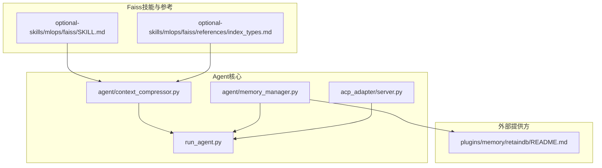
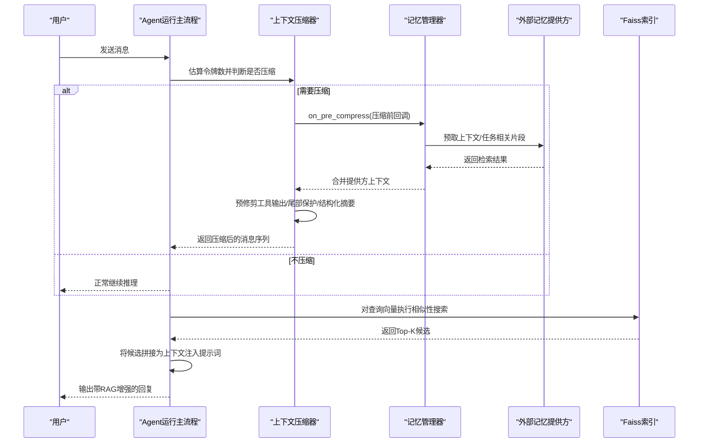
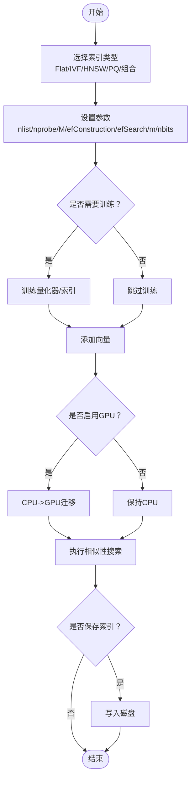
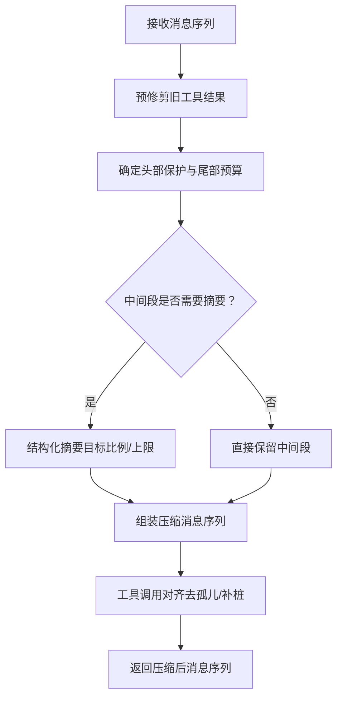
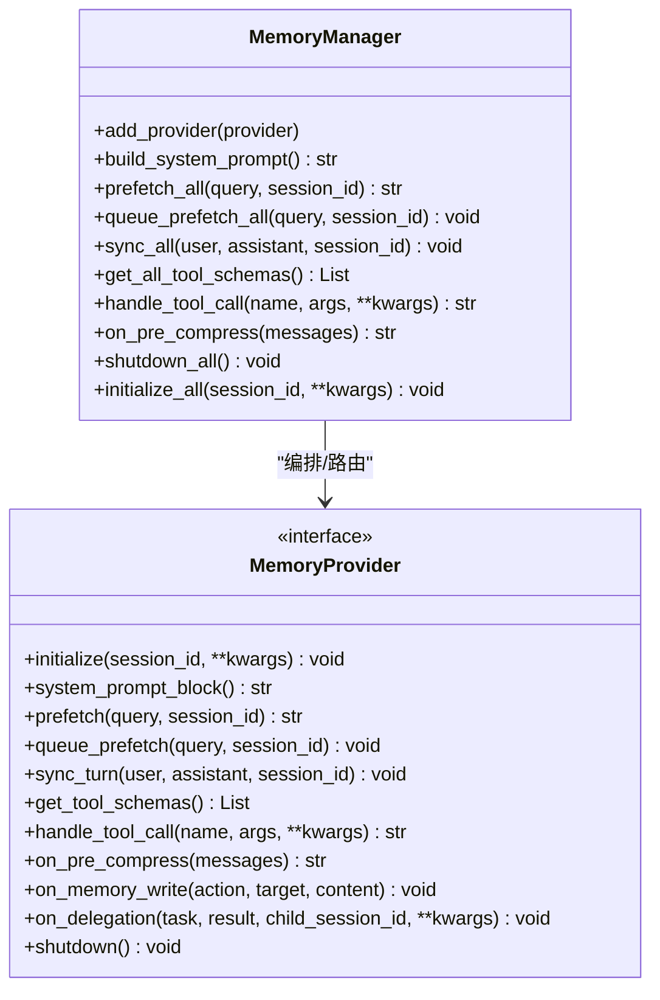
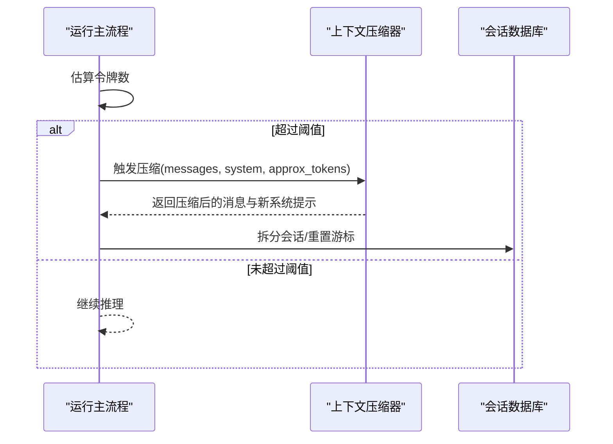
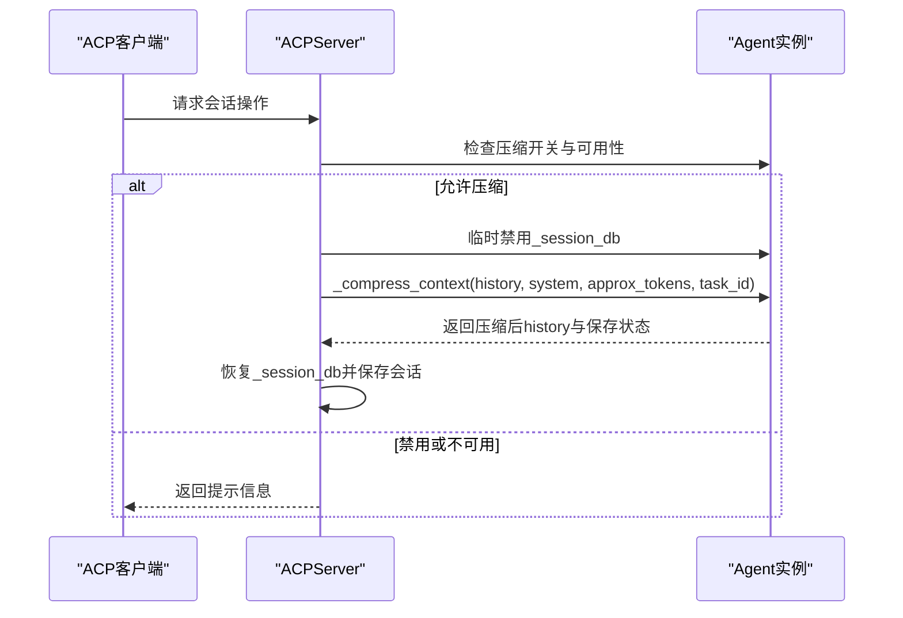
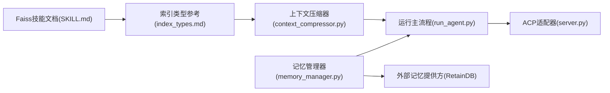

# Faiss向量数据库

<cite>
**本文引用的文件**
- [SKILL.md](file://optional-skills/mlops/faiss/SKILL.md)
- [index_types.md](file://optional-skills/mlops/faiss/references/index_types.md)
- [context_compressor.py](file://agent/context_compressor.py)
- [memory_manager.py](file://agent/memory_manager.py)
- [run_agent.py](file://run_agent.py)
- [server.py](file://acp_adapter/server.py)
- [README.md](file://plugins/memory/retaindb/README.md)
</cite>

## 目录
1. [简介](#简介)
2. [项目结构](#项目结构)
3. [核心组件](#核心组件)
4. [架构总览](#架构总览)
5. [详细组件分析](#详细组件分析)
6. [依赖关系分析](#依赖关系分析)
7. [性能考量](#性能考量)
8. [故障排查指南](#故障排查指南)
9. [结论](#结论)
10. [附录](#附录)

## 简介
本文件面向Hermes Agent中的Faiss向量数据库工具，系统化阐述其在大规模向量相似性搜索中的能力与实践路径。Faiss由Meta开发，支持数十亿级向量的高效相似性检索，具备多种索引类型（精确搜索、倒排文件IVF、分层导航图HNSW、乘积量化PQ），并可结合GPU加速与内存压缩，在高吞吐、低延迟场景下实现稳定性能。

在Hermes Agent中，Faiss可作为检索增强（RAG）与代理上下文压缩的关键支撑：一方面用于从海量记忆或知识库中快速召回相关片段；另一方面配合内置的上下文压缩器，将长对话压缩到模型上下文窗口内，保障推理稳定性与成本控制。

## 项目结构
与Faiss相关的知识与实践主要沉淀于以下位置：
- optional-skills/mlops/faiss：Faiss技能说明与索引类型参考
- agent/context_compressor.py：上下文压缩与摘要生成逻辑
- agent/memory_manager.py：多记忆提供方编排（含外部提供方生命周期钩子）
- run_agent.py：上下文压缩入口与会话拆分
- acp_adapter/server.py：通过ACP接口触发上下文压缩
- plugins/memory/retaindb/README.md：云上记忆提供方示例（对比理解向量检索在真实场景中的位置）

**图表来源**
- [SKILL.md](file://optional-skills/mlops/faiss/SKILL.md)
- [index_types.md](file://optional-skills/mlops/faiss/references/index_types.md)
- [context_compressor.py](file://agent/context_compressor.py)
- [memory_manager.py](file://agent/memory_manager.py)
- [run_agent.py](file://run_agent.py)
- [server.py](file://acp_adapter/server.py)
- [README.md](file://plugins/memory/retaindb/README.md)

**章节来源**
- [SKILL.md](file://optional-skills/mlops/faiss/SKILL.md)
- [index_types.md](file://optional-skills/mlops/faiss/references/index_types.md)
- [context_compressor.py](file://agent/context_compressor.py)
- [memory_manager.py](file://agent/memory_manager.py)
- [run_agent.py](file://run_agent.py)
- [server.py](file://acp_adapter/server.py)
- [README.md](file://plugins/memory/retaindb/README.md)

## 核心组件
- Faiss技能文档：概述Faiss适用场景、安装方式、基础用法、索引类型、保存加载、GPU加速与集成示例，并给出最佳实践与性能对比。
- Faiss索引类型参考：系统梳理Flat/IVF/HNSW/PQ等索引的参数、适用规模、训练需求、精度与速度权衡，以及nprobe/efSearch等调优要点。
- 上下文压缩器：在接近模型上下文上限时，对历史消息进行预修剪、尾部保护、结构化摘要与工具调用对齐，确保摘要注入后API可用。
- 记忆管理器：统一编排内置与外部记忆提供方，提供预取、同步、工具路由与生命周期钩子（如压缩前回调）。
- 运行主流程：在对话循环中触发上下文压缩，必要时拆分会话并重置写入游标，以适配索引重建与增量写入。
- ACP适配器：通过ACP会话接口触发压缩，避免SQLite会话分裂带来的副作用，同时保持稳定的会话ID。

**章节来源**
- [SKILL.md](file://optional-skills/mlops/faiss/SKILL.md)
- [index_types.md](file://optional-skills/mlops/faiss/references/index_types.md)
- [context_compressor.py](file://agent/context_compressor.py)
- [memory_manager.py](file://agent/memory_manager.py)
- [run_agent.py](file://run_agent.py)
- [server.py](file://acp_adapter/server.py)

## 架构总览
下图展示Faiss在Hermes Agent中的典型工作流：Agent在运行期根据上下文压力触发压缩，随后通过记忆提供方或本地索引进行语义检索，最终将召回结果注入提示词，完成RAG增强。

**图表来源**
- [context_compressor.py](file://agent/context_compressor.py)
- [memory_manager.py](file://agent/memory_manager.py)
- [run_agent.py](file://run_agent.py)
- [SKILL.md](file://optional-skills/mlops/faiss/SKILL.md)

## 详细组件分析

### Faiss索引类型与参数调优
- Flat（精确搜索）：适用于小规模数据集（<1万），保证100%召回，但查询较慢。
- IVF（倒排文件）：中等规模（1万–100万）的近似搜索首选，需训练量化器；关键参数nlist与nprobe决定聚类数量与搜索覆盖。
- HNSW（分层导航图）：高质量近似搜索，适合100万–1000万级，无需训练，但内存占用较高；efConstruction与efSearch影响构建质量与查询精度。
- PQ（乘积量化）：内存高效方案，适合超大规模（>1000万），可与IVF组合（IVF+PQ）以兼顾速度与存储。
- GPU加速：单/多GPU迁移显著提升吞吐，适合大规模检索。
- 保存与加载：训练好的索引持久化，避免重复训练成本。

**图表来源**
- [index_types.md](file://optional-skills/mlops/faiss/references/index_types.md)
- [SKILL.md](file://optional-skills/mlops/faiss/SKILL.md)

**章节来源**
- [index_types.md](file://optional-skills/mlops/faiss/references/index_types.md)
- [SKILL.md](file://optional-skills/mlops/faiss/SKILL.md)

### 上下文压缩与RAG注入
上下文压缩器负责在接近模型上下文限制时，对历史消息进行“预修剪—尾部保护—结构化摘要—工具对齐”处理，确保摘要注入后API可用且信息不丢失。该流程与Faiss检索结合，可在压缩后将Top-K候选注入提示词，形成RAG增强。

**图表来源**
- [context_compressor.py](file://agent/context_compressor.py)

**章节来源**
- [context_compressor.py](file://agent/context_compressor.py)

### 记忆管理器与外部提供方集成
记忆管理器统一注册与编排多个记忆提供方，支持：
- 系统提示块构建
- 预取与队列预取
- 轮次同步与生命周期钩子
- 工具路由与错误处理
- 压缩前回调（on_pre_compress）用于合并提供方上下文

**图表来源**
- [memory_manager.py](file://agent/memory_manager.py)

**章节来源**
- [memory_manager.py](file://agent/memory_manager.py)

### 运行主流程中的上下文压缩
运行主流程在对话循环中检测上下文压力，必要时触发压缩并拆分会话，重置写入游标，使后续索引重建与增量写入更可控。

**图表来源**
- [run_agent.py](file://run_agent.py)
- [context_compressor.py](file://agent/context_compressor.py)

**章节来源**
- [run_agent.py](file://run_agent.py)
- [context_compressor.py](file://agent/context_compressor.py)

### ACP接口中的上下文压缩
ACP适配器在处理会话请求时，若需要压缩，会临时屏蔽内部会话数据库以避免会话分裂副作用，再调用压缩逻辑并保存会话状态。

**图表来源**
- [server.py](file://acp_adapter/server.py)

**章节来源**
- [server.py](file://acp_adapter/server.py)

## 依赖关系分析
- Faiss技能文档与索引类型参考为上下文压缩与检索增强提供理论依据与参数指导。
- 上下文压缩器依赖模型元数据与令牌估算，确保在压缩前后维持合理的上下文预算。
- 记忆管理器为外部提供方（如RetainDB）提供统一接入点，便于在压缩前聚合多源上下文。
- 运行主流程与ACP适配器共同决定何时触发压缩与如何处理会话状态。

**图表来源**
- [SKILL.md](file://optional-skills/mlops/faiss/SKILL.md)
- [index_types.md](file://optional-skills/mlops/faiss/references/index_types.md)
- [context_compressor.py](file://agent/context_compressor.py)
- [memory_manager.py](file://agent/memory_manager.py)
- [run_agent.py](file://run_agent.py)
- [server.py](file://acp_adapter/server.py)
- [README.md](file://plugins/memory/retaindb/README.md)

**章节来源**
- [SKILL.md](file://optional-skills/mlops/faiss/SKILL.md)
- [index_types.md](file://optional-skills/mlops/faiss/references/index_types.md)
- [context_compressor.py](file://agent/context_compressor.py)
- [memory_manager.py](file://agent/memory_manager.py)
- [run_agent.py](file://run_agent.py)
- [server.py](file://acp_adapter/server.py)
- [README.md](file://plugins/memory/retaindb/README.md)

## 性能考量
- 索引选择与规模匹配：小规模用Flat，中规模用IVF，追求极致质量用HNSW，超大规模结合PQ或IVF+PQ。
- 参数调优：nprobe/efSearch平衡速度与召回；M/efConstruction影响构建与查询质量；m/nbits决定内存节省与精度。
- GPU加速：单/多GPU迁移显著提升吞吐，建议在百万级向量以上启用。
- 内存管理：优先使用PQ降低存储；合理设置nlist与nprobe；定期持久化训练好的索引。
- 批量查询：提高GPU利用率，减少调度开销。
- 检索增强：在压缩后将Top-K候选注入提示词，结合结构化摘要，提升信息密度与相关性。

[本节为通用性能建议，不直接分析具体文件]

## 故障排查指南
- 压缩失败冷却：当摘要生成失败时，压缩器会进入冷却期，避免频繁重试导致资源浪费。
- 工具调用对齐：压缩后自动清理孤儿工具结果与补全缺失结果，确保消息序列满足API约束。
- 会话拆分与游标重置：压缩后拆分会话并重置游标，防止索引重建与增量写入冲突。
- ACP压缩保护：在ACP会话中临时禁用内部会话数据库，避免会话分裂副作用。

**章节来源**
- [context_compressor.py](file://agent/context_compressor.py)
- [run_agent.py](file://run_agent.py)
- [server.py](file://acp_adapter/server.py)

## 结论
在Hermes Agent中，Faiss凭借其多样化的索引类型、GPU加速与内存压缩能力，能够有效支撑大规模向量检索与RAG增强。结合上下文压缩器与记忆管理器，系统在长对话与复杂任务中实现了高吞吐、低延迟与信息完整性之间的平衡。通过合理的索引选择、参数调优与生命周期管理，Faiss可成为代理上下文压缩与检索增强的可靠基石。

[本节为总结性内容，不直接分析具体文件]

## 附录
- 安装与基础用法：参见Faiss技能文档中的安装与快速入门示例。
- 索引工厂字符串：通过字符串描述快速创建索引，便于批量部署与实验。
- 与其他向量数据库对比：Faiss强调纯相似性搜索与高性能，若需要元数据过滤，可考虑其他方案。

**章节来源**
- [SKILL.md](file://optional-skills/mlops/faiss/SKILL.md)
- [index_types.md](file://optional-skills/mlops/faiss/references/index_types.md)