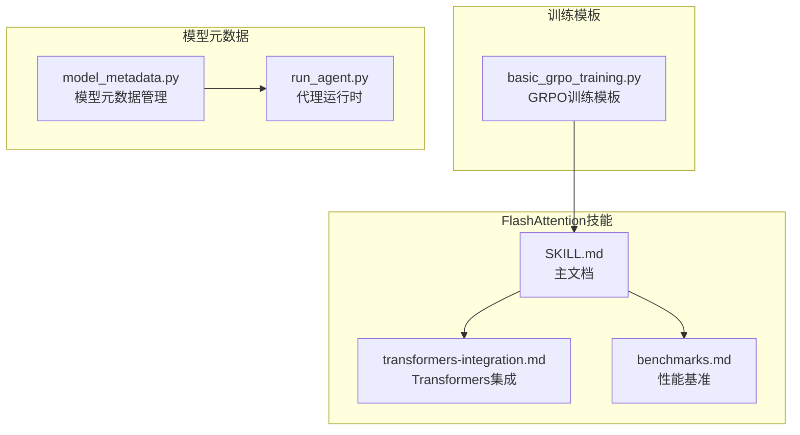
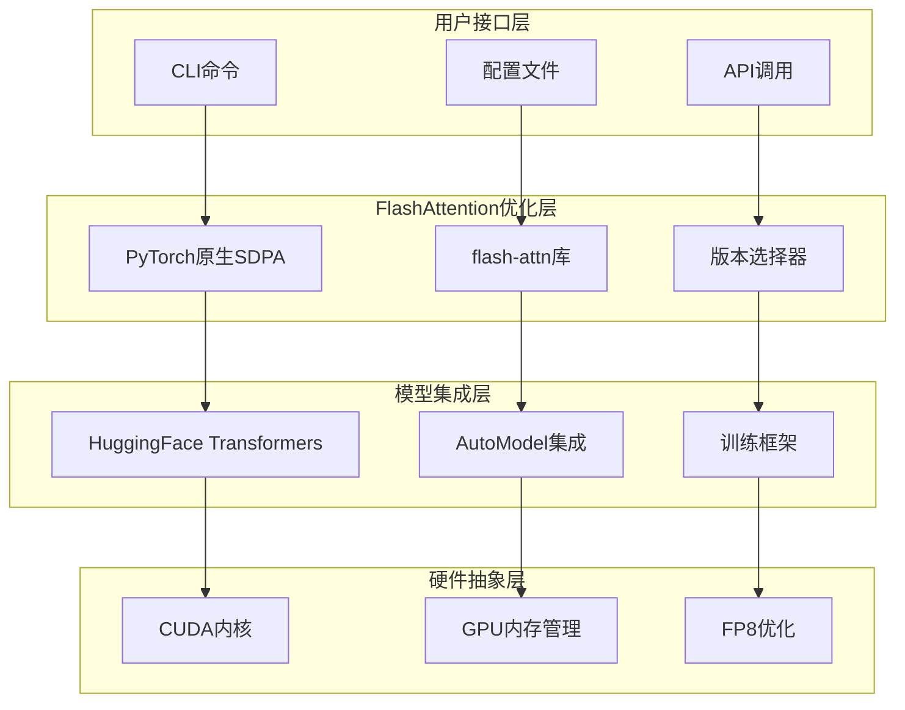
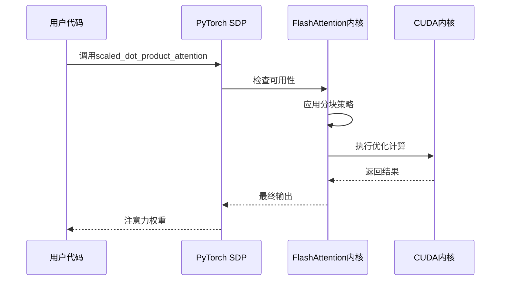
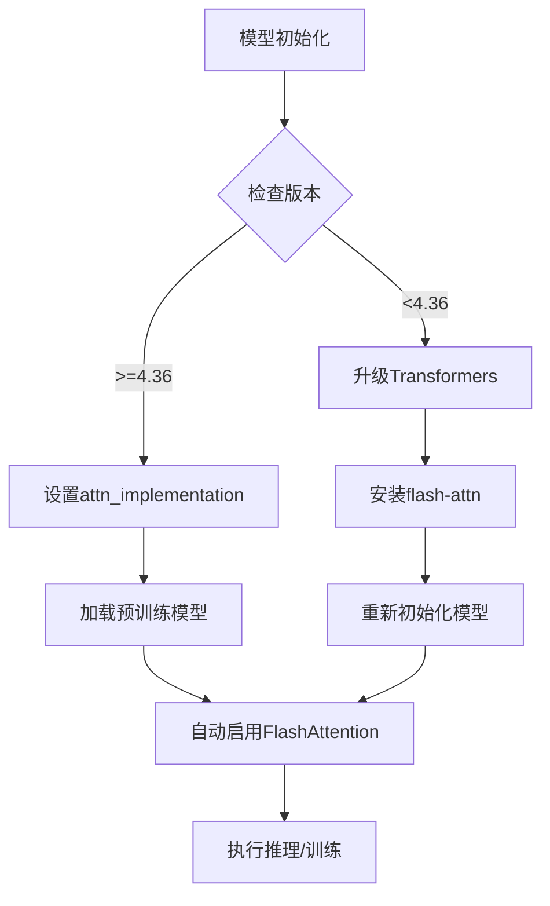
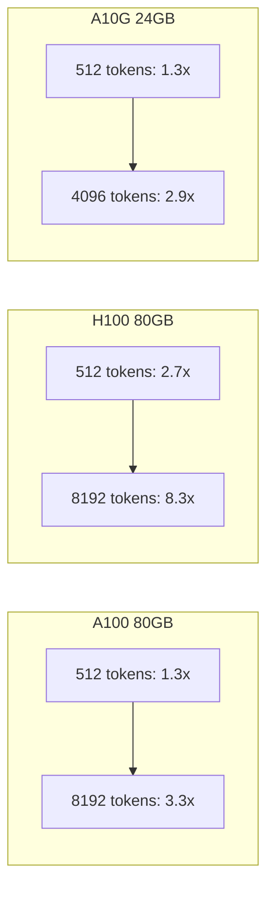

# FlashAttention优化

<cite>
**本文档引用的文件**
- [SKILL.md](file://optional-skills/mlops/flash-attention/SKILL.md)
- [transformers-integration.md](file://optional-skills/mlops/flash-attention/references/transformers-integration.md)
- [benchmarks.md](file://optional-skills/mlops/flash-attention/references/benchmarks.md)
- [basic_grpo_training.py](file://skills/mlops/training/grpo-rl-training/templates/basic_grpo_training.py)
- [requirements.txt](file://requirements.txt)
- [model_metadata.py](file://agent/model_metadata.py)
- [run_agent.py](file://run_agent.py)
</cite>

## 目录
1. [简介](#简介)
2. [项目结构](#项目结构)
3. [核心组件](#核心组件)
4. [架构概览](#架构概览)
5. [详细组件分析](#详细组件分析)
6. [依赖分析](#依赖分析)
7. [性能考虑](#性能考虑)
8. [故障排除指南](#故障排除指南)
9. [结论](#结论)
10. [附录](#附录)

## 简介

FlashAttention是Hermes Agent中一个重要的性能优化工具，专门用于优化Transformer模型中的注意力计算。该工具通过IO感知的分块策略和重计算技术，在保持数值精度的同时实现2-4倍的速度提升和10-20倍的内存减少。

FlashAttention在以下场景中特别有价值：
- 训练/运行具有长序列（>512个token）的Transformer模型
- 遇到注意力计算导致的GPU内存问题
- 需要更快的推理速度
- 多GPU训练环境中的内存管理

## 项目结构

Hermes Agent中的FlashAttention优化工具主要分布在以下位置：



**图表来源**
- [SKILL.md:1-371](file://optional-skills/mlops/flash-attention/SKILL.md#L1-L371)
- [transformers-integration.md:1-294](file://optional-skills/mlops/flash-attention/references/transformers-integration.md#L1-L294)

**章节来源**
- [SKILL.md:1-371](file://optional-skills/mlops/flash-attention/SKILL.md#L1-L371)
- [transformers-integration.md:1-294](file://optional-skills/mlops/flash-attention/references/transformers-integration.md#L1-L294)

## 核心组件

### FlashAttention基础概念

FlashAttention的核心原理基于以下三个关键机制：

1. **IO感知分块策略**：将注意力矩阵分解为可管理的块，避免完全加载到内存中
2. **重计算技术**：通过重新计算中间结果来节省内存空间
3. **并行化优化**：改进的并行策略和工作分区

### 支持的模型架构

根据Transformers集成文档，FlashAttention支持以下模型架构：

**完全支持**：
- Llama/Llama 2/Llama 3系列
- Mistral/Mixtral
- Falcon
- GPT-NeoX
- Phi/Phi-2/Phi-3
- Qwen/Qwen2
- Gemma
- Starcoder2
- GPT-J
- OPT
- BLOOM

**部分支持**（编码器-解码器）：
- BART
- T5/Flan-T5
- Whisper

**章节来源**
- [transformers-integration.md:32-61](file://optional-skills/mlops/flash-attention/references/transformers-integration.md#L32-L61)

## 架构概览

FlashAttention在Hermes Agent中的集成架构如下：



**图表来源**
- [SKILL.md:20-43](file://optional-skills/mlops/flash-attention/SKILL.md#L20-L43)
- [transformers-integration.md:10-31](file://optional-skills/mlops/flash-attention/references/transformers-integration.md#L10-L31)

## 详细组件分析

### PyTorch原生集成

Hermes Agent支持通过PyTorch原生的scaled_dot_product_attention函数自动启用FlashAttention：



**图表来源**
- [SKILL.md:71-92](file://optional-skills/mlops/flash-attention/SKILL.md#L71-L92)

### Transformers库集成

对于HuggingFace Transformers库，可以通过简单的配置参数启用FlashAttention：



**图表来源**
- [transformers-integration.md:14-24](file://optional-skills/mlops/flash-attention/references/transformers-integration.md#L14-L24)

**章节来源**
- [transformers-integration.md:14-31](file://optional-skills/mlops/flash-attention/references/transformers-integration.md#L14-L31)

### 多GPU训练优化

在多GPU环境中，FlashAttention提供了以下优化策略：

1. **模型并行**：利用device_map="auto"进行自动GPU分配
2. **内存限制**：通过max_memory参数控制每GPU内存使用
3. **梯度检查点**：结合gradient_checkpointing_reduce_memory使用

**章节来源**
- [transformers-integration.md:138-152](file://optional-skills/mlops/flash-attention/references/transformers-integration.md#L138-L152)

### 内存效率提升

FlashAttention通过以下方式显著提升内存效率：

| 序列长度 | 标准注意力 | Flash Attention 2 | 减少率 |
|---------|-----------|------------------|--------|
| 512 | 1.2 GB | 0.9 GB | 25% |
| 2048 | 3.8 GB | 1.4 GB | 63% |
| 8192 | 14.2 GB | 3.2 GB | 77% |
| 32768 | OOM (>24GB) | 10.8 GB | 可运行 |

**章节来源**
- [transformers-integration.md:156-163](file://optional-skills/mlops/flash-attention/references/transformers-integration.md#L156-L163)

### 计算速度优化

FlashAttention在不同GPU上的性能提升效果：



**图表来源**
- [benchmarks.md:12-48](file://optional-skills/mlops/flash-attention/references/benchmarks.md#L12-L48)

**章节来源**
- [benchmarks.md:12-48](file://optional-skills/mlops/flash-attention/references/benchmarks.md#L12-L48)

## 依赖分析

### 环境要求

FlashAttention的运行需要满足以下硬件和软件要求：

**硬件要求**：
- GPU：NVIDIA Ampere+(A100, A10, A30)或AMD MI200+
- VRAM：与标准注意力相同（FlashAttention不增加内存）
- CUDA：12.0+（11.8最低要求）
- PyTorch：2.2+（原生支持）

**软件依赖**：
- flash-attn库（可选，但推荐）
- HuggingFace Transformers >=4.36
- PyTorch >=2.2

**章节来源**
- [SKILL.md:352-359](file://optional-skills/mlops/flash-attention/SKILL.md#L352-L359)

### 依赖关系图

```mermaid
graph TB
subgraph "系统依赖"
A[Python 3.8+]
B[NVIDIA GPU]
C[CUDA 12.0+]
end
subgraph "Python包依赖"
D[torch>=2.2]
E[transformers>=4.36]
F[flash-attn(可选)]
end
subgraph "Hermes Agent集成"
G[SKILL.md]
H[training模板]
I[model_metadata]
end
A --> D
B --> C
C --> D
D --> E
E --> F
F --> G
G --> H
I --> G
```

**图表来源**
- [requirements.txt:1-37](file://requirements.txt#L1-L37)
- [SKILL.md:352-359](file://optional-skills/mlops/flash-attention/SKILL.md#L352-L359)

**章节来源**
- [requirements.txt:1-37](file://requirements.txt#L1-L37)

## 性能考虑

### 不同使用场景的建议

**训练大型模型（>7B参数）**：
- A100上使用Flash Attention 2
- H100上使用Flash Attention 3 FP8以获得最大速度
- 预期：2.5-3倍速度提升

**长上下文推理（>4K tokens）**：
- FlashAttention是必需的（标准注意力无法处理）
- 预期：2-4倍速度提升，5-10倍内存减少

**短序列（<512 tokens）**：
- FlashAttention提供1.2-1.5倍速度提升
- 内存收益很小
- 仍值得启用（无副作用）

**多用户服务**：
- FlashAttention减少每个请求的内存
- 允许更高的并发批大小
- 可在相同硬件上服务2-3倍更多的用户

### 性能基准对比

```mermaid
graph TB
subgraph "计算复杂度"
A[标准注意力:<br/>时间O(N²×d)<br/>内存O(N²+N×d)]
B[Flash Attention:<br/>时间O(N²×d)<br/>内存O(N×d)]
end
subgraph "实际性能"
C[速度提升:<br/>随序列长度增加而增大]
D[内存节省:<br/>恒定内存占用]
end
A --> C
B --> D
```

**图表来源**
- [benchmarks.md:95-125](file://optional-skills/mlops/flash-attention/references/benchmarks.md#L95-L125)

**章节来源**
- [benchmarks.md:95-125](file://optional-skills/mlops/flash-attention/references/benchmarks.md#L95-L125)

## 故障排除指南

### 常见问题及解决方案

**导入错误（ImportError: cannot import flash_attn）**：
- 使用--no-build-isolation标志安装
- 或先安装CUDA工具包再安装flash-attn

**性能提升不明显**：
- FlashAttention的优势随着序列长度增加而增大
- <512 tokens：提升10-20%
- 512-2K tokens：2-3x提升
- >2K tokens：3-4x提升

**CUDA错误**：
- 验证GPU支持FlashAttention
- 需要≥(7,5)的设备能力（图灵+）
- 支持：Ampere(A100,T4)、图灵(T4)
- 不支持：Volta(V100)

**精度问题**：
- FlashAttention使用float16/bfloat16进行速度优化
- 浮点32不支持
- 数值差异应在1e-3范围内

**章节来源**
- [SKILL.md:295-341](file://optional-skills/mlops/flash-attention/SKILL.md#L295-L341)

### 模型特定问题

**模型不支持Flash Attention**：
- 查看支持列表
- 使用PyTorch原生SDPA作为回退方案

**加载时CUDA内存不足**：
- 使用device_map="auto"进行自动内存管理
- 设置max_memory限制每GPU内存
- 启用low_cpu_mem_usage

**推理速度慢于预期**：
- 确保模型和输入都使用float16/bfloat16
- 检查dtype匹配

**章节来源**
- [transformers-integration.md:181-259](file://optional-skills/mlops/flash-attention/references/transformers-integration.md#L181-L259)

## 结论

FlashAttention为Hermes Agent提供了强大的性能优化能力，特别是在处理长序列和大规模模型时。通过合理的配置和最佳实践，可以实现显著的性能提升和内存节省。

关键优势总结：
1. **性能提升**：2-4倍速度提升，特别是长序列场景
2. **内存效率**：10-20倍内存减少，支持更大的上下文
3. **易用性**：简单的配置即可启用
4. **兼容性**：广泛支持主流Transformer模型架构
5. **扩展性**：支持多GPU训练和推理

建议在以下场景中优先考虑使用FlashAttention：
- 长上下文推理（>2K tokens）
- 大型模型训练（>7B参数）
- 内存受限的部署环境
- 需要高并发服务的生产环境

## 附录

### 实际应用示例

在Hermes Agent中，FlashAttention已经在多个训练模板中得到应用：

**GRPO训练模板中的集成**：
- 使用attn_implementation="flash_attention_2"参数
- 配合bf16精度和梯度检查点
- 支持LoRA参数高效微调

**章节来源**
- [basic_grpo_training.py:126-138](file://skills/mlops/training/grpo-rl-training/templates/basic_grpo_training.py#L126-L138)

### 模型上下文管理

Hermes Agent还提供了智能的模型上下文管理功能，与FlashAttention优化相辅相成：

**上下文压缩机制**：
- 自动检测模型上下文限制
- 在接近限制时进行内容压缩
- 支持保护重要对话片段

**章节来源**
- [run_agent.py:1140-1190](file://run_agent.py#L1140-L1190)
- [model_metadata.py:778-800](file://agent/model_metadata.py#L778-L800)