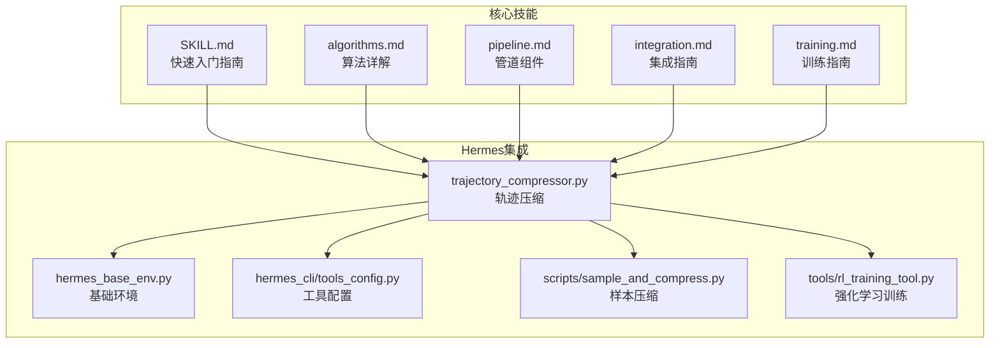
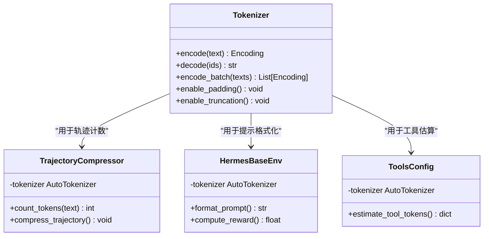
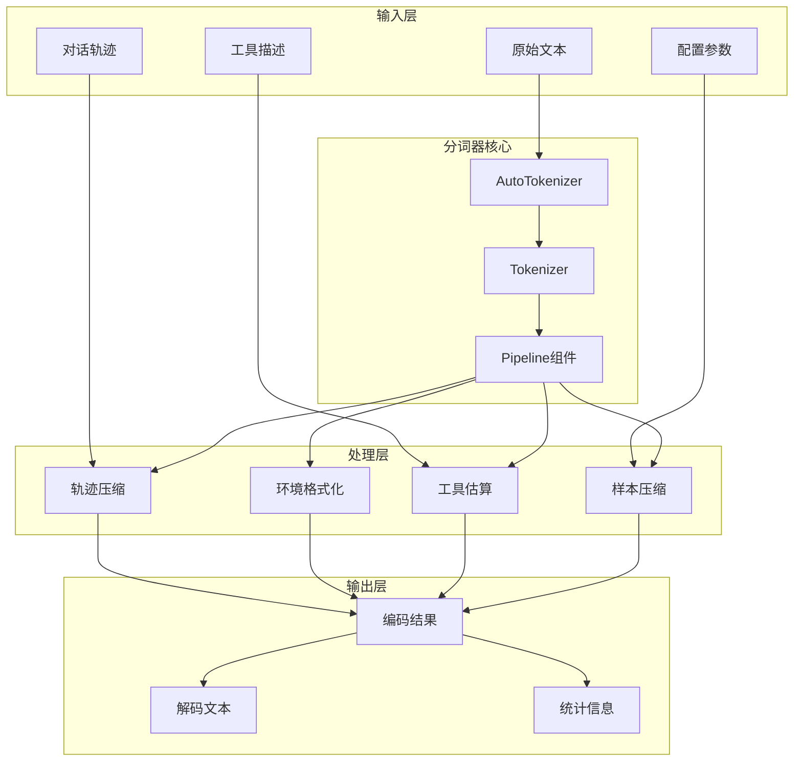
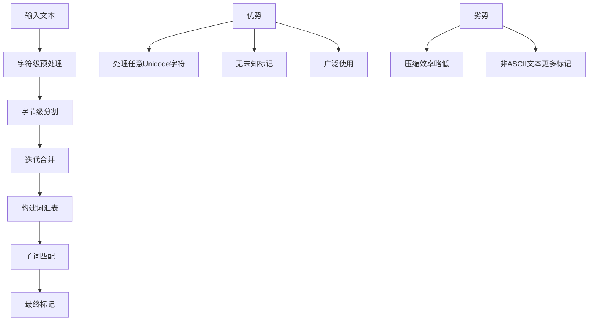
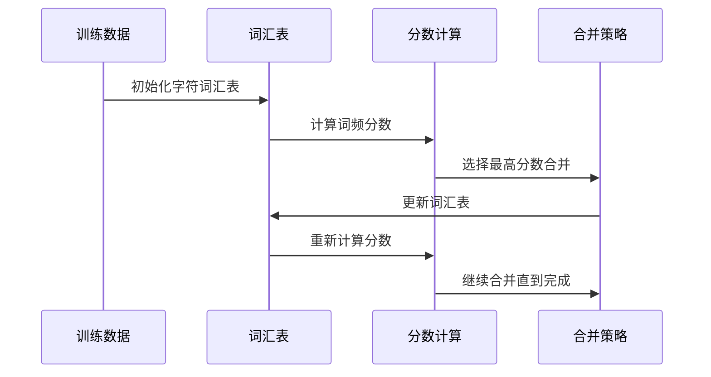
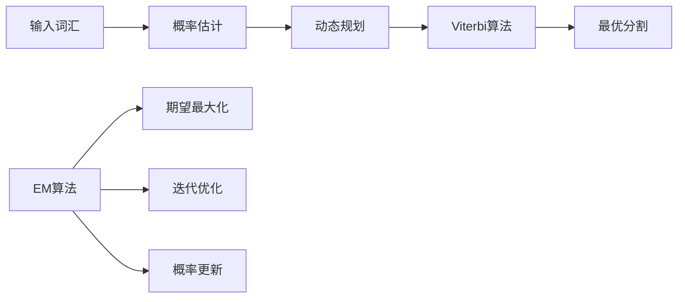
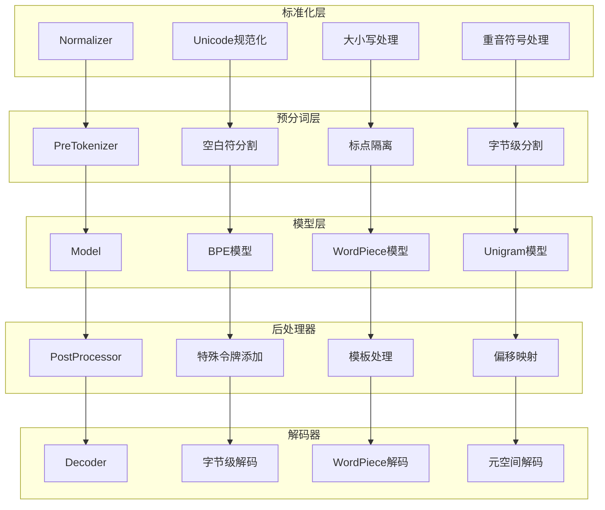
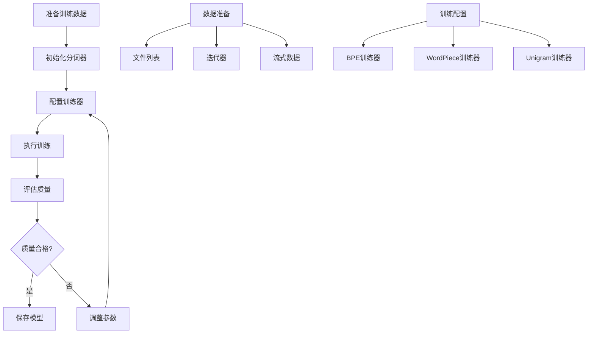
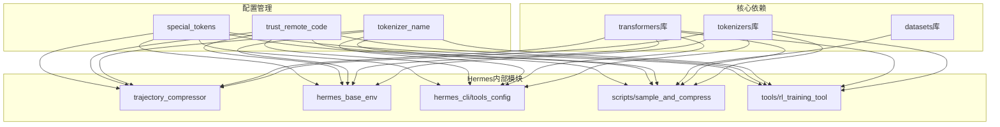
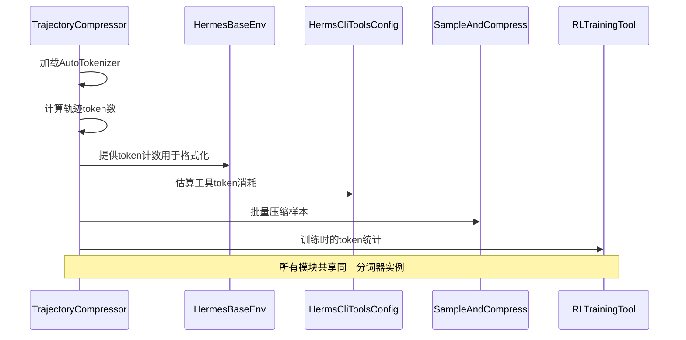

# HuggingFace分词器

<cite>
**本文档引用的文件**
- [SKILL.md](file://optional-skills/mlops/huggingface-tokenizers/SKILL.md)
- [algorithms.md](file://optional-skills/mlops/huggingface-tokenizers/references/algorithms.md)
- [integration.md](file://optional-skills/mlops/huggingface-tokenizers/references/integration.md)
- [pipeline.md](file://optional-skills/mlops/huggingface-tokenizers/references/pipeline.md)
- [training.md](file://optional-skills/mlops/huggingface-tokenizers/references/training.md)
- [trajectory_compressor.py](file://trajectory_compressor.py)
- [hermes_base_env.py](file://environments/hermes_base_env.py)
- [hermes_cli/tools_config.py](file://hermes_cli/tools_config.py)
- [scripts/sample_and_compress.py](file://scripts/sample_and_compress.py)
- [tools/rl_training_tool.py](file://tools/rl_training_tool.py)
</cite>

## 目录
1. [简介](#简介)
2. [项目结构](#项目结构)
3. [核心组件](#核心组件)
4. [架构概览](#架构概览)
5. [详细组件分析](#详细组件分析)
6. [依赖关系分析](#依赖关系分析)
7. [性能考量](#性能考量)
8. [故障排除指南](#故障排除指南)
9. [结论](#结论)
10. [附录](#附录)

## 简介
本文件为Hermes Agent项目中的HuggingFace分词器工具提供全面的技术文档。HuggingFace分词器是自然语言处理的核心组件，负责将原始文本转换为模型可理解的标记序列。该工具基于Rust实现，具备高性能、可扩展性和与Transformers库的无缝集成能力。

在Hermes Agent中，分词器不仅用于标准的文本编码解码，还深度集成了轨迹压缩、环境配置、工具配置等多个关键功能模块。本文档将详细介绍分词器的算法原理、配置方法、训练流程以及在代理系统中的具体应用场景。

## 项目结构
HuggingFace分词器相关的内容主要分布在以下位置：



**图表来源**
- [SKILL.md:1-50](file://optional-skills/mlops/huggingface-tokenizers/SKILL.md#L1-L50)
- [pipeline.md:1-30](file://optional-skills/mlops/huggingface-tokenizers/references/pipeline.md#L1-L30)
- [trajectory_compressor.py:50-120](file://trajectory_compressor.py#L50-L120)

**章节来源**
- [SKILL.md:1-100](file://optional-skills/mlops/huggingface-tokenizers/SKILL.md#L1-L100)
- [pipeline.md:1-50](file://optional-skills/mlops/huggingface-tokenizers/references/pipeline.md#L1-L50)

## 核心组件
HuggingFace分词器在Hermes Agent中承担着多重关键职责：

### 主要功能特性
- **高性能分词**: 基于Rust实现，速度比纯Python实现快80倍
- **多算法支持**: BPE、WordPiece、Unigram三种主流算法
- **生产就绪**: 支持批量处理、并行计算、内存优化
- **完整生态**: 与Transformers库无缝集成

### 系统集成点
分词器在以下核心模块中发挥作用：



**图表来源**
- [trajectory_compressor.py:424-440](file://trajectory_compressor.py#L424-L440)
- [hermes_base_env.py:586-590](file://environments/hermes_base_env.py#L586-L590)
- [hermes_cli/tools_config.py:788-790](file://hermes_cli/tools_config.py#L788-L790)

**章节来源**
- [SKILL.md:18-40](file://optional-skills/mlops/huggingface-tokenizers/SKILL.md#L18-L40)
- [integration.md:5-37](file://optional-skills/mlops/huggingface-tokenizers/references/integration.md#L5-L37)

## 架构概览
Hermes Agent中的分词器架构采用模块化设计，通过统一的接口适配不同的使用场景：



**图表来源**
- [trajectory_compressor.py:424-436](file://trajectory_compressor.py#L424-L436)
- [hermes_base_env.py:586-590](file://environments/hermes_base_env.py#L586-L590)
- [hermes_cli/tools_config.py:788-790](file://hermes_cli/tools_config.py#L788-L790)

## 详细组件分析

### 算法实现详解
Hermes Agent支持三种主要的分词算法，每种都有其特定的应用场景：

#### BPE算法（GPT-2变体）
BPE（字节对编码）是最常用的子词分割算法，特别适合生成式模型：



**图表来源**
- [algorithms.md:119-148](file://optional-skills/mlops/huggingface-tokenizers/references/algorithms.md#L119-L148)
- [algorithms.md:86-117](file://optional-skills/mlops/huggingface-tokenizers/references/algorithms.md#L86-L117)

#### WordPiece算法（BERT风格）
WordPiece专注于语义相关的子词组合，适合理解型任务：



**图表来源**
- [algorithms.md:167-172](file://optional-skills/mlops/huggingface-tokenizers/references/algorithms.md#L167-L172)
- [algorithms.md:208-213](file://optional-skills/mlops/huggingface-tokenizers/references/algorithms.md#L208-L213)

#### Unigram算法（概率模型）
Unigram使用概率模型进行子词分割，支持正则化采样：



**图表来源**
- [algorithms.md:312-318](file://optional-skills/mlops/huggingface-tokenizers/references/algorithms.md#L312-L318)
- [algorithms.md:354-377](file://optional-skills/mlops/huggingface-tokenizers/references/algorithms.md#L354-L377)

**章节来源**
- [algorithms.md:5-654](file://optional-skills/mlops/huggingface-tokenizers/references/algorithms.md#L5-L654)

### 管道组件架构
分词器的完整处理管道包括多个可配置组件：



**图表来源**
- [pipeline.md:31-29](file://optional-skills/mlops/huggingface-tokenizers/references/pipeline.md#L31-L29)
- [pipeline.md:471-505](file://optional-skills/mlops/huggingface-tokenizers/references/pipeline.md#L471-L505)

**章节来源**
- [pipeline.md:1-724](file://optional-skills/mlops/huggingface-tokenizers/references/pipeline.md#L1-L724)

### 集成配置方案
Hermes Agent提供了多种分词器集成方式：

#### 自动加载配置
```python
# 自动检测和加载分词器
from transformers import AutoTokenizer

# 支持多种模型类型
tokenizer = AutoTokenizer.from_pretrained(
    "NousResearch/Hermes-3-Llama-3.1-8B",
    use_fast=True,
    trust_remote_code=True
)
```

#### 手动配置选项
```python
# 自定义分词器配置
from transformers import PreTrainedTokenizerFast

tokenizer = PreTrainedTokenizerFast(
    tokenizer_file="custom-tokenizer.json",
    unk_token="[UNK]",
    sep_token="[SEP]",
    pad_token="[PAD]",
    cls_token="[CLS]",
    mask_token="[MASK]"
)
```

**章节来源**
- [integration.md:9-24](file://optional-skills/mlops/huggingface-tokenizers/references/integration.md#L9-L24)
- [integration.md:53-86](file://optional-skills/mlops/huggingface-tokenizers/references/integration.md#L53-L86)

### 训练流程管理
自定义分词器的训练流程在Hermes Agent中有完整的实现：



**图表来源**
- [training.md:5-112](file://optional-skills/mlops/huggingface-tokenizers/references/training.md#L5-L112)
- [training.md:162-215](file://optional-skills/mlops/huggingface-tokenizers/references/training.md#L162-L215)

**章节来源**
- [training.md:1-566](file://optional-skills/mlops/huggingface-tokenizers/references/training.md#L1-L566)

## 依赖关系分析

### 外部依赖关系
Hermes Agent中的分词器依赖关系如下：



**图表来源**
- [trajectory_compressor.py:336-342](file://trajectory_compressor.py#L336-L342)
- [hermes_base_env.py:586-590](file://environments/hermes_base_env.py#L586-L590)
- [hermes_cli/tools_config.py:788-790](file://hermes_cli/tools_config.py#L788-L790)

### 内部模块交互
各模块间的交互关系体现了分词器在系统中的核心地位：



**图表来源**
- [trajectory_compressor.py:424-440](file://trajectory_compressor.py#L424-L440)
- [hermes_base_env.py:586-590](file://environments/hermes_base_env.py#L586-L590)
- [hermes_cli/tools_config.py:788-790](file://hermes_cli/tools_config.py#L788-L790)

**章节来源**
- [trajectory_compressor.py:56-120](file://trajectory_compressor.py#L56-L120)
- [tools/rl_training_tool.py:73-1127](file://tools/rl_training_tool.py#L73-L1127)

## 性能考量
Hermes Agent中的分词器性能优化策略：

### 计算性能优化
- **批量处理**: 使用`.map(batched=True)`进行高效批量编码
- **并行处理**: 利用`num_proc`参数实现多进程并行
- **内存优化**: 流式处理大型数据集，避免内存溢出
- **缓存机制**: 使用LRU缓存减少重复计算

### 存储优化
- **模型压缩**: 通过合理的词汇表大小平衡性能和准确性
- **增量训练**: 支持增量训练以适应新领域数据
- **版本控制**: 完整的配置文件保存确保可重现性

### 实际性能指标
根据官方基准测试：
- **训练速度**: 1GB语料库可在15-30分钟内完成
- **推理速度**: 比纯Python实现快80倍
- **内存效率**: 流式处理模式下内存占用仅约200MB

**章节来源**
- [SKILL.md:450-468](file://optional-skills/mlops/huggingface-tokenizers/SKILL.md#L450-L468)
- [training.md:108-112](file://optional-skills/mlops/huggingface-tokenizers/references/training.md#L108-L112)

## 故障排除指南

### 常见问题及解决方案

#### 分词器加载失败
**症状**: `Failed to load tokenizer`错误
**解决方案**:
```python
# 检查网络连接和模型可用性
try:
    tokenizer = AutoTokenizer.from_pretrained(
        tokenizer_name,
        use_fast=True,
        trust_remote_code=True,
        cache_dir="./cache"
    )
except Exception as e:
    print(f"加载失败: {e}")
    # 回退到慢速分词器
    tokenizer = AutoTokenizer.from_pretrained(tokenizer_name, use_fast=False)
```

#### 特殊令牌处理问题
**症状**: 特殊令牌被错误分割
**解决方案**:
```python
# 正确添加特殊令牌
tokenizer.add_special_tokens({
    "additional_special_tokens": ["<|image|>", "<|video|>"]
})
# 重新调整模型嵌入层大小
model.resize_token_embeddings(len(tokenizer))
```

#### 对齐跟踪不准确
**症状**: 字符到token的映射不正确
**解决方案**:
```python
# 使用正确的后处理器配置
tokenizer.post_processor = RobertaProcessing(
    sep=("</s>", 2),
    cls=("<s>", 0),
    trim_offsets=True
)
```

#### 内存使用过高
**症状**: 处理大文件时内存溢出
**解决方案**:
```python
# 使用流式处理
def batch_iterator():
    for batch in dataset.iter(batch_size=1000):
        yield batch["text"]

# 分批处理
for batch in batch_iterator():
    tokens = tokenizer(batch, truncation=True, max_length=512)
```

**章节来源**
- [integration.md:550-638](file://optional-skills/mlops/huggingface-tokenizers/references/integration.md#L550-L638)
- [pipeline.md:658-724](file://optional-skills/mlops/huggingface-tokenizers/references/pipeline.md#L658-L724)

## 结论
Hermes Agent中的HuggingFace分词器工具展现了现代NLP基础设施的最佳实践。通过模块化的架构设计、完善的算法支持和深度的系统集成，该工具为代理系统的各种应用场景提供了强大的文本处理能力。

关键优势包括：
- **高性能**: 基于Rust的实现确保了卓越的处理速度
- **灵活性**: 支持多种算法和自定义配置
- **可靠性**: 完善的错误处理和故障恢复机制
- **可扩展性**: 易于集成到各种Hermes Agent功能模块中

未来的发展方向将重点关注：
- 更智能的算法选择和自动配置
- 更高效的内存管理和缓存策略
- 更丰富的领域特定优化
- 更好的监控和调试工具

## 附录

### 最佳实践清单
1. **始终使用快速分词器**: 在可用时优先选择`use_fast=True`
2. **正确配置特殊令牌**: 使用`add_special_tokens()`而非普通令牌添加
3. **实施缓存策略**: 使用LRU缓存和文件缓存减少重复计算
4. **监控内存使用**: 对大数据集实施流式处理和分批处理
5. **版本控制配置**: 完整保存分词器配置文件以便重现

### 快速参考
- **算法选择**: BERT风格使用WordPiece，GPT风格使用BPE，多语言使用Unigram
- **词汇表大小**: 英语约30k，多语言约50k-100k
- **训练时间**: 1GB语料约15-30分钟（16核CPU）
- **内存使用**: 流式处理约200MB，完整加载约10GB+