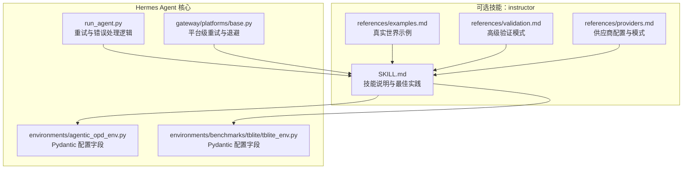
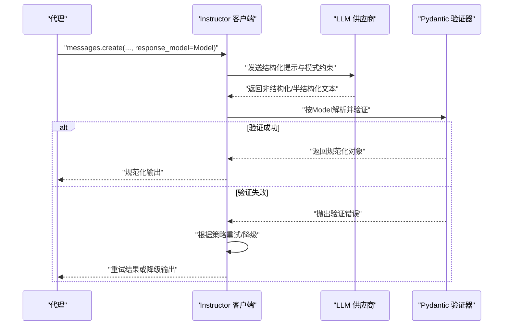
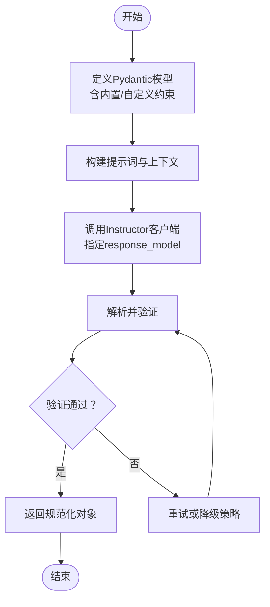
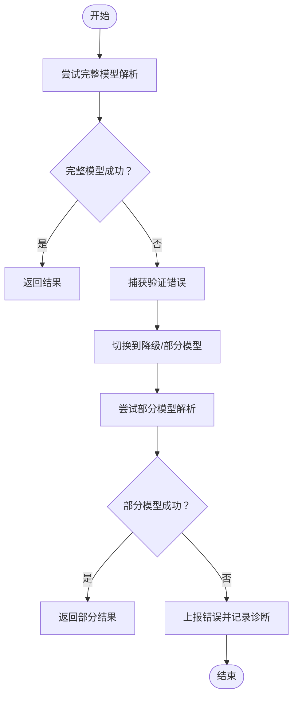
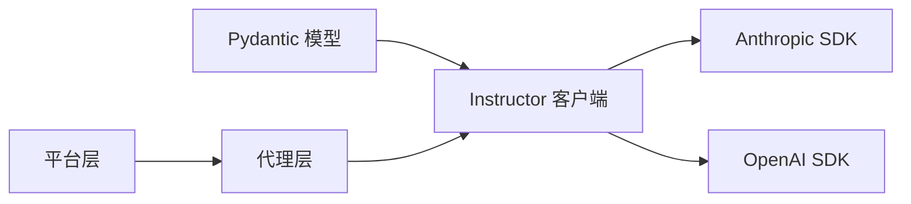

# Instructor数据验证

<cite>
**本文引用的文件**
- [SKILL.md](file://optional-skills/mlops/instructor/SKILL.md)
- [examples.md](file://optional-skills/mlops/instructor/references/examples.md)
- [validation.md](file://optional-skills/mlops/instructor/references/validation.md)
- [providers.md](file://optional-skills/mlops/instructor/references/providers.md)
- [agentic_opd_env.py](file://environments/agentic_opd_env.py)
- [tblite_env.py](file://environments/benchmarks/tblite/tblite_env.py)
- [run_agent.py](file://run_agent.py)
- [base.py](file://gateway/platforms/base.py)
</cite>

## 目录
1. [简介](#简介)
2. [项目结构](#项目结构)
3. [核心组件](#核心组件)
4. [架构总览](#架构总览)
5. [组件详解](#组件详解)
6. [依赖关系分析](#依赖关系分析)
7. [性能考量](#性能考量)
8. [故障排查指南](#故障排查指南)
9. [结论](#结论)
10. [附录](#附录)

## 简介
本文件面向Hermes Agent的Instructor数据验证能力，系统阐述其在代理输出规范化与数据质量保障中的关键作用。Instructor通过将Pydantic模式与多模型供应商（如Anthropic、OpenAI等）结合，实现结构化输出、自动验证、失败重试与流式部分结果解析，显著提升LLM输出的可靠性与一致性。本文将从验证器配置、数据类型与约束规则、与Pydantic的集成、错误处理与性能优化等方面进行深入说明，并给出在代理输出规范化中的实践示例。

## 项目结构
与Instructor相关的知识与示例主要集中在可选技能目录下的“instructor”技能包中，包含技能说明、示例与验证参考文档；同时，Hermes Agent内部广泛采用Pydantic进行配置与数据建模，为Instructor的模式集成提供了统一基础。

**图示来源**
- [SKILL.md:1-744](file://optional-skills/mlops/instructor/SKILL.md#L1-L744)
- [examples.md:1-108](file://optional-skills/mlops/instructor/references/examples.md#L1-L108)
- [validation.md:1-425](file://optional-skills/mlops/instructor/references/validation.md#L1-L425)
- [providers.md:1-71](file://optional-skills/mlops/instructor/references/providers.md#L1-L71)
- [agentic_opd_env.py:70-120](file://environments/agentic_opd_env.py#L70-L120)
- [tblite_env.py:30-120](file://environments/benchmarks/tblite/tblite_env.py#L30-L120)
- [run_agent.py:7480-7520](file://run_agent.py#L7480-L7520)
- [base.py:1045-1100](file://gateway/platforms/base.py#L1045-L1100)

**章节来源**
- [SKILL.md:1-744](file://optional-skills/mlops/instructor/SKILL.md#L1-L744)
- [examples.md:1-108](file://optional-skills/mlops/instructor/references/examples.md#L1-L108)
- [validation.md:1-425](file://optional-skills/mlops/instructor/references/validation.md#L1-L425)
- [providers.md:1-71](file://optional-skills/mlops/instructor/references/providers.md#L1-L71)
- [agentic_opd_env.py:70-120](file://environments/agentic_opd_env.py#L70-L120)
- [tblite_env.py:30-120](file://environments/benchmarks/tblite/tblite_env.py#L30-L120)
- [run_agent.py:7480-7520](file://run_agent.py#L7480-L7520)
- [base.py:1045-1100](file://gateway/platforms/base.py#L1045-L1100)

## 核心组件
- 模式定义与验证
  - 使用Pydantic BaseModel定义响应结构，结合Field、EmailStr、HttpUrl、Enum等内置校验器，以及field_validator、model_validator实现自定义与跨字段校验。
  - 示例涵盖数值范围、字符串长度与正则、邮箱与URL格式、日期时间、列表与字典、嵌套模型与依赖字段等。
- 结构化输出与自动重试
  - 通过Instructor客户端调用供应商接口，将response_model作为约束条件，若验证失败，Instructor自动重试并反馈错误细节。
- 多供应商适配与模式选择
  - 提供Anthropic Tools、OpenAI Tools、JSON回退等模式，针对不同供应商特性选择最优模式。
- 流式与批处理
  - 支持create_partial流式增量解析，以及批量处理多个输入的场景。
- 错误处理与降级
  - 在验证失败时提供降级策略（如Partial模型），并支持对ValidationError进行逐字段诊断与定制化处理。

**章节来源**
- [SKILL.md:193-252](file://optional-skills/mlops/instructor/SKILL.md#L193-L252)
- [validation.md:14-105](file://optional-skills/mlops/instructor/references/validation.md#L14-L105)
- [validation.md:358-425](file://optional-skills/mlops/instructor/references/validation.md#L358-L425)
- [examples.md:1-108](file://optional-skills/mlops/instructor/references/examples.md#L1-L108)
- [providers.md:66-71](file://optional-skills/mlops/instructor/references/providers.md#L66-L71)

## 架构总览
下图展示了Instructor在Hermes Agent中的工作流程：代理构建消息与模式，Instructor基于供应商客户端进行结构化输出请求，返回后由Pydantic进行验证，失败则触发重试或降级，最终得到规范化数据。

**图示来源**
- [SKILL.md:191-205](file://optional-skills/mlops/instructor/SKILL.md#L191-L205)
- [validation.md:358-425](file://optional-skills/mlops/instructor/references/validation.md#L358-L425)
- [providers.md:6-32](file://optional-skills/mlops/instructor/references/providers.md#L6-L32)

## 组件详解

### 1) 验证器配置与约束规则
- 内置约束
  - 数值范围：gt/ge/lt/le/multiple_of
  - 字符串：min_length/max_length/pattern
  - 特定类型：EmailStr、HttpUrl、AnyUrl
  - 日期/时间：date/datetime及自定义校验
  - 列表/字典：长度限制与唯一性等
- 自定义校验
  - field_validator用于字段级校验（如日期格式、人数必须为正）
  - model_validator用于模型级校验（如起止日期先后顺序、计划与用户数/特性匹配）
- 嵌套模型与依赖字段
  - 嵌套Address/Person等模型，支持跨字段联动校验（如邮编与国家匹配）
  - 依赖字段校验（如Plan级别与最大用户数、必需特性集合）

**图示来源**
- [validation.md:14-105](file://optional-skills/mlops/instructor/references/validation.md#L14-L105)
- [validation.md:232-282](file://optional-skills/mlops/instructor/references/validation.md#L232-L282)
- [validation.md:328-356](file://optional-skills/mlops/instructor/references/validation.md#L328-L356)

**章节来源**
- [validation.md:14-105](file://optional-skills/mlops/instructor/references/validation.md#L14-L105)
- [validation.md:232-282](file://optional-skills/mlops/instructor/references/validation.md#L232-L282)
- [validation.md:328-356](file://optional-skills/mlops/instructor/references/validation.md#L328-L356)

### 2) 与Pydantic的集成
- 配置类中的Field使用
  - 在环境配置类中广泛使用Field为配置项添加默认值、描述与类型约束，体现与Instructor一致的“强类型+约束”的数据治理理念。
- 模型定义与响应模型
  - 将Pydantic模型作为Instructor的response_model，使LLM输出直接映射到强类型结构，减少后处理成本。

**章节来源**
- [agentic_opd_env.py:70-120](file://environments/agentic_opd_env.py#L70-L120)
- [tblite_env.py:30-120](file://environments/benchmarks/tblite/tblite_env.py#L30-L120)
- [SKILL.md:193-252](file://optional-skills/mlops/instructor/SKILL.md#L193-L252)

### 3) 供应商配置与模式选择
- Anthropic Claude
  - 推荐使用ANTHROPIC_TOOLS模式；也可在不支持原生结构化输出时回退至JSON模式。
- OpenAI
  - 使用TOOLS模式对接函数调用；本地/兼容OpenAI接口（如Ollama）需显式设置base_url与mode。
- 模式对比
  - ANTHROPIC_TOOLS（推荐）、TOOLS（OpenAI）、JSON（通用回退）。

**章节来源**
- [providers.md:5-32](file://optional-skills/mlops/instructor/references/providers.md#L5-L32)
- [providers.md:34-64](file://optional-skills/mlops/instructor/references/providers.md#L34-L64)
- [providers.md:66-71](file://optional-skills/mlops/instructor/references/providers.md#L66-L71)

### 4) 错误处理与重试策略
- 验证失败的重试
  - 当Pydantic验证失败时，Instructor自动重试并反馈具体字段错误，便于提示词与约束迭代。
- 降级与容错
  - 提供Optional字段与默认值，允许部分提取；必要时切换到Partial模型进行稳健解析。
- 平台级与代理级重试
  - 平台层与代理层均实现了指数退避、速率限制后的等待与回退机制，确保在外部服务不稳定时仍能稳定运行。

**图示来源**
- [validation.md:358-425](file://optional-skills/mlops/instructor/references/validation.md#L358-L425)
- [run_agent.py:7480-7520](file://run_agent.py#L7480-L7520)
- [base.py:1045-1100](file://gateway/platforms/base.py#L1045-L1100)

**章节来源**
- [validation.md:358-425](file://optional-skills/mlops/instructor/references/validation.md#L358-L425)
- [run_agent.py:7480-7520](file://run_agent.py#L7480-L7520)
- [base.py:1045-1100](file://gateway/platforms/base.py#L1045-L1100)

### 5) 应用示例：代理输出规范化与数据质量保证
- 数据抽取
  - 从自然语言中抽取公司信息、人员角色、组织机构等，使用列表与嵌套模型保证结构化输出。
- 分类与情感分析
  - 使用枚举限定类别与情感，配合置信度与关键词列表，形成标准化分类结果。
- 批量处理与流式更新
  - 对多条输入进行批量抽取；对长输出进行流式增量解析，实时更新UI或中间态。

**章节来源**
- [examples.md:1-108](file://optional-skills/mlops/instructor/references/examples.md#L1-L108)
- [SKILL.md:400-524](file://optional-skills/mlops/instructor/SKILL.md#L400-L524)

## 依赖关系分析
- 组件耦合
  - 模式定义（Pydantic）与Instructor客户端紧密耦合，供应商适配通过from_openai/from_anthropic解耦。
  - 代理层与平台层分别承担业务重试与传输层重试，避免重复逻辑。
- 外部依赖
  - Pydantic负责数据建模与验证；供应商SDK（如Anthropic/OpenAI）负责实际推理；Instructor桥接二者。
- 循环依赖
  - 文档与示例位于可选技能目录，与核心Agent代码通过调用关系连接，未见循环导入迹象。

**图示来源**
- [providers.md:5-32](file://optional-skills/mlops/instructor/references/providers.md#L5-L32)
- [run_agent.py:7480-7520](file://run_agent.py#L7480-L7520)
- [base.py:1045-1100](file://gateway/platforms/base.py#L1045-L1100)

**章节来源**
- [providers.md:5-32](file://optional-skills/mlops/instructor/references/providers.md#L5-L32)
- [run_agent.py:7480-7520](file://run_agent.py#L7480-L7520)
- [base.py:1045-1100](file://gateway/platforms/base.py#L1045-L1100)

## 性能考量
- 模式设计
  - 合理使用Optional与默认值，减少LLM负担；对大字段使用分页/流式输出。
- 重试与退避
  - 采用指数退避与上限控制，避免雪崩效应；在速率限制时等待并重试。
- 资源管理
  - 使用上下文管理器关闭Instructor客户端，避免资源泄漏。
- 批处理与并发
  - 批量任务时注意令牌与并发限制，避免触发供应商限流。

[本节为通用指导，无需特定文件引用]

## 故障排查指南
- 常见问题定位
  - 验证失败：检查ValidationError中的字段与消息，针对性调整提示词或放宽约束。
  - 速率限制：观察等待时间与退避策略，必要时降低并发或切换备用供应商。
  - 会话过大：在代理层跳过持久化失败的大会话，防止增长循环。
- 参考路径
  - 验证错误诊断与降级策略：[validation.md:400-425](file://optional-skills/mlops/instructor/references/validation.md#L400-L425)
  - 代理层重试与回退：[run_agent.py:8251-8293](file://run_agent.py#L8251-L8293)
  - 平台层重试与日志：[base.py:1045-1100](file://gateway/platforms/base.py#L1045-L1100)

**章节来源**
- [validation.md:400-425](file://optional-skills/mlops/instructor/references/validation.md#L400-L425)
- [run_agent.py:8251-8293](file://run_agent.py#L8251-L8293)
- [base.py:1045-1100](file://gateway/platforms/base.py#L1045-L1100)

## 结论
Instructor在Hermes Agent中扮演着“结构化输出与数据质量”的关键角色：通过与Pydantic的深度集成，将LLM输出转化为强类型、可验证、可演进的结构化数据；借助自动重试与降级策略，显著提升了在复杂与不稳定环境下的鲁棒性；结合多供应商适配与流式/批处理能力，满足了多样化应用场景的需求。建议在实际落地中优先采用枚举与内置约束，逐步引入自定义校验，并配套完善的错误诊断与重试策略，以获得最佳的稳定性与可维护性。

[本节为总结性内容，无需特定文件引用]

## 附录
- 快速上手要点
  - 定义清晰的Pydantic模型并标注约束
  - 选择合适的供应商模式（ANTHROPIC_TOOLS/TOOLS/JSON）
  - 使用create_partial进行流式增量解析
  - 配置合理的重试次数与退避策略
- 相关参考
  - 技能说明与示例：[SKILL.md:1-744](file://optional-skills/mlops/instructor/SKILL.md#L1-L744)
  - 高级验证模式：[validation.md:1-425](file://optional-skills/mlops/instructor/references/validation.md#L1-L425)
  - 供应商配置：[providers.md:1-71](file://optional-skills/mlops/instructor/references/providers.md#L1-L71)
  - 真实示例：[examples.md:1-108](file://optional-skills/mlops/instructor/references/examples.md#L1-L108)

[本节为补充材料，无需特定文件引用]