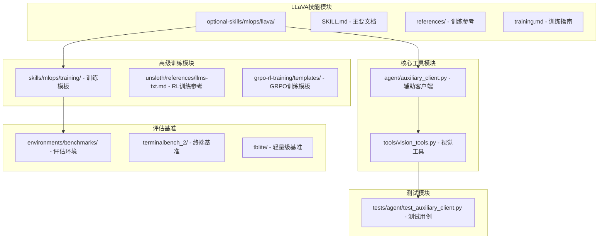
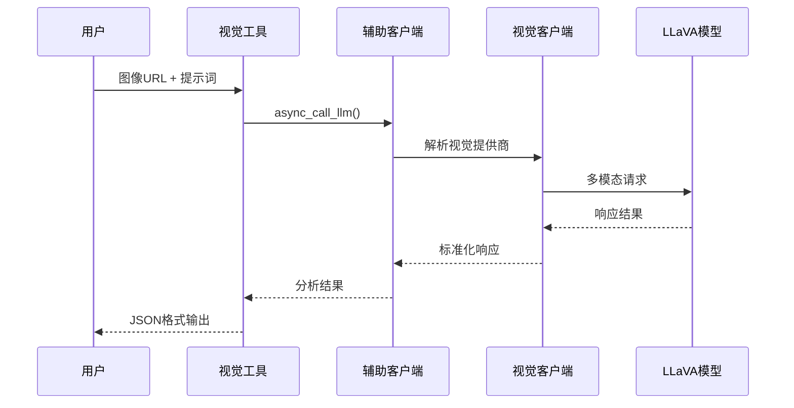
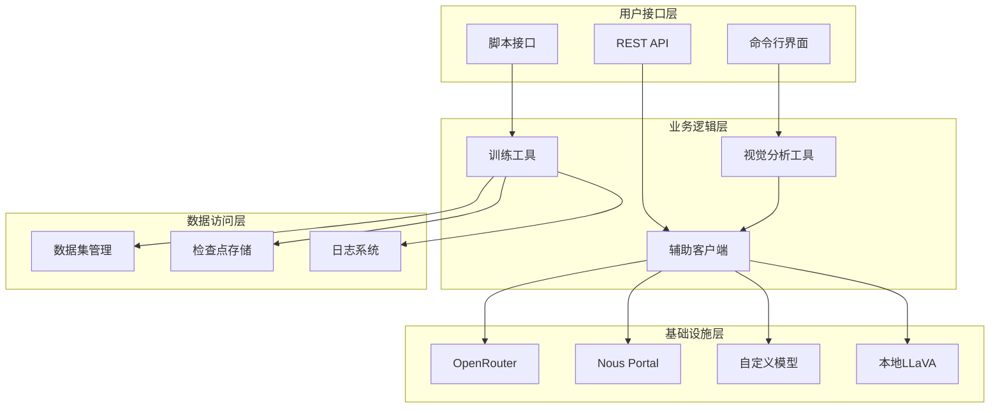
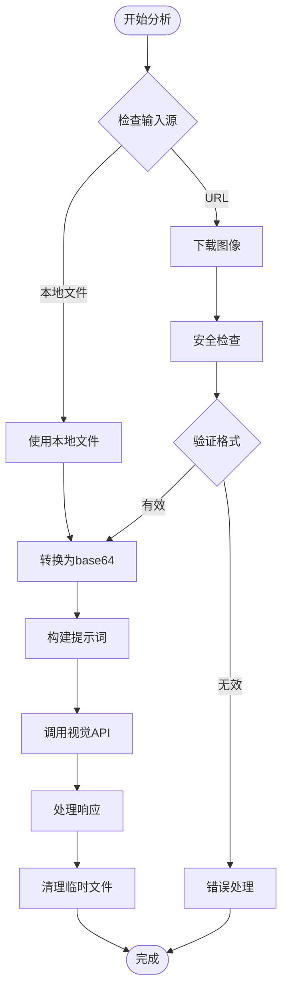
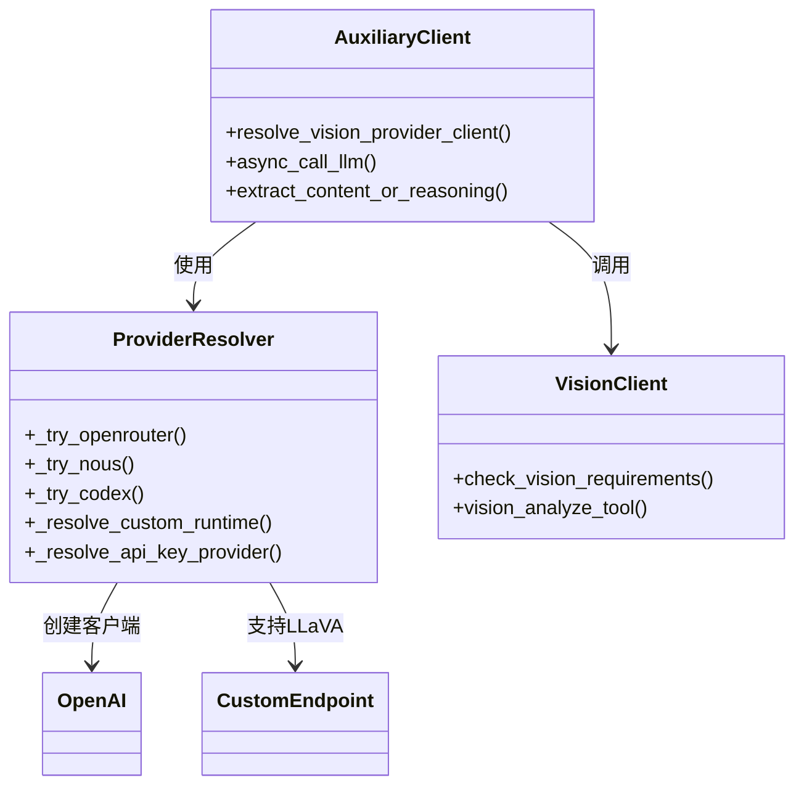
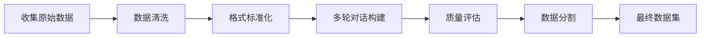
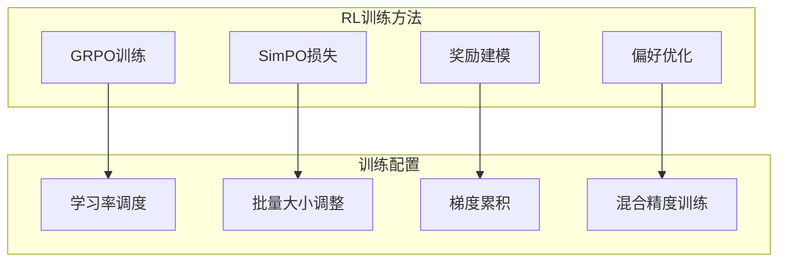
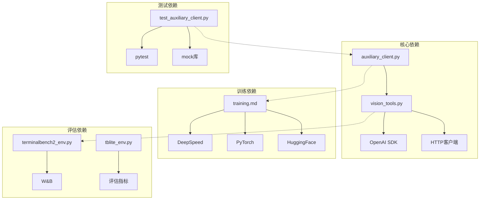

# LLaVA视觉语言训练

<cite>
**本文档引用的文件**
- [SKILL.md](file://optional-skills/mlops/llava/SKILL.md)
- [training.md](file://optional-skills/mlops/llava/references/training.md)
- [auxiliary_client.py](file://agent/auxiliary_client.py)
- [vision_tools.py](file://tools/vision_tools.py)
- [test_auxiliary_client.py](file://tests/agent/test_auxiliary_client.py)
- [rl_training_tool.py](file://tools/rl_training_tool.py)
- [llms-txt.md](file://skills/mlops/training/unsloth/references/llms-txt.md)
- [basic_grpo_training.py](file://skills/mlops/training/grpo-rl-training/templates/basic_grpo_training.py)
- [loss-functions.md](file://optional-skills/mlops/simpo/references/loss-functions.md)
- [terminalbench2_env.py](file://environments/benchmarks/terminalbench_2/terminalbench2_env.py)
- [tblite_env.py](file://environments/benchmarks/tblite/tblite_env.py)
</cite>

## 目录
1. [简介](#简介)
2. [项目结构](#项目结构)
3. [核心组件](#核心组件)
4. [架构概览](#架构概览)
5. [详细组件分析](#详细组件分析)
6. [依赖关系分析](#依赖关系分析)
7. [性能考虑](#性能考虑)
8. [故障排除指南](#故障排除指南)
9. [结论](#结论)
10. [附录](#附录)

## 简介

LLaVA（Large Language and Vision Assistant）是Hermes Agent生态系统中的重要视觉语言训练工具。该工具结合了CLIP视觉编码器与Vicuna/LLaMA语言模型，实现了多模态学习的核心功能。

LLaVA在多模态学习中的核心价值体现在：
- **视觉指令调优**：支持基于图像的多轮对话和视觉问答
- **图像理解任务**：涵盖场景理解、对象检测、文档分析等
- **多模态推理**：将视觉信息与语言理解相结合
- **可扩展架构**：支持不同规模的模型（7B-34B参数）

在Hermes Agent中，LLaVA不仅作为独立的视觉语言模型使用，更是整个多模态智能体系统的重要组成部分，为代理提供了强大的视觉理解能力。

## 项目结构

Hermes Agent中的LLaVA相关组件主要分布在以下目录：



**图表来源**
- [SKILL.md:1-308](file://optional-skills/mlops/llava/SKILL.md#L1-L308)
- [auxiliary_client.py:1-800](file://agent/auxiliary_client.py#L1-L800)
- [vision_tools.py:1-615](file://tools/vision_tools.py#L1-L615)

**章节来源**
- [SKILL.md:1-308](file://optional-skills/mlops/llava/SKILL.md#L1-L308)
- [auxiliary_client.py:1-800](file://agent/auxiliary_client.py#L1-L800)
- [vision_tools.py:1-615](file://tools/vision_tools.py#L1-L615)

## 核心组件

### LLaVA训练框架

LLaVA提供了完整的两阶段训练流程：

#### 阶段1：特征对齐（预训练）
- **目的**：将视觉编码器与语言模型对齐
- **数据集**：558K图像-标题对（CC3M子集）
- **配置**：Vicuna-7B或LLaMA-2-7B作为基础模型，CLIP ViT-L/14作为视觉编码器
- **时间**：8× A100 GPU下约20小时

#### 阶段2：视觉指令调优
- **目的**：教授模型遵循视觉指令
- **数据集**：150K GPT生成的多模态指令数据
- **配置**：1个epoch，8 GPU下批大小128，学习率2e-5
- **时间**：8× A100 GPU下约24小时

### 多模态推理架构



**图表来源**
- [vision_tools.py:264-495](file://tools/vision_tools.py#L264-L495)
- [auxiliary_client.py:697-800](file://agent/auxiliary_client.py#L697-L800)

**章节来源**
- [training.md:5-39](file://optional-skills/mlops/llava/references/training.md#L5-L39)
- [SKILL.md:204-212](file://optional-skills/mlops/llava/SKILL.md#L204-L212)

## 架构概览

Hermes Agent中的LLaVA视觉语言训练系统采用分层架构设计：



**图表来源**
- [auxiliary_client.py:17-28](file://agent/auxiliary_client.py#L17-L28)
- [vision_tools.py:1-30](file://tools/vision_tools.py#L1-L30)

## 详细组件分析

### 视觉分析工具链

#### 图像下载与预处理
视觉工具链提供了完整的图像处理流程：



**图表来源**
- [vision_tools.py:124-213](file://tools/vision_tools.py#L124-L213)
- [vision_tools.py:264-495](file://tools/vision_tools.py#L264-L495)

#### 多提供商路由机制
辅助客户端实现了智能的提供商选择策略：



**图表来源**
- [auxiliary_client.py:697-800](file://agent/auxiliary_client.py#L697-L800)
- [auxiliary_client.py:1-800](file://agent/auxiliary_client.py#L1-L800)

**章节来源**
- [vision_tools.py:1-615](file://tools/vision_tools.py#L1-L615)
- [auxiliary_client.py:1-800](file://agent/auxiliary_client.py#L1-L800)

### 训练数据准备

#### 数据格式规范
LLaVA训练要求特定的数据格式：

```json
{
  "id": "001",
  "image": "path/to/image.jpg",
  "conversations": [
    {
      "from": "human",
      "value": "<image>\nWhat is in this image?"
    },
    {
      "from": "gpt",
      "value": "The image shows a dog playing in a park."
    }
  ]
}
```

#### 自定义数据准备流程


**图表来源**
- [training.md:42-69](file://optional-skills/mlops/llava/references/training.md#L42-L69)

**章节来源**
- [training.md:71-95](file://optional-skills/mlops/llava/references/training.md#L71-L95)

### 模型配置优化

#### 硬件资源配置
- **7B模型**：8× A100 (40GB)，训练时间20-48小时
- **13B模型**：8× A100 (80GB)，训练时间20-48小时  
- **34B模型**：需要更大规模的GPU集群

#### 内存优化策略
- **4位量化**：VRAM减少约4倍
- **8位量化**：VRAM减少约2倍
- **梯度检查点**：显著降低内存占用
- **LoRA微调**：内存需求降低10倍

**章节来源**
- [training.md:166-191](file://optional-skills/mlops/llava/references/training.md#L166-L191)
- [SKILL.md:214-227](file://optional-skills/mlops/llava/SKILL.md#L214-L227)

### 高级训练技术

#### 强化学习训练
LLaVA支持多种强化学习训练方法：



**图表来源**
- [llms-txt.md:9245-10252](file://skills/mlops/training/unsloth/references/llms-txt.md#L9245-L10252)
- [basic_grpo_training.py:173-228](file://skills/mlops/training/grpo-rl-training/templates/basic_grpo_training.py#L173-L228)

**章节来源**
- [llms-txt.md:9245-10252](file://skills/mlops/training/unsloth/references/llms-txt.md#L9245-L10252)
- [basic_grpo_training.py:173-228](file://skills/mlops/training/grpo-rl-training/templates/basic_grpo_training.py#L173-L228)

## 依赖关系分析

### 组件耦合度分析



**图表来源**
- [auxiliary_client.py:54-58](file://agent/auxiliary_client.py#L54-L58)
- [vision_tools.py:39-42](file://tools/vision_tools.py#L39-L42)

### 外部依赖集成

Hermes Agent通过以下方式集成外部视觉服务：

| 服务提供商 | 支持协议 | 认证方式 | 特殊配置 |
|-----------|----------|----------|----------|
| OpenRouter | OpenAI兼容 | API密钥 | 指标追踪 |
| Nous Portal | OpenAI兼容 | OAuth令牌 | 免费额度限制 |
| 自定义端点 | OpenAI兼容 | API密钥/无密钥 | LLaVA本地支持 |
| Codex | Responses API | OAuth令牌 | 视觉支持 |

**章节来源**
- [auxiliary_client.py:17-28](file://agent/auxiliary_client.py#L17-L28)
- [test_auxiliary_client.py:771-787](file://tests/agent/test_auxiliary_client.py#L771-L787)

## 性能考虑

### 推理性能优化

| 模型规格 | VRAM(FP16) | VRAM(4位) | 速度(tokens/s) |
|----------|------------|-----------|----------------|
| 7B参数 | ~14 GB | ~4 GB | ~20 |
| 13B参数 | ~28 GB | ~8 GB | ~12 |
| 34B参数 | ~70 GB | ~18 GB | ~5 |

### 训练效率提升

#### 内存优化技术
- **梯度检查点**：减少激活内存占用
- **混合精度训练**：BF16/FP16计算
- **分布式训练**：DeepSpeed ZeRO优化
- **LoRA适配器**：仅训练小部分参数

#### 训练稳定性
- **学习率调度**：余弦退火
- **梯度裁剪**：防止梯度爆炸
- **Warmup策略**：稳定的初始训练阶段
- **权重衰减**：正则化防止过拟合

**章节来源**
- [SKILL.md:240-248](file://optional-skills/mlops/llava/SKILL.md#L240-L248)
- [training.md:180-191](file://optional-skills/mlops/llava/references/training.md#L180-L191)

## 故障排除指南

### 常见问题诊断

#### 视觉功能不可用
```python
def check_vision_requirements():
    """检查视觉功能可用性"""
    try:
        from agent.auxiliary_client import resolve_vision_provider_client
        provider, client, model = resolve_vision_provider_client()
        return client is not None
    except Exception:
        return False
```

#### 训练过程异常
- **内存不足**：启用量化或减少批量大小
- **数据格式错误**：检查JSON格式和字段完整性
- **网络连接问题**：验证API密钥和网络连通性
- **模型不兼容**：确认支持视觉功能的模型版本

#### 性能问题
- **推理缓慢**：检查GPU利用率和内存使用
- **训练不稳定**：调整学习率和批次大小
- **显存泄漏**：确保正确释放资源和清理缓存

**章节来源**
- [vision_tools.py:497-506](file://tools/vision_tools.py#L497-L506)
- [test_auxiliary_client.py:771-787](file://tests/agent/test_auxiliary_client.py#L771-L787)

## 结论

Hermes Agent中的LLaVA视觉语言训练工具提供了完整的多模态学习解决方案。通过分层架构设计、智能提供商路由和优化的训练流程，该系统能够高效地处理复杂的视觉语言任务。

关键优势包括：
- **灵活的部署选项**：支持云端和本地部署
- **高效的训练管道**：从数据准备到模型部署的完整流程
- **强大的推理能力**：支持多轮对话和复杂视觉理解
- **完善的监控体系**：从训练到推理的全程性能监控

未来发展方向：
- **更大规模模型**：支持更复杂的视觉理解任务
- **实时推理优化**：提高响应速度和吞吐量
- **自动化训练管道**：减少人工干预，提高效率
- **多模态融合**：与其他感知模态的深度整合

## 附录

### 最佳实践清单

#### 训练阶段
- 从预训练模型开始，避免从零训练
- 使用LoRA进行高效微调
- 注重数据质量而非数量
- 定期保存检查点以防失败

#### 推理阶段  
- 选择合适的温度参数平衡创造性与准确性
- 使用适当的批量大小和序列长度
- 实施合理的超时和重试机制
- 监控API使用情况和成本控制

#### 性能调优
- 根据硬件条件选择合适的量化级别
- 优化批处理和并行度设置
- 实施有效的缓存策略
- 定期评估和调整模型参数