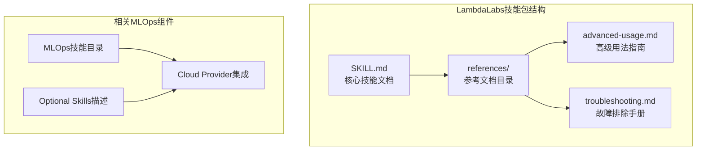
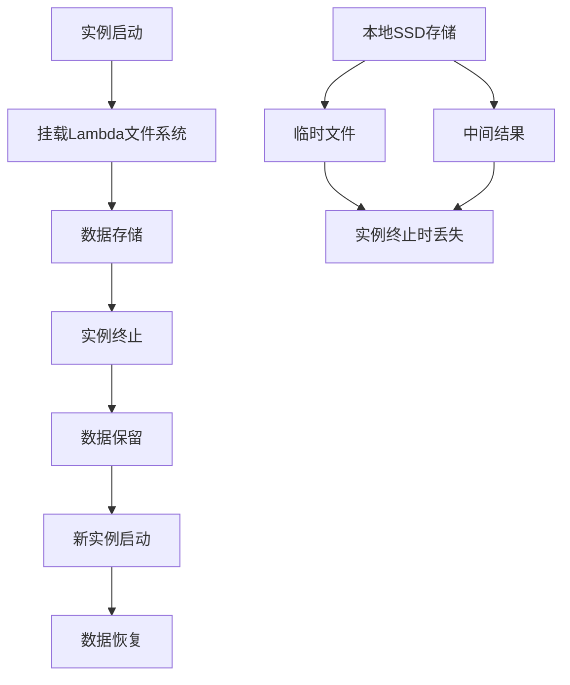
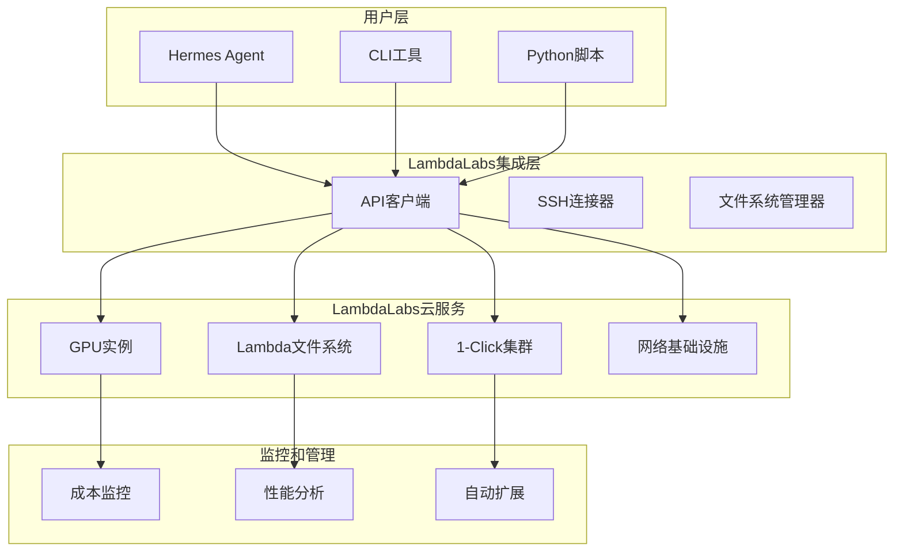
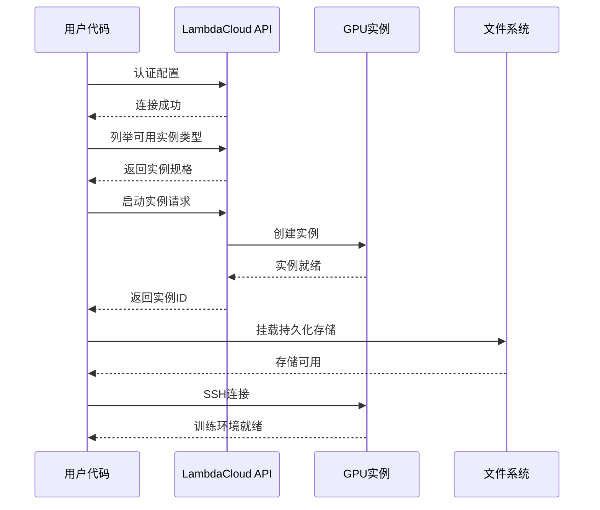
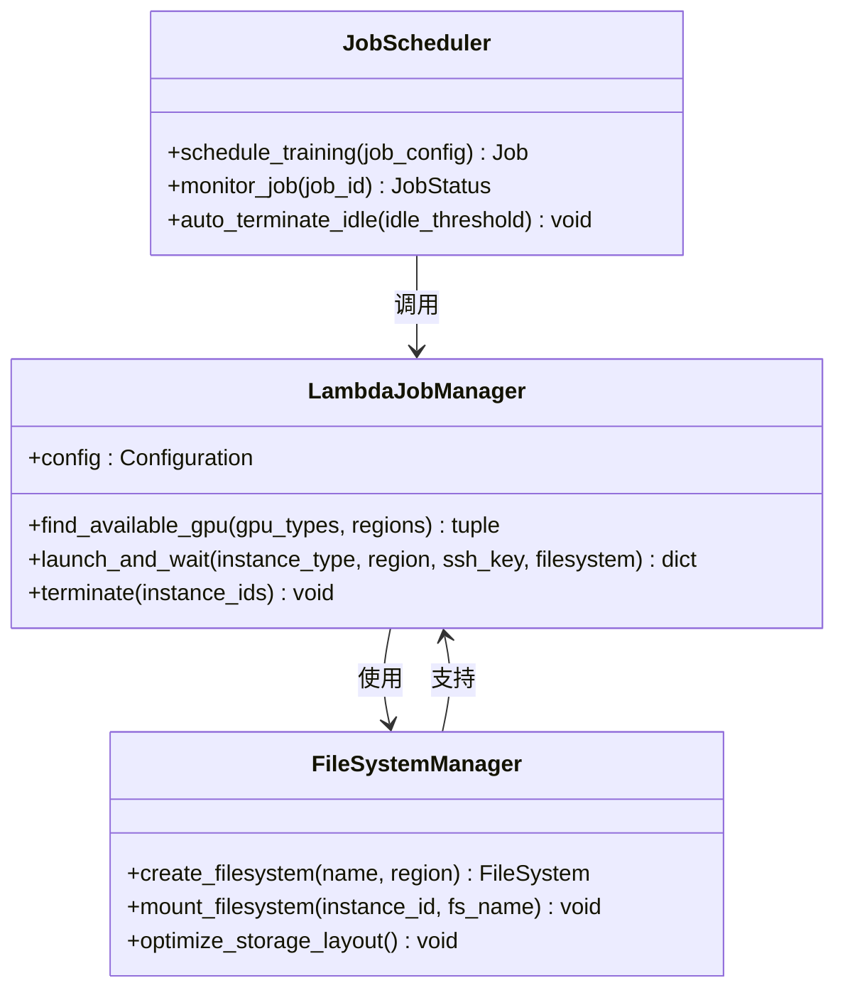
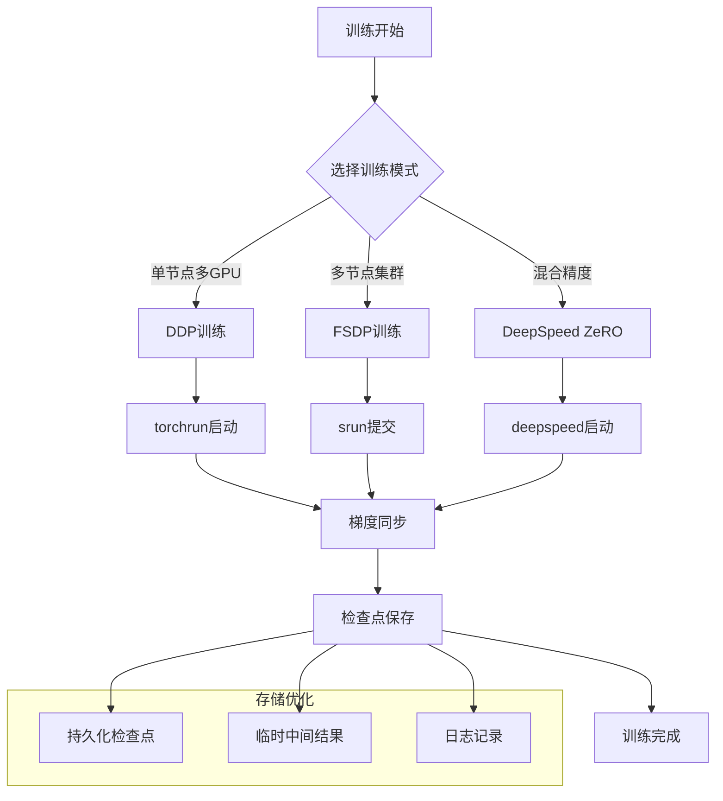
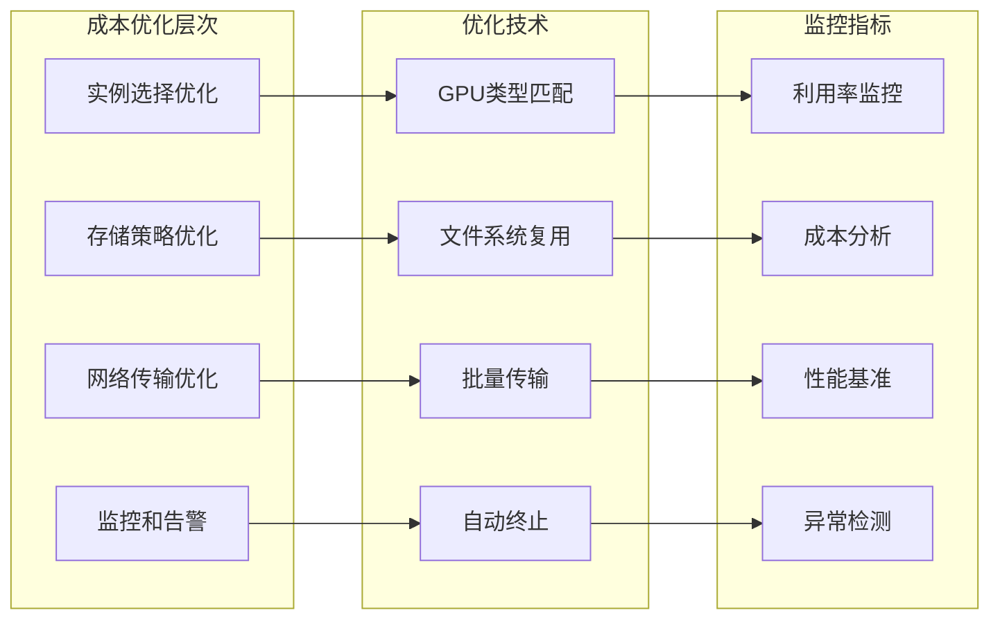
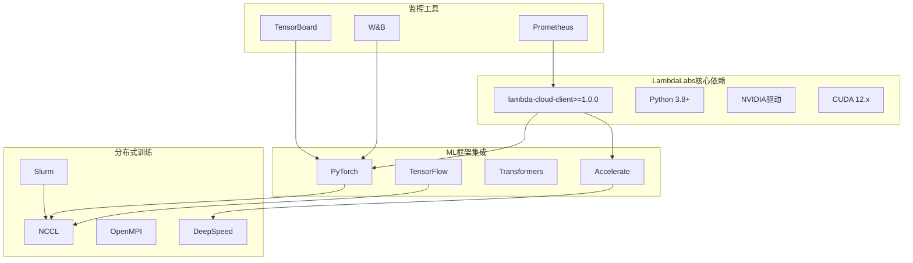
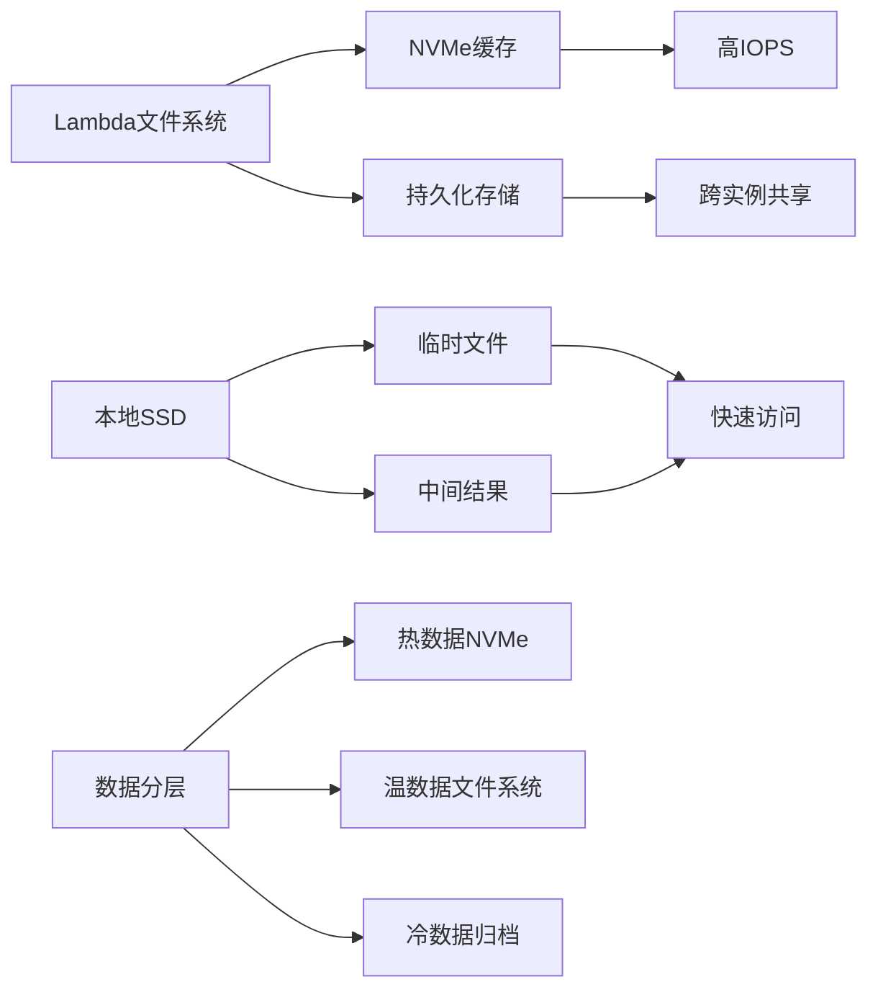
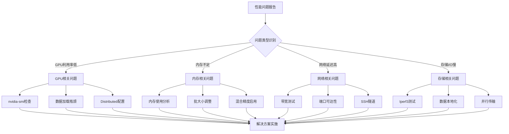

# LambdaLabs云服务

<cite>
**本文档引用的文件**
- [SKILL.md](file://optional-skills/mlops/lambda-labs/SKILL.md)
- [advanced-usage.md](file://optional-skills/mlops/lambda-labs/references/advanced-usage.md)
- [troubleshooting.md](file://optional-skills/mlops/lambda-labs/references/troubleshooting.md)
- [skills-catalog.md](file://website/docs/reference/skills-catalog.md)
- [DESCRIPTION.md](file://optional-skills/DESCRIPTION.md)
</cite>

## 目录
1. [简介](#简介)
2. [项目结构](#项目结构)
3. [核心组件](#核心组件)
4. [架构概览](#架构概览)
5. [详细组件分析](#详细组件分析)
6. [依赖关系分析](#依赖关系分析)
7. [性能考虑](#性能考虑)
8. [故障排除指南](#故障排除指南)
9. [结论](#结论)
10. [附录](#附录)

## 简介

LambdaLabs是Hermes Agent MLOps云基础设施中的关键GPU云服务组件，专为机器学习训练和推理提供高性能计算资源。该技能包提供了完整的LambdaLabs GPU云服务集成，包括按需实例管理、持久化存储、分布式训练支持以及成本优化策略。

LambdaLabs在MLOps生态系统中扮演着"基础设施即服务"的角色，为代理训练和推理加速提供以下核心能力：

- **专用GPU实例**：支持多种GPU类型（B200、H100、GH200、A100等），满足从开发到生产的不同需求
- **持久化存储**：Lambda文件系统提供跨实例重启的数据持久化
- **分布式训练**：支持单节点多GPU和多节点集群训练
- **简单定价**：按分钟计费，无出口费用
- **全球部署**：12+个区域支持，确保低延迟访问

## 项目结构

LambdaLabs技能包采用模块化设计，包含核心文档、高级用法指南和故障排除手册：

**图表来源**
- [SKILL.md:1-549](file://optional-skills/mlops/lambda-labs/SKILL.md#L1-L549)
- [advanced-usage.md:1-612](file://optional-skills/mlops/lambda-labs/references/advanced-usage.md#L1-L612)
- [troubleshooting.md:1-531](file://optional-skills/mlops/lambda-labs/references/troubleshooting.md#L1-L531)

**章节来源**
- [SKILL.md:1-549](file://optional-skills/mlops/lambda-labs/SKILL.md#L1-L549)
- [DESCRIPTION.md:1-25](file://optional-skills/DESCRIPTION.md#L1-L25)

## 核心组件

### GPU实例管理

LambdaLabs提供多样化的GPU实例类型，每种都针对特定的ML工作负载进行了优化：

| GPU类型 | VRAM | 价格(GPU/小时) | 最佳用途 |
|---------|------|----------------|----------|
| B200 SXM6 | 180GB | $4.99 | 最大模型训练，最快性能 |
| H100 SXM | 80GB | $2.99-3.29 | 大模型训练 |
| H100 PCIe | 80GB | $2.49 | 成本效益H100 |
| GH200 | 96GB | $1.49 | 单GPU大模型 |
| A100 80GB | 80GB | $1.79 | 生产级训练 |
| A100 40GB | 40GB | $1.29 | 标准训练 |
| A10 | 24GB | $0.75 | 推理，微调 |
| A6000 | 48GB | $0.80 | VRAM/价格比优秀 |
| V100 | 16GB | $0.55 | 预算训练 |

### 持久化存储系统

Lambda文件系统提供跨实例重启的数据持久化能力：

**图表来源**
- [SKILL.md:250-290](file://optional-skills/mlops/lambda-labs/SKILL.md#L250-L290)

### 分布式训练支持

支持单节点多GPU和多节点集群训练，包括：

- **单节点多GPU训练**：使用torchrun进行DDP分布式训练
- **多节点集群训练**：通过Slurm集群实现大规模分布式训练
- **混合精度训练**：支持FP16、BF16和FP8精度
- **内存优化**：FSDP和DeepSpeed ZeRO集成

**章节来源**
- [SKILL.md:70-130](file://optional-skills/mlops/lambda-labs/SKILL.md#L70-L130)
- [advanced-usage.md:1-200](file://optional-skills/mlops/lambda-labs/references/advanced-usage.md#L1-L200)

## 架构概览

LambdaLabs在Hermes Agent中的整体架构如下：

**图表来源**
- [SKILL.md:130-250](file://optional-skills/mlops/lambda-labs/SKILL.md#L130-L250)
- [advanced-usage.md:134-225](file://optional-skills/mlops/lambda-labs/references/advanced-usage.md#L134-L225)

## 详细组件分析

### Python API集成

LambdaLabs提供了完整的Python API用于程序化管理GPU实例：

**图表来源**
- [SKILL.md:138-198](file://optional-skills/mlops/lambda-labs/SKILL.md#L138-L198)

### 自动化作业管理

高级用法提供了完整的自动化作业管理能力：

**图表来源**
- [advanced-usage.md:144-223](file://optional-skills/mlops/lambda-labs/references/advanced-usage.md#L144-L223)

### 分布式训练工作流

支持多种分布式训练模式：

**图表来源**
- [advanced-usage.md:77-124](file://optional-skills/mlops/lambda-labs/references/advanced-usage.md#L77-L124)

**章节来源**
- [SKILL.md:350-444](file://optional-skills/mlops/lambda-labs/SKILL.md#L350-L444)
- [advanced-usage.md:1-133](file://optional-skills/mlops/lambda-labs/references/advanced-usage.md#L1-L133)

### 成本优化策略

LambdaLabs提供了多层次的成本优化方案：

**图表来源**
- [SKILL.md:503-526](file://optional-skills/mlops/lambda-labs/SKILL.md#L503-L526)
- [advanced-usage.md:489-567](file://optional-skills/mlops/lambda-labs/references/advanced-usage.md#L489-L567)

**章节来源**
- [SKILL.md:503-526](file://optional-skills/mlops/lambda-labs/SKILL.md#L503-L526)
- [advanced-usage.md:489-567](file://optional-skills/mlops/lambda-labs/references/advanced-usage.md#L489-L567)

## 依赖关系分析

LambdaLabs技能包与其他MLOps组件的依赖关系：

**图表来源**
- [SKILL.md:7-10](file://optional-skills/mlops/lambda-labs/SKILL.md#L7-L10)
- [SKILL.md:100-115](file://optional-skills/mlops/lambda-labs/SKILL.md#L100-L115)

**章节来源**
- [skills-catalog.md:139-146](file://website/docs/reference/skills-catalog.md#L139-L146)
- [SKILL.md:1-50](file://optional-skills/mlops/lambda-labs/SKILL.md#L1-L50)

## 性能考虑

### GPU性能基准

不同GPU类型的性能特征对比：

| GPU类型 | VRAM | 内存带宽 | 适合场景 |
|---------|------|----------|----------|
| B200 SXM6 | 180GB | 3.35 TB/s | 最大语言模型训练 |
| H100 SXM | 80GB | 2.00 TB/s | 大模型微调 |
| GH200 | 96GB | 1.60 TB/s | 单GPU大模型 |
| A100 80GB | 80GB | 1.50 TB/s | 生产级训练 |
| A10 24GB | 24GB | 1.00 TB/s | 推理和微调 |

### 网络性能优化

LambdaLabs提供高性能网络基础设施：

- **同区域实例间通信**：最高200 Gbps带宽
- **互联网出站**：最大20 Gbps
- **InfiniBand支持**：量子2代400 Gb/s网络
- **RDMA支持**：3200 Gb/s GPUDirect RDMA

### 存储性能优化

**图表来源**
- [SKILL.md:446-464](file://optional-skills/mlops/lambda-labs/SKILL.md#L446-L464)

## 故障排除指南

### 常见问题诊断

| 问题类型 | 症状 | 可能原因 | 解决方案 |
|----------|------|----------|----------|
| 实例启动失败 | "无容量可用" | 区域/GPU售罄 | 尝试不同区域或GPU类型 |
| SSH连接被拒绝 | Permission denied | 密钥不匹配 | 检查密钥权限和添加状态 |
| GPU未被检测到 | nvidia-smi命令不存在 | 驱动问题 | 重新安装Lambda Stack |
| 文件系统未挂载 | /lambda/nfs路径不存在 | 启动时未附加 | 终止后重新启动并附加文件系统 |
| 网络连接超时 | 无法访问服务端口 | 防火墙限制 | 配置防火墙或使用SSH隧道 |

### 性能问题排查

**图表来源**
- [troubleshooting.md:1-531](file://optional-skills/mlops/lambda-labs/references/troubleshooting.md#L1-L531)

### 监控和调试工具

推荐的监控工具和使用方法：

- **GPU监控**：`watch -n 1 nvidia-smi` 实时查看GPU利用率
- **系统监控**：`htop` 查看CPU和内存使用情况
- **网络监控**：`iftop` 监控网络带宽使用
- **存储监控**：`iostat -x 1` 监控磁盘I/O性能

**章节来源**
- [troubleshooting.md:425-454](file://optional-skills/mlops/lambda-labs/references/troubleshooting.md#L425-L454)

## 结论

LambdaLabs云服务为Hermes Agent提供了强大而灵活的GPU计算基础设施。通过模块化的技能包设计，用户可以轻松地：

1. **按需获取计算资源**：根据具体任务需求选择合适的GPU实例
2. **实现高效的数据管理**：利用Lambda文件系统实现数据持久化和共享
3. **支持大规模分布式训练**：从单节点多GPU到多节点集群的完整支持
4. **优化成本结构**：通过智能的实例选择和资源管理降低成本
5. **获得可靠的运维保障**：完善的监控、故障排除和性能优化工具

对于代理训练和推理加速，LambdaLabs提供了从开发环境到生产部署的全栈支持，是构建现代化MLOps流水线的理想选择。

## 附录

### 实际应用案例

#### 案例1：大型语言模型微调
- **场景**：对70B参数模型进行指令微调
- **资源配置**：8x H100 SXM5实例
- **存储策略**：Lambda文件系统存储模型权重和检查点
- **训练方式**：FSDP + DeepSpeed ZeRO-3
- **成本控制**：按需启动，训练完成后自动终止

#### 案例2：批量推理服务
- **场景**：为生产环境提供批量推理能力
- **资源配置**：多个A10实例
- **优化策略**：混合精度 + 梯度检查点
- **监控方案**：实时GPU利用率监控 + 自动扩缩容

### 最佳实践建议

1. **实例选择**：根据模型大小和批处理需求选择合适的GPU类型
2. **存储管理**：将训练数据和检查点存储在Lambda文件系统中
3. **网络配置**：合理设置防火墙规则，必要时使用SSH隧道
4. **成本控制**：建立实例自动终止机制，避免不必要的资源占用
5. **监控告警**：设置关键指标阈值，及时发现和解决问题