# MLOps工具链

<cite>
**本文引用的文件**
- [skills/mlops/DESCRIPTION.md](file://skills/mlops/DESCRIPTION.md)
- [optional-skills/DESCRIPTION.md](file://optional-skills/DESCRIPTION.md)
- [accelerate/SKILL.md](file://optional-skills/mlops/accelerate/SKILL.md)
- [chroma/SKILL.md](file://optional-skills/mlops/chroma/SKILL.md)
- [faiss/SKILL.md](file://optional-skills/mlops/faiss/SKILL.md)
- [pytorch-lightning/SKILL.md](file://optional-skills/mlops/pytorch-lightning/SKILL.md)
- [pinecone/SKILL.md](file://optional-skills/mlops/pinecone/SKILL.md)
- [qdrant/SKILL.md](file://optional-skills/mlops/qdrant/SKILL.md)
- [tensorrt-llm/SKILL.md](file://optional-skills/mlops/tensorrt-llm/SKILL.md)
- [hermes-atropos-environments/SKILL.md](file://optional-skills/mlops/hermes-atropos-environments/SKILL.md)
- [huggingface-tokenizers/SKILL.md](file://optional-skills/mlops/huggingface-tokenizers/SKILL.md)
</cite>

## 目录
1. [简介](#简介)
2. [项目结构](#项目结构)
3. [核心组件](#核心组件)
4. [架构总览](#架构总览)
5. [详细组件分析](#详细组件分析)
6. [依赖关系分析](#依赖关系分析)
7. [性能考量](#性能考量)
8. [故障排除指南](#故障排除指南)
9. [结论](#结论)
10. [附录](#附录)

## 简介
本文件系统性梳理 Hermes Agent 的 MLOps 工具链可选技能，覆盖加速训练、向量数据库、深度学习框架、模型训练、推理服务、环境评测、分词器等关键领域。文档面向不同技术背景的读者，既提供高层概览，也给出可操作的配置与使用路径、最佳实践、集成方式与性能优化建议，并附带部署与排障指引。

## 项目结构
MLOps 技能以“可选技能”形式组织在 optional-skills/mlops 下，每个工具一个独立技能包（SKILL.md），并标注了标签、依赖与资源链接。同时，skills/mlops/DESCRIPTION.md 提供该模块的总体描述。optional-skills/DESCRIPTION.md 解释了“可选技能”的定位：非默认安装，通过 Skills Hub 发现与安装，适合需要特定能力或重型依赖的用户。

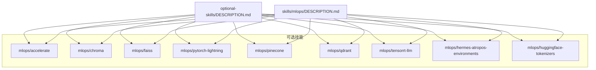

图表来源
- [optional-skills/DESCRIPTION.md:1-25](file://optional-skills/DESCRIPTION.md#L1-L25)
- [skills/mlops/DESCRIPTION.md:1-4](file://skills/mlops/DESCRIPTION.md#L1-L4)

章节来源
- [optional-skills/DESCRIPTION.md:1-25](file://optional-skills/DESCRIPTION.md#L1-L25)
- [skills/mlops/DESCRIPTION.md:1-4](file://skills/mlops/DESCRIPTION.md#L1-L4)

## 核心组件
- 加速训练：HuggingFace Accelerate 统一分布式训练接口，支持 DDP/DeepSpeed/FSDP/Megatron，自动设备放置与混合精度，交互式配置与单命令启动。
- 向量数据库：Chroma（开源嵌入数据库）、FAISS（Facebook AI 高性能相似度检索）、Pinecone（托管向量数据库）、Qdrant（Rust 驱动高性能引擎）。
- 深度学习框架：PyTorch Lightning 高层训练框架，简化训练循环、自动分布式与回调系统。
- 推理服务：TensorRT-LLM 基于 NVIDIA TensorRT 的 LLM 推理优化，支持高吞吐低延迟、量化与多 GPU 扩展。
- 环境评测：Hermes Atropos Environments 提供 RL 训练环境基座，集成工具调用、奖励函数、评估与日志。
- 分词器：HuggingFace Tokenizers 高性能分词库，支持 BPE/WordPiece/Unigram，可训练自定义词表并跟踪对齐。

章节来源
- [accelerate/SKILL.md:1-336](file://optional-skills/mlops/accelerate/SKILL.md#L1-L336)
- [chroma/SKILL.md:1-410](file://optional-skills/mlops/chroma/SKILL.md#L1-L410)
- [faiss/SKILL.md:1-225](file://optional-skills/mlops/faiss/SKILL.md#L1-L225)
- [pytorch-lightning/SKILL.md:1-350](file://optional-skills/mlops/pytorch-lightning/SKILL.md#L1-L350)
- [pinecone/SKILL.md:1-362](file://optional-skills/mlops/pinecone/SKILL.md#L1-L362)
- [qdrant/SKILL.md:1-497](file://optional-skills/mlops/qdrant/SKILL.md#L1-L497)
- [tensorrt-llm/SKILL.md:1-191](file://optional-skills/mlops/tensorrt-llm/SKILL.md#L1-L191)
- [hermes-atropos-environments/SKILL.md:1-303](file://optional-skills/mlops/hermes-atropos-environments/SKILL.md#L1-L303)
- [huggingface-tokenizers/SKILL.md:1-520](file://optional-skills/mlops/huggingface-tokenizers/SKILL.md#L1-L520)

## 架构总览
下图展示 MLOps 工具链在典型工作流中的位置与交互：从数据与模型准备（分词器、训练框架），到分布式训练（Accelerate/PyTorch Lightning），再到推理优化（TensorRT-LLM）与向量检索（Chroma/FAISS/Pinecone/Qdrant），以及 RL 环境评测（Atropos）。

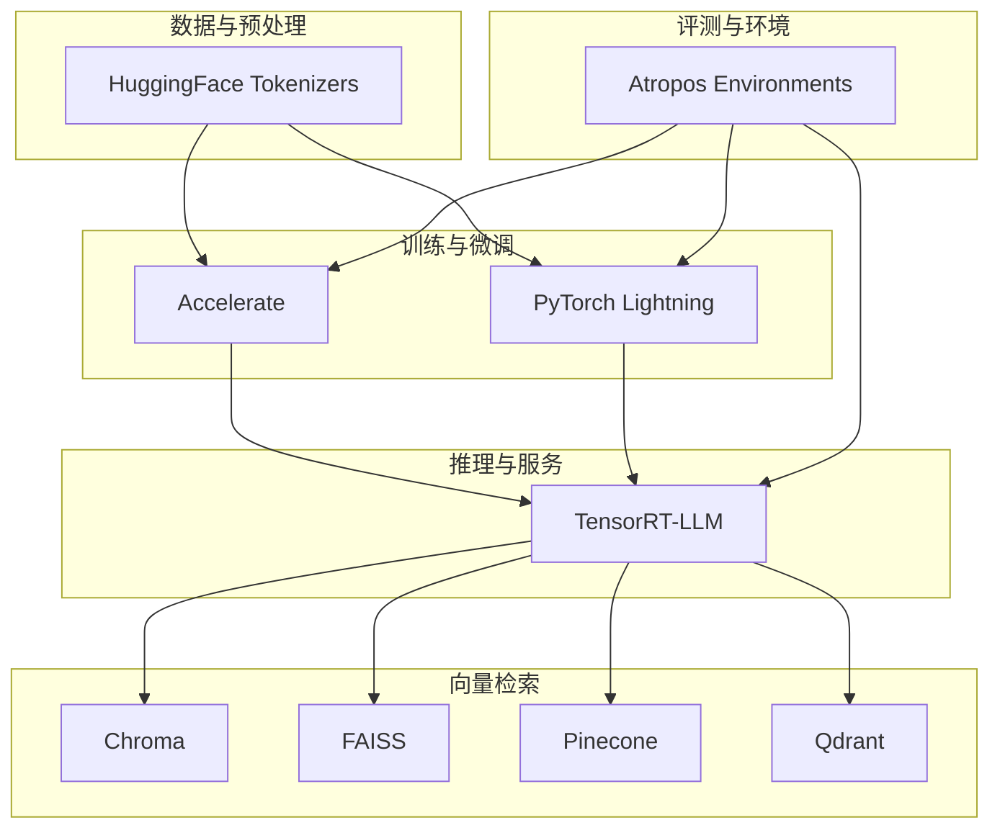

图表来源
- [accelerate/SKILL.md:1-336](file://optional-skills/mlops/accelerate/SKILL.md#L1-L336)
- [pytorch-lightning/SKILL.md:1-350](file://optional-skills/mlops/pytorch-lightning/SKILL.md#L1-L350)
- [tensorrt-llm/SKILL.md:1-191](file://optional-skills/mlops/tensorrt-llm/SKILL.md#L1-L191)
- [chroma/SKILL.md:1-410](file://optional-skills/mlops/chroma/SKILL.md#L1-L410)
- [faiss/SKILL.md:1-225](file://optional-skills/mlops/faiss/SKILL.md#L1-L225)
- [pinecone/SKILL.md:1-362](file://optional-skills/mlops/pinecone/SKILL.md#L1-L362)
- [qdrant/SKILL.md:1-497](file://optional-skills/mlops/qdrant/SKILL.md#L1-L497)
- [hermes-atropos-environments/SKILL.md:1-303](file://optional-skills/mlops/hermes-atropos-environments/SKILL.md#L1-L303)

## 详细组件分析

### HuggingFace Accelerate
- 定位：统一分布式训练 API，最小代码改动即可适配 DDP/DeepSpeed/FSDP/Megatron，自动设备放置与混合精度。
- 关键流程：准备模型/优化器/数据加载器 → 自动 backward → 可选检查点保存。
- 使用要点：避免手动设备搬运；使用上下文管理器进行梯度累积；分布式检查点需主进程保存/所有进程加载。
- 硬件与启动：支持 CPU/GPU/TPU/MPS；DDP 内置，DeepSpeed/FSDP 需额外依赖；单命令启动跨节点。

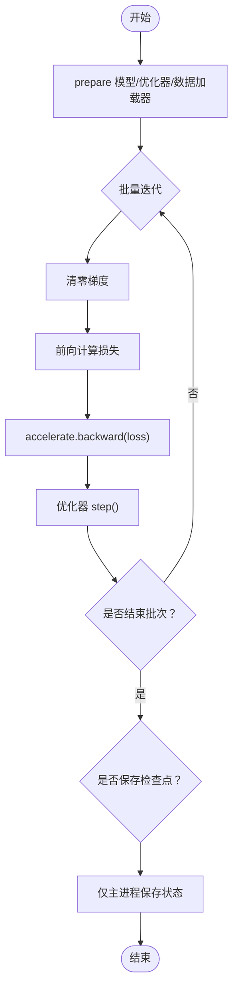

图表来源
- [accelerate/SKILL.md:25-44](file://optional-skills/mlops/accelerate/SKILL.md#L25-L44)
- [accelerate/SKILL.md:282-292](file://optional-skills/mlops/accelerate/SKILL.md#L282-L292)

章节来源
- [accelerate/SKILL.md:1-336](file://optional-skills/mlops/accelerate/SKILL.md#L1-L336)

### Chroma 向量数据库
- 定位：开源嵌入数据库，适合本地开发与开源项目；提供集合 CRUD、相似度查询、元数据过滤、持久化与服务器模式。
- 核心操作：创建集合、添加文档（含自定义嵌入/元数据）、相似度查询（支持过滤）、获取/更新/删除文档。
- 集成：LangChain、LlamaIndex 均有官方适配；服务器模式便于多用户场景。
- 最佳实践：持久化客户端、添加元数据、批处理、选择合适嵌入模型、定期备份。

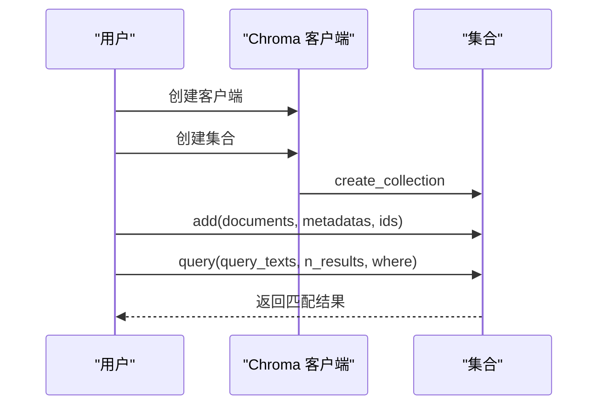

图表来源
- [chroma/SKILL.md:52-77](file://optional-skills/mlops/chroma/SKILL.md#L52-L77)
- [chroma/SKILL.md:129-161](file://optional-skills/mlops/chroma/SKILL.md#L129-L161)

章节来源
- [chroma/SKILL.md:1-410](file://optional-skills/mlops/chroma/SKILL.md#L1-L410)

### FAISS 高性能相似度检索
- 定位：Facebook AI 的高效相似度搜索与聚类库，支持数十亿级向量、GPU 加速与多种索引类型（Flat/IVF/HNSW/PQ）。
- 索引类型：精确搜索（Flat）、近似搜索（IVF/HNSW）、内存压缩（Product Quantization）。
- 使用要点：根据规模选择索引；GPU 单卡/多卡加速；训练一次、反复使用；批查询提升吞吐。
- 集成：LangChain、LlamaIndex 适配；支持保存/加载索引。

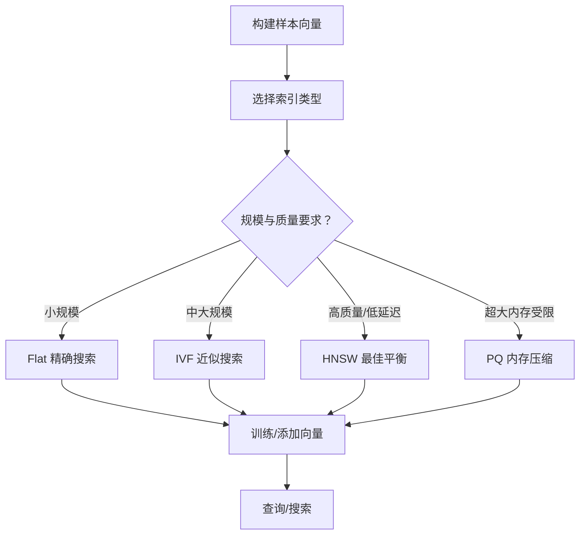

图表来源
- [faiss/SKILL.md:74-147](file://optional-skills/mlops/faiss/SKILL.md#L74-L147)

章节来源
- [faiss/SKILL.md:1-225](file://optional-skills/mlops/faiss/SKILL.md#L1-L225)

### PyTorch Lightning
- 定位：高阶训练框架，以 Trainer 为核心，自动分布式（DDP/FSDP/DeepSpeed）、回调系统、日志与检查点。
- 转换路径：定义 LightningModule → 准备数据 → Trainer.fit(...) 完成训练循环。
- 常见工作流：单/多 GPU 训练、验证/测试、分布式策略、回调（早停/检查点/学习率监控）。
- 问题排查：损失不下降（检查数据/模型）、显存不足（减小 batch 或使用梯度累积/混合精度）、验证未运行（确保传入验证集）。

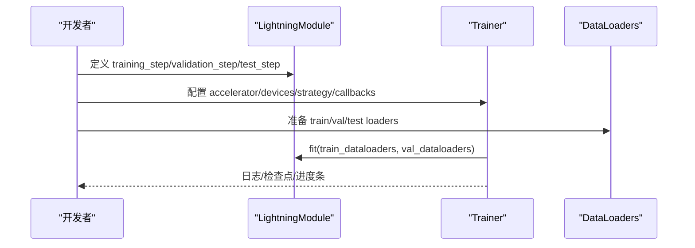

图表来源
- [pytorch-lightning/SKILL.md:25-60](file://optional-skills/mlops/pytorch-lightning/SKILL.md#L25-L60)
- [pytorch-lightning/SKILL.md:111-149](file://optional-skills/mlops/pytorch-lightning/SKILL.md#L111-L149)

章节来源
- [pytorch-lightning/SKILL.md:1-350](file://optional-skills/mlops/pytorch-lightning/SKILL.md#L1-L350)

### Pinecone 管理型向量数据库
- 定位：全托管、自动伸缩、低延迟（p95<100ms），支持稀疏/稠密混合搜索与命名空间隔离。
- 核心操作：创建索引（Serverless/Pod）、Upsert 向量（含元数据）、查询（过滤/命名空间）、删除与统计。
- 最佳实践：使用 Serverless 自动伸缩、批量 Upsert、利用命名空间隔离租户数据、Hybrid 搜索提升召回质量。
- 性能：Upsert/query 延迟与索引规模相关，SLA 保障 p95 低延迟。

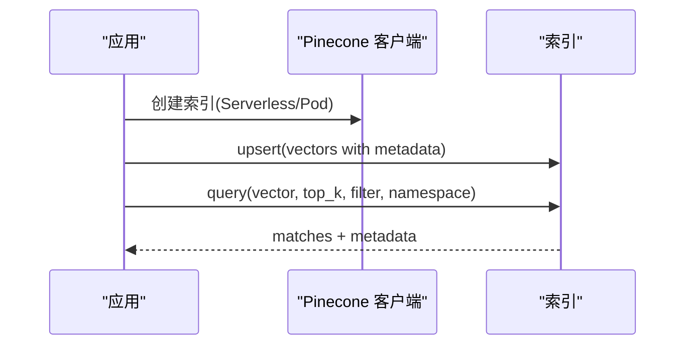

图表来源
- [pinecone/SKILL.md:47-80](file://optional-skills/mlops/pinecone/SKILL.md#L47-L80)
- [pinecone/SKILL.md:137-167](file://optional-skills/mlops/pinecone/SKILL.md#L137-L167)

章节来源
- [pinecone/SKILL.md:1-362](file://optional-skills/mlops/pinecone/SKILL.md#L1-L362)

### Qdrant 向量相似度搜索引擎
- 定位：Rust 驱动的高性能向量数据库，支持富过滤、多向量（稠密/稀疏/多稠密）、量化、分布式（分片/复制）。
- 核心概念：Point（ID+向量+Payload）、Collection（容器）、距离度量（COSINE/EUCLID/DOT/MANHATTAN）。
- 操作：基础/过滤/批量搜索；多向量与稀疏向量；标量量化；负载索引；生产部署（Docker/Cloud）。
- 最佳实践：批处理、Payload 索引、量化、分片与磁盘存储、连接池复用。

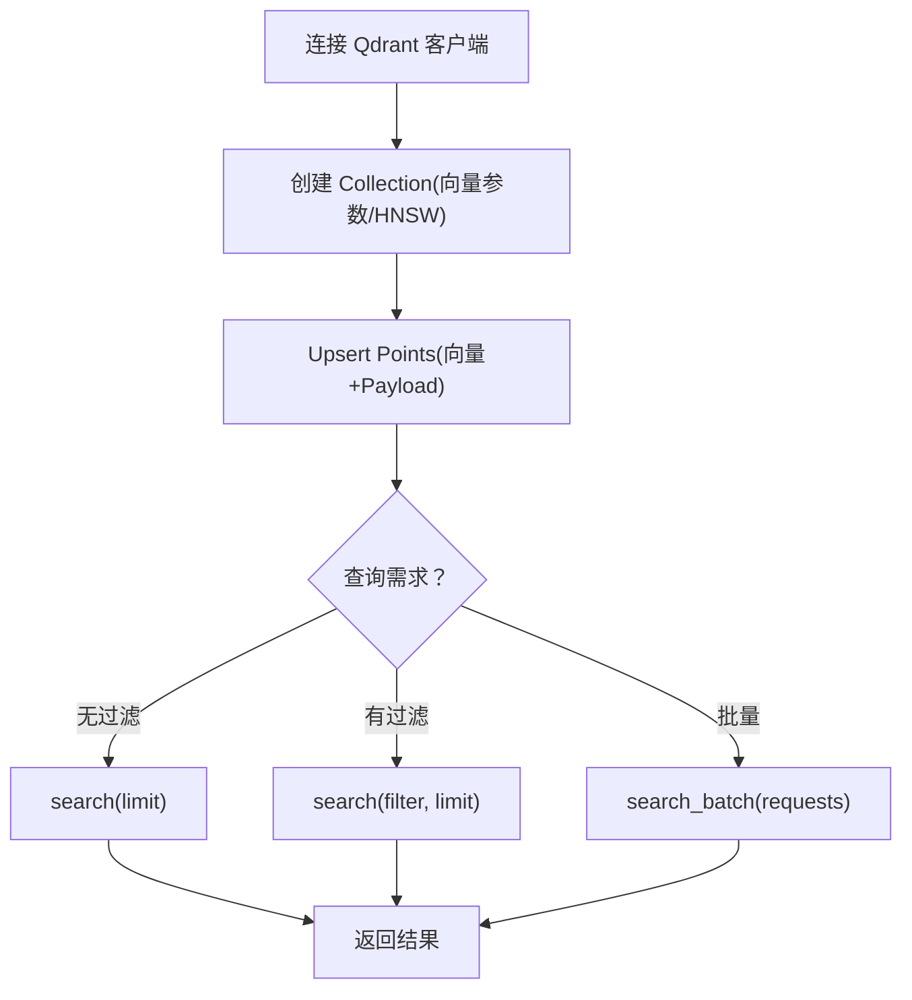

图表来源
- [qdrant/SKILL.md:68-103](file://optional-skills/mlops/qdrant/SKILL.md#L68-L103)
- [qdrant/SKILL.md:166-230](file://optional-skills/mlops/qdrant/SKILL.md#L166-L230)

章节来源
- [qdrant/SKILL.md:1-497](file://optional-skills/mlops/qdrant/SKILL.md#L1-L497)

### TensorRT-LLM 推理优化
- 定位：基于 NVIDIA TensorRT 的 LLM 推理优化，追求最大吞吐与最低延迟，支持量化（FP8/INT4）、飞行中批处理、多 GPU/节点扩展。
- 快速上手：初始化 LLM → 配置采样参数 → generate；trtllm-serve 启动服务。
- 特性：Flash Attention、Paged KV Cache、Speculative Decoding、LoRA Serving、解耦服务。
- 性能：H100 上 Llama 3-8B 达 24,000+ tokens/sec，相较 PyTorch 提升约 100×。

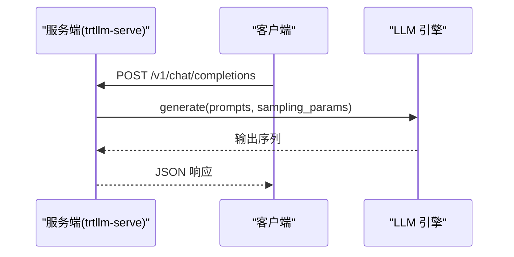

图表来源
- [tensorrt-llm/SKILL.md:74-92](file://optional-skills/mlops/tensorrt-llm/SKILL.md#L74-L92)
- [tensorrt-llm/SKILL.md:114-155](file://optional-skills/mlops/tensorrt-llm/SKILL.md#L114-L155)

章节来源
- [tensorrt-llm/SKILL.md:1-191](file://optional-skills/mlops/tensorrt-llm/SKILL.md#L1-L191)

### Hermes Atropos Environments RL 环境
- 定位：与 Atropos 训练框架集成的 RL 环境基座，支持多轮代理循环与工具调用，强调奖励函数设计与评估。
- 架构：Atropos BaseEnv → HermesAgentBaseEnv（代理循环/工具解析/ToolContext）→ 用户实现（setup/get_next_item/format_prompt/compute_reward/evaluate/wandb_log）。
- CLI 模式：serve（训练循环）、process（离线数据生成）、evaluate（独立评估）。
- 关键注意：evaluate 必须使用完整代理循环；提取 AgentResult 中最终响应与工具调用；避免污染训练指标；ToolContext 清理资源。

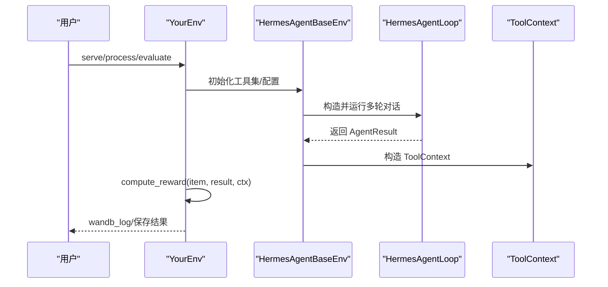

图表来源
- [hermes-atropos-environments/SKILL.md:17-28](file://optional-skills/mlops/hermes-atropos-environments/SKILL.md#L17-L28)
- [hermes-atropos-environments/SKILL.md:146-191](file://optional-skills/mlops/hermes-atropos-environments/SKILL.md#L146-L191)

章节来源
- [hermes-atropos-environments/SKILL.md:1-303](file://optional-skills/mlops/hermes-atropos-environments/SKILL.md#L1-L303)

### HuggingFace Tokenizers 分词器
- 定位：高性能分词库，Rust 实现，支持 BPE/WordPiece/Unigram，可训练自定义词表并跟踪对齐。
- 快速上手：加载预训练分词器 → 编码/解码；训练自定义 BPE/WordPiece/Unigram；批处理编码与填充/截断。
- 管道：Normalization → Pre-tokenization → Model → Post-processing；支持对齐跟踪。
- 集成：AutoTokenizer 自动使用 fast tokenizers；可转换为 transformers 的 PreTrainedTokenizerFast。

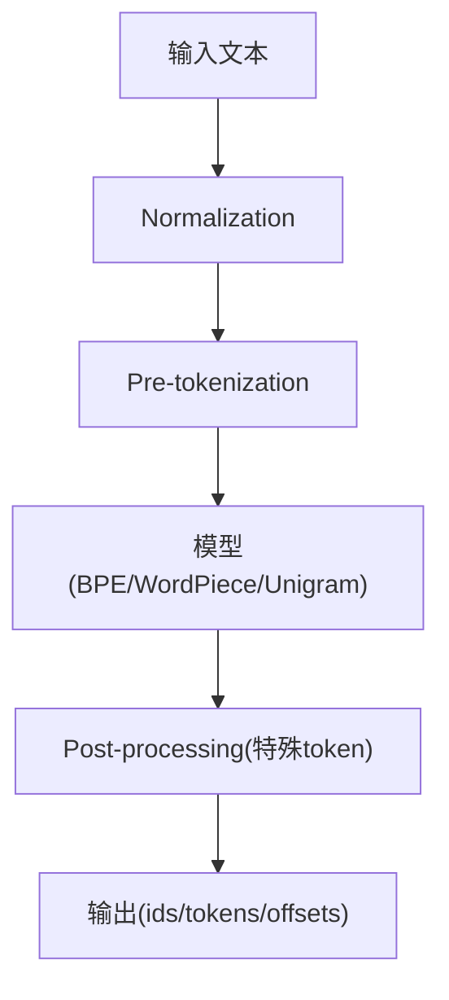

图表来源
- [huggingface-tokenizers/SKILL.md:224-308](file://optional-skills/mlops/huggingface-tokenizers/SKILL.md#L224-L308)

章节来源
- [huggingface-tokenizers/SKILL.md:1-520](file://optional-skills/mlops/huggingface-tokenizers/SKILL.md#L1-L520)

## 依赖关系分析
- 训练层：Accelerate/PyTorch Lightning 作为训练抽象层，分别面向“最小改动”和“工程化最佳实践”。
- 推理层：TensorRT-LLM 面向 NVIDIA 生态的高性能推理；可与向量数据库配合用于 RAG。
- 数据层：Chroma/FAISS/Pinecone/Qdrant 提供不同侧重点的向量检索方案（开源/托管/高性能/易用）。
- 工具链：HuggingFace Tokenizers 为 NLP 预处理与模型输入提供统一、高效的分词能力。
- 评测：Atropos Environments 将上述组件整合进 RL 训练与评估流水线。

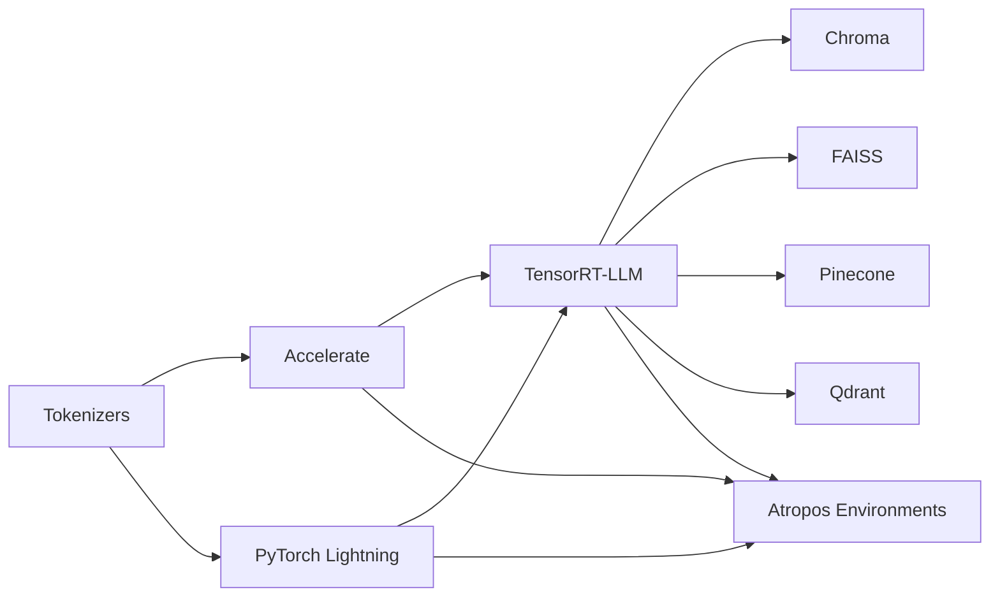

图表来源
- [accelerate/SKILL.md:1-336](file://optional-skills/mlops/accelerate/SKILL.md#L1-L336)
- [pytorch-lightning/SKILL.md:1-350](file://optional-skills/mlops/pytorch-lightning/SKILL.md#L1-L350)
- [tensorrt-llm/SKILL.md:1-191](file://optional-skills/mlops/tensorrt-llm/SKILL.md#L1-L191)
- [chroma/SKILL.md:1-410](file://optional-skills/mlops/chroma/SKILL.md#L1-L410)
- [faiss/SKILL.md:1-225](file://optional-skills/mlops/faiss/SKILL.md#L1-L225)
- [pinecone/SKILL.md:1-362](file://optional-skills/mlops/pinecone/SKILL.md#L1-L362)
- [qdrant/SKILL.md:1-497](file://optional-skills/mlops/qdrant/SKILL.md#L1-L497)
- [hermes-atropos-environments/SKILL.md:1-303](file://optional-skills/mlops/hermes-atropos-environments/SKILL.md#L1-L303)

章节来源
- [accelerate/SKILL.md:1-336](file://optional-skills/mlops/accelerate/SKILL.md#L1-L336)
- [pytorch-lightning/SKILL.md:1-350](file://optional-skills/mlops/pytorch-lightning/SKILL.md#L1-L350)
- [tensorrt-llm/SKILL.md:1-191](file://optional-skills/mlops/tensorrt-llm/SKILL.md#L1-L191)
- [chroma/SKILL.md:1-410](file://optional-skills/mlops/chroma/SKILL.md#L1-L410)
- [faiss/SKILL.md:1-225](file://optional-skills/mlops/faiss/SKILL.md#L1-L225)
- [pinecone/SKILL.md:1-362](file://optional-skills/mlops/pinecone/SKILL.md#L1-L362)
- [qdrant/SKILL.md:1-497](file://optional-skills/mlops/qdrant/SKILL.md#L1-L497)
- [hermes-atropos-environments/SKILL.md:1-303](file://optional-skills/mlops/hermes-atropos-environments/SKILL.md#L1-L303)

## 性能考量
- 训练阶段
  - Accelerate：通过 prepare 自动设备放置与混合精度，减少显存占用；DeepSpeed/FSDP 适合大模型与多机扩展。
  - PyTorch Lightning：内置分布式策略与混合精度，降低工程复杂度；回调系统辅助早停与检查点。
- 推理阶段
  - TensorRT-LLM：启用量化（FP8/INT4）、Paged KV Cache、Flash Attention、CUDA Graphs，显著提升吞吐与降低延迟。
- 向量检索
  - Chroma：适合中小规模与本地部署；持久化与服务器模式兼顾。
  - FAISS：超大规模向量检索首选，GPU 加速与多种索引类型（IVF/HNSW/PQ）平衡速度与精度。
  - Pinecone：托管服务，自动伸缩与低延迟 SLA，适合生产 RAG/推荐系统。
  - Qdrant：Rust 高性能、多向量与量化，适合高并发与复杂过滤场景。
- 分词器
  - Tokenizers：Rust 核心带来极高吞吐，适合大规模语料预处理与模型输入准备。

[本节为通用指导，无需列出具体文件来源]

## 故障排除指南
- Accelerate
  - 设备放置错误：不要手动搬运张量，使用 prepare 后自动放置。
  - 梯度累积无效：使用上下文管理器进行累积。
  - 分布式检查点：仅主进程保存，所有进程加载。
- PyTorch Lightning
  - 损失不下降：打印批形状与标签确认数据。
  - 显存不足：减小 batch、使用梯度累积或混合精度。
  - 验证未运行：确保传入验证集。
- TensorRT-LLM
  - 服务启动失败：确认 CUDA/TensorRT 版本与 Python 版本满足要求。
  - 推理慢：启用量化、Paged KV Cache、适当调整批大小与并行度。
- Chroma
  - 查询慢：开启持久化、合理元数据过滤、定期备份。
- FAISS
  - 训练耗时长：选择合适索引类型（Flat/IVF/HNSW/PQ）；GPU 加速。
- Pinecone
  - 延迟高：检查索引规模与命名空间隔离；使用 Hybrid 搜索。
- Qdrant
  - 过滤慢：为常用字段建立 Payload 索引；启用量化与磁盘存储。
- Tokenizers
  - 对齐异常：检查 Normalizer/Pre-tokenizer/Post-processor 管道配置。

章节来源
- [accelerate/SKILL.md:258-301](file://optional-skills/mlops/accelerate/SKILL.md#L258-L301)
- [pytorch-lightning/SKILL.md:270-316](file://optional-skills/mlops/pytorch-lightning/SKILL.md#L270-L316)
- [tensorrt-llm/SKILL.md:1-191](file://optional-skills/mlops/tensorrt-llm/SKILL.md#L1-L191)
- [chroma/SKILL.md:380-410](file://optional-skills/mlops/chroma/SKILL.md#L380-L410)
- [faiss/SKILL.md:199-225](file://optional-skills/mlops/faiss/SKILL.md#L199-L225)
- [pinecone/SKILL.md:320-362](file://optional-skills/mlops/pinecone/SKILL.md#L320-L362)
- [qdrant/SKILL.md:450-483](file://optional-skills/mlops/qdrant/SKILL.md#L450-L483)
- [huggingface-tokenizers/SKILL.md:383-520](file://optional-skills/mlops/huggingface-tokenizers/SKILL.md#L383-L520)

## 结论
Hermes Agent 的 MLOps 工具链以“可选技能”形式提供从数据预处理、训练、推理到向量检索与 RL 评测的全栈能力。Accelerate 与 PyTorch Lightning 降低训练门槛，TensorRT-LLM 提供极致推理性能，Chroma/FAISS/Pinecone/Qdrant 满足不同规模与场景的向量检索需求，Tokenizers 保障高效分词，Atropos Environments 则将这些能力整合进 RL 训练与评估。按需安装与组合使用，可在保证可维护性的同时获得最佳性能与体验。

[本节为总结性内容，无需列出具体文件来源]

## 附录
- 安装与发现
  - 可选技能默认不随安装复制到用户目录，可通过 Skills Hub 浏览、搜索与安装。
  - 安装后，各工具包内包含完整的使用说明、示例与参考链接。
- 部署建议
  - 训练：根据硬件选择 DDP/DeepSpeed/FSDP；GPU 环境优先考虑 TensorRT-LLM 推理。
  - 向量检索：小规模本地开发用 Chroma；超大规模与低延迟用 Pinecone/Qdrant；纯相似度检索用 FAISS。
  - 分词器：大规模语料预处理优先 Tokenizers。
- 最佳实践
  - 明确目标与约束（吞吐/延迟/成本/可维护性），选择合适工具组合。
  - 在评估与生产前进行充分基准测试与容量规划。
  - 使用持久化与备份策略保护数据与模型资产。

章节来源
- [optional-skills/DESCRIPTION.md:1-25](file://optional-skills/DESCRIPTION.md#L1-L25)
- [skills/mlops/DESCRIPTION.md:1-4](file://skills/mlops/DESCRIPTION.md#L1-L4)