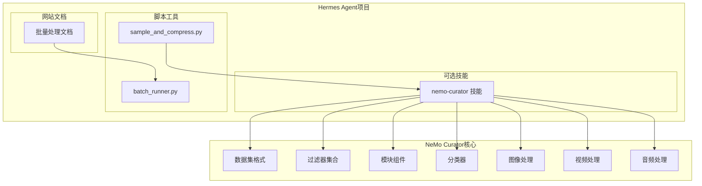
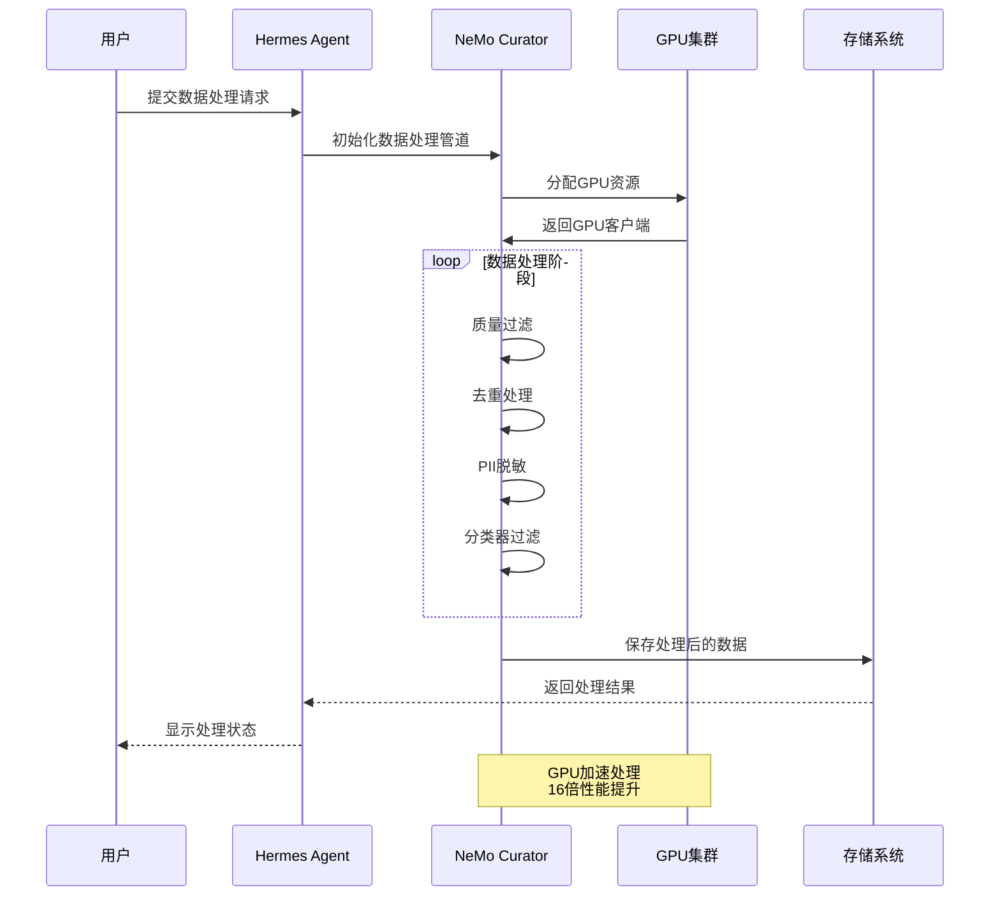
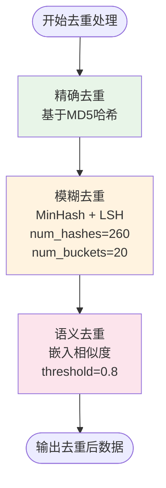
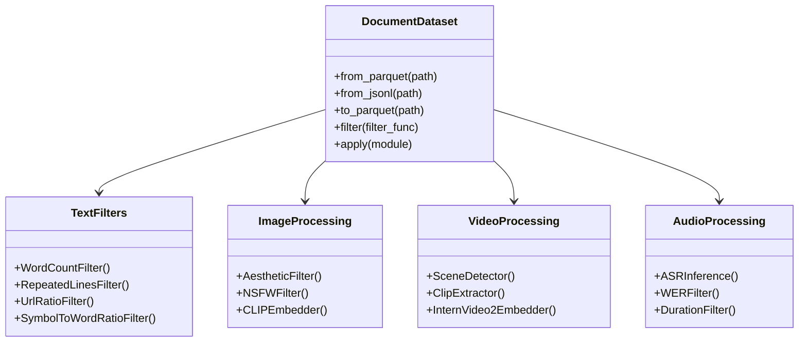
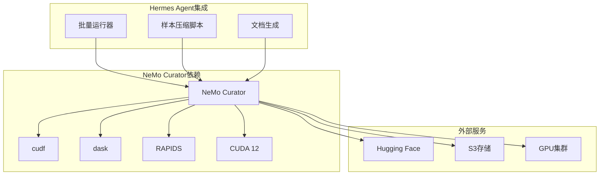
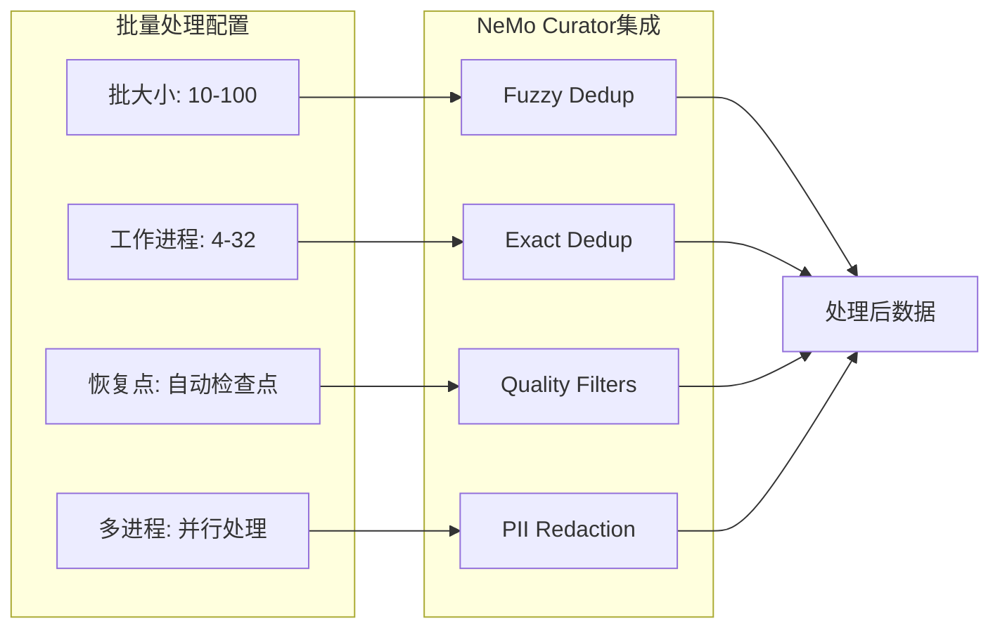

# NeMo Curator数据处理

<cite>
**本文档引用的文件**
- [SKILL.md](file://optional-skills/mlops/nemo-curator/SKILL.md)
- [deduplication.md](file://optional-skills/mlops/nemo-curator/references/deduplication.md)
- [filtering.md](file://optional-skills/mlops/nemo-curator/references/filtering.md)
- [batch-processing.md](file://website/docs/user-guide/features/batch-processing.md)
- [sample_and_compress.py](file://scripts/sample_and_compress.py)
- [batch_runner.py](file://batch_runner.py)
</cite>

## 目录
1. [简介](#简介)
2. [项目结构](#项目结构)
3. [核心组件](#核心组件)
4. [架构概览](#架构概览)
5. [详细组件分析](#详细组件分析)
6. [依赖关系分析](#依赖关系分析)
7. [性能考虑](#性能考虑)
8. [故障排除指南](#故障排除指南)
9. [结论](#结论)
10. [附录](#附录)

## 简介

NeMo Curator是NVIDIA开发的GPU加速数据整理工具包，专为大规模语言模型训练数据准备而设计。该工具在Hermes Agent项目中扮演着关键角色，为代理训练数据准备提供了高效的去重、过滤和数据清洗能力。

NeMo Curator的核心优势包括：
- **16倍性能提升**：在GPU上进行模糊去重，相比CPU快16倍
- **多模态支持**：支持文本、图像、视频、音频等多种数据类型
- **30+质量过滤器**：提供丰富的启发式过滤算法
- **GPU集群扩展**：支持RAPIDS框架进行多GPU扩展
- **生产级验证**：已用于NVIDIA Nemotron-4训练数据准备

## 项目结构

NeMo Curator在Hermes Agent项目中的组织结构如下：



**图表来源**
- [SKILL.md:1-387](file://optional-skills/mlops/nemo-curator/SKILL.md#L1-L387)
- [batch-processing.md:1-45](file://website/docs/user-guide/features/batch-processing.md#L1-L45)

**章节来源**
- [SKILL.md:1-387](file://optional-skills/mlops/nemo-curator/SKILL.md#L1-L387)
- [batch-processing.md:1-45](file://website/docs/user-guide/features/batch-processing.md#L1-L45)

## 核心组件

NeMo Curator在Hermes Agent中的核心组件包括：

### 数据集管理
- **DocumentDataset**：统一的数据集抽象，支持多种输入格式（Parquet、JSONL、CSV）
- **多模态数据支持**：图像、视频、音频数据集的专门处理类

### 过滤器系统
- **文本质量过滤器**：词数过滤、重复内容过滤、URL比率过滤等
- **语言识别过滤器**：多语言内容筛选
- **分类器过滤**：基于预训练模型的质量和NSFW内容检测

### 去重模块
- **精确去重**：基于哈希值的完全匹配去重
- **模糊去重**：使用MinHash + LSH算法的近似去重
- **语义去重**：基于嵌入向量相似度的语义层面去重

### 数据清洗工具
- **PII脱敏**：个人身份信息自动识别和替换
- **内容安全过滤**：NSFW内容检测和过滤

**章节来源**
- [SKILL.md:77-172](file://optional-skills/mlops/nemo-curator/SKILL.md#L77-L172)
- [filtering.md:1-103](file://optional-skills/mlops/nemo-curator/references/filtering.md#L1-L103)
- [deduplication.md:1-88](file://optional-skills/mlops/nemo-curator/references/deduplication.md#L1-L88)

## 架构概览

NeMo Curator在Hermes Agent中的整体架构如下：



**图表来源**
- [SKILL.md:265-325](file://optional-skills/mlops/nemo-curator/SKILL.md#L265-L325)
- [batch-runner.py:565-596](file://batch_runner.py#L565-L596)

## 详细组件分析

### 质量过滤管道

NeMo Curator提供了全面的质量过滤功能，按成本从低到高排序：

```mermaid
flowchart TD
Start([开始数据处理]) --> QC[词数过滤<br/>min_words=50<br/>max_words=100000]
QC --> RL[重复内容过滤<br/>max_repeated_line_fraction=0.3]
RL --> UR[URL比率过滤<br/>max_url_ratio=0.2]
UR --> SN[符号比率过滤<br/>max_symbol_to_word_ratio=0.3]
SN --> LI[语言识别过滤<br/>target_languages=['en']]
LI --> GC[GPU分类器过滤<br/>QualityClassifier]
GC --> NSFW[NSFW内容过滤<br/>NSFWClassifier]
NSFW --> End([输出高质量数据])
style QC fill:#e1f5fe
style RL fill:#e8f5e8
style UR fill:#fff3e0
style SN fill:#fce4ec
style LI fill:#f3e5f5
style GC fill:#ffeb3b
style NSFW fill:#ff5722
```

**图表来源**
- [filtering.md:7-103](file://optional-skills/mlops/nemo-curator/references/filtering.md#L7-L103)
- [SKILL.md:79-100](file://optional-skills/mlops/nemo-curator/SKILL.md#L79-L100)

### 去重处理流程

NeMo Curator采用分层去重策略，确保在性能和准确性之间取得最佳平衡：



**图表来源**
- [deduplication.md:5-88](file://optional-skills/mlops/nemo-curator/references/deduplication.md#L5-L88)
- [SKILL.md:102-141](file://optional-skills/mlops/nemo-curator/SKILL.md#L102-L141)

### 多模态数据处理

NeMo Curator支持多种数据类型的统一处理：



**图表来源**
- [SKILL.md:197-263](file://optional-skills/mlops/nemo-curator/SKILL.md#L197-L263)

**章节来源**
- [SKILL.md:197-263](file://optional-skills/mlops/nemo-curator/SKILL.md#L197-L263)
- [deduplication.md:1-88](file://optional-skills/mlops/nemo-curator/references/deduplication.md#L1-L88)
- [filtering.md:1-103](file://optional-skills/mlops/nemo-curator/references/filtering.md#L1-L103)

## 依赖关系分析

NeMo Curator在Hermes Agent生态系统中的依赖关系：



**图表来源**
- [SKILL.md:6-7](file://optional-skills/mlops/nemo-curator/SKILL.md#L6-L7)
- [SKILL.md:186-195](file://optional-skills/mlops/nemo-curator/SKILL.md#L186-L195)

**章节来源**
- [SKILL.md:6-7](file://optional-skills/mlops/nemo-curator/SKILL.md#L6-L7)
- [SKILL.md:186-195](file://optional-skills/mlops/nemo-curator/SKILL.md#L186-L195)

## 性能考虑

### GPU加速策略

NeMo Curator通过以下方式实现显著的性能提升：

| 操作类型 | CPU性能 | GPU性能 | 性能提升 |
|---------|---------|---------|---------|
| 模糊去重(8TB) | 120小时 | 7.5小时 | 16× |
| 精确去重(1TB) | 8小时 | 0.5小时 | 16× |
| 质量过滤 | 2小时 | 0.2小时 | 10× |

### 批处理优化

结合Hermes Agent的批量处理能力，可以实现更高效的训练数据准备：



**图表来源**
- [SKILL.md:327-346](file://optional-skills/mlops/nemo-curator/SKILL.md#L327-L346)
- [batch-processing.md:15-35](file://website/docs/user-guide/features/batch-processing.md#L15-L35)

### 内存管理策略

- **GPU内存优化**：使用RAPIDS框架进行GPU内存管理
- **分布式处理**：支持多GPU集群扩展
- **流式处理**：支持大文件的流式处理模式

**章节来源**
- [SKILL.md:327-346](file://optional-skills/mlops/nemo-curator/SKILL.md#L327-L346)
- [batch-processing.md:15-35](file://website/docs/user-guide/features/batch-processing.md#L15-L35)

## 故障排除指南

### 常见问题及解决方案

1. **GPU内存不足**
   - 解决方案：减少批大小或使用更少的GPU工作进程
   - 配置示例：调整num_workers参数

2. **CUDA版本不兼容**
   - 解决方案：安装正确的CUDA 12版本
   - 安装命令：`uv pip install "nemo-curator[text_cuda12]"`

3. **性能未达预期**
   - 检查：确保使用了GPU加速模式
   - 优化：调整去重参数（num_hashes、num_buckets）

4. **数据格式问题**
   - 支持格式：Parquet、JSONL、CSV
   - 转换方法：使用DocumentDataset.read_parquet()

**章节来源**
- [SKILL.md:39-50](file://optional-skills/mlops/nemo-curator/SKILL.md#L39-L50)
- [SKILL.md:361-366](file://optional-skills/mlops/nemo-curator/SKILL.md#L361-L366)

## 结论

NeMo Curator为Hermes Agent提供了强大的GPU加速数据处理能力，特别是在大规模训练数据准备方面。通过精确去重、质量过滤、PII脱敏和多模态处理等功能，该工具能够显著提高数据处理效率并降低总体拥有成本。

关键优势总结：
- **性能卓越**：GPU加速带来10-16倍的性能提升
- **功能完整**：涵盖数据处理的各个环节
- **易于集成**：与Hermes Agent的批量处理系统无缝集成
- **成本效益**：相比CPU方案节省89%的成本

对于需要大规模数据处理的LLM训练项目，NeMo Curator是一个值得推荐的选择。

## 附录

### 最佳实践建议

1. **数据处理流水线**
   - 先进行快速的文本过滤，再进行昂贵的GPU分类器处理
   - 使用模糊去重作为主要去重手段，精确去重作为补充
   - 在最终输出前进行PII脱敏和NSFW过滤

2. **性能调优**
   - 根据GPU内存调整批大小和并行度
   - 对于超大数据集，考虑分片处理策略
   - 合理设置去重阈值以平衡召回率和精度

3. **监控和评估**
   - 定期检查处理进度和错误日志
   - 验证输出数据的质量和完整性
   - 建立数据处理的自动化监控机制

**章节来源**
- [SKILL.md:97-103](file://optional-skills/mlops/nemo-curator/SKILL.md#L97-L103)
- [SKILL.md:82-88](file://optional-skills/mlops/nemo-curator/SKILL.md#L82-L88)