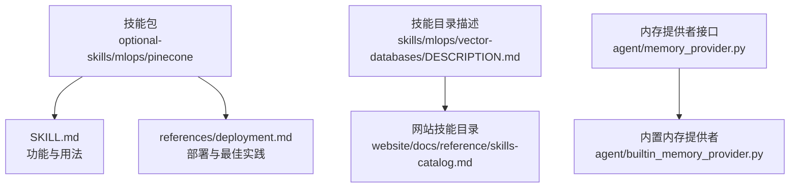
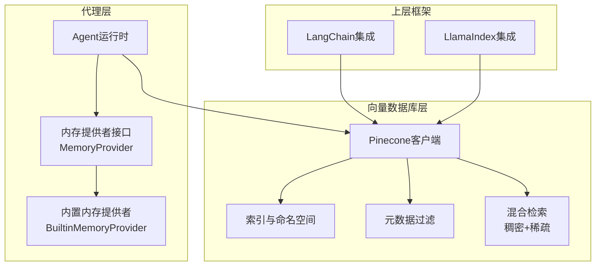
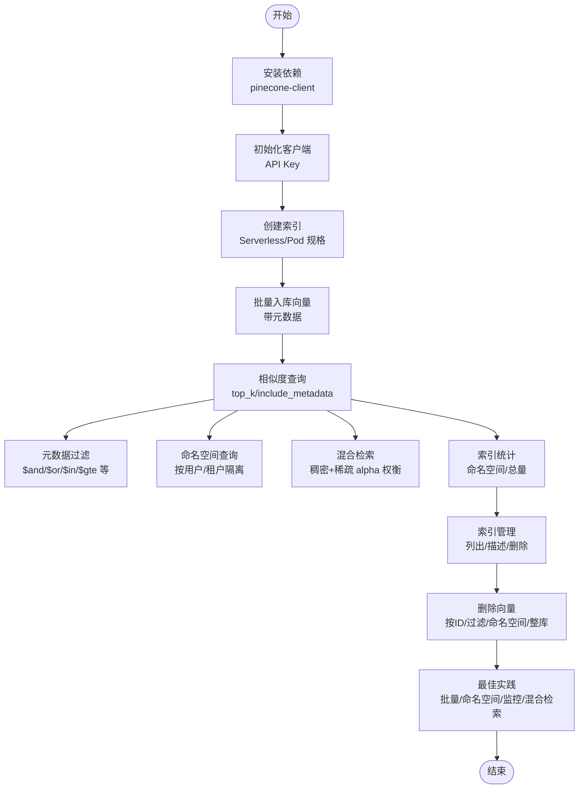
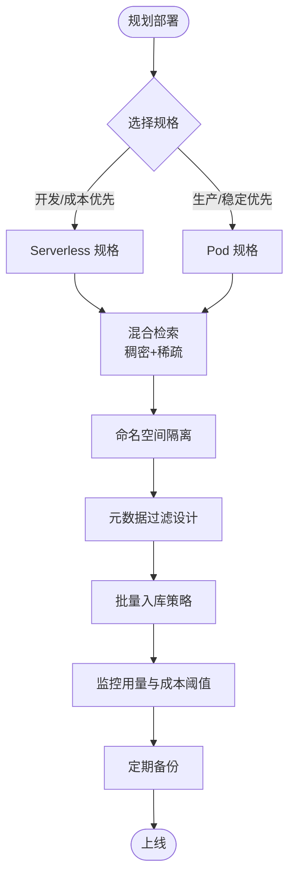
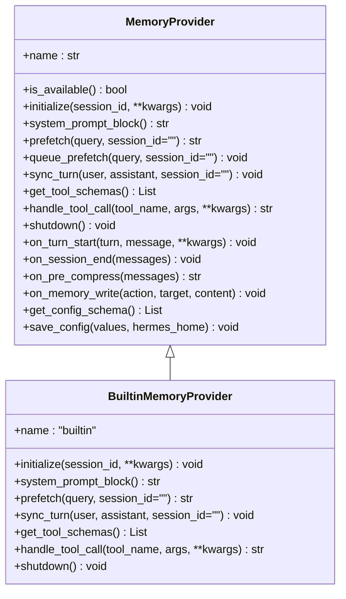
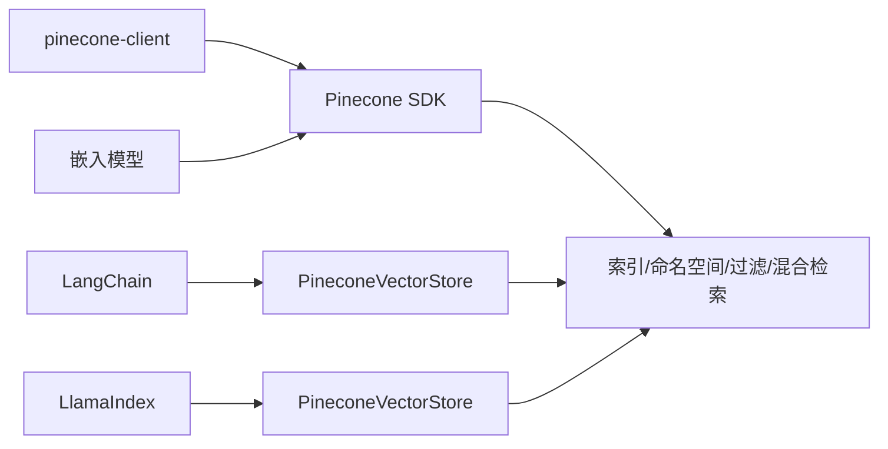

# Pinecone向量数据库

<cite>
**本文引用的文件**
- [SKILL.md](file://optional-skills/mlops/pinecone/SKILL.md)
- [deployment.md](file://optional-skills/mlops/pinecone/references/deployment.md)
- [DESCRIPTION.md](file://skills/mlops/vector-databases/DESCRIPTION.md)
- [memory_provider.py](file://agent/memory_provider.py)
- [builtin_memory_provider.py](file://agent/builtin_memory_provider.py)
- [skills-catalog.md](file://website/docs/reference/skills-catalog.md)
</cite>

## 目录
1. [简介](#简介)
2. [项目结构](#项目结构)
3. [核心组件](#核心组件)
4. [架构总览](#架构总览)
5. [详细组件分析](#详细组件分析)
6. [依赖关系分析](#依赖关系分析)
7. [性能考量](#性能考量)
8. [故障排查指南](#故障排查指南)
9. [结论](#结论)
10. [附录](#附录)

## 简介
本文件面向Hermes Agent用户与开发者，系统化阐述如何在代理系统中使用Pinecone作为云端向量数据库。内容涵盖服务特性与企业级价值、部署配置（Serverless与Pod）、索引管理与查询优化、API密钥与安全配置、成本控制策略，以及在代理实时检索与推荐系统中的应用实践路径。

Pinecone是托管式向量数据库，具备自动伸缩、混合检索（稠密+稀疏）、元数据过滤、命名空间隔离等能力，适合生产级RAG、推荐系统与语义搜索场景，尤其强调低延迟与无运维负担。

## 项目结构
与Pinecone相关的知识资产主要分布在以下位置：
- optional-skills/mlops/pinecone：技能包与使用指南（含LangChain/LlamaIndex集成）
- optional-skills/mlops/pinecone/references：部署参考文档
- skills/mlops/vector-databases：向量数据库技能目录描述
- agent/memory_provider.*：内存提供者抽象与内置实现（用于理解向量数据库在代理中的定位）

**图表来源**
- [SKILL.md:1-362](file://optional-skills/mlops/pinecone/SKILL.md#L1-L362)
- [deployment.md:1-182](file://optional-skills/mlops/pinecone/references/deployment.md#L1-L182)
- [DESCRIPTION.md:1-4](file://skills/mlops/vector-databases/DESCRIPTION.md#L1-L4)
- [memory_provider.py:1-232](file://agent/memory_provider.py#L1-L232)
- [builtin_memory_provider.py:1-115](file://agent/builtin_memory_provider.py#L1-L115)

**章节来源**
- [SKILL.md:1-362](file://optional-skills/mlops/pinecone/SKILL.md#L1-L362)
- [deployment.md:1-182](file://optional-skills/mlops/pinecone/references/deployment.md#L1-L182)
- [DESCRIPTION.md:1-4](file://skills/mlops/vector-databases/DESCRIPTION.md#L1-L4)
- [memory_provider.py:1-232](file://agent/memory_provider.py#L1-L232)
- [builtin_memory_provider.py:1-115](file://agent/builtin_memory_provider.py#L1-L115)

## 核心组件
- 技能包与用法
  - 提供从安装、初始化、索引创建、向量入库、查询、命名空间、混合检索到索引管理与删除的全链路操作示例。
  - 支持LangChain与LlamaIndex两种主流框架集成方式。
- 部署参考
  - 对比Serverless与Pod两种规格，给出选型建议与典型配置。
  - 强调多租户隔离（命名空间）、元数据过滤、混合检索、批量入库、监控与告警等最佳实践。
- 内存提供者接口
  - 为将向量数据库接入代理的“记忆/上下文”体系提供统一抽象，便于在代理生命周期内进行预取、同步与工具暴露。

**章节来源**
- [SKILL.md:40-331](file://optional-skills/mlops/pinecone/SKILL.md#L40-L331)
- [deployment.md:5-177](file://optional-skills/mlops/pinecone/references/deployment.md#L5-L177)
- [memory_provider.py:42-232](file://agent/memory_provider.py#L42-L232)

## 架构总览
下图展示Pinecone在代理系统中的角色与交互：代理通过工具或框架集成访问Pinecone，完成嵌入生成、向量入库与相似度检索；同时可结合命名空间与元数据过滤实现多租户隔离与精准召回。

**图表来源**
- [memory_provider.py:42-232](file://agent/memory_provider.py#L42-L232)
- [builtin_memory_provider.py:24-115](file://agent/builtin_memory_provider.py#L24-L115)
- [SKILL.md:239-283](file://optional-skills/mlops/pinecone/SKILL.md#L239-L283)
- [deployment.md:101-125](file://optional-skills/mlops/pinecone/references/deployment.md#L101-L125)

## 详细组件分析

### 组件A：Pinecone技能包（SKILL.md）
- 功能要点
  - 安装与初始化：依赖pinecone-client，使用API Key连接。
  - 索引创建：支持Serverless与Pod两种规格，需匹配嵌入维度与距离度量。
  - 向量入库：单次与批量入库，建议批量提升吞吐。
  - 查询与过滤：基础查询、元数据过滤、命名空间查询、结果解析。
  - 命名空间：按用户/租户隔离数据，支持统计查询。
  - 混合检索：同时使用稠密向量与稀疏向量，通过alpha平衡权重。
  - 框架集成：LangChain与LlamaIndex两种主流路径。
  - 索引管理：列出、描述、统计、删除索引。
  - 删除向量：按ID、按过滤条件、按命名空间清空、整库清空。
  - 最佳实践：Serverless优先、批量入库、添加元数据、命名空间隔离、监控用量、优化过滤、测试免费额度、混合检索、维度匹配、定期备份。
  - 性能与计价：提供典型延迟与价格区间，Serverless按读写单元与存储计费，免费额度适合原型验证。

**图表来源**
- [SKILL.md:47-318](file://optional-skills/mlops/pinecone/SKILL.md#L47-L318)

**章节来源**
- [SKILL.md:40-331](file://optional-skills/mlops/pinecone/SKILL.md#L40-L331)

### 组件B：部署参考（deployment.md）
- 规格对比
  - Serverless：自动伸缩、按使用付费、无需运维、适合变负载与成本敏感场景。
  - Pod：性能稳定、延迟可预期、吞吐更高、资源专用，适合生产与高并发场景。
- 混合检索
  - 同时提供稠密向量与稀疏向量，查询时通过alpha参数平衡语义与关键词匹配。
- 命名空间
  - 多租户隔离、用户数据分区、命名空间统计。
- 元数据过滤
  - 支持精确匹配、范围查询、逻辑组合与集合包含。
- 最佳实践
  - 开发期用Serverless，生产期切换Pod；实施命名空间；添加元数据；混合检索；批量入库；监控用量与成本阈值；定期备份；测试过滤性能。

**图表来源**
- [deployment.md:5-177](file://optional-skills/mlops/pinecone/references/deployment.md#L5-L177)

**章节来源**
- [deployment.md:1-182](file://optional-skills/mlops/pinecone/references/deployment.md#L1-L182)

### 组件C：内存提供者接口（MemoryProvider）
- 设计目标
  - 为代理提供可插拔的记忆后端，内置提供者始终启用，外部提供者最多一个，避免工具Schema膨胀与冲突。
- 生命周期钩子
  - 初始化、系统提示注入、每回合预取、回合同步、工具Schema与调用、关闭清理。
  - 可选钩子：回合开始、会话结束、压缩前提取、镜像内置写入、委托观察。
- 在Pinecone中的定位
  - 可通过实现MemoryProvider接口，将向量数据库作为外部记忆提供者接入代理，利用其命名空间与元数据能力实现多租户与上下文检索。

**图表来源**
- [memory_provider.py:42-232](file://agent/memory_provider.py#L42-L232)
- [builtin_memory_provider.py:24-115](file://agent/builtin_memory_provider.py#L24-L115)

**章节来源**
- [memory_provider.py:1-232](file://agent/memory_provider.py#L1-L232)
- [builtin_memory_provider.py:1-115](file://agent/builtin_memory_provider.py#L1-L115)

### 组件D：技能目录与网站引用
- 技能目录描述
  - 向量数据库技能目录整体描述了RAG、语义搜索与AI应用后端的相似度检索与嵌入数据库能力。
- 网站技能目录
  - 明确列出pinecone技能条目及其简要说明，便于在Hermes技能生态中发现与集成。

**章节来源**
- [DESCRIPTION.md:1-4](file://skills/mlops/vector-databases/DESCRIPTION.md#L1-L4)
- [skills-catalog.md:223-223](file://website/docs/reference/skills-catalog.md#L223-L223)

## 依赖关系分析
- 技术栈依赖
  - pinecone-client：Pinecone官方Python SDK，提供索引创建、连接、入库、查询、统计与删除等能力。
  - LangChain与LlamaIndex：通过各自向量存储适配器对接Pinecone，简化RAG流水线构建。
- 与代理系统的耦合
  - 通过MemoryProvider接口，向量数据库可作为外部记忆提供者被代理统一调度，实现预取、同步与工具调用。
- 外部集成点
  - 嵌入模型：需确保向量维度与索引dimension一致。
  - 元数据字段：用于过滤与排序，应提前规划并建立索引以优化查询性能。

**图表来源**
- [SKILL.md:241-283](file://optional-skills/mlops/pinecone/SKILL.md#L241-L283)

**章节来源**
- [SKILL.md:239-283](file://optional-skills/mlops/pinecone/SKILL.md#L239-L283)

## 性能考量
- 延迟与规模
  - 典型延迟：入库约50-100ms/批，查询p50约50ms，p95约100ms（SLA目标）。
  - 元数据过滤带来额外开销（约+10-20ms），应谨慎使用复杂过滤。
- 扩展性
  - Serverless自动伸缩，适合流量波动场景；Pod提供稳定吞吐与更低尾延迟。
- 批量策略
  - 建议批量入库（100-200向量/批），减少网络往返与SDK开销。
- 混合检索
  - 结合稠密语义与稀疏关键词，通常能提升召回质量与相关性。

**章节来源**
- [SKILL.md:333-341](file://optional-skills/mlops/pinecone/SKILL.md#L333-L341)
- [deployment.md:66-100](file://optional-skills/mlops/pinecone/references/deployment.md#L66-L100)

## 故障排查指南
- 常见问题与处理
  - API Key错误或权限不足：确认API Key有效且具备创建/读写索引权限。
  - 维度不匹配：确保嵌入维度与索引dimension一致，否则入库失败。
  - 过滤性能差：对高频过滤字段建立索引，避免全表扫描。
  - 命名空间误用：检查命名空间是否正确传入，避免跨租户数据泄露或检索不到。
  - 混合检索参数：合理设置alpha，平衡语义与关键词权重。
  - 成本超支：开启用量监控与成本阈值告警，必要时切换Pod规格或优化查询。
- 调试建议
  - 使用Pinecone控制台查看索引状态与用量趋势。
  - 在开发阶段使用免费额度进行压测与参数调优。
  - 记录关键指标（延迟、吞吐、错误率、成本）以便定位瓶颈。

**章节来源**
- [SKILL.md:320-331](file://optional-skills/mlops/pinecone/SKILL.md#L320-L331)
- [deployment.md:165-177](file://optional-skills/mlops/pinecone/references/deployment.md#L165-L177)

## 结论
Pinecone为Hermes Agent提供了成熟可靠的托管向量数据库方案，具备自动伸缩、低延迟、混合检索与命名空间隔离等优势。结合LangChain/LlamaIndex集成与代理的MemoryProvider接口，可在RAG、实时检索与推荐系统中快速落地。建议遵循批量入库、命名空间隔离、元数据过滤优化与监控告警的最佳实践，并根据业务负载选择合适的规格（Serverless/Pod）以实现性能与成本的平衡。

## 附录
- 快速参考
  - 安装：pip install pinecone-client
  - 初始化：使用API Key连接
  - 创建索引：Serverless或Pod规格，指定维度与度量
  - 入库：批量入库，附带元数据
  - 查询：top_k、include_metadata、命名空间、元数据过滤、混合检索
  - 管理：列出/描述/统计/删除索引；按ID/过滤/命名空间/整库删除向量
  - 集成：LangChain PineconeVectorStore 或 LlamaIndex PineconeVectorStore
- 资源链接
  - 官网：https://www.pinecone.io
  - 文档：https://docs.pinecone.io
  - 控制台：https://app.pinecone.io
  - 定价：https://www.pinecone.io/pricing

**章节来源**
- [SKILL.md:355-361](file://optional-skills/mlops/pinecone/SKILL.md#L355-L361)
- [deployment.md:178-182](file://optional-skills/mlops/pinecone/references/deployment.md#L178-L182)