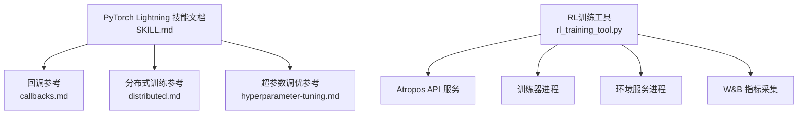
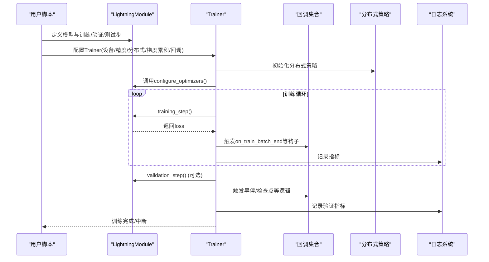
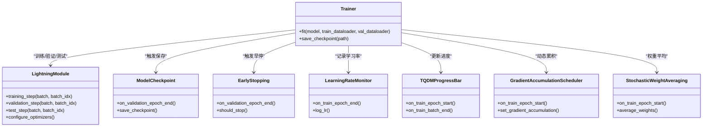
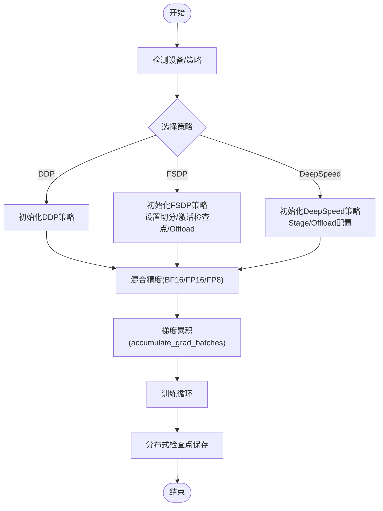
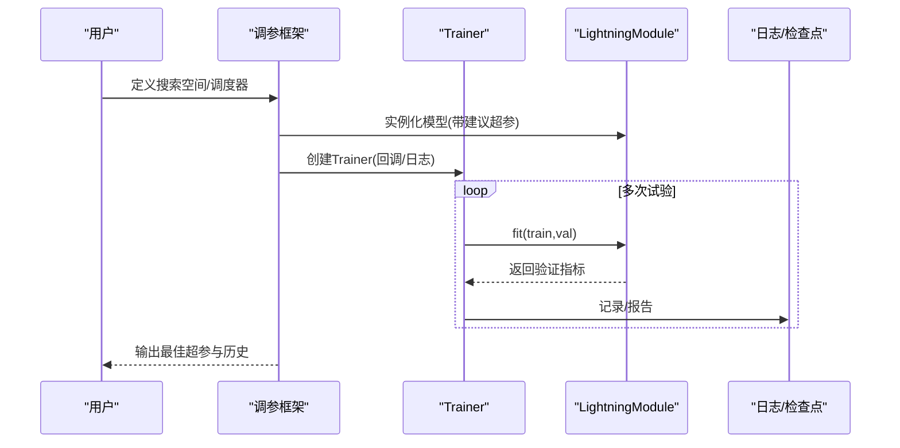
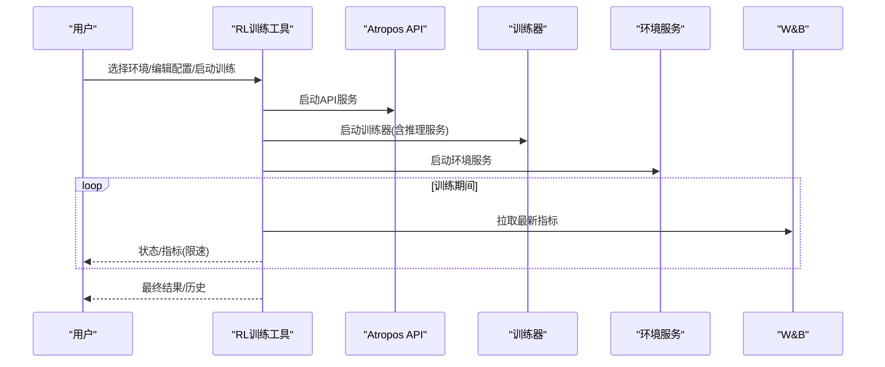
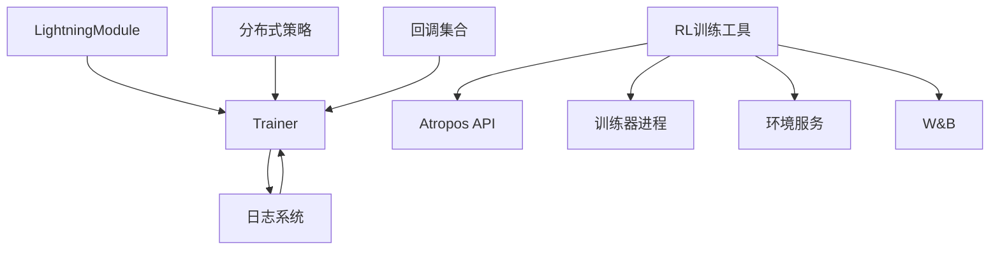

# PyTorch Lightning训练框架

<cite>
**本文引用的文件**
- [SKILL.md](file://optional-skills/mlops/pytorch-lightning/SKILL.md)
- [callbacks.md](file://optional-skills/mlops/pytorch-lightning/references/callbacks.md)
- [distributed.md](file://optional-skills/mlops/pytorch-lightning/references/distributed.md)
- [hyperparameter-tuning.md](file://optional-skills/mlops/pytorch-lightning/references/hyperparameter-tuning.md)
- [rl_training_tool.py](file://tools/rl_training_tool.py)
</cite>

## 目录
1. [简介](#简介)
2. [项目结构](#项目结构)
3. [核心组件](#核心组件)
4. [架构总览](#架构总览)
5. [详细组件分析](#详细组件分析)
6. [依赖关系分析](#依赖关系分析)
7. [性能考量](#性能考量)
8. [故障排查指南](#故障排查指南)
9. [结论](#结论)
10. [附录](#附录)

## 简介
本文件面向Hermes Agent中的PyTorch Lightning训练框架工具，系统化阐述其在深度学习训练中的简化作用与最佳实践，覆盖回调函数配置、分布式训练、超参数调优、数据并行、梯度累积与混合精度等优化策略，并结合代理模型训练场景给出可操作的流程与性能监控方法。文档同时对仓库内相关参考材料进行整合与可视化呈现，帮助读者快速上手并稳定落地。

## 项目结构
围绕PyTorch Lightning训练框架，仓库提供了以下关键资源：
- PyTorch Lightning技能文档：概述快速入门、从原生PyTorch迁移到Lightning的步骤、验证与测试、分布式训练、回调与学习率调度、常见问题与高级主题。
- 回调参考：内置回调（检查点、早停、学习率监控、进度条、梯度累积调度、SWA）与自定义回调开发指南。
- 分布式训练参考：DDP、FSDP、DeepSpeed策略、多节点部署、混合精度、梯度累积、分布式检查点与最佳实践。
- 超参数调优参考：Ray Tune、Optuna、W&B Sweeps、Lightning内置自动学习率与批大小查找。
- RL训练工具：通过子进程管理Atropos API、训练器与环境服务，集成W&B指标监控，支持训练生命周期管理与结果查询。

图表来源
- [SKILL.md:14-350](file://optional-skills/mlops/pytorch-lightning/SKILL.md#L14-L350)
- [callbacks.md:1-437](file://optional-skills/mlops/pytorch-lightning/references/callbacks.md#L1-L437)
- [distributed.md:1-491](file://optional-skills/mlops/pytorch-lightning/references/distributed.md#L1-L491)
- [hyperparameter-tuning.md:1-557](file://optional-skills/mlops/pytorch-lightning/references/hyperparameter-tuning.md#L1-L557)
- [rl_training_tool.py:1-1397](file://tools/rl_training_tool.py#L1-L1397)

章节来源
- [SKILL.md:1-350](file://optional-skills/mlops/pytorch-lightning/SKILL.md#L1-L350)
- [callbacks.md:1-437](file://optional-skills/mlops/pytorch-lightning/references/callbacks.md#L1-L437)
- [distributed.md:1-491](file://optional-skills/mlops/pytorch-lightning/references/distributed.md#L1-L491)
- [hyperparameter-tuning.md:1-557](file://optional-skills/mlops/pytorch-lightning/references/hyperparameter-tuning.md#L1-L557)
- [rl_training_tool.py:1-1397](file://tools/rl_training_tool.py#L1-L1397)

## 核心组件
- 训练入口与Trainer封装：通过LightningModule组织前向、损失与优化器；Trainer负责设备切换、分布式、混合精度、梯度累积、检查点、日志与进度条等。
- 回调系统：以模块化方式扩展训练行为，如保存最佳模型、早停、学习率监控、进度条、动态梯度累积、随机权重平均等。
- 分布式策略：统一接口切换至DDP、FSDP、DeepSpeed，支持多节点、SLURM/Kubernetes环境、混合精度与梯度累积。
- 超参数调优：与Ray Tune、Optuna、W&B Sweeps集成，或使用Lightning内置自动学习率与批大小查找。
- 性能监控：结合W&B、TensorBoard等日志系统，记录训练指标与学习率变化，便于可视化与复盘。

章节来源
- [SKILL.md:25-350](file://optional-skills/mlops/pytorch-lightning/SKILL.md#L25-L350)
- [callbacks.md:1-437](file://optional-skills/mlops/pytorch-lightning/references/callbacks.md#L1-L437)
- [distributed.md:1-491](file://optional-skills/mlops/pytorch-lightning/references/distributed.md#L1-L491)
- [hyperparameter-tuning.md:1-557](file://optional-skills/mlops/pytorch-lightning/references/hyperparameter-tuning.md#L1-L557)

## 架构总览
下图展示了Lightning在训练中的关键交互：LightningModule定义模型逻辑，Trainer协调分布式、混合精度、梯度累积与回调；回调按钩子在训练周期内执行；日志系统记录指标供监控与可视化。

图表来源
- [SKILL.md:111-149](file://optional-skills/mlops/pytorch-lightning/SKILL.md#L111-L149)
- [callbacks.md:265-347](file://optional-skills/mlops/pytorch-lightning/references/callbacks.md#L265-L347)
- [distributed.md:245-310](file://optional-skills/mlops/pytorch-lightning/references/distributed.md#L245-L310)

## 详细组件分析

### 组件A：回调系统（Checkpoint、EarlyStopping、LearningRateMonitor、进度条、动态梯度累积、SWA）
- 检查点（ModelCheckpoint）：按监控指标保存最优模型，支持命名模式、保存数量与最后模型保存。
- 早停（EarlyStopping）：在指标长时间无改善时停止训练，支持阈值、发散检测与严格模式。
- 学习率监控（LearningRateMonitor）：自动记录学习率与动量（可选），便于可视化。
- 进度条（TQDMProgressBar）：自定义刷新频率与位置。
- 动态梯度累积（GradientAccumulationScheduler）：按轮次调整累积步数，提升稳定性或吞吐。
- 随机权重平均（StochasticWeightAveraging）：在训练后期对权重做滑动平均，提升泛化。

图表来源
- [callbacks.md:9-157](file://optional-skills/mlops/pytorch-lightning/references/callbacks.md#L9-L157)
- [callbacks.md:159-263](file://optional-skills/mlops/pytorch-lightning/references/callbacks.md#L159-L263)
- [callbacks.md:265-347](file://optional-skills/mlops/pytorch-lightning/references/callbacks.md#L265-L347)
- [callbacks.md:351-437](file://optional-skills/mlops/pytorch-lightning/references/callbacks.md#L351-L437)

章节来源
- [callbacks.md:1-437](file://optional-skills/mlops/pytorch-lightning/references/callbacks.md#L1-L437)

### 组件B：分布式训练（DDP/FSDP/DeepSpeed）与多节点
- DDP：默认多GPU并行，自动分发数据、同步梯度与权重。
- FSDP：大模型内存高效切分，支持ZeRO-3等策略，可启用CPU offload与激活检查点。
- DeepSpeed：大规模模型（70B+）的ZeRO-3优化，支持CPU offload与配置文件。
- 多节点：通过环境变量或SLURM/Kubernetes自动发现集群信息，统一策略配置。
- 混合精度与梯度累积：BF16/A100推荐，FP16/V100可用，FP8需特定引擎；通过accumulate_grad_batches模拟更大批次。
- 分布式检查点：仅全局零进程保存，或手动在训练中按步保存。

图表来源
- [distributed.md:7-119](file://optional-skills/mlops/pytorch-lightning/references/distributed.md#L7-L119)
- [distributed.md:170-243](file://optional-skills/mlops/pytorch-lightning/references/distributed.md#L170-L243)
- [distributed.md:245-310](file://optional-skills/mlops/pytorch-lightning/references/distributed.md#L245-L310)
- [distributed.md:312-354](file://optional-skills/mlops/pytorch-lightning/references/distributed.md#L312-L354)

章节来源
- [distributed.md:1-491](file://optional-skills/mlops/pytorch-lightning/references/distributed.md#L1-L491)

### 组件C：超参数调优（Ray Tune/Optuna/W&B Sweeps/Lightning内置）
- Ray Tune：支持基础示例与PBT（人口基于训练）、ASHA（异步成功消减）等调度器。
- Optuna：集成PyTorchLightningPruningCallback实现早期停止，支持共享数据库进行分布式优化。
- W&B Sweeps：通过配置文件定义搜索空间，训练脚本读取wandb.config并记录指标。
- Lightning内置：自动学习率查找（lr_find）与自动批大小查找（auto_scale_batch_size）。

图表来源
- [hyperparameter-tuning.md:15-70](file://optional-skills/mlops/pytorch-lightning/references/hyperparameter-tuning.md#L15-L70)
- [hyperparameter-tuning.md:98-152](file://optional-skills/mlops/pytorch-lightning/references/hyperparameter-tuning.md#L98-L152)
- [hyperparameter-tuning.md:175-245](file://optional-skills/mlops/pytorch-lightning/references/hyperparameter-tuning.md#L175-L245)
- [hyperparameter-tuning.md:297-364](file://optional-skills/mlops/pytorch-lightning/references/hyperparameter-tuning.md#L297-L364)

章节来源
- [hyperparameter-tuning.md:1-557](file://optional-skills/mlops/pytorch-lightning/references/hyperparameter-tuning.md#L1-L557)

### 组件D：代理模型训练中的应用与监控（结合RL训练工具）
- 训练生命周期：通过子进程启动Atropos API、训练器与环境服务，统一管理日志与状态。
- 指标监控：集成W&B，定期拉取最新指标（如奖励均值、正确率等），支持速率限制的健康检查。
- 结果获取：训练完成后可查询最终指标与历史记录，便于复盘与导出。

图表来源
- [rl_training_tool.py:314-429](file://tools/rl_training_tool.py#L314-L429)
- [rl_training_tool.py:815-901](file://tools/rl_training_tool.py#L815-L901)
- [rl_training_tool.py:936-977](file://tools/rl_training_tool.py#L936-L977)

章节来源
- [rl_training_tool.py:1-1397](file://tools/rl_training_tool.py#L1-L1397)

## 依赖关系分析
- Trainer与LightningModule：训练主循环由Trainer驱动，LightningModule提供训练/验证/测试步与优化器配置。
- Trainer与分布式策略：通过strategy参数切换DDP/FSDP/DeepSpeed，Trainer内部处理进程/节点初始化与通信。
- Trainer与回调：回调在训练周期钩子中被调用，彼此独立且可持久化状态。
- Trainer与日志系统：自动记录指标到TensorBoard/W&B等，便于可视化与实验对比。
- RL训练工具与外部服务：通过子进程管理Atropos API、训练器与环境服务，依赖W&B进行指标采集。

图表来源
- [SKILL.md:111-149](file://optional-skills/mlops/pytorch-lightning/SKILL.md#L111-L149)
- [distributed.md:1-119](file://optional-skills/mlops/pytorch-lightning/references/distributed.md#L1-L119)
- [callbacks.md:1-437](file://optional-skills/mlops/pytorch-lightning/references/callbacks.md#L1-L437)
- [rl_training_tool.py:314-429](file://tools/rl_training_tool.py#L314-L429)

章节来源
- [SKILL.md:1-350](file://optional-skills/mlops/pytorch-lightning/SKILL.md#L1-L350)
- [callbacks.md:1-437](file://optional-skills/mlops/pytorch-lightning/references/callbacks.md#L1-L437)
- [distributed.md:1-491](file://optional-skills/mlops/pytorch-lightning/references/distributed.md#L1-L491)
- [rl_training_tool.py:1-1397](file://tools/rl_training_tool.py#L1-L1397)

## 性能考量
- 设备与精度：优先BF16（A100/H100），FP16（V100），必要时考虑FP8（需特定引擎）。
- 批大小与梯度累积：在显存受限时通过accumulate_grad_batches扩大有效批大小，平衡吞吐与稳定性。
- 分布式策略选择：小模型用DDP，大模型优先FSDP，超大模型考虑DeepSpeed ZeRO-3。
- 数据加载：使用分布式采样器，合理设置num_workers/pin_memory/persistent_workers。
- 通信优化：DDP中启用梯度桶视图、静态图等选项减少内存拷贝与通信开销。
- 回调与日志：避免在分布式中重复记录（使用is_global_zero），减少不必要的IO。

章节来源
- [distributed.md:245-430](file://optional-skills/mlops/pytorch-lightning/references/distributed.md#L245-L430)
- [callbacks.md:366-430](file://optional-skills/mlops/pytorch-lightning/references/callbacks.md#L366-L430)

## 故障排查指南
- 训练不收敛：检查数据形状与标签、逐步打印首批次输入/标签；确认学习率与优化器配置。
- 显存不足：降低批大小或启用梯度累积；在FSDP中启用CPU offload；使用BF16减少内存占用。
- 验证未运行：确保传入验证数据加载器；检查验证步是否实现。
- DDP进程异常：明确devices数量；先CPU调试再切换GPU；确保环境变量正确。
- NCCL超时：增大超时时间；检查网络连通性与NVLink状态。
- 不同结果：设置统一随机种子；确保分布式环境下种子传播。
- DeepSpeed配置错误：优先使用Lightning自动生成配置；核对ZeRO阶段与offload设置。

章节来源
- [SKILL.md:270-316](file://optional-skills/mlops/pytorch-lightning/SKILL.md#L270-L316)
- [distributed.md:432-483](file://optional-skills/mlops/pytorch-lightning/references/distributed.md#L432-L483)

## 结论
PyTorch Lightning在Hermes Agent中提供了高度工程化的训练体验：以LightningModule组织研究逻辑，以Trainer统一分发与优化，以回调扩展非核心功能，以分布式策略适配从小型到超大规模模型的训练需求。结合超参数调优与W&B监控，可显著提升实验效率与结果可复现性。对于代理模型训练，RL训练工具进一步将训练生命周期与指标监控整合，形成端到端的可观测训练流水线。

## 附录
- 快速迁移要点：将原生PyTorch的训练循环抽象为LightningModule的training_step与configure_optimizers，其余由Trainer接管。
- 建议工作流：先CPU单机验证，再切换GPU；先DDP单机，再扩展到多节点；先固定超参，再引入超参搜索；先基础回调，再加入早停/检查点/学习率调度。
- 参考资源：官方文档、示例与社区讨论，便于深入理解策略细节与最佳实践。