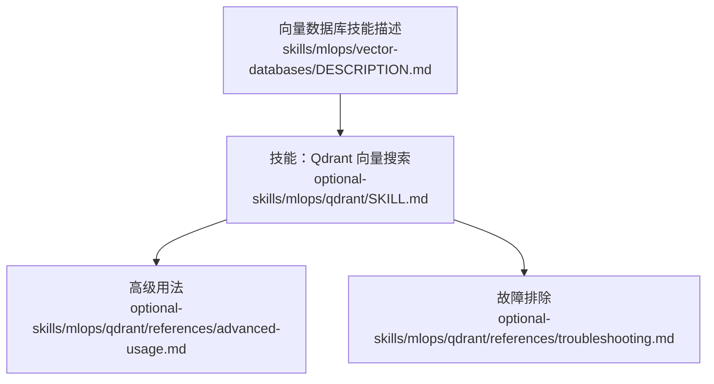
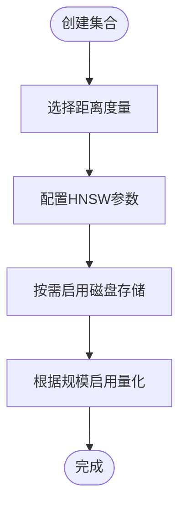
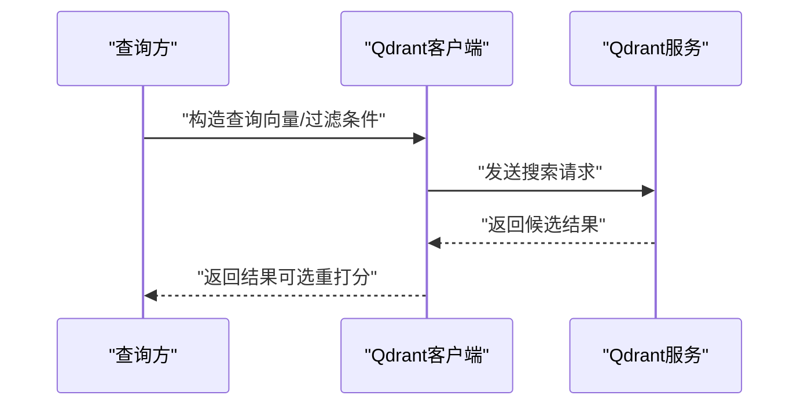
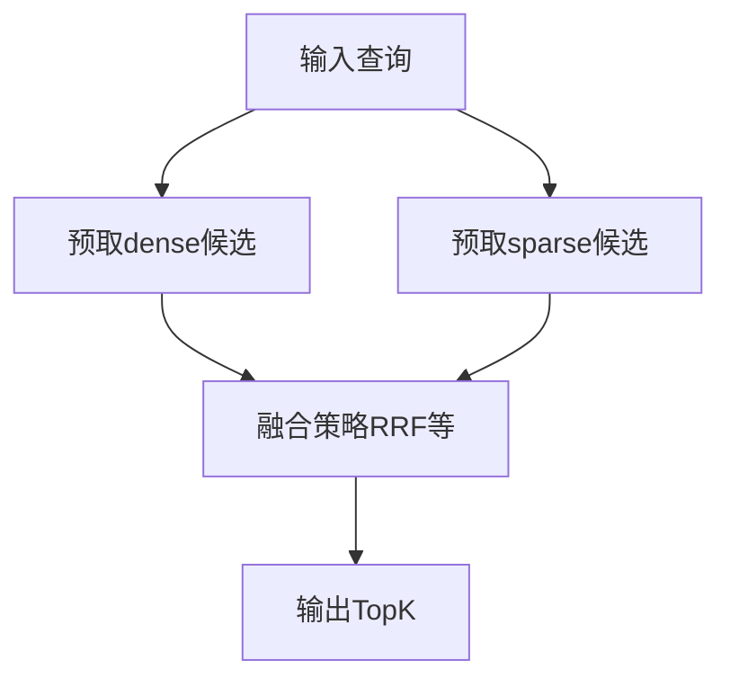
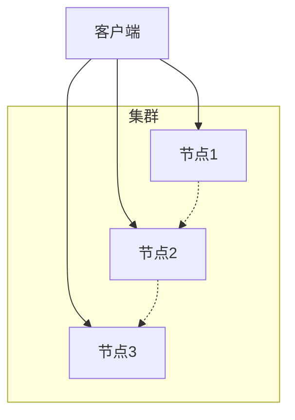
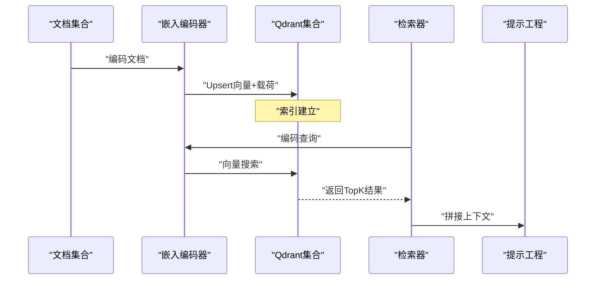
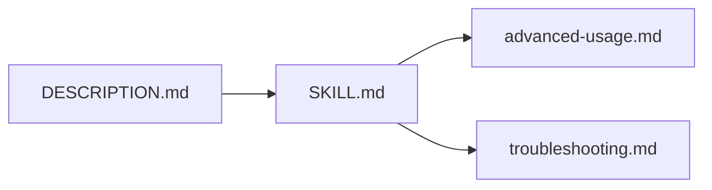

# Qdrant向量数据库

<cite>
**本文引用的文件**
- [SKILL.md](file://optional-skills/mlops/qdrant/SKILL.md)
- [advanced-usage.md](file://optional-skills/mlops/qdrant/references/advanced-usage.md)
- [troubleshooting.md](file://optional-skills/mlops/qdrant/references/troubleshooting.md)
- [DESCRIPTION.md](file://skills/mlops/vector-databases/DESCRIPTION.md)
</cite>

## 目录
1. [简介](#简介)
2. [项目结构](#项目结构)
3. [核心组件](#核心组件)
4. [架构总览](#架构总览)
5. [详细组件分析](#详细组件分析)
6. [依赖关系分析](#依赖关系分析)
7. [性能考量](#性能考量)
8. [故障排除指南](#故障排除指南)
9. [结论](#结论)
10. [附录](#附录)

## 简介
本文件面向Hermes Agent的用户与开发者，系统化介绍Qdrant在向量搜索与语义检索中的能力与实践方法。内容覆盖：
- Qdrant的核心特性与开源优势
- 部署配置（单机、持久化、云）
- 索引类型选择（距离度量、HNSW参数、量化）
- 查询优化策略（过滤、批量、混合检索）
- 高级用法（分布式、分片、副本一致性、异步客户端、gRPC）
- 故障排除与性能调优
- 在代理知识检索与RAG中的应用示例

## 项目结构
与Qdrant相关的文档位于optional-skills/mlops/qdrant目录，包含技能说明、高级用法与故障排除三类文档；同时skills/mlops/vector-databases目录提供向量数据库技能的统一描述。



图示来源
- [SKILL.md](file://optional-skills/mlops/qdrant/SKILL.md)
- [advanced-usage.md](file://optional-skills/mlops/qdrant/references/advanced-usage.md)
- [troubleshooting.md](file://optional-skills/mlops/qdrant/references/troubleshooting.md)
- [DESCRIPTION.md](file://skills/mlops/vector-databases/DESCRIPTION.md)

章节来源
- [SKILL.md](file://optional-skills/mlops/qdrant/SKILL.md)
- [advanced-usage.md](file://optional-skills/mlops/qdrant/references/advanced-usage.md)
- [troubleshooting.md](file://optional-skills/mlops/qdrant/references/troubleshooting.md)
- [DESCRIPTION.md](file://skills/mlops/vector-databases/DESCRIPTION.md)

## 核心组件
- 客户端与连接
  - Python客户端：支持REST与gRPC，可配置超时、偏好gRPC、HTTPS等
  - 连接模式：本地Docker、云服务（Qdrant Cloud）、自托管集群
- 集合与点
  - 集合：向量容器，支持HNSW索引、负载均衡、磁盘存储、量化配置
  - 点：由ID、向量与任意JSON载荷组成，支持批量Upsert
- 搜索与过滤
  - 基础近邻搜索、带过滤条件的复合查询、批量查询
  - 支持payload索引、范围/匹配/地理位置/全文检索
- 多向量与稀疏向量
  - 多命名向量（不同嵌入模型）
  - 稀疏向量（BM25/SPLADE风格），支持独立索引
- 量化与内存优化
  - 标量量化（INT8）、产品量化（X16）、二进制量化（需oversampling）
- 分布式与高可用
  - Raft共识、分片、副本、写入一致性、只读一致性级别

章节来源
- [SKILL.md](file://optional-skills/mlops/qdrant/SKILL.md)
- [advanced-usage.md](file://optional-skills/mlops/qdrant/references/advanced-usage.md)

## 架构总览
下图展示Qdrant在Hermes Agent中的典型工作流：代理通过嵌入模型生成查询向量，Qdrant执行近邻搜索与过滤，返回结果用于RAG上下文拼接。

```mermaid
graph TB
subgraph "代理侧"
U["用户查询"]
E["嵌入模型"]
P["预处理/参数化"]
end
subgraph "Qdrant服务"
C["集合/索引"]
S["搜索与过滤"]
R["结果排序/重打分"]
end
subgraph "应用侧"
X["RAG上下文构建"]
L["提示词拼接"]
A["模型推理"]
end
U --> E --> P --> S
S --> R
R --> X --> L --> A
C <- --> S
```

图示来源
- [SKILL.md](file://optional-skills/mlops/qdrant/SKILL.md)

## 详细组件分析

### 组件A：集合与索引配置
- 关键参数
  - 距离度量：COSINE（文本嵌入）、EUCLID（空间特征）、DOT（推荐）、MANHATTAN（稀疏离散）
  - HNSW参数：m（节点连接数）、ef_construct（构建精度）、full_scan_threshold（阈值以下启用暴力搜索）
  - 存储选项：on_disk_payload、on_disk（HNSW）
- 最佳实践
  - 小规模：默认HNSW参数即可
  - 大规模：开启on_disk、启用量化、按需分片
  - 过滤频繁字段：建立payload索引



图示来源
- [SKILL.md](file://optional-skills/mlops/qdrant/SKILL.md)

章节来源
- [SKILL.md](file://optional-skills/mlops/qdrant/SKILL.md)

### 组件B：搜索与过滤流程
- 基础搜索：查询向量 + topK
- 过滤搜索：must/must_not + 范围/匹配/地理位置/全文
- 批量搜索：一次请求多条查询
- 结果重打分：量化搜索后对候选进行精确重排



图示来源
- [SKILL.md](file://optional-skills/mlops/qdrant/SKILL.md)

章节来源
- [SKILL.md](file://optional-skills/mlops/qdrant/SKILL.md)

### 组件C：多向量与混合检索
- 多命名向量：同一记录存储多个向量（如dense与sparse）
- 混合检索：先对不同向量空间检索，再融合（如RRF）
- 两阶段检索：粗排（快速近似）+ 精排（精确重打分）



图示来源
- [advanced-usage.md](file://optional-skills/mlops/qdrant/references/advanced-usage.md)

章节来源
- [advanced-usage.md](file://optional-skills/mlops/qdrant/references/advanced-usage.md)

### 组件D：分布式与高可用
- 集群：Raft共识、P2P端口、引导节点
- 分片：shard_number、replication_factor、write_consistency_factor
- 一致性：写入强一致/最终一致；读取多数派一致性
- 快照与恢复：集合快照、全量存储快照、下载与恢复



图示来源
- [advanced-usage.md](file://optional-skills/mlops/qdrant/references/advanced-usage.md)

章节来源
- [advanced-usage.md](file://optional-skills/mlops/qdrant/references/advanced-usage.md)

### 组件E：RAG与语义搜索集成
- 与sentence-transformers集成：编码文档与查询，Upsert到集合，检索TopK作为上下文
- 与LangChain/LlamaIndex集成：通过Qdrant向量存储或向量索引封装
- 代理知识检索：将检索到的片段注入系统提示或上下文块



图示来源
- [SKILL.md](file://optional-skills/mlops/qdrant/SKILL.md)

章节来源
- [SKILL.md](file://optional-skills/mlops/qdrant/SKILL.md)

## 依赖关系分析
- 技能依赖
  - qdrant-client（版本要求见技能元数据）
  - 可选：gRPC支持包、第三方框架适配（LangChain、LlamaIndex）
- 文档间依赖
  - SKILL.md是主入口，advanced-usage.md承接高级主题，troubleshooting.md提供问题定位路径
  - vector-databases技能描述为上层技能分类提供统一入口



图示来源
- [SKILL.md](file://optional-skills/mlops/qdrant/SKILL.md)
- [advanced-usage.md](file://optional-skills/mlops/qdrant/references/advanced-usage.md)
- [troubleshooting.md](file://optional-skills/mlops/qdrant/references/troubleshooting.md)
- [DESCRIPTION.md](file://skills/mlops/vector-databases/DESCRIPTION.md)

章节来源
- [SKILL.md](file://optional-skills/mlops/qdrant/SKILL.md)
- [advanced-usage.md](file://optional-skills/mlops/qdrant/references/advanced-usage.md)
- [troubleshooting.md](file://optional-skills/mlops/qdrant/references/troubleshooting.md)
- [DESCRIPTION.md](file://skills/mlops/vector-databases/DESCRIPTION.md)

## 性能考量
- 索引与查询
  - HNSW参数权衡：m与ef_construct影响召回与速度
  - 按需启用on_disk与量化，降低内存占用
- 过滤性能
  - 对高频过滤字段建立payload索引
- 批量操作
  - 批量Upsert/Search提升吞吐
- 网络与协议
  - 优先使用gRPC；合理设置超时与重试
- 集群与分片
  - 大规模数据采用分片与副本，控制写入一致性级别

章节来源
- [SKILL.md](file://optional-skills/mlops/qdrant/SKILL.md)
- [advanced-usage.md](file://optional-skills/mlops/qdrant/references/advanced-usage.md)
- [troubleshooting.md](file://optional-skills/mlops/qdrant/references/troubleshooting.md)

## 故障排除指南
- 安装与连接
  - Docker端口冲突、Python模块缺失、gRPC不兼容、SSL证书问题
- 集合与数据
  - 集合已存在/不存在、向量维度不匹配、无效点ID、载荷过大
- 搜索异常
  - 无结果、慢查询、结果不一致
- 内存与资源
  - 内存不足、索引进程内存过高
- 集群问题
  - 节点无法加入、脑裂、副本延迟

建议排查步骤
- 先验证连接与健康检查
- 检查集合配置与索引状态
- 使用基准脚本评估QPS与延迟
- 查看服务器日志与Telemetry

章节来源
- [troubleshooting.md](file://optional-skills/mlops/qdrant/references/troubleshooting.md)

## 结论
Qdrant凭借Rust高性能内核、丰富的过滤与多向量能力、完善的分布式与量化机制，成为Hermes Agent在RAG与语义检索场景的理想选择。结合合理的索引与查询策略、集群与资源规划，可在生产环境中获得低延迟、高吞吐的检索体验。

## 附录
- 快速开始
  - 安装qdrant-client，启动Docker，创建集合，Upsert数据，执行基础/过滤/批量搜索
- 生产部署
  - 单机持久化、Qdrant Cloud、集群分片与副本、快照备份与恢复
- 集成参考
  - 与sentence-transformers、LangChain、LlamaIndex的集成方式

章节来源
- [SKILL.md](file://optional-skills/mlops/qdrant/SKILL.md)
- [advanced-usage.md](file://optional-skills/mlops/qdrant/references/advanced-usage.md)