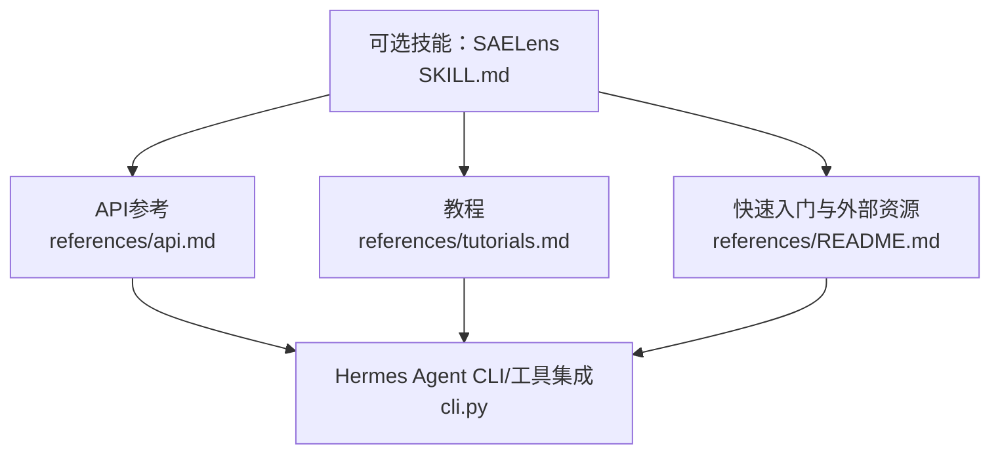
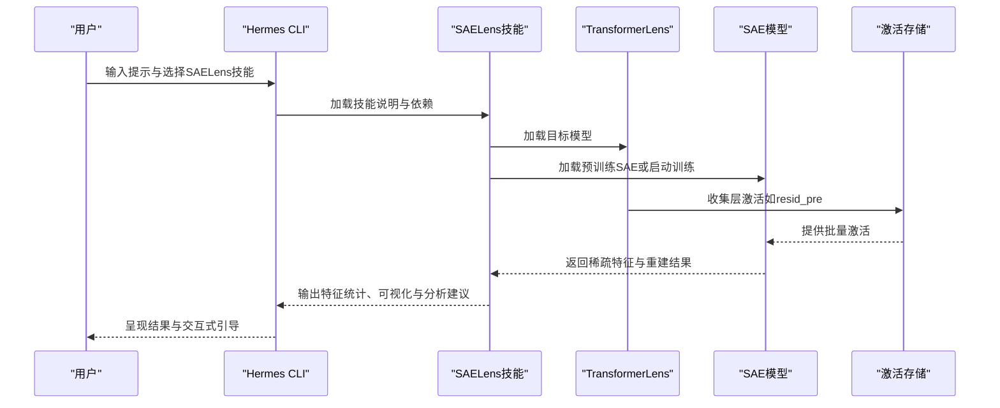
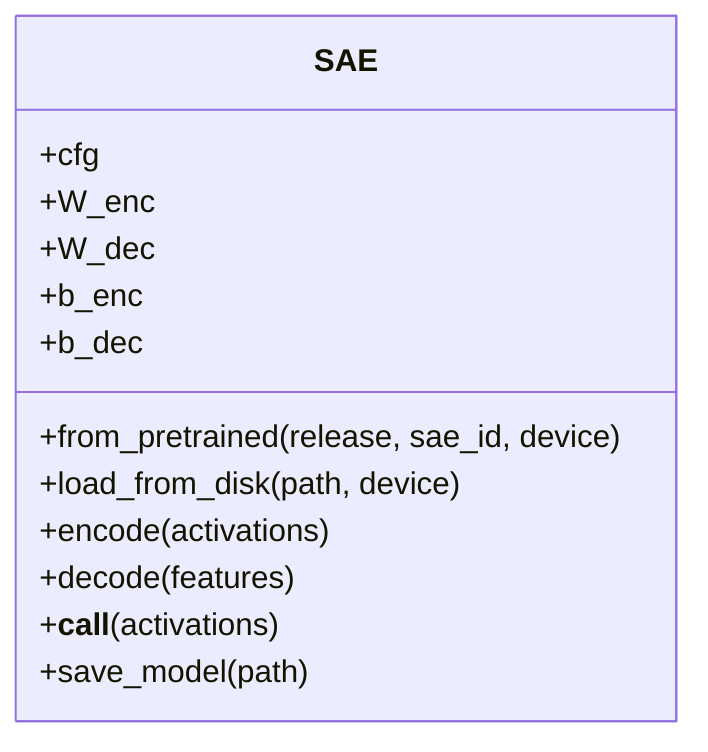
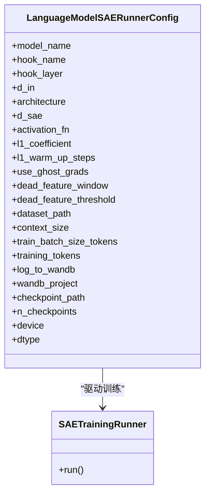
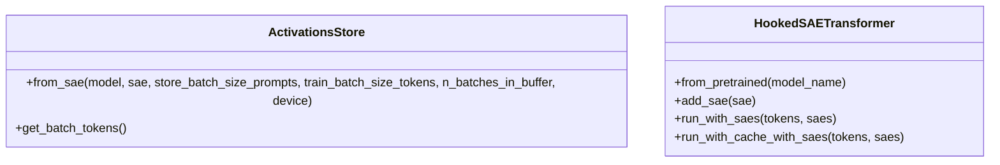
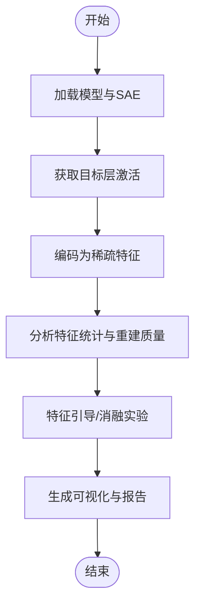
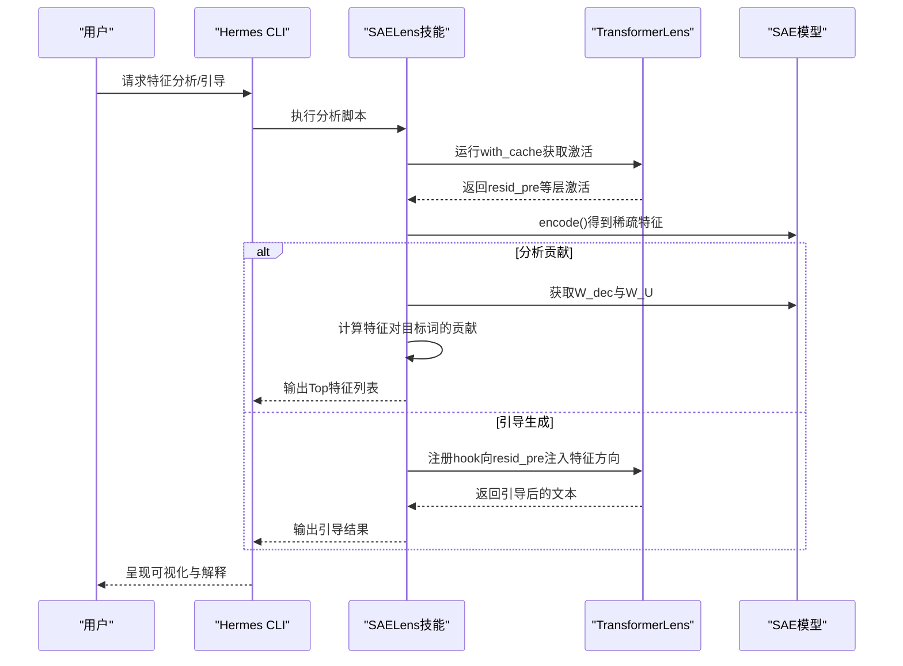
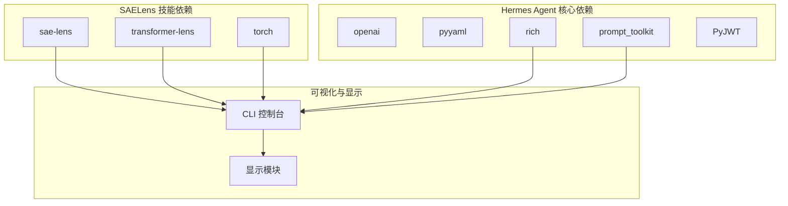

# SAELens可视化分析

<cite>
**本文引用的文件**
- [SKILL.md](file://optional-skills/mlops/saelens/SKILL.md)
- [api.md](file://optional-skills/mlops/saelens/references/api.md)
- [tutorials.md](file://optional-skills/mlops/saelens/references/tutorials.md)
- [README.md](file://optional-skills/mlops/saelens/references/README.md)
- [requirements.txt](file://requirements.txt)
- [cli.py](file://cli.py)
- [display.py](file://agent/display.py)
</cite>

## 目录
1. [简介](#简介)
2. [项目结构](#项目结构)
3. [核心组件](#核心组件)
4. [架构总览](#架构总览)
5. [详细组件分析](#详细组件分析)
6. [依赖分析](#依赖分析)
7. [性能考虑](#性能考虑)
8. [故障排除指南](#故障排除指南)
9. [结论](#结论)
10. [附录](#附录)

## 简介
本文件面向Hermes Agent用户，系统化介绍如何使用SAELens进行神经网络可视化与分析。SAELens是用于训练与分析稀疏自编码器（SAE）的工具库，能够将语言模型的密集激活分解为稀疏、可解释的特征，从而揭示“超表示”现象下的单义性概念，支持特征发现、几何分析、特征引导与消融等任务。在Hermes Agent中，SAELens可作为可选技能被加载与调用，结合TransformerLens与HookedTransformer实现对模型内部状态的深入洞察。

SAELens在以下场景尤为关键：
- 发现可解释特征：识别与特定语义或结构相关的SAE特征
- 理解模型学习内容：通过特征激活模式理解模型学到的概念
- 超表示与特征几何研究：探索特征空间的分布与交互
- 特征引导与消融：基于特征进行可控的推理干预
- 安全相关特征分析：检测并评估欺骗、偏见、有害内容等安全风险

## 项目结构
SAELens相关材料位于可选技能目录下，包含技能说明、API参考与教程三类文档：
- 可选技能说明：概述SAELens用途、安装方式与工作流
- API参考：SAE、配置类、训练器、数据存储与集成类的接口定义
- 教程：从加载预训练SAE到训练自定义SAE、特征分析与引导的完整流程

**图示来源**
- [SKILL.md:1-390](file://optional-skills/mlops/saelens/SKILL.md#L1-L390)
- [api.md:1-334](file://optional-skills/mlops/saelens/references/api.md#L1-L334)
- [tutorials.md:1-319](file://optional-skills/mlops/saelens/references/tutorials.md#L1-L319)
- [README.md:1-57](file://optional-skills/mlops/saelens/references/README.md#L1-L57)
- [cli.py:2860-2922](file://cli.py#L2860-L2922)

**章节来源**
- [SKILL.md:1-390](file://optional-skills/mlops/saelens/SKILL.md#L1-L390)
- [README.md:1-57](file://optional-skills/mlops/saelens/references/README.md#L1-L57)

## 核心组件
- SAE类：稀疏自编码器的核心模型，提供加载、编码、解码与保存能力
- 配置类：SAE架构与训练参数的集中管理
- 训练器：执行训练循环并输出指标
- 激活存储：收集与批处理模型激活
- HookedSAETransformer：与TransformerLens集成，支持带SAE的缓存与运行
- 可选技能：在Hermes Agent中以技能形式提供SAELens的使用指导与最佳实践

这些组件共同构成从“加载/训练SAE”到“特征分析与干预”的完整链路。

**章节来源**
- [api.md:1-334](file://optional-skills/mlops/saelens/references/api.md#L1-L334)
- [SKILL.md:338-390](file://optional-skills/mlops/saelens/SKILL.md#L338-L390)

## 架构总览
SAELens在Hermes Agent中的典型工作流如下：

**图示来源**
- [tutorials.md:10-52](file://optional-skills/mlops/saelens/references/tutorials.md#L10-L52)
- [api.md:227-247](file://optional-skills/mlops/saelens/references/api.md#L227-L247)
- [SKILL.md:70-120](file://optional-skills/mlops/saelens/SKILL.md#L70-L120)

## 详细组件分析

### SAE类与核心方法
SAE类提供以下关键能力：
- 加载预训练SAE（官方发布、HuggingFace、本地磁盘）
- 编码：将模型激活映射到稀疏特征空间
- 解码：从稀疏特征重构原始激活
- 前向：一次性完成编码与解码
- 保存：持久化训练好的SAE

**图示来源**
- [api.md:3-73](file://optional-skills/mlops/saelens/references/api.md#L3-L73)

**章节来源**
- [api.md:3-73](file://optional-skills/mlops/saelens/references/api.md#L3-L73)

### 训练配置与训练器
训练配置类集中管理SAE架构、超参数与数据设置；训练器负责执行训练循环并产出指标（如平均活跃特征数、交叉熵恢复率、重建误差、死亡特征比例等）。

**图示来源**
- [api.md:104-198](file://optional-skills/mlops/saelens/references/api.md#L104-L198)
- [api.md:200-224](file://optional-skills/mlops/saelens/references/api.md#L200-L224)

**章节来源**
- [api.md:104-198](file://optional-skills/mlops/saelens/references/api.md#L104-L198)
- [api.md:200-224](file://optional-skills/mlops/saelens/references/api.md#L200-L224)

### 激活存储与HookedSAETransformer
激活存储负责从模型中收集指定层的激活，并按批次提供给训练或分析流程；HookedSAETransformer将SAE与TransformerLens模型集成，支持在缓存与生成过程中嵌入SAE。

**图示来源**
- [api.md:227-248](file://optional-skills/mlops/saelens/references/api.md#L227-L248)
- [api.md:251-269](file://optional-skills/mlops/saelens/references/api.md#L251-L269)

**章节来源**
- [api.md:227-269](file://optional-skills/mlops/saelens/references/api.md#L227-L269)

### 可视化与分析流程（工作流）
SAELens技能提供了三大工作流，覆盖从加载分析到训练再到特征工程的完整路径。

**图示来源**
- [SKILL.md:70-120](file://optional-skills/mlops/saelens/SKILL.md#L70-L120)
- [tutorials.md:10-52](file://optional-skills/mlops/saelens/references/tutorials.md#L10-L52)

**章节来源**
- [SKILL.md:70-120](file://optional-skills/mlops/saelens/SKILL.md#L70-L120)
- [tutorials.md:10-52](file://optional-skills/mlops/saelens/references/tutorials.md#L10-L52)

### 特征分析与引导（序列图）
特征分析与引导涉及特征贡献计算与残差流注入两种主要操作。

**图示来源**
- [tutorials.md:123-190](file://optional-skills/mlops/saelens/references/tutorials.md#L123-L190)
- [SKILL.md:197-277](file://optional-skills/mlops/saelens/SKILL.md#L197-L277)

**章节来源**
- [tutorials.md:123-190](file://optional-skills/mlops/saelens/references/tutorials.md#L123-L190)
- [SKILL.md:197-277](file://optional-skills/mlops/saelens/SKILL.md#L197-L277)

## 依赖分析
SAELens技能的依赖与Hermes Agent现有依赖的关系如下：
- 技能依赖：sae-lens、transformer-lens、torch
- Agent依赖：openai、pyyaml、rich、prompt_toolkit、PyJWT等
- 可视化与显示：Agent侧通过CLI与显示模块提供终端内可视化与工具状态呈现

**图示来源**
- [requirements.txt:1-37](file://requirements.txt#L1-L37)
- [SKILL.md:40-46](file://optional-skills/mlops/saelens/SKILL.md#L40-L46)

**章节来源**
- [requirements.txt:1-37](file://requirements.txt#L1-L37)
- [SKILL.md:40-46](file://optional-skills/mlops/saelens/SKILL.md#L40-L46)

## 性能考虑
- 训练规模与显存：增大扩展因子与批次大小会显著增加显存占用，需根据GPU能力调整训练配置
- 死亡特征控制：启用幽灵梯度与合适的warm-up步数有助于维持特征活跃度
- 日志与监控：使用W&B记录指标，便于及时发现训练异常
- 推理效率：在分析阶段尽量减少不必要的缓存与重复计算，优先使用top-k等稀疏策略

[本节为通用指导，不直接分析具体文件]

## 故障排除指南
常见问题与解决思路：
- 高死亡特征比例：提高L1系数、增加warm-up步数、启用幽灵梯度
- 重建质量差：降低L1系数、提升扩展因子、检查数据质量
- 特征不可解释：提高L1稀疏度或采用TopK架构
- 训练内存不足：减小批次大小与缓冲区容量

**章节来源**
- [SKILL.md:279-326](file://optional-skills/mlops/saelens/SKILL.md#L279-L326)

## 结论
SAELens为Hermes Agent提供了强大的机制解释与可视化能力。通过加载/训练SAE、分析特征激活与贡献、实施特征引导与消融，用户可以深入理解模型内部工作机制，定位安全相关特征，并在调试与优化代理行为时提供数据支撑。结合Hermes Agent的CLI与显示模块，SAELens分析结果可在终端中直观呈现，形成从“洞察—干预—验证”的闭环。

[本节为总结性内容，不直接分析具体文件]

## 附录

### 最佳实践清单
- 在分析前明确目标层与hook点，确保SAE与模型维度匹配
- 使用TopK或Gated架构以获得更稳定的稀疏性
- 监控L0、CE损失恢复率与死亡特征比例
- 对关键特征进行多提示一致性测试
- 将分析结果与可视化结合，形成可解释的报告

**章节来源**
- [SKILL.md:114-119](file://optional-skills/mlops/saelens/SKILL.md#L114-L119)
- [SKILL.md:188-195](file://optional-skills/mlops/saelens/SKILL.md#L188-L195)

### 与Hermes Agent的集成要点
- 通过可选技能加载SAELens，遵循技能说明中的安装与依赖要求
- 在CLI中使用图像预处理与工具可用性检查，确保分析环境稳定
- 利用显示模块对分析结果进行终端内可视化与状态提示

**章节来源**
- [cli.py:2860-2922](file://cli.py#L2860-L2922)
- [display.py:140-238](file://agent/display.py#L140-L238)