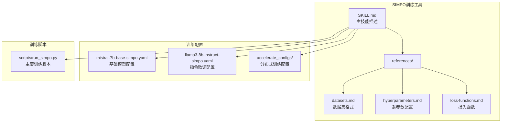
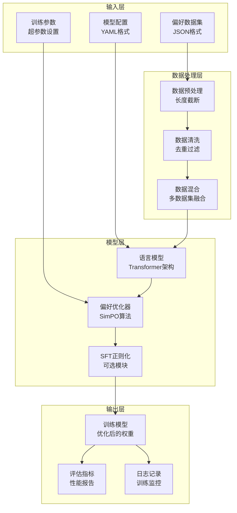
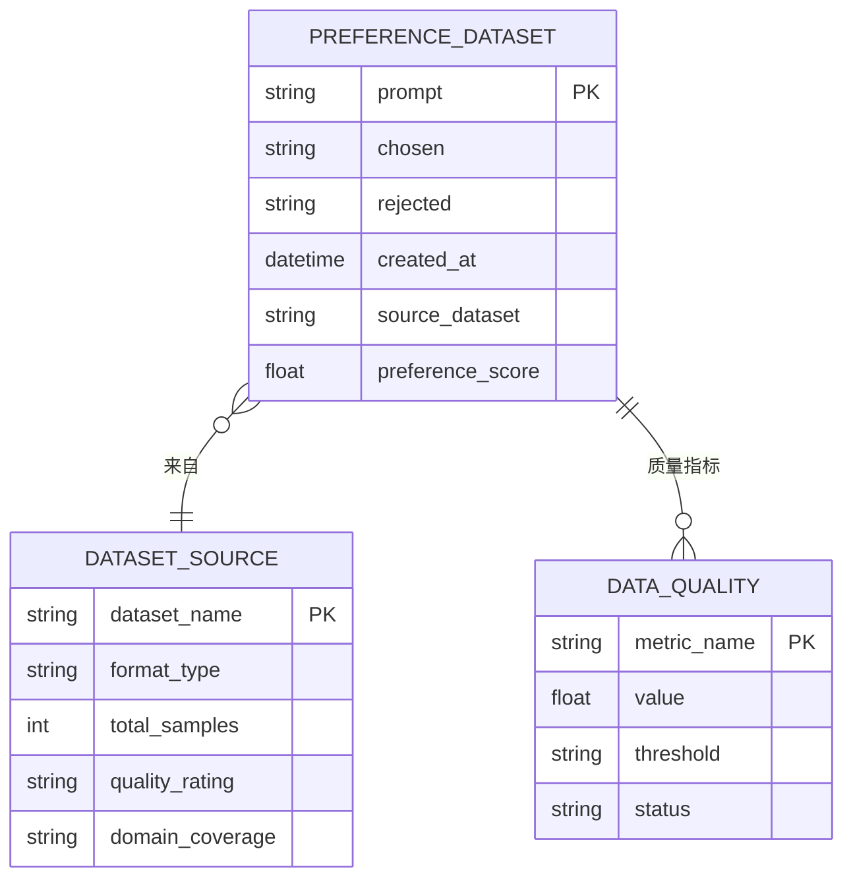
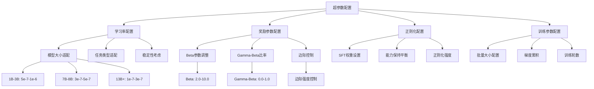
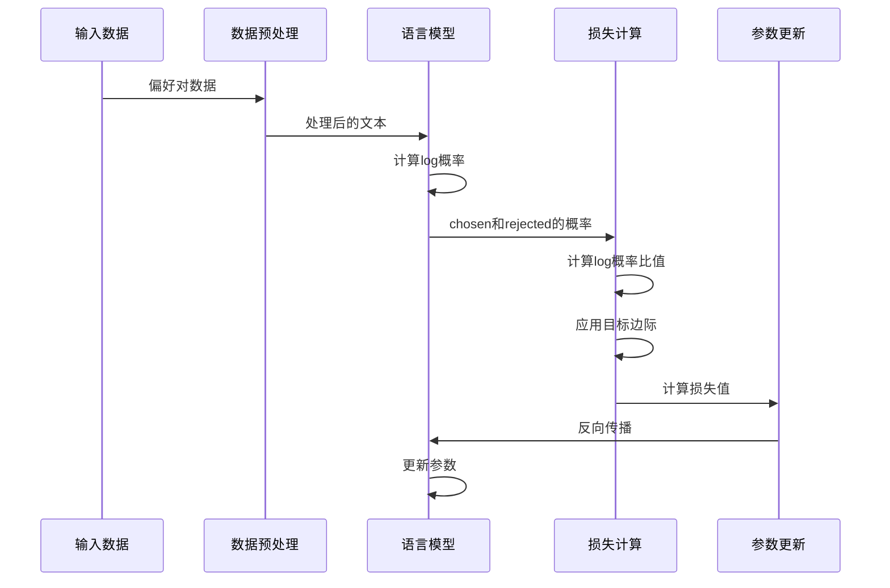
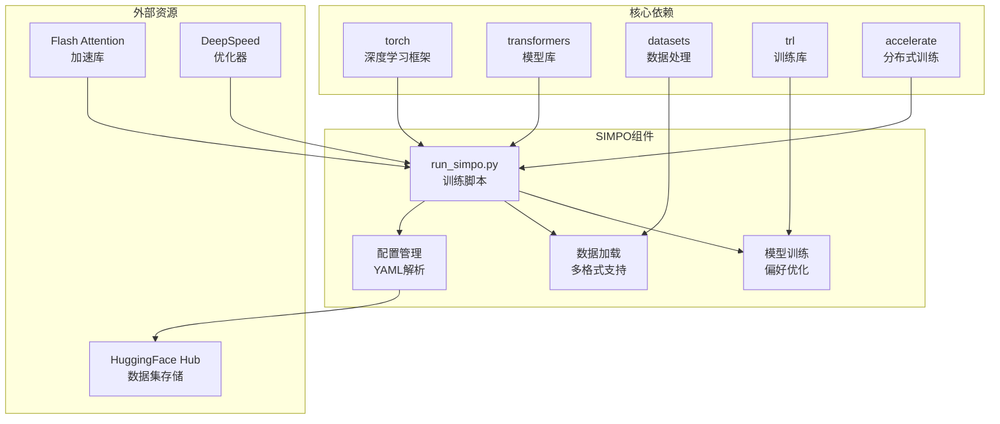

# SIMPO强化学习训练

<cite>
**本文档引用的文件**
- [SKILL.md](file://optional-skills/mlops/simpo/SKILL.md)
- [datasets.md](file://optional-skills/mlops/simpo/references/datasets.md)
- [hyperparameters.md](file://optional-skills/mlops/simpo/references/hyperparameters.md)
- [loss-functions.md](file://optional-skills/mlops/simpo/references/loss-functions.md)
</cite>

## 目录
1. [简介](#简介)
2. [项目结构](#项目结构)
3. [核心组件](#核心组件)
4. [架构概览](#架构概览)
5. [详细组件分析](#详细组件分析)
6. [依赖关系分析](#依赖关系分析)
7. [性能考虑](#性能考虑)
8. [故障排除指南](#故障排除指南)
9. [结论](#结论)

## 简介

SIMPO（Simple Preference Optimization）是Hermes Agent中实现的一种参考免费偏好优化方法。该方法在不需要参考模型的情况下，提供了比DPO更好的性能表现，并且具有更简单的训练流程。

SIMPO的核心优势包括：
- 参考免费：无需参考模型，简化了训练流程
- 性能优越：在AlpacaEval 2.0基准测试中比DPO高出6.4分
- 计算效率：相比DPO更加高效，适合资源有限的场景
- 易于部署：支持单节点训练，硬件要求相对较低

## 项目结构

SIMPO训练工具在Hermes Agent中的组织结构如下：



**图表来源**
- [SKILL.md:1-223](file://optional-skills/mlops/simpo/SKILL.md#L1-L223)

**章节来源**
- [SKILL.md:1-223](file://optional-skills/mlops/simpo/SKILL.md#L1-L223)

## 核心组件

### 数据集管理组件

SIMPO训练的数据集管理系统支持多种格式和来源：

| 组件类型 | 功能描述 | 支持格式 |
|---------|----------|----------|
| 基础数据集 | 预定义的高质量偏好数据集 | UltraFeedback, HH-RLHF, HelpSteer |
| 自定义数据集 | 用户自定义的偏好数据 | JSONL, HuggingFace Dataset, ChatML |
| 合成数据生成 | 使用大模型生成偏好对 | GPT-4, 本地模型vLLM |

### 超参数管理组件

超参数管理系统提供完整的配置选项：

| 参数类别 | 关键参数 | 默认值 | 调整范围 |
|---------|----------|--------|----------|
| 学习率 | learning_rate | 5e-7 | 1e-8 到 1e-6 |
| 奖励缩放 | beta | 2.0 | 1.0 到 10.0 |
| 目标边界 | gamma_beta_ratio | 0.5 | 0.0 到 1.0 |
| 正则化权重 | sft_weight | 0.0 | 0.0 到 1.0 |

### 损失函数组件

SIMPO支持两种损失函数类型：

| 损失类型 | 数学公式 | 特点 | 适用场景 |
|---------|----------|------|----------|
| Sigmoid损失 | L = -log σ(β * logits) | 平滑连续梯度 | 标准任务，推荐使用 |
| Hinge损失 | L = max(0, 1 - β * logits) | 边缘基于，稀疏解 | 实验性用途 |

**章节来源**
- [datasets.md:1-479](file://optional-skills/mlops/simpo/references/datasets.md#L1-L479)
- [hyperparameters.md:1-453](file://optional-skills/mlops/simpo/references/hyperparameters.md#L1-L453)
- [loss-functions.md:1-336](file://optional-skills/mlops/simpo/references/loss-functions.md#L1-L336)

## 架构概览

SIMPO训练系统的整体架构设计如下：



**图表来源**
- [SKILL.md:37-108](file://optional-skills/mlops/simpo/SKILL.md#L37-L108)
- [datasets.md:109-134](file://optional-skills/mlops/simpo/references/datasets.md#L109-L134)

## 详细组件分析

### 数据集格式规范

SIMPO要求的数据集必须包含以下必需字段：



**图表来源**
- [datasets.md:5-32](file://optional-skills/mlops/simpo/references/datasets.md#L5-L32)

#### 数据集字段说明

| 字段名称 | 类型 | 必需性 | 描述 |
|---------|------|--------|------|
| prompt | string | 必需 | 用户问题或指令 |
| chosen | string | 必需 | 更好/首选响应 |
| rejected | string | 必需 | 更差/拒绝响应 |
| source_dataset | string | 可选 | 数据来源标识 |
| preference_score | float | 可选 | 偏好强度评分 |

#### 支持的数据集格式

1. **JSON格式**：标准JSON对象，支持自动字段名检测
2. **JSONL格式**：每行一个JSON对象的流式格式
3. **HuggingFace Dataset**：直接加载HuggingFace数据集
4. **ChatML格式**：对话格式，支持角色标记

**章节来源**
- [datasets.md:3-31](file://optional-skills/mlops/simpo/references/datasets.md#L3-L31)
- [datasets.md:180-232](file://optional-skills/mlops/simpo/references/datasets.md#L180-L232)

### 超参数配置系统

超参数管理系统采用分层配置策略：



**图表来源**
- [hyperparameters.md:13-49](file://optional-skills/mlops/simpo/references/hyperparameters.md#L13-L49)

#### 学习率配置策略

| 模型规模 | 推荐范围 | 最佳实践 |
|---------|----------|----------|
| 1B-3B | 5e-7 到 1e-6 | 高端更安全 |
| 7B-8B | 3e-7 到 5e-7 | 标准配置 |
| 13B-30B | 1e-7 到 3e-7 | 稳定优先 |
| 70B+ | 5e-8 到 1e-7 | 极其保守 |

#### Beta参数调优指南

| Beta范围 | 偏好强度 | 使用场景 |
|---------|----------|----------|
| 1.0-2.0 | 弱 | 微妙偏好 |
| 2.0-5.0 | 标准 | 一般对齐 |
| 5.0-10.0 | 强 | 清晰偏好 |

**章节来源**
- [hyperparameters.md:17-23](file://optional-skills/mlops/simpo/references/hyperparameters.md#L17-L23)
- [hyperparameters.md:76-107](file://optional-skills/mlops/simpo/references/hyperparameters.md#L76-L107)

### 损失函数实现

SIMPO的损失函数设计基于偏好优化理论：



**图表来源**
- [loss-functions.md:13-29](file://optional-skills/mlops/simpo/references/loss-functions.md#L13-L29)

#### Sigmoid损失函数

Sigmoid损失函数具有以下数学特性：

**公式**：L = -log σ(β * logits) * (1 - ε) - log σ(-β * logits) * ε

其中：
- β = 奖励缩放参数
- ε = 标签平滑参数
- logits = log概率比值 - γ/β

**特性**：
- 平滑连续梯度
- 概率解释性强
- 对大多数任务的标准选择
- 与较高beta值配合良好

#### Hinge损失函数

Hinge损失函数适用于边缘优化场景：

**公式**：L = max(0, 1 - β * logits)

**特性**：
- 非光滑（在logits = 1/β处有尖点）
- 基于边缘（类SVM风格）
- 可能导致稀疏解
- 不常用

**章节来源**
- [loss-functions.md:31-74](file://optional-skills/mlops/simpo/references/loss-functions.md#L31-L74)

## 依赖关系分析

SIMPO训练工具的依赖关系图：



**图表来源**
- [SKILL.md:7](file://optional-skills/mlops/simpo/SKILL.md#L7)

### 主要依赖项

| 依赖项 | 版本要求 | 用途 |
|-------|----------|------|
| torch | ≥ 2.0 | 深度学习计算框架 |
| transformers | latest | 模型加载和推理 |
| datasets | latest | 数据集处理 |
| trl | latest | 训练库 |
| accelerate | latest | 分布式训练支持 |

**章节来源**
- [SKILL.md:7](file://optional-skills/mlops/simpo/SKILL.md#L7)

## 性能考虑

### 硬件资源配置

SIMPO训练的硬件要求根据模型规模而变化：

| 模型规模 | GPU需求 | VRAM要求 | 推荐配置 |
|---------|---------|----------|----------|
| 7B模型 | 1× A100 40GB | 40GB | DeepSpeed ZeRO-3 |
| 8B模型 | 2× A100 40GB | 80GB | 单节点训练 |
| 70B模型 | 8× A100 80GB | 640GB | 多节点分布式 |

### 内存优化策略

1. **DeepSpeed ZeRO-3**：自动梯度分区
2. **梯度检查点**：减少内存占用
3. **Flash Attention 2**：提高注意力计算效率
4. **混合精度训练**：BF16优化

### 训练效率优化

| 优化技术 | 实现方式 | 效果 |
|---------|----------|------|
| 批量大小调整 | per_device_train_batch_size | 提高吞吐量 |
| 梯度累积 | gradient_accumulation_steps | 维持有效批量 |
| 学习率调度 | cosine/linear | 稳定收敛 |
| 早停机制 | patience参数 | 防止过拟合 |

## 故障排除指南

### 常见问题及解决方案

#### 训练不稳定

**症状**：损失曲线震荡或发散

**诊断步骤**：
1. 检查学习率是否过高
2. 验证beta参数设置
3. 确认数据质量

**解决方案**：
```yaml
# 降低学习率
learning_rate: 3e-7

# 减少beta参数
beta: 1.0

# 增加标签平滑
label_smoothing: 0.1
```

#### 模型遗忘能力

**症状**：模型失去原有能力

**诊断**：检查SFT权重设置

**解决方案**：
```yaml
# 增加SFT权重
sft_weight: 0.1

# 保存基线模型
save_strategy: steps
save_steps: 1000
```

#### 偏好分离不足

**症状**：chosen和rejected响应混淆

**诊断**：检查偏好数据质量

**解决方案**：
```yaml
# 增强偏好信号
beta: 5.0
gamma_beta_ratio: 0.8

# 使用更强的学习率
learning_rate: 1e-6
```

#### 内存不足

**症状**：训练过程中OOM错误

**诊断**：检查当前内存使用

**解决方案**：
```yaml
# 减少批量大小
per_device_train_batch_size: 1

# 增加梯度累积
gradient_accumulation_steps: 16

# 启用梯度检查点
gradient_checkpointing: true
```

**章节来源**
- [SKILL.md:149-190](file://optional-skills/mlops/simpo/SKILL.md#L149-L190)

## 结论

SIMPO强化学习训练工具为Hermes Agent提供了高效、灵活的偏好优化解决方案。通过参考免费的设计理念和先进的算法实现，SIMPO在保持训练简单性的同时实现了卓越的性能表现。

### 主要优势

1. **简化训练流程**：无需参考模型，降低了训练复杂度
2. **优异性能表现**：相比DPO提升6.4分的基准测试成绩
3. **资源友好**：适合单节点训练，硬件要求相对较低
4. **配置灵活**：支持多种数据格式和超参数组合

### 应用建议

- **初学者友好**：推荐从标准配置开始，逐步调整超参数
- **性能优先**：对于追求最佳效果的任务，可以适当增加beta和gamma参数
- **资源受限**：优先考虑7B模型配置，充分利用SIMPO的效率优势
- **数据质量**：重视数据清洗和质量控制，这是获得良好结果的关键

通过合理配置和持续优化，SIMPO训练工具能够帮助用户在各种应用场景中实现高效的偏好优化，为代理决策制定和序列优化提供强大的技术支持。