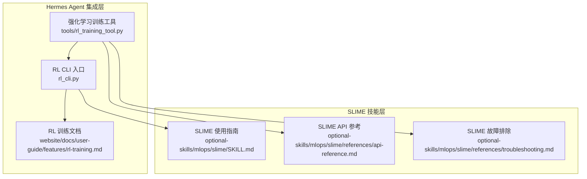
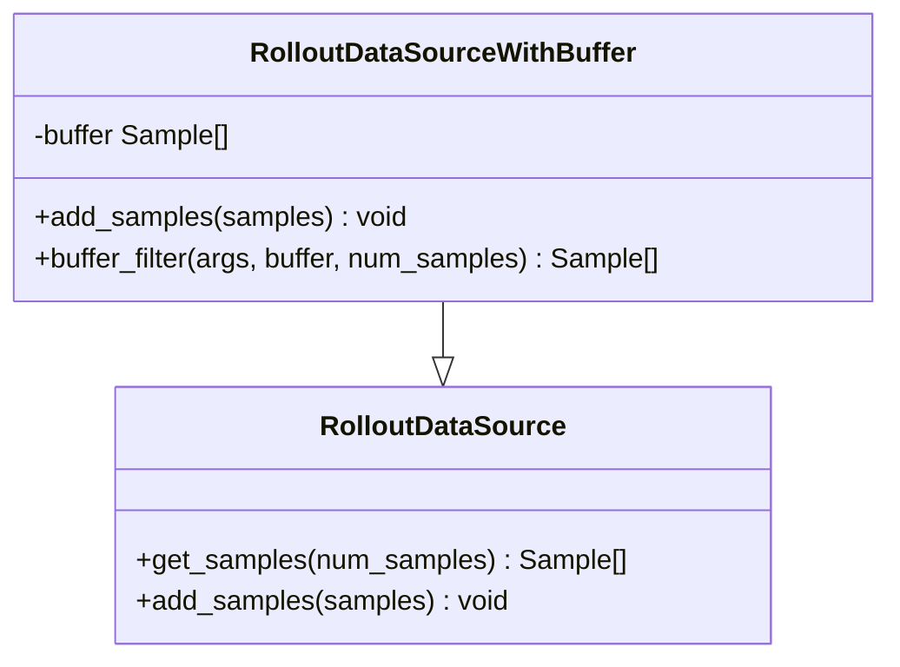
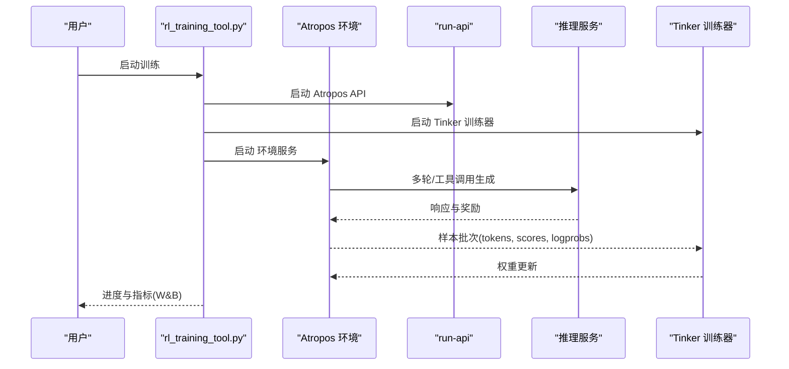
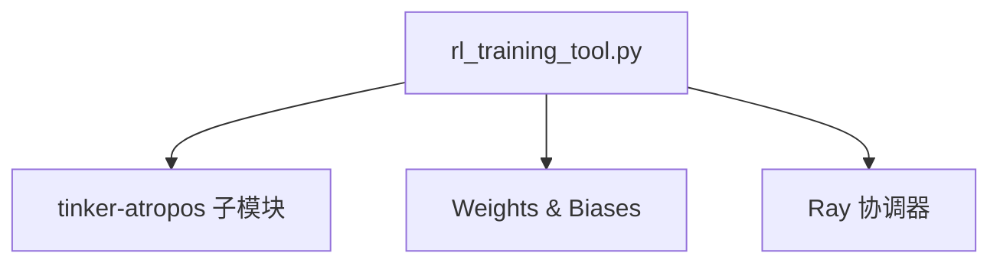

# SLIME强化学习训练

<cite>
**本文档引用的文件**
- [SKILL.md](file://optional-skills/mlops/slime/SKILL.md)
- [api-reference.md](file://optional-skills/mlops/slime/references/api-reference.md)
- [troubleshooting.md](file://optional-skills/mlops/slime/references/troubleshooting.md)
- [rl_training_tool.py](file://tools/rl_training_tool.py)
- [rl_cli.py](file://rl_cli.py)
- [rl-training.md](file://website/docs/user-guide/features/rl-training.md)
</cite>

## 目录
1. [简介](#简介)
2. [项目结构](#项目结构)
3. [核心组件](#核心组件)
4. [架构总览](#架构总览)
5. [详细组件分析](#详细组件分析)
6. [依赖关系分析](#依赖关系分析)
7. [性能考虑](#性能考虑)
8. [故障排除指南](#故障排除指南)
9. [结论](#结论)
10. [附录](#附录)

## 简介
本文件面向Hermes Agent用户，系统化介绍SLIME在无模型强化学习（Model-Free Reinforcement Learning）中的核心思想、训练配置、探索策略与价值函数估计方法，并结合Hermes Agent的强化学习训练工具链，提供可操作的API参考、故障排除与性能优化建议。SLIME通过“训练（Megatron-LM）+回滚（SGLang + Router）”的双引擎架构，支持大规模语言模型的高效强化学习后训练，尤其适用于推理类任务与多步交互场景。

## 项目结构
Hermes Agent将SLIME能力以可选技能形式集成，核心位置如下：
- 可选技能：`optional-skills/mlops/slime/` 提供SLIME框架的使用指南、API参考与故障排除
- 强化学习训练工具：`tools/rl_training_tool.py` 提供与Tinker-Atropos的集成，管理训练生命周期与监控
- CLI入口：`rl_cli.py` 提供命令行交互式训练流程
- 文档补充：`website/docs/user-guide/features/rl-training.md` 提供训练架构图与自定义环境指南



**图表来源**
- [rl_training_tool.py:1-120](file://tools/rl_training_tool.py#L1-L120)
- [rl_cli.py:200-220](file://rl_cli.py#L200-L220)
- [rl-training.md:175-189](file://website/docs/user-guide/features/rl-training.md#L175-L189)
- [SKILL.md:38-54](file://optional-skills/mlops/slime/SKILL.md#L38-L54)
- [api-reference.md:3-21](file://optional-skills/mlops/slime/references/api-reference.md#L3-L21)

**章节来源**
- [rl_training_tool.py:1-120](file://tools/rl_training_tool.py#L1-L120)
- [rl_cli.py:200-220](file://rl_cli.py#L200-L220)
- [rl-training.md:175-189](file://website/docs/user-guide/features/rl-training.md#L175-L189)
- [SKILL.md:38-54](file://optional-skills/mlops/slime/SKILL.md#L38-L54)
- [api-reference.md:3-21](file://optional-skills/mlops/slime/references/api-reference.md#L3-L21)

## 核心组件
- SLIME框架（可选技能）
  - 提供GRPO等优势估计器、KL损失、重要性采样（TIS）、聊天模板应用等训练参数
  - 支持数据缓冲区（离策略重用）与异步训练模式
  - 提供自定义生成函数与奖励函数扩展点
- Hermes RL训练工具
  - 自动发现并加载Atropos环境（BaseEnv子类），动态解析配置字段
  - 以子进程方式启动Atropos API、Tinker训练器与环境服务，统一监控与日志
  - 集成W&B指标采集与可视化
- CLI与文档
  - 提供交互式训练流程与环境列表、状态查询、结果获取等命令
  - 官方文档补充训练架构图与自定义环境开发指南

**章节来源**
- [SKILL.md:100-168](file://optional-skills/mlops/slime/SKILL.md#L100-L168)
- [api-reference.md:113-148](file://optional-skills/mlops/slime/references/api-reference.md#L113-L148)
- [rl_training_tool.py:509-607](file://tools/rl_training_tool.py#L509-L607)
- [rl-training.md:167-189](file://website/docs/user-guide/features/rl-training.md#L167-L189)

## 架构总览
SLIME采用“数据缓冲区 + 训练（Megatron-LM）+ 回滚（SGLang + Router）”的三模块架构，由Ray协调。Hermes Agent在此基础上，通过rl_training_tool.py进一步封装Atropos的API、训练器与环境服务的生命周期管理。

```mermaid
graph TB
subgraph "SLIME 架构"
Buffer["数据缓冲区<br/>Prompt 初始化/管理<br/>样本存储"]
Train["训练引擎<br/>Megatron-LM<br/>Actor 模型训练"]
Rollout["回滚引擎<br/>SGLang + Router<br/>响应生成/奖励输出"]
end
subgraph "Hermes 集成"
API["Atropos API<br/>run-api<br/>端口 8000"]
Infer["推理服务<br/>OpenAI/sglang<br/>端口 8001"]
Trainer["Tinker 训练器<br/>LoRA 训练 + FastAPI"]
Env["环境服务<br/>BaseEnv 实现"]
end
Buffer < --> Train
Train <-- 权重同步 --> Rollout
Rollout --> Infer
Env < --> API
API < --> |"批次: tokens, scores, logprobs"| Trainer
Trainer --> |"提供推理"| Infer
```

**图表来源**
- [api-reference.md:3-21](file://optional-skills/mlops/slime/references/api-reference.md#L3-L21)
- [rl-training.md:175-189](file://website/docs/user-guide/features/rl-training.md#L175-L189)

## 详细组件分析

### SLIME训练配置与参数体系
- 资源分配
  - 训练节点数、每节点GPU数、回滚GPU总数与每引擎GPU数、是否共置（共享GPU）
- 数据配置
  - 训练数据路径、输入键名、标签键名、是否应用聊天模板
- 训练循环
  - 回滚迭代次数、每次回滚提示数量、每提示样本数、全局批大小、每回滚训练步数
- RL算法
  - 优势估计器（grpo/gspo/ppo/reinforce_plus_plus）、是否启用KL损失、KL系数、是否按token计算损失
- 离策略选项
  - 是否启用截断重要性采样（TIS）、阈值、是否强制on-policy训练

关键约束：`rollout_batch_size × n_samples_per_prompt = global_batch_size × num_steps_per_rollout`

**章节来源**
- [api-reference.md:113-148](file://optional-skills/mlops/slime/references/api-reference.md#L113-L148)
- [SKILL.md:298-305](file://optional-skills/mlops/slime/SKILL.md#L298-L305)

### 数据缓冲区系统（离策略重用）
- 基础数据源：从数据集中采样提示，生成样本对象
- 缓冲数据源（离策略）：将生成样本存入缓冲池，支持自定义筛选逻辑（如基于奖励的优先采样）



**图表来源**
- [api-reference.md:150-191](file://optional-skills/mlops/slime/references/api-reference.md#L150-L191)

**章节来源**
- [api-reference.md:150-191](file://optional-skills/mlops/slime/references/api-reference.md#L150-L191)
- [SKILL.md:308-341](file://optional-skills/mlops/slime/SKILL.md#L308-L341)

### 自定义生成与奖励函数
- 自定义生成函数：支持多轮对话、工具调用与奖励计算，返回带响应与奖励的样本列表
- 自定义奖励函数：支持单样本与批量奖励计算，便于离线预处理与加速



**图表来源**
- [rl_training_tool.py:314-424](file://tools/rl_training_tool.py#L314-L424)
- [rl-training.md:167-189](file://website/docs/user-guide/features/rl-training.md#L167-L189)

**章节来源**
- [api-reference.md:194-291](file://optional-skills/mlops/slime/references/api-reference.md#L194-L291)
- [SKILL.md:202-248](file://optional-skills/mlops/slime/SKILL.md#L202-L248)

### 异步训练与权重同步
- 异步缓冲大小：控制回滚缓冲队列长度
- 权重同步间隔：控制多久同步一次权重，避免网络瓶颈
- 注意：共置模式不支持异步训练

**章节来源**
- [SKILL.md:171-199](file://optional-skills/mlops/slime/SKILL.md#L171-L199)
- [troubleshooting.md:245-273](file://optional-skills/mlops/slime/references/troubleshooting.md#L245-L273)

### 多模态与专家路由信息
- 样本对象支持多模态输入与训练输入、推测解码信息（如接受/草稿token数、校验次数等）
- MoE专家路由信息用于记录专家选择情况

**章节来源**
- [api-reference.md:25-70](file://optional-skills/mlops/slime/references/api-reference.md#L25-L70)

## 依赖关系分析
- 组件耦合
  - rl_training_tool.py对Atropos环境进行AST扫描与动态导入，确保与基础设施锁定字段隔离
  - 通过子进程管理API、训练器与环境，降低直接耦合
- 外部依赖
  - Tinker-Atropos（Python>=3.11）、W&B、Ray（协调）
  - SGLang推理后端、OpenAI兼容接口（OpenRouter用于测试）



**图表来源**
- [rl_training_tool.py:1319-1356](file://tools/rl_training_tool.py#L1319-L1356)

**章节来源**
- [rl_training_tool.py:1319-1356](file://tools/rl_training_tool.py#L1319-L1356)

## 性能考虑
- 批量与步数平衡：严格满足约束以保证吞吐一致
- 内存与显存
  - 共置模式下需降低SGLang内存占比或启用卸载
  - 开启梯度检查点、序列并行与梯度裁剪
- 推理效率
  - 合理设置回滚批大小与每提示样本数
  - 使用BF16提升数值稳定性
- 并行与网络
  - 多机训练时检查NCCL配置与带宽
  - 异步模式下适当减少缓冲大小并提高权重同步频率

**章节来源**
- [SKILL.md:298-305](file://optional-skills/mlops/slime/SKILL.md#L298-L305)
- [troubleshooting.md:91-139](file://optional-skills/mlops/slime/references/troubleshooting.md#L91-L139)
- [troubleshooting.md:243-273](file://optional-skills/mlops/slime/references/troubleshooting.md#L243-L273)

## 故障排除指南
- SGLang引擎崩溃
  - 启用容错、增加静态KV缓存比例、降低回滚批大小、禁用CUDA图
- 权重同步超时/失败
  - 增加同步间隔、使用共置模式、检查网络与NCCL配置
- 训练OOM
  - 启用梯度检查点、减小微批大小、开启序列并行、降低全局批大小
- 数据加载慢
  - 增加数据工作进程、使用流式数据集、离线预分词
- 损失爆炸/NaN
  - 降低学习率、启用梯度裁剪、检查数据质量、使用BF16
- 奖励坍缩
  - 提高KL惩罚、减少样本数、验证奖励函数
- 多轮上下文过长
  - 限制历史轮次、增大上下文长度
- 检查点加载失败
  - 确认路径存在、并行度匹配、必要时转换HF到Megatron格式

**章节来源**
- [troubleshooting.md:5-48](file://optional-skills/mlops/slime/references/troubleshooting.md#L5-L48)
- [troubleshooting.md:49-90](file://optional-skills/mlops/slime/references/troubleshooting.md#L49-L90)
- [troubleshooting.md:91-139](file://optional-skills/mlops/slime/references/troubleshooting.md#L91-L139)
- [troubleshooting.md:140-187](file://optional-skills/mlops/slime/references/troubleshooting.md#L140-L187)
- [troubleshooting.md:188-242](file://optional-skills/mlops/slime/references/troubleshooting.md#L188-L242)
- [troubleshooting.md:243-310](file://optional-skills/mlops/slime/references/troubleshooting.md#L243-L310)
- [troubleshooting.md:310-387](file://optional-skills/mlops/slime/references/troubleshooting.md#L310-L387)

## 结论
SLIME为大规模语言模型提供了高效的无模型强化学习后训练框架，Hermes Agent通过rl_training_tool.py与CLI工具将其无缝集成至代理的训练流水线。借助灵活的数据缓冲、离策略重用与异步训练机制，配合完善的参数体系与故障排除方案，用户可在推理、多轮交互与工具调用等复杂场景中实现稳定、可控的策略优化。

## 附录

### API参考要点
- 样本对象字段：提示、响应、标签、奖励、损失掩码、状态、元数据、推测解码信息等
- 状态枚举：PENDING/COMPLETED/TRUNCATED/ABORTED/FAILED
- 关键参数：资源分配、数据配置、训练循环、RL算法、离策略选项
- 约束：回滚批大小×每提示样本数=全局批大小×每回滚训练步数

**章节来源**
- [api-reference.md:25-81](file://optional-skills/mlops/slime/references/api-reference.md#L25-L81)
- [api-reference.md:113-148](file://optional-skills/mlops/slime/references/api-reference.md#L113-L148)
- [api-reference.md:372-381](file://optional-skills/mlops/slime/references/api-reference.md#L372-L381)

### 实际应用案例
- 推理任务（GSM8K/AIME）：通过自定义评分器与奖励函数，结合GRPO优势估计器，实现稳定收敛
- 多轮搜索Agent：自定义生成函数支持工具调用与上下文截断，提升长程推理能力
- 评估多任务：通过多数据集评估配置，监控不同任务上的准确率变化

**章节来源**
- [SKILL.md:100-168](file://optional-skills/mlops/slime/SKILL.md#L100-L168)
- [SKILL.md:202-248](file://optional-skills/mlops/slime/SKILL.md#L202-L248)
- [api-reference.md:358-376](file://optional-skills/mlops/slime/references/api-reference.md#L358-L376)