# TensorRT LLM推理优化

<cite>
**本文档引用的文件**
- [SKILL.md](file://optional-skills/mlops/tensorrt-llm/SKILL.md)
- [optimization.md](file://optional-skills/mlops/tensorrt-llm/references/optimization.md)
- [multi-gpu.md](file://optional-skills/mlops/tensorrt-llm/references/multi-gpu.md)
- [serving.md](file://optional-skills/mlops/tensorrt-llm/references/serving.md)
- [benchmarks.md](file://optional-skills/mlops/flash-attention/references/benchmarks.md)
- [default.yaml](file://environments/benchmarks/tblite/default.yaml)
- [default.yaml](file://environments/benchmarks/terminalbench_2/default.yaml)
- [smart_model_routing.py](file://agent/smart_model_routing.py)
- [cli.py](file://cli.py)
- [_run_codex_stream](file://.plans/streaming-support.md)
</cite>

## 目录
1. [简介](#简介)
2. [项目结构](#项目结构)
3. [核心组件](#核心组件)
4. [架构概览](#架构概览)
5. [详细组件分析](#详细组件分析)
6. [依赖关系分析](#依赖关系分析)
7. [性能考虑](#性能考虑)
8. [故障排除指南](#故障排除指南)
9. [结论](#结论)
10. [附录](#附录)

## 简介

Hermes Agent的TensorRT LLM推理优化工具是一个专为大规模语言模型推理加速而设计的高性能解决方案。该工具基于NVIDIA的TensorRT-LLM框架，提供了从单GPU到多节点集群的完整推理优化方案。

TensorRT在大语言模型推理中发挥着关键作用，通过以下核心技术实现显著的性能提升：

- **量化压缩**：支持FP8和INT4量化，实现2-4倍的推理速度提升
- **动态批处理**：在生成过程中动态批处理请求，提高GPU利用率
- **分页KV缓存**：高效的内存管理机制，支持长序列推理
- **推测解码**：使用小模型预测多个token，验证后并行处理
- **CUDA图优化**：减少内核启动开销，降低延迟

该工具特别适用于需要实时推理的应用场景，如聊天机器人、内容生成和智能助手等。

## 项目结构

TensorRT LLM优化工具位于项目的`optional-skills/mlops/tensorrt-llm`目录下，采用模块化设计：

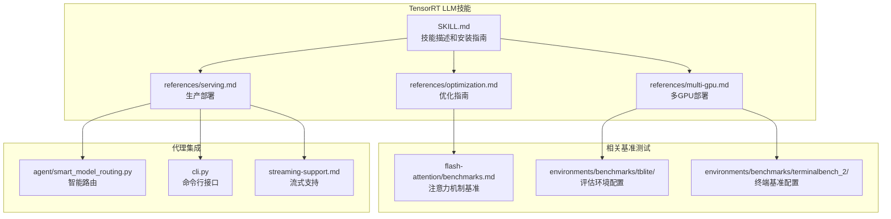
```mermaid
graph TB
subgraph "TensorRT LLM技能"
A[SKILL.md<br/>技能描述和安装指南]
B[references/optimization.md<br/>优化指南]
C[references/multi-gpu.md<br/>多GPU部署]
D[references/serving.md<br/>生产部署]
end
subgraph "相关基准测试"
E[flash-attention/benchmarks.md<br/>注意力机制基准]
F[environments/benchmarks/tblite/<br/>评估环境配置]
G[environments/benchmarks/terminalbench_2/<br/>终端基准配置]
end
subgraph "代理集成"
H[agent/smart_model_routing.py<br/>智能路由]
I[cli.py<br/>命令行接口]
J[streaming-support.md<br/>流式支持]
end
A --> B
A --> C
A --> D
B --> E
C --> F
C --> G
D --> H
D --> I
D --> J
```

**图表来源**
- [SKILL.md:1-191](file://optional-skills/mlops/tensorrt-llm/SKILL.md#L1-L191)
- [optimization.md:1-243](file://optional-skills/mlops/tensorrt-llm/references/optimization.md#L1-L243)
- [multi-gpu.md:1-299](file://optional-skills/mlops/tensorrt-llm/references/multi-gpu.md#L1-L299)

**章节来源**
- [SKILL.md:1-191](file://optional-skills/mlops/tensorrt-llm/SKILL.md#L1-L191)
- [optimization.md:1-243](file://optional-skills/mlops/tensorrt-llm/references/optimization.md#L1-L243)
- [multi-gpu.md:1-299](file://optional-skills/mlops/tensorrt-llm/references/multi-gpu.md#L1-L299)

## 核心组件

### 量化策略组件

TensorRT LLM提供了多种量化策略以平衡性能和精度：

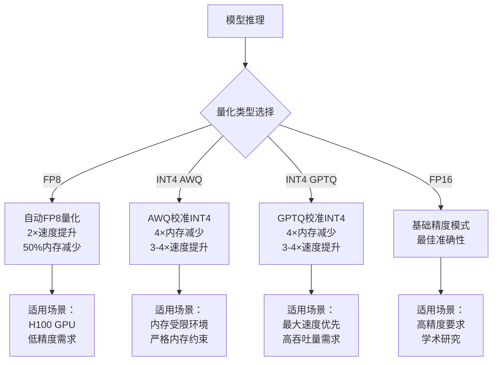
```mermaid
flowchart TD
A[模型推理] --> B{量化类型选择}
B --> |FP8| C[自动FP8量化<br/>2×速度提升<br/>50%内存减少]
B --> |INT4 AWQ| D[AWQ校准INT4<br/>4×内存减少<br/>3-4×速度提升]
B --> |INT4 GPTQ| E[GPTQ校准INT4<br/>4×内存减少<br/>3-4×速度提升]
B --> |FP16| F[基础精度模式<br/>最佳准确性]
C --> G[适用场景：<br/>H100 GPU<br/>低精度需求]
D --> H[适用场景：<br/>内存受限环境<br/>严格内存约束]
E --> I[适用场景：<br/>最大速度优先<br/>高吞吐量需求]
F --> J[适用场景：<br/>高精度要求<br/>学术研究]
```

**图表来源**
- [optimization.md:7-59](file://optional-skills/mlops/tensorrt-llm/references/optimization.md#L7-L59)

### 多GPU配置组件

支持多种并行策略以适应不同规模的部署需求：

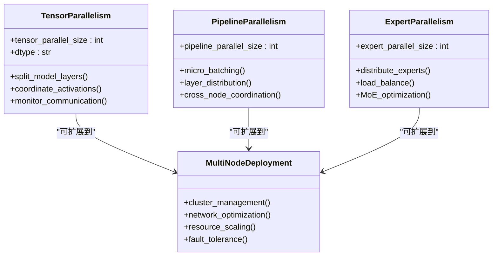
```mermaid
classDiagram
class TensorParallelism {
+tensor_parallel_size : int
+dtype : str
+split_model_layers()
+coordinate_activations()
+monitor_communication()
}
class PipelineParallelism {
+pipeline_parallel_size : int
+micro_batching()
+layer_distribution()
+cross_node_coordination()
}
class ExpertParallelism {
+expert_parallel_size : int
+distribute_experts()
+load_balance()
+MoE_optimization()
}
class MultiNodeDeployment {
+cluster_management()
+network_optimization()
+resource_scaling()
+fault_tolerance()
}
TensorParallelism --> MultiNodeDeployment : "可扩展到"
PipelineParallelism --> MultiNodeDeployment : "可扩展到"
ExpertParallelism --> MultiNodeDeployment : "可扩展到"
```

**图表来源**
- [multi-gpu.md:7-77](file://optional-skills/mlops/tensorrt-llm/references/multi-gpu.md#L7-L77)

### 性能优化组件

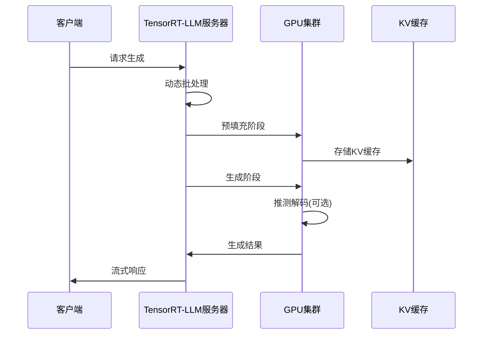
```mermaid
sequenceDiagram
participant Client as 客户端
participant Server as TensorRT-LLM服务器
participant GPU as GPU集群
participant Cache as KV缓存
Client->>Server : 请求生成
Server->>Server : 动态批处理
Server->>GPU : 预填充阶段
GPU->>Cache : 存储KV缓存
Server->>GPU : 生成阶段
GPU->>GPU : 推测解码(可选)
GPU->>Server : 生成结果
Server->>Client : 流式响应
```

**图表来源**
- [serving.md:69-133](file://optional-skills/mlops/tensorrt-llm/references/serving.md#L69-L133)
- [optimization.md:60-118](file://optional-skills/mlops/tensorrt-llm/references/optimization.md#L60-L118)

**章节来源**
- [optimization.md:1-243](file://optional-skills/mlops/tensorrt-llm/references/optimization.md#L1-L243)
- [multi-gpu.md:1-299](file://optional-skills/mlops/tensorrt-llm/references/multi-gpu.md#L1-L299)
- [serving.md:1-471](file://optional-skills/mlops/tensorrt-llm/references/serving.md#L1-L471)

## 架构概览

TensorRT LLM推理优化系统采用分层架构设计，从底层硬件抽象到上层应用接口：

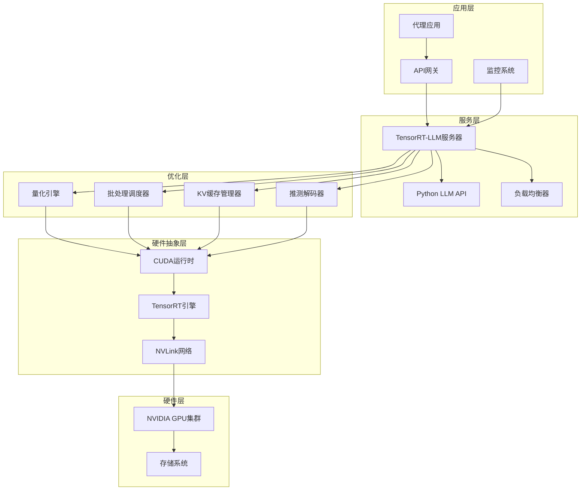
```mermaid
graph TB
subgraph "应用层"
A[代理应用]
B[API网关]
C[监控系统]
end
subgraph "服务层"
D[TensorRT-LLM服务器]
E[Python LLM API]
F[负载均衡器]
end
subgraph "优化层"
G[量化引擎]
H[批处理调度器]
I[KV缓存管理器]
J[推测解码器]
end
subgraph "硬件抽象层"
K[CUDA运行时]
L[TensorRT引擎]
M[NVLink网络]
end
subgraph "硬件层"
N[NVIDIA GPU集群]
O[存储系统]
end
A --> B
B --> D
C --> D
D --> E
D --> F
D --> G
D --> H
D --> I
D --> J
G --> K
H --> K
I --> K
J --> K
K --> L
L --> M
M --> N
N --> O
```

**图表来源**
- [serving.md:5-68](file://optional-skills/mlops/tensorrt-llm/references/serving.md#L5-L68)
- [multi-gpu.md:131-185](file://optional-skills/mlops/tensorrt-llm/references/multi-gpu.md#L131-L185)

## 详细组件分析

### 量化策略实现

#### FP8量化优化

FP8量化是针对H100 GPU优化的首选方案，提供2倍的速度提升和50%的内存减少：

| 模型规格 | FP16基准 | FP8优化 | 性能提升 | 内存节省 |
|---------|---------|---------|---------|---------|
| Llama 3-8B | 24,000 tokens/sec | 24,000 tokens/sec | 2× | 50% |
| Llama 3-70B | 5,000 tokens/sec | 10,000 tokens/sec | 2× | 50% |
| Llama 3-405B | OOM | 20,000-30,000 tokens/sec | 2× | 50% |

#### INT4量化策略

INT4量化提供最大的压缩比，适合内存受限的场景：

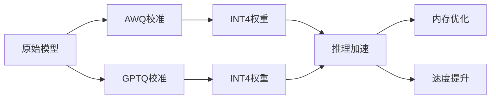
```mermaid
flowchart LR
A[原始模型] --> B[AWQ校准]
A --> C[GPTQ校准]
B --> D[INT4权重]
C --> E[INT4权重]
D --> F[推理加速]
E --> F
F --> G[内存优化]
F --> H[速度提升]
```

**图表来源**
- [optimization.md:31-59](file://optional-skills/mlops/tensorrt-llm/references/optimization.md#L31-L59)

### 多GPU部署策略

#### Tensor并行（TP）

Tensor并行将模型层水平分割到多个GPU上，适合需要低延迟的应用：

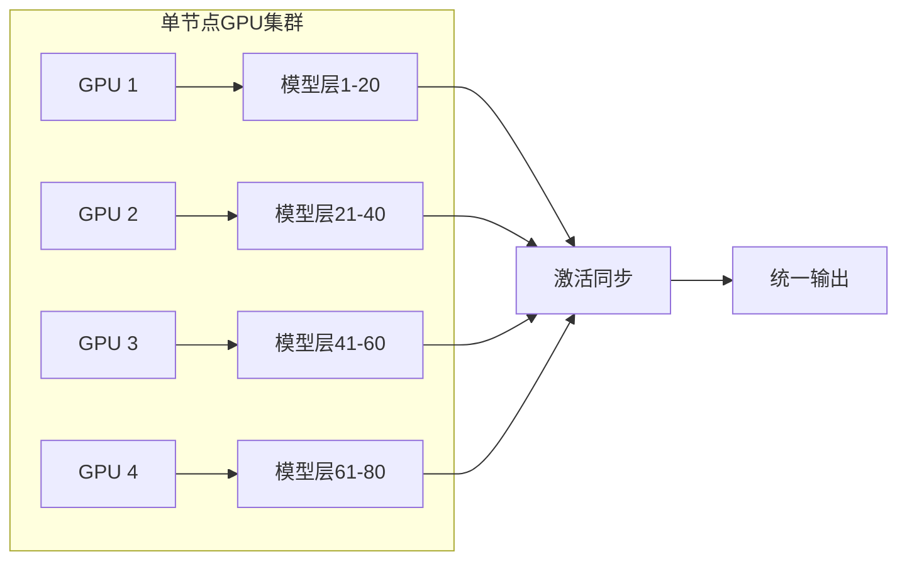
```mermaid
graph LR
subgraph "单节点GPU集群"
A[GPU 1] --> C[模型层1-20]
B[GPU 2] --> D[模型层21-40]
E[GPU 3] --> F[模型层41-60]
G[GPU 4] --> H[模型层61-80]
end
C --> I[激活同步]
D --> I
F --> I
H --> I
I --> J[统一输出]
```

**图表来源**
- [multi-gpu.md:7-28](file://optional-skills/mlops/tensorrt-llm/references/multi-gpu.md#L7-L28)

#### 管道并行（PP）

管道并行将模型层垂直分割到多个GPU上，适合超大模型和可容忍较高延迟的场景：

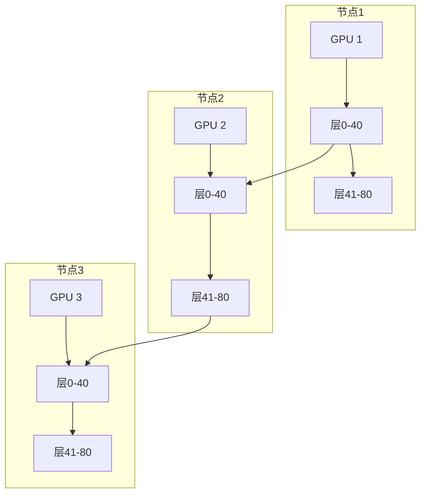
```mermaid
graph TB
subgraph "节点1"
A[GPU 1] --> B[层0-40]
B --> C[层41-80]
end
subgraph "节点2"
D[GPU 2] --> E[层0-40]
E --> F[层41-80]
end
subgraph "节点3"
G[GPU 3] --> H[层0-40]
H --> I[层41-80]
end
B --> E
F --> H
```

**图表来源**
- [multi-gpu.md:35-56](file://optional-skills/mlops/tensorrt-llm/references/multi-gpu.md#L35-L56)

### 性能优化技术

#### 动态批处理

动态批处理在生成过程中动态组合请求，显著提高GPU利用率：

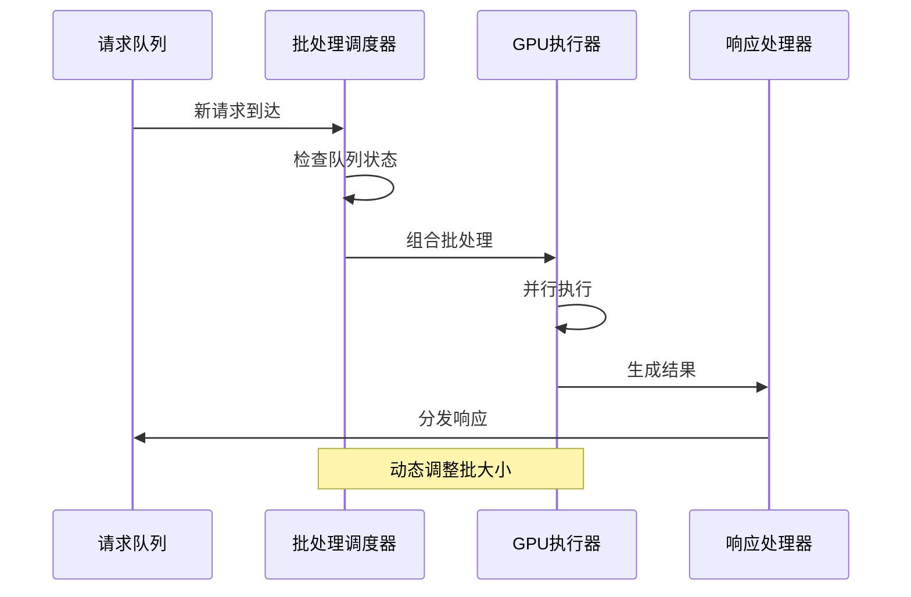
```mermaid
sequenceDiagram
participant Q as 请求队列
participant S as 批处理调度器
participant G as GPU执行器
participant R as 响应处理器
Q->>S : 新请求到达
S->>S : 检查队列状态
S->>G : 组合批处理
G->>G : 并行执行
G->>R : 生成结果
R->>Q : 分发响应
Note over S,G : 动态调整批大小
```

**图表来源**
- [optimization.md:60-78](file://optional-skills/mlops/tensorrt-llm/references/optimization.md#L60-L78)

#### 分页KV缓存

分页KV缓存模拟操作系统虚拟内存管理，提供高效的长序列处理：

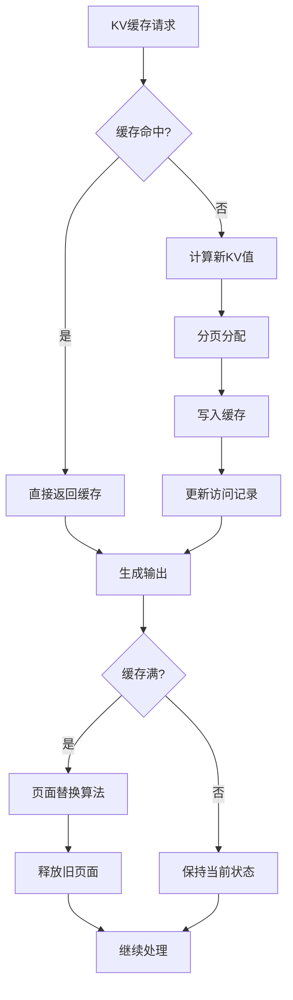
```mermaid
flowchart TD
A[KV缓存请求] --> B{缓存命中?}
B --> |是| C[直接返回缓存]
B --> |否| D[计算新KV值]
D --> E[分页分配]
E --> F[写入缓存]
F --> G[更新访问记录]
C --> H[生成输出]
G --> H
H --> I{缓存满?}
I --> |是| J[页面替换算法]
I --> |否| K[保持当前状态]
J --> L[释放旧页面]
L --> M[继续处理]
K --> M
```

**图表来源**
- [optimization.md:79-96](file://optional-skills/mlops/tensorrt-llm/references/optimization.md#L79-L96)

### 推理部署方法

#### 生产级部署

TensorRT LLM提供完整的生产部署解决方案：

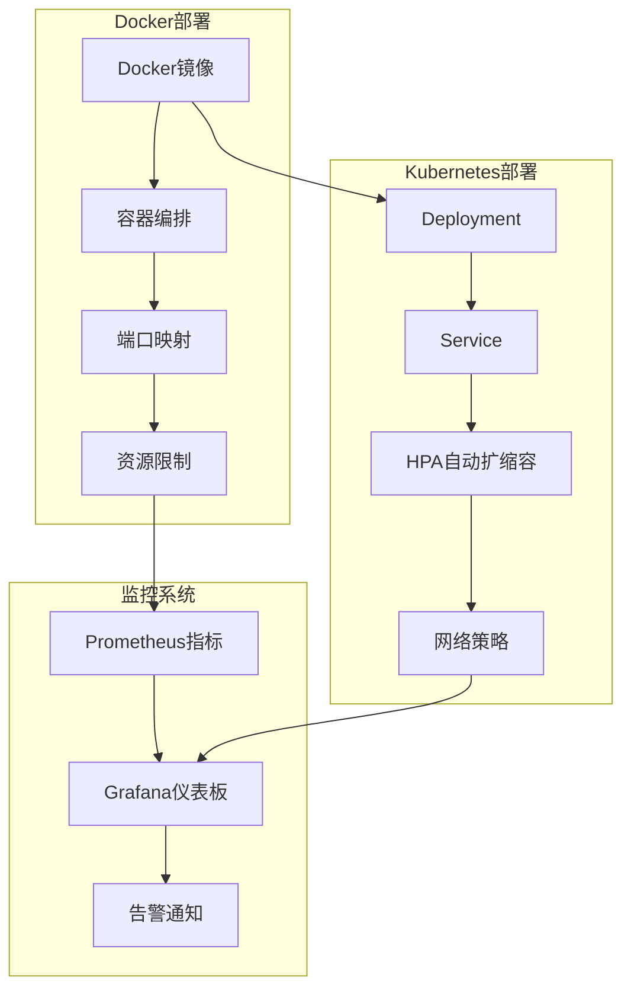
```mermaid
graph TB
subgraph "Docker部署"
A[Docker镜像] --> B[容器编排]
B --> C[端口映射]
C --> D[资源限制]
end
subgraph "Kubernetes部署"
E[Deployment] --> F[Service]
F --> G[HPA自动扩缩容]
G --> H[网络策略]
end
subgraph "监控系统"
I[Prometheus指标] --> J[Grafana仪表板]
J --> K[告警通知]
end
A --> E
D --> I
H --> J
```

**图表来源**
- [serving.md:203-292](file://optional-skills/mlops/tensorrt-llm/references/serving.md#L203-L292)

**章节来源**
- [optimization.md:1-243](file://optional-skills/mlops/tensorrt-llm/references/optimization.md#L1-L243)
- [multi-gpu.md:1-299](file://optional-skills/mlops/tensorrt-llm/references/multi-gpu.md#L1-L299)
- [serving.md:1-471](file://optional-skills/mlops/tensorrt-llm/references/serving.md#L1-L471)

## 依赖关系分析

TensorRT LLM优化工具与Hermes Agent其他组件存在紧密的依赖关系：

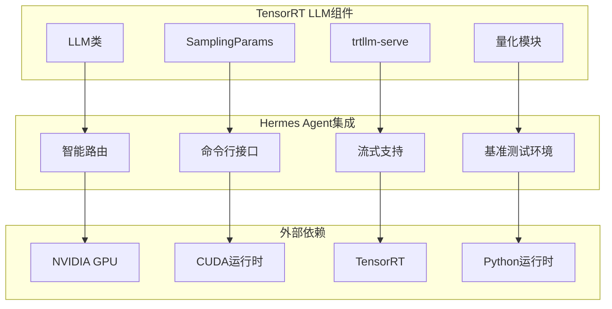
```mermaid
graph TB
subgraph "TensorRT LLM组件"
A[LLM类]
B[SamplingParams]
C[trtllm-serve]
D[量化模块]
end
subgraph "Hermes Agent集成"
E[智能路由]
F[命令行接口]
G[流式支持]
H[基准测试环境]
end
subgraph "外部依赖"
I[NVIDIA GPU]
J[CUDA运行时]
K[TensorRT]
L[Python运行时]
end
A --> E
B --> F
C --> G
D --> H
E --> I
F --> J
G --> K
H --> L
```

**图表来源**
- [smart_model_routing.py:110-138](file://agent/smart_model_routing.py#L110-L138)
- [cli.py:1947-1979](file://cli.py#L1947-L1979)

### 代理集成点

#### 智能路由集成

智能路由系统根据消息复杂度自动选择合适的推理后端：

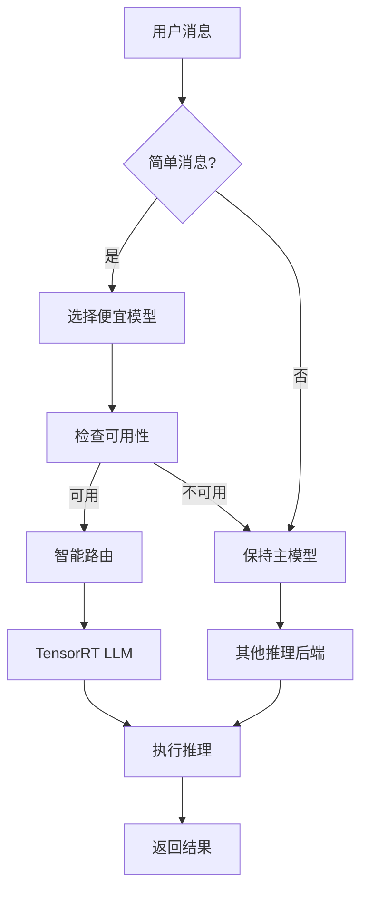
```mermaid
flowchart TD
A[用户消息] --> B{简单消息?}
B --> |是| C[选择便宜模型]
B --> |否| D[保持主模型]
C --> E[检查可用性]
E --> |可用| F[智能路由]
E --> |不可用| D
F --> G[TensorRT LLM]
D --> H[其他推理后端]
G --> I[执行推理]
H --> I
I --> J[返回结果]
```

**图表来源**
- [smart_model_routing.py:62-107](file://agent/smart_model_routing.py#L62-L107)

#### 流式支持集成

流式支持确保实时推理的用户体验：

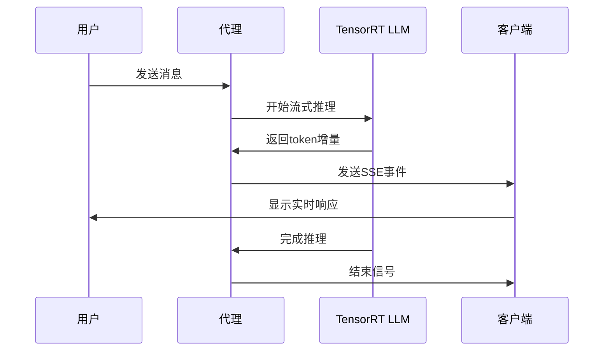
```mermaid
sequenceDiagram
participant U as 用户
participant A as 代理
participant T as TensorRT LLM
participant C as 客户端
U->>A : 发送消息
A->>T : 开始流式推理
T->>A : 返回token增量
A->>C : 发送SSE事件
C->>U : 显示实时响应
T->>A : 完成推理
A->>C : 结束信号
```

**图表来源**
- [streaming-support.md:489-557](file://.plans/streaming-support.md#L489-L557)

**章节来源**
- [smart_model_routing.py:1-195](file://agent/smart_model_routing.py#L1-L195)
- [cli.py:1947-1979](file://cli.py#L1947-L1979)
- [streaming-support.md:186-590](file://.plans/streaming-support.md#L186-L590)

## 性能考虑

### 内存管理优化

TensorRT LLM通过多种技术优化内存使用：

| 优化技术 | 内存节省 | 性能影响 | 适用场景 |
|---------|---------|---------|---------|
| 分页KV缓存 | 40-60% | +吞吐量 | 长序列推理 |
| FP8量化 | 50% | +2×速度 | H100 GPU |
| INT4量化 | 75% | +3-4×速度 | 内存受限环境 |
| CUDA图优化 | 10-20% | +稳定延迟 | 小批量推理 |

### 吞吐量提升策略

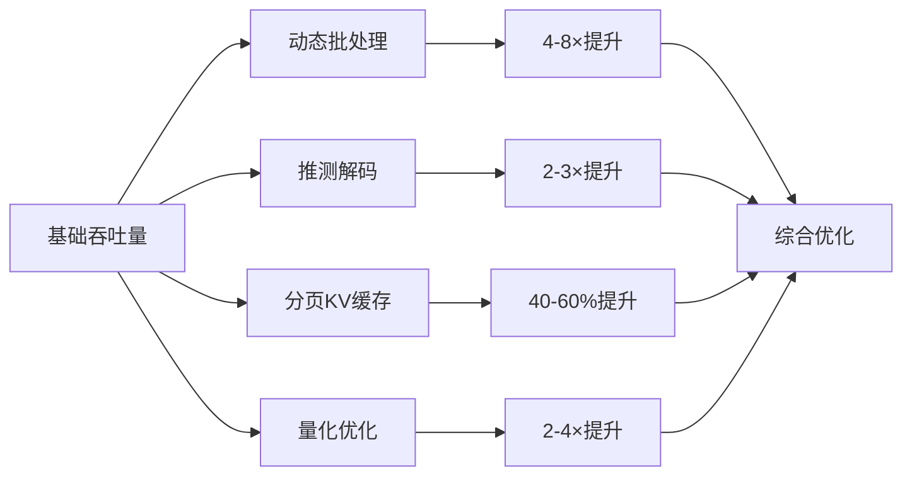
```mermaid
flowchart LR
A[基础吞吐量] --> B[动态批处理]
A --> C[推测解码]
A --> D[分页KV缓存]
A --> E[量化优化]
B --> F[4-8×提升]
C --> G[2-3×提升]
D --> H[40-60%提升]
E --> I[2-4×提升]
F --> J[综合优化]
G --> J
H --> J
I --> J
```

### 最佳实践建议

1. **硬件选择**：优先选择H100 GPU配合FP8量化
2. **批量调优**：根据GPU内存调整批大小
3. **网络优化**：使用NVLink连接多GPU
4. **监控设置**：部署Prometheus指标监控
5. **成本控制**：根据使用模式选择合适的GPU规格

## 故障排除指南

### 常见问题诊断

#### OOM错误处理

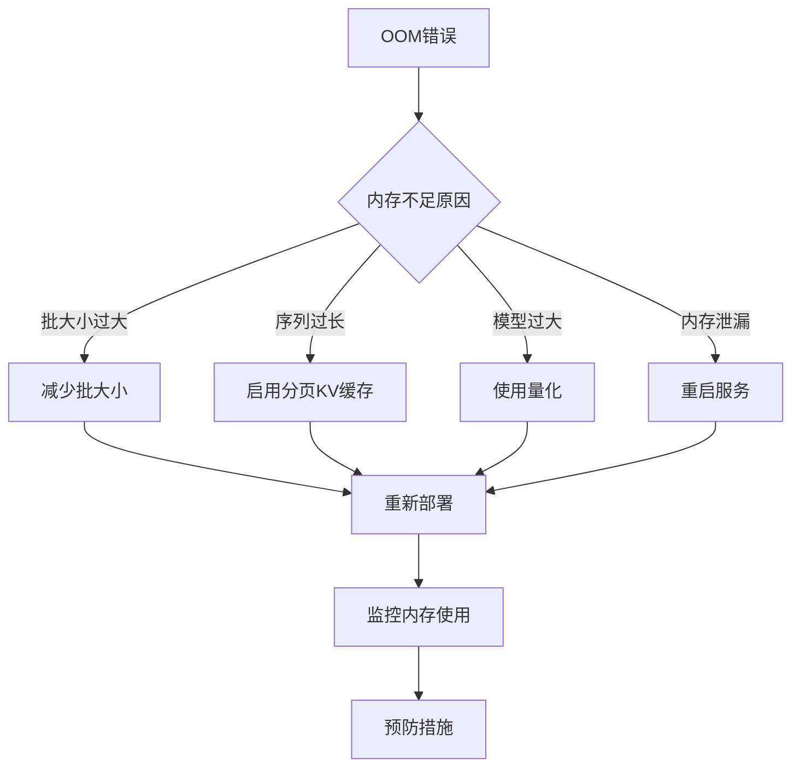
```mermaid
flowchart TD
A[OOM错误] --> B{内存不足原因}
B --> |批大小过大| C[减少批大小]
B --> |序列过长| D[启用分页KV缓存]
B --> |模型过大| E[使用量化]
B --> |内存泄漏| F[重启服务]
C --> G[重新部署]
D --> G
E --> G
F --> G
G --> H[监控内存使用]
H --> I[预防措施]
```

#### 性能问题排查

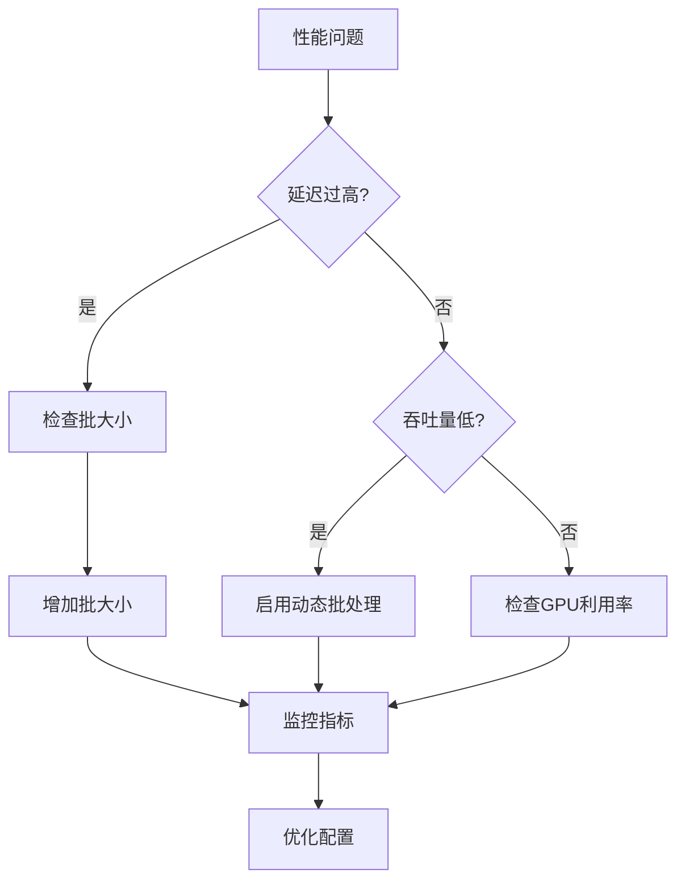
```mermaid
flowchart TD
A[性能问题] --> B{延迟过高?}
B --> |是| C[检查批大小]
B --> |否| D{吞吐量低?}
C --> E[增加批大小]
D --> |是| F[启用动态批处理]
D --> |否| G[检查GPU利用率]
E --> H[监控指标]
F --> H
G --> H
H --> I[优化配置]
```

### 监控指标

关键性能指标包括：

- **吞吐量**：tokens/sec
- **延迟**：P50/P90/P99 ms
- **GPU利用率**：%
- **内存使用**：GB
- **队列长度**：请求数

**章节来源**
- [optimization.md:225-243](file://optional-skills/mlops/tensorrt-llm/references/optimization.md#L225-L243)
- [serving.md:424-471](file://optional-skills/mlops/tensorrt-llm/references/serving.md#L424-L471)

## 结论

TensorRT LLM推理优化工具为Hermes Agent提供了强大的推理加速能力。通过量化压缩、动态批处理、分页KV缓存和多GPU并行等技术，实现了2-4倍的性能提升和显著的成本节约。

该工具的主要优势包括：

1. **高性能**：在H100 GPU上实现24,000+ tokens/sec的吞吐量
2. **灵活性**：支持从单GPU到多节点集群的多种部署模式
3. **易用性**：提供简化的API和完整的生产部署指南
4. **成本效益**：通过量化和优化技术降低推理成本

对于需要实时推理和高吞吐量的应用场景，TensorRT LLM是理想的选择。建议根据具体的硬件条件和性能需求选择合适的优化策略和部署方案。

## 附录

### 性能基准测试

#### 基准测试环境配置

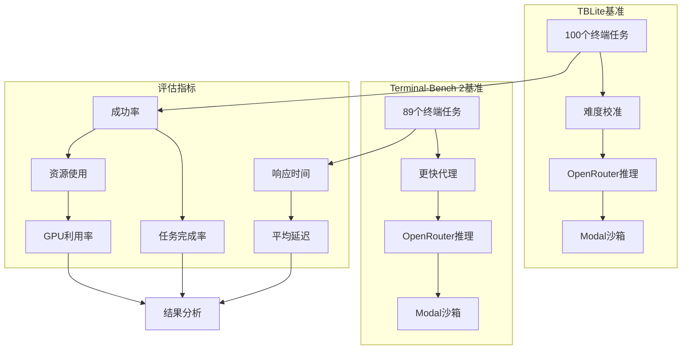
```mermaid
graph TB
subgraph "TBLite基准"
A[100个终端任务] --> B[难度校准]
B --> C[OpenRouter推理]
C --> D[Modal沙箱]
end
subgraph "Terminal-Bench 2基准"
E[89个终端任务] --> F[更快代理]
F --> G[OpenRouter推理]
G --> H[Modal沙箱]
end
subgraph "评估指标"
I[成功率] --> J[任务完成率]
K[响应时间] --> L[平均延迟]
M[资源使用] --> N[GPU利用率]
end
A --> I
E --> K
I --> M
J --> O[结果分析]
L --> O
N --> O
```

**图表来源**
- [default.yaml:1-40](file://environments/benchmarks/tblite/default.yaml#L1-L40)
- [default.yaml:1-43](file://environments/benchmarks/terminalbench_2/default.yaml#L1-L43)

### 应用示例

#### 实时推理集成示例

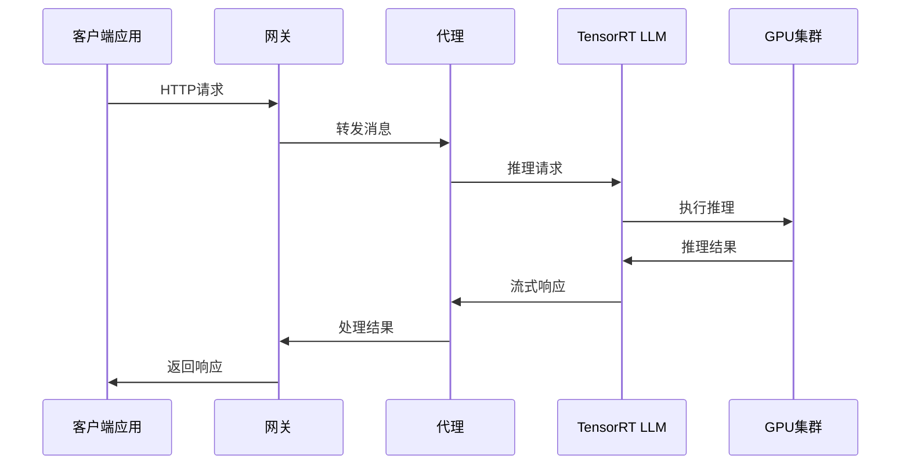
```mermaid
sequenceDiagram
participant Client as 客户端应用
participant Gateway as 网关
participant Agent as 代理
participant TRT as TensorRT LLM
participant GPU as GPU集群
Client->>Gateway : HTTP请求
Gateway->>Agent : 转发消息
Agent->>TRT : 推理请求
TRT->>GPU : 执行推理
GPU->>TRT : 推理结果
TRT->>Agent : 流式响应
Agent->>Gateway : 处理结果
Gateway->>Client : 返回响应
```

该流程展示了TensorRT LLM如何无缝集成到Hermes Agent的实时推理管道中，提供低延迟和高吞吐量的服务。