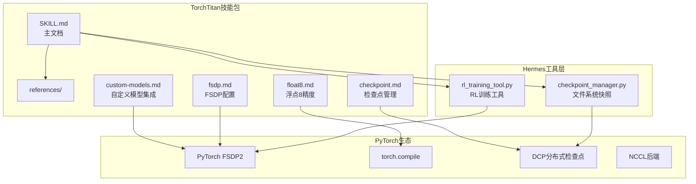
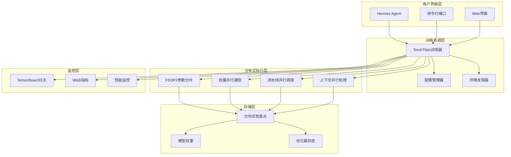
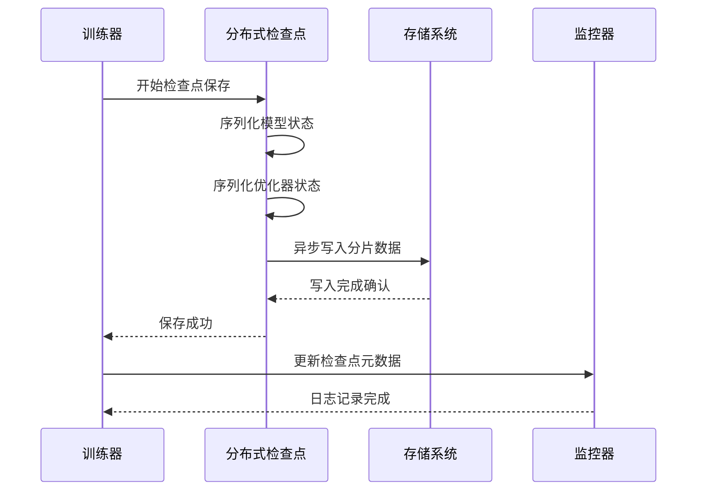
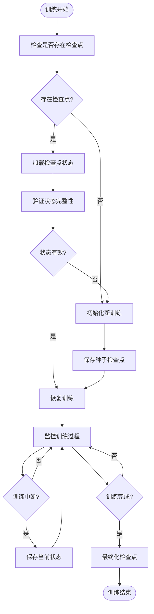
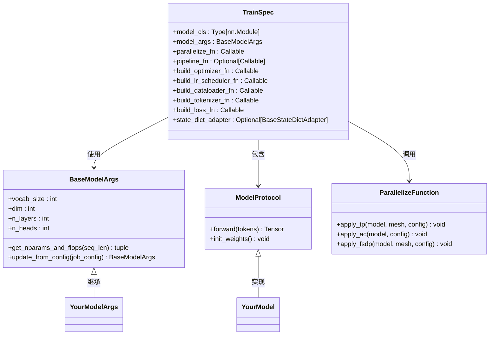
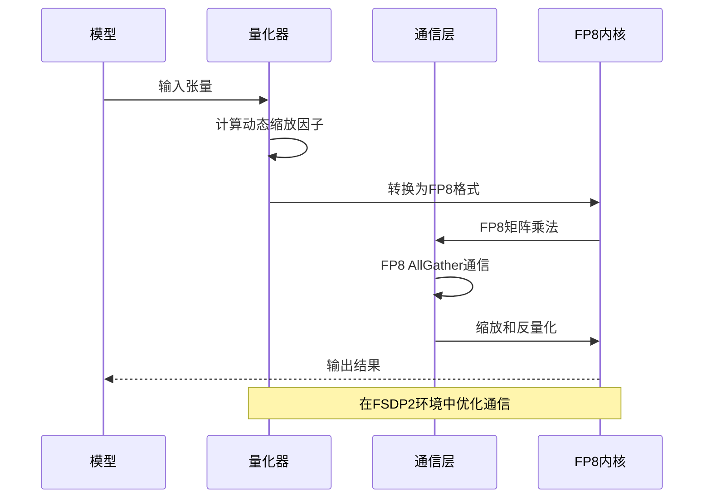
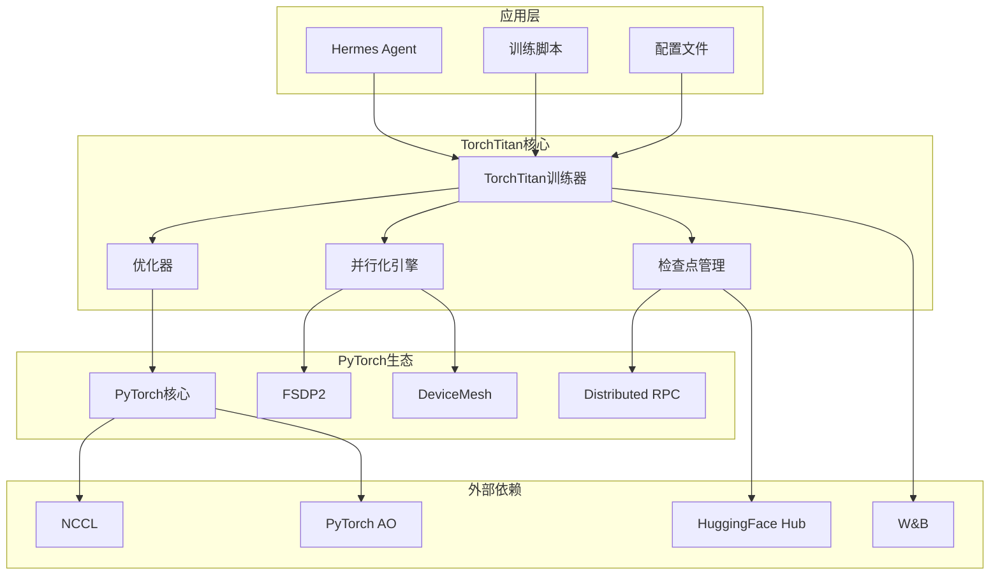

# TorchTitan训练框架

<cite>
**本文档引用的文件**
- [SKILL.md](file://optional-skills/mlops/torchtitan/SKILL.md)
- [checkpoint.md](file://optional-skills/mlops/torchtitan/references/checkpoint.md)
- [custom-models.md](file://optional-skills/mlops/torchtitan/references/custom-models.md)
- [float8.md](file://optional-skills/mlops/torchtitan/references/float8.md)
- [fsdp.md](file://optional-skills/mlops/torchtitan/references/fsdp.md)
- [pytorch-fsdp/SKILL.md](file://skills/mlops/training/pytorch-fsdp/SKILL.md)
- [checkpoint_manager.py](file://tools/checkpoint_manager.py)
- [rl_training_tool.py](file://tools/rl_training_tool.py)
</cite>

## 目录
1. [简介](#简介)
2. [项目结构](#项目结构)
3. [核心组件](#核心组件)
4. [架构概览](#架构概览)
5. [详细组件分析](#详细组件分析)
6. [依赖关系分析](#依赖关系分析)
7. [性能考虑](#性能考虑)
8. [故障排除指南](#故障排除指南)
9. [结论](#结论)
10. [附录](#附录)

## 简介

Hermes Agent的TorchTitan训练框架是一个基于PyTorch原生的分布式大语言模型预训练平台。该框架提供了完整的4D并行训练解决方案（FSDP2、张量并行、流水线并行、上下文并行），支持从8到512+ GPU的大规模分布式训练。

TorchTitan的核心优势包括：
- **PyTorch原生分布式**：无需第三方依赖，与PyTorch生态系统无缝集成
- **4D并行组合**：可配置的FSDP2、TP、PP、CP并行策略
- **浮点8精度优化**：在H100 GPU上提供30-50%的速度提升
- **分布式检查点**：故障容错和跨平台互操作性
- **自定义模型集成**：灵活的模型注册和训练规范接口

## 项目结构

TorchTitan训练框架在Hermes Agent中的组织结构如下：



**图表来源**
- [SKILL.md:1-362](file://optional-skills/mlops/torchtitan/SKILL.md#L1-L362)
- [checkpoint_manager.py:1-549](file://tools/checkpoint_manager.py#L1-L549)
- [rl_training_tool.py:1-800](file://tools/rl_training_tool.py#L1-L800)

**章节来源**
- [SKILL.md:1-362](file://optional-skills/mlops/torchtitan/SKILL.md#L1-L362)

## 核心组件

### 分布式训练引擎

TorchTitan提供了完整的分布式训练基础设施，支持多种并行策略的组合使用：

#### 4D并行架构
- **数据并行（FSDP2）**：参数分片，降低内存占用
- **张量并行（TP）**：权重和激活的水平分割
- **流水线并行（PP）**：模型层的流水线分割
- **上下文并行（CP）**：长序列的有效处理

#### 混合精度训练
- **BF16/BF16混合精度**：平衡精度和性能
- **torch.compile优化**：内核融合和代码生成
- **动态量化**：运行时量化和反量化

**章节来源**
- [SKILL.md:16-362](file://optional-skills/mlops/torchtitan/SKILL.md#L16-L362)
- [fsdp.md:1-127](file://optional-skills/mlops/torchtitan/references/fsdp.md#L1-L127)

### 检查点管理系统

TorchTitan集成了强大的分布式检查点功能，支持故障恢复和跨平台兼容：

#### 分布式检查点（DCP）
- **分片存储**：每个进程保存自己的参数分片
- **异步写入**：减少训练停顿时间
- **格式转换**：支持HuggingFace和PyTorch格式互转

#### 快速恢复机制
- **自动恢复**：训练中断后自动从最新检查点重启
- **种子检查点**：流水线并行的初始化保障
- **部分加载**：选择性加载特定组件

**章节来源**
- [checkpoint.md:1-182](file://optional-skills/mlops/torchtitan/references/checkpoint.md#L1-L182)

### 浮点8精度优化

TorchTitan提供了先进的FP8训练技术，在H100 GPU上实现显著的性能提升：

#### 训练模式
- **张量级缩放**：单个张量一个缩放因子
- **行级缩放**：每行独立缩放，提高精度
- **动态缩放**：运行时计算缩放因子

#### 通信优化
- **FP8 AllGather**：减少带宽需求
- **全局缩放**：统一的缩放因子传播
- **预计算缩放**：批量计算避免重复开销

**章节来源**
- [float8.md:1-134](file://optional-skills/mlops/torchtitan/references/float8.md#L1-L134)

## 架构概览

TorchTitan在Hermes Agent中的整体架构如下：



**图表来源**
- [SKILL.md:1-362](file://optional-skills/mlops/torchtitan/SKILL.md#L1-L362)
- [checkpoint_manager.py:1-549](file://tools/checkpoint_manager.py#L1-L549)

## 详细组件分析

### 检查点管理组件

检查点管理是TorchTitan可靠性的关键组件，提供了完整的训练中断恢复能力。

#### 分布式检查点流程



**图表来源**
- [checkpoint.md:130-143](file://optional-skills/mlops/torchtitan/references/checkpoint.md#L130-L143)

#### 恢复机制设计

检查点恢复采用智能检测和自动恢复策略：



**图表来源**
- [checkpoint.md:145-152](file://optional-skills/mlops/torchtitan/references/checkpoint.md#L145-L152)

**章节来源**
- [checkpoint.md:1-182](file://optional-skills/mlops/torchtitan/references/checkpoint.md#L1-L182)

### 自定义模型集成组件

TorchTitan提供了灵活的自定义模型集成机制，支持快速添加新的模型架构。

#### 模型注册流程



**图表来源**
- [custom-models.md:130-160](file://optional-skills/mlops/torchtitan/references/custom-models.md#L130-L160)

#### 并行化管道

自定义模型的并行化遵循严格的顺序：


**图表来源**
- [custom-models.md:96-128](file://optional-skills/mlops/torchtitan/references/custom-models.md#L96-L128)

**章节来源**
- [custom-models.md:1-259](file://optional-skills/mlops/torchtitan/references/custom-models.md#L1-L259)

### 浮点8精度训练组件

FP8训练是TorchTitan性能优化的核心技术，通过硬件加速实现显著的性能提升。

#### FP8训练工作流程



**图表来源**
- [float8.md:82-107](file://optional-skills/mlops/torchtitan/references/float8.md#L82-L107)

#### 性能优化策略

FP8训练的关键优化点包括：

| 优化技术 | 描述 | 性能收益 |
|---------|------|----------|
| 动态缩放 | 运行时计算缩放因子 | 减少精度损失 |
| 预计算缩放 | 批量计算避免重复 | 提高通信效率 |
| 异步通信 | 重叠通信和计算 | 减少等待时间 |
| 内核融合 | 合并多个操作 | 提高GPU利用率 |

**章节来源**
- [float8.md:1-134](file://optional-skills/mlops/torchtitan/references/float8.md#L1-L134)

### FSDP2配置组件

FSDP2是TorchTitan的核心参数分片技术，提供了比传统FSDP更好的性能和易用性。

#### FSDP2 API参考

```mermaid
classDiagram
class FSDPState {
+mesh : DeviceMesh
+reshard_after_forward : bool/int
+mp_policy : MixedPrecisionPolicy
+offload_policy : OffloadPolicy
}
class MixedPrecisionPolicy {
+param_dtype : dtype
+reduce_dtype : dtype
+output_dtype : dtype
+cast_forward_inputs : bool
}
class OffloadPolicy {
+enabled : bool
+device : str
}
class fully_shard {
+__call__(module, mesh, reshard_after_forward,
mp_policy, offload_policy) nn.Module
}
FSDPState --> MixedPrecisionPolicy : 使用
FSDPState --> OffloadPolicy : 使用
fully_shard --> FSDPState : 返回
```

**图表来源**
- [fsdp.md:17-31](file://optional-skills/mlops/torchtitan/references/fsdp.md#L17-L31)

**章节来源**
- [fsdp.md:1-127](file://optional-skills/mlops/torchtitan/references/fsdp.md#L1-L127)

## 依赖关系分析

TorchTitan训练框架的依赖关系体现了清晰的分层架构：



**图表来源**
- [SKILL.md:7-11](file://optional-skills/mlops/torchtitan/SKILL.md#L7-L11)
- [pytorch-fsdp/SKILL.md:1-37](file://skills/mlops/training/pytorch-fsdp/SKILL.md#L1-L37)

**章节来源**
- [SKILL.md:1-362](file://optional-skills/mlops/torchtitan/SKILL.md#L1-L362)

## 性能考虑

### 内存优化策略

TorchTitan采用了多层次的内存优化技术：

#### 参数分片优化
- **FSDP2内存管理**：7%的峰值内存减少
- **元设备初始化**：零内存参数分配
- **延迟参数加载**：按需分配GPU内存

#### 通信优化
- **FP8 AllGather**：带宽需求减少50%
- **异步通信**：重叠通信和计算
- **通信压缩**：梯度压缩和稀疏化

### 训练效率优化

#### 并行策略选择
根据模型大小和硬件配置选择最优的并行组合：

| 模型规模 | 推荐并行策略 | 硬件要求 |
|---------|-------------|----------|
| 8B-70B | FSDP2 + TP + AsyncTP | 8-32 GPUs |
| 70B-405B | FSDP2 + TP + PP | 64-256 GPUs |
| 405B+ | FSDP2 + TP + PP + CP | 512+ GPUs |

#### 性能基准对比

| 配置 | TPS/GPU | 相对提升 |
|------|---------|----------|
| FSDP基础 | 5,762 | - |
| FSDP + 编译 | 6,667 | +16% |
| FSDP + 编译 + FP8 | 8,532 | +48% |

**章节来源**
- [SKILL.md:336-344](file://optional-skills/mlops/torchtitan/SKILL.md#L336-L344)
- [float8.md:115-129](file://optional-skills/mlops/torchtitan/references/float8.md#L115-L129)

## 故障排除指南

### 常见问题诊断

#### 内存不足问题
**症状**：训练过程中出现OOM错误或性能急剧下降

**诊断步骤**：
1. 检查FSDP2参数分片是否正确配置
2. 验证激活检查点设置
3. 确认梯度累积设置

**解决方案**：
- 启用全激活检查点模式
- 减小本地批次大小
- 使用梯度累积替代大批量

#### 并行通信问题
**症状**：分布式训练卡死或通信超时

**诊断步骤**：
1. 检查NCCL环境变量配置
2. 验证网络连接和防火墙设置
3. 确认GPU驱动版本兼容性

**解决方案**：
- 设置TORCH_NCCL_AVOID_RECORD_STREAMS=1
- 检查RDMA网络配置
- 更新GPU驱动到最新版本

#### 检查点加载失败
**症状**：训练无法从检查点恢复

**诊断步骤**：
1. 验证检查点文件完整性
2. 检查并行配置一致性
3. 确认模型架构匹配

**解决方案**：
- 使用DCP重着色工具转换检查点
- 创建种子检查点进行初始化
- 手动修复状态字典适配器

**章节来源**
- [SKILL.md:277-324](file://optional-skills/mlops/torchtitan/SKILL.md#L277-L324)
- [checkpoint.md:175-182](file://optional-skills/mlops/torchtitan/references/checkpoint.md#L175-L182)

## 结论

Hermes Agent的TorchTitan训练框架代表了大规模深度学习训练的先进解决方案。通过集成4D并行、FP8优化、分布式检查点等核心技术，该框架能够在多GPU环境中实现高效、可靠的模型训练。

### 主要优势
- **高性能**：在H100 GPU上实现48%的性能提升
- **可扩展性**：支持从8到512+ GPU的大规模训练
- **可靠性**：完整的检查点管理和故障恢复机制
- **易用性**：简洁的配置接口和丰富的文档支持

### 应用前景
TorchTitan训练框架特别适用于以下场景：
- 大语言模型的预训练和微调
- 多模态模型的大规模训练
- 科学计算和AI研究项目
- 企业级AI模型开发

随着深度学习模型规模的持续增长，TorchTitan训练框架将继续演进，为研究人员和工程师提供更强大的训练工具。

## 附录

### 最佳实践清单

#### 训练前准备
- [ ] 验证硬件配置和网络环境
- [ ] 准备预训练检查点和数据集
- [ ] 配置并行策略和优化参数
- [ ] 设置监控和日志记录

#### 训练过程监控
- [ ] 定期检查训练指标和损失曲线
- [ ] 监控GPU内存使用和通信性能
- [ ] 及时备份重要检查点
- [ ] 记录实验配置和结果

#### 故障处理
- [ ] 建立检查点恢复机制
- [ ] 准备回滚和降级方案
- [ ] 建立监控告警系统
- [ ] 制定应急响应流程

### 参考资源
- TorchTitan官方文档和示例
- PyTorch分布式训练最佳实践
- HuggingFace模型转换工具
- W&B性能监控平台