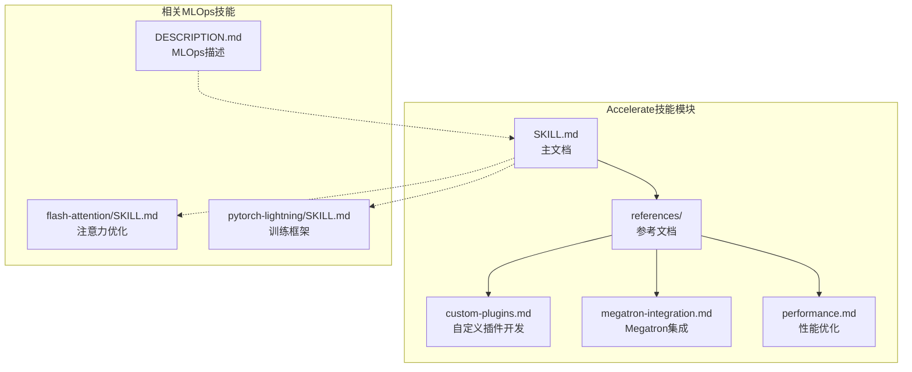
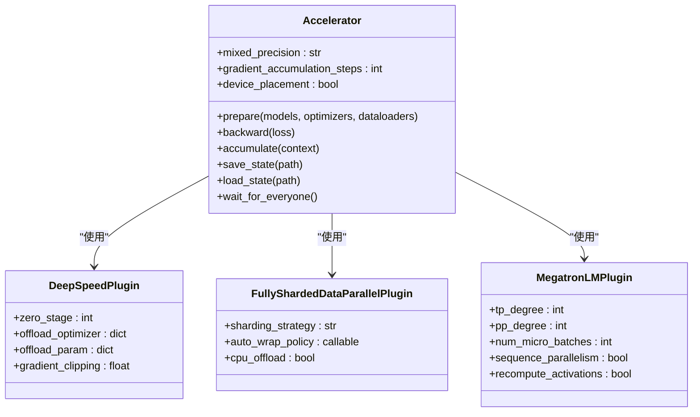
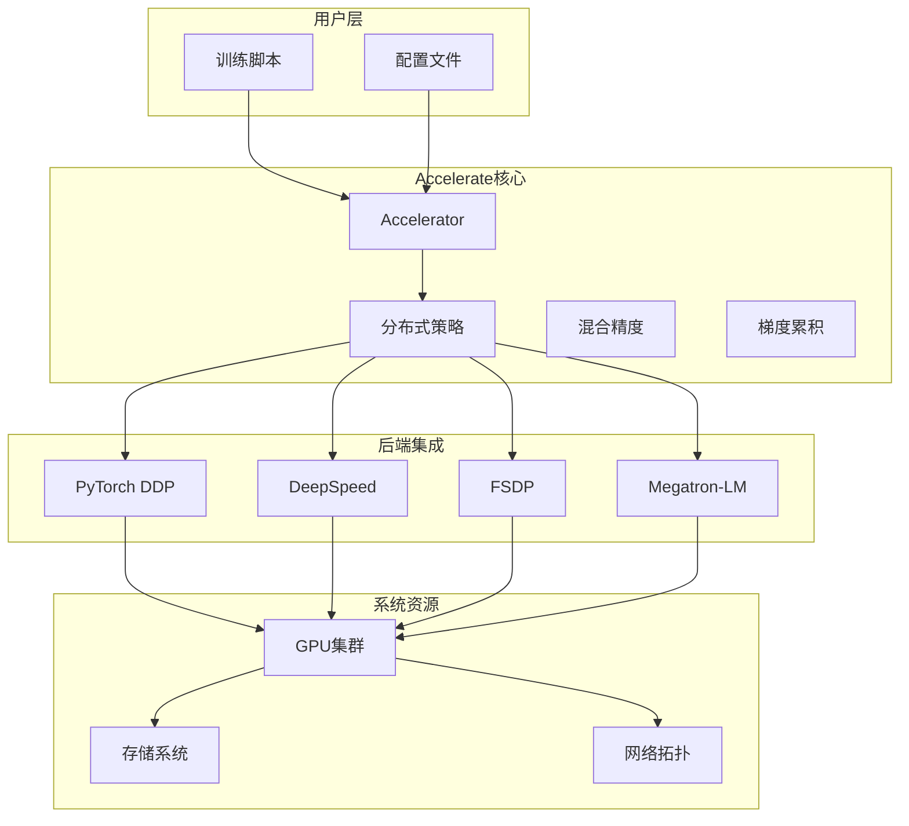
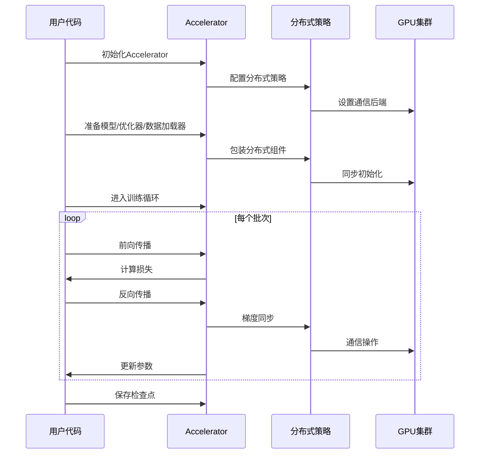
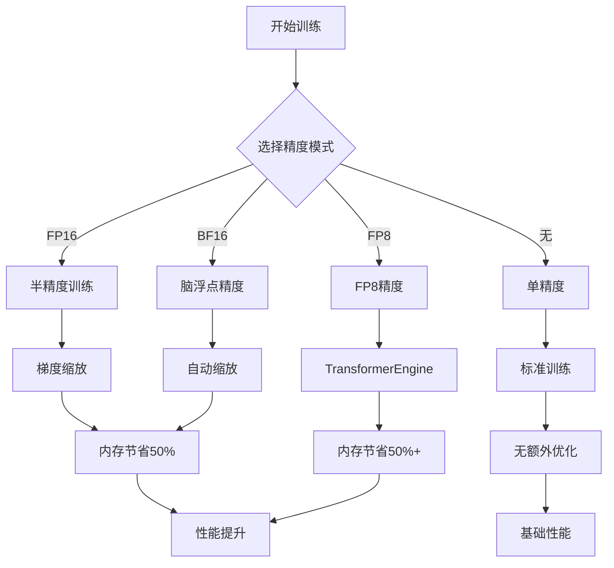
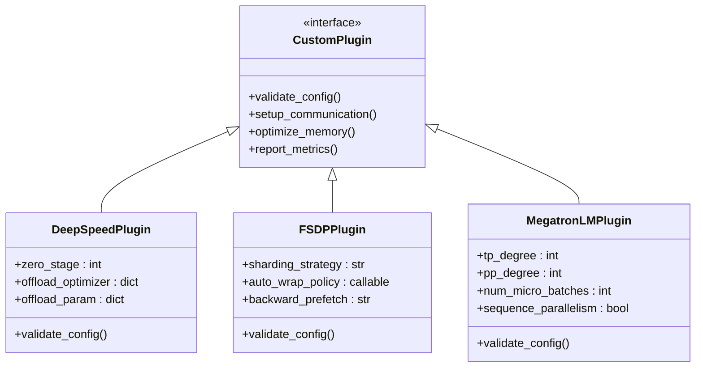
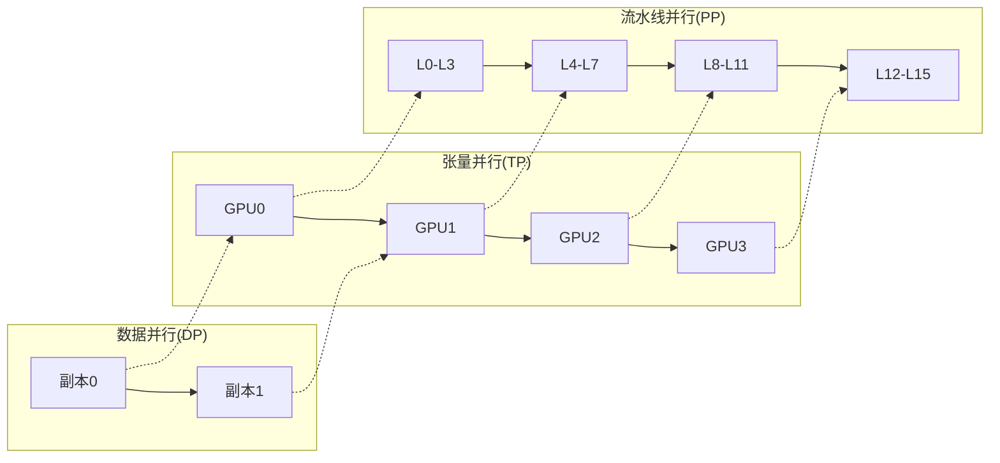
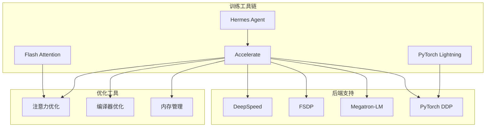
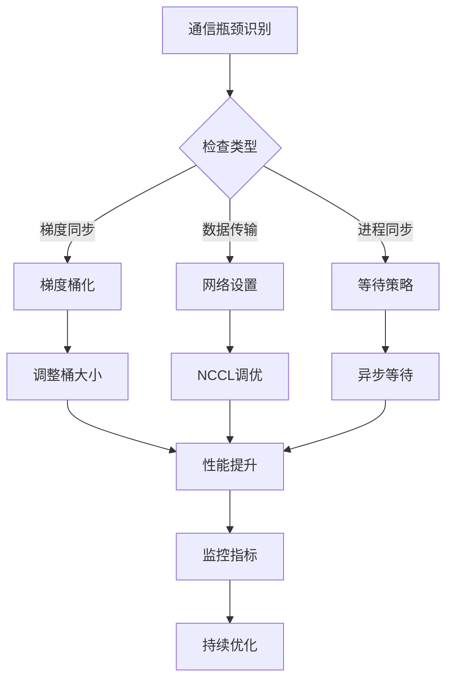
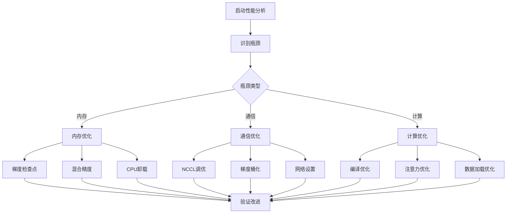

# 加速训练工具

<cite>
**本文档引用的文件**
- [SKILL.md](file://optional-skills/mlops/accelerate/SKILL.md)
- [custom-plugins.md](file://optional-skills/mlops/accelerate/references/custom-plugins.md)
- [megatron-integration.md](file://optional-skills/mlops/accelerate/references/megatron-integration.md)
- [performance.md](file://optional-skills/mlops/accelerate/references/performance.md)
- [DESCRIPTION.md](file://optional-skills/mlops/DESCRIPTION.md)
- [flash-attention/SKILL.md](file://optional-skills/mlops/flash-attention/SKILL.md)
- [pytorch-lightning/SKILL.md](file://optional-skills/mlops/pytorch-lightning/SKILL.md)
</cite>

## 目录
1. [简介](#简介)
2. [项目结构](#项目结构)
3. [核心组件](#核心组件)
4. [架构概览](#架构概览)
5. [详细组件分析](#详细组件分析)
6. [依赖关系分析](#依赖关系分析)
7. [性能考虑](#性能考虑)
8. [故障排除指南](#故障排除指南)
9. [结论](#结论)
10. [附录](#附录)

## 简介

Hermes Agent的Accelerate加速训练工具是一个专为机器学习操作(MLOps)设计的分布式训练解决方案。该工具基于HuggingFace Accelerate框架，提供了统一的分布式训练接口，支持多种训练策略包括DDP、DeepSpeed、FSDP和Megatron-LM。

Accelerate的核心优势在于其极简的API设计，仅需4行代码即可为现有的PyTorch脚本添加分布式训练能力。它自动处理设备分配、混合精度训练、梯度累积等复杂细节，使研究人员能够专注于模型开发而非基础设施配置。

在Hermes Agent生态系统中，Accelerate作为核心的训练加速引擎，与其他MLOps工具形成了完整的训练流水线：从数据预处理、模型训练到推理优化，为AI模型的全生命周期管理提供支持。

## 项目结构

Accelerate技能模块在Hermes Agent中的组织结构如下：



**图表来源**
- [SKILL.md:1-336](file://optional-skills/mlops/accelerate/SKILL.md#L1-L336)
- [custom-plugins.md:1-454](file://optional-skills/mlops/accelerate/references/custom-plugins.md#L1-L454)
- [megatron-integration.md:1-490](file://optional-skills/mlops/accelerate/references/megatron-integration.md#L1-L490)
- [performance.md:1-526](file://optional-skills/mlops/accelerate/references/performance.md#L1-L526)

**章节来源**
- [SKILL.md:1-336](file://optional-skills/mlops/accelerate/SKILL.md#L1-L336)
- [DESCRIPTION.md:1-4](file://optional-skills/mlops/DESCRIPTION.md#L1-L4)

## 核心组件

### Accelerator核心类

Accelerate的核心是Accelerator类，它提供了统一的分布式训练接口：



**图表来源**
- [SKILL.md:125-208](file://optional-skills/mlops/accelerate/SKILL.md#L125-L208)
- [custom-plugins.md:115-157](file://optional-skills/mlops/accelerate/references/custom-plugins.md#L115-L157)

### 分布式训练策略

Accelerate支持多种分布式训练策略：

| 策略 | 描述 | 适用场景 | 内存优化 |
|------|------|----------|----------|
| DDP | 数据并行 | 小型模型，多GPU | 基础并行 |
| DeepSpeed | ZeRO优化 | 大型模型，内存受限 | 显著减少 |
| FSDP | 参数分片 | 超大规模模型 | 极大减少 |
| Megatron-LM | 张量并行 | 超大语言模型 | 高效利用 |

**章节来源**
- [SKILL.md:236-332](file://optional-skills/mlops/accelerate/SKILL.md#L236-L332)

## 架构概览

Accelerate在Hermes Agent中的整体架构如下：



**图表来源**
- [SKILL.md:14-336](file://optional-skills/mlops/accelerate/SKILL.md#L14-L336)
- [megatron-integration.md:1-490](file://optional-skills/mlops/accelerate/references/megatron-integration.md#L1-L490)

## 详细组件分析

### 分布式训练工作流程

Accelerate的分布式训练遵循标准化的工作流程：



**图表来源**
- [SKILL.md:53-120](file://optional-skills/mlops/accelerate/SKILL.md#L53-L120)

### 混合精度训练

Accelerate支持多种混合精度模式：



**图表来源**
- [SKILL.md:122-144](file://optional-skills/mlops/accelerate/SKILL.md#L122-L144)
- [performance.md:124-153](file://optional-skills/mlops/accelerate/references/performance.md#L124-L153)

**章节来源**
- [SKILL.md:122-144](file://optional-skills/mlops/accelerate/SKILL.md#L122-L144)
- [performance.md:124-153](file://optional-skills/mlops/accelerate/references/performance.md#L124-L153)

### 自定义插件开发

Accelerate提供了灵活的插件架构来扩展功能：



**图表来源**
- [custom-plugins.md:11-41](file://optional-skills/mlops/accelerate/references/custom-plugins.md#L11-L41)
- [custom-plugins.md:111-157](file://optional-skills/mlops/accelerate/references/custom-plugins.md#L111-L157)

**章节来源**
- [custom-plugins.md:1-454](file://optional-skills/mlops/accelerate/references/custom-plugins.md#L1-L454)

### Megatron-LM集成

Accelerate对Megatron-LM的支持提供了大规模模型训练能力：



**图表来源**
- [megatron-integration.md:98-188](file://optional-skills/mlops/accelerate/references/megatron-integration.md#L98-L188)

**章节来源**
- [megatron-integration.md:1-490](file://optional-skills/mlops/accelerate/references/megatron-integration.md#L1-L490)

## 依赖关系分析

Accelerate与其他MLOps工具的集成关系：



**图表来源**
- [SKILL.md:325-332](file://optional-skills/mlops/accelerate/SKILL.md#L325-L332)
- [flash-attention/SKILL.md:1-371](file://optional-skills/mlops/flash-attention/SKILL.md#L1-L371)
- [pytorch-lightning/SKILL.md:1-350](file://optional-skills/mlops/pytorch-lightning/SKILL.md#L1-L350)

**章节来源**
- [SKILL.md:325-332](file://optional-skills/mlops/accelerate/SKILL.md#L325-L332)
- [flash-attention/SKILL.md:1-371](file://optional-skills/mlops/flash-attention/SKILL.md#L1-L371)
- [pytorch-lightning/SKILL.md:1-350](file://optional-skills/mlops/pytorch-lightning/SKILL.md#L1-L350)

## 性能考虑

### 内存优化策略

Accelerate提供了多层次的内存优化机制：

| 优化技术 | 实现方式 | 内存节省 | 性能影响 |
|----------|----------|----------|----------|
| 梯度累积 | 分批更新参数 | 无 | 降低吞吐量 |
| 梯度检查点 | 重新计算激活 | 30-50% | 10-15%减速 |
| 混合精度 | FP16/BF16 | 50% | 无或轻微提升 |
| CPU卸载 | DeepSpeed ZeRO | 10-20× | 20-30%减速 |
| 注意力优化 | Flash Attention | 10-20× | 2-4×加速 |

### 通信优化



**图表来源**
- [performance.md:196-246](file://optional-skills/mlops/accelerate/references/performance.md#L196-L246)

**章节来源**
- [performance.md:1-526](file://optional-skills/mlops/accelerate/references/performance.md#L1-L526)

## 故障排除指南

### 常见问题诊断

| 问题类型 | 症状 | 诊断方法 | 解决方案 |
|----------|------|----------|----------|
| 设备放置错误 | OOM或设备不匹配 | 检查`.to(device)`调用 | 使用`accelerator.prepare()` |
| 梯度累积无效 | 梯度爆炸 | 检查`accelerator.accumulate()` | 正确使用上下文管理器 |
| 分布式检查点 | 训练不同步 | 检查主进程条件 | 使用`accelerator.is_main_process` |
| FSDP结果差异 | 随机性问题 | 检查随机种子 | 设置全局随机种子 |

### 性能调优步骤



**图表来源**
- [performance.md:435-462](file://optional-skills/mlops/accelerate/references/performance.md#L435-L462)

**章节来源**
- [SKILL.md:258-301](file://optional-skills/mlops/accelerate/SKILL.md#L258-L301)
- [performance.md:463-526](file://optional-skills/mlops/accelerate/references/performance.md#L463-L526)

## 结论

Hermes Agent的Accelerate加速训练工具为机器学习研究提供了强大而灵活的分布式训练解决方案。通过其统一的API设计和丰富的插件架构，Accelerate能够在保持代码简洁性的同时，支持从单GPU到超大规模集群的各种训练场景。

该工具的主要优势包括：
- **极简API**：仅需4行代码即可实现分布式训练
- **统一接口**：支持多种分布式策略的一致使用体验
- **自动优化**：自动处理设备分配、混合精度等复杂细节
- **可扩展性**：支持自定义插件和高级配置
- **生产就绪**：经过广泛测试，在多个大型项目中得到应用

在Hermes Agent生态系统中，Accelerate与其他MLOps工具形成互补关系，共同构建了完整的AI模型生命周期管理平台。通过与PyTorch Lightning、Flash Attention等工具的集成，Accelerate为研究人员提供了从数据预处理到模型部署的全方位支持。

## 附录

### 快速开始示例

以下是最简单的Accelerate使用示例：

```python
# 1. 导入Accelerator
from accelerate import Accelerator

# 2. 创建加速器实例
accelerator = Accelerator()

# 3. 准备分布式组件
model, optimizer, dataloader = accelerator.prepare(
    model, optimizer, dataloader
)

# 4. 训练循环
for batch in dataloader:
    outputs = model(batch)
    loss = outputs.loss
    accelerator.backward(loss)  # 使用accelerator.backward
    optimizer.step()
    optimizer.zero_grad()
```

### 配置选项

Accelerate支持多种配置选项来适应不同的硬件环境：

| 配置项 | 默认值 | 说明 |
|--------|--------|------|
| mixed_precision | 'no' | 混合精度模式 |
| gradient_accumulation_steps | 1 | 梯度累积步数 |
| log_with | None | 日志记录后端 |
| project_dir | None | 项目目录 |
| dispatch_batches | None | 批次分发策略 |
| split_batches | False | 批次分割 |
| cpu | False | CPU训练模式 |

### 最佳实践建议

1. **渐进式采用**：从单GPU开始，逐步扩展到多GPU
2. **性能基准**：建立基线性能指标，定期评估优化效果
3. **监控告警**：设置关键指标监控，及时发现异常
4. **版本管理**：跟踪Accelerate版本升级，确保兼容性
5. **文档维护**：记录配置变更和性能调优过程