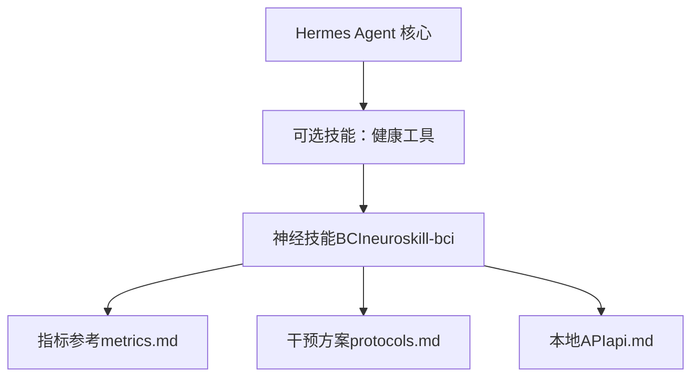
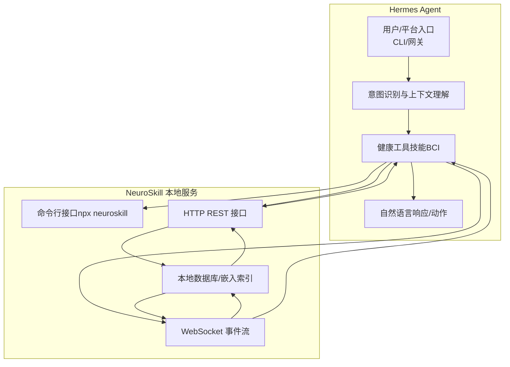
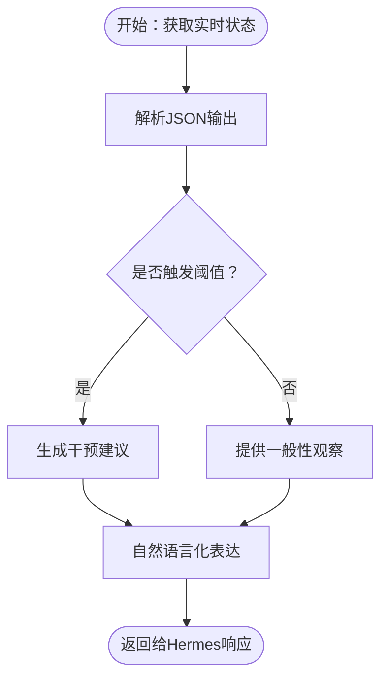
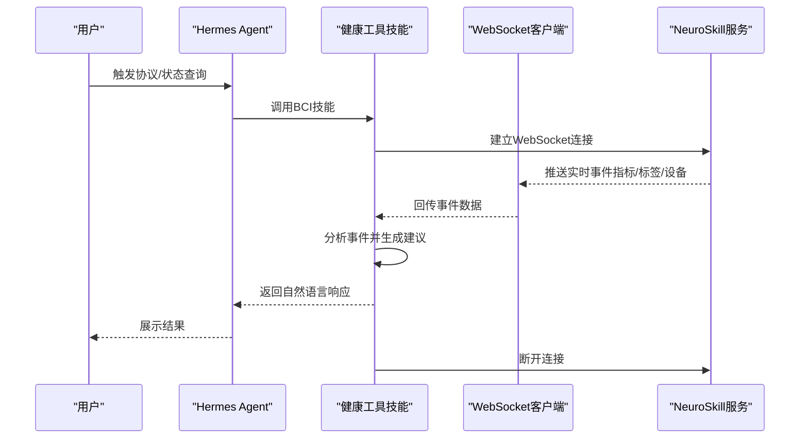
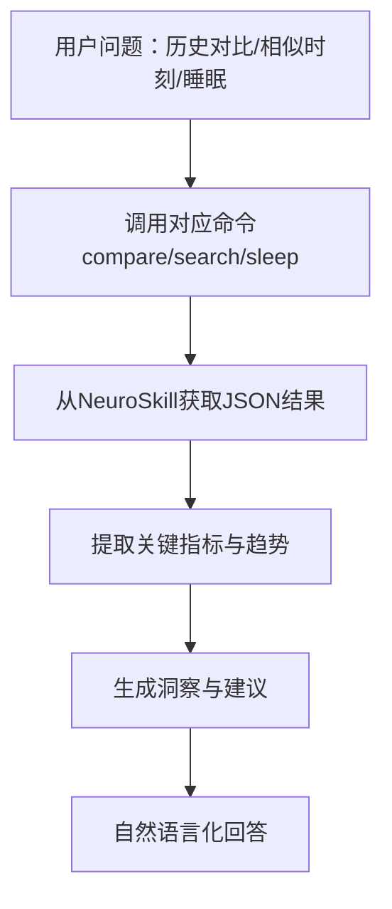
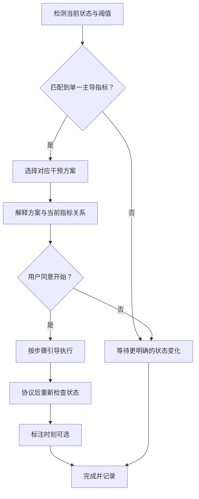
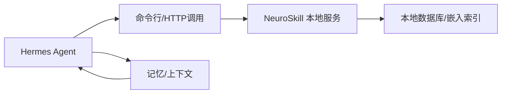

# 健康工具

<cite>
**本文引用的文件**
- [README.md](file://README.md)
- [DESCRIPTION.md](file://optional-skills/health/DESCRIPTION.md)
- [SKILL.md](file://optional-skills/health/neuroskill-bci/SKILL.md)
- [metrics.md](file://optional-skills/health/neuroskill-bci/references/metrics.md)
- [protocols.md](file://optional-skills/health/neuroskill-bci/references/protocols.md)
- [api.md](file://optional-skills/health/neuroskill-bci/references/api.md)
</cite>

## 目录
1. [简介](#简介)
2. [项目结构](#项目结构)
3. [核心组件](#核心组件)
4. [架构总览](#架构总览)
5. [详细组件分析](#详细组件分析)
6. [依赖关系分析](#依赖关系分析)
7. [性能考量](#性能考量)
8. [故障排查指南](#故障排查指南)
9. [结论](#结论)
10. [附录](#附录)

## 简介
本文件面向Hermes Agent的“健康工具”可选技能，重点围绕神经技能BCI（脑机接口）能力进行系统化说明。该技能通过本地运行的NeuroSkill桌面应用，实时读取用户的脑电与生理指标（如注意力、放松度、情绪、认知负荷、心率、HRV、睡眠分期等），并将这些状态信息融入到对话响应中，提供认知感知型的建议与干预方案。文档同时覆盖设备连接、信号处理、数据分析、实际应用场景、与核心系统的集成方式以及数据安全与性能优化要点。

## 项目结构
健康工具位于可选技能目录下，当前包含一个BCI相关技能包，其核心文件组织如下：
- 可选技能总览：optional-skills/health/DESCRIPTION.md
- BCI技能说明：optional-skills/health/neuroskill-bci/SKILL.md
- 技能参考材料：
  - 指标定义与解读：optional-skills/health/neuroskill-bci/references/metrics.md
  - 干预方案与流程：optional-skills/health/neuroskill-bci/references/protocols.md
  - 本地API与事件流：optional-skills/health/neuroskill-bci/references/api.md

图示来源
- [DESCRIPTION.md:1-2](file://optional-skills/health/DESCRIPTION.md#L1-L2)
- [SKILL.md:1-32](file://optional-skills/health/neuroskill-bci/SKILL.md#L1-L32)

章节来源
- [DESCRIPTION.md:1-2](file://optional-skills/health/DESCRIPTION.md#L1-L2)
- [SKILL.md:1-32](file://optional-skills/health/neuroskill-bci/SKILL.md#L1-L32)

## 核心组件
- BCI指标采集与解析
  - 来自NeuroSkill的实时状态快照，包含注意力、放松度、情绪、认知负荷、疲劳度、心率、信噪比、带功率谱密度、前后额α不对称、θ/α比、β/α比、θ/β比、峰值α频率、双侧脑电相干性等复合指标。
  - 输出为JSON格式，便于在Hermes中解析与自然语言化表达。
- 实时事件流
  - 支持WebSocket事件订阅，包括原始EEG样本、PPG、IMU、计算后的指标、标签、设备状态等，可用于持续监控或协议执行过程中的动态反馈。
- 历史检索与对比
  - 提供基于嵌入向量的近似最近邻相似搜索、会话对比、睡眠分期分析、标签语义检索等能力，辅助用户回顾与优化自身状态模式。
- 干预方案库
  - 针对不同状态阈值提供超过70种身心调节与专注力训练方案，涵盖呼吸调节、正念冥想、压力管理、睡眠准备、体能激活等类别，并给出步骤与时长指导。

章节来源
- [SKILL.md:94-160](file://optional-skills/health/neuroskill-bci/SKILL.md#L94-L160)
- [api.md:56-100](file://optional-skills/health/neuroskill-bci/references/api.md#L56-L100)
- [protocols.md:12-31](file://optional-skills/health/neuroskill-bci/references/protocols.md#L12-L31)

## 架构总览
下图展示了Hermes Agent与NeuroSkill之间的交互关系：Hermes通过命令行或HTTP/WebSocket调用NeuroSkill，获取实时状态与历史数据，并将其转化为自然语言建议或触发干预流程。

图示来源
- [SKILL.md:35-47](file://optional-skills/health/neuroskill-bci/SKILL.md#L35-L47)
- [api.md:23-53](file://optional-skills/health/neuroskill-bci/references/api.md#L23-L53)

## 详细组件分析

### 组件A：BCI指标采集与解释
- 数据来源
  - 设备：Muse 2/S 或 OpenBCI（4通道EEG + PPG + IMU，BLE）
  - 采样率：EEG 256 Hz，PPG 64 Hz
  - 信号质量：每电极0–1范围，建议≥0.7为可用
- 关键指标与阈值
  - 注意力（Focus）> 0.70：进入流状态；< 0.40：建议休息或启动锚定练习
  - 放松度（Relaxation）< 0.30：提示压力升高
  - 认知负荷（Cognitive Load）> 0.70：建议进行“思维卸载”
  - 疲劳度（Drowsiness）> 0.60：微睡风险预警
  - 前额α不对称（FAA）< 0：提示退缩/负面情绪倾向
  - 信噪比（SNR）< 3 dB：信号不可靠，建议重新贴合电极
- 解释策略
  - 将数值转化为自然语言描述，结合趋势与背景进行个性化建议，避免仅报告数字。

图示来源
- [SKILL.md:138-160](file://optional-skills/health/neuroskill-bci/SKILL.md#L138-L160)
- [metrics.md:51-93](file://optional-skills/health/neuroskill-bci/references/metrics.md#L51-L93)

章节来源
- [SKILL.md:94-160](file://optional-skills/health/neuroskill-bci/SKILL.md#L94-L160)
- [metrics.md:9-26](file://optional-skills/health/neuroskill-bci/references/metrics.md#L9-L26)

### 组件B：实时事件流与持续监控
- 连接方式
  - 默认通过WebSocket接收广播事件（EXG、PPG、IMU、指标、标签、设备状态）
  - 需要WebSocket连接（不支持HTTP直连）
- 典型用途
  - 协议执行过程中的动态反馈
  - 对特定状态变化（如疲劳上升、压力峰值）进行即时提醒
- 使用建议
  - 在协议开始前建立连接，结束后断开，以降低资源占用

图示来源
- [api.md:56-100](file://optional-skills/health/neuroskill-bci/references/api.md#L56-L100)
- [SKILL.md:289-300](file://optional-skills/health/neuroskill-bci/SKILL.md#L289-L300)

章节来源
- [api.md:56-100](file://optional-skills/health/neuroskill-bci/references/api.md#L56-L100)
- [SKILL.md:289-300](file://optional-skills/health/neuroskill-bci/SKILL.md#L289-L300)

### 组件C：历史检索与对比分析
- 相似时刻检索
  - 基于ZUNA嵌入向量的近似最近邻搜索，返回距离统计、时段分布与高相似日
  - 适合回答“上次类似状态是什么时候？”“我什么时候最专注？”等问题
- 会话对比
  - 提供两段会话的指标差异、趋势与洞察，帮助识别改善点与退步点
- 睡眠分析
  - 提供阶段分布、效率、入睡潜伏期等指标，结合健康目标进行解读

图示来源
- [SKILL.md:187-266](file://optional-skills/health/neuroskill-bci/SKILL.md#L187-L266)
- [api.md:180-241](file://optional-skills/health/neuroskill-bci/references/api.md#L180-L241)

章节来源
- [SKILL.md:187-266](file://optional-skills/health/neuroskill-bci/SKILL.md#L187-L266)
- [api.md:180-241](file://optional-skills/health/neuroskill-bci/references/api.md#L180-L241)

### 组件D：干预方案库与执行指导
- 方案匹配原则
  - 始终针对单一最显著的指标信号选择一种方案
  - 明确告知用户该方案与其当前状态的关系
  - 必须征得同意后方可开始，避免打断流状态
- 方案类型举例
  - 注意力与专注：Theta-Beta锚定、专注重置、工作记忆热身、创意解锁、双-N背热身、新颖刺激爆发
  - 自主神经系统与压力：方盒呼吸、延长呼气、心脏一致性、生理性叹息、开放觉察、开放观察、迷走神经振动
  - 情绪调节：FAA再平衡、慈心（Metta）、情感释放、安抚触摸、焦虑冲浪、愤怒掌压释放、比较与羡慕转化、敬畏诱发
  - 睡眠与恢复：超昼夜节律重置、清醒重置、非睡眠深度休息（NSDR）、小憩、睡前放松
  - 身体与运动：渐进式肌肉放松、接地法（5-4-3-2-1）、20-20-20护眼、颈部放松序列、运动皮层激活、思维卸载
  - 数字与生活方式：渴望冲浪、多巴胺调色板重置、数字日落
  - 饮食与作息：咖啡因时机、餐后能量崩溃应对
  - 动机与规划：WOOP（愿望-结果-障碍-计划）、任务前准备
- 执行步骤
  - 清晰报出每一步骤与计时
  - 引导用户在协议后再次检查状态，确认改善
  - 标注时刻以便后续追踪

图示来源
- [protocols.md:12-31](file://optional-skills/health/neuroskill-bci/references/protocols.md#L12-L31)
- [protocols.md:436-453](file://optional-skills/health/neuroskill-bci/references/protocols.md#L436-L453)

章节来源
- [protocols.md:12-31](file://optional-skills/health/neuroskill-bci/references/protocols.md#L12-L31)
- [protocols.md:436-453](file://optional-skills/health/neuroskill-bci/references/protocols.md#L436-L453)

## 依赖关系分析
- 外部依赖
  - Node.js 20+（用于运行npx命令与NeuroSkill CLI）
  - NeuroSkill桌面应用（本地运行，提供WebSocket/HTTP服务）
  - BCI硬件：Muse 2/S 或 OpenBCI（4通道EEG + PPG + IMU，BLE）
- 内部集成点
  - Hermes CLI/网关：通过命令行或HTTP调用NeuroSkill
  - 技能系统：作为可选技能加载，与其他工具/技能并列
  - 记忆与上下文：可将标注时刻与干预效果纳入长期记忆，形成学习闭环

图示来源
- [SKILL.md:35-47](file://optional-skills/health/neuroskill-bci/SKILL.md#L35-L47)
- [api.md:23-53](file://optional-skills/health/neuroskill-bci/references/api.md#L23-L53)

章节来源
- [SKILL.md:35-47](file://optional-skills/health/neuroskill-bci/SKILL.md#L35-L47)
- [api.md:23-53](file://optional-skills/health/neuroskill-bci/references/api.md#L23-L53)

## 性能考量
- 本地优先
  - 所有数据存储于本地（SQLite + HNSW索引），无外部传输，确保低延迟与隐私安全
- 事件流优化
  - WebSocket仅在需要时建立连接，协议结束后及时断开，减少CPU与内存占用
- 命令选择
  - 优先使用`--json`输出，便于机器解析与快速处理
- 采样与带宽
  - 了解EEG/PPG采样率与事件频率，合理设置监听时长，避免过度消费系统资源
- 缓存与复用
  - 对常用查询（如最近一次状态、标签检索）可采用短期缓存策略，提升响应速度

## 故障排查指南
常见错误与修复建议
- 症状：npx neuroskill status 无响应或卡住
  - 可能原因：NeuroSkill桌面应用未运行
  - 修复：打开NeuroSkill桌面应用
- 症状：设备状态显示为“未连接”
  - 可能原因：BCI设备未连接或电量不足
  - 修复：检查蓝牙连接与设备电量
- 症状：所有指标为0或异常
  - 可能原因：电极接触不良
  - 修复：重新调整头带贴合度，湿润电极接触点
- 症状：信号质量低于阈值（< 0.7）
  - 可能原因：电极松动或环境噪声
  - 修复：调整头带，减少头部移动，改善环境
- 症状：信噪比过低（< 3 dB）
  - 可能原因：运动伪影或干扰
  - 修复：保持静止，远离干扰源
- 症状：命令未找到（npx）
  - 可能原因：未安装Node.js 20+
  - 修复：安装Node.js 20+

章节来源
- [SKILL.md:394-404](file://optional-skills/health/neuroskill-bci/SKILL.md#L394-L404)

## 结论
健康工具（尤其是神经技能BCI）为Hermes Agent提供了强大的认知感知能力：它不仅能够读取实时脑电与生理信号，还能基于丰富的干预方案与历史分析，为用户提供个性化的专注力管理、压力调节与睡眠优化建议。通过严格的阈值判断、自然语言化表达与最小打断原则，该技能在保护用户流状态的同时，最大化提升心智表现与身心健康水平。配合本地化数据存储与事件流控制，既保证了性能也强化了隐私安全。

## 附录

### 示例场景与用法
- “我现在状态如何？”
  - 调用状态命令，解析指标并自然化描述，必要时给出简短建议
- “我无法集中注意力”
  - 检查是否存在θ占优、β偏低、TBR偏高等迹象，若确认则建议相应锚定或呼吸练习
- “对比一下今天和昨天的专注度”
  - 使用会话对比命令，提取趋势与改善/退步项，结合背景解释可能原因
- “上次进入流状态是什么时候？”
  - 使用相似时刻检索与标签语义检索，返回时间戳与当时活动
- “我昨晚睡得好吗？”
  - 使用睡眠命令，报告睡眠架构与健康目标对比，指出潜在问题
- “标记这个时刻——我刚有突破”
  - 创建标签，便于后续检索与分析

章节来源
- [SKILL.md:407-450](file://optional-skills/health/neuroskill-bci/SKILL.md#L407-L450)