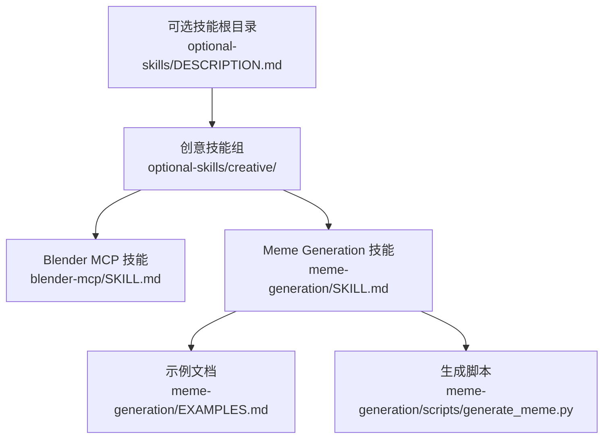
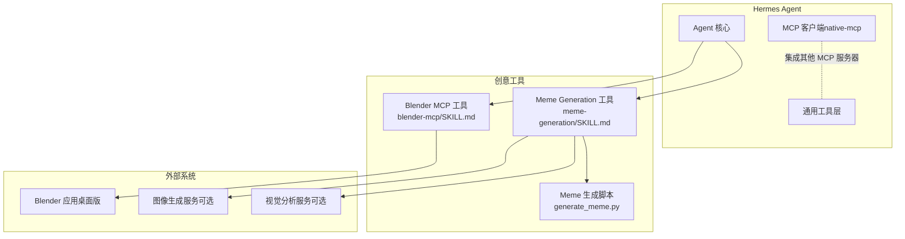
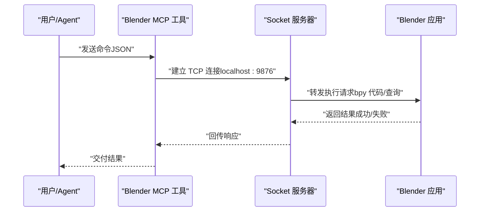
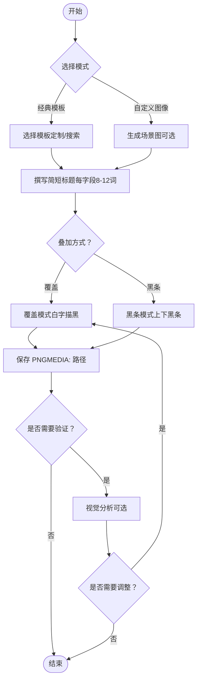
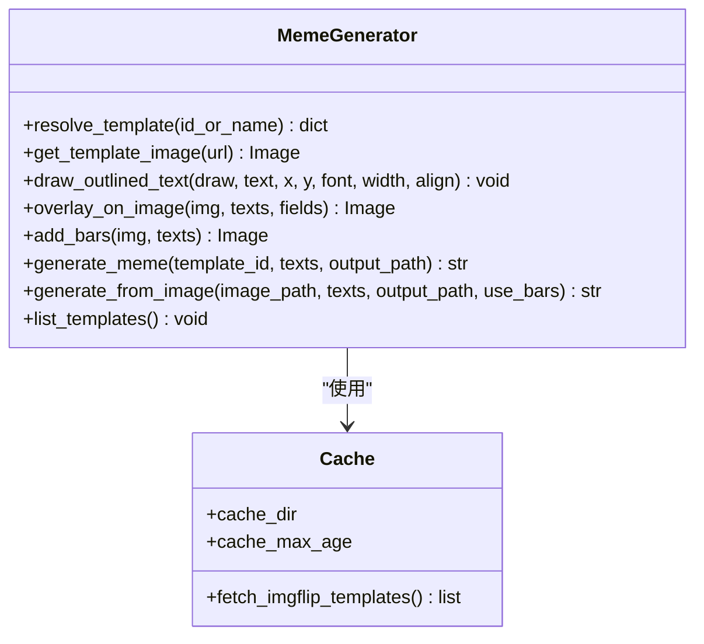
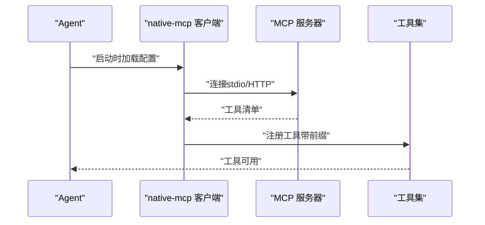
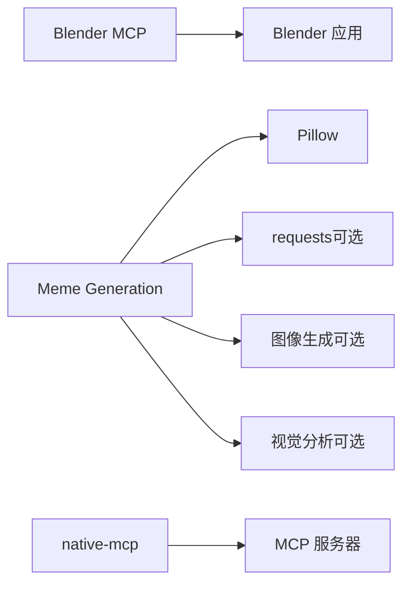

# 创意工具

<cite>
**本文引用的文件**
- [optional-skills/creative/blender-mcp/SKILL.md](file://optional-skills/creative/blender-mcp/SKILL.md)
- [optional-skills/creative/meme-generation/SKILL.md](file://optional-skills/creative/meme-generation/SKILL.md)
- [optional-skills/creative/meme-generation/EXAMPLES.md](file://optional-skills/creative/meme-generation/EXAMPLES.md)
- [optional-skills/creative/meme-generation/scripts/generate_meme.py](file://optional-skills/creative/meme-generation/scripts/generate_meme.py)
- [optional-skills/DESCRIPTION.md](file://optional-skills/DESCRIPTION.md)
- [skills/creative/DESCRIPTION.md](file://skills/creative/DESCRIPTION.md)
- [skills/mcp/native-mcp/SKILL.md](file://skills/mcp/native-mcp/SKILL.md)
- [tools/mcp_tool.py](file://tools/mcp_tool.py)
</cite>

## 目录
1. [简介](#简介)
2. [项目结构](#项目结构)
3. [核心组件](#核心组件)
4. [架构总览](#架构总览)
5. [详细组件分析](#详细组件分析)
6. [依赖关系分析](#依赖关系分析)
7. [性能考量](#性能考量)
8. [故障排查指南](#故障排查指南)
9. [结论](#结论)
10. [附录](#附录)

## 简介
本文件系统性梳理 Hermes Agent 的创意工具可选技能，重点覆盖以下能力：
- Blender MCP：通过本地桌面版 Blender 的 MCP 插件，以 Socket 协议在 Blender 中执行任意 bpy 脚本、管理场景对象、截图与渲染。
- Meme Generation：基于 Pillow 的模板与文本叠加生成真实 PNG 动漫图片；支持经典模板与自定义 AI 图像两种模式。

同时，文档说明这些工具的安装、配置与使用流程，给出实际应用场景示例，并解释与 MCP（Model Context Protocol）协议的集成方式，以及资源消耗优化与输出质量控制方法。

## 项目结构
创意工具位于 optional-skills/creative 下，分别提供独立的技能说明与脚本实现：
- Blender MCP 技能：提供安装、连接验证、协议格式、可用命令与常见 bpy 模式。
- Meme Generation 技能：提供模板列表、生成流程、示例与注意事项。
- Meme Generation 脚本：实现模板解析、缓存、文本布局、叠加与保存逻辑。

图表来源
- [optional-skills/DESCRIPTION.md:1-25](file://optional-skills/DESCRIPTION.md#L1-L25)
- [optional-skills/creative/blender-mcp/SKILL.md:1-117](file://optional-skills/creative/blender-mcp/SKILL.md#L1-L117)
- [optional-skills/creative/meme-generation/SKILL.md:1-130](file://optional-skills/creative/meme-generation/SKILL.md#L1-L130)
- [optional-skills/creative/meme-generation/EXAMPLES.md:1-47](file://optional-skills/creative/meme-generation/EXAMPLES.md#L1-L47)
- [optional-skills/creative/meme-generation/scripts/generate_meme.py:1-471](file://optional-skills/creative/meme-generation/scripts/generate_meme.py#L1-L471)

章节来源
- [optional-skills/DESCRIPTION.md:1-25](file://optional-skills/DESCRIPTION.md#L1-L25)
- [skills/creative/DESCRIPTION.md:1-4](file://skills/creative/DESCRIPTION.md#L1-L4)

## 核心组件
- Blender MCP 技能
  - 用途：从 Hermes Agent 向运行中的 Blender 实例发送 Socket 命令，执行任意 bpy 代码，查询场景信息、对象详情与视口截图。
  - 连接方式：TCP Socket（端口 9876），纯 UTF-8 JSON，无长度前缀。
  - 可用命令：执行代码、获取场景信息、获取对象信息、视口截图。
  - 使用建议：复杂场景拆分为多次调用以避免超时；渲染输出路径需为绝对路径；注意对象选择与模式要求。
- Meme Generation 技能
  - 用途：根据主题挑选模板或自定义图像，叠加文字生成真实 PNG 动漫图片。
  - 模板来源：约百种热门模板（imgflip）与 10 个定制模板（手调文本位置）。
  - 生成模式：
    - 经典模板：直接按模板字段写入短标题，输出 PNG。
    - 自定义 AI 图像：先用图像生成工具产出场景图，再叠加文字（覆盖或黑条模式）。
  - 输出交付：通过 MEDIA: 路径返回文件。

章节来源
- [optional-skills/creative/blender-mcp/SKILL.md:14-117](file://optional-skills/creative/blender-mcp/SKILL.md#L14-L117)
- [optional-skills/creative/meme-generation/SKILL.md:14-130](file://optional-skills/creative/meme-generation/SKILL.md#L14-L130)

## 架构总览
下图展示创意工具在 Hermes Agent 中的集成与交互：

图表来源
- [skills/mcp/native-mcp/SKILL.md:13-357](file://skills/mcp/native-mcp/SKILL.md#L13-L357)
- [optional-skills/creative/blender-mcp/SKILL.md:12-40](file://optional-skills/creative/blender-mcp/SKILL.md#L12-L40)
- [optional-skills/creative/meme-generation/SKILL.md:67-89](file://optional-skills/creative/meme-generation/SKILL.md#L67-L89)

## 详细组件分析

### 组件一：Blender MCP
- 功能范围
  - 执行任意 bpy 代码，创建/修改 3D 对象、材质与动画。
  - 查询场景与对象信息，获取当前视口截图。
  - 支持渲染到文件（需绝对路径）。
- 安装与配置
  - 在 Blender 中安装并启用“Interface: Blender MCP”插件。
  - 在 Blender 视口侧栏启动 Socket 服务器（默认端口 9876）。
  - 使用 nc 命令验证端口连通性。
- 使用方法
  - 通过 Socket 发送 JSON 命令，接收标准响应或错误信息。
  - 复杂任务拆分为多次调用，避免超时。
- 典型应用
  - 快速生成几何体、设置材质参数、关键帧动画与渲染导出。
- 与 MCP 的关系
  - 该技能采用 Socket 协议而非 HTTP/StreamableHTTP，不通过 native-mcp 注册为工具；但其思想与 MCP 的“远程工具发现与调用”一致。

图表来源
- [optional-skills/creative/blender-mcp/SKILL.md:33-40](file://optional-skills/creative/blender-mcp/SKILL.md#L33-L40)
- [optional-skills/creative/blender-mcp/SKILL.md:12-28](file://optional-skills/creative/blender-mcp/SKILL.md#L12-L28)

章节来源
- [optional-skills/creative/blender-mcp/SKILL.md:14-117](file://optional-skills/creative/blender-mcp/SKILL.md#L14-L117)

### 组件二：Meme Generation
- 功能范围
  - 经典模板：从定制模板库与 imgflip 模板中选择，自动布局文本，输出 PNG。
  - 自定义图像：先生成场景图，再叠加文字（覆盖或黑条模式），提升可读性。
- 安装与配置
  - 作为可选技能安装后即可使用；无需额外 MCP 服务器配置。
  - 可选依赖：图像生成与视觉分析工具用于质量验证。
- 使用方法
  - 经典模板：指定模板 ID/名称、输出路径与各字段文本。
  - 自定义图像：先生成场景图，再以 --image 模式叠加文本，必要时切换 --bars。
- 示例
  - 提供多个主题示例（调试、优先级、压力、升级方案、观点）与对应模板选择。

图表来源
- [optional-skills/creative/meme-generation/SKILL.md:50-89](file://optional-skills/creative/meme-generation/SKILL.md#L50-L89)
- [optional-skills/creative/meme-generation/EXAMPLES.md:1-47](file://optional-skills/creative/meme-generation/EXAMPLES.md#L1-L47)

章节来源
- [optional-skills/creative/meme-generation/SKILL.md:14-130](file://optional-skills/creative/meme-generation/SKILL.md#L14-L130)
- [optional-skills/creative/meme-generation/EXAMPLES.md:1-47](file://optional-skills/creative/meme-generation/EXAMPLES.md#L1-L47)

### 组件三：Meme 生成脚本（generate_meme.py）
- 数据结构与算法
  - 模板解析：加载定制模板与 imgflip 缓存，支持按名称/ID 匹配。
  - 文本布局：根据模板字段计算相对坐标与对齐方式，自动换行。
  - 图像处理：覆盖模式直接绘制，黑条模式在上下添加遮罩条并居中显示文字。
  - 缓存策略：imgflip 模板列表缓存 24 小时，首次下载模板图片后缓存至本地。
- 性能与复杂度
  - 模板匹配：字符串 slug 化与线性查找，时间复杂度 O(n)。
  - 文本换行：按宽度限制进行多行文本绘制，绘制成本与文本量与字体大小相关。
  - I/O：网络拉取模板列表与图片，本地缓存减少重复请求。
- 错误处理
  - 模板未知：提示使用 --list 或 --search。
  - 网络异常：若缓存存在则回退使用缓存数据。
  - 输出格式：自动转换 JPEG 为 RGB，保证兼容性。

图表来源
- [optional-skills/creative/meme-generation/scripts/generate_meme.py:81-106](file://optional-skills/creative/meme-generation/scripts/generate_meme.py#L81-L106)
- [optional-skills/creative/meme-generation/scripts/generate_meme.py:264-343](file://optional-skills/creative/meme-generation/scripts/generate_meme.py#L264-L343)
- [optional-skills/creative/meme-generation/scripts/generate_meme.py:345-384](file://optional-skills/creative/meme-generation/scripts/generate_meme.py#L345-L384)

章节来源
- [optional-skills/creative/meme-generation/scripts/generate_meme.py:1-471](file://optional-skills/creative/meme-generation/scripts/generate_meme.py#L1-L471)

### 组件四：MCP 协议集成（native-mcp）
- 作用
  - 将外部 MCP 服务器的工具自动发现并注册为 Hermes Agent 的原生工具，无需桥接 CLI。
- 运行机制
  - 启动时读取配置，按 stdio 或 HTTP 传输类型连接服务器，调用 list_tools 获取工具清单，按命名规范注入到所有平台工具集中。
  - 支持指数退避重连、环境变量过滤与采样（LLM 请求）能力。
- 与创意工具的关系
  - Blender MCP 不依赖 native-mcp，因其使用 Socket 协议；但 native-mcp 可用于集成其他创意类 MCP 服务器（如文件系统、图像生成 API 等）。

图表来源
- [skills/mcp/native-mcp/SKILL.md:104-144](file://skills/mcp/native-mcp/SKILL.md#L104-L144)
- [tools/mcp_tool.py:978-1046](file://tools/mcp_tool.py#L978-L1046)

章节来源
- [skills/mcp/native-mcp/SKILL.md:13-357](file://skills/mcp/native-mcp/SKILL.md#L13-L357)
- [tools/mcp_tool.py:978-1046](file://tools/mcp_tool.py#L978-L1046)

## 依赖关系分析
- Blender MCP
  - 依赖：桌面版 Blender（4.3+）、Blender MCP 插件、本地 Socket 服务。
  - 适用场景：3D 建模、材质与动画、渲染导出。
- Meme Generation
  - 依赖：Pillow、requests（可选）、可选图像生成与视觉分析工具。
  - 适用场景：快速生成高质量动图、幽默内容创作。
- MCP 集成
  - 依赖：mcp Python 包、Node.js（npx）、uv（uvx）。
  - 适用场景：统一接入第三方创意服务（文件系统、API 等）。

图表来源
- [optional-skills/creative/blender-mcp/SKILL.md:5-6](file://optional-skills/creative/blender-mcp/SKILL.md#L5-L6)
- [optional-skills/creative/meme-generation/SKILL.md:67-89](file://optional-skills/creative/meme-generation/SKILL.md#L67-L89)
- [skills/mcp/native-mcp/SKILL.md:28-40](file://skills/mcp/native-mcp/SKILL.md#L28-L40)

章节来源
- [optional-skills/creative/blender-mcp/SKILL.md:14-32](file://optional-skills/creative/blender-mcp/SKILL.md#L14-L32)
- [optional-skills/creative/meme-generation/SKILL.md:14-23](file://optional-skills/creative/meme-generation/SKILL.md#L14-L23)
- [skills/mcp/native-mcp/SKILL.md:28-40](file://skills/mcp/native-mcp/SKILL.md#L28-L40)

## 性能考量
- Blender MCP
  - 复杂场景拆分：将大任务拆分为多次 execute_code 调用，降低单次超时风险。
  - 渲染路径：确保渲染输出为绝对路径，避免相对路径导致的权限或定位问题。
  - 交互频率：合理安排视口截图与渲染次数，减少不必要的 I/O。
- Meme Generation
  - 文本长度控制：保持每字段 8-12 词以内，避免布局拥挤与渲染开销增加。
  - 模板缓存：利用本地缓存减少重复下载，提高批量生成效率。
  - 图像模式选择：在细节丰富的图像上优先使用黑条模式，减少二次处理成本。
- MCP 集成
  - 连接稳定性：合理设置 connect_timeout 与 per-tool-call timeout，避免频繁重连。
  - 环境变量过滤：仅注入必要的凭据，降低安全风险与进程开销。

## 故障排查指南
- Blender MCP
  - 无法连接：确认 Blender 插件已启用且 Socket 服务器已启动；使用端口探测命令验证 9876 是否开放。
  - 超时问题：将复杂场景拆分为多次调用；检查 Blender 运行状态与资源占用。
  - 渲染路径：确保输出为绝对路径；避免相对路径导致的权限或工作目录问题。
- Meme Generation
  - 模板未知：使用 --list 查看定制模板，或使用 --search 在 imgflip 模板中检索。
  - 文本可读性：在复杂背景上使用 --bars 模式；必要时调整 caption 内容与数量。
  - 输出校验：通过视觉分析工具检查文本清晰度与布局合理性。
- MCP 集成
  - SDK 缺失：安装 mcp Python 包；对于 HTTP 服务器，确保版本包含 HTTP 客户端支持。
  - 工具未出现：检查配置键名与缩进；查看启动日志中的连接消息；工具名以 mcp_{server}_{tool} 命名。
  - 连接不稳定：检查网络与服务器可达性；观察指数退避重连日志。

章节来源
- [optional-skills/creative/blender-mcp/SKILL.md:110-117](file://optional-skills/creative/blender-mcp/SKILL.md#L110-L117)
- [optional-skills/creative/meme-generation/SKILL.md:115-130](file://optional-skills/creative/meme-generation/SKILL.md#L115-L130)
- [skills/mcp/native-mcp/SKILL.md:204-244](file://skills/mcp/native-mcp/SKILL.md#L204-L244)

## 结论
Hermes Agent 的创意工具可选技能提供了两类互补的能力：
- 通过 Blender MCP 直接操控桌面版 Blender，适合 3D 建模、材质与动画等专业创意工作流；
- 通过 Meme Generation 快速生成高质量动漫图片，适配社交媒体与幽默内容创作。
两者均可与 MCP 生态协同，借助 native-mcp 将更多外部创意服务无缝接入 Agent 工具集，形成“本地 + 远程”的创意工具矩阵。

## 附录
- 安装与激活可选技能
  - 使用技能中心浏览与安装官方可选技能，安装后复制到用户技能目录并激活。
- 使用建议
  - Blender MCP：保持 Blender 会话常驻，合理拆分任务，关注渲染路径与资源占用。
  - Meme Generation：优先选择贴合结构的模板，控制文本长度，必要时结合图像生成与视觉分析工具进行质量把关。

章节来源
- [optional-skills/DESCRIPTION.md:8-13](file://optional-skills/DESCRIPTION.md#L8-L13)