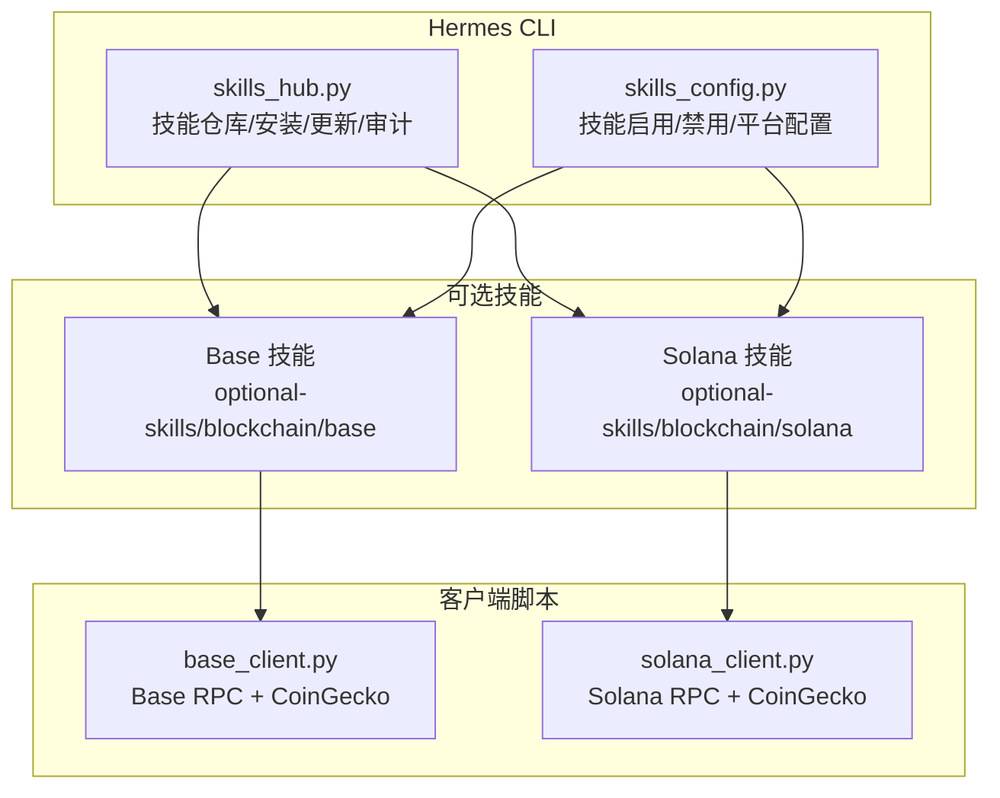
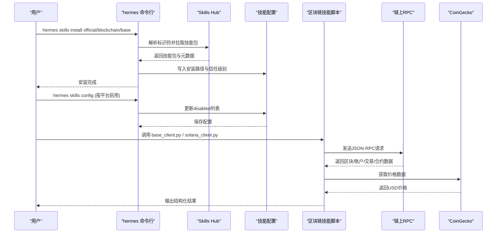
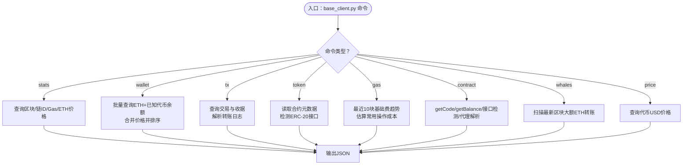
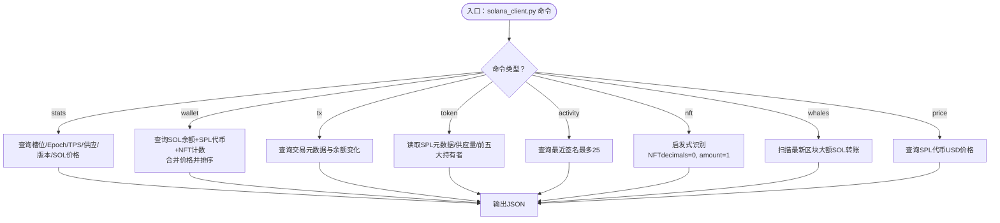
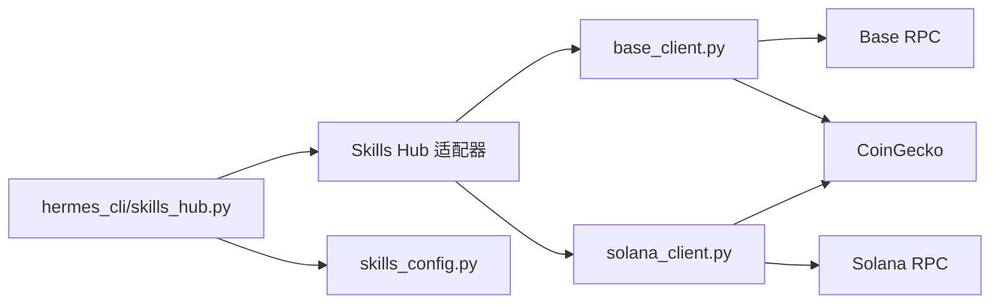

# 区块链集成

<cite>
**本文引用的文件**
- [base_client.py](file://optional-skills/blockchain/base/scripts/base_client.py)
- [solana_client.py](file://optional-skills/blockchain/solana/scripts/solana_client.py)
- [base SKILL.md](file://optional-skills/blockchain/base/SKILL.md)
- [solana SKILL.md](file://optional-skills/blockchain/solana/SKILL.md)
- [skills_config.py](file://hermes_cli/skills_config.py)
- [skills_hub.py](file://hermes_cli/skills_hub.py)
- [optional-skills catalog](file://website/docs/reference/optional-skills-catalog.md)
- [skills-catalog](file://website/docs/reference/skills-catalog.md)
</cite>

## 目录
1. [简介](#简介)
2. [项目结构](#项目结构)
3. [核心组件](#核心组件)
4. [架构总览](#架构总览)
5. [组件详解](#组件详解)
6. [依赖关系分析](#依赖关系分析)
7. [性能考量](#性能考量)
8. [故障排除指南](#故障排除指南)
9. [结论](#结论)
10. [附录](#附录)

## 简介
本文件面向Hermes Agent的区块链集成可选技能，系统性介绍Base链与Solana链的区块链技能包功能与应用场景，涵盖客户端配置与使用方法（API密钥、网络配置、交易处理）、典型交互示例（余额查询、交易详情、价格查询等）、与核心系统的集成方式以及安全注意事项，并提供部署与排障建议。

## 项目结构
- 可选技能位于 optional-skills/blockchain 下，分为 base 与 solana 两个子技能：
  - Base链：提供钱包组合、交易详情、代币信息、Gas分析、合约检查、鲸鱼检测、网络统计、价格查询等能力。
  - Solana链：提供钱包组合、交易详情、代币信息、近期活动、NFT持有、鲸鱼检测、网络统计、价格查询等能力。
- 客户端脚本均为Python标准库实现，无需额外依赖，通过环境变量控制RPC端点。
- 通过hermes_cli的skills命令进行安装、启用/禁用与管理。

图示来源
- [base_client.py](file://optional-skills/blockchain/base/scripts/base_client.py)
- [solana_client.py](file://optional-skills/blockchain/solana/scripts/solana_client.py)
- [skills_hub.py](file://hermes_cli/skills_hub.py)
- [skills_config.py](file://hermes_cli/skills_config.py)

章节来源
- [base SKILL.md](file://optional-skills/blockchain/base/SKILL.md)
- [solana SKILL.md](file://optional-skills/blockchain/solana/SKILL.md)
- [optional-skills catalog](file://website/docs/reference/optional-skills-catalog.md)
- [skills-catalog](file://website/docs/reference/skills-catalog.md)

## 核心组件
- Base区块链客户端（base_client.py）
  - 功能：钱包组合查询、交易详情、代币元数据、Gas分析、合约检查、鲸鱼检测、网络统计、价格查询。
  - 配置：BASE_RPC_URL环境变量覆盖默认Base RPC端点；默认使用CoinGecko获取价格。
  - 特性：批量RPC调用、指数回退重试、已知代币白名单优化、L2+L1费用上下文。
- Solana区块链客户端（solana_client.py）
  - 功能：钱包组合查询（含NFT）、交易详情、代币元数据、近期活动、NFT持有、鲸鱼检测、网络统计、价格查询。
  - 配置：SOLANA_RPC_URL环境变量覆盖默认Solana RPC端点；默认使用CoinGecko获取价格。
  - 特性：批量RPC调用、指数回退重试、已知代币白名单优化、NFT启发式识别。
- 技能管理（skills_hub.py / skills_config.py）
  - 安装/卸载/浏览/检查更新/审计。
  - 按平台启用/禁用技能，支持全局与平台维度配置。

章节来源
- [base_client.py](file://optional-skills/blockchain/base/scripts/base_client.py)
- [solana_client.py](file://optional-skills/blockchain/solana/scripts/solana_client.py)
- [skills_hub.py](file://hermes_cli/skills_hub.py)
- [skills_config.py](file://hermes_cli/skills_config.py)

## 架构总览
区块链技能通过CLI脚本直接访问链上RPC与CoinGecko，不依赖外部Python包，降低运行时复杂度。技能由Hermes的Skills Hub统一发现、安装与管理，用户可在不同平台启用或禁用。

图示来源
- [skills_hub.py](file://hermes_cli/skills_hub.py)
- [skills_config.py](file://hermes_cli/skills_config.py)
- [base_client.py](file://optional-skills/blockchain/base/scripts/base_client.py)
- [solana_client.py](file://optional-skills/blockchain/solana/scripts/solana_client.py)

## 组件详解

### Base区块链客户端（base_client.py）
- 关键能力
  - 钱包组合：查询ETH余额与已知ERC-20代币，按USD价值排序，支持限制数量与过滤小额资产。
  - 交易详情：解析交易哈希，返回区块号、发送方、接收方、转账金额（ETH/USD）、Gas使用、费用、状态、日志中的ERC-20/721转账。
  - 代币信息：读取名称、符号、精度、总供应量，结合代码大小与接口检测（ERC-165）。
  - Gas分析：当前Gas价格、最近10块基础费趋势、区块利用率、常见操作成本估算（L2执行费用）。
  - 合约检查：判断是否为合约、检测ERC-20/721/1155接口、解析EIP-1967代理实现地址。
  - 鲸鱼检测：扫描最新区块中大额ETH转账，输出USD价值。
  - 网络统计：最新区块、链ID、Gas价格、区块时间戳、交易数、ETH价格。
  - 价格查询：通过代币合约地址或已知符号查询USD价格。
- 配置要点
  - RPC端点：BASE_RPC_URL（默认Base主网），支持私有节点提升吞吐与稳定性。
  - 价格：CoinGecko免费API，单次请求，注意速率限制。
  - 参数：钱包命令支持limit/all/no-prices；鲸鱼检测支持阈值调整。
- 错误处理与重试
  - 对429错误采用指数回退重试；连接异常与RPC错误会终止并提示。
- 数据流示意

图示来源
- [base_client.py](file://optional-skills/blockchain/base/scripts/base_client.py)

章节来源
- [base_client.py](file://optional-skills/blockchain/base/scripts/base_client.py)
- [base SKILL.md](file://optional-skills/blockchain/base/SKILL.md)

### Solana区块链客户端（solana_client.py）
- 关键能力
  - 钱包组合：查询SOL余额与SPL代币，区分NFT（启发式：decimals=0且amount=1），按USD价值排序，支持限制数量与过滤小额资产。
  - 交易详情：解析签名，返回槽位、时间、费用、状态、余额变化（SOL/USD）、调用的程序。
  - 代币信息：读取SPL代币元数据、供应量、前五大持有者、冻结/授权权限、USD价格与市值。
  - 近期活动：列出地址最近若干笔签名（最大25）。
  - NFT持有：基于启发式规则识别NFT。
  - 鲸鱼检测：扫描最新区块中大额SOL转账，输出USD价值。
  - 网络统计：当前槽位、Epoch、TPS、总/流通供应、验证器版本、SOL价格与市值。
  - 价格查询：通过铸币地址或已知符号查询USD价格。
- 配置要点
  - RPC端点：SOLANA_RPC_URL（默认主网公共端点），建议使用私有节点。
  - 价格：CoinGecko免费API，注意速率限制。
  - 参数：钱包命令支持limit/all/no-prices；鲸鱼检测支持阈值调整。
- 错误处理与重试
  - 对429错误采用指数回退重试；连接异常与RPC错误会终止并提示。
- 数据流示意

图示来源
- [solana_client.py](file://optional-skills/blockchain/solana/scripts/solana_client.py)

章节来源
- [solana_client.py](file://optional-skills/blockchain/solana/scripts/solana_client.py)
- [solana SKILL.md](file://optional-skills/blockchain/solana/SKILL.md)

### 与核心系统的集成与安全
- 技能发现与安装
  - 通过hermes skills命令从官方源安装/卸载/浏览/检查更新/审计技能。
  - 官方技能默认不激活，需显式安装后在平台侧启用。
- 平台级启用/禁用
  - 支持全局与各平台（CLI/Telegram/Discord/Slack/WhatsApp/Signal/Email/HomeAssistant/Mattermost/Matrix/DingTalk/Feishu/WeCom/Webhook）分别配置禁用列表。
- 安全扫描
  - 安装前进行沙箱扫描与风险评估，阻止高危技能；支持重新审计与更新。
- 隐私与合规
  - 技能仅在用户明确启用后生效；可通过平台维度关闭特定技能，避免在敏感渠道暴露。

章节来源
- [skills_hub.py](file://hermes_cli/skills_hub.py)
- [skills_config.py](file://hermes_cli/skills_config.py)
- [optional-skills catalog](file://website/docs/reference/optional-skills-catalog.md)
- [skills-catalog](file://website/docs/reference/skills-catalog.md)

## 依赖关系分析
- 外部依赖
  - Python标准库（urllib/json/argparse/os/sys/time等），无第三方包。
  - 链上RPC：Base主网或自定义节点；Solana主网或自定义节点。
  - CoinGecko：免费公开API，无密钥要求，存在速率限制。
- 内部耦合
  - 技能脚本与Hermes CLI解耦，通过文件系统与环境变量交互。
  - 技能脚本之间无直接依赖，各自独立运行。
- 潜在环路
  - 无循环依赖；CLI负责安装与配置，脚本负责具体查询。

图示来源
- [skills_hub.py](file://hermes_cli/skills_hub.py)
- [skills_config.py](file://hermes_cli/skills_config.py)
- [base_client.py](file://optional-skills/blockchain/base/scripts/base_client.py)
- [solana_client.py](file://optional-skills/blockchain/solana/scripts/solana_client.py)

章节来源
- [base_client.py](file://optional-skills/blockchain/base/scripts/base_client.py)
- [solana_client.py](file://optional-skills/blockchain/solana/scripts/solana_client.py)
- [skills_hub.py](file://hermes_cli/skills_hub.py)
- [skills_config.py](file://hermes_cli/skills_config.py)

## 性能考量
- RPC批处理
  - Base：限制每批最多10个请求，自动分片发送，减少超限风险。
  - Solana：批量RPC请求，指数回退重试，避免公共节点限流。
- 价格查询
  - Base：对已知代币集合进行价格查询，限制请求数量以遵守免费速率限制。
  - Solana：优先查询已知代币，未知代币按上限采样，避免触发速率限制。
- 计算与排序
  - 钱包组合查询对资产按USD价值排序，必要时限制显示数量，降低输出体积。
- 网络与延迟
  - 建议使用私有RPC节点以获得更高吞吐与更低延迟；在公网节点上注意429重试策略。

[本节为通用指导，不直接分析具体文件]

## 故障排除指南
- RPC 429限流
  - 现象：请求被拒绝或返回429。
  - 处理：使用私有RPC节点；等待指数回退后重试；减少并发请求。
- CoinGecko 429限流
  - 现象：价格查询失败或返回空值。
  - 处理：使用--no-prices跳过价格查询；降低查询频率；关注免费速率限制。
- 公共RPC历史限制
  - 现象：Solana查询过旧交易时返回空。
  - 处理：仅查询近期交易；使用私有节点扩展历史范围。
- NFT识别不准确
  - 现象：压缩NFT（cNFT）或Token-2022 NFT未被识别。
  - 处理：依赖启发式规则，无法覆盖所有变体；建议结合其他工具核验。
- 合约代理检测局限
  - 现象：仅检测EIP-1967代理，其他代理模式未覆盖。
  - 处理：作为辅助信息，不可完全依赖；建议结合链上浏览器进一步确认。
- 环境变量未生效
  - 现象：仍使用默认RPC端点。
  - 处理：确认BASE_RPC_URL或SOLANA_RPC_URL已正确导出并在当前会话可见。

章节来源
- [base_client.py](file://optional-skills/blockchain/base/scripts/base_client.py)
- [solana_client.py](file://optional-skills/blockchain/solana/scripts/solana_client.py)
- [base SKILL.md](file://optional-skills/blockchain/base/SKILL.md)
- [solana SKILL.md](file://optional-skills/blockchain/solana/SKILL.md)

## 结论
Hermes Agent的区块链技能通过轻量化的Python脚本与标准化的CLI接口，实现了对Base与Solana链的丰富查询能力。借助Skills Hub与平台级配置，用户可以灵活地安装、启用与管理这些技能，同时通过私有RPC与合理的参数设置保障性能与稳定性。在遵循安全扫描与速率限制的前提下，这些技能能够高效满足钱包查询、交易分析、价格跟踪与网络监控等常见需求。

[本节为总结性内容，不直接分析具体文件]

## 附录

### 快速参考：安装与启用
- 安装
  - hermes skills install official/blockchain/base
  - hermes skills install official/blockchain/solana
- 启用/禁用
  - hermes skills（选择平台/分类/单项切换）
- 浏览与检查
  - hermes skills browse
  - hermes skills check
  - hermes skills audit

章节来源
- [optional-skills catalog](file://website/docs/reference/optional-skills-catalog.md)
- [skills-catalog](file://website/docs/reference/skills-catalog.md)
- [skills_hub.py](file://hermes_cli/skills_hub.py)
- [skills_config.py](file://hermes_cli/skills_config.py)

### 环境变量与默认端点
- Base链
  - BASE_RPC_URL，默认值见技能说明与脚本内注释。
- Solana链
  - SOLANA_RPC_URL，默认值见技能说明与脚本内注释。

章节来源
- [base SKILL.md](file://optional-skills/blockchain/base/SKILL.md)
- [solana SKILL.md](file://optional-skills/blockchain/solana/SKILL.md)
- [base_client.py](file://optional-skills/blockchain/base/scripts/base_client.py)
- [solana_client.py](file://optional-skills/blockchain/solana/scripts/solana_client.py)