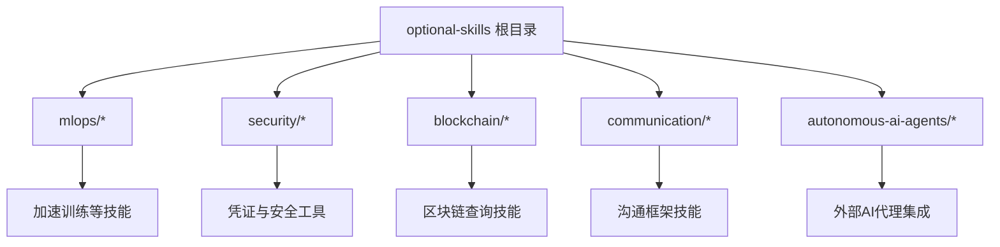
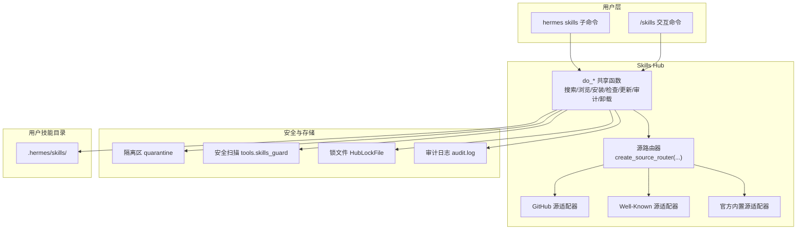
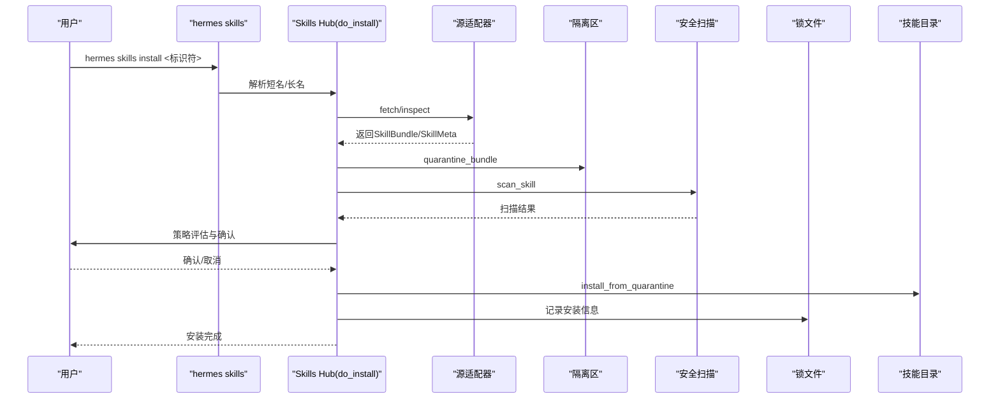
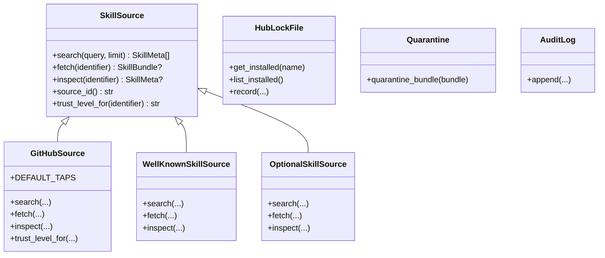

# 可选技能

<cite>
**本文引用的文件**
- [optional-skills/DESCRIPTION.md](file://optional-skills/DESCRIPTION.md)
- [optional-skills/autonomous-ai-agents/DESCRIPTION.md](file://optional-skills/autonomous-ai-agents/DESCRIPTION.md)
- [optional-skills/security/DESCRIPTION.md](file://optional-skills/security/DESCRIPTION.md)
- [optional-skills/communication/DESCRIPTION.md](file://optional-skills/communication/DESCRIPTION.md)
- [optional-skills/mlops/accelerate/SKILL.md](file://optional-skills/mlops/accelerate/SKILL.md)
- [optional-skills/security/1password/SKILL.md](file://optional-skills/security/1password/SKILL.md)
- [optional-skills/blockchain/base/SKILL.md](file://optional-skills/blockchain/base/SKILL.md)
- [hermes_cli/skills_hub.py](file://hermes_cli/skills_hub.py)
- [hermes_cli/skills_config.py](file://hermes_cli/skills_config.py)
- [tools/skills_hub.py](file://tools/skills_hub.py)
</cite>

## 目录
1. [简介](#简介)
2. [项目结构](#项目结构)
3. [核心组件](#核心组件)
4. [架构总览](#架构总览)
5. [详细组件分析](#详细组件分析)
6. [依赖分析](#依赖分析)
7. [性能考虑](#性能考虑)
8. [故障排除指南](#故障排除指南)
9. [结论](#结论)
10. [附录](#附录)

## 简介
本文件系统性阐述 Hermes Agent 的“可选技能”（Optional Skills）体系：概念、优势、安装与配置、管理流程、典型技能类别与能力、与核心系统的兼容性、更新维护与故障排除。可选技能是官方仓库自带但默认不激活的功能包集合，通过 Skills Hub 提供统一的发现、安装、安全扫描、更新与卸载能力；用户可通过命令行或交互界面按需启用，实现功能扩展、模块化与社区贡献的协同。

## 项目结构
可选技能位于 optional-skills 目录下，按功能域分组（如 mlops、security、blockchain、communication 等），每个子目录通常包含一个 SKILL.md 描述文件与相关脚本/资源。这些技能在安装后被复制到用户家目录下的 ~/.hermes/skills/ 中，并由 Skills Hub 统一管理。

图示来源
- [optional-skills/DESCRIPTION.md](file://optional-skills/DESCRIPTION.md)
- [optional-skills/mlops/accelerate/SKILL.md](file://optional-skills/mlops/accelerate/SKILL.md)
- [optional-skills/security/1password/SKILL.md](file://optional-skills/security/1password/SKILL.md)
- [optional-skills/blockchain/base/SKILL.md](file://optional-skills/blockchain/base/SKILL.md)

章节来源
- [optional-skills/DESCRIPTION.md](file://optional-skills/DESCRIPTION.md)
- [optional-skills/autonomous-ai-agents/DESCRIPTION.md](file://optional-skills/autonomous-ai-agents/DESCRIPTION.md)
- [optional-skills/security/DESCRIPTION.md](file://optional-skills/security/DESCRIPTION.md)
- [optional-skills/communication/DESCRIPTION.md](file://optional-skills/communication/DESCRIPTION.md)

## 核心组件
- Skills Hub 命令行与交互接口：提供搜索、浏览、安装、检查更新、审计、卸载、发布等能力，支持多源（官方、GitHub、Well-Known 等）。
- 技能元数据与包模型：统一的 SkillMeta/SkillBundle 数据结构，确保跨源一致的展示与安装流程。
- 安全扫描与策略：安装前隔离区（quarantine）、自动化扫描与信任策略，支持用户确认与审计日志。
- 配置与平台开关：按平台（CLI、Telegram、Discord 等）禁用/启用技能，支持全局与平台级覆盖。
- 可选技能生态：官方 optional-skills 目录中的各类技能，涵盖 MLOps 工具链、安全工具集、区块链集成、通信框架等。

章节来源
- [hermes_cli/skills_hub.py](file://hermes_cli/skills_hub.py)
- [hermes_cli/skills_config.py](file://hermes_cli/skills_config.py)
- [tools/skills_hub.py](file://tools/skills_hub.py)

## 架构总览
可选技能系统围绕 Skills Hub 展开：CLI/Slash 命令调用共享逻辑，路由到多源适配器（GitHub、Well-Known、官方内置等），经由安全扫描与安装流程落地到用户技能目录，最终由核心 Agent 在会话中按配置启用。

图示来源
- [hermes_cli/skills_hub.py](file://hermes_cli/skills_hub.py)
- [tools/skills_hub.py](file://tools/skills_hub.py)

## 详细组件分析

### 可选技能概念与优势
- 功能扩展：将非通用、实验性或重型依赖封装为独立技能，按需启用，避免默认安装负担。
- 模块化设计：每个技能自包含描述与实现，便于独立开发、测试与迭代。
- 社区贡献：通过 Skills Hub 支持第三方源，鼓励社区共建与分享。

章节来源
- [optional-skills/DESCRIPTION.md](file://optional-skills/DESCRIPTION.md)

### 安装、配置与管理流程
- 浏览与搜索：通过 hermes skills browse/search 发现官方与第三方技能，支持分页与信任等级排序。
- 安装：fetch → quarantine → scan → 策略评估 → 用户确认 → install，安装后自动刷新提示词缓存。
- 更新与检查：支持检查更新与批量更新，更新流程复用安装路径。
- 卸载：删除文件并更新锁文件，必要时刷新缓存。
- 审计：对已安装技能重新扫描，输出报告。
- 平台配置：按平台禁用/启用技能，支持全局与平台级覆盖。

图示来源
- [hermes_cli/skills_hub.py](file://hermes_cli/skills_hub.py)
- [tools/skills_hub.py](file://tools/skills_hub.py)

章节来源
- [hermes_cli/skills_hub.py](file://hermes_cli/skills_hub.py)
- [hermes_cli/skills_config.py](file://hermes_cli/skills_config.py)
- [tools/skills_hub.py](file://tools/skills_hub.py)

### 典型技能类别与能力

#### MLOps 工具链
- 示例：HuggingFace Accelerate 技能
  - 能力：统一分布式训练 API，支持 DDP/DeepSpeed/FSDP/Megatron，混合精度与自动设备放置，交互式配置与单命令启动。
  - 使用场景：从单 GPU 快速扩展到多 GPU/多节点，快速原型与 HuggingFace 生态集成。
  - 依赖：accelerate、torch、transformers 等。
- 兼容性：与核心 Agent 的工具注册机制无缝对接，安装后即可在会话中使用。

章节来源
- [optional-skills/mlops/accelerate/SKILL.md](file://optional-skills/mlops/accelerate/SKILL.md)

#### 安全工具集
- 示例：1Password 技能
  - 能力：设置与使用 1Password CLI（op），支持服务账号令牌、桌面应用集成、Connect 服务器，tmux 会话内稳定认证，注入与运行带密文的命令。
  - 使用场景：以安全方式管理密钥，避免明文环境变量或文件，适合 CI/本地终端。
  - 依赖：1Password CLI、tmux（桌面集成模式）。
- 兼容性：与核心 Agent 的终端执行与安全守卫机制配合，避免泄露敏感信息。

章节来源
- [optional-skills/security/1password/SKILL.md](file://optional-skills/security/1password/SKILL.md)

#### 区块链集成
- 示例：Base（以太坊 L2）区块链技能
  - 能力：查询钱包组合、交易详情、代币信息、Gas 分析、合约检查、鲸鱼检测、网络状态与价格查询；无需 API Key，使用 Base RPC + CoinGecko。
  - 使用场景：链上数据分析、DeFi 与 L2 交互、实时网络洞察。
  - 依赖：Python 标准库（urllib/json/argparse）。
- 兼容性：通过标准库脚本与核心 Agent 的终端工具协作，安装后直接可用。

章节来源
- [optional-skills/blockchain/base/SKILL.md](file://optional-skills/blockchain/base/SKILL.md)

#### 通信与决策框架
- 能力：结构化响应格式，支持提案、权衡分析与面向利益相关者的推荐。
- 适用场景：需要规范化输出与可追溯的沟通流程。

章节来源
- [optional-skills/communication/DESCRIPTION.md](file://optional-skills/communication/DESCRIPTION.md)

#### 自主智能体集成
- 能力：集成外部编码代理 CLI，委托独立编码任务。
- 适用场景：提升代码生成与任务分解效率。

章节来源
- [optional-skills/autonomous-ai-agents/DESCRIPTION.md](file://optional-skills/autonomous-ai-agents/DESCRIPTION.md)

### 使用指南与集成方法
- 安装与启用
  - 浏览与搜索：hermes skills browse / hermes skills search <关键词>
  - 安装：hermes skills install <标识符>，安装后技能出现在 ~/.hermes/skills/<分类>/<技能名>/ 下
  - 刷新提示词缓存：安装后自动刷新；也可通过 /reset 或 --now 参数立即生效
- 平台级控制
  - hermes skills：交互式勾选启用/禁用技能或按类别切换
  - 配置文件：skills.disabled 与 platform_disabled 支持全局与平台级覆盖
- 更新与审计
  - hermes skills check：检查已安装技能的上游更新
  - hermes skills update：批量更新
  - hermes skills audit：对已安装技能重新扫描
- 卸载
  - hermes skills uninstall <名称>：删除并更新锁文件

章节来源
- [hermes_cli/skills_hub.py](file://hermes_cli/skills_hub.py)
- [hermes_cli/skills_config.py](file://hermes_cli/skills_config.py)

### 与核心系统的兼容性与依赖关系
- 目录布局：技能安装到 ~/.hermes/skills/<分类>/<技能名>/，遵循统一命名与路径校验，防止路径穿越
- 安全前置：安装前隔离、扫描与策略评估，确保可信度与安全性
- 集成点：技能通过标准文件（如 SKILL.md）声明元数据与标签，核心 Agent 在会话构建时按配置启用
- 平台适配：skills_config 支持按平台禁用/启用，避免在特定通道（如 Telegram、CLI）暴露不合适的技能

章节来源
- [tools/skills_hub.py](file://tools/skills_hub.py)
- [hermes_cli/skills_config.py](file://hermes_cli/skills_config.py)

## 依赖分析
- 源适配器
  - GitHubSource：基于 Contents API 与 Git Trees API，支持缓存索引、信任等级判定
  - WellKnownSkillSource：基于域名下的 well-known 索引，支持多文件下载
  - OptionalSkillSource：官方内置技能源，优先展示与自动分类
- 安全与锁文件
  - Quarantine：隔离下载包，避免直接写入技能目录
  - HubLockFile：记录已安装技能来源、信任级别与安装路径
  - Audit Log：记录安装/扫描/卸载事件，便于审计
- 配置与平台
  - skills_config：提供按平台禁用/启用技能的配置入口与交互式选择

图示来源
- [tools/skills_hub.py](file://tools/skills_hub.py)

章节来源
- [tools/skills_hub.py](file://tools/skills_hub.py)

## 性能考虑
- 搜索与索引
  - GitHub Trees API 一次性拉取整棵树，避免逐目录请求导致的速率限制与遗漏
  - well-known 源支持索引缓存（TTL），减少重复请求
- 安装流程
  - 隔离区与扫描前置，避免错误包污染技能目录
  - 批量更新与检查仅针对已安装技能，降低开销
- 平台级控制
  - 按平台禁用技能减少不必要的工具加载与提示词计算

## 故障排除指南
- 安装被阻止
  - 若扫描结果为高风险或策略拒绝，安装会被阻止；查看审计日志了解原因并根据提示调整
- 路径不安全
  - 安装前对路径进行严格校验，若包含 “..” 或绝对路径将被拒绝；请使用规范的技能标识符
- 权限与认证
  - GitHub 源需要有效凭据（GITHUB_TOKEN/gh CLI/GitHub App），无凭据时仅能访问公开仓库且受限于速率
- 更新失败
  - 检查网络与源可达性；必要时使用 hermes skills check 查看更新状态
- 卸载后残留
  - 确认锁文件记录与实际目录一致性；必要时手动清理或重新安装覆盖

章节来源
- [hermes_cli/skills_hub.py](file://hermes_cli/skills_hub.py)
- [tools/skills_hub.py](file://tools/skills_hub.py)

## 结论
可选技能系统通过标准化的发现、安装、安全与管理流程，为 Hermes Agent 提供了灵活、可扩展且安全的功能扩展能力。官方 optional-skills 目录覆盖 MLOps、安全、区块链、通信等多个前沿领域，结合平台级配置与更新机制，既能满足专业需求，又保持默认安装的轻量化与稳定性。

## 附录
- 常用命令速查
  - hermes skills browse / search / inspect
  - hermes skills install / update / check / audit / uninstall
  - hermes skills（交互式启用/禁用）
  - hermes skills tap（自定义源管理）