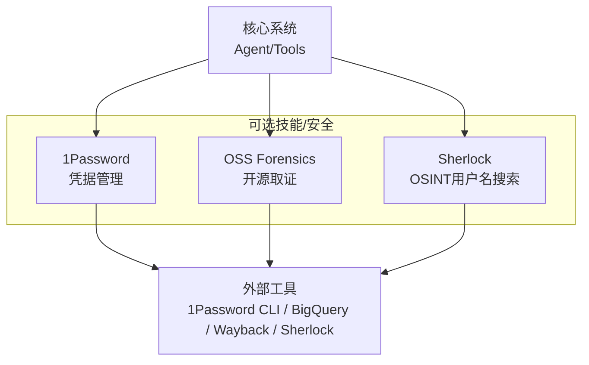
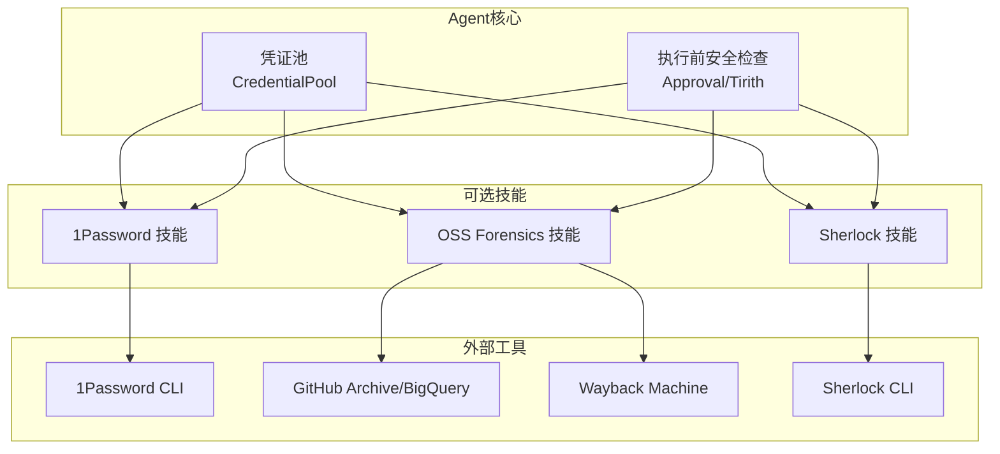
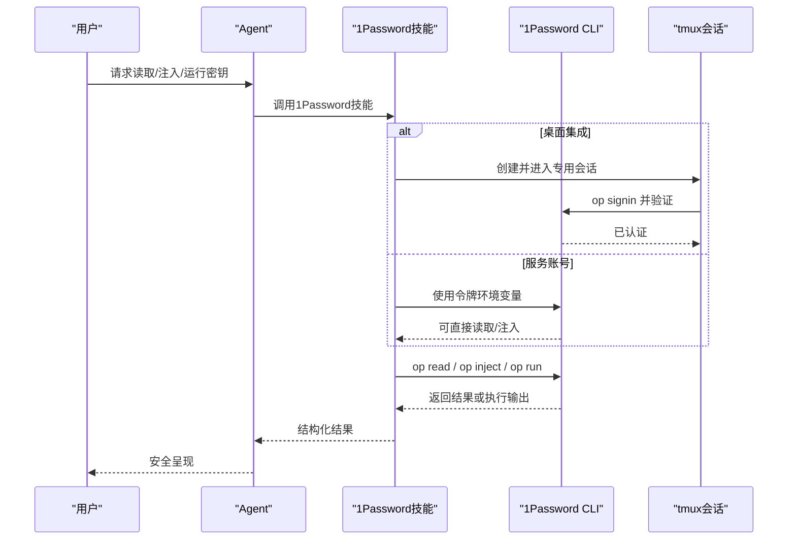
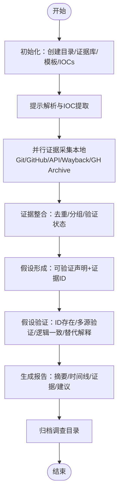
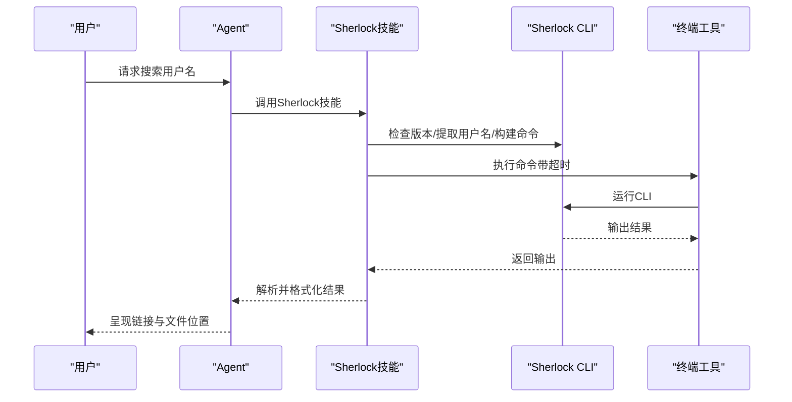
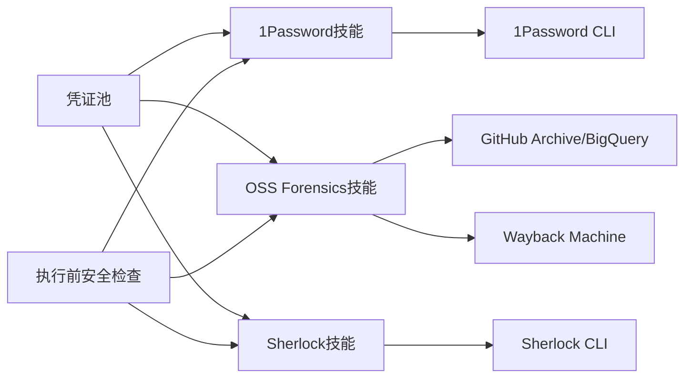

# 安全工具

<cite>
**本文引用的文件**
- [optional-skills/security/DESCRIPTION.md](file://optional-skills/security/DESCRIPTION.md)
- [optional-skills/security/1password/SKILL.md](file://optional-skills/security/1password/SKILL.md)
- [optional-skills/security/1password/references/get-started.md](file://optional-skills/security/1password/references/get-started.md)
- [optional-skills/security/oss-forensics/SKILL.md](file://optional-skills/security/oss-forensics/SKILL.md)
- [optional-skills/security/oss-forensics/scripts/evidence-store.py](file://optional-skills/security/oss-forensics/scripts/evidence-store.py)
- [optional-skills/security/sherlock/SKILL.md](file://optional-skills/security/sherlock/SKILL.md)
- [agent/credential_pool.py](file://agent/credential_pool.py)
- [tools/approval.py](file://tools/approval.py)
- [tests/tools/test_command_guards.py](file://tests/tools/test_command_guards.py)
</cite>

## 目录
1. [简介](#简介)
2. [项目结构](#项目结构)
3. [核心组件](#核心组件)
4. [架构总览](#架构总览)
5. [详细组件分析](#详细组件分析)
6. [依赖关系分析](#依赖关系分析)
7. [性能考量](#性能考量)
8. [故障排查指南](#故障排查指南)
9. [结论](#结论)
10. [附录](#附录)

## 简介
本文件面向Hermes Agent的安全工具可选技能，系统化梳理三类能力：1Password凭据管理、开源取证（OSS Forensics）与Sherlock OSINT用户名调查。文档覆盖功能定位、适用场景、配置与使用流程、与核心系统的集成点、安全与合规要点以及风险评估方法，帮助用户在保障安全的前提下高效开展凭证管理、证据收集与调查分析。

## 项目结构
安全工具位于可选技能目录 optional-skills/security 下，按功能划分为三个子技能：
- 1Password 凭据管理：通过 1Password CLI 进行安装、认证、读取与注入等操作，支持服务账号与桌面应用集成两种模式。
- OSS Forensics 开源取证：围绕GitHub仓库的供应链攻击调查，提供七阶段多智能体调查框架，涵盖本地Git分析、GitHub API、Wayback Machine、GH Archive/BigQuery与IOC丰富化。
- Sherlock OSINT：跨400+社交平台的用户名搜索，用于OSINT与侦察研究。

图示来源
- [optional-skills/security/DESCRIPTION.md:1-4](file://optional-skills/security/DESCRIPTION.md#L1-L4)
- [optional-skills/security/1password/SKILL.md:1-163](file://optional-skills/security/1password/SKILL.md#L1-L163)
- [optional-skills/security/oss-forensics/SKILL.md:1-423](file://optional-skills/security/oss-forensics/SKILL.md#L1-L423)
- [optional-skills/security/sherlock/SKILL.md:1-192](file://optional-skills/security/sherlock/SKILL.md#L1-L192)

章节来源
- [optional-skills/security/DESCRIPTION.md:1-4](file://optional-skills/security/DESCRIPTION.md#L1-L4)

## 核心组件
- 1Password 技能：提供CLI安装、认证（服务账号/桌面集成/Connect）、读取、注入与运行命令等能力；强调非交互环境下的服务账号优先策略与tmux会话中的桌面集成注意事项。
- OSS Forensics 技能：定义七阶段调查流程，包含提示解析、并行证据采集（本地Git、GitHub API、Wayback Machine、GH Archive/BigQuery、IOC丰富化）、证据整合、假设形成与验证、报告生成与归档。
- Sherlock 技能：基于Sherlock项目进行用户名跨平台检索，支持默认与可选参数（NSFW、Tor），并给出安装与伦理使用建议。
- 凭证池（CredentialPool）：为Agent提供多凭据轮换与失效冷却机制，支撑安全调用外部API或工具时的凭据管理与策略控制。
- 执行前安全检查（Approval/Tirith）：在命令执行前进行统一的安全扫描与危险命令检测，结合审批流程降低误操作与高危行为风险。

章节来源
- [optional-skills/security/1password/SKILL.md:1-163](file://optional-skills/security/1password/SKILL.md#L1-L163)
- [optional-skills/security/oss-forensics/SKILL.md:1-423](file://optional-skills/security/oss-forensics/SKILL.md#L1-L423)
- [optional-skills/security/sherlock/SKILL.md:1-192](file://optional-skills/security/sherlock/SKILL.md#L1-L192)
- [agent/credential_pool.py:352-911](file://agent/credential_pool.py#L352-L911)
- [tools/approval.py:614-673](file://tools/approval.py#L614-L673)

## 架构总览
下图展示安全工具与核心系统的交互关系：Agent通过技能调用外部工具（1Password CLI、BigQuery、Wayback Machine、Sherlock），同时借助凭证池与执行前安全检查确保调用过程的安全与可控。

图示来源
- [agent/credential_pool.py:352-911](file://agent/credential_pool.py#L352-L911)
- [tools/approval.py:614-673](file://tools/approval.py#L614-L673)
- [optional-skills/security/1password/SKILL.md:1-163](file://optional-skills/security/1password/SKILL.md#L1-L163)
- [optional-skills/security/oss-forensics/SKILL.md:1-423](file://optional-skills/security/oss-forensics/SKILL.md#L1-L423)
- [optional-skills/security/sherlock/SKILL.md:1-192](file://optional-skills/security/sherlock/SKILL.md#L1-L192)

## 详细组件分析

### 1Password 凭据管理
- 功能与场景
  - 在终端中以非交互方式读取/注入/运行命令所需的密钥，避免明文环境变量或文件。
  - 支持服务账号（推荐于自动化/非交互环境）、桌面应用集成（交互式）与Connect自托管三种认证方式。
- 配置与使用
  - 安装与验证：按平台安装1Password CLI并校验版本。
  - 认证方式选择：服务账号需设置令牌环境变量；桌面集成需启用应用内集成并解锁后完成签入；Connect需配置主机与令牌。
  - 桌面集成在非交互终端中建议使用专用tmux会话维持认证上下文。
  - 常见操作：读取密钥引用、提取模板中的占位符、以op run注入环境变量后执行命令。
- 安全与合规
  - 不向用户直接打印原始密钥；优先使用op run/op inject避免落盘。
  - 非交互环境优先使用服务账号；如遇“未登录”错误，需在同一tmux会话中重新签入。
- 风险评估
  - 桌面集成在CI/无头环境不可用时，应切换到服务账号。
  - 使用服务账号需满足CLI版本要求。

图示来源
- [optional-skills/security/1password/SKILL.md:87-116](file://optional-skills/security/1password/SKILL.md#L87-L116)
- [optional-skills/security/1password/SKILL.md:118-163](file://optional-skills/security/1password/SKILL.md#L118-L163)

章节来源
- [optional-skills/security/1password/SKILL.md:1-163](file://optional-skills/security/1password/SKILL.md#L1-L163)
- [optional-skills/security/1password/references/get-started.md:1-22](file://optional-skills/security/1password/references/get-started.md#L1-L22)

### OSS Forensics 开源取证
- 功能与场景
  - 针对GitHub仓库的供应链攻击调查，支持删除提交恢复、强制推送检测、IOC提取、多源证据采集、假设形成与验证、结构化报告生成。
- 七阶段流程
  - 初始化：创建工作目录、证据库、报告模板、IOCs清单并记录起始时间与目标。
  - 提示解析与IOC提取：从用户请求中抽取目标仓库、目标人员、时间窗口、已知IOC与外部报告链接。
  - 并行证据采集：最多5个子智能体并行工作，分别负责本地Git、GitHub API、Wayback Machine、GH Archive/BigQuery与IOC丰富化，严格单一数据源原则。
  - 证据整合：校验内容哈希、按时间线/人员/IOC分组、识别差异项、标注验证状态。
  - 假设形成：提出可验证的假设，要求至少两条证据ID并明确反证路径。
  - 假设验证：机械核验证据ID存在性、验证状态、逻辑一致性与替代解释。
  - 报告生成与归档：填充模板，包含摘要、时间线、验证假设、证据清单、链式保真、建议与整改。
- 安全与合规
  - 反幻觉护栏：事实与假设分离、证据ID强制引用、SHA/URL双重验证、禁止运行可疑代码、密钥红化。
  - 速率限制：合理使用认证令牌、条件请求、分页顺序拉取、监控剩余配额与BigQuery限额。
  - 伦理准则：仅用于防御性安全调查，最小侵入原则，负责任披露。
- 风险评估
  - 大规模调查可能触发API限流，需提前规划认证与节流策略。
  - 强制推送与删除事件需交叉验证，避免误判。

图示来源
- [optional-skills/security/oss-forensics/SKILL.md:64-374](file://optional-skills/security/oss-forensics/SKILL.md#L64-L374)

章节来源
- [optional-skills/security/oss-forensics/SKILL.md:1-423](file://optional-skills/security/oss-forensics/SKILL.md#L1-L423)
- [optional-skills/security/oss-forensics/scripts/evidence-store.py:1-77](file://optional-skills/security/oss-forensics/scripts/evidence-store.py#L1-L77)

### Sherlock OSINT用户名搜索
- 功能与场景
  - 在400+社交平台搜索指定用户名，支持默认与可选参数（NSFW、Tor匿名）。
- 配置与使用
  - 安装：推荐使用pipx安装，或使用Docker镜像。
  - 提取用户名：直接从用户消息中提取，必要时通过澄清确认。
  - 构建命令：默认使用打印已发现站点与禁用颜色输出，可选添加NSFW或Tor参数。
  - 执行与解析：通过终端工具执行，解析输出并呈现可点击链接，保存结果文件。
- 安全与合规
  - 仅用于合法OSINT与研究目的；尊重平台条款，避免骚扰、跟踪或非法活动。
  - 注意超时、速率限制与误报，必要时增加等待时间或限定站点范围。
- 风险评估
  - 平台可能对自动化请求限速或阻断，需合理设置超时与代理。
  - 某些站点可能返回误报，需人工复核。

图示来源
- [optional-skills/security/sherlock/SKILL.md:32-105](file://optional-skills/security/sherlock/SKILL.md#L32-L105)
- [optional-skills/security/sherlock/SKILL.md:128-192](file://optional-skills/security/sherlock/SKILL.md#L128-L192)

章节来源
- [optional-skills/security/sherlock/SKILL.md:1-192](file://optional-skills/security/sherlock/SKILL.md#L1-L192)

## 依赖关系分析
- 与凭证池的耦合
  - 1Password技能在非交互环境中依赖服务账号令牌，凭证池可作为统一的凭据来源之一，支持轮换与冷却策略，减少泄露风险。
- 与执行前安全检查的耦合
  - 所有外部命令执行均受Approval/Tirith统一前置检查，避免高危命令直接下发。
- 与外部工具的耦合
  - 1Password CLI、BigQuery、Wayback Machine、Sherlock CLI均为外部依赖，需遵循各自的速率限制与使用条款。

图示来源
- [agent/credential_pool.py:352-911](file://agent/credential_pool.py#L352-L911)
- [tools/approval.py:614-673](file://tools/approval.py#L614-L673)
- [optional-skills/security/1password/SKILL.md:1-163](file://optional-skills/security/1password/SKILL.md#L1-L163)
- [optional-skills/security/oss-forensics/SKILL.md:1-423](file://optional-skills/security/oss-forensics/SKILL.md#L1-L423)
- [optional-skills/security/sherlock/SKILL.md:1-192](file://optional-skills/security/sherlock/SKILL.md#L1-L192)

章节来源
- [agent/credential_pool.py:352-911](file://agent/credential_pool.py#L352-L911)
- [tools/approval.py:614-673](file://tools/approval.py#L614-L673)

## 性能考量
- 1Password
  - 桌面集成在非交互终端中建议使用tmux会话以保持认证上下文，减少重复签入开销。
  - 服务账号无需交互，适合批量任务与CI流水线。
- OSS Forensics
  - BigQuery查询需先dry-run估算成本，按日期分区过滤，仅选择必要列并限制数量，避免高额费用与超时。
  - 分页拉取API时避免并发冲击同一端点，注意速率限制与剩余配额。
- Sherlock
  - 合理设置超时与站点范围，必要时使用Tor或代理以规避限速；对误报站点进行人工复核。

## 故障排查指南
- 1Password
  - “未登录”错误：在相同tmux会话中重新执行签入；非交互环境请使用服务账号令牌。
  - 密钥未打印：遵循“不向用户直接打印原始密钥”的护栏规则。
- OSS Forensics
  - 证据缺失或不一致：交叉验证多源数据，确认SHA/URL双重验证；对强制推送/删除事件进行二次确认。
  - 速率限制：检查剩余配额与BigQuery限额，必要时暂停并等待重置。
- Sherlock
  - 无结果：检查拼写/变体，尝试通配符；平台可能因隐私或删除导致无结果。
  - 超时/限速：增加超时或限定站点；使用Tor/代理；对误报站点进行人工核查。

章节来源
- [optional-skills/security/1password/SKILL.md:145-163](file://optional-skills/security/1password/SKILL.md#L145-L163)
- [optional-skills/security/oss-forensics/SKILL.md:396-412](file://optional-skills/security/oss-forensics/SKILL.md#L396-L412)
- [optional-skills/security/sherlock/SKILL.md:106-127](file://optional-skills/security/sherlock/SKILL.md#L106-L127)

## 结论
Hermes Agent的安全工具通过1Password、OSS Forensics与Sherlock三大可选技能，为凭证管理、开源供应链调查与OSINT研究提供了完整的能力矩阵。结合凭证池与执行前安全检查，系统在保证安全性的同时提升了自动化与合规性水平。建议在生产环境中优先采用服务账号与严格的护栏策略，并针对外部工具的速率限制与伦理使用制定明确的操作规范。

## 附录
- 合规与伦理
  - 仅用于防御性安全调查与合法OSINT研究，遵守平台条款与最小侵入原则。
  - 发现真实漏洞时遵循负责任披露流程，协调维护者与注册表处理。
- 风险评估清单
  - 是否使用服务账号而非交互式签入（CI/无头环境）？
  - 是否对所有证据进行双重验证与多源交叉？
  - 是否对速率限制与配额进行预估与节流？
  - 是否对密钥与敏感信息进行红化处理？