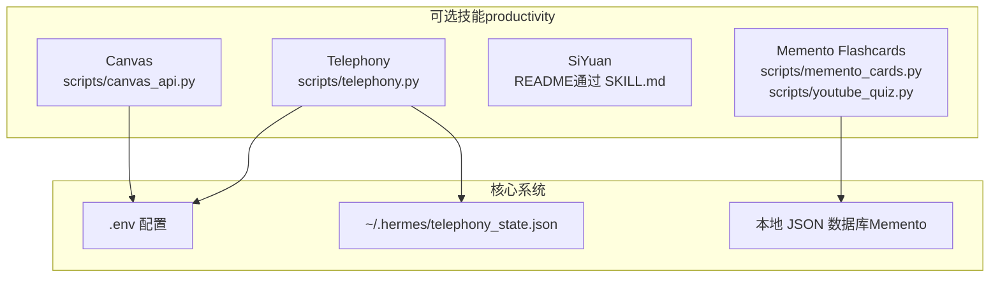
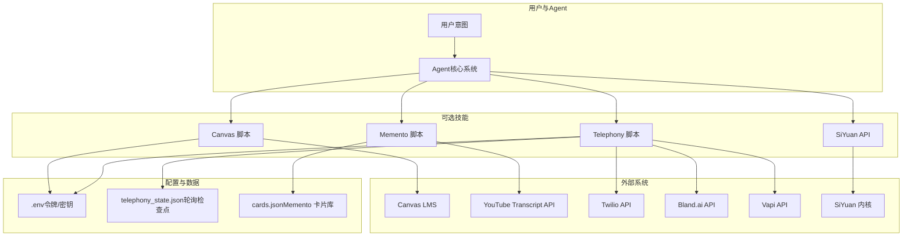
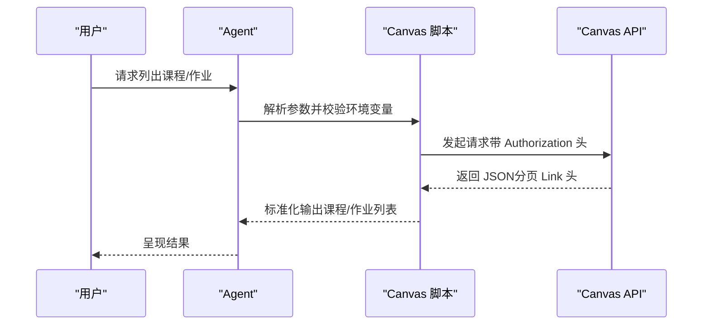
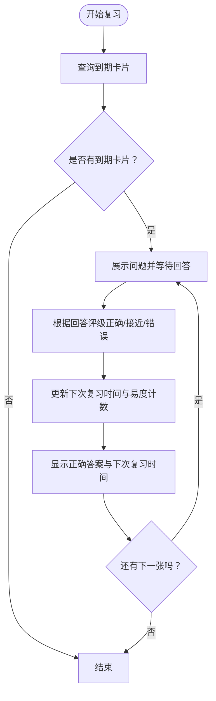
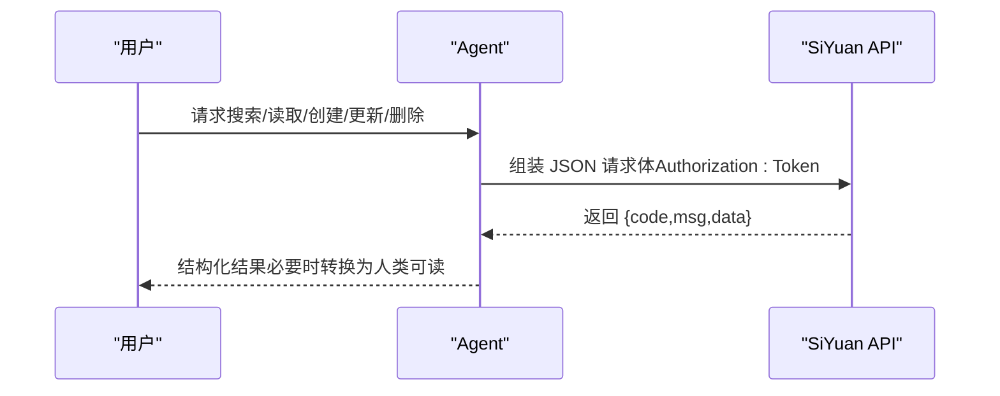
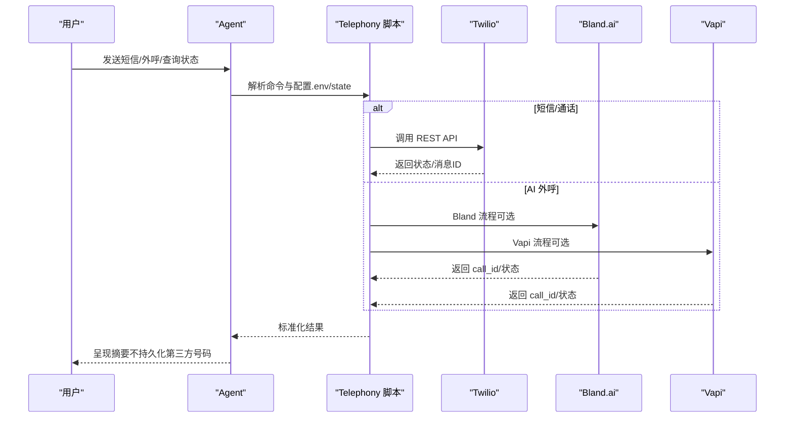
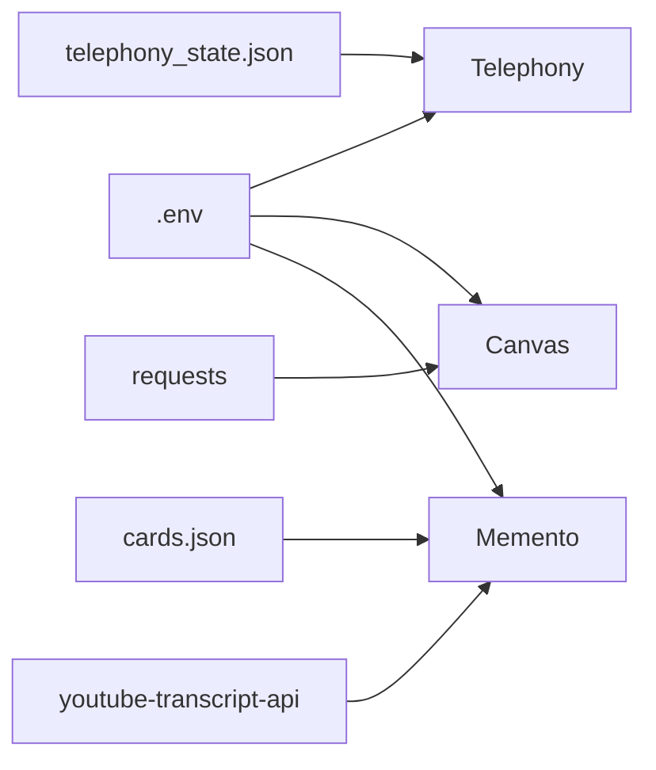

# 生产力工具

<cite>
**本文引用的文件**
- [SKILL.md（Canvas）](file://optional-skills/productivity/canvas/SKILL.md)
- [canvas_api.py（Canvas）](file://optional-skills/productivity/canvas/scripts/canvas_api.py)
- [SKILL.md（Memento Flashcards）](file://optional-skills/productivity/memento-flashcards/SKILL.md)
- [memento_cards.py（Memento）](file://optional-skills/productivity/memento-flashcards/scripts/memento_cards.py)
- [youtube_quiz.py（Memento）](file://optional-skills/productivity/memento-flashcards/scripts/youtube_quiz.py)
- [SKILL.md（SiYuan）](file://optional-skills/productivity/siyuan/SKILL.md)
- [SKILL.md（Telephony）](file://optional-skills/productivity/telephony/SKILL.md)
- [telephony.py（Telephony）](file://optional-skills/productivity/telephony/scripts/telephony.py)
- [test_memento_cards.py（测试）](file://tests/skills/test_memento_cards.py)
- [test_youtube_quiz.py（测试）](file://tests/skills/test_youtube_quiz.py)
- [test_telephony_skill.py（测试）](file://tests/skills/test_telephony_skill.py)
- [optional-skills 概览](file://optional-skills/DESCRIPTION.md)
</cite>

## 目录
1. [简介](#简介)
2. [项目结构](#项目结构)
3. [核心组件](#核心组件)
4. [架构总览](#架构总览)
5. [详细组件分析](#详细组件分析)
6. [依赖关系分析](#依赖关系分析)
7. [性能考量](#性能考量)
8. [故障排查指南](#故障排查指南)
9. [结论](#结论)
10. [附录](#附录)

## 简介
本文件系统性介绍 Hermes Agent 的生产力工具可选技能，覆盖以下工具：
- Canvas：课程与作业查询（只读）
- Memento Flashcards：间隔重复记忆卡片系统
- SiYuan：自托管知识库的 API 访问
- Telephony：电话、短信、外呼能力（无需改动核心工具集）

内容包括功能说明、安装配置、使用流程、与核心系统的集成方式、数据同步机制、实际应用示例与效率优化建议。

## 项目结构
这些技能位于 optional-skills/productivity 下，每个技能包含：
- SKILL.md：技能说明、安装与使用指南
- scripts/：可执行脚本或辅助模块
- tests/：单元测试与行为验证

图示来源
- [SKILL.md（Canvas）](file://optional-skills/productivity/canvas/SKILL.md)
- [canvas_api.py（Canvas）](file://optional-skills/productivity/canvas/scripts/canvas_api.py)
- [SKILL.md（Memento Flashcards）](file://optional-skills/productivity/memento-flashcards/SKILL.md)
- [memento_cards.py（Memento）](file://optional-skills/productivity/memento-flashcards/scripts/memento_cards.py)
- [SKILL.md（SiYuan）](file://optional-skills/productivity/siyuan/SKILL.md)
- [SKILL.md（Telephony）](file://optional-skills/productivity/telephony/SKILL.md)
- [telephony.py（Telephony）](file://optional-skills/productivity/telephony/scripts/telephony.py)

章节来源
- [optional-skills 概览](file://optional-skills/DESCRIPTION.md)

## 核心组件
- Canvas：通过 Canvas API 获取课程与作业列表，支持分页与排序，输出标准化 JSON。
- Memento Flashcards：基于本地 JSON 文件的卡片存储与间隔重复调度；支持 CSV 导入导出、按集合过滤、自动退休等。
- SiYuan：通过 curl 调用 SiYuan 内核 API，实现搜索、读写块、文档管理、属性设置等。
- Telephony：在不改动核心工具的前提下，提供 Twilio 号码购买与默认号码记忆、短信/彩信发送、直接通话、AI 外呼（Bland.ai/Vapi），以及无 webhook 的收件箱轮询。

章节来源
- [SKILL.md（Canvas）](file://optional-skills/productivity/canvas/SKILL.md)
- [canvas_api.py（Canvas）](file://optional-skills/productivity/canvas/scripts/canvas_api.py)
- [SKILL.md（Memento Flashcards）](file://optional-skills/productivity/memento-flashcards/SKILL.md)
- [memento_cards.py（Memento）](file://optional-skills/productivity/memento-flashcards/scripts/memento_cards.py)
- [youtube_quiz.py（Memento）](file://optional-skills/productivity/memento-flashcards/scripts/youtube_quiz.py)
- [SKILL.md（SiYuan）](file://optional-skills/productivity/siyuan/SKILL.md)
- [SKILL.md（Telephony）](file://optional-skills/productivity/telephony/SKILL.md)
- [telephony.py（Telephony）](file://optional-skills/productivity/telephony/scripts/telephony.py)

## 架构总览
下图展示各技能与外部系统、配置文件及数据文件的交互关系：

图示来源
- [canvas_api.py（Canvas）](file://optional-skills/productivity/canvas/scripts/canvas_api.py)
- [memento_cards.py（Memento）](file://optional-skills/productivity/memento-flashcards/scripts/memento_cards.py)
- [youtube_quiz.py（Memento）](file://optional-skills/productivity/memento-flashcards/scripts/youtube_quiz.py)
- [telephony.py（Telephony）](file://optional-skills/productivity/telephony/scripts/telephony.py)

## 详细组件分析

### Canvas 工具
- 功能概述
  - 仅读取权限，列出课程与作业，支持筛选与排序，自动处理分页。
- 安装与配置
  - 在 Canvas 中生成个人访问令牌与基础 URL，写入 ~/.hermes/.env。
- 使用方式
  - 列出课程、列出某课程作业、指定排序字段。
- 输出格式
  - 课程：包含 id、名称、编码、状态、起止时间等。
  - 作业：包含 id、名称、截止时间、分数、提交类型、链接等（描述截断）。
- 集成与数据同步
  - 通过环境变量读取认证信息，调用 Canvas REST API，返回 JSON。
- 实际应用示例
  - 学生查看当前学期课程与到期作业；教师批量导出作业清单。
- 效率优化建议
  - 合理设置 per_page 与 order_by，避免一次性拉取过多数据。
  - 注意 Canvas 的速率限制，必要时缓存结果。

图示来源
- [canvas_api.py（Canvas）](file://optional-skills/productivity/canvas/scripts/canvas_api.py)
- [SKILL.md（Canvas）](file://optional-skills/productivity/canvas/SKILL.md)

章节来源
- [SKILL.md（Canvas）](file://optional-skills/productivity/canvas/SKILL.md)
- [canvas_api.py（Canvas）](file://optional-skills/productivity/canvas/scripts/canvas_api.py)

### Memento Flashcards 工具
- 功能概述
  - 本地 JSON 卡片库，支持添加、复习、评级、导出导入、统计、从 YouTube 视频生成测验。
- 安装与配置
  - 无需额外 API 密钥；卡片数据保存在 ~/.hermes/skills/productivity/memento-flashcards/data/cards.json。
- 使用方式
  - 添加卡片、按集合/状态过滤、查看到期卡片、评级与退休、导出/导入 CSV、统计信息。
  - 从 YouTube 视频抓取字幕并生成 5 道题目的测验卡片。
- 数据模型与算法
  - 卡片字段：id、问题、答案、集合、状态、ease_streak、下次复习时间、创建时间、视频 ID、最后回答。
  - 评级规则：hard(+1天, 重置连续易度计数)、good(+3天, 重置)、easy(+7天, 易度计数+1, ≥3 自动退休)。
- 集成与数据同步
  - 所有操作通过命令行子命令完成，数据持久化到 cards.json，采用临时文件+原子替换写入。
- 实际应用示例
  - 快速记忆知识点、按集合组织卡片、从播客/视频生成测验进行自测。
- 效率优化建议
  - 使用 due --collection 过滤复习范围；定期导出备份；利用自动退休减少冗余卡片。

图示来源
- [memento_cards.py（Memento）](file://optional-skills/productivity/memento-flashcards/scripts/memento_cards.py)
- [SKILL.md（Memento Flashcards）](file://optional-skills/productivity/memento-flashcards/SKILL.md)

章节来源
- [SKILL.md（Memento Flashcards）](file://optional-skills/productivity/memento-flashcards/SKILL.md)
- [memento_cards.py（Memento）](file://optional-skills/productivity/memento-flashcards/scripts/memento_cards.py)
- [test_memento_cards.py（测试）](file://tests/skills/test_memento_cards.py)
- [test_youtube_quiz.py（测试）](file://tests/skills/test_youtube_quiz.py)

### SiYuan 工具
- 功能概述
  - 通过 curl 调用 SiYuan 内核 API，实现全文检索、SQL 查询、块读取/更新、文档创建/删除、属性设置、导出等。
- 安装与配置
  - 在 SiYuan 设置中获取 API 令牌，配置 SIYUAN_TOKEN 与 SIYUAN_URL（默认 http://127.0.0.1:6806）。
- 使用方式
  - 全文搜索、SQL 查询、读取块内容、读取子块、获取路径、列出笔记本/文档、创建/更新/删除块与文档、重命名、设置属性、导出为 Markdown。
- 集成与数据同步
  - 以 POST JSON 方式调用 API，统一响应结构；注意 ID 格式与错误码。
- 实际应用示例
  - 快速检索会议记录、批量导出文档、自动化写入新段落。
- 效率优化建议
  - 使用 LIMIT 控制结果规模；仅在需要时加载大文档；优先使用 SQL 查询定位目标块。

图示来源
- [SKILL.md（SiYuan）](file://optional-skills/productivity/siyuan/SKILL.md)

章节来源
- [SKILL.md（SiYuan）](file://optional-skills/productivity/siyuan/SKILL.md)

### Telephony 工具
- 功能概述
  - 在不改动核心工具的前提下，提供 Twilio 号码购买与默认号码记忆、短信/彩信发送、直接通话、AI 外呼（Bland.ai/Vapi）、无 webhook 的收件箱轮询。
- 安装与配置
  - 将提供商密钥与号码信息写入 ~/.hermes/.env；状态信息保存在 ~/.hermes/telephony_state.json。
- 使用方式
  - 诊断状态、保存密钥、搜索/购买/设置默认号码、直接通话、发送短信/彩信、轮询收件箱、导入 Twilio 号码到 Vapi、发起 AI 外呼、查询状态。
- 集成与数据同步
  - 通过标准库 HTTP 客户端调用 Twilio/Bland/Vapi API；状态文件用于跨会话保留轮询检查点与默认号码。
- 实际应用示例
  - 接收部署通知短信、向供应商拨出 AI 外呼、在后续会话中继续查看未读短信。
- 效率优化建议
  - 使用 since-last + mark-seen 仅处理新增消息；合理设置最大时长与语音参数；在 Vapi 中复用已导入的号码。

图示来源
- [telephony.py（Telephony）](file://optional-skills/productivity/telephony/scripts/telephony.py)
- [SKILL.md（Telephony）](file://optional-skills/productivity/telephony/SKILL.md)

章节来源
- [SKILL.md（Telephony）](file://optional-skills/productivity/telephony/SKILL.md)
- [telephony.py（Telephony）](file://optional-skills/productivity/telephony/scripts/telephony.py)
- [test_telephony_skill.py（测试）](file://tests/skills/test_telephony_skill.py)

## 依赖关系分析
- 外部依赖
  - Memento Flashcards：youtube-transcript-api（可选，用于字幕抓取）。
  - Canvas：requests（用于 API 调用）。
  - Telephony：Python 标准库 HTTP 客户端（避免额外依赖）。
- 配置与状态
  - .env：存放令牌与密钥（Twilio、Bland、Vapi、Canvas）。
  - telephony_state.json：保存轮询检查点与默认号码等状态。
  - cards.json：Memento 卡片库。
- 耦合与内聚
  - 各技能相对独立，耦合度低；通过标准输出 JSON 与 Agent 交互，便于解析与组合使用。

图示来源
- [telephony.py（Telephony）](file://optional-skills/productivity/telephony/scripts/telephony.py)
- [canvas_api.py（Canvas）](file://optional-skills/productivity/canvas/scripts/canvas_api.py)
- [memento_cards.py（Memento）](file://optional-skills/productivity/memento-flashcards/scripts/memento_cards.py)
- [youtube_quiz.py（Memento）](file://optional-skills/productivity/memento-flashcards/scripts/youtube_quiz.py)

章节来源
- [telephony.py（Telephony）](file://optional-skills/productivity/telephony/scripts/telephony.py)
- [canvas_api.py（Canvas）](file://optional-skills/productivity/canvas/scripts/canvas_api.py)
- [memento_cards.py（Memento）](file://optional-skills/productivity/memento-flashcards/scripts/memento_cards.py)
- [youtube_quiz.py（Memento）](file://optional-skills/productivity/memento-flashcards/scripts/youtube_quiz.py)

## 性能考量
- 分页与限流
  - Canvas 使用 Link 头分页，应控制 per_page 并遵循速率限制。
- I/O 与原子写
  - Memento 采用临时文件+重命名写入，避免损坏；大量导入时建议分批处理。
- 网络调用
  - Telephony 与外部 API 的超时与重试策略需结合业务场景设置。
- 数据规模
  - SiYuan 大文档导出与 SQL 查询应配合 LIMIT 与索引友好的条件。

## 故障排查指南
- Canvas
  - 401/403：检查令牌与机构 URL；确认课程权限。
  - 空列表：尝试移除 enrollment-state 过滤或仅看 active。
  - 超时：检查网络连通性与 Canvas 实例可用性。
- Memento
  - 缺少 youtube-transcript-api：按提示安装依赖。
  - 字幕为空：更换视频或确认语言支持。
  - 卡片损坏：脚本会回退为空库，重新添加即可。
- SiYuan
  - 错误响应：检查 code 与 msg；确认 ID 格式与 POST 请求体。
  - SQL 安全：仅使用 SELECT，避免危险语句。
- Telephony
  - 未配置提供商：使用 save-* 命令写入 .env；使用 diagnose 校验状态。
  - 收件箱轮询：确保 since-last + mark-seen 正确使用；检查 last_inbound_message_sid。
  - AI 外呼：确认 provider 选择与默认语音/模型配置。

章节来源
- [SKILL.md（Canvas）](file://optional-skills/productivity/canvas/SKILL.md)
- [SKILL.md（Memento Flashcards）](file://optional-skills/productivity/memento-flashcards/SKILL.md)
- [SKILL.md（SiYuan）](file://optional-skills/productivity/siyuan/SKILL.md)
- [SKILL.md（Telephony）](file://optional-skills/productivity/telephony/SKILL.md)
- [test_memento_cards.py（测试）](file://tests/skills/test_memento_cards.py)
- [test_youtube_quiz.py（测试）](file://tests/skills/test_youtube_quiz.py)
- [test_telephony_skill.py（测试）](file://tests/skills/test_telephony_skill.py)

## 结论
上述生产力工具以“可选技能”形式提供，既保持核心系统轻量，又为用户提供教育、知识管理与通信等实用能力。通过标准化的命令行接口与 JSON 输出，它们易于与 Agent 集成并在不同场景中灵活组合使用。建议在生产环境中关注配置安全、数据备份与 API 限流策略，以获得稳定高效的体验。

## 附录
- 安装与启用
  - 通过 Skills Hub 搜索与安装官方可选技能，安装后可在 ~/.hermes/skills 下找到对应目录。
- 最佳实践
  - 将敏感信息放入 .env；定期导出/导入 Memento 卡片；使用 since-last 轮询避免重复处理；在 Vapi 中复用已导入的 Twilio 号码。