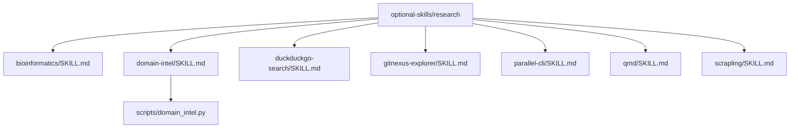
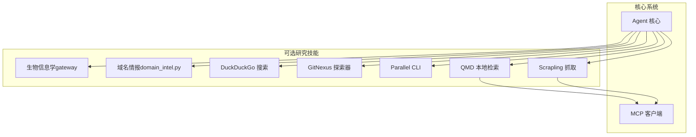
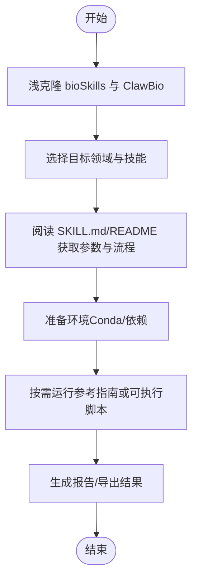
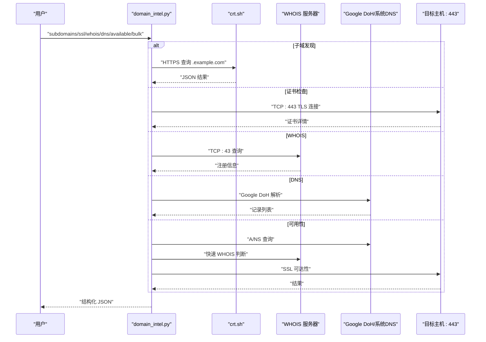
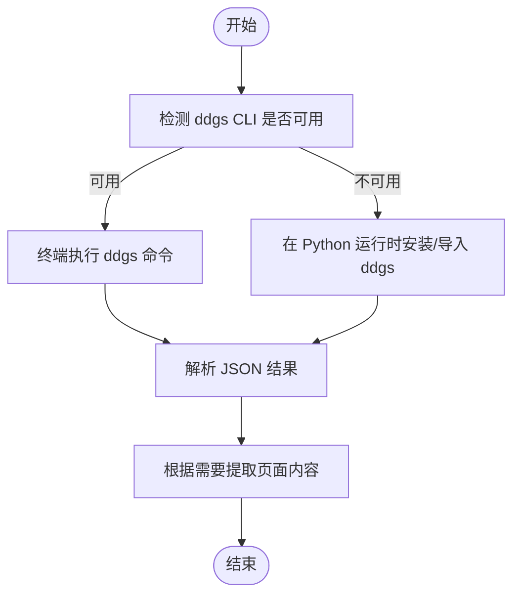
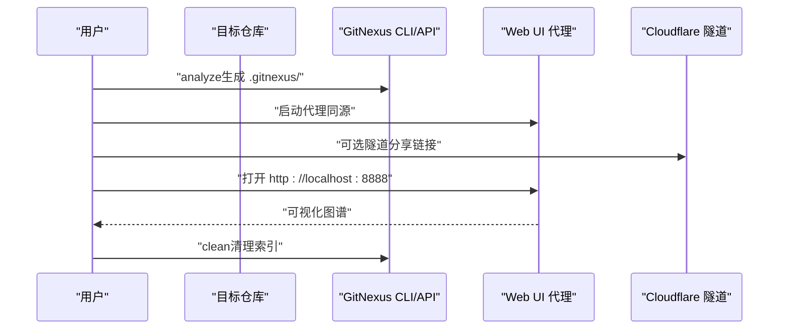
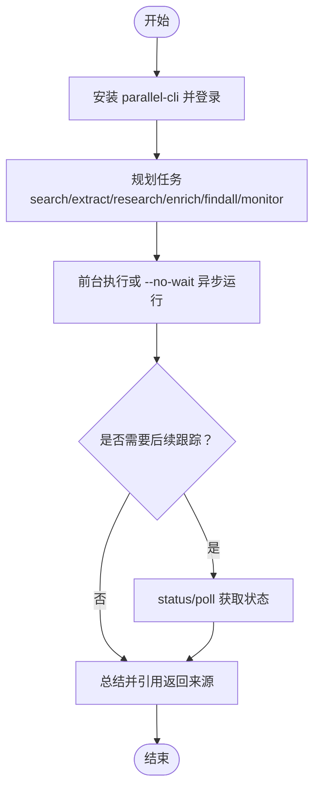
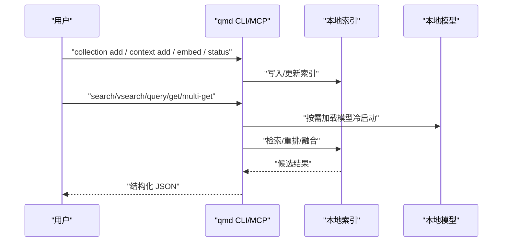
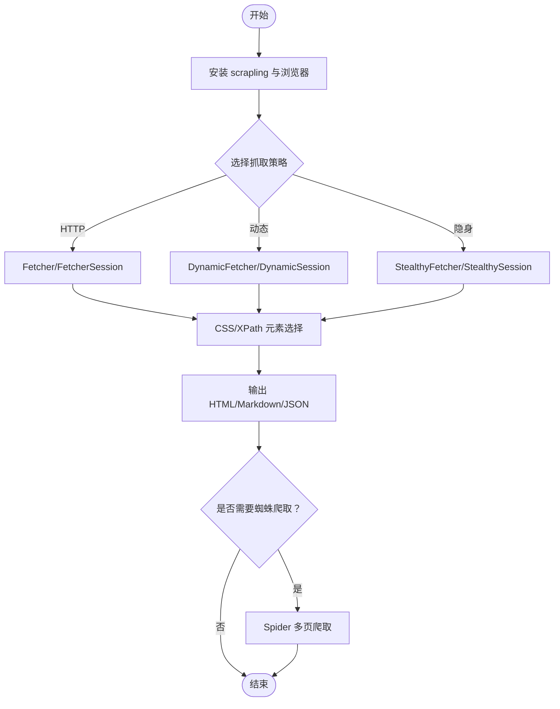
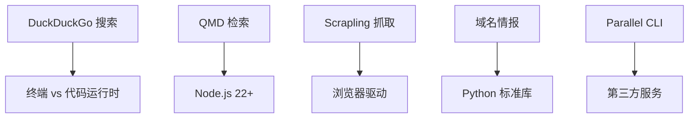

# 研究工具

<cite>
**本文引用的文件**
- [SKILL.md（生物信息学）](file://optional-skills/research/bioinformatics/SKILL.md)
- [SKILL.md（域名情报）](file://optional-skills/research/domain-intel/SKILL.md)
- [domain_intel.py（域名情报脚本）](file://optional-skills/research/domain-intel/scripts/domain_intel.py)
- [SKILL.md（DuckDuckGo 搜索）](file://optional-skills/research/duckduckgo-search/SKILL.md)
- [SKILL.md（GitNexus 探索器）](file://optional-skills/research/gitnexus-explorer/SKILL.md)
- [SKILL.md（Parallel CLI）](file://optional-skills/research/parallel-cli/SKILL.md)
- [SKILL.md（QMD 本地知识库）](file://optional-skills/research/qmd/SKILL.md)
- [SKILL.md（Scrapling 网页抓取）](file://optional-skills/research/scrapling/SKILL.md)
</cite>

## 目录
1. [简介](#简介)
2. [项目结构](#项目结构)
3. [核心组件](#核心组件)
4. [架构总览](#架构总览)
5. [详细组件分析](#详细组件分析)
6. [依赖关系分析](#依赖关系分析)
7. [性能考量](#性能考量)
8. [故障排查指南](#故障排查指南)
9. [结论](#结论)
10. [附录](#附录)

## 简介
本文件系统性梳理 Hermes Agent 可选“研究工具”技能包，覆盖生物信息学、域名情报、搜索引擎、Git 探索器、并行 CLI、QMD 文档检索与网页抓取等能力。文档面向不同技术背景的读者，既提供安装与配置指引，也给出典型研究场景与最佳实践，并解释这些工具如何与核心系统集成、如何进行数据处理与结果分析。

## 项目结构
研究工具位于 optional-skills/research 下，每个子目录包含一个 SKILL.md 作为技能说明与使用指南，部分工具还包含配套脚本或参考实现。下图展示研究工具的目录与文件关系概览：

图表来源
- [SKILL.md（生物信息学）](file://optional-skills/research/bioinformatics/SKILL.md)
- [SKILL.md（域名情报）](file://optional-skills/research/domain-intel/SKILL.md)
- [domain_intel.py（域名情报脚本）](file://optional-skills/research/domain-intel/scripts/domain_intel.py)
- [SKILL.md（DuckDuckGo 搜索）](file://optional-skills/research/duckduckgo-search/SKILL.md)
- [SKILL.md（GitNexus 探索器）](file://optional-skills/research/gitnexus-explorer/SKILL.md)
- [SKILL.md（Parallel CLI）](file://optional-skills/research/parallel-cli/SKILL.md)
- [SKILL.md（QMD 本地知识库）](file://optional-skills/research/qmd/SKILL.md)
- [SKILL.md（Scrapling 网页抓取）](file://optional-skills/research/scrapling/SKILL.md)

章节来源
- [SKILL.md（生物信息学）](file://optional-skills/research/bioinformatics/SKILL.md)
- [SKILL.md（域名情报）](file://optional-skills/research/domain-intel/SKILL.md)
- [domain_intel.py（域名情报脚本）](file://optional-skills/research/domain-intel/scripts/domain_intel.py)
- [SKILL.md（DuckDuckGo 搜索）](file://optional-skills/research/duckduckgo-search/SKILL.md)
- [SKILL.md（GitNexus 探索器）](file://optional-skills/research/gitnexus-explorer/SKILL.md)
- [SKILL.md（Parallel CLI）](file://optional-skills/research/parallel-cli/SKILL.md)
- [SKILL.md（QMD 本地知识库）](file://optional-skills/research/qmd/SKILL.md)
- [SKILL.md（Scrapling 网页抓取）](file://optional-skills/research/scrapling/SKILL.md)

## 核心组件
- 生物信息学（gateway 到 bioSkills 与 ClawBio）
  - 功能：按需索引与调用 400+ 生物信息学技能，覆盖组学、单细胞、结构生物学、药物基因组学等领域。
  - 使用要点：通过浅克隆获取参考材料与可运行管道；注意环境依赖与数据规模。
- 域名情报（被动 OSINT）
  - 功能：基于 Python 标准库执行子域发现、证书检查、WHOIS 查询、DNS 记录解析与域名可用性判断；支持批量并行。
  - 使用要点：零外部依赖，纯标准库实现；WHOIS/SSL 可能受网络策略限制。
- DuckDuckGo 搜索
  - 功能：免费网络搜索（文本/新闻/图片/视频），优先使用 CLI ddgs，必要时使用 Python 库。
  - 使用要点：区分终端与代码执行运行时；max_results 必须关键字传参；注意结果不含全文，需二次提取。
- GitNexus 探索器
  - 功能：将任意代码库索引为知识图谱并通过 Web UI 可视化；支持 Cloudflare 隧道远程访问。
  - 使用要点：Node.js 与 git 必备；浏览器渲染节点数量有限制；可选语义搜索。
- Parallel CLI
  - 功能：第三方供应商的搜索、提取、深度研究、实体发现与监控；强调非交互式与异步工作流。
  - 使用要点：付费服务（含免费额度）；优先 JSON 输出与上下文链路；避免默认替代原生工具。
- QMD（本地知识库检索）
  - 功能：本地混合检索引擎（BM25、向量、LLM 重排），支持 CLI 与 MCP 集成。
  - 使用要点：Node.js 22+；首次运行下载模型；建议 HTTP 守护保持热模型；推荐 MCP 工具接入。
- Scrapling（网页抓取）
  - 功能：HTTP/动态/隐身三种抓取策略，支持反爬与云.cloudflare 绕过、蜘蛛爬取。
  - 使用要点：法律合规；浏览器安装与超时设置；资源禁用以提升速度；多会话与断点续爬。

章节来源
- [SKILL.md（生物信息学）](file://optional-skills/research/bioinformatics/SKILL.md)
- [SKILL.md（域名情报）](file://optional-skills/research/domain-intel/SKILL.md)
- [domain_intel.py（域名情报脚本）](file://optional-skills/research/domain-intel/scripts/domain_intel.py)
- [SKILL.md（DuckDuckGo 搜索）](file://optional-skills/research/duckduckgo-search/SKILL.md)
- [SKILL.md（GitNexus 探索器）](file://optional-skills/research/gitnexus-explorer/SKILL.md)
- [SKILL.md（Parallel CLI）](file://optional-skills/research/parallel-cli/SKILL.md)
- [SKILL.md（QMD 本地知识库）](file://optional-skills/research/qmd/SKILL.md)
- [SKILL.md（Scrapling 网页抓取）](file://optional-skills/research/scrapling/SKILL.md)

## 架构总览
研究工具与核心系统的集成路径通常如下：
- 原生工具优先：如 web_search/web_extract 等内置工具满足常见需求。
- 可选技能加载：当用户明确需要特定能力（如 Parallel、QMD、GitNexus）时，Agent 加载对应 SKILL.md 并按说明执行。
- MCP 集成：对于 QMD、Scrapling 等，可通过 MCP 服务器将工具注册为原生工具，减少对技能文件的直接依赖。
- 外部命令桥接：域名情报、DuckDuckGo 搜索等通过终端命令或 Python 运行时执行，再将结构化输出返回给 Agent。

图表来源
- [SKILL.md（域名情报）](file://optional-skills/research/domain-intel/SKILL.md)
- [domain_intel.py（域名情报脚本）](file://optional-skills/research/domain-intel/scripts/domain_intel.py)
- [SKILL.md（DuckDuckGo 搜索）](file://optional-skills/research/duckduckgo-search/SKILL.md)
- [SKILL.md（GitNexus 探索器）](file://optional-skills/research/gitnexus-explorer/SKILL.md)
- [SKILL.md（Parallel CLI）](file://optional-skills/research/parallel-cli/SKILL.md)
- [SKILL.md（QMD 本地知识库）](file://optional-skills/research/qmd/SKILL.md)
- [SKILL.md（Scrapling 网页抓取）](file://optional-skills/research/scrapling/SKILL.md)

## 详细组件分析

### 生物信息学（Gateway）
- 能力概述
  - 作为入口，索引 bioSkills（385 个参考技能）与 ClawBio（33 个可运行管道）。
  - 提供领域索引（序列基础、比对、变异检测、差异表达、单细胞、空间转录组、表观基因组、药代动力学、群体遗传、宏基因组、结构生物学、蛋白质组、通路分析、免疫信息学、CRISPR、工作流管理、机器学习等）。
- 使用流程
  - 浅克隆仓库获取目标技能；阅读 SKILL.md 或 README 获取参数与流程；按需运行可执行脚本。
- 环境与注意事项
  - 建议使用 Conda 管理生态；注意大型数据文件与磁盘空间；部分技能需额外安装 CLI 工具。
- 典型场景
  - 变异检测与注释、批量 RNA-seq 分析、单细胞聚类与注释、GWAS 与祖先推断、宏基因组与抗性基因分析、结构预测与分子对接等。

图表来源
- [SKILL.md（生物信息学）](file://optional-skills/research/bioinformatics/SKILL.md)

章节来源
- [SKILL.md（生物信息学）](file://optional-skills/research/bioinformatics/SKILL.md)

### 域名情报（Passive OSINT）
- 能力概述
  - 子域发现（crt.sh）、TLS 证书检查（到期日、套件、SAN）、WHOIS 查询（注册商、日期、NS）、DNS 记录（A/AAAA/MX/NS/TXT/CNAME）、域名可用性（被动信号聚合）、批量并行分析。
- 实现要点
  - 纯 Python 标准库实现；WHOIS 使用 TCP:43；DNS 使用 Google DoH；SSL 检查为唯一“主动”连接。
  - 批量分析使用线程池并发执行，限制最大域数与并发度。
- 使用建议
  - 在受限网络中 WHOIS 可能被阻断；crt.sh 对热门域名响应较慢；可用性判断为启发式，非权威。
- 典型场景
  - 基础设施侦察、安全评估、竞品分析、域名可用性筛查。

图表来源
- [domain_intel.py（域名情报脚本）](file://optional-skills/research/domain-intel/scripts/domain_intel.py)
- [SKILL.md（域名情报）](file://optional-skills/research/domain-intel/SKILL.md)

章节来源
- [domain_intel.py（域名情报脚本）](file://optional-skills/research/domain-intel/scripts/domain_intel.py)
- [SKILL.md（域名情报）](file://optional-skills/research/domain-intel/SKILL.md)

### DuckDuckGo 搜索
- 能力概述
  - 免费网络搜索（文本/新闻/图片/视频），优先使用 CLI ddgs；Python 库仅在确认可用时使用。
- 使用流程
  - 检测 CLI 是否存在；若存在优先使用终端 + ddgs；否则按需安装 Python 包；注意 max_results 必须关键字传参。
- 数据处理
  - 返回标题、URL、摘要等字段；不含全文，需配合 web_extract 或浏览器工具进一步提取。
- 典型场景
  - 通用研究、公司/产品信息、视觉参考、教程查找。

图表来源
- [SKILL.md（DuckDuckGo 搜索）](file://optional-skills/research/duckduckgo-search/SKILL.md)

章节来源
- [SKILL.md（DuckDuckGo 搜索）](file://optional-skills/research/duckduckgo-search/SKILL.md)

### GitNexus 探索器
- 能力概述
  - 将代码库索引为知识图谱，提供可视化界面；支持 Cloudflare 隧道远程访问。
- 使用流程
  - 一次性构建 GitNexus；修补 Web UI 使其支持同源访问；在目标仓库执行分析并生成索引；启动代理服务；可选 Cloudflare 隧道分享链接。
- 注意事项
  - 浏览器渲染节点数量有限；大仓库可能导致卡顿或崩溃；可选语义搜索耗时较长。
- 典型场景
  - 代码结构探索、依赖关系可视化、团队共享知识图谱。

图表来源
- [SKILL.md（GitNexus 探索器）](file://optional-skills/research/gitnexus-explorer/SKILL.md)

章节来源
- [SKILL.md（GitNexus 探索器）](file://optional-skills/research/gitnexus-explorer/SKILL.md)

### Parallel CLI
- 能力概述
  - 第三方供应商的搜索、提取、深度研究、实体发现与监控；强调 JSON 输出、非交互式与异步工作流。
- 使用流程
  - 安装与认证；使用 search/extract/research/enrich/findall/monitor 等子命令；异步任务通过 status/poll 跟踪。
- 典型场景
  - 需要富工作流、结构化增强、大规模实体发现、持续监控的复杂研究任务。
- 注意事项
  - 付费服务（含免费额度）；不要默认替代原生工具；严格按要求输出 JSON 并仅引用返回来源。

图表来源
- [SKILL.md（Parallel CLI）](file://optional-skills/research/parallel-cli/SKILL.md)

章节来源
- [SKILL.md（Parallel CLI）](file://optional-skills/research/parallel-cli/SKILL.md)

### QMD（本地知识库检索）
- 能力概述
  - 本地混合检索（BM25、向量、LLM 重排），支持 CLI 与 MCP 集成；无云依赖，全本地运行。
- 使用流程
  - 添加集合、添加上下文描述、生成嵌入、验证状态；通过 CLI 或 MCP 工具查询；HTTP 守护模式保持热模型。
- 典型场景
  - 搜索个人笔记、会议纪要、技术文档；跨文件概念检索；与 Agent 原生工具结合。
- 注意事项
  - 首次运行下载模型（约 2GB）；macOS 需要支持扩展的 SQLite；建议 MCP 工具接入。

图表来源
- [SKILL.md（QMD 本地知识库）](file://optional-skills/research/qmd/SKILL.md)

章节来源
- [SKILL.md（QMD 本地知识库）](file://optional-skills/research/qmd/SKILL.md)

### Scrapling（网页抓取）
- 能力概述
  - HTTP/动态/隐身三种抓取策略；支持反爬与 Cloudflare 绕过、蜘蛛爬取；提供 CLI 与 Python API。
- 使用流程
  - 安装与浏览器初始化；选择合适抓取器；设置代理/伪装；元素选择与导航；蜘蛛框架多页爬取。
- 典型场景
  - 静态/动态/受保护站点的数据提取；批量内容采集；结构化输出到多种格式。
- 注意事项
  - 法律合规；浏览器安装与超时；资源禁用提速；多会话与断点续爬。

图表来源
- [SKILL.md（Scrapling 网页抓取）](file://optional-skills/research/scrapling/SKILL.md)

章节来源
- [SKILL.md（Scrapling 网页抓取）](file://optional-skills/research/scrapling/SKILL.md)

## 依赖关系分析
- 运行时隔离
  - DuckDuckGo 搜索强调终端与代码执行运行时的分离；CLI 与 Python 库不可混用。
- 外部依赖
  - 域名情报：纯标准库；Parallel CLI：第三方服务；QMD：Node.js 22+ 与本地模型；Scrapling：浏览器驱动。
- 集成方式
  - QMD 与 Scrapling 推荐通过 MCP 注册为原生工具，降低对技能文件的耦合。

图表来源
- [SKILL.md（DuckDuckGo 搜索）](file://optional-skills/research/duckduckgo-search/SKILL.md)
- [SKILL.md（QMD 本地知识库）](file://optional-skills/research/qmd/SKILL.md)
- [SKILL.md（Scrapling 网页抓取）](file://optional-skills/research/scrapling/SKILL.md)
- [SKILL.md（域名情报）](file://optional-skills/research/domain-intel/SKILL.md)
- [SKILL.md（Parallel CLI）](file://optional-skills/research/parallel-cli/SKILL.md)

章节来源
- [SKILL.md（DuckDuckGo 搜索）](file://optional-skills/research/duckduckgo-search/SKILL.md)
- [SKILL.md（QMD 本地知识库）](file://optional-skills/research/qmd/SKILL.md)
- [SKILL.md（Scrapling 网页抓取）](file://optional-skills/research/scrapling/SKILL.md)
- [SKILL.md（域名情报）](file://optional-skills/research/domain-intel/SKILL.md)
- [SKILL.md（Parallel CLI）](file://optional-skills/research/parallel-cli/SKILL.md)

## 性能考量
- 域名情报
  - 批量分析默认并发较低；WHOIS/SSL 受网络策略影响；crt.sh 对热门域名响应较慢。
- QMD
  - 首次查询冷启动延迟较高；建议使用 HTTP 守护保持热模型；macOS 需要支持扩展的 SQLite。
- Scrapling
  - 隐身模式增加延迟；动态抓取默认超时以毫秒计；合理禁用资源以提速。
- Parallel CLI
  - 异步任务适合长周期研究；避免过度后台化导致资源争用。
- GitNexus
  - 浏览器渲染节点数上限；大仓库建议仅使用 CLI/MCP 工具。

[本节为通用指导，无需列出具体文件来源]

## 故障排查指南
- DuckDuckGo 搜索
  - CLI 不存在：安装后重试；Python 导入失败：单独准备运行时；空结果：等待或调整关键词。
- 域名情报
  - WHOIS 被阻断：更换网络或使用其他手段；crt.sh 响应慢：降低并发或等待；可用性判断不准确：结合多源信号。
- QMD
  - 首次下载模型：等待完成；冷启动慢：启用守护；macOS SQLite：安装支持扩展版本。
- Scrapling
  - 浏览器未安装：先执行安装；超时异常：增大超时或禁用资源；法律风险：遵守网站条款。
- Parallel CLI
  - 登录需交互：使用设备登录；认证失败：检查密钥与 PATH；退出码 3/4：检查配额与网络。
- GitNexus
  - 隧道冲突：使用 --config /dev/null；生产构建：避免开发服务器限制；浏览器内存：控制仓库规模。

章节来源
- [SKILL.md（DuckDuckGo 搜索）](file://optional-skills/research/duckduckgo-search/SKILL.md)
- [SKILL.md（域名情报）](file://optional-skills/research/domain-intel/SKILL.md)
- [SKILL.md（QMD 本地知识库）](file://optional-skills/research/qmd/SKILL.md)
- [SKILL.md（Scrapling 网页抓取）](file://optional-skills/research/scrapling/SKILL.md)
- [SKILL.md（Parallel CLI）](file://optional-skills/research/parallel-cli/SKILL.md)
- [SKILL.md（GitNexus 探索器）](file://optional-skills/research/gitnexus-explorer/SKILL.md)

## 结论
研究工具技能包为 Hermes Agent 提供了从基础设施侦察、通用网络研究、代码知识图谱、本地知识检索到网页抓取与供应商级研究平台的完整能力谱系。建议在满足需求的前提下优先使用原生工具，当特定场景需要更专业的能力时再引入相应可选技能，并结合 MCP 集成与异步工作流提升效率与稳定性。

[本节为总结性内容，无需列出具体文件来源]

## 附录
- 实际应用示例（场景化思路）
  - 学术综述：先用 DuckDuckGo 搜索与 QMD 检索结合，再用 Scrapling 抓取关键页面，最后用 Parallel CLI 进行深度研究与监控。
  - 安全评估：使用域名情报进行被动侦察，结合 GitNexus 探索项目结构，必要时用 Scrapling 抓取公开信息。
  - 生物信息学研究：通过生物信息学 gateway 获取参考流程，准备环境后运行可执行管道，产出报告与可视化。
- 结果分析方法
  - 以结构化 JSON 为主，严格引用来源；对长结果保存至临时文件以便复用；对多源信息进行交叉验证。

[本节为概念性内容，无需列出具体文件来源]