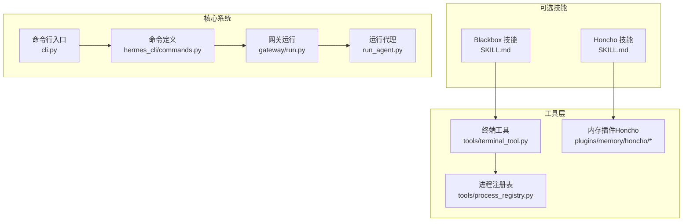
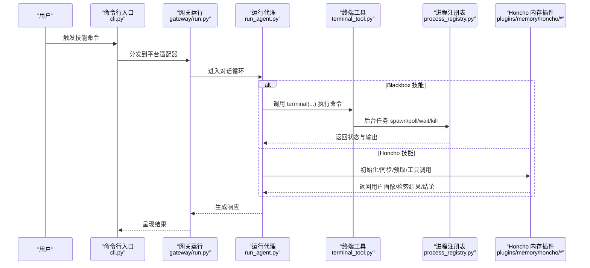
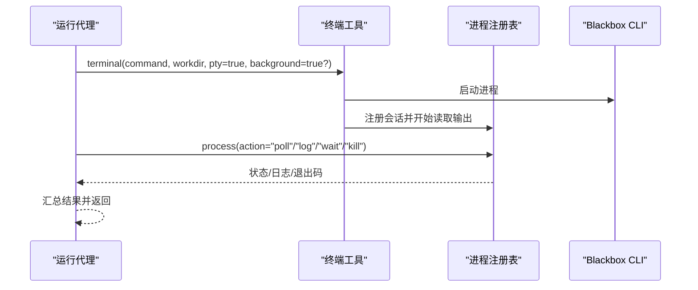
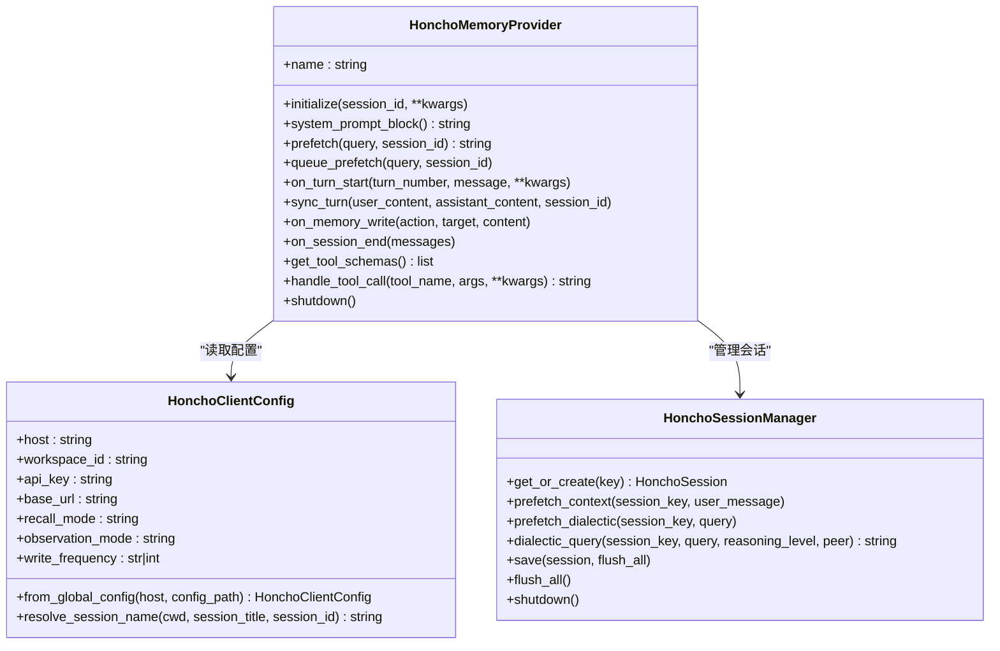
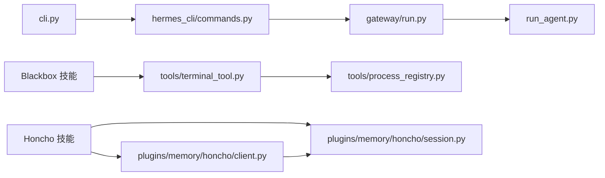

# 自主AI代理

<cite>
**本文引用的文件**
- [AGENTS.md](file://AGENTS.md)
- [DESCRIPTION.md](file://optional-skills/autonomous-ai-agents/DESCRIPTION.md)
- [SKILL.md（Blackbox）](file://optional-skills/autonomous-ai-agents/blackbox/SKILL.md)
- [SKILL.md（Honcho）](file://optional-skills/autonomous-ai-agents/honcho/SKILL.md)
- [__init__.py（Honcho 内存插件）](file://plugins/memory/honcho/__init__.py)
- [client.py（Honcho 客户端）](file://plugins/memory/honcho/client.py)
- [session.py（Honcho 会话）](file://plugins/memory/honcho/session.py)
- [terminal_tool.py（终端工具）](file://tools/terminal_tool.py)
- [process_registry.py（进程注册表）](file://tools/process_registry.py)
- [cli.py（命令行入口）](file://cli.py)
- [commands.py（命令定义）](file://hermes_cli/commands.py)
- [run.py（网关运行）](file://gateway/run.py)
- [discord.py（平台适配器）](file://gateway/platforms/discord.py)
</cite>

## 目录
1. [引言](#引言)
2. [项目结构](#项目结构)
3. [核心组件](#核心组件)
4. [架构总览](#架构总览)
5. [详细组件分析](#详细组件分析)
6. [依赖关系分析](#依赖关系分析)
7. [性能考虑](#性能考虑)
8. [故障排除指南](#故障排除指南)
9. [结论](#结论)
10. [附录](#附录)

## 引言
本文件系统化阐述 Hermes Agent 的“自主AI代理”可选技能：Blackbox 代理与 Honcho 记忆代理。内容覆盖概念背景、功能特性、配置方法、使用场景、与核心系统的交互机制与数据流、性能优化建议与故障排除方法。目标是帮助开发者与使用者在不同平台与工作负载下，正确选择与集成这些技能。

## 项目结构
- 可选技能位于 optional-skills/autonomous-ai-agents，包含 Blackbox 与 Honcho 两个子技能的说明文档。
- Blackbox 技能通过终端工具调用外部 CLI，借助进程注册表进行后台任务管理与状态查询。
- Honcho 记忆代理以内存插件形式接入核心系统，提供跨会话用户建模、对话记忆与工具化访问。

图表来源
- [AGENTS.md](file://AGENTS.md)
- [SKILL.md（Blackbox）](file://optional-skills/autonomous-ai-agents/blackbox/SKILL.md)
- [SKILL.md（Honcho）](file://optional-skills/autonomous-ai-agents/honcho/SKILL.md)
- [terminal_tool.py](file://tools/terminal_tool.py)
- [process_registry.py](file://tools/process_registry.py)
- [__init__.py（Honcho 内存插件）](file://plugins/memory/honcho/__init__.py)

章节来源
- [AGENTS.md](file://AGENTS.md)
- [DESCRIPTION.md](file://optional-skills/autonomous-ai-agents/DESCRIPTION.md)

## 核心组件
- Blackbox 技能：通过终端工具调用黑盒 CLI，支持一次性任务与后台长任务，配合进程注册表进行轮询、日志读取、输入提交与终止控制。
- Honcho 记忆代理：作为内存提供者插件，提供用户与 AI 对等体建模、语义检索、上下文预取、结论写入等能力；支持三种回忆模式（自动注入、仅工具、混合），并具备成本感知与并发写入策略。

章节来源
- [SKILL.md（Blackbox）](file://optional-skills/autonomous-ai-agents/blackbox/SKILL.md)
- [SKILL.md（Honcho）](file://optional-skills/autonomous-ai-agents/honcho/SKILL.md)
- [__init__.py（Honcho 内存插件）](file://plugins/memory/honcho/__init__.py)

## 架构总览
自主AI代理技能与核心系统的交互路径如下：

图表来源
- [cli.py](file://cli.py)
- [run.py（网关运行）](file://gateway/run.py)
- [terminal_tool.py](file://tools/terminal_tool.py)
- [process_registry.py](file://tools/process_registry.py)
- [__init__.py（Honcho 内存插件）](file://plugins/memory/honcho/__init__.py)

## 详细组件分析

### Blackbox 代理技能
- 功能概述
  - 将编码任务委托给 Blackbox CLI，支持多模型并行评估与“主席”裁决，适合复杂重构、PR 审查、临时脚手架等场景。
  - 支持交互式会话与非交互一次性执行，具备检查点恢复能力。
- 配置与前置条件
  - 安装 Node.js 与 Blackbox CLI，配置 API Key 并使用交互式 PTY 模式。
  - 使用工作目录聚焦任务范围，避免误操作工作树。
- 使用场景
  - 快速原型与一次性任务：直接传入 prompt 即可。
  - 长时任务：后台执行 + 进程轮询，必要时提交输入或终止。
  - 多实例并行：同时启动多个实例处理不同问题，统一监控。
- 与核心系统交互
  - 通过终端工具调用外部 CLI，使用进程注册表管理生命周期。
  - 关键参数：pty=true（交互式）、background=true（后台）、workdir（工作目录）。
- 最佳实践
  - 始终使用 pty=true，否则会话无法正常交互。
  - 长任务使用后台模式并定期轮询，避免阻塞主线程。
  - 结果汇报：任务完成后检查变更并总结给用户。

图表来源
- [SKILL.md（Blackbox）](file://optional-skills/autonomous-ai-agents/blackbox/SKILL.md)
- [terminal_tool.py](file://tools/terminal_tool.py)
- [process_registry.py](file://tools/process_registry.py)

章节来源
- [SKILL.md（Blackbox）](file://optional-skills/autonomous-ai-agents/blackbox/SKILL.md)
- [terminal_tool.py](file://tools/terminal_tool.py)
- [process_registry.py](file://tools/process_registry.py)

### Honcho 记忆代理
- 功能概述
  - 提供跨会话用户建模与 AI 自我建模，支持四种工具：用户画像、语义检索、合成问答、结论写入。
  - 支持三种回忆模式：自动注入上下文、仅工具访问、混合模式；具备成本感知与并发写入策略。
- 配置与设置
  - 云部署或自托管：通过交互式向导完成 API Key、观察模式、回忆模式、会话策略等配置。
  - 多配置源：按优先级从本地配置、全局配置、环境变量解析；支持每主机块覆盖。
- 与核心系统交互
  - 作为内存提供者插件接入，参与系统提示构建、上下文预取、回合同步与工具调用。
  - 在网关场景中，根据用户 ID 动态覆盖用户对等体标识，实现按用户隔离的记忆。
- 性能与成本
  - 成本感知：通过注入频率、上下文/对话 cadence 控制 API 调用频次。
  - 写入策略：异步队列、按回合、按会话结束或 N 回合批量写入，降低阻塞与费用。
  - 上下文截断：基于字符预算保守估算进行截断，避免超限。

图表来源
- [__init__.py（Honcho 内存插件）](file://plugins/memory/honcho/__init__.py)
- [client.py（Honcho 客户端）](file://plugins/memory/honcho/client.py)
- [session.py（Honcho 会话）](file://plugins/memory/honcho/session.py)

章节来源
- [__init__.py（Honcho 内存插件）](file://plugins/memory/honcho/__init__.py)
- [client.py（Honcho 客户端）](file://plugins/memory/honcho/client.py)
- [session.py（Honcho 会话）](file://plugins/memory/honcho/session.py)

## 依赖关系分析
- Blackbox 技能依赖终端工具与进程注册表，形成“命令执行—状态轮询—结果汇总”的闭环。
- Honcho 记忆代理依赖客户端配置解析与会话管理器，形成“配置加载—会话初始化—上下文预取—工具调用—写入持久化”的闭环。
- 命令分发链路：命令行入口负责加载配置与命令注册，网关运行负责平台适配与事件分发，运行代理负责对话循环与工具调度。

图表来源
- [cli.py](file://cli.py)
- [commands.py（命令定义）](file://hermes_cli/commands.py)
- [run.py（网关运行）](file://gateway/run.py)
- [terminal_tool.py（终端工具）](file://tools/terminal_tool.py)
- [process_registry.py（进程注册表）](file://tools/process_registry.py)
- [client.py（Honcho 客户端）](file://plugins/memory/honcho/client.py)
- [session.py（Honcho 会话）](file://plugins/memory/honcho/session.py)

章节来源
- [AGENTS.md](file://AGENTS.md)
- [discord.py（平台适配器）](file://gateway/platforms/discord.py)

## 性能考虑
- Blackbox
  - 交互式 PTY 模式确保 CLI 正常运行，但会占用伪终端资源；建议仅在需要交互时启用。
  - 后台任务采用轮询与滚动输出缓冲，注意控制轮询间隔与日志大小，避免过度 IO。
- Honcho
  - 成本感知：通过注入频率与 cadence 控制 API 调用次数；合理设置“仅工具”模式减少自动注入开销。
  - 写入策略：异步队列写入减少阻塞；按回合或 N 回合批量写入平衡实时性与成本。
  - 上下文截断：基于字符预算保守估算，避免超限导致失败或降级。

## 故障排除指南
- Blackbox
  - 未使用 PTY 导致挂起：确认始终设置 pty=true。
  - 任务长时间无响应：使用 process(action="poll") 查看输出，必要时 process(action="kill") 终止。
  - 需要人工输入：使用 process(action="submit") 发送输入。
- Honcho
  - 未配置或未启用：运行 setup 向导，确保配置文件存在且 memory.provider 设置为 honcho。
  - 记忆未跨会话保留：检查 saveMessages 开启与 writeFrequency 配置，避免 session 模式仅在会话结束才写入。
  - 观察模式未生效：服务器端配置会在会话初始化时同步，需重新发起会话。
  - 消息被截断：消息超过最大字符限制会被分段存储，检查工具结果是否过大。

章节来源
- [SKILL.md（Blackbox）](file://optional-skills/autonomous-ai-agents/blackbox/SKILL.md)
- [SKILL.md（Honcho）](file://optional-skills/autonomous-ai-agents/honcho/SKILL.md)
- [__init__.py（Honcho 内存插件）](file://plugins/memory/honcho/__init__.py)

## 结论
Blackbox 与 Honcho 两大自主AI代理技能分别面向“外部代理执行”与“内部记忆增强”。前者通过终端工具与进程注册表实现可靠的外部 CLI 调用与后台任务管理；后者通过内存插件提供跨会话用户建模与工具化访问。结合核心系统的命令分发与对话循环，两者可灵活组合以满足多样化的开发与协作需求。

## 附录
- 使用示例与最佳实践
  - Blackbox：一次性任务直接传入 prompt；长任务后台执行并定期轮询；并行多实例处理不同问题。
  - Honcho：按需选择回忆模式（自动注入/仅工具/混合）；合理设置观察模式与写入频率；在网关场景按用户 ID 隔离记忆。
- 集成方式
  - Blackbox：通过终端工具调用外部 CLI，遵循技能文档中的 flags 与工作流。
  - Honcho：通过内存插件接入，遵循技能文档中的 setup 流程与配置项。