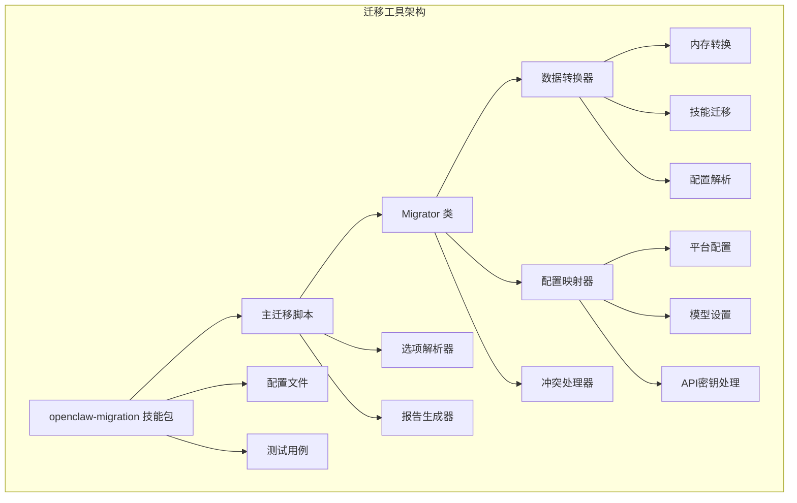
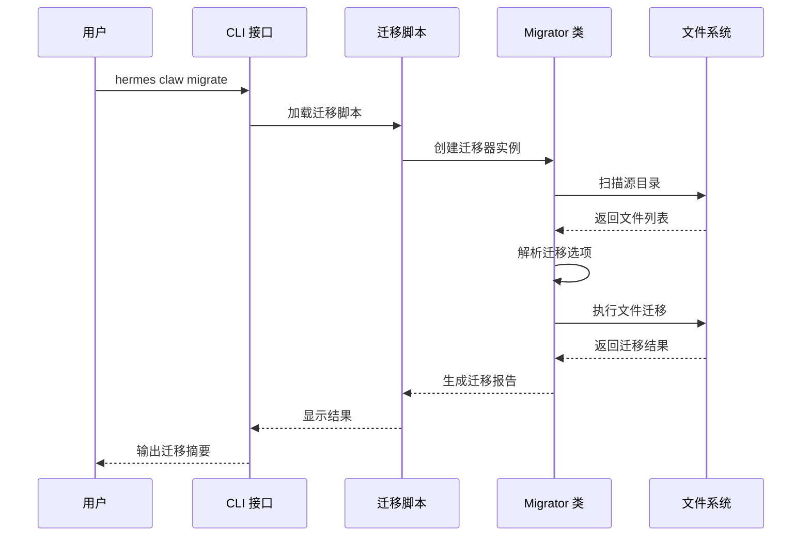
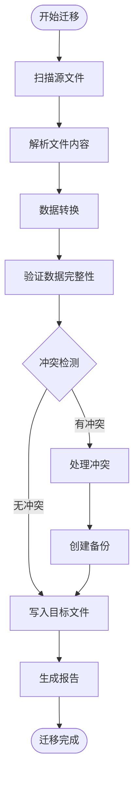
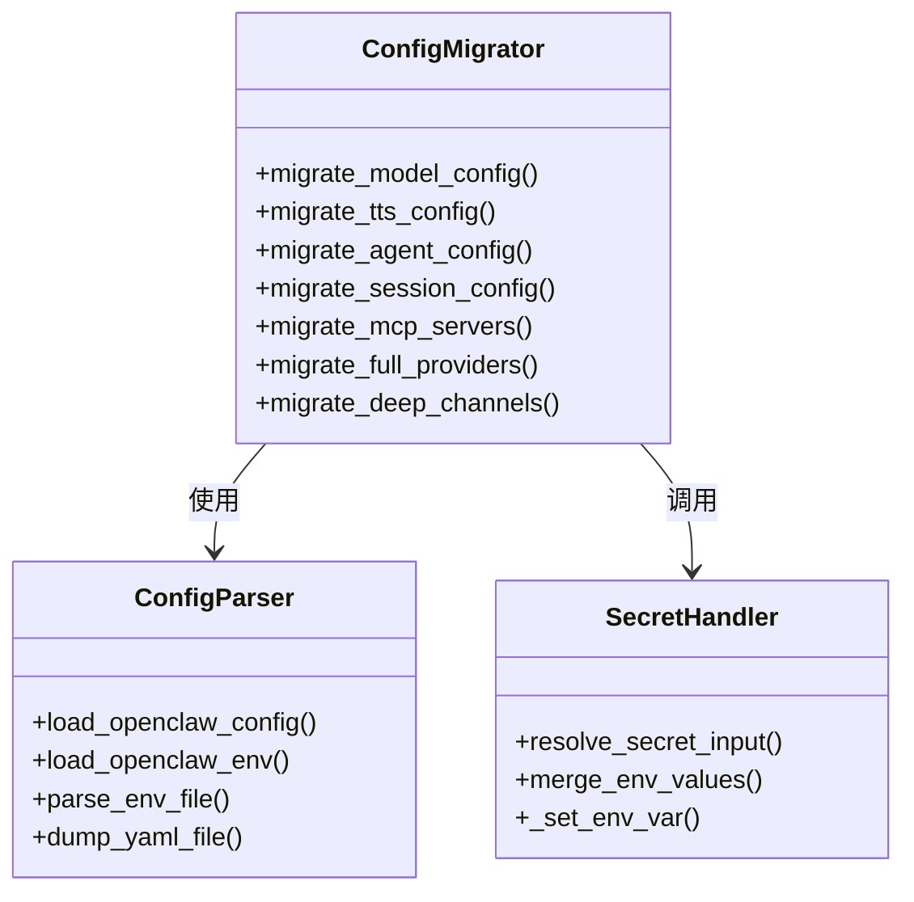
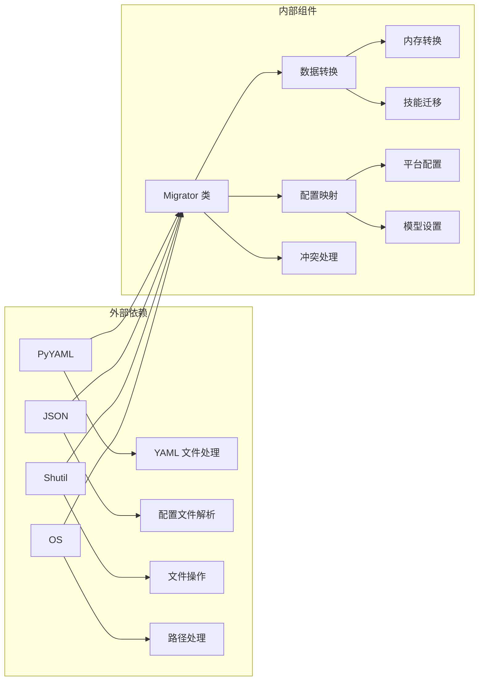

# 迁移工具

<cite>
**本文档引用的文件**
- [openclaw.md](file://docs/migration/openclaw.md)
- [SKILL.md](file://optional-skills/migration/openclaw-migration/SKILL.md)
- [openclaw_to_hermes.py](file://optional-skills/migration/openclaw-migration/scripts/openclaw_to_hermes.py)
- [claw.py](file://hermes_cli/claw.py)
- [setup.py](file://hermes_cli/setup.py)
- [test_openclaw_migration.py](file://tests/skills/test_openclaw_migration.py)
- [test_claw.py](file://tests/hermes_cli/test_claw.py)
- [test_setup_openclaw_migration.py](file://tests/hermes_cli/test_setup_openclaw_migration.py)
- [migrate-from-openclaw.md](file://website/docs/guides/migrate-from-openclaw.md)
</cite>

## 目录
1. [简介](#简介)
2. [项目结构](#项目结构)
3. [核心组件](#核心组件)
4. [架构概览](#架构概览)
5. [详细组件分析](#详细组件分析)
6. [依赖关系分析](#依赖关系分析)
7. [性能考量](#性能考量)
8. [故障排除指南](#故障排除指南)
9. [结论](#结论)

## 简介

Hermes Agent 的迁移工具是一个专门设计用于从 OpenClaw 平台迁移到 Hermes Agent 的可选技能包。该工具提供了完整的数据转换、配置迁移和历史记录处理功能，确保用户能够无缝地将 OpenClaw 中的人格设置、记忆、技能和 API 密钥导入到 Hermes Agent 中。

该迁移工具支持三种迁移方式：自动迁移（首次设置时）、CLI 命令行迁移和代理引导式交互迁移。每种方式都有其特定的使用场景和优势，为不同技术水平的用户提供了灵活的选择。

## 项目结构

迁移工具的项目结构采用模块化设计，主要包含以下关键组件：

**图表来源**
- [openclaw_to_hermes.py:547-706](file://optional-skills/migration/openclaw-migration/scripts/openclaw_to_hermes.py#L547-L706)
- [SKILL.md:1-298](file://optional-skills/migration/openclaw-migration/SKILL.md#L1-L298)

**章节来源**
- [openclaw.md:1-111](file://docs/migration/openclaw.md#L1-L111)
- [SKILL.md:1-298](file://optional-skills/migration/openclaw-migration/SKILL.md#L1-L298)

## 核心组件

### 主迁移脚本 (Migrator 类)

Migrator 类是整个迁移系统的核心，负责协调所有迁移操作。它实现了完整的数据转换流程，包括文件复制、配置映射和冲突处理。

**主要功能特性：**
- 支持多种迁移预设（user-data 和 full）
- 智能冲突检测和处理机制
- 完整的备份和回滚支持
- 详细的迁移报告生成

**章节来源**
- [openclaw_to_hermes.py:547-706](file://optional-skills/migration/openclaw-migration/scripts/openclaw_to_hermes.py#L547-L706)
- [openclaw_to_hermes.py:715-756](file://optional-skills/migration/openclaw-migration/scripts/openclaw_to_hermes.py#L715-L756)

### CLI 命令接口

CLI 命令提供了用户友好的命令行界面，支持多种迁移模式和参数配置。

**主要命令选项：**
- `--dry-run`: 预览迁移结果但不实际修改文件
- `--preset`: 选择迁移预设（user-data 或 full）
- `--overwrite`: 强制覆盖现有文件
- `--migrate-secrets`: 包含允许列表中的敏感信息
- `--workspace-target`: 指定工作区目标路径

**章节来源**
- [openclaw.md:20-32](file://docs/migration/openclaw.md#L20-L32)
- [claw.py:155-300](file://hermes_cli/claw.py#L155-L300)

### 自动迁移集成

系统集成了自动迁移功能，在首次设置时自动检测 OpenClaw 安装并提供迁移选项。

**章节来源**
- [setup.py:2504-2594](file://hermes_cli/setup.py#L2504-L2594)
- [test_setup_openclaw_migration.py:59-90](file://tests/hermes_cli/test_setup_openclaw_migration.py#L59-L90)

## 架构概览

迁移工具采用分层架构设计，确保了良好的可维护性和扩展性：

**图表来源**
- [claw.py:173-295](file://hermes_cli/claw.py#L173-L295)
- [openclaw_to_hermes.py:634-706](file://optional-skills/migration/openclaw-migration/scripts/openclaw_to_hermes.py#L634-L706)

**章节来源**
- [claw.py:155-300](file://hermes_cli/claw.py#L155-L300)
- [openclaw_to_hermes.py:634-706](file://optional-skills/migration/openclaw-migration/scripts/openclaw_to_hermes.py#L634-L706)

## 详细组件分析

### 数据转换模块

数据转换模块负责将 OpenClaw 格式的数据转换为 Hermes Agent 兼容格式。

**图表来源**
- [openclaw_to_hermes.py:772-791](file://optional-skills/migration/openclaw-migration/scripts/openclaw_to_hermes.py#L772-L791)
- [openclaw_to_hermes.py:759-761](file://optional-skills/migration/openclaw-migration/scripts/openclaw_to_hermes.py#L759-L761)

#### 内存数据转换

内存数据转换是迁移过程中的关键环节，需要处理复杂的 Markdown 格式和条目合并逻辑。

**转换规则：**
- 支持多级标题上下文提取
- 自动去重和重复项过滤
- 字符限制检查和溢出处理
- 分段存储格式（使用 § 分隔符）

**章节来源**
- [openclaw_to_hermes.py:390-463](file://optional-skills/migration/openclaw-migration/scripts/openclaw_to_hermes.py#L390-L463)
- [openclaw_to_hermes.py:466-497](file://optional-skills/migration/openclaw-migration/scripts/openclaw_to_hermes.py#L466-L497)

#### 技能迁移处理

技能迁移支持从多个 OpenClaw 位置导入技能，包括工作区技能、共享技能和个人技能。

**支持的技能源：**
- 工作区技能：`workspace/skills/`
- 共享技能：`~/.openclaw/skills/`
- 个人技能：`~/.agents/skills/`
- 项目级技能：`workspace/.agents/skills/`

**冲突处理策略：**
- `skip`：跳过现有技能
- `overwrite`：替换现有技能
- `rename`：重命名导入技能（添加 -imported 后缀）

**章节来源**
- [openclaw_to_hermes.py:1409-1475](file://optional-skills/migration/openclaw-migration/scripts/openclaw_to_hermes.py#L1409-L1475)
- [openclaw_to_hermes.py:1532-1584](file://optional-skills/migration/openclaw-migration/scripts/openclaw_to_hermes.py#L1532-L1584)

### 配置迁移模块

配置迁移模块负责将 OpenClaw 的各种配置映射到 Hermes Agent 的配置格式。

**图表来源**
- [openclaw_to_hermes.py:1264-1308](file://optional-skills/migration/openclaw-migration/scripts/openclaw_to_hermes.py#L1264-L1308)
- [openclaw_to_hermes.py:1310-1407](file://optional-skills/migration/openclaw-migration/scripts/openclaw_to_hermes.py#L1310-L1407)
- [openclaw_to_hermes.py:915-975](file://optional-skills/migration/openclaw-migration/scripts/openclaw_to_hermes.py#L915-L975)

#### API 密钥处理

API 密钥处理是安全敏感的操作，只迁移允许列表中的密钥。

**支持的密钥类型：**
- `OPENROUTER_API_KEY`
- `OPENAI_API_KEY`
- `ANTHROPIC_API_KEY`
- `ELEVENLABS_API_KEY`
- `TELEGRAM_BOT_TOKEN`
- `VOICE_TOOLS_OPENAI_KEY`

**密钥解析机制：**
- 支持纯字符串格式
- 支持环境变量模板格式
- 支持 SecretRef 对象格式

**章节来源**
- [openclaw_to_hermes.py:1150-1262](file://optional-skills/migration/openclaw-migration/scripts/openclaw_to_hermes.py#L1150-L1262)
- [openclaw_to_hermes.py:307-327](file://optional-skills/migration/openclaw-migration/scripts/openclaw_to_hermes.py#L307-L327)

### 历史记录处理

历史记录处理模块确保迁移过程的可追溯性和安全性。

**备份策略：**
- 自动创建目标文件的备份
- 在覆盖操作前进行备份
- 保存冲突解决的历史记录

**报告生成：**
- 详细的迁移统计信息
- 冲突和错误的分类报告
- 溢出数据的单独文件记录

**章节来源**
- [openclaw_to_hermes.py:759-761](file://optional-skills/migration/openclaw-migration/scripts/openclaw_to_hermes.py#L759-L761)
- [openclaw_to_hermes.py:507-544](file://optional-skills/migration/openclaw-migration/scripts/openclaw_to_hermes.py#L507-L544)

## 依赖关系分析

迁移工具的依赖关系相对简单，主要依赖于标准库和配置文件：

**图表来源**
- [openclaw_to_hermes.py:11-25](file://optional-skills/migration/openclaw-migration/scripts/openclaw_to_hermes.py#L11-L25)
- [openclaw_to_hermes.py:330-344](file://optional-skills/migration/openclaw-migration/scripts/openclaw_to_hermes.py#L330-L344)

**章节来源**
- [openclaw_to_hermes.py:11-25](file://optional-skills/migration/openclaw-migration/scripts/openclaw_to_hermes.py#L11-L25)
- [openclaw_to_hermes.py:330-344](file://optional-skills/migration/openclaw-migration/scripts/openclaw_to_hermes.py#L330-L344)

## 性能考量

迁移工具在设计时充分考虑了性能优化：

**内存管理：**
- 流式处理大型文件，避免内存溢出
- 分块读取和处理，支持大文件迁移
- 智能缓存机制减少重复计算

**并发处理：**
- 文件复制采用异步模式
- 多文件处理时的并发优化
- I/O 操作的批量化处理

**资源优化：**
- SHA256 校验避免不必要的文件复制
- 智能跳过已存在的文件
- 增量迁移支持

## 故障排除指南

### 常见问题及解决方案

**问题：找不到 OpenClaw 目录**
- 确认 OpenClaw 安装路径
- 使用 `--source` 参数指定自定义路径
- 支持的目录名：`.openclaw`、`.clawdbot`、`.moldbot`

**问题：迁移脚本未找到**
- 确保安装了 openclaw-migration 技能
- 检查技能是否正确安装到 `~/.hermes/skills/` 目录
- 重新安装技能：`hermes skills install openclaw-migration`

**问题：API 密钥未迁移**
- 确认使用了 `--migrate-secrets` 参数
- 检查密钥是否在允许列表中
- 验证密钥格式（支持纯字符串、环境变量模板、SecretRef）

**问题：技能冲突处理**
- 使用 `--skill-conflict` 参数选择处理策略
- `skip`：保留现有技能
- `overwrite`：替换现有技能
- `rename`：重命名导入技能

**章节来源**
- [openclaw.md:95-111](file://docs/migration/openclaw.md#L95-L111)
- [migrate-from-openclaw.md:226-243](file://website/docs/guides/migrate-from-openclaw.md#L226-L243)

### 验证方法

**迁移后验证步骤：**
1. 检查迁移报告中的统计信息
2. 验证关键文件是否正确迁移
3. 测试 API 密钥连接状态
4. 验证技能加载情况
5. 检查配置文件的正确性

**自动化验证：**
- 单元测试覆盖所有迁移场景
- 集成测试验证完整迁移流程
- 回归测试确保功能稳定性

**章节来源**
- [test_openclaw_migration.py:1-684](file://tests/skills/test_openclaw_migration.py#L1-L684)
- [test_claw.py:1-380](file://tests/hermes_cli/test_claw.py#L1-L380)

### 回滚策略

**自动回滚：**
- 迁移前自动创建备份文件
- 覆盖操作会先备份再替换
- 发生错误时自动恢复到备份状态

**手动回滚：**
- 查找备份文件（以 `.backup` 结尾）
- 手动删除当前文件
- 将备份文件重命名为原文件名
- 删除备份文件

**预防措施：**
- 建议在执行迁移前手动备份重要数据
- 使用 `--dry-run` 预览迁移结果
- 仔细审查迁移报告中的冲突信息

**章节来源**
- [openclaw_to_hermes.py:759-761](file://optional-skills/migration/openclaw-migration/scripts/openclaw_to_hermes.py#L759-L761)
- [claw.py:302-344](file://hermes_cli/claw.py#L302-L344)

## 结论

Hermes Agent 的迁移工具为用户提供了完整、安全、可靠的 OpenClaw 到 Hermes 的迁移解决方案。通过模块化的架构设计、智能的冲突处理机制和完善的备份恢复策略，该工具确保了迁移过程的安全性和可靠性。

**主要优势：**
- 多种迁移方式满足不同用户需求
- 完善的安全机制保护用户数据
- 详细的报告和日志便于问题排查
- 灵活的配置选项支持定制化需求

**未来发展方向：**
- 增加更多平台的迁移支持
- 优化大文件迁移的性能
- 提供图形化用户界面
- 增强迁移过程的实时监控

该迁移工具不仅解决了技术层面的迁移需求，更重要的是为用户提供了平滑的过渡体验，确保从 OpenClaw 到 Hermes Agent 的无缝迁移。