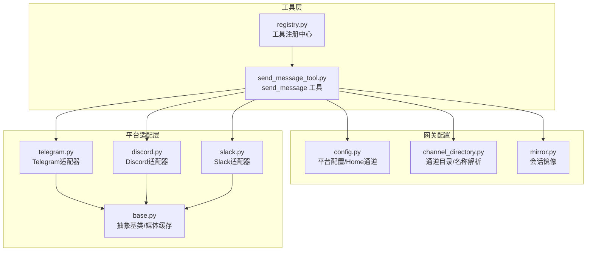
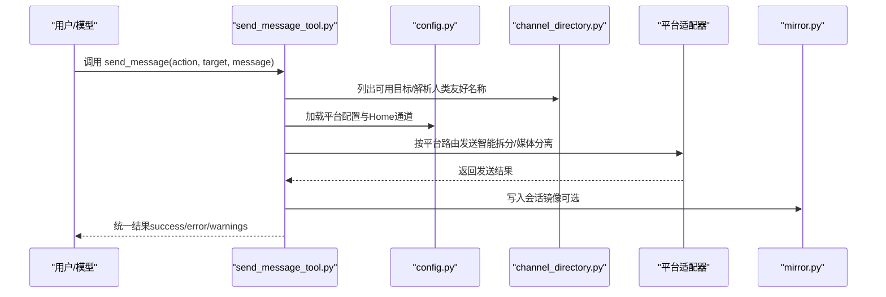
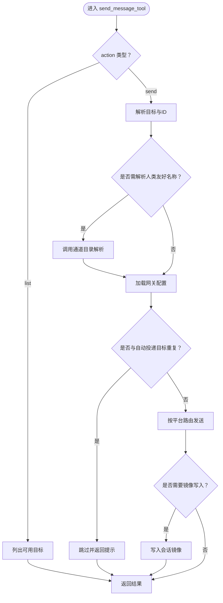
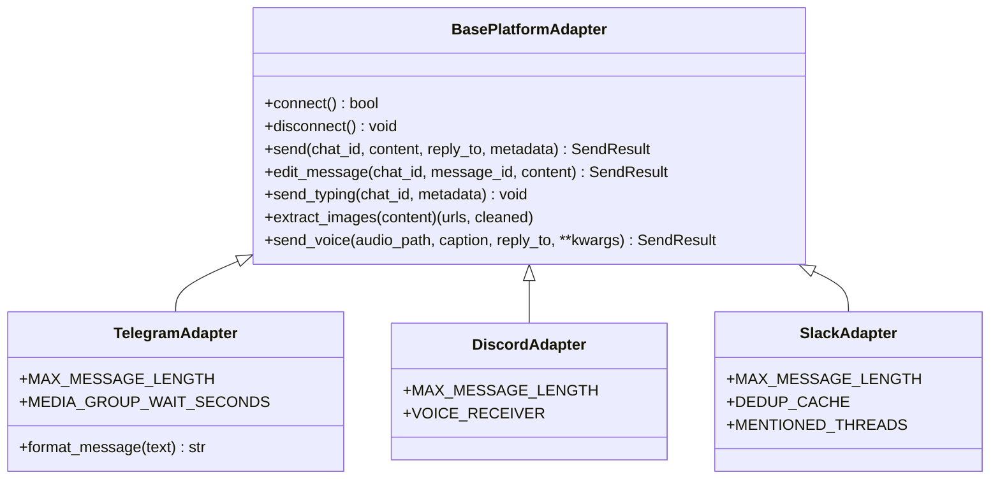
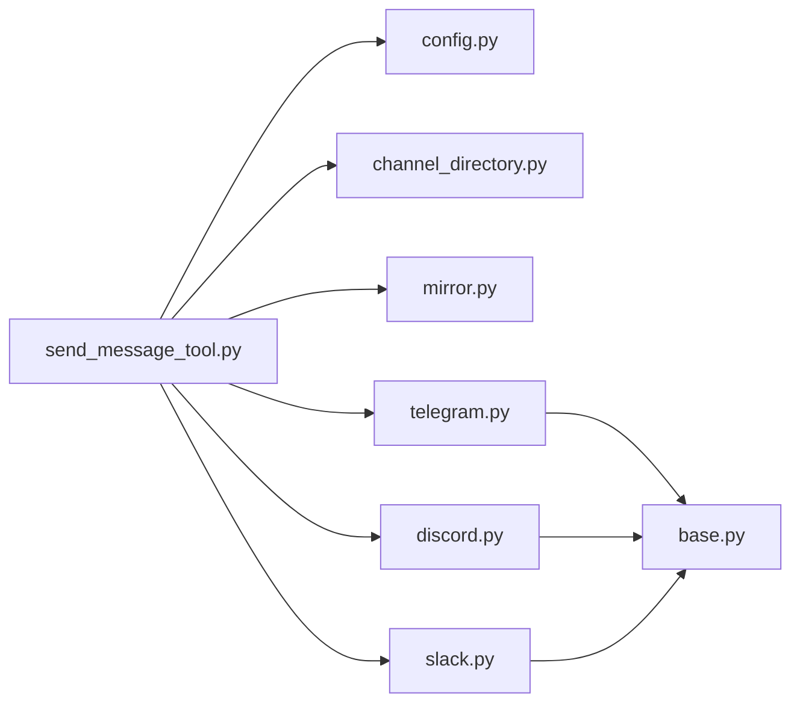

# 通信工具

<cite>
**本文引用的文件**
- [send_message_tool.py](file://tools/send_message_tool.py)
- [DESCRIPTION.md](file://optional-skills/communication/DESCRIPTION.md)
- [SKILL.md](file://optional-skills/communication/one-three-one-rule/SKILL.md)
- [base.py](file://gateway/platforms/base.py)
- [channel_directory.py](file://gateway/channel_directory.py)
- [config.py](file://gateway/config.py)
- [telegram.py](file://gateway/platforms/telegram.py)
- [discord.py](file://gateway/platforms/discord.py)
- [slack.py](file://gateway/platforms/slack.py)
- [mirror.py](file://gateway/mirror.py)
- [registry.py](file://tools/registry.py)
</cite>

## 目录
1. [简介](#简介)
2. [项目结构](#项目结构)
3. [核心组件](#核心组件)
4. [架构总览](#架构总览)
5. [详细组件分析](#详细组件分析)
6. [依赖关系分析](#依赖关系分析)
7. [性能考量](#性能考量)
8. [故障排查指南](#故障排查指南)
9. [结论](#结论)
10. [附录](#附录)

## 简介
本文件面向Hermes Agent的“通信工具”可选技能，系统性阐述其设计理念、One-Three-One决策框架的应用场景与实践方法，并深入解析通信工具的配置、使用流程（消息格式、发送策略、接收处理）、与系统其他模块的协作方式，以及性能优化与安全配置建议。读者无需具备深厚技术背景，也可通过本指南快速上手并高效使用。

## 项目结构
围绕通信工具的关键代码分布在以下位置：
- 工具实现：tools/send_message_tool.py 提供跨平台消息发送能力与目标解析
- 平台适配：gateway/platforms 下各平台适配器（Telegram、Discord、Slack等）负责具体协议交互
- 配置管理：gateway/config.py 定义平台配置、Home通道与会话重置策略
- 通道目录：gateway/channel_directory.py 提供可用目标列表与名称解析
- 会话镜像：gateway/mirror.py 将发送内容镜像到会话中以增强上下文
- 工具注册：tools/registry.py 统一注册与分发工具调用

图表来源
- [send_message_tool.py:1-953](file://tools/send_message_tool.py#L1-L953)
- [config.py:1-958](file://gateway/config.py#L1-L958)
- [channel_directory.py:1-272](file://gateway/channel_directory.py#L1-L272)
- [mirror.py:1-133](file://gateway/mirror.py#L1-L133)
- [base.py:1-800](file://gateway/platforms/base.py#L1-L800)
- [telegram.py:1-200](file://gateway/platforms/telegram.py#L1-L200)
- [discord.py:1-200](file://gateway/platforms/discord.py#L1-L200)
- [slack.py:1-200](file://gateway/platforms/slack.py#L1-L200)
- [registry.py:1-200](file://tools/registry.py#L1-L200)

章节来源
- [send_message_tool.py:1-953](file://tools/send_message_tool.py#L1-L953)
- [config.py:1-958](file://gateway/config.py#L1-L958)
- [channel_directory.py:1-272](file://gateway/channel_directory.py#L1-L272)
- [mirror.py:1-133](file://gateway/mirror.py#L1-L133)
- [base.py:1-800](file://gateway/platforms/base.py#L1-L800)
- [telegram.py:1-200](file://gateway/platforms/telegram.py#L1-L200)
- [discord.py:1-200](file://gateway/platforms/discord.py#L1-L200)
- [slack.py:1-200](file://gateway/platforms/slack.py#L1-L200)
- [registry.py:1-200](file://tools/registry.py#L1-L200)

## 核心组件
- send_message 工具：统一入口，支持列出可用目标、按目标发送消息；内置重复发送去重、媒体提取、错误红化与镜像写入
- 平台适配器：Telegram/Discord/Slack等适配器实现各自API调用、消息长度限制与富文本处理
- 通道目录：构建并维护各平台可用频道/联系人清单，支持人类友好名称解析
- 配置系统：集中管理平台启用状态、凭据、Home通道与会话策略
- 会话镜像：将发送内容写入目标会话，便于接收侧获得上下文
- 工具注册：统一暴露工具Schema与处理器，供模型选择与调用

章节来源
- [send_message_tool.py:80-953](file://tools/send_message_tool.py#L80-L953)
- [base.py:470-800](file://gateway/platforms/base.py#L470-L800)
- [channel_directory.py:60-272](file://gateway/channel_directory.py#L60-L272)
- [config.py:48-401](file://gateway/config.py#L48-L401)
- [mirror.py:25-133](file://gateway/mirror.py#L25-L133)
- [registry.py:45-200](file://tools/registry.py#L45-L200)

## 架构总览
通信工具的端到端流程如下：
- 用户或模型调用 send_message 工具
- 解析目标参数，必要时先列出可用目标并解析人类友好名称
- 加载网关配置，校验平台启用状态与凭据
- 智能拆分长消息，按平台限制进行分片发送
- 对于Telegram等支持原生媒体的平台，分离文本与媒体后逐段发送
- 发送成功后，如存在镜像条件，将发送内容写入目标会话
- 返回统一结果结构，含成功/失败、消息ID、警告等

图表来源
- [send_message_tool.py:80-410](file://tools/send_message_tool.py#L80-L410)
- [channel_directory.py:178-272](file://gateway/channel_directory.py#L178-L272)
- [config.py:415-662](file://gateway/config.py#L415-L662)
- [mirror.py:25-63](file://gateway/mirror.py#L25-L63)

## 详细组件分析

### One-Three-One 决策框架
- 设计理念：以“问题-选项-推荐-定义完成-实施计划”的结构化输出，帮助用户在多方案中快速聚焦关键权衡与落地步骤
- 应用场景：技术选型（架构/工具/迁移路径）、方案对比、需要向团队/干系人汇报的提案
- 使用要点：明确问题边界、提供三个真实差异化的选项、给出基于上下文的推荐与可验证的完成标准、配套可执行的实施计划

章节来源
- [SKILL.md:1-104](file://optional-skills/communication/one-three-one-rule/SKILL.md#L1-L104)
- [DESCRIPTION.md:1-2](file://optional-skills/communication/DESCRIPTION.md#L1-L2)

### send_message 工具
- 功能概览
  - 列出可用目标：返回各平台已知频道/联系人清单，便于模型选择
  - 发送消息：支持裸平台名（走Home通道）与带目标限定的精确投递
  - 目标解析：将人类友好名称解析为平台ID，支持Telegram话题/飞书ID等特殊格式
  - 去重保护：检测与“自动投递”目标一致的重复发送请求，避免冗余
  - 错误红化：对敏感信息进行脱敏，降低泄露风险
  - 镜像写入：将发送内容写入目标会话，增强接收侧上下文
- 消息格式与发送策略
  - 文本消息：按平台最大长度拆分，保留代码块边界与分片标识
  - 媒体消息：仅Telegram支持原生媒体发送；其他平台若仅传媒体将被忽略并提示
  - 富文本：Telegram自动MarkdownV2转义与回退；Matrix将Markdown转换为HTML
  - 环境变量：支持通过环境变量覆盖部分平台配置（如Home通道、Token等）
- 接收处理
  - 通道目录：启动时构建并周期刷新，保存至本地缓存文件
  - 名称解析：支持精确匹配、带服务器限定的匹配与前缀匹配（唯一时）
  - 会话镜像：在发送成功后写入JSONL与SQLite，确保接收侧可见发送记录

图表来源
- [send_message_tool.py:80-300](file://tools/send_message_tool.py#L80-L300)
- [channel_directory.py:178-272](file://gateway/channel_directory.py#L178-L272)
- [mirror.py:25-63](file://gateway/mirror.py#L25-L63)

章节来源
- [send_message_tool.py:80-953](file://tools/send_message_tool.py#L80-L953)
- [channel_directory.py:178-272](file://gateway/channel_directory.py#L178-L272)
- [mirror.py:25-133](file://gateway/mirror.py#L25-L133)

### 平台适配器（Telegram/Discord/Slack）
- 共同特性
  - 统一抽象基类：定义连接/断开、发送、编辑、打字指示、媒体发送等接口
  - 媒体缓存：图片/音频/文档本地缓存，提升后续处理效率
  - 错误模式：区分瞬时网络错误与不可重试错误，支持自动重连与致命错误标记
- Telegram
  - 支持论坛话题线程、MarkdownV2富文本、媒体组批量发送
  - 自动回退：当MarkdownV2解析失败时回退为纯文本
- Discord
  - 支持Socket模式/REST API；线程归档时间配置；语音接收与解码
- Slack
  - Socket Mode连接；多工作区支持；事件去重与提及线程跟踪

图表来源
- [base.py:470-800](file://gateway/platforms/base.py#L470-L800)
- [telegram.py:111-150](file://gateway/platforms/telegram.py#L111-L150)
- [discord.py:1-200](file://gateway/platforms/discord.py#L1-L200)
- [slack.py:53-98](file://gateway/platforms/slack.py#L53-L98)

章节来源
- [base.py:470-800](file://gateway/platforms/base.py#L470-L800)
- [telegram.py:111-200](file://gateway/platforms/telegram.py#L111-L200)
- [discord.py:1-200](file://gateway/platforms/discord.py#L1-L200)
- [slack.py:53-200](file://gateway/platforms/slack.py#L53-L200)

### 通道目录与名称解析
- 构建策略：从适配器枚举（Discord/Slack）与会话历史（Telegram/WhatsApp/Signal/Email/SMS）合并生成
- 显示格式：按平台分组，Discord按服务器聚合，显示人类友好名称与类型
- 解析策略：精确匹配、带服务器限定匹配、前缀唯一匹配（避免歧义）

章节来源
- [channel_directory.py:60-272](file://gateway/channel_directory.py#L60-L272)

### 配置系统与Home通道
- 平台配置：集中管理启用状态、Token/API Key、Home通道、回复线程模式等
- 连接判定：根据配置与环境变量判断平台是否可用
- Home通道：当仅指定平台名时，默认发送至该平台Home通道

章节来源
- [config.py:48-401](file://gateway/config.py#L48-L401)
- [config.py:415-662](file://gateway/config.py#L415-L662)

### 会话镜像
- 目标：在发送后将“发送镜像”写入目标会话，使接收侧具备发送上下文
- 实现：扫描sessions索引定位会话ID，分别追加到JSONL与SQLite数据库

章节来源
- [mirror.py:25-133](file://gateway/mirror.py#L25-L133)

### 工具注册与分发
- 注册：工具在模块级注册Schema、处理器、工具集与可用性检查函数
- 分发：按工具名查找并执行，异步处理器通过桥接运行

章节来源
- [registry.py:45-200](file://tools/registry.py#L45-L200)

## 依赖关系分析
- send_message_tool 依赖
  - 配置系统：读取平台启用状态与凭据
  - 通道目录：列出目标与解析名称
  - 平台适配器：按平台路由发送
  - 会话镜像：发送成功后写入镜像
  - 中断检测：避免在中断状态下继续发送
- 平台适配器依赖
  - 抽象基类：统一接口与媒体缓存
  - 环境变量：Token/Home通道等
  - 第三方SDK：对应平台客户端库

图表来源
- [send_message_tool.py:1-953](file://tools/send_message_tool.py#L1-L953)
- [config.py:1-958](file://gateway/config.py#L1-L958)
- [channel_directory.py:1-272](file://gateway/channel_directory.py#L1-L272)
- [mirror.py:1-133](file://gateway/mirror.py#L1-L133)
- [base.py:1-800](file://gateway/platforms/base.py#L1-L800)
- [telegram.py:1-200](file://gateway/platforms/telegram.py#L1-L200)
- [discord.py:1-200](file://gateway/platforms/discord.py#L1-L200)
- [slack.py:1-200](file://gateway/platforms/slack.py#L1-L200)

章节来源
- [send_message_tool.py:1-953](file://tools/send_message_tool.py#L1-L953)
- [config.py:1-958](file://gateway/config.py#L1-L958)
- [channel_directory.py:1-272](file://gateway/channel_directory.py#L1-L272)
- [mirror.py:1-133](file://gateway/mirror.py#L1-L133)
- [base.py:1-800](file://gateway/platforms/base.py#L1-L800)
- [telegram.py:1-200](file://gateway/platforms/telegram.py#L1-L200)
- [discord.py:1-200](file://gateway/platforms/discord.py#L1-L200)
- [slack.py:1-200](file://gateway/platforms/slack.py#L1-L200)

## 性能考量
- 智能拆分与分片
  - 针对有长度限制的平台，自动拆分消息并在边界处保留代码块与分片标识，减少重复传输
- 媒体处理
  - 仅Telegram支持原生媒体发送；其他平台媒体会被忽略并提示，避免无效网络往返
- 缓存与复用
  - 图片/音频/文档本地缓存，减少重复下载与网络抖动影响
- 去重与节流
  - 检测与“自动投递”目标一致的重复发送请求，避免冗余
- 异常与重试
  - 区分瞬时网络错误与不可重试错误，避免对幂等性不友好的操作重复尝试

[本节为通用指导，无需特定文件引用]

## 故障排查指南
- 常见错误与定位
  - 未知平台：确认平台名称拼写与配置启用状态
  - 未配置凭据：检查对应环境变量或配置文件中的Token/API Key
  - 目标解析失败：使用列出目标功能确认可用名称，或直接使用ID
  - 重复发送被跳过：检查是否与自动投递目标一致
  - 媒体发送受限：仅Telegram支持原生媒体；其他平台媒体会被忽略
- 日志与调试
  - 查看工具返回的错误信息与警告字段
  - 检查会话镜像是否写入成功
  - 核对平台适配器连接状态与致命错误标记

章节来源
- [send_message_tool.py:140-220](file://tools/send_message_tool.py#L140-L220)
- [channel_directory.py:178-272](file://gateway/channel_directory.py#L178-L272)
- [mirror.py:25-63](file://gateway/mirror.py#L25-L63)

## 结论
通信工具通过统一的send_message接口、完善的平台适配与会话镜像机制，实现了跨平台、可解释、可审计的消息投递。结合One-Three-One决策框架，用户可在复杂技术决策中快速形成结构化提案，提升沟通效率与决策质量。配合合理的性能优化与安全配置，通信工具能够在多种场景下稳定、高效地服务于Agent的对外沟通需求。

[本节为总结性内容，无需特定文件引用]

## 附录

### 配置与使用速查
- 列出可用目标
  - 调用 send_message(action="list") 获取当前已知目标清单
- 发送至Home通道
  - 直接使用平台名称（如 "telegram"），将发送至该平台的Home通道
- 精确投递
  - 使用 "平台:目标" 格式，例如 "telegram:-1001234567890:17585"
- 人类友好名称解析
  - 若目标为名称而非ID，先列出目标再解析，或直接使用ID
- 媒体发送
  - 仅Telegram支持原生媒体；其他平台仅文本有效

章节来源
- [send_message_tool.py:80-300](file://tools/send_message_tool.py#L80-L300)
- [channel_directory.py:178-272](file://gateway/channel_directory.py#L178-L272)