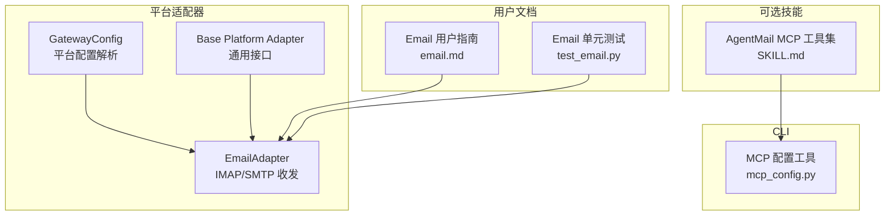
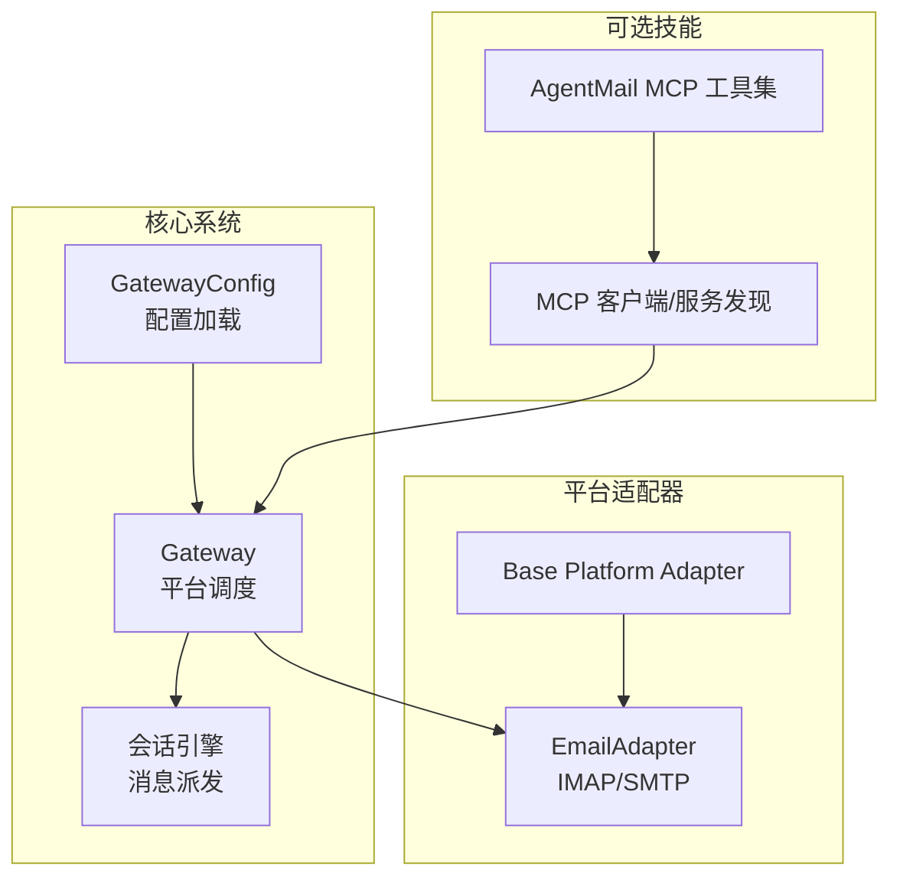
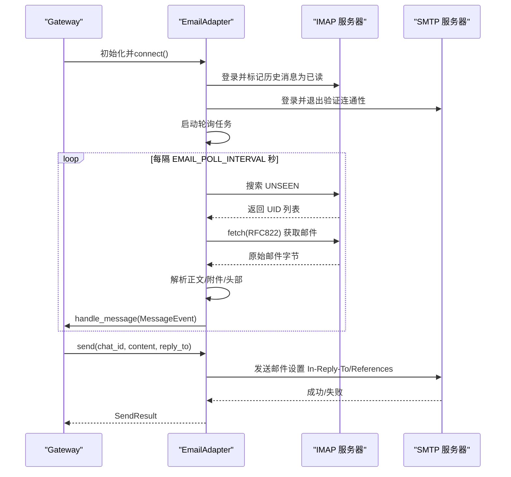
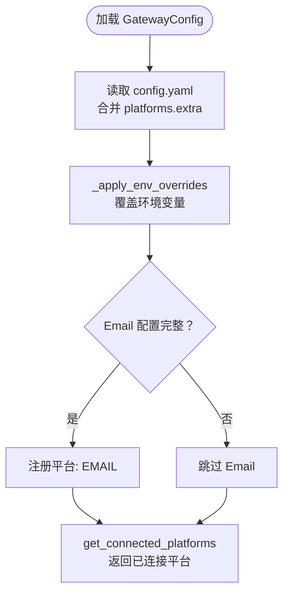
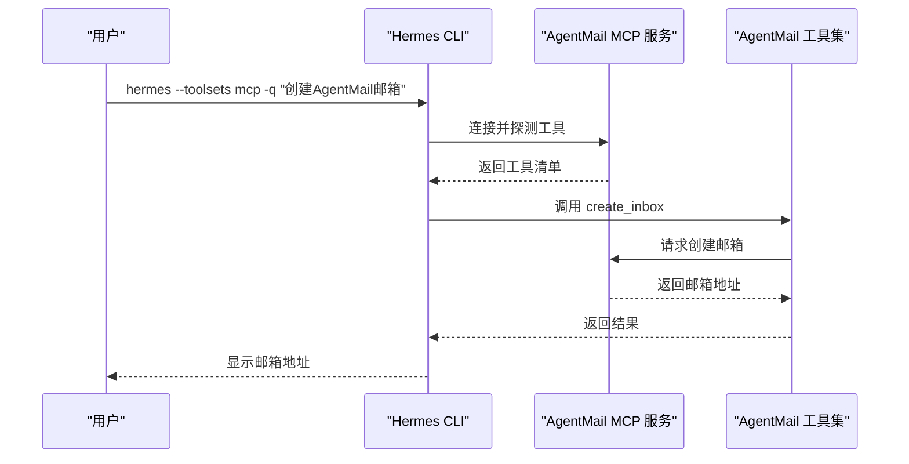
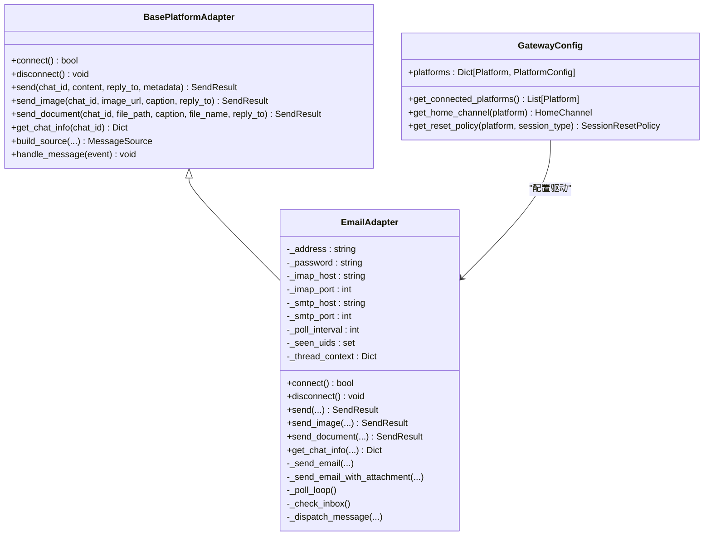
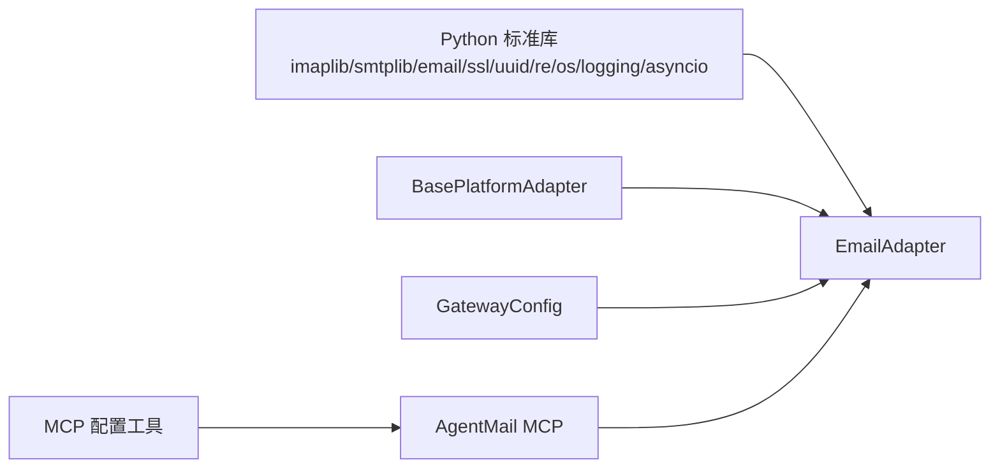

# 邮件工具

<cite>
**本文引用的文件**
- [SKILL.md](file://optional-skills/email/agentmail/SKILL.md)
- [email.py](file://gateway/platforms/email.py)
- [config.py](file://gateway/config.py)
- [email.md](file://website/docs/user-guide/messaging/email.md)
- [test_email.py](file://tests/gateway/test_email.py)
- [base.py](file://gateway/platforms/base.py)
- [mcp_config.py](file://hermes_cli/mcp_config.py)
</cite>

## 目录
1. [简介](#简介)
2. [项目结构](#项目结构)
3. [核心组件](#核心组件)
4. [架构总览](#架构总览)
5. [详细组件分析](#详细组件分析)
6. [依赖关系分析](#依赖关系分析)
7. [性能考量](#性能考量)
8. [故障排除指南](#故障排除指南)
9. [结论](#结论)
10. [附录](#附录)

## 简介
本文件面向Hermes Agent的“邮件工具”能力，系统性介绍两类邮件相关技能：
- 内置的IMAP/SMTP邮箱平台：通过标准协议实现收发邮件、附件缓存、线程管理等。
- 可选技能AgentMail（MCP）：提供“代理拥有”的专用邮箱地址，支持创建/管理邮箱、收发与转发邮件、下载附件等。

文档覆盖功能特性、配置方法（含SMTP/IMAP、认证、收发流程）、实际使用示例（自动回复、邮件模板、附件处理）、与核心系统的集成方式、安全注意事项、性能优化与故障排除。

## 项目结构
邮件工具涉及以下关键模块与文件：
- 可选技能：AgentMail MCP工具集（通过mcp_servers在config.yaml中声明）
- 平台适配器：EmailAdapter（IMAP接收、SMTP发送、附件缓存、线程上下文）
- 配置加载：GatewayConfig（解析环境变量与config.yaml，构建平台配置）
- 文档与测试：用户指南、单元测试、CLI MCP配置工具

图表来源
- [email.py:1-622](file://gateway/platforms/email.py#L1-L622)
- [config.py:48-662](file://gateway/config.py#L48-L662)
- [base.py:1-200](file://gateway/platforms/base.py#L1-L200)
- [email.md:1-191](file://website/docs/user-guide/messaging/email.md#L1-L191)
- [test_email.py:1-200](file://tests/gateway/test_email.py#L1-L200)
- [mcp_config.py:79-224](file://hermes_cli/mcp_config.py#L79-L224)
- [SKILL.md:1-126](file://optional-skills/email/agentmail/SKILL.md#L1-L126)

章节来源
- [email.py:1-622](file://gateway/platforms/email.py#L1-L622)
- [config.py:48-662](file://gateway/config.py#L48-L662)
- [email.md:1-191](file://website/docs/user-guide/messaging/email.md#L1-L191)
- [test_email.py:1-200](file://tests/gateway/test_email.py#L1-L200)
- [mcp_config.py:79-224](file://hermes_cli/mcp_config.py#L79-L224)
- [SKILL.md:1-126](file://optional-skills/email/agentmail/SKILL.md#L1-L126)

## 核心组件
- EmailAdapter（IMAP/SMTP平台适配器）
  - 负责连接IMAP/SMTP、轮询收件箱、解析邮件正文与附件、构建消息事件并派发给会话引擎；支持回复时的In-Reply-To/References线程头。
  - 提供发送文本、图片URL、带附件的邮件能力，并对重复UID进行去重。
- GatewayConfig（平台配置）
  - 解析环境变量与config.yaml，识别启用的平台；Email平台通过extra.address判断是否启用。
- AgentMail MCP工具集（可选技能）
  - 通过mcp_servers在config.yaml中声明，提供创建/删除邮箱、列出/获取线程、发送/回复/转发邮件、下载附件等工具。
- CLI MCP配置工具
  - 支持添加/移除MCP服务器、探测工具清单、保存到config.yaml。

章节来源
- [email.py:217-622](file://gateway/platforms/email.py#L217-L622)
- [config.py:48-662](file://gateway/config.py#L48-L662)
- [SKILL.md:36-68](file://optional-skills/email/agentmail/SKILL.md#L36-L68)
- [mcp_config.py:79-224](file://hermes_cli/mcp_config.py#L79-L224)

## 架构总览
下图展示邮件工具在系统中的位置与交互关系。

图表来源
- [email.py:217-622](file://gateway/platforms/email.py#L217-L622)
- [config.py:48-662](file://gateway/config.py#L48-L662)
- [base.py:1-200](file://gateway/platforms/base.py#L1-L200)
- [SKILL.md:36-68](file://optional-skills/email/agentmail/SKILL.md#L36-L68)
- [mcp_config.py:79-224](file://hermes_cli/mcp_config.py#L79-L224)

## 详细组件分析

### EmailAdapter（IMAP/SMTP平台适配器）
- 连接与初始化
  - 从环境变量读取EMAIL_ADDRESS、EMAIL_PASSWORD、EMAIL_IMAP_HOST、EMAIL_IMAP_PORT、EMAIL_SMTP_HOST、EMAIL_SMTP_PORT、EMAIL_POLL_INTERVAL。
  - 启动时先测试IMAP登录并标记历史消息为已读，再测试SMTP登录并退出，最后启动轮询任务。
- 轮询与去重
  - 每隔EMAIL_POLL_INTERVAL秒执行一次IMAP轮询，使用UNSEEN标记新邮件；维护seen_uids集合防止重复处理；超过阈值时按UID数值裁剪集合。
- 接收流程
  - 解析From/Subject/Message-ID/In-Reply-To等头部；过滤自动化/noreply来源；提取纯文本正文（优先plain，其次html并剥离标签）；提取附件并缓存到本地（图片走图像缓存，其他文档走文档缓存）。
  - 构建MessageEvent并派发给会话引擎，同时维护每个发送者的消息上下文（主题与Message-ID）用于回复线程。
- 发送流程
  - 发送文本或带附件的邮件；自动设置Re:前缀、In-Reply-To/References、Message-ID；支持将图片URL作为正文附加说明。
- 错误处理
  - SMTP发送失败时确保调用quit/close；IMAP异常时记录错误并返回空结果；线程上下文仅在成功发送后更新。

图表来源
- [email.py:268-622](file://gateway/platforms/email.py#L268-L622)

章节来源
- [email.py:217-622](file://gateway/platforms/email.py#L217-L622)

### GatewayConfig（平台配置）
- 平台枚举与连接判定
  - 平台类型包含EMAIL；Email平台通过extra.address存在性判断是否启用。
- 环境变量覆盖
  - 从环境变量读取各平台令牌、端口、轮询间隔、允许用户列表等；Email平台通过extra字段承载地址/IMAP/SMTP配置。
- 默认行为与校验
  - 对无效参数进行警告与回退；对空令牌发出连接失败提示。

图表来源
- [config.py:48-662](file://gateway/config.py#L48-L662)

章节来源
- [config.py:48-662](file://gateway/config.py#L48-L662)

### AgentMail MCP 工具集（可选技能）
- 功能概览
  - 创建/删除邮箱、列出/获取邮箱、列出/获取线程、发送/回复/转发邮件、更新消息状态、下载附件。
- 配置方式
  - 在config.yaml中通过mcp_servers声明AgentMail MCP服务器（命令行与环境变量），并在重启后自动可用。
- 使用场景
  - 自动注册/验证、对外主动 outreach、多账号隔离与线程管理。

图表来源
- [SKILL.md:36-68](file://optional-skills/email/agentmail/SKILL.md#L36-L68)
- [mcp_config.py:79-224](file://hermes_cli/mcp_config.py#L79-L224)

章节来源
- [SKILL.md:1-126](file://optional-skills/email/agentmail/SKILL.md#L1-L126)
- [mcp_config.py:79-224](file://hermes_cli/mcp_config.py#L79-L224)

### 类关系与数据结构

图表来源
- [email.py:217-622](file://gateway/platforms/email.py#L217-L622)
- [base.py:1-200](file://gateway/platforms/base.py#L1-L200)
- [config.py:218-401](file://gateway/config.py#L218-L401)

章节来源
- [email.py:217-622](file://gateway/platforms/email.py#L217-L622)
- [base.py:1-200](file://gateway/platforms/base.py#L1-L200)
- [config.py:218-401](file://gateway/config.py#L218-L401)

## 依赖关系分析
- EmailAdapter依赖
  - Python标准库：imaplib、smtplib、email、ssl、uuid、re、os、logging、asyncio。
  - 基类接口：BasePlatformAdapter（统一消息事件、发送结果、媒体缓存等抽象）。
- 配置依赖
  - GatewayConfig负责从环境变量与config.yaml加载Email平台配置（extra.address、extra.skip_attachments等）。
- MCP依赖
  - hermes_cli/mcp_config.py提供MCP服务器增删改查、探测工具清单、写入config.yaml的能力。

图表来源
- [email.py:18-45](file://gateway/platforms/email.py#L18-L45)
- [base.py:1-200](file://gateway/platforms/base.py#L1-L200)
- [config.py:48-662](file://gateway/config.py#L48-L662)
- [mcp_config.py:79-224](file://hermes_cli/mcp_config.py#L79-L224)
- [SKILL.md:36-68](file://optional-skills/email/agentmail/SKILL.md#L36-L68)

章节来源
- [email.py:18-45](file://gateway/platforms/email.py#L18-L45)
- [config.py:48-662](file://gateway/config.py#L48-L662)
- [mcp_config.py:79-224](file://hermes_cli/mcp_config.py#L79-L224)
- [SKILL.md:36-68](file://optional-skills/email/agentmail/SKILL.md#L36-L68)

## 性能考量
- 轮询频率与连接开销
  - 默认轮询间隔为15秒；可通过EMAIL_POLL_INTERVAL降低延迟但增加IMAP连接次数。
- 历史消息处理
  - 启动时标记所有现有消息为已读，避免重复处理；seen_uids集合上限为2000，超过则按UID裁剪，防止内存膨胀。
- 附件处理
  - 图片缓存至本地以供视觉工具使用；可配置跳过附件以节省带宽与防护风险。
- 线程上下文
  - 维护每个发送者的主题与Message-ID，便于正确回复与In-Reply-To链路。

章节来源
- [email.py:229-267](file://gateway/platforms/email.py#L229-L267)
- [email.py:316-326](file://gateway/platforms/email.py#L316-L326)
- [email.py:335-399](file://gateway/platforms/email.py#L335-L399)
- [email.md:122-133](file://website/docs/user-guide/messaging/email.md#L122-L133)

## 故障排除指南
- 连接失败
  - IMAP连接失败：检查EMAIL_IMAP_HOST/EMAIL_IMAP_PORT，确认账户已开启IMAP。
  - SMTP连接失败：检查EMAIL_SMTP_HOST/EMAIL_SMTP_PORT，使用应用密码（如Gmail）。
- 认证失败
  - Gmail需启用两步验证并生成应用密码；不要使用常规密码。
- 消息未到达
  - 确认EMAIL_ALLOWED_USERS包含发件人邮箱；检查垃圾箱，部分提供商可能将自动化回复标记为垃圾。
- 重复回复
  - 确保仅运行一个网关实例；使用“hermes gateway status”检查。
- 回复未正确线程化
  - 某些Web客户端可能不完全遵循In-Reply-To头；尽量使用原生桌面/移动客户端。
- 其他建议
  - 减少轮询间隔可加速响应但增加连接数；根据网络与提供商限制调整。

章节来源
- [email.md:150-161](file://website/docs/user-guide/messaging/email.md#L150-L161)
- [email.py:1082-1113](file://gateway/platforms/email.py#L1082-L1113)

## 结论
Hermes Agent提供了两条邮件路径：
- 内置IMAP/SMTP平台适配器：适合直接对接现有邮箱账户，具备标准协议的收发、附件缓存与线程管理能力。
- AgentMail MCP工具集：适合需要“代理拥有”的专用邮箱地址，便于自动化注册、对外 outreach 与多账号管理。

两者均可与核心系统无缝集成，通过GatewayConfig与CLI MCP工具完成配置与运维。在生产环境中，务必遵循安全最佳实践（专用邮箱、应用密码、访问控制）并结合性能参数进行调优。

## 附录

### 配置参考（IMAP/SMTP）
- 必填项
  - EMAIL_ADDRESS：代理邮箱地址
  - EMAIL_PASSWORD：应用密码（Gmail需开启2FA并生成应用密码）
  - EMAIL_IMAP_HOST：IMAP服务器主机
  - EMAIL_SMTP_HOST：SMTP服务器主机
- 可选项
  - EMAIL_IMAP_PORT：默认993
  - EMAIL_SMTP_PORT：默认587
  - EMAIL_POLL_INTERVAL：轮询间隔（秒，默认15）
  - EMAIL_ALLOWED_USERS：允许交互的发件人邮箱列表（逗号分隔）
  - EMAIL_HOME_ADDRESS：定时任务默认投递目标

章节来源
- [email.md:56-76](file://website/docs/user-guide/messaging/email.md#L56-L76)
- [email.md:177-191](file://website/docs/user-guide/messaging/email.md#L177-L191)

### AgentMail MCP 配置参考
- 在config.yaml中添加mcp_servers：
  - 命令行：npx -y agentmail-mcp
  - 环境变量：AGENTMAIL_API_KEY（以am_开头）
- 启动后自动暴露11个工具，包括创建/删除邮箱、列出/获取线程、发送/回复/转发邮件、下载附件等。

章节来源
- [SKILL.md:36-68](file://optional-skills/email/agentmail/SKILL.md#L36-L68)

### 实际使用示例（概念性）
- 自动回复
  - 接收邮件后，基于线程上下文自动生成回复；设置In-Reply-To/References保持线程连续。
- 邮件模板
  - 将常用模板存储为文件并通过send_document附加；或在回复中拼接固定格式。
- 附件处理
  - 接收图片自动缓存到本地，供视觉工具分析；发送文件时自动编码为附件。

章节来源
- [email.py:461-622](file://gateway/platforms/email.py#L461-L622)
- [email.md:118-133](file://website/docs/user-guide/messaging/email.md#L118-L133)

### 安全注意事项
- 使用专用邮箱，避免使用个人邮箱。
- 使用应用密码而非主密码（Gmail需启用2FA）。
- 设置EMAIL_ALLOWED_USERS限制交互范围。
- 密码存储于~/.hermes/.env，注意文件权限（建议chmod 600）。
- 默认IMAP使用SSL（993），SMTP使用STARTTLS（587）。

章节来源
- [email.md:164-174](file://website/docs/user-guide/messaging/email.md#L164-L174)