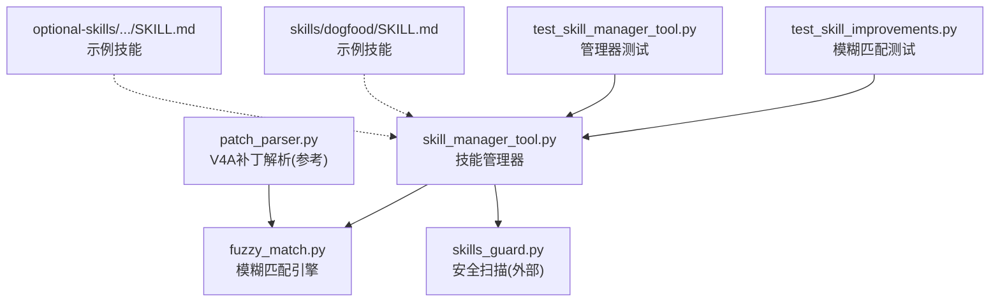
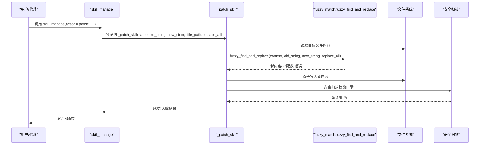
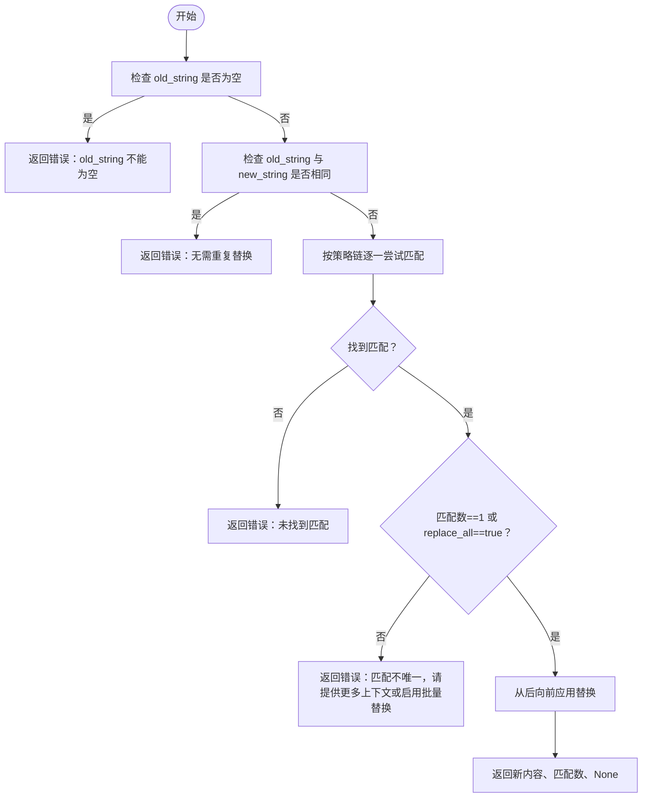
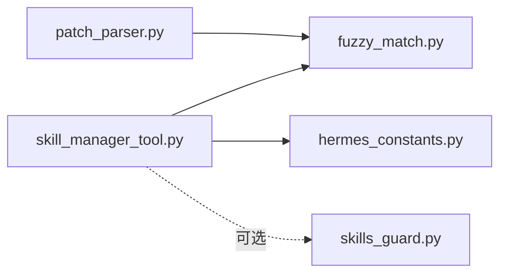

# 技能修补

<cite>
**本文引用的文件**
- [tools/skill_manager_tool.py](file://tools/skill_manager_tool.py)
- [tools/fuzzy_match.py](file://tools/fuzzy_match.py)
- [tools/patch_parser.py](file://tools/patch_parser.py)
- [tests/tools/test_skill_improvements.py](file://tests/tools/test_skill_improvements.py)
- [tests/tools/test_skill_manager_tool.py](file://tests/tools/test_skill_manager_tool.py)
- [skills/dogfood/SKILL.md](file://skills/dogfood/SKILL.md)
- [optional-skills/autonomous-ai-agents/blackbox/SKILL.md](file://optional-skills/autonomous-ai-agents/blackbox/SKILL.md)
</cite>

## 目录
1. [简介](#简介)
2. [项目结构](#项目结构)
3. [核心组件](#核心组件)
4. [架构总览](#架构总览)
5. [详细组件分析](#详细组件分析)
6. [依赖关系分析](#依赖关系分析)
7. [性能考量](#性能考量)
8. [故障排查指南](#故障排查指南)
9. [结论](#结论)
10. [附录](#附录)

## 简介
本文件面向Hermes Agent的“技能修补”能力，系统性说明如何使用 skill_manage 函数的 patch 动作进行精确文本替换。重点覆盖：
- 目标定位：默认修改 SKILL.md，也可通过 file_path 参数修补支持文件
- 模糊匹配：自动处理空白符规范化、缩进差异、转义序列等
- 批量替换：replace_all 参数可一次性替换全部匹配项
- 实际用法：修复错误、更新过时信息、补充缺失步骤
- 安全与回滚：写入前原子化写入、安全扫描、失败时回滚

## 项目结构
与技能修补直接相关的核心模块与测试如下：
- 工具层
  - 技能管理器：tools/skill_manager_tool.py
  - 模糊匹配引擎：tools/fuzzy_match.py
  - V4A补丁解析（用于对比理解）：tools/patch_parser.py
- 测试层
  - 技能改进测试：tests/tools/test_skill_improvements.py
  - 技能管理工具测试：tests/tools/test_skill_manager_tool.py
- 示例技能
  - 系统内置示例：skills/dogfood/SKILL.md
  - 可选技能示例：optional-skills/autonomous-ai-agents/blackbox/SKILL.md

图表来源
- [tools/skill_manager_tool.py:369-452](file://tools/skill_manager_tool.py#L369-L452)
- [tools/fuzzy_match.py:50-100](file://tools/fuzzy_match.py#L50-L100)
- [tools/patch_parser.py:68-206](file://tools/patch_parser.py#L68-L206)
- [tests/tools/test_skill_improvements.py:1-175](file://tests/tools/test_skill_improvements.py#L1-L175)
- [tests/tools/test_skill_manager_tool.py:272-326](file://tests/tools/test_skill_manager_tool.py#L272-L326)

章节来源
- [tools/skill_manager_tool.py:1-743](file://tools/skill_manager_tool.py#L1-L743)
- [tools/fuzzy_match.py:1-483](file://tools/fuzzy_match.py#L1-L483)
- [tools/patch_parser.py:1-456](file://tools/patch_parser.py#L1-L456)
- [tests/tools/test_skill_improvements.py:1-175](file://tests/tools/test_skill_improvements.py#L1-L175)
- [tests/tools/test_skill_manager_tool.py:272-326](file://tests/tools/test_skill_manager_tool.py#L272-L326)

## 核心组件
- skill_manage：统一入口，分发到具体动作处理器（create/edit/patch/delete/write_file/remove_file）
- _patch_skill：核心修补逻辑，负责定位目标文件、调用模糊匹配、执行替换、校验与回滚
- fuzzy_find_and_replace：多策略模糊匹配引擎，按严格程度依次尝试，确保在格式差异下仍能精准命中
- 安全扫描与回滚：写入后进行安全扫描，若阻断则回滚；原子写入避免部分写入

章节来源
- [tools/skill_manager_tool.py:569-627](file://tools/skill_manager_tool.py#L569-L627)
- [tools/skill_manager_tool.py:369-452](file://tools/skill_manager_tool.py#L369-L452)
- [tools/fuzzy_match.py:50-100](file://tools/fuzzy_match.py#L50-L100)

## 架构总览
技能修补的整体流程如下：
- 输入：action=patch，name，old_string，new_string，可选 file_path，replace_all
- 解析与校验：检查必填参数、目标技能是否存在、目标文件是否存在
- 模糊匹配：调用 fuzzy_find_and_replace，按策略链查找唯一或全部匹配
- 写入与校验：原子写入新内容，校验大小限制与frontmatter结构
- 安全扫描：对技能目录进行扫描，必要时回滚
- 返回结果：成功或失败，含消息、路径、替换数量等

图表来源
- [tools/skill_manager_tool.py:569-627](file://tools/skill_manager_tool.py#L569-L627)
- [tools/skill_manager_tool.py:369-452](file://tools/skill_manager_tool.py#L369-L452)
- [tools/fuzzy_match.py:50-100](file://tools/fuzzy_match.py#L50-L100)

## 详细组件分析

### skill_manage 与 _patch_skill
- 参数约束
  - 必需：action、name
  - patch：old_string 必须提供；new_string 必须提供（可为空字符串表示删除）
  - 可选：file_path（支持文件路径）、replace_all（是否批量替换）
- 目标定位
  - 默认 SKILL.md；若提供 file_path，则定位到支持文件（references/templates/scripts/assets 下）
- 匹配与替换
  - 调用 fuzzy_find_and_replace，返回新内容、匹配数与错误
  - 若 replace_all=False 且匹配数>1，报错提示提供更多上下文或开启批量替换
- 写入与校验
  - 原子写入；校验内容大小；若修补的是 SKILL.md，还需校验 frontmatter 结构
- 安全与回滚
  - 写入后进行安全扫描；若阻断则回滚至原始内容

章节来源
- [tools/skill_manager_tool.py:569-627](file://tools/skill_manager_tool.py#L569-L627)
- [tools/skill_manager_tool.py:369-452](file://tools/skill_manager_tool.py#L369-L452)

### 模糊匹配引擎 fuzzy_find_and_replace
- 多策略链（严格到宽松）：
  1) 精确匹配
  2) 行级去空白（逐行首尾去空格）
  3) 空白归一化（多个空格/制表归一为空格）
  4) 缩进无关（忽略缩进差异）
  5) 转义归一化（如 \n、\t、\r）
  6) 边界仅去空白（仅首尾行去空白）
  7) 锚定块匹配（首尾行锚定，中段相似度阈值）
  8) 上下文感知（逐行相似度阈值，要求半数以上行相似）
- 位置映射与替换
  - 将匹配位置映射回原文字符索引，从后向前替换，保证位置稳定
- replace_all 行为
  - True：返回全部匹配并一次性替换
  - False：若匹配数>1则报错，要求更明确的上下文

图表来源
- [tools/fuzzy_match.py:50-100](file://tools/fuzzy_match.py#L50-L100)
- [tools/fuzzy_match.py:103-123](file://tools/fuzzy_match.py#L103-L123)

章节来源
- [tools/fuzzy_match.py:50-100](file://tools/fuzzy_match.py#L50-L100)
- [tools/fuzzy_match.py:103-123](file://tools/fuzzy_match.py#L103-L123)

### 安全扫描与回滚
- 写入后对技能目录执行安全扫描
- 若扫描阻断，立即回滚到原始内容
- 原子写入确保中间态不会持久化

章节来源
- [tools/skill_manager_tool.py:56-74](file://tools/skill_manager_tool.py#L56-L74)
- [tools/skill_manager_tool.py:443-447](file://tools/skill_manager_tool.py#L443-L447)

### 使用示例与最佳实践

- 修复技能中的拼写错误
  - 场景：SKILL.md 中某步骤描述有错别字
  - 方法：提供足够上下文的 old_string，确保唯一匹配；或开启 replace_all 批量修正
  - 参考：[tests/tools/test_skill_improvements.py:46-51](file://tests/tools/test_skill_improvements.py#L46-L51)

- 更新过时命令或路径
  - 场景：示例命令已变更，需要统一更新
  - 方法：使用模糊匹配容忍缩进差异，确保替换准确
  - 参考：[tests/tools/test_skill_improvements.py:87-96](file://tests/tools/test_skill_improvements.py#L87-L96)

- 批量替换重复内容
  - 场景：同一段落出现多次，希望一次性修正
  - 方法：设置 replace_all=True
  - 参考：[tests/tools/test_skill_improvements.py:127-131](file://tests/tools/test_skill_improvements.py#L127-L131)

- 修补支持文件
  - 场景：references/ 或 scripts/ 下的辅助文件需要更新
  - 方法：提供 file_path 指向具体文件
  - 参考：[tests/tools/test_skill_improvements.py:145-153](file://tests/tools/test_skill_improvements.py#L145-L153)

- 保持 SKILL.md 结构完整
  - 场景：修补后仍需满足 frontmatter 规范
  - 方法：_patch_skill 在修补 SKILL.md 时会再次校验 frontmatter
  - 参考：[tests/tools/test_skill_improvements.py:158-161](file://tests/tools/test_skill_improvements.py#L158-L161)

- 获取文件预览以便自纠
  - 场景：找不到匹配时，返回文件前缀便于模型调整输入
  - 参考：[tests/tools/test_skill_improvements.py:135-137](file://tests/tools/test_skill_improvements.py#L135-L137)

章节来源
- [tests/tools/test_skill_improvements.py:46-175](file://tests/tools/test_skill_improvements.py#L46-L175)
- [tests/tools/test_skill_manager_tool.py:272-326](file://tests/tools/test_skill_manager_tool.py#L272-L326)

## 依赖关系分析
- skill_manager_tool 依赖
  - fuzzy_match：用于模糊匹配
  - skills_guard：安全扫描（可选导入）
  - hermes_constants：获取 HOME 路径
- fuzzy_match 独立模块，提供多策略匹配
- patch_parser 提供 V4A 补丁解析思路，便于理解“上下文感知”和“锚定块”的思想

图表来源
- [tools/skill_manager_tool.py:42-53](file://tools/skill_manager_tool.py#L42-L53)
- [tools/fuzzy_match.py:1-30](file://tools/fuzzy_match.py#L1-L30)
- [tools/patch_parser.py:210-222](file://tools/patch_parser.py#L210-L222)

章节来源
- [tools/skill_manager_tool.py:42-53](file://tools/skill_manager_tool.py#L42-L53)
- [tools/patch_parser.py:210-222](file://tools/patch_parser.py#L210-L222)

## 性能考量
- 模糊匹配策略链按严格程度递减，通常能在前几个策略快速命中，避免全链路扫描
- 逐行相似度计算与序列相似度在长文本上可能带来额外开销，但策略链设计已尽量减少不必要的全量比较
- 建议在提供 old_string 时尽可能包含足够的上下文，以减少策略链尝试次数并提升命中率

## 故障排查指南
- “未找到匹配”
  - 可能原因：old_string 过短或过于通用
  - 处理建议：增加上下文，使匹配唯一；或启用 replace_all
  - 参考：[tests/tools/test_skill_improvements.py:135-137](file://tests/tools/test_skill_improvements.py#L135-L137)

- “匹配不唯一”
  - 可能原因：未启用 replace_all 且存在多个匹配
  - 处理建议：提供更明确的上下文，或开启批量替换
  - 参考：[tests/tools/test_skill_improvements.py:111-113](file://tests/tools/test_skill_improvements.py#L111-L113)

- “frontmatter 结构被破坏”
  - 可能原因：替换导致 YAML 结构异常
  - 处理建议：确保 new_string 不破坏 frontmatter；必要时先用 edit 完整重写
  - 参考：[tests/tools/test_skill_improvements.py:158-161](file://tests/tools/test_skill_improvements.py#L158-L161)

- “安全扫描阻断”
  - 可能原因：写入内容触发安全规则
  - 处理建议：回滚后修正内容，重新提交
  - 参考：[tools/skill_manager_tool.py:443-447](file://tools/skill_manager_tool.py#L443-L447)

章节来源
- [tests/tools/test_skill_improvements.py:111-161](file://tests/tools/test_skill_improvements.py#L111-L161)
- [tools/skill_manager_tool.py:443-447](file://tools/skill_manager_tool.py#L443-L447)

## 结论
Hermes Agent 的技能修补通过“精确+模糊”的组合策略，既保证了高精度替换，又有效规避了格式差异带来的误匹配问题。配合原子写入、大小限制、frontmatter 校验与安全扫描，能够在保障稳定性的同时，高效地维护技能知识库。建议在日常使用中：
- 优先使用 patch 动作进行小范围修正
- 提供充分上下文以确保唯一匹配
- 对于大规模改动，优先考虑 edit 动作
- 使用 replace_all 时谨慎评估影响范围

## 附录

### API 与参数说明
- action: "patch"
- name: 技能名称（必须存在）
- old_string: 待替换文本（必填）
- new_string: 替换文本（必填；可为空字符串表示删除）
- file_path: 支持文件路径（可选，默认 SKILL.md）
- replace_all: 是否批量替换（布尔，默认 False）

章节来源
- [tools/skill_manager_tool.py:634-721](file://tools/skill_manager_tool.py#L634-L721)

### 示例技能参考
- 系统内置示例：[skills/dogfood/SKILL.md:1-162](file://skills/dogfood/SKILL.md#L1-L162)
- 可选技能示例：[optional-skills/autonomous-ai-agents/blackbox/SKILL.md:1-144](file://optional-skills/autonomous-ai-agents/blackbox/SKILL.md#L1-L144)